# [[HackTheBox] Blocky](https://app.hackthebox.eu/machines/48)

**Date**: 13/Nov/2019  
**Categories**: [oscp](https://github.com/7h3rAm/writeups/search?q=oscp&unscoped_q=oscp), [htb](https://github.com/7h3rAm/writeups/search?q=htb&unscoped_q=htb), [linux](https://github.com/7h3rAm/writeups/search?q=linux&unscoped_q=linux)  
**Tags**: [enumerate_app_wordpress](https://github.com/7h3rAm/writeups/search?q=enumerate_app_wordpress&unscoped_q=enumerate_app_wordpress), [exploit_wordpress_plugin](https://github.com/7h3rAm/writeups/search?q=exploit_wordpress_plugin&unscoped_q=exploit_wordpress_plugin), [exploit_credsreuse](https://github.com/7h3rAm/writeups/search?q=exploit_credsreuse&unscoped_q=exploit_credsreuse), [privesc_sudoers](https://github.com/7h3rAm/writeups/search?q=privesc_sudoers&unscoped_q=privesc_sudoers)  

## Overview
This is a writeup for HackTheBox VM [Blocky](https://app.hackthebox.eu/machines/48). Here are stats for this machine from [machinescli](https://github.com/7h3rAm/machinescli):


### Killchain
Here's the killchain (`enumeration` → `exploitation` → `privilege escalation`) for this machine:

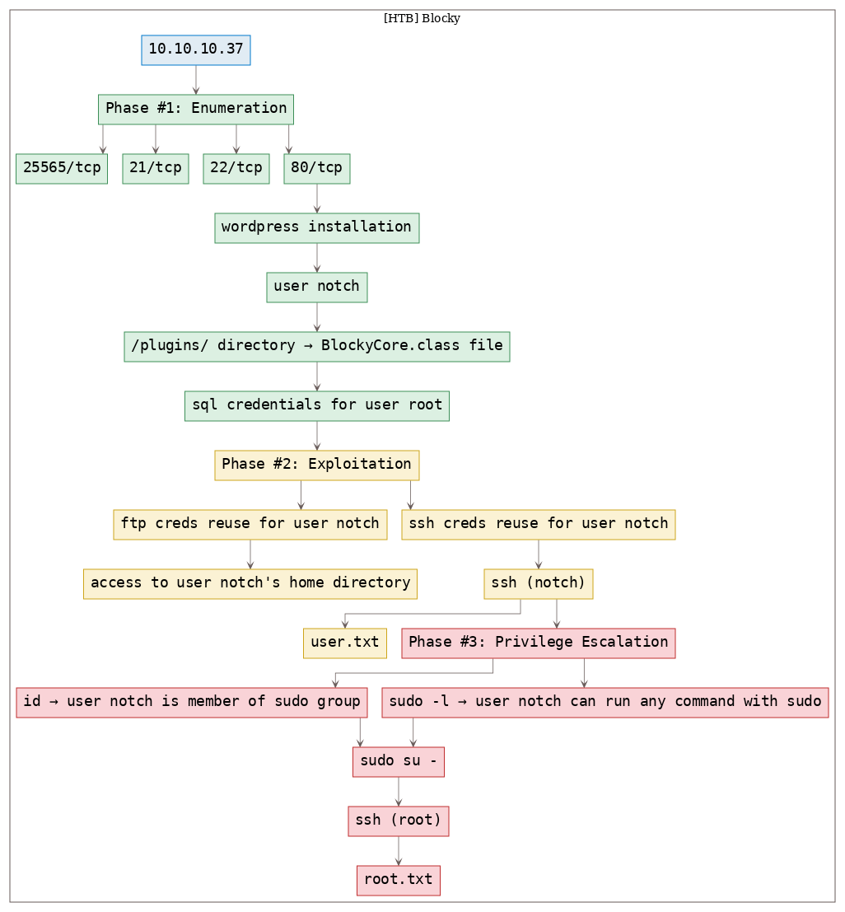


### TTPs
1\. `80/tcp/http/Apache httpd 2.4.18 ((Ubuntu))`: [enumerate_app_wordpress](https://github.com/7h3rAm/writeups#enumerate_app_wordpress), [exploit_wordpress_plugin](https://github.com/7h3rAm/writeups#exploit_wordpress_plugin), [exploit_credsreuse](https://github.com/7h3rAm/writeups#exploit_credsreuse), [privesc_sudoers](https://github.com/7h3rAm/writeups#privesc_sudoers)  


\newpage
## Phase #1: Enumeration
1\. Here's the Nmap scan result:  
``` {.python .numberLines}
# Nmap 7.70 scan initiated Wed Nov 13 12:25:27 2019 as: nmap -vv --reason -Pn -sV -sC --version-all -oN /root/toolbox/writeups/htb.blocky/results/10.10.10.37/scans/_quick_tcp_nmap.txt -oX /root/toolbox/writeups/htb.blocky/results/10.10.10.37/scans/xml/_quick_tcp_nmap.xml 10.10.10.37
Nmap scan report for 10.10.10.37
Host is up, received user-set (0.073s latency).
Scanned at 2019-11-13 12:25:28 PST for 18s
Not shown: 996 filtered ports
Reason: 996 no-responses
PORT     STATE  SERVICE REASON         VERSION
21/tcp   open   ftp     syn-ack ttl 63 ProFTPD 1.3.5a
22/tcp   open   ssh     syn-ack ttl 63 OpenSSH 7.2p2 Ubuntu 4ubuntu2.2 (Ubuntu Linux; protocol 2.0)
| ssh-hostkey:
|   2048 d6:2b:99:b4:d5:e7:53:ce:2b:fc:b5:d7:9d:79:fb:a2 (RSA)
| ssh-rsa AAAAB3NzaC1yc2EAAAADAQABAAABAQDXqVh031OUgTdcXsDwffHKL6T9f1GfJ1/x/b/dywX42sDZ5m1Hz46bKmbnWa0YD3LSRkStJDtyNXptzmEp31Fs2DUndVKui3LCcyKXY6FSVWp9ZDBzlW3aY8qa+y339OS3gp3aq277zYDnnA62U7rIltYp91u5VPBKi3DITVaSgzA8mcpHRr30e3cEGaLCxty58U2/lyCnx3I0Lh5rEbipQ1G7Cr6NMgmGtW6LrlJRQiWA1OK2/tDZbLhwtkjB82pjI/0T2gpA/vlZJH0elbMXW40Et6bOs2oK/V2bVozpoRyoQuts8zcRmCViVs8B3p7T1Qh/Z+7Ki91vgicfy4fl
|   256 5d:7f:38:95:70:c9:be:ac:67:a0:1e:86:e7:97:84:03 (ECDSA)
| ecdsa-sha2-nistp256 AAAAE2VjZHNhLXNoYTItbmlzdHAyNTYAAAAIbmlzdHAyNTYAAABBBNgEpgEZGGbtm5suOAio9ut2hOQYLN39Uhni8i4E/Wdir1gHxDCLMoNPQXDOnEUO1QQVbioUUMgFRAXYLhilNF8=
|   256 09:d5:c2:04:95:1a:90:ef:87:56:25:97:df:83:70:67 (ED25519)
|_ssh-ed25519 AAAAC3NzaC1lZDI1NTE5AAAAILqVrP5vDD4MdQ2v3ozqDPxG1XXZOp5VPpVsFUROL6Vj
80/tcp   open   http    syn-ack ttl 63 Apache httpd 2.4.18 ((Ubuntu))
|_http-generator: WordPress 4.8
| http-methods:
|_  Supported Methods: GET HEAD POST OPTIONS
|_http-server-header: Apache/2.4.18 (Ubuntu)
|_http-title: BlockyCraft &#8211; Under Construction!
8192/tcp closed sophos  reset ttl 63
Service Info: OSs: Unix, Linux; CPE: cpe:/o:linux:linux_kernel

Read data files from: /usr/bin/../share/nmap
Service detection performed. Please report any incorrect results at https://nmap.org/submit/ .
# Nmap done at Wed Nov 13 12:25:46 2019 -- 1 IP address (1 host up) scanned in 18.38 seconds

```

2\. Here's the summary of open ports and associated [AutoRecon](https://github.com/Tib3rius/AutoRecon) scan files:  

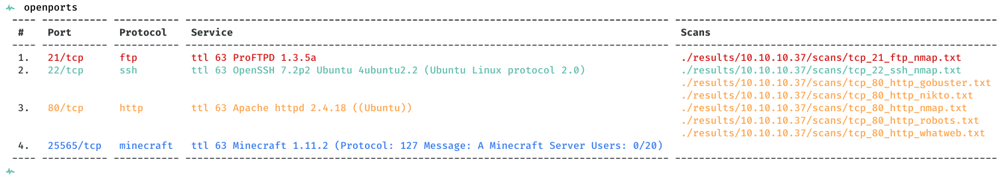  

3\. We find a Wordpress installation and manually find a username `notch`. Attempts to login via common default credentials failed:  

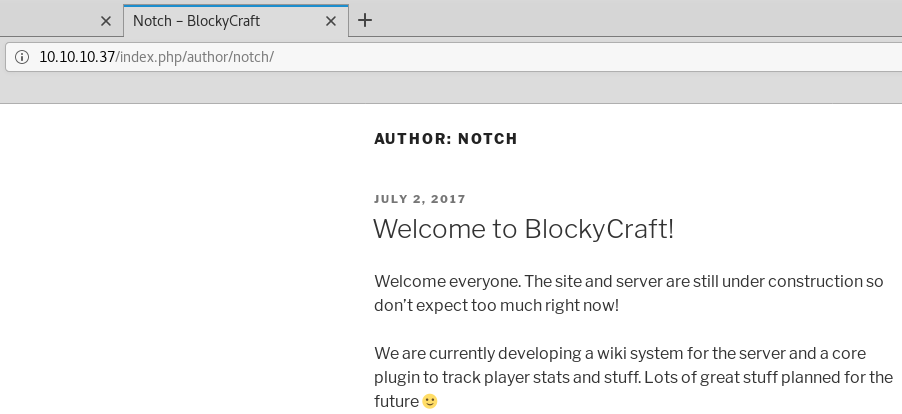  

4\. We find a `plugins` directory that lists two `jar` files. We download those and find hardcoded SQL credentials for user `root` in the `BlockyCore.class` file:  

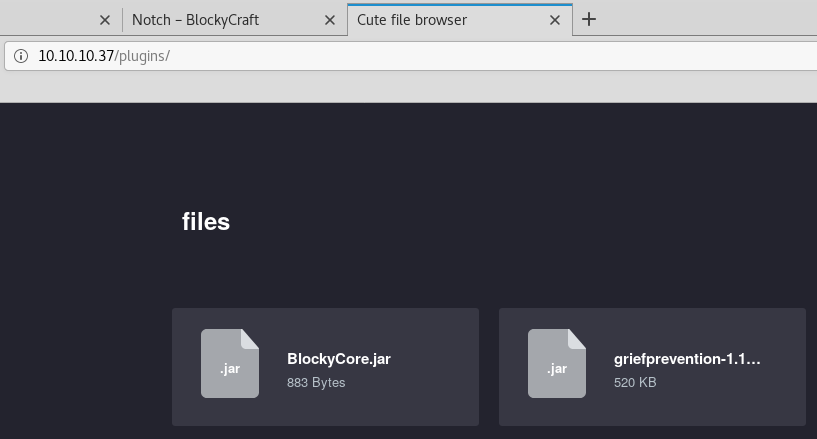  

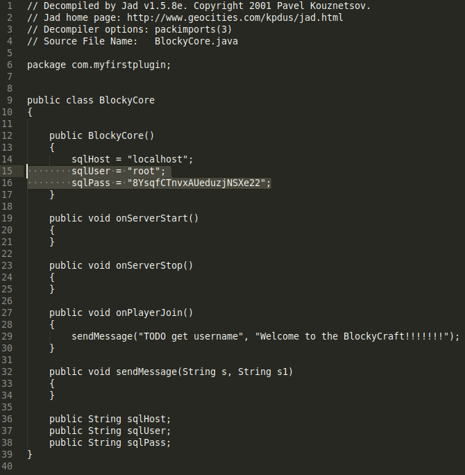  


### Findings
#### Open Ports
``` {.python .numberLines}
21/tcp     |  ftp        |  ProFTPD 1.3.5a
22/tcp     |  ssh        |  OpenSSH 7.2p2 Ubuntu 4ubuntu2.2 (Ubuntu Linux; protocol 2.0)
80/tcp     |  http       |  Apache httpd 2.4.18 ((Ubuntu))
25565/tcp  |  minecraft  |  Minecraft 1.11.2 (Protocol: 127 Message: A Minecraft Server   Users: 0/20)
```
#### Files
``` {.python .numberLines}
http://10.10.10.37/plugins/
```
#### Users
``` {.python .numberLines}
wordpress: notch
```

\newpage
## Phase #2: Exploitation
1\. We successfully login via FTP as user `notch` with password found in the `BlockCore.class` file. We find that the FTP root directory is set to the user `notch`'s home directory:  

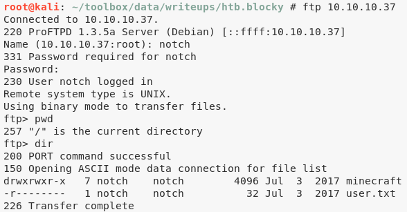  

2\. We also successfully gain interactive SSH access using the same credentials as above which gives us access to the first flag file, `user.txt`:  

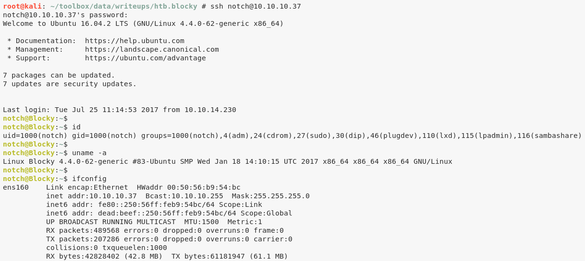  

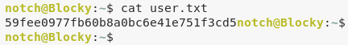  


## Phase #2.5: Post Exploitation
``` {.python .numberLines}
notch@Blocky> id
uid=1000(notch) gid=1000(notch) groups=1000(notch),4(adm),24(cdrom),27(sudo),30(dip),46(plugdev),110(lxd),115(lpadmin),116(sambashare)
notch@Blocky>  
notch@Blocky> uname
Linux Blocky 4.4.0-62-generic #83-Ubuntu SMP Wed Jan 18 14:10:15 UTC 2017 x86_64 x86_64 x86_64 GNU/Linux
notch@Blocky>  
notch@Blocky> ifconfig
ens160  Link encap:Ethernet  HWaddr 00:50:56:b9:54:bc
        inet addr:10.10.10.37  Bcast:10.10.10.255  Mask:255.255.255.0
        inet6 addr: fe80::250:56ff:feb9:54bc/64 Scope:Link
        inet6 addr: dead:beef::250:56ff:feb9:54bc/64 Scope:Global
        UP BROADCAST RUNNING MULTICAST  MTU:1500  Metric:1
        RX packets:490347 errors:0 dropped:0 overruns:0 frame:0
        TX packets:207569 errors:0 dropped:0 overruns:0 carrier:0
        collisions:0 txqueuelen:1000
        RX bytes:42901509 (42.9 MB)  TX bytes:61223429 (61.2 MB)
notch@Blocky>  
notch@Blocky> users
root
notch
```

\newpage
## Phase #3: Privilege Escalation
1\. From the output of the `id` command and also confirming via `sudo -l`, we know that the user `notch` is a member of the `sudo` group. This means we can switch to `root` and gain elevated privileges:  

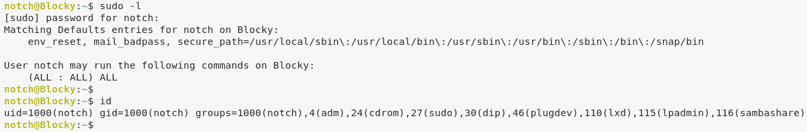  

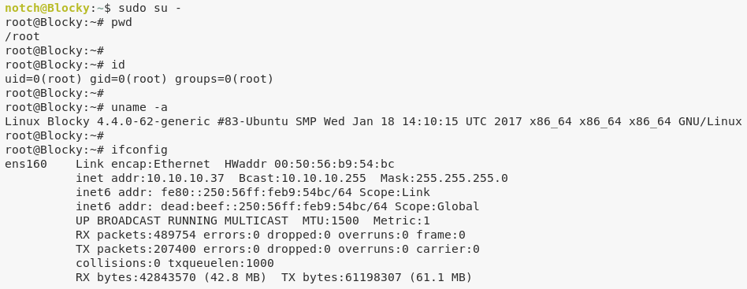  

2\. We then read the contents of `root.txt` file to complete the challenge:  

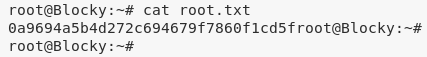  


\newpage

## Loot
### Hashes
``` {.python .numberLines}
notch:$6$RdxVAN/.$DFugS5p/G9hTNY9htDWVGKte9n9r/nYYL.wVdAHfiHpnyN9dNftf5Nt.DkjrUs0PlYNcYZWhh0Vhl/5tl........................
```
### Credentials
``` {.python .numberLines}
ftp: notch/8YsqfCTnvxAUeduzj......
ssh: notch/8YsqfCTnvxAUeduzj......
```
### Flags
``` {.python .numberLines}
/home/notch/user.txt: 59fee0977fb60b8a0bc6e...........
/root/root.txt: 0a9694a5b4d272c694679f..........
```

## References
[+] <https://app.hackthebox.eu/machines/48>  
[+] <https://www.youtube.com/watch?v=C2O-rilXA6I>  
