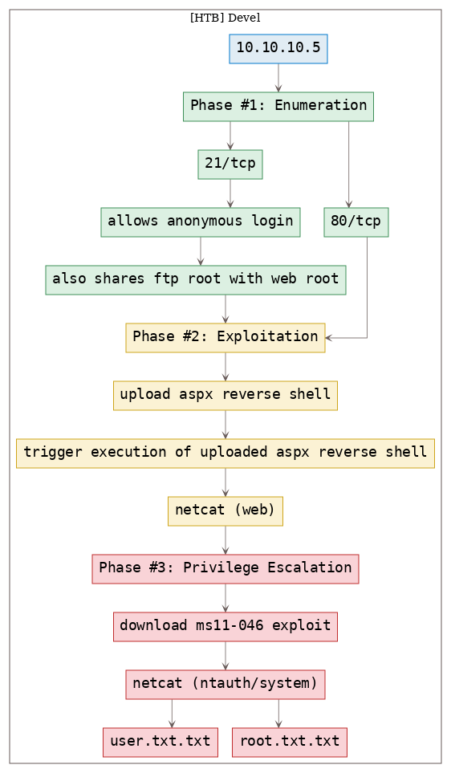

# [[HackTheBox] Devel](https://www.hackthebox.eu/home/machines/profile/3)

**Date**: 05/Nov/2019  
**Categories**: [oscp](https://github.com/7h3rAm/writeups/search?q=oscp&unscoped_q=oscp), [htb](https://github.com/7h3rAm/writeups/search?q=htb&unscoped_q=htb), [windows](https://github.com/7h3rAm/writeups/search?q=windows&unscoped_q=windows)  
**Tags**: [exploit_ftp_anonymous](https://github.com/7h3rAm/writeups/search?q=exploit_ftp_anonymous&unscoped_q=exploit_ftp_anonymous), [exploit_ftp_web_root](https://github.com/7h3rAm/writeups/search?q=exploit_ftp_web_root&unscoped_q=exploit_ftp_web_root), [exploit_iis_asp_reverseshell](https://github.com/7h3rAm/writeups/search?q=exploit_iis_asp_reverseshell&unscoped_q=exploit_iis_asp_reverseshell), [privesc_windows_ms11_046](https://github.com/7h3rAm/writeups/search?q=privesc_windows_ms11_046&unscoped_q=privesc_windows_ms11_046)  

## Overview
This is a writeup for HackTheBox VM [Devel](https://www.hackthebox.eu/home/machines/profile/3). Here are stats for this machine from [machinescli](https://github.com/7h3rAm/machinescli):


### Killchain
Here's the killchain (`enumeration` → `exploitation` → `privilege escalation`) for this machine:




### TTPs
1\. `21/tcp/ftp/Microsoft ftpd`: [exploit_ftp_anonymous](https://github.com/7h3rAm/writeups#exploit_ftp_anonymous), [exploit_ftp_web_root](https://github.com/7h3rAm/writeups#exploit_ftp_web_root)  
2\. `80/tcp/http/Microsoft IIS httpd 7.5`: [exploit_iis_asp_reverseshell](https://github.com/7h3rAm/writeups#exploit_iis_asp_reverseshell), [privesc_windows_ms11_046](https://github.com/7h3rAm/writeups#privesc_windows_ms11_046)  


\newpage
## Phase #1: Enumeration
1\. Here's the Nmap scan result:  
``` {.python .numberLines}
# Nmap 7.70 scan initiated Tue Nov  5 11:28:16 2019 as: nmap -vv --reason -Pn -sV -sC --version-all -oN /root/toolbox/writeups/htb.devel/results/10.10.10.5/scans/_quick_tcp_nmap.txt -oX /root/toolbox/writeups/htb.devel/results/10.10.10.5/scans/xml/_quick_tcp_nmap.xml 10.10.10.5
Nmap scan report for 10.10.10.5
Host is up, received user-set (0.11s latency).
Scanned at 2019-11-05 11:28:18 PST for 60s
Not shown: 998 filtered ports
Reason: 998 no-responses
PORT   STATE SERVICE REASON          VERSION
21/tcp open  ftp     syn-ack ttl 127 Microsoft ftpd
| ftp-anon: Anonymous FTP login allowed (FTP code 230)
| 03-18-17  01:06AM       <DIR>          aspnet_client
| 03-17-17  04:37PM                  689 iisstart.htm
|_03-17-17  04:37PM               184946 welcome.png
| ftp-syst:
|_  SYST: Windows_NT
80/tcp open  http    syn-ack ttl 127 Microsoft IIS httpd 7.5
| http-methods:
|   Supported Methods: OPTIONS TRACE GET HEAD POST
|_  Potentially risky methods: TRACE
|_http-server-header: Microsoft-IIS/7.5
|_http-title: IIS7
Service Info: OS: Windows; CPE: cpe:/o:microsoft:windows

Read data files from: /usr/bin/../share/nmap
Service detection performed. Please report any incorrect results at https://nmap.org/submit/ .
# Nmap done at Tue Nov  5 11:29:18 2019 -- 1 IP address (1 host up) scanned in 61.93 seconds

```

2\. Here's the summary of open ports and associated [AutoRecon](https://github.com/Tib3rius/AutoRecon) scan files:  

  

3\. We find that the FTP service allows `anonymous` login and it shares directory with IIS server web root. This means we can upload `.aspx` reverse shell file via FTP and trigger it using the HTTP service:  

  

  


### Findings
#### Open Ports
``` {.python .numberLines}
21/tcp  |  ftp   |  Microsoft ftpd
80/tcp  |  http  |  Microsoft IIS httpd 7.5
```

\newpage
## Phase #2: Exploitation
1\. We create a reverse shell file using `msfvenom` and upload it to the FTP server. We then start `multi/handler` listener to catch the incoming connection and request the uploaded file via web browser to get interactive access on the target system:  

  

  

  

  

  


## Phase #2.5: Post Exploitation
``` {.python .numberLines}
web@DEVEL> id
iis apppool\web
web@DEVEL>  
web@DEVEL> uname
Host Name:                 DEVEL
OS Name:                   Microsoft Windows 7 Enterprise
OS Version:                6.1.7600 N/A Build 7600
OS Manufacturer:           Microsoft Corporation
OS Configuration:          Standalone Workstation
OS Build Type:             Multiprocessor Free
web@DEVEL>  
web@DEVEL> ifconfig
Ethernet adapter Local Area Connection:
 Connection-specific DNS Suffix  . :
 IPv4 Address. . . . . . . . . . . : 10.10.10.5
 Subnet Mask . . . . . . . . . . . : 255.255.255.0
 Default Gateway . . . . . . . . . : 10.10.10.2
web@DEVEL>  
web@DEVEL> users
Administrator
babis
```

\newpage
## Phase #3: Privilege Escalation
1\. We first upload the `netcat` binary to the target system using the FTP server and use it to get `systeminfo` output. With this, we can start exploring possible exploits for the target system:  

  

  

  

2\. Upon looking for exploits for the target system, we find [EDB:40564](https://www.exploit-db.com/exploits/40564) but it needs compilation of source file. We search and find a pre-compiled exploit from the [SecWiki/windows-kernel-exploits](https://github.com/SecWiki/windows-kernel-exploits/tree/master/MS11-046) project:  

  

3\. Once downloaded locally, we need to transfer the exploit file to the target system using the FTP server. Once done, we execute the file and gain elevated privileges:  

  

  

  

4\. We can now view the contents of the `user.txt.txt` and `root.txt.txt` files to complete the challenge:  

  

  


\newpage

## Loot
### Flags
``` {.python .numberLines}
c:\Users\babis\Desktop\user.txt.txt: 9ecdd6a3aedf24b415..............
c:\Users\Administrator\Desktop\root.txt.txt: e621a0b5041708797...............
```

## References
[+] <https://www.hackthebox.eu/home/machines/profile/3>  
[+] <https://xd3m0n.xyz/htb_devel/>  
