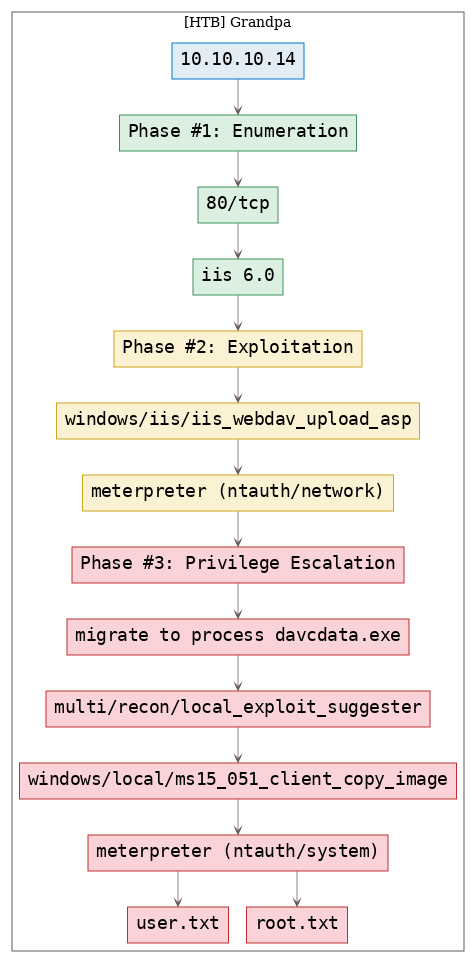
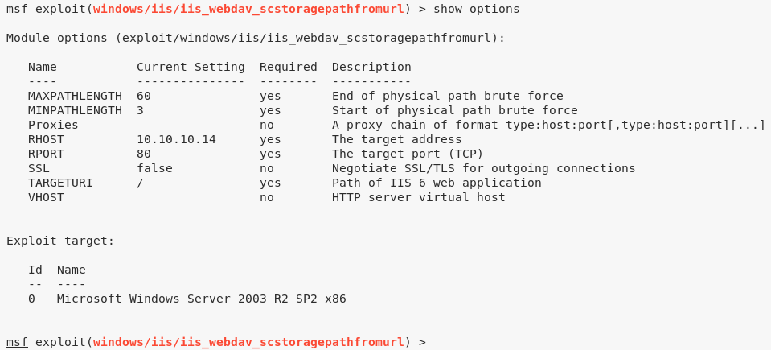
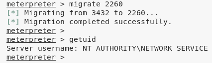
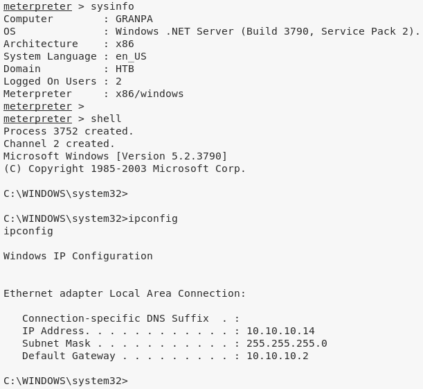

# [[HackTheBox] Grandpa](https://app.hackthebox.eu/machines/13)

**Date**: 04/Nov/2019  
**Categories**: [oscp](https://github.com/7h3rAm/writeups/search?q=oscp&unscoped_q=oscp), [htb](https://github.com/7h3rAm/writeups/search?q=htb&unscoped_q=htb), [windows](https://github.com/7h3rAm/writeups/search?q=windows&unscoped_q=windows)  
**Tags**: [exploit_iis_webdav](https://github.com/7h3rAm/writeups/search?q=exploit_iis_webdav&unscoped_q=exploit_iis_webdav), [privesc_windows_ms14_070](https://github.com/7h3rAm/writeups/search?q=privesc_windows_ms14_070&unscoped_q=privesc_windows_ms14_070)  

## Overview
This is a writeup for HackTheBox VM [Grandpa](https://app.hackthebox.eu/machines/13). Here are stats for this machine from [machinescli](https://github.com/7h3rAm/machinescli):


### Killchain
Here's the killchain (`enumeration` → `exploitation` → `privilege escalation`) for this machine:




### TTPs
1\. `80/tcp/http/Microsoft IIS httpd 6.0`: [exploit_iis_webdav](https://github.com/7h3rAm/writeups#exploit_iis_webdav), [privesc_windows_ms14_070](https://github.com/7h3rAm/writeups#privesc_windows_ms14_070)  


\newpage
## Phase #1: Enumeration
1\. Here's the Nmap scan result:  
``` {.python .numberLines}
# Nmap 7.70 scan initiated Mon Nov  4 15:43:14 2019 as: nmap -vv --reason -Pn -sV -sC --version-all -oN /root/toolbox/writeups/htb.grandpa/results/10.10.10.14/scans/_quick_tcp_nmap.txt -oX /root/toolbox/writeups/htb.grandpa/results/10.10.10.14/scans/xml/_quick_tcp_nmap.xml 10.10.10.14
Nmap scan report for 10.10.10.14
Host is up, received user-set (0.057s latency).
Scanned at 2019-11-04 15:43:15 PST for 23s
Not shown: 999 filtered ports
Reason: 999 no-responses
PORT   STATE SERVICE REASON          VERSION
80/tcp open  http    syn-ack ttl 127 Microsoft IIS httpd 6.0
| http-methods:
|   Supported Methods: OPTIONS TRACE GET HEAD COPY PROPFIND SEARCH LOCK UNLOCK DELETE PUT POST MOVE MKCOL PROPPATCH
|_  Potentially risky methods: TRACE COPY PROPFIND SEARCH LOCK UNLOCK DELETE PUT MOVE MKCOL PROPPATCH
|_http-server-header: Microsoft-IIS/6.0
|_http-title: Under Construction
| http-webdav-scan:
|   Server Type: Microsoft-IIS/6.0
|   WebDAV type: Unkown
|   Public Options: OPTIONS, TRACE, GET, HEAD, DELETE, PUT, POST, COPY, MOVE, MKCOL, PROPFIND, PROPPATCH, LOCK, UNLOCK, SEARCH
|   Allowed Methods: OPTIONS, TRACE, GET, HEAD, COPY, PROPFIND, SEARCH, LOCK, UNLOCK
|_  Server Date: Mon, 04 Nov 2019 23:43:43 GMT
Service Info: OS: Windows; CPE: cpe:/o:microsoft:windows

Read data files from: /usr/bin/../share/nmap
Service detection performed. Please report any incorrect results at https://nmap.org/submit/ .
# Nmap done at Mon Nov  4 15:43:38 2019 -- 1 IP address (1 host up) scanned in 23.46 seconds

```

2\. Here's the summary of open ports and associated [AutoRecon](https://github.com/Tib3rius/AutoRecon) scan files:  

  

3\. We look for IIS 6.0 vulnerabilities and find multiple WebDAV related hits:  

  


### Findings
#### Open Ports
``` {.python .numberLines}
80/tcp  |  http  |  Microsoft IIS httpd 6.0
```

\newpage
## Phase #2: Exploitation
1\. We decide to use the Metasploit `windows/iis/iis_webdav_scstoragepathfromurl` exploit and it successully gives us a Meterpreter shell:  

  

  


## Phase #2.5: Post Exploitation
``` {.python .numberLines}
ntauth/network@GRANPA> id
NT AUTHORITY\NETWORK SERVICE
ntauth/network@GRANPA>  
ntauth/network@GRANPA> uname
Computer        : GRANPA
OS              : Windows .NET Server (Build 3790, Service Pack 2).
Architecture    : x86
System Language : en_US
Domain          : HTB
Logged On Users : 3
Meterpreter     : x86/windows
ntauth/network@GRANPA>  
ntauth/network@GRANPA> ifconfig
Ethernet adapter Local Area Connection:
 Connection-specific DNS Suffix  . :
 IP Address. . . . . . . . . . . . : 10.10.10.14
 Subnet Mask . . . . . . . . . . . : 255.255.255.0
 Default Gateway . . . . . . . . . : 10.10.10.2
ntauth/network@GRANPA>  
ntauth/network@GRANPA> users
Administrator
Harry
```

\newpage
## Phase #3: Privilege Escalation
1\. Since we have certain restrictions that stop us from running commands like `getuid`, we have to migrate to a different process. We find the PID for process `davcdata.exe` and migrate to it:  

  

2\. We can now use the Metasploit `multi/recon/local_exploit_suggester` module to look for privesc options:  

  

3\. We tried a few exploits from this list and eventually the `windows/local/ms14_070_tcpip_ioctl` module worked and provided an elevated session:  

  

  

4\. We then obtain further information about the system and read the contents of both user.txt and root.txt files to comeplete the challenge:  
``` {.python .numberLines}
cat "C:\Documents and Settings\Harry\Desktop\user.txt"
cat "C:\Documents and Settings\Administrator\Desktop\root.txt"

```

  


\newpage

## Loot
### Hashes
``` {.python .numberLines}
Administrator:500:0a70918d669baeb307012642393148ab:34dec8a1db14cdde2a.................
ASPNET:1007:3f71d62ec68a06a39721cb3f54f04a3b:edc0d5506804653f589................
Guest:501:aad3b435b51404eeaad3b435b51404ee:31d6cfe0d16ae931b73c...............
Harry:1008:93c50499355883d1441208923e8628e6:031f5563e0ac4ba538e................
IUSR_GRANPA:1003:a274b4532c9ca5cdf684351fab962e86:6a981cb5e038b2d8b7.................
IWAM_GRANPA:1004:95d112c4da2348b599183ac6b1d67840:a97f39734c21b3f615.................
SUPPORT_388945a0:1001:aad3b435b51404eeaad3b435b51404ee:8ed3993efb4e6476e..................
```
### Flags
``` {.python .numberLines}
C:\Documents and Settings\Harry\Desktop\user.txt: bdff5ec67c3cff01................
C:\Documents and Settings\Administrator\Desktop\root.txt: 9359e905a2c35f..................
```

## References
[+] <https://app.hackthebox.eu/machines/13>  
