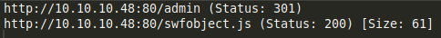
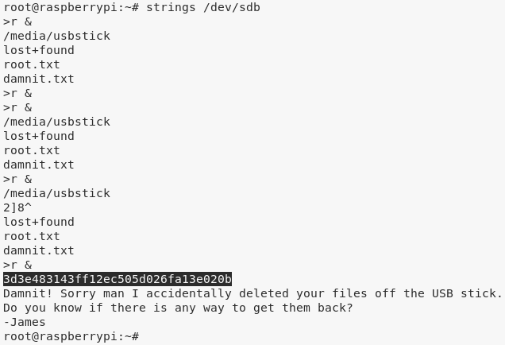

# [[HackTheBox] Mirai](https://www.hackthebox.eu/home/machines/profile/64)

**Date**: 12/Nov/2019  
**Categories**: [oscp](https://github.com/7h3rAm/writeups/search?q=oscp&unscoped_q=oscp), [htb](https://github.com/7h3rAm/writeups/search?q=htb&unscoped_q=htb), [linux](https://github.com/7h3rAm/writeups/search?q=linux&unscoped_q=linux)  
**Tags**: [`exploit_defaultcreds`](https://github.com/7h3rAm/writeups#exploit_defaultcreds), [`privesc_sudoers`](https://github.com/7h3rAm/writeups#privesc_sudoers)  
**InfoCard**:  


## Overview
This is a writeup for HTB VM [`Mirai`](https://www.hackthebox.eu/home/machines/profile/64). Here's an overview of the `enumeration` → `exploitation` → `privilege escalation` process:


\newpage
## Phase #1: Enumeration
1\. Here's the Nmap scan result:  
``` {.python .numberLines}
# Nmap 7.70 scan initiated Tue Nov 12 15:49:18 2019 as: nmap -vv --reason -Pn -sV -sC --version-all -oN /root/toolbox/writeups/htb.mirai/results/10.10.10.48/scans/_quick_tcp_nmap.txt -oX /root/toolbox/writeups/htb.mirai/results/10.10.10.48/scans/xml/_quick_tcp_nmap.xml 10.10.10.48
Increasing send delay for 10.10.10.48 from 0 to 5 due to 275 out of 915 dropped probes since last increase.
Nmap scan report for 10.10.10.48
Host is up, received user-set (0.060s latency).
Scanned at 2019-11-12 15:49:19 PST for 27s
Not shown: 997 closed ports
Reason: 997 resets
PORT   STATE SERVICE REASON         VERSION
22/tcp open  ssh     syn-ack ttl 63 OpenSSH 6.7p1 Debian 5+deb8u3 (protocol 2.0)
| ssh-hostkey:
|   1024 aa:ef:5c:e0:8e:86:97:82:47:ff:4a:e5:40:18:90:c5 (DSA)
| ssh-dss AAAAB3NzaC1kc3MAAACBAJpzaaGcmwdVrkG//X5kr6m9em2hEu3SianCnerFwTGHgUHrRpR6iocVhd8gN21TPNTwFF47q8nUitupMBnvImwAs8NcjLVclPSdFJSWwTxbaBiXOqyjV5BcKty+s2N8I9neI2coRBtZDUwUiF/1gUAZIimeKOj2x39kcBpcpM6ZAAAAFQDwL9La/FPu1rEutE8yfdIgxTDDNQAAAIBJbfYW/IeOFHPiKBzHWiM8JTjhPCcvjIkNjKMMdS6uo00/JQH4VUUTscc/LTvYmQeLAyc7GYQ/AcLgoYFHm8hDgFVN2D4BQ7yGQT9dU4GAOp4/H1wHPKlAiBuDQMsyEk2s2J+60Rt+hUKCZfnxPOoD9l+VEWfZQYCTOBi3gOAotgAAAIBd6OWkakYL2e132lg6Z02202PIq9zvAx3tfViuU9CGStiIW4eH4qrhSMiUKrhbNeCzvdcw6pRWK41+vDiQrhV12/w6JSowf9KHxvoprAGiEg7GjyvidBr9Mzv1WajlU9BQO0Nc7poV2UzyMwLYLqzdjBJT28WUs3qYTxanaUrV9g==
|   2048 e8:c1:9d:c5:43:ab:fe:61:23:3b:d7:e4:af:9b:74:18 (RSA)
| ssh-rsa AAAAB3NzaC1yc2EAAAADAQABAAABAQCpSoRAKB+cPR8bChDdajCIpf4p1zHfZyu2xnIkqRAgm6Dws2zcy+VAZriPDRUrht10GfsBLZtp/1PZpkUd2b1PKvN2YIg4SDtpvTrdwAM2uCgUrZdKRoFa+nd8REgkTg8JRYkSGQ/RxBZzb06JZhRSvLABFve3rEPVdwTf4mzzNuryV4DNctrAojjP4Sq7Msc24poQRG9AkeyS1h4zrZMbB0DQaKoyY3pss5FWJ+qa83XNsqjnKlKhSbjH17pBFhlfo/6bGkIE68vS5CQi9Phygke6/a39EP2pJp6WzT5KI3Yosex3Br85kbh/J8CVf4EDIRs5qismW+AZLeJUJHrj
|   256 b6:a0:78:38:d0:c8:10:94:8b:44:b2:ea:a0:17:42:2b (ECDSA)
| ecdsa-sha2-nistp256 AAAAE2VjZHNhLXNoYTItbmlzdHAyNTYAAAAIbmlzdHAyNTYAAABBBCl89gWp+rA+2SLZzt3r7x+9sXFOCy9g3C9Yk1S21hT/VOmlqYys1fbAvqwoVvkpRvHRzbd5CxViOVih0TeW/bM=
|   256 4d:68:40:f7:20:c4:e5:52:80:7a:44:38:b8:a2:a7:52 (ED25519)
|_ssh-ed25519 AAAAC3NzaC1lZDI1NTE5AAAAILvYtCvO/UREAhODuSsm7liSb9SZ8gLoZtn7P46SIDZL
53/tcp open  domain  syn-ack ttl 63 dnsmasq 2.76
| dns-nsid:
|_  bind.version: dnsmasq-2.76
80/tcp open  http    syn-ack ttl 63 lighttpd 1.4.35
| http-methods:
|_  Supported Methods: OPTIONS GET HEAD POST
|_http-server-header: lighttpd/1.4.35
|_http-title: Site doesn't have a title (text/html; charset=UTF-8).
Service Info: OS: Linux; CPE: cpe:/o:linux:linux_kernel

Read data files from: /usr/bin/../share/nmap
Service detection performed. Please report any incorrect results at https://nmap.org/submit/ .
# Nmap done at Tue Nov 12 15:49:46 2019 -- 1 IP address (1 host up) scanned in 27.40 seconds

```

2\. From the HTTP response headers, we find that the HTTP service is running the [PiHole](https://pi-hole.net/) project:  

  

3\. We also find an `admin` directory from the `gobuster` scan:  

  

4\. Upon visiting the `http://10.10.10.48/admin/` page, we get the default PiHole dashboard:  

  


### Findings
#### Open Ports:
``` {.python .numberLines}
22/tcp     |  ssh     |  OpenSSH 6.7p1 Debian 5+deb8u3 (protocol 2.0)
53/tcp     |  domain  |  dnsmasq 2.76
80/tcp     |  http    |  lighttpd 1.4.35
123/udp    |  ntp     |  NTP v4 (unsynchronized)
1323/tcp   |  upnp    |  Platinum UPnP 1.0.5.13 (UPnP/1.0 DLNADOC/1.50)
32400/tcp  |  http    |  Plex Media Server httpd
32469/tcp  |  upnp    |  Platinum UPnP 1.0.5.13 (UPnP/1.0 DLNADOC/1.50)
```
#### Files
``` {.python .numberLines}
http://10.10.10.48/admin/
```
#### Users
``` {.python .numberLines}
ssh: pi
```

\newpage
## Phase #2: Exploitation
1\. We take hint from the name of this VM, Mirai, referring to the [botnet](https://en.wikipedia.org/wiki/Mirai_(malware)) that targeted Internet systems configured with default credentials. Since the target system is running PiHole and by default such systems have a user `pi` with password `raspberry`, using this combination gives us interactive access:  

  

2\. We then view contents of the `user.txt` file:  

  


## Phase #2.5: Post Exploitation
``` {.python .numberLines}
pi@raspberrypi> id
uid=1000(pi) gid=1000(pi) groups=1000(pi),4(adm),20(dialout),24(cdrom),27(sudo),29(audio),44(video),46(plugdev),60(games),100(users),101(input),108(netdev),117(i2c),998(gpio),999(spi)
pi@raspberrypi>  
pi@raspberrypi> uname
Linux raspberrypi 3.16.0-4-686-pae #1 SMP Debian 3.16.36-1+deb8u2 (2016-10-19) i686 GNU/Linux
pi@raspberrypi>  
pi@raspberrypi> ifconfig
eth0  Link encap:Ethernet  HWaddr 00:50:56:b9:cc:ee
      inet addr:10.10.10.48  Bcast:10.10.10.255  Mask:255.255.255.0
      inet6 addr: fe80::94e9:d9aa:2889:bf0f/64 Scope:Link
      inet6 addr: dead:beef::e164:151a:f090:2d59/64 Scope:Global
      inet6 addr: fe80::250:56ff:feb9:ccee/64 Scope:Link
      UP BROADCAST RUNNING MULTICAST  MTU:1500  Metric:1
      RX packets:170849 errors:0 dropped:0 overruns:0 frame:0
      TX packets:159384 errors:0 dropped:0 overruns:0 carrier:0
      collisions:0 txqueuelen:1000
      RX bytes:17335718 (16.5 MiB)  TX bytes:23597380 (22.5 MiB)
      Interrupt:19 Base address:0x2000
pi@raspberrypi>  
pi@raspberrypi> users
root
pi
```

\newpage
## Phase #3: Privilege Escalation
1\. From the output of the `id` command and also confirming via `sudo -l`, we know that the user `pi` is a member of the `sudo` group. This means we can switch to `root` and gain elevated privileges:  

  

  

2\. When trying to vie wthe contents of the `root.txt` file, we see that the original file has been deleted and a backup exists on the USB drive. We use the `df -lh` command to find the absolute path for mounted USB drive, find a file in it but it too didn't give us the flag. The original file seems to be deleted from the USB stick which means we need to use some quick forensics to obtain the deleted file:  

  

3\. We try to extract strings from the mounted device file `/dev/sdb` and find the contents of the original `root.txt` file:  

  


\newpage

## Loot
### Hashes
``` {.python .numberLines}
pi:$6$SQPHFoql$gSE5qWbZRGHDin4LnFY56sMnQsmvH/o2oIlXv.3KcqVsJCYgJ09R9/Pws88e8yjKgJnaxN3zdq8f5ots1b.......................
```
### Credentials
``` {.python .numberLines}
ssh: pi/raspbe...
```
### Flags
``` {.python .numberLines}
/home/pi/Desktop/user.txt: ff837707441b257a20e3............
/root/root.txt -> /media/usbstick/root.txt: 3d3e483143ff12ec5...............
```

## References
[+] <https://www.hackthebox.eu/home/machines/profile/64>  
[+] <https://www.youtube.com/watch?v=SRmvRGUuuno>  
