# [[HackTheBox] Optimum](https://www.hackthebox.eu/home/machines/profile/6)

**Date**: 04/Nov/2019  
**Categories**: [oscp](https://github.com/7h3rAm/writeups/search?q=oscp&unscoped_q=oscp), [htb](https://github.com/7h3rAm/writeups/search?q=htb&unscoped_q=htb), [windows](https://github.com/7h3rAm/writeups/search?q=windows&unscoped_q=windows)  
**Tags**: [`exploit_hfs_cmd_exec`](https://github.com/7h3rAm/writeups#exploit_hfs_cmd_exec), [`privesc_windows_ms16_098`](https://github.com/7h3rAm/writeups#privesc_windows_ms16_098)  
**InfoCard**:  


## Overview
This is a writeup for HTB VM [`Optimum`](https://www.hackthebox.eu/home/machines/profile/6). Here's an overview of the `enumeration` → `exploitation` → `privilege escalation` process:


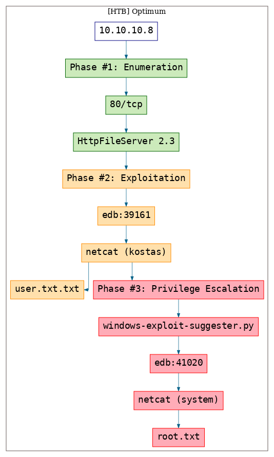


\newpage
## Phase #1: Enumeration
1\. Here's the Nmap scan result:  
``` {.python .numberLines}
# Nmap 7.70 scan initiated Mon Nov  4 17:34:56 2019 as: nmap -vv --reason -Pn -sV -sC --version-all -oN /root/toolbox/writeups/htb.optimum/results/10.10.10.8/scans/_quick_tcp_nmap.txt -oX /root/toolbox/writeups/htb.optimum/results/10.10.10.8/scans/xml/_quick_tcp_nmap.xml 10.10.10.8
Nmap scan report for 10.10.10.8
Host is up, received user-set (0.062s latency).
Scanned at 2019-11-04 17:34:57 PST for 19s
Not shown: 999 filtered ports
Reason: 999 no-responses
PORT   STATE SERVICE REASON          VERSION
80/tcp open  http    syn-ack ttl 127 HttpFileServer httpd 2.3
|_http-favicon: Unknown favicon MD5: 759792EDD4EF8E6BC2D1877D27153CB1
| http-methods:
|_  Supported Methods: GET HEAD POST
|_http-server-header: HFS 2.3
|_http-title: HFS /
Service Info: OS: Windows; CPE: cpe:/o:microsoft:windows

Read data files from: /usr/bin/../share/nmap
Service detection performed. Please report any incorrect results at https://nmap.org/submit/ .
# Nmap done at Mon Nov  4 17:35:16 2019 -- 1 IP address (1 host up) scanned in 19.87 seconds

```

2\. We find `HttpFileServer 2.3` running on the target system. Upon searching for exploits we find multiple hits:  

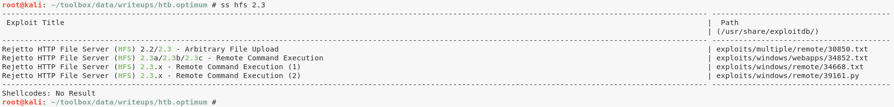  


### Findings
#### Open Ports
``` {.python .numberLines}
80/tcp  |  http  |  HttpFileServer httpd 2.3
```

\newpage
## Phase #2: Exploitation
1\. We use the command execution exploit, slightly modify it to print debug information and get interactive access on the target system:  

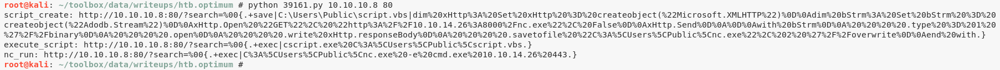  

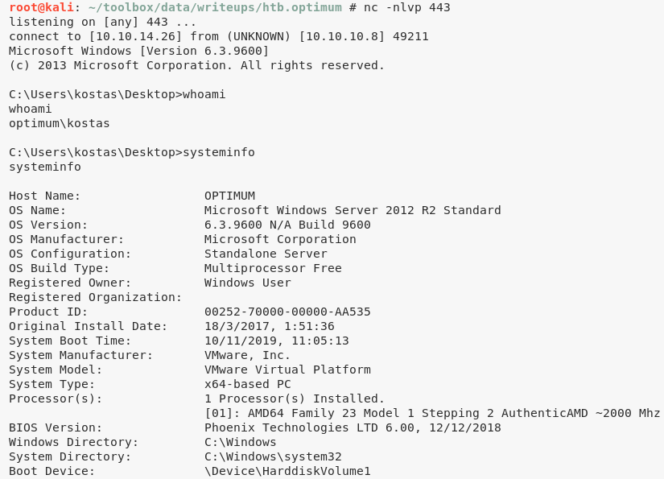  

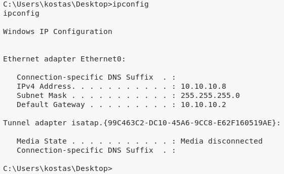  


## Phase #2.5: Post Exploitation
``` {.python .numberLines}
kostas@OPTIMUM> id
optimum\kostas
kostas@OPTIMUM>  
kostas@OPTIMUM> uname
Host Name:                 OPTIMUM
OS Name:                   Microsoft Windows Server 2012 R2 Standard
OS Version:                6.3.9600 N/A Build 9600
OS Manufacturer:           Microsoft Corporation
OS Configuration:          Standalone Server
OS Build Type:             Multiprocessor Free
kostas@OPTIMUM>  
kostas@OPTIMUM> ifconfig
Ethernet adapter Ethernet0
 Connection-specific DNS Suffix  . :
 IPv4 Address. . . . . . . . . . . : 10.10.10.8
 Subnet Mask . . . . . . . . . . . : 255.255.255.0
 Default Gateway . . . . . . . . . : 10.10.10.2
kostas@OPTIMUM>  
kostas@OPTIMUM> users
Administrator
kostas
```

\newpage
## Phase #3: Privilege Escalation
1\. We can now view the contents of the `user.txt.txt` file to get the first flag:  

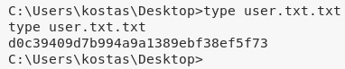  

2\. We now use the `windows-exploit-suggester.py` script to get list of possible privesc vectors. To do this, we first had to download `netcat` onto target system via Powershell and transfer the text output of `systeminfo` command to our local system:  

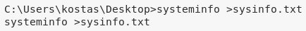  

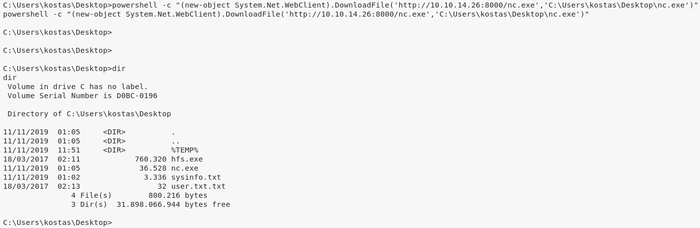  

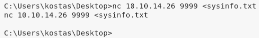  

3\. The `windows-exploit-suggester.py` scripts lists several privesc vectors and we decide to use [EDB:41020](https://www.exploit-db.com/exploits/41020) because it provides a pre-compiled binary ready to used. We again transfer this exploit file to the target system using Powershell:  

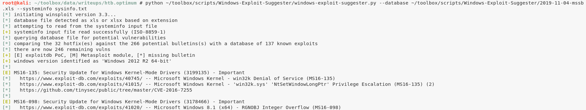  

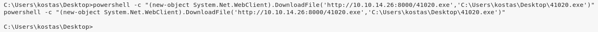  

4\. Once executed, we get elevated privileges on the target system:  

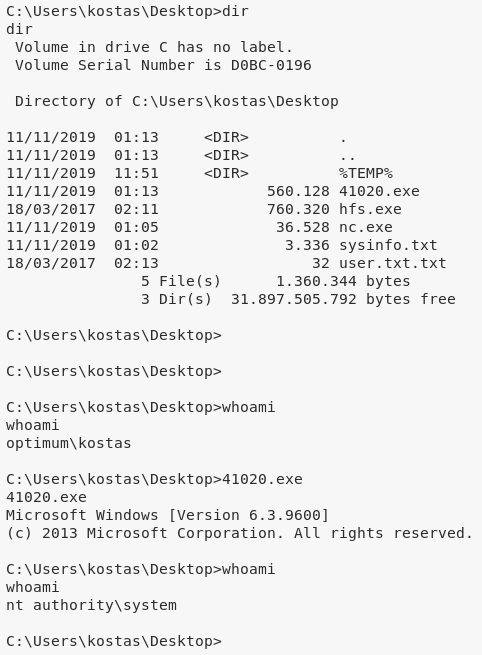  

5\. We can now view the contents of the `root.txt` file to complete the challenge:  

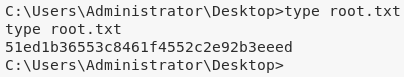  


\newpage

## Loot
### Flags
``` {.python .numberLines}
C:\Users\kostas\Desktop\user.txt.txt: d0c39409d7b994a9a1..............
C:\Users\Administrator\Desktop\root.txt: 51ed1b36553c8461f4..............
```

## References
[+] <https://www.hackthebox.eu/home/machines/profile/6>  
[+] <https://reboare.github.io/hackthebox/htb-optimum.html>  
