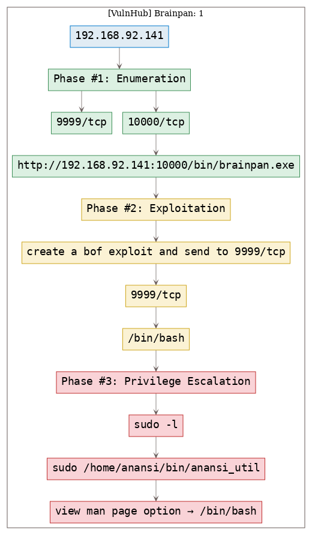

# [[VulnHub] Brainpan: 1](https://www.vulnhub.com/entry/brainpan-1,51/)

**Date**: 31/Aug/2019  
**Categories**: [oscp](https://github.com/7h3rAm/writeups/search?q=oscp&unscoped_q=oscp), [vulnhub](https://github.com/7h3rAm/writeups/search?q=vulnhub&unscoped_q=vulnhub), [linux](https://github.com/7h3rAm/writeups/search?q=linux&unscoped_q=linux)  
**Tags**: [`exploit_bof`](https://github.com/7h3rAm/writeups#exploit_bof), [`privesc_anansi`](https://github.com/7h3rAm/writeups#privesc_anansi), [`privesc_sudo`](https://github.com/7h3rAm/writeups#privesc_sudo)  

## Overview
This is a writeup for VulnHub VM [Brainpan: 1](https://www.vulnhub.com/entry/brainpan-1,51/). Here's an overview of the `enumeration` → `exploitation` → `privilege escalation` process:





\newpage
## Phase #1: Enumeration
1\. Here's the Nmap scan result:  
``` {.python .numberLines}
# Nmap 7.70 scan initiated Wed Jul 31 15:33:35 2019 as: nmap -vv --reason -Pn -sV -sC --version-all -oN /root/toolbox/vulnhub/brainpan/results/192.168.92.141/scans/_quick_tcp_nmap.txt -oX /root/toolbox/vulnhub/brainpan/results/192.168.92.141/scans/xml/_quick_tcp_nmap.xml 192.168.92.141
Nmap scan report for 192.168.92.141
Host is up, received arp-response (0.00077s latency).
Scanned at 2019-07-31 15:33:36 PDT for 44s
Not shown: 998 closed ports
Reason: 998 resets
PORT      STATE SERVICE REASON         VERSION
9999/tcp  open  abyss?  syn-ack ttl 64
| fingerprint-strings:
|   NULL:
|     _| _|
|     _|_|_| _| _|_| _|_|_| _|_|_| _|_|_| _|_|_| _|_|_|
|     _|_| _| _| _| _| _| _| _| _| _| _| _|
|     _|_|_| _| _|_|_| _| _| _| _|_|_| _|_|_| _| _|
|     [________________________ WELCOME TO BRAINPAN _________________________]
|_    ENTER THE PASSWORD
10000/tcp open  http    syn-ack ttl 64 SimpleHTTPServer 0.6 (Python 2.7.3)
| http-methods:
|_  Supported Methods: GET HEAD
|_http-server-header: SimpleHTTP/0.6 Python/2.7.3
|_http-title: Site doesn't have a title (text/html).
1 service unrecognized despite returning data. If you know the service/version, please submit the following fingerprint at https://nmap.org/cgi-bin/submit.cgi?new-service :
SF-Port9999-TCP:V=7.70%I=9%D=7/31%Time=5D421747%P=i686-pc-linux-gnu%r(NULL
SF:,298,"_\|\x20\x20\x20\x20\x20\x20\x20\x20\x20\x20\x20\x20\x20\x20\x20\x
SF:20\x20\x20\x20\x20\x20\x20\x20\x20\x20\x20\x20\x20_\|\x20\x20\x20\x20\x
SF:20\x20\x20\x20\x20\x20\x20\x20\x20\x20\x20\x20\x20\x20\x20\x20\x20\x20\
SF:x20\x20\x20\x20\x20\x20\x20\x20\x20\x20\x20\x20\x20\x20\x20\x20\x20\x20
SF:\n_\|_\|_\|\x20\x20\x20\x20_\|\x20\x20_\|_\|\x20\x20\x20\x20_\|_\|_\|\x
SF:20\x20\x20\x20\x20\x20_\|_\|_\|\x20\x20\x20\x20_\|_\|_\|\x20\x20\x20\x2
SF:0\x20\x20_\|_\|_\|\x20\x20_\|_\|_\|\x20\x20\n_\|\x20\x20\x20\x20_\|\x20
SF:\x20_\|_\|\x20\x20\x20\x20\x20\x20_\|\x20\x20\x20\x20_\|\x20\x20_\|\x20
SF:\x20_\|\x20\x20\x20\x20_\|\x20\x20_\|\x20\x20\x20\x20_\|\x20\x20_\|\x20
SF:\x20\x20\x20_\|\x20\x20_\|\x20\x20\x20\x20_\|\n_\|\x20\x20\x20\x20_\|\x
SF:20\x20_\|\x20\x20\x20\x20\x20\x20\x20\x20_\|\x20\x20\x20\x20_\|\x20\x20
SF:_\|\x20\x20_\|\x20\x20\x20\x20_\|\x20\x20_\|\x20\x20\x20\x20_\|\x20\x20
SF:_\|\x20\x20\x20\x20_\|\x20\x20_\|\x20\x20\x20\x20_\|\n_\|_\|_\|\x20\x20
SF:\x20\x20_\|\x20\x20\x20\x20\x20\x20\x20\x20\x20\x20_\|_\|_\|\x20\x20_\|
SF:\x20\x20_\|\x20\x20\x20\x20_\|\x20\x20_\|_\|_\|\x20\x20\x20\x20\x20\x20
SF:_\|_\|_\|\x20\x20_\|\x20\x20\x20\x20_\|\n\x20\x20\x20\x20\x20\x20\x20\x
SF:20\x20\x20\x20\x20\x20\x20\x20\x20\x20\x20\x20\x20\x20\x20\x20\x20\x20\
SF:x20\x20\x20\x20\x20\x20\x20\x20\x20\x20\x20\x20\x20\x20\x20\x20\x20\x20
SF:\x20_\|\x20\x20\x20\x20\x20\x20\x20\x20\x20\x20\x20\x20\x20\x20\x20\x20
SF:\x20\x20\x20\x20\x20\x20\x20\x20\x20\x20\n\x20\x20\x20\x20\x20\x20\x20\
SF:x20\x20\x20\x20\x20\x20\x20\x20\x20\x20\x20\x20\x20\x20\x20\x20\x20\x20
SF:\x20\x20\x20\x20\x20\x20\x20\x20\x20\x20\x20\x20\x20\x20\x20\x20\x20\x2
SF:0\x20_\|\n\n\[________________________\x20WELCOME\x20TO\x20BRAINPAN\x20
SF:_________________________\]\n\x20\x20\x20\x20\x20\x20\x20\x20\x20\x20\x
SF:20\x20\x20\x20\x20\x20\x20\x20\x20\x20\x20\x20\x20\x20\x20\x20ENTER\x20
SF:THE\x20PASSWORD\x20\x20\x20\x20\x20\x20\x20\x20\x20\x20\x20\x20\x20\x20
SF:\x20\x20\x20\x20\x20\x20\x20\x20\x20\x20\x20\x20\x20\x20\x20\x20\n\n\x2
SF:0\x20\x20\x20\x20\x20\x20\x20\x20\x20\x20\x20\x20\x20\x20\x20\x20\x20\x
SF:20\x20\x20\x20\x20\x20\x20\x20>>\x20");
MAC Address: 00:0C:29:4F:0B:E6 (VMware)

Read data files from: /usr/bin/../share/nmap
Service detection performed. Please report any incorrect results at https://nmap.org/submit/ .
# Nmap done at Wed Jul 31 15:34:20 2019 -- 1 IP address (1 host up) scanned in 45.02 seconds

```

2\. Downloaded file from `http://192.168.92.141:10000/bin/brainpan.exe`.  


### Findings
#### Open Ports
``` {.python .numberLines}
9999/tcp   |  abyss?  |
10000/tcp  |  http    |  SimpleHTTPServer 0.6 (Python 2.7.3)
```
#### Files
``` {.python .numberLines}
http://192.168.92.141:10000/bin/brainpan.exe
```

\newpage
## Phase #2: Exploitation
1\. BoF in a vulnerable service running on `9999/tcp`. File for the vulnerable service is avilable for download via a HTTP server running on `10000/tcp`. Analyze the service, create exploit and gain remote access to VM.  

  


## Phase #2.5: Post Exploitation
``` {.python .numberLines}
puck@brainpan> id
uid=1002(puck) gid=1002(puck) groups=1002(puck)
puck@brainpan>  
puck@brainpan> uname
Linux brianpan 3.5.0-25-generic #39-Ubuntu SMP Mon Feb 25 19:02:34 UTC 2013 i686 i686 i686 GNU/Linux
puck@brainpan>  
puck@brainpan> ifconfig
eth0  Link encap:Ethernet  HWaddr 00:0c:29:4f:0b:e6
      inet addr:192.168.92.141  Bcast:192.168.92.255  Mask:255.255.255.0
      UP BROADCAST RUNNING MULTICAST  MTU:1500  Metric:1
      RX packets:10919 errors:0 dropped:0 overruns:0 frame:0
      TX packets:342 errors:0 dropped:0 overruns:0 carrier:0
      collisions:0 txqueuelen:1000
      RX bytes:742406 (742.4 KB)  TX bytes:39258 (39.2 KB)
puck@brainpan>  
puck@brainpan> users
reynard
anansi
puck
```

\newpage
## Phase #3: Privilege Escalation
1\. There's a binary, `anansi_util` that allows `sudo` access. Running the service, we see that it has 3 options, one of which is to view `man` page for any command. We use this option to escape to shell.  

  


\newpage

## Loot
### Hashes
``` {.python .numberLines}
root:$6$m20VT7lw$172.XYFP3mb9Fbp/IgxPQJJKDgdOhg34jZD5sxVMIx3dKq.DBwv.mw3HgCmRd0QcN4TCzaUtmx4C5DvZa........................
reynard:$6$h54J.qxd$yL5md3J4dONwNl.36iA.mkcabQqRMmeZ0VFKxIVpXeNpfK.mvmYpYsx8W0Xq02zH8bqo2K.mkQzz55U2H........................
anansi:$6$hblZftkV$vmZoctRs1nmcdQCk5gjlmcLUb18xvJa3efaU6cpw9hoOXC/kHupYqQ2qz5O.ekVE.SwMfvRnf.QcB1lyD........................
puck:$6$A/mZxJX0$Zmgb3T6SAq.FxO1gEmbIcBF9Oi7q2eAi0TMMqOhg0pjdgDjBr0p2NBpIRqs4OIEZB4op6ueK888lhO7gc........................
```

## References
[+] <https://www.vulnhub.com/entry/brainpan-1,51/>  
[+] <https://isroot.nl/2019/05/12/vulnhub-write-up-brainpan-1/>  
[+] <https://d7x.promiselabs.net/2018/03/04/ctf-brainpan-1-ctf-walkthrough-introduction-to-exploit-development-part-i/>  
